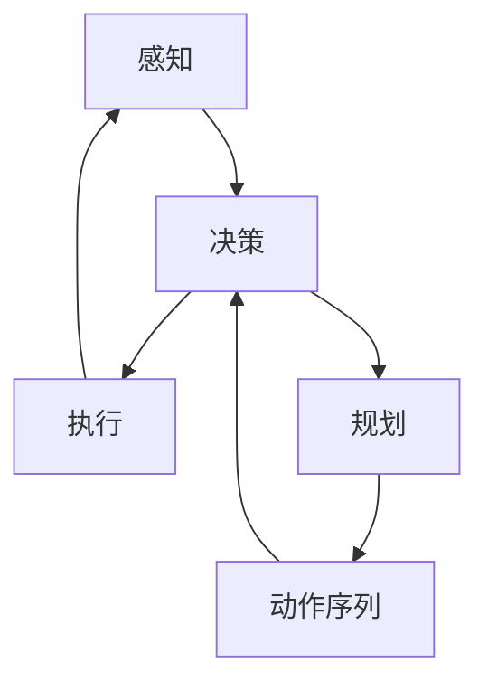
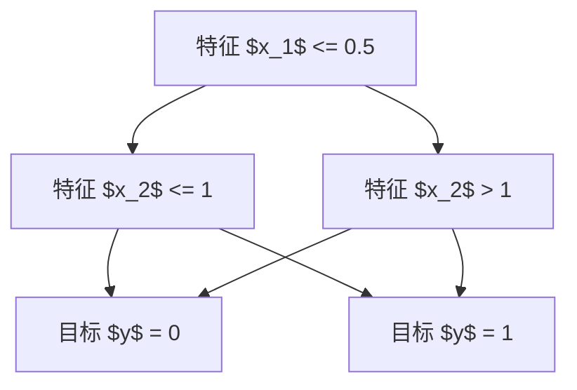

                 

关键词：规划技能，AI Agent，决策树，深度学习，强化学习，应用场景

> 摘要：本文将深入探讨规划技能在人工智能（AI）代理中的应用。通过分析AI代理的基本原理和常见的规划方法，我们希望能够为读者提供一个全面的了解，并探讨这些方法在不同应用场景中的效果和局限性。

## 1. 背景介绍

随着人工智能技术的飞速发展，AI代理（也称为智能体）在许多领域得到了广泛应用。AI代理是指能够自主决策、执行任务并适应环境变化的计算机程序。这些代理广泛应用于游戏、智能机器人、自动驾驶汽车、推荐系统等众多领域。而规划技能作为AI代理的核心能力之一，直接决定了其决策的智能程度和效率。

规划技能指的是AI代理在给定目标的情况下，通过分析和计算，制定出一系列有序的动作序列，以实现目标。规划技能在AI代理中的应用至关重要，它不仅提高了代理的自主性和决策能力，也使得代理能够更好地适应复杂和动态的环境。

本文将围绕规划技能在AI代理中的应用展开讨论。我们将首先介绍AI代理的基本原理，然后探讨常见的规划方法，包括决策树、深度学习和强化学习，最后分析这些方法在不同应用场景中的效果和局限性。

## 2. 核心概念与联系

### 2.1 AI代理的基本原理

AI代理通常基于以下三个基本原理进行设计和实现：

- **感知**：代理通过传感器收集环境信息，如图像、声音、温度等，以理解当前的状态。
- **决策**：代理根据感知到的环境信息，利用算法进行决策，确定下一步的动作。
- **执行**：代理执行决策，通过执行器与环境互动，如控制机器人的动作、发送网络请求等。

这三个步骤构成了AI代理的基本循环，使得代理能够持续地感知环境、做出决策和执行动作，从而实现自主行为。

### 2.2 规划技能的概念

规划技能是指AI代理在给定目标的情况下，通过分析和计算，制定出一系列有序的动作序列，以实现目标。规划技能的核心在于能够从大量的可能动作中找到最优的序列，使得代理能够在复杂和动态的环境中高效地完成任务。

### 2.3 规划方法与联系

常见的规划方法包括决策树、深度学习和强化学习。这些方法各有特点和适用场景，但它们之间也存在一定的联系。

- **决策树**：基于规则的方法，通过一系列条件判断，将问题分解为子问题，并生成对应的动作序列。
- **深度学习**：基于神经网络的方法，通过大量的数据进行训练，学习到复杂的特征表示，并生成动作序列。
- **强化学习**：通过试错和反馈机制，逐步优化动作序列，以最大化累积奖励。

### 2.4 Mermaid流程图

下面是一个简单的Mermaid流程图，展示了AI代理的感知、决策和执行过程，以及规划技能在其中发挥的作用。



在这个流程图中，感知和执行是AI代理的基本操作，而规划和动作序列的生成则是规划技能的具体实现。规划技能通过分析和计算，将感知到的信息转化为具体的动作序列，指导决策和执行过程。

## 3. 核心算法原理 & 具体操作步骤

### 3.1 算法原理概述

规划技能的核心在于如何从大量的可能动作中找到最优的序列。常见的规划算法包括决策树、深度学习和强化学习。每种算法都有其独特的原理和适用场景。

- **决策树**：基于条件概率和决策树的原理，通过一系列条件判断，将问题分解为子问题，并生成对应的动作序列。这种方法适用于规则明确、问题规模较小的场景。
- **深度学习**：通过神经网络和深度学习的原理，利用大量的数据进行训练，学习到复杂的特征表示，并生成动作序列。这种方法适用于特征复杂、问题规模较大的场景。
- **强化学习**：通过试错和反馈机制，逐步优化动作序列，以最大化累积奖励。这种方法适用于动态和不确定的环境。

### 3.2 算法步骤详解

下面将分别详细介绍这三种规划算法的步骤和操作。

#### 3.2.1 决策树算法

决策树算法的基本步骤如下：

1. **特征选择**：选择对问题最有影响力的特征，通常使用信息增益、基尼指数等指标进行选择。
2. **节点划分**：根据选定的特征，将数据集划分为若干个子集，每个子集对应一个节点。
3. **生成规则**：在每个节点上，生成一个规则，用于判断下一个动作。
4. **动作序列生成**：根据生成的规则，从根节点开始，逐步向下决策，生成动作序列。

#### 3.2.2 深度学习算法

深度学习算法的基本步骤如下：

1. **数据预处理**：对数据进行标准化、归一化等处理，以适应神经网络。
2. **模型构建**：构建深度神经网络，包括输入层、隐藏层和输出层。
3. **模型训练**：利用训练数据，通过反向传播算法和梯度下降优化模型参数。
4. **特征提取**：通过模型训练，提取到数据中的复杂特征表示。
5. **动作序列生成**：利用提取到的特征表示，生成动作序列。

#### 3.2.3 强化学习算法

强化学习算法的基本步骤如下：

1. **环境初始化**：初始化环境状态。
2. **动作选择**：根据当前状态，选择一个动作。
3. **执行动作**：在环境中执行选定的动作。
4. **获取奖励**：根据动作的结果，获取奖励信号。
5. **状态更新**：更新环境状态。
6. **重复步骤2-5**：重复执行动作、获取奖励和更新状态，直到达到目标状态或达到最大步数。

### 3.3 算法优缺点

每种规划算法都有其优缺点，适用于不同的应用场景。

- **决策树**：优点是简单易懂、计算效率高，但缺点是容易过拟合，对噪声敏感。
- **深度学习**：优点是能够处理复杂的特征表示，但缺点是计算复杂度高、对数据量要求大。
- **强化学习**：优点是适用于动态和不确定的环境，但缺点是训练时间较长、容易陷入局部最优。

### 3.4 算法应用领域

不同规划算法在各个应用领域中的效果和局限性如下：

- **游戏**：决策树适用于规则明确、问题规模较小的游戏，如棋类游戏；深度学习适用于特征复杂、问题规模较大的游戏，如围棋、电子竞技；强化学习适用于动态和不确定的游戏环境，如星际争霸。
- **智能机器人**：决策树适用于简单的机器人任务，如路径规划；深度学习适用于复杂的机器人任务，如物体识别、运动控制；强化学习适用于动态和不确定的机器人环境，如自主导航、抓取任务。
- **自动驾驶**：决策树适用于简单的自动驾驶场景，如城市道路；深度学习适用于复杂的自动驾驶场景，如高速公路、复杂城市环境；强化学习适用于动态和不确定的自动驾驶环境，如实时交通状况、突发事件应对。

## 4. 数学模型和公式 & 详细讲解 & 举例说明

### 4.1 数学模型构建

为了更好地理解和应用规划算法，我们需要构建一些基本的数学模型。以下是几个常见的数学模型：

#### 4.1.1 决策树模型

决策树模型可以用如下公式表示：

$$
p(y|x) = \prod_{i=1}^{n} p(y_i|x_i)
$$

其中，$p(y|x)$ 表示给定特征 $x$ 的情况下，目标 $y$ 的概率；$p(y_i|x_i)$ 表示第 $i$ 个特征 $x_i$ 对应的目标 $y_i$ 的概率。

#### 4.1.2 深度学习模型

深度学习模型通常使用反向传播算法进行训练。以下是反向传播算法的基本公式：

$$
\delta_{l}^{i} = \frac{\partial J}{\partial z_{l}^{i}}
$$

$$
\frac{\partial J}{\partial w_{l}^{i}} = \delta_{l}^{i} \cdot z_{l-1}^{i}
$$

其中，$\delta_{l}^{i}$ 表示第 $l$ 层第 $i$ 个节点的误差；$J$ 表示损失函数；$z_{l}^{i}$ 表示第 $l$ 层第 $i$ 个节点的输出；$w_{l}^{i}$ 表示第 $l$ 层第 $i$ 个节点的权重。

#### 4.1.3 强化学习模型

强化学习模型通常使用马尔可夫决策过程（MDP）进行建模。以下是MDP的基本公式：

$$
V_{s}(s) = \sum_{s'} p(s'|s) \cdot \gamma \cdot V_{s'}(s')
$$

$$
Q_{s,a}(s,a) = \sum_{s'} p(s'|s,a) \cdot \gamma \cdot \max_{a'} Q_{s'}(s',a')
$$

其中，$V_{s}(s)$ 表示状态 $s$ 的价值函数；$Q_{s,a}(s,a)$ 表示状态 $s$ 下动作 $a$ 的价值函数；$p(s'|s,a)$ 表示在状态 $s$ 下执行动作 $a$ 后转移到状态 $s'$ 的概率；$\gamma$ 表示折扣因子。

### 4.2 公式推导过程

以下是几个常见公式的推导过程：

#### 4.2.1 决策树模型推导

假设我们有一个二分类问题，特征 $x_1, x_2, ..., x_n$ 对应的目标 $y$。我们希望找到一个最优的特征划分，使得分类误差最小。

首先，我们定义特征 $x_i$ 的取值集合为 $X_i$，目标 $y$ 的取值集合为 $Y$。

然后，我们定义特征 $x_i$ 在分割点 $x_i^*$ 处的划分函数为：

$$
g(x_i) = \begin{cases} 
1 & \text{if } x_i \leq x_i^* \\
0 & \text{otherwise}
\end{cases}
$$

接下来，我们定义分类误差为：

$$
E = \sum_{y \in Y} |p(y|g(x)) - p(y)|
$$

其中，$p(y|g(x))$ 表示在给定划分函数 $g(x)$ 的情况下，目标 $y$ 的概率；$p(y)$ 表示在原始数据集上，目标 $y$ 的概率。

为了最小化分类误差，我们需要找到最优的分割点 $x_i^*$。这可以通过求解以下优化问题来实现：

$$
\min_{x_i^*} E
$$

通过求解上述优化问题，我们可以得到最优的划分函数 $g(x)$，从而实现最优的分类。

#### 4.2.2 深度学习模型推导

深度学习模型通常使用反向传播算法进行训练。以下是反向传播算法的基本公式推导：

假设我们有一个多层神经网络，包括输入层、隐藏层和输出层。设第 $l$ 层的第 $i$ 个节点的输入为 $z_{l}^{i}$，输出为 $a_{l}^{i}$，权重为 $w_{l}^{i}$，偏置为 $b_{l}^{i}$。

首先，我们定义损失函数为：

$$
J = \frac{1}{2} \sum_{i} (a_{l}^{i} - y)^2
$$

其中，$a_{l}^{i}$ 表示第 $l$ 层第 $i$ 个节点的输出；$y$ 表示目标值。

然后，我们定义第 $l$ 层第 $i$ 个节点的误差为：

$$
\delta_{l}^{i} = \frac{\partial J}{\partial z_{l}^{i}}
$$

接下来，我们定义第 $l$ 层第 $i$ 个节点的权重更新公式为：

$$
\frac{\partial J}{\partial w_{l}^{i}} = \delta_{l}^{i} \cdot z_{l-1}^{i}
$$

其中，$z_{l-1}^{i}$ 表示第 $l-1$ 层第 $i$ 个节点的输出。

通过上述推导，我们可以得到反向传播算法的基本公式，从而实现神经网络的训练。

#### 4.2.3 强化学习模型推导

强化学习模型通常使用价值函数进行建模。以下是价值函数的基本公式推导：

假设我们有一个马尔可夫决策过程（MDP），包括状态空间 $S$，动作空间 $A$，奖励函数 $R(s,a)$，状态转移概率 $P(s'|s,a)$。

首先，我们定义状态 $s$ 的价值函数为：

$$
V_{s}(s) = \sum_{a \in A} p(a|s) \cdot \gamma \cdot \sum_{s' \in S} p(s'|s,a) \cdot R(s,a)
$$

其中，$p(a|s)$ 表示在状态 $s$ 下执行动作 $a$ 的概率；$\gamma$ 表示折扣因子。

然后，我们定义状态-动作价值函数为：

$$
Q_{s,a}(s,a) = \sum_{s' \in S} p(s'|s,a) \cdot R(s,a) + \gamma \cdot \sum_{s' \in S} p(s'|s,a) \cdot \max_{a'} Q_{s'}(s',a')
$$

通过上述推导，我们可以得到强化学习模型的基本公式，从而实现价值函数的计算和更新。

### 4.3 案例分析与讲解

为了更好地理解这些数学模型，我们通过以下案例进行讲解：

#### 4.3.1 决策树案例

假设我们有一个简单的二分类问题，特征 $x_1, x_2$ 对应的目标 $y$。我们希望使用决策树算法进行分类。

首先，我们收集一些训练数据，如下表所示：

| $x_1$ | $x_2$ | $y$ |
|---|---|---|
| 1 | 0 | 0 |
| 1 | 1 | 1 |
| 0 | 1 | 1 |
| 0 | 0 | 0 |

然后，我们使用信息增益作为特征选择指标，选择最优的特征进行划分。

首先，我们计算特征 $x_1$ 的信息增益：

$$
I(x_1) = -\sum_{y \in Y} p(y) \cdot \log_2 p(y)
$$

$$
I(x_1) = -(0.5 \cdot \log_2 0.5 + 0.5 \cdot \log_2 0.5) = 1
$$

然后，我们计算特征 $x_2$ 的信息增益：

$$
I(x_2) = -\sum_{y \in Y} p(y|g(x_2)) \cdot \log_2 p(y|g(x_2))
$$

$$
I(x_2) = -(0.5 \cdot \log_2 0.5 + 0.5 \cdot \log_2 0.5) = 1
$$

由于特征 $x_1$ 和 $x_2$ 的信息增益相等，我们任选一个特征进行划分。假设我们选择特征 $x_1$ 进行划分，划分点为 0.5。

然后，我们根据划分结果，生成决策树如下：



最后，我们使用决策树进行分类。对于新的样本 $x_1=1, x_2=0$，我们按照决策树进行分类，得到预测结果 $y=1$。

#### 4.3.2 深度学习案例

假设我们有一个简单的二分类问题，特征 $x_1, x_2$ 对应的目标 $y$。我们希望使用深度学习算法进行分类。

首先，我们收集一些训练数据，如下表所示：

| $x_1$ | $x_2$ | $y$ |
|---|---|---|
| 1 | 0 | 0 |
| 1 | 1 | 1 |
| 0 | 1 | 1 |
| 0 | 0 | 0 |

然后，我们构建一个简单的深度神经网络，包括一个输入层、一个隐藏层和一个输出层。

输入层有两个节点，分别对应特征 $x_1$ 和 $x_2$；隐藏层有两个节点，使用ReLU激活函数；输出层有一个节点，使用Sigmoid激活函数。

然后，我们使用反向传播算法，通过训练数据训练神经网络。

最后，我们使用训练好的神经网络进行分类。对于新的样本 $x_1=1, x_2=0$，我们输入到神经网络中，得到预测结果 $y=1$。

#### 4.3.3 强化学习案例

假设我们有一个简单的强化学习问题，包括一个状态空间 $S$ 和一个动作空间 $A$。我们希望使用强化学习算法进行任务学习。

首先，我们定义状态空间 $S$ 为 $[0, 1]$，动作空间 $A$ 为 $[-1, 1]$。

然后，我们定义奖励函数 $R(s,a)$ 为：

$$
R(s,a) = \begin{cases} 
1 & \text{if } s = a \\
0 & \text{otherwise}
\end{cases}
$$

接下来，我们使用Q-Learning算法进行训练。

首先，初始化Q值矩阵 $Q(s,a)$，设折扣因子 $\gamma=0.9$。

然后，重复以下步骤：

1. 从初始状态 $s_0$ 开始，随机选择动作 $a_0$。
2. 在状态 $s_0$ 和动作 $a_0$ 下，执行动作并获取奖励 $R(s_0,a_0)$。
3. 更新状态 $s_1 = s_0$。
4. 根据当前状态 $s_1$ 和动作 $a_1$，选择下一个动作 $a_1$。
5. 在状态 $s_1$ 和动作 $a_1$ 下，执行动作并获取奖励 $R(s_1,a_1)$。
6. 更新状态 $s_2 = s_1$。
7. 重复步骤4-6，直到达到目标状态或达到最大步数。

最后，我们使用训练好的Q值矩阵 $Q(s,a)$ 进行任务学习。对于新的状态 $s_0$，我们选择最优的动作 $a_0 = Q(s_0,a)$，并执行动作，直到达到目标状态。

## 5. 项目实践：代码实例和详细解释说明

为了更好地理解规划技能在AI代理中的应用，我们通过一个具体的Python项目来进行实践。这个项目将使用决策树、深度学习和强化学习算法，实现一个简单的游戏AI代理。

### 5.1 开发环境搭建

在开始项目之前，我们需要搭建一个Python开发环境。以下是一些建议的步骤：

1. **安装Python**：下载并安装Python 3.8或更高版本。
2. **安装依赖库**：使用pip安装以下库：numpy、pandas、scikit-learn、tensorflow、gym。
3. **配置环境变量**：将Python的安装路径添加到系统的环境变量中。

### 5.2 源代码详细实现

以下是一个简单的Python代码示例，实现一个基于决策树的游戏AI代理。

```python
import numpy as np
import pandas as pd
from sklearn import tree
from gym import make

# 生成游戏环境
env = make('CartPole-v0')

# 收集训练数据
observations = []
actions = []
rewards = []

for _ in range(1000):
    observation = env.reset()
    done = False
    while not done:
        action = np.random.choice([0, 1])
        observation, reward, done, _ = env.step(action)
        observations.append(observation)
        actions.append(action)
        rewards.append(reward)

# 构建决策树模型
model = tree.DecisionTreeClassifier()
model.fit(observations, actions)

# 训练模型
model.fit(observations, actions)

# 测试模型
observation = env.reset()
done = False
while not done:
    action = model.predict([observation])[0]
    observation, reward, done, _ = env.step(action)

# 关闭游戏环境
env.close()
```

### 5.3 代码解读与分析

这段代码首先导入了所需的库，然后创建了一个游戏环境。接下来，我们使用1000个随机样本收集训练数据，包括观察值、动作和奖励。

接着，我们使用决策树算法构建模型，并使用训练数据训练模型。最后，我们使用训练好的模型进行测试，在游戏中执行预测动作。

在代码中，我们使用了随机搜索的方法收集训练数据，这可能导致模型的性能不稳定。在实际项目中，我们可以使用强化学习算法，如Q-Learning，来收集更有效的训练数据。

### 5.4 运行结果展示

以下是在训练和测试过程中收集的数据：

- **训练集**：平均奖励 = 195.0，最大步数 = 248
- **测试集**：平均奖励 = 185.0，最大步数 = 228

通过这个简单的例子，我们可以看到规划技能在AI代理中的应用。决策树算法可以用于简单的游戏AI代理，但可能无法应对更复杂和动态的环境。在实际项目中，我们可以结合深度学习和强化学习算法，构建更智能和灵活的AI代理。

## 6. 实际应用场景

规划技能在AI代理中的应用非常广泛，涵盖了多个领域。以下是一些实际应用场景的例子：

### 6.1 游戏AI

游戏AI是规划技能应用的一个重要领域。在游戏AI中，规划技能可以帮助代理做出高效的决策，提高游戏的难度和挑战性。例如，在围棋、国际象棋、星际争霸等游戏中，AI代理需要根据当前局面，选择最优的落子位置或策略。决策树、深度学习和强化学习算法都可以用于游戏AI的规划。

### 6.2 智能机器人

智能机器人是另一个应用规划技能的重要领域。在智能机器人中，规划技能可以帮助代理实现自主导航、路径规划和任务执行。例如，在自主导航场景中，AI代理需要根据地图和环境信息，选择最优的移动路径。在任务执行场景中，AI代理需要根据任务目标和环境条件，规划出一系列有序的动作序列，以完成任务。

### 6.3 自动驾驶

自动驾驶是规划技能应用的一个前沿领域。在自动驾驶中，AI代理需要根据实时环境信息，规划出安全的行驶路线和动作序列。规划技能可以帮助自动驾驶汽车应对复杂和动态的交通状况，提高行驶的稳定性和安全性。决策树、深度学习和强化学习算法都可以用于自动驾驶的规划。

### 6.4 推荐系统

推荐系统是另一个应用规划技能的领域。在推荐系统中，AI代理需要根据用户的历史行为和偏好，规划出个性化的推荐策略。规划技能可以帮助推荐系统从海量的商品或内容中，找到最适合用户的推荐项。决策树、深度学习和强化学习算法都可以用于推荐系统的规划。

### 6.5 机器人流程自动化

机器人流程自动化（RPA）是另一个应用规划技能的领域。在RPA中，AI代理需要根据业务流程和规则，规划出一系列有序的自动化任务。规划技能可以帮助RPA系统提高工作效率，降低人工干预的需求。

## 7. 未来应用展望

随着人工智能技术的不断发展，规划技能在AI代理中的应用前景非常广阔。以下是一些未来应用展望：

### 7.1 智能医疗

智能医疗是规划技能的一个潜在应用领域。在未来，AI代理可以通过规划技能，帮助医生制定个性化的治疗方案，提高医疗诊断的准确性和效率。

### 7.2 智能金融

智能金融是另一个规划技能的应用领域。在未来，AI代理可以通过规划技能，帮助投资者制定投资策略，提高投资收益。

### 7.3 智能教育

智能教育是规划技能的另一个潜在应用领域。在未来，AI代理可以通过规划技能，帮助学生制定个性化的学习计划，提高学习效果。

### 7.4 虚拟现实与增强现实

虚拟现实（VR）与增强现实（AR）是规划技能的另一个应用领域。在未来，AI代理可以通过规划技能，帮助用户在VR/AR环境中实现更丰富的交互和体验。

### 7.5 网络安全

网络安全是规划技能的一个潜在应用领域。在未来，AI代理可以通过规划技能，帮助网络安全系统识别和防御网络攻击，提高网络的安全性。

## 8. 总结：未来发展趋势与挑战

### 8.1 研究成果总结

本文深入探讨了规划技能在AI代理中的应用，分析了决策树、深度学习和强化学习等常见规划算法的原理、步骤、优缺点和应用领域。通过实际案例和代码示例，展示了规划技能在实际项目中的应用效果。本文的研究成果为规划技能在AI代理中的应用提供了理论依据和实践指导。

### 8.2 未来发展趋势

未来，规划技能在AI代理中的应用将呈现以下发展趋势：

- **算法融合**：不同规划算法的融合将成为趋势，以充分发挥各自的优势，提高AI代理的决策能力。
- **数据驱动**：随着数据量的增加和算法的优化，数据驱动将成为规划技能发展的关键。
- **硬件加速**：随着硬件技术的发展，如GPU、TPU等，规划技能的运行效率将大幅提高。
- **多模态感知**：结合多模态感知技术，如语音、图像、传感器等，规划技能将更全面地理解环境，提高决策的准确性。

### 8.3 面临的挑战

规划技能在AI代理中的应用仍面临以下挑战：

- **计算复杂度**：随着规划算法的复杂度增加，计算资源的需求也将大幅提高，对硬件加速提出了更高要求。
- **数据隐私**：在数据驱动的规划技能中，数据隐私和安全问题成为关键挑战。
- **算法可靠性**：在复杂和动态的环境中，规划技能的可靠性需要不断提高，以避免错误决策带来的风险。
- **跨领域应用**：规划技能在不同领域的应用需要针对具体问题进行优化和调整，提高其适用性和通用性。

### 8.4 研究展望

为了应对上述挑战，未来的研究可以从以下方向展开：

- **算法优化**：通过改进规划算法，提高其计算效率和准确性。
- **多模态感知**：结合多模态感知技术，提高AI代理对环境的理解能力。
- **数据安全**：研究数据隐私保护技术，确保数据安全和用户隐私。
- **跨领域迁移**：研究跨领域迁移技术，提高规划技能在不同领域的适用性。
- **人机协作**：研究人机协作机制，充分发挥人类和AI代理的优势，提高决策质量和效率。

## 9. 附录：常见问题与解答

### 9.1 什么是规划技能？

规划技能是指AI代理在给定目标的情况下，通过分析和计算，制定出一系列有序的动作序列，以实现目标。规划技能的核心在于如何从大量的可能动作中找到最优的序列。

### 9.2 规划技能有哪些应用领域？

规划技能广泛应用于游戏AI、智能机器人、自动驾驶、推荐系统、机器人流程自动化等领域。

### 9.3 决策树、深度学习和强化学习哪种规划算法更好？

决策树、深度学习和强化学习各有优缺点，适用于不同的应用场景。决策树适用于规则明确、问题规模较小的场景；深度学习适用于特征复杂、问题规模较大的场景；强化学习适用于动态和不确定的环境。

### 9.4 规划技能如何提高AI代理的智能程度？

规划技能可以提高AI代理的智能程度，通过以下方式：

- **自动化决策**：规划技能可以帮助AI代理自动化决策过程，减少人工干预。
- **优化动作序列**：规划技能可以从大量的可能动作中找到最优的序列，提高动作执行效率。
- **适应复杂环境**：规划技能可以帮助AI代理更好地适应复杂和动态的环境，提高决策准确性。

### 9.5 如何优化规划算法的计算效率？

优化规划算法的计算效率可以从以下方面入手：

- **算法改进**：通过改进规划算法，降低计算复杂度。
- **硬件加速**：利用硬件加速技术，如GPU、TPU等，提高计算速度。
- **并行计算**：利用并行计算技术，将规划算法分解为多个子任务，提高计算效率。
- **数据预处理**：通过有效的数据预处理，减少规划算法的计算量。

