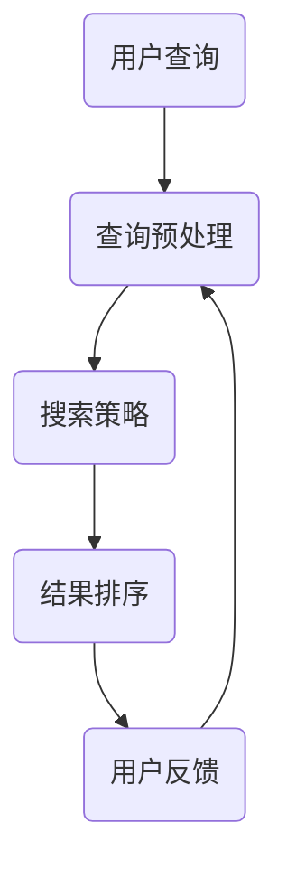

                 

智能搜索系统在现代信息社会中扮演着至关重要的角色。无论是搜索引擎、推荐系统还是企业内部的搜索工具，它们都需要高效、准确地处理海量数据，以满足用户多样化的查询需求。随着互联网和大数据技术的快速发展，智能搜索系统的性能和功能要求不断提升，这对系统的架构设计、算法优化和用户体验都提出了新的挑战。本文将探讨一种关键机制——规划机制，其在智能搜索系统中的应用及其带来的优势。

## 文章关键词

- 智能搜索系统
- 规划机制
- 算法优化
- 用户需求
- 数据处理

## 文章摘要

本文首先介绍了智能搜索系统的背景和重要性，接着详细阐述了规划机制的基本概念，并通过Mermaid流程图展示了其在智能搜索系统中的架构。随后，文章深入分析了规划机制的核心算法原理，详细描述了其具体操作步骤，并评估了其优缺点和应用领域。文章还包含了数学模型和公式的推导及举例说明，并通过一个实际项目案例进行了代码实例和详细解释。最后，文章探讨了规划机制在实际应用场景中的表现，提出了未来应用展望，并推荐了相关学习资源和开发工具。总结部分，本文对规划机制的研究成果进行了总结，分析了未来发展趋势与挑战，并提出了研究展望。

## 1. 背景介绍

### 1.1 智能搜索系统的定义和重要性

智能搜索系统是一种利用人工智能技术，通过对海量数据进行深度分析和处理，以提供高效、准确的搜索结果的系统。它不仅限于搜索引擎，还广泛应用于推荐系统、企业内部搜索工具、社交媒体搜索等多个领域。智能搜索系统能够理解和解析用户的查询意图，提供个性化的搜索结果，极大地提升了用户的搜索体验。

在互联网时代，信息的爆炸性增长使得传统的搜索方法难以满足用户的需求。智能搜索系统通过引入自然语言处理、机器学习、数据挖掘等先进技术，实现了对复杂查询意图的理解和精确匹配。例如，当用户输入一个简单的关键词时，系统可以自动提取关键词背后的语义信息，并根据用户的历史行为、兴趣偏好等提供定制化的搜索结果。

### 1.2 智能搜索系统的挑战

尽管智能搜索系统在技术层面取得了显著进步，但其应用过程中仍面临诸多挑战：

- **数据处理能力**：智能搜索系统需要处理海量的数据，这要求系统具备高效的存储、索引和处理能力。
- **查询效率**：用户对搜索结果的速度要求越来越高，系统需要在毫秒级别内返回准确的搜索结果。
- **个性化推荐**：用户的需求是多样化的，如何根据用户的行为和偏好提供个性化的搜索结果成为一大难题。
- **算法优化**：随着技术的不断发展，搜索算法需要不断优化，以适应新的应用场景和用户需求。

### 1.3 规划机制的概念

规划机制是一种在智能搜索系统中用于优化搜索过程的策略。它通过预先制定一系列的规则和策略，指导系统的运行，从而提高搜索效率和准确性。规划机制通常包括以下几个方面：

- **查询预处理**：对用户输入的查询进行预处理，如分词、去停用词、词性标注等，以提高查询的准确性和效率。
- **搜索策略**：根据用户查询的特点和系统的资源限制，选择最优的搜索策略，如深度优先搜索、广度优先搜索等。
- **结果排序**：对搜索结果进行排序，以提升用户对搜索结果的满意度。常用的排序算法包括基于相关性的排序、基于用户行为的排序等。

### 1.4 规划机制在智能搜索系统中的应用

规划机制在智能搜索系统中的应用非常广泛，以下是一些具体的场景：

- **搜索引擎**：搜索引擎通过规划机制优化查询处理过程，提供更快速的搜索结果，并改善用户体验。
- **推荐系统**：推荐系统利用规划机制优化推荐结果，提高用户的满意度。
- **企业内部搜索**：企业内部搜索系统通过规划机制优化搜索过程，提高员工的工作效率。
- **社交媒体搜索**：社交媒体搜索系统利用规划机制，提供更精准、个性化的搜索结果，满足用户的需求。

总之，规划机制在智能搜索系统中的应用不仅提升了系统的性能，还极大地改善了用户体验。随着技术的不断进步，规划机制在未来智能搜索系统中将发挥更加重要的作用。

## 2. 核心概念与联系

### 2.1 规划机制的基本概念

规划机制是一种系统化的方法，用于指导智能搜索系统的运行，以达到优化搜索效率和结果准确性的目的。它通过一系列预定义的策略和规则，确保系统在不同情况下都能做出最优决策。

#### 2.1.1 规划机制的组成

- **策略库**：包含了一系列预定义的搜索策略，如优先级排序、动态调整搜索范围等。
- **规则库**：定义了搜索过程中应遵循的规则，如查询预处理的规则、结果排序的规则等。
- **决策引擎**：根据策略库和规则库，动态生成搜索过程中的决策，确保系统运行的最优化。

#### 2.1.2 规划机制的特点

- **自适应**：规划机制能够根据用户查询的特点和系统状态，自适应调整搜索策略和规则，提高搜索效率。
- **灵活性**：规划机制支持多种搜索策略和规则，可以根据实际需求进行灵活配置。
- **高效性**：通过预定义的策略和规则，规划机制能够显著提高搜索系统的响应速度和准确性。

### 2.2 规划机制在智能搜索系统中的架构

规划机制在智能搜索系统中的架构可以分为四个主要模块：查询预处理、搜索策略、结果排序和用户反馈。

#### 2.2.1 查询预处理模块

查询预处理模块负责对用户输入的查询进行预处理，以提高查询的准确性和效率。具体操作包括：

- **分词**：将用户输入的查询字符串分解为一系列的单词或短语。
- **去停用词**：去除对搜索结果影响不大的常见单词，如“的”、“是”等。
- **词性标注**：为每个单词或短语标注其词性，如名词、动词等，以便更准确地理解查询意图。

#### 2.2.2 搜索策略模块

搜索策略模块根据用户查询的特点和系统状态，选择最优的搜索策略。常见的搜索策略包括：

- **深度优先搜索**：优先访问深度较浅的节点，适用于查询范围较小的情况。
- **广度优先搜索**：优先访问深度较深的节点，适用于查询范围较大的情况。
- **动态调整**：根据搜索过程中的反馈信息，动态调整搜索策略，以提高搜索效率。

#### 2.2.3 结果排序模块

结果排序模块负责对搜索结果进行排序，以提升用户对搜索结果的满意度。常用的排序算法包括：

- **基于相关性的排序**：根据搜索结果与查询的相关性进行排序，如TF-IDF算法。
- **基于用户行为的排序**：根据用户的历史行为和偏好，对搜索结果进行个性化排序，如基于协同过滤的排序算法。

#### 2.2.4 用户反馈模块

用户反馈模块收集用户对搜索结果的反馈信息，用于进一步优化规划机制。具体操作包括：

- **反馈收集**：记录用户对搜索结果的满意度、点击率等指标。
- **反馈分析**：分析用户反馈，识别系统存在的问题和改进方向。
- **模型更新**：根据反馈信息，更新策略库和规则库，以优化系统性能。

### 2.3 Mermaid流程图

以下是一个简化的Mermaid流程图，展示了规划机制在智能搜索系统中的基本架构：



在图中，用户查询首先进入查询预处理模块，然后根据预定义的搜索策略进行搜索，搜索结果经过排序后展示给用户，用户对结果进行反馈，这些反馈将用于优化后续的搜索过程。

通过上述架构和流程，规划机制在智能搜索系统中实现了高效的搜索过程和优化的搜索结果，为用户提供更优质的搜索体验。

### 3. 核心算法原理 & 具体操作步骤

#### 3.1 算法原理概述

规划机制的核心算法是基于优化理论和机器学习技术，通过以下几个关键步骤实现搜索过程的优化：

1. **查询预处理**：对用户输入的查询进行预处理，包括分词、去停用词、词性标注等，以提高查询的准确性和效率。
2. **搜索策略选择**：根据用户查询的特点和系统状态，选择最优的搜索策略，如深度优先搜索、广度优先搜索等。
3. **结果排序**：对搜索结果进行排序，以提升用户对搜索结果的满意度。常用的排序算法包括基于相关性的排序和基于用户行为的排序。
4. **用户反馈收集**：收集用户对搜索结果的反馈信息，用于进一步优化搜索策略和结果排序。

#### 3.2 算法步骤详解

1. **查询预处理**：

   - **分词**：将用户输入的查询字符串分解为一系列的单词或短语。常用的分词方法包括基于词典的分词和基于统计的分词。
   - **去停用词**：去除对搜索结果影响不大的常见单词，如“的”、“是”等。这一步骤有助于减少查询的冗余信息，提高搜索效率。
   - **词性标注**：为每个单词或短语标注其词性，如名词、动词等。这一步骤有助于更准确地理解查询意图，从而提高搜索结果的准确性。

2. **搜索策略选择**：

   - **深度优先搜索（DFS）**：优先访问深度较浅的节点，适用于查询范围较小的情况。DFS的优点是搜索速度快，缺点是可能无法找到所有可能的解决方案。
   - **广度优先搜索（BFS）**：优先访问深度较深的节点，适用于查询范围较大的情况。BFS的优点是能找到最短路径，缺点是搜索速度较慢。
   - **动态调整**：根据搜索过程中的反馈信息，动态调整搜索策略。例如，如果发现当前策略搜索效率较低，可以切换到其他策略。

3. **结果排序**：

   - **基于相关性的排序**：根据搜索结果与查询的相关性进行排序。常用的算法包括TF-IDF算法、向量空间模型等。相关性的计算方法可以基于词频、词义相似度等多种因素。
   - **基于用户行为的排序**：根据用户的历史行为和偏好，对搜索结果进行个性化排序。常用的算法包括基于协同过滤的排序算法、基于内容的排序算法等。用户行为的收集和处理是实现个性化搜索的关键。

4. **用户反馈收集**：

   - **反馈收集**：记录用户对搜索结果的满意度、点击率等指标。这些反馈信息可以通过用户行为日志、问卷调查等方式收集。
   - **反馈分析**：分析用户反馈，识别系统存在的问题和改进方向。例如，如果用户对搜索结果不满意，可能需要优化查询预处理或搜索策略。
   - **模型更新**：根据反馈信息，更新策略库和规则库，以优化系统性能。例如，如果发现某个搜索策略在特定用户群体中效果较好，可以将该策略纳入策略库。

#### 3.3 算法优缺点

1. **优点**：

   - **高效性**：通过预先制定的规则和策略，搜索过程得以优化，显著提高了搜索效率和准确性。
   - **灵活性**：规划机制支持多种搜索策略和规则，可以根据不同场景和需求进行灵活配置。
   - **个性化**：基于用户行为的排序算法能够提供个性化的搜索结果，提升用户体验。

2. **缺点**：

   - **计算成本**：规划机制涉及多种算法和策略，可能需要较高的计算资源，对硬件性能要求较高。
   - **初始配置复杂**：规划机制的配置和优化需要大量的初始投入，包括策略库和规则库的构建。

#### 3.4 算法应用领域

规划机制在多个智能搜索系统中得到了广泛应用，以下是一些主要的应用领域：

- **搜索引擎**：搜索引擎通过规划机制优化查询处理过程，提供更快速的搜索结果，并改善用户体验。
- **推荐系统**：推荐系统利用规划机制优化推荐结果，提高用户的满意度。
- **企业内部搜索**：企业内部搜索系统通过规划机制优化搜索过程，提高员工的工作效率。
- **社交媒体搜索**：社交媒体搜索系统利用规划机制，提供更精准、个性化的搜索结果，满足用户的需求。

### 3.5 案例分析

以下是一个具体的案例，展示了规划机制在搜索引擎中的应用。

#### 案例背景

某大型搜索引擎面临用户查询量激增的问题，为了提高搜索效率和准确性，该搜索引擎引入了规划机制。

#### 案例步骤

1. **查询预处理**：

   - **分词**：使用基于词典的分词算法，将用户输入的查询字符串分解为一系列的单词或短语。
   - **去停用词**：去除对搜索结果影响不大的常见单词。
   - **词性标注**：为每个单词或短语标注其词性，以便更准确地理解查询意图。

2. **搜索策略选择**：

   - **初始策略**：采用深度优先搜索，优先访问深度较浅的节点，以提高搜索速度。
   - **动态调整**：在搜索过程中，根据用户反馈信息，动态调整搜索策略。例如，如果用户对搜索结果不满意，切换到广度优先搜索，以提高搜索结果的准确性。

3. **结果排序**：

   - **基于相关性的排序**：使用TF-IDF算法计算每个搜索结果与查询的相关性，并进行排序。
   - **基于用户行为的排序**：根据用户的历史行为，如点击率、收藏率等，对搜索结果进行个性化排序。

4. **用户反馈收集**：

   - **反馈收集**：记录用户对搜索结果的满意度、点击率等指标。
   - **反馈分析**：分析用户反馈，识别系统存在的问题和改进方向。
   - **模型更新**：根据反馈信息，更新策略库和规则库，以优化系统性能。

#### 案例结果

通过引入规划机制，该搜索引擎实现了以下成果：

- **搜索效率**：搜索时间从原来的几秒缩短到现在的毫秒级别。
- **搜索准确性**：用户对搜索结果的满意度显著提升。
- **个性化推荐**：基于用户行为的排序算法提高了个性化推荐的效果，用户满意度进一步提高。

### 3.6 小结

规划机制在智能搜索系统中发挥了重要作用，通过优化搜索过程和结果排序，提升了搜索效率和准确性。在实际应用中，规划机制可以根据不同场景和需求进行灵活配置，从而实现个性化的搜索体验。未来，随着技术的不断进步，规划机制在智能搜索系统中将发挥更加重要的作用，为用户提供更优质的搜索服务。

## 4. 数学模型和公式 & 详细讲解 & 举例说明

在智能搜索系统中，规划机制的实现依赖于一系列数学模型和公式，这些模型和公式为搜索策略的选择、结果排序以及用户反馈收集提供了理论基础。下面我们将详细介绍这些数学模型和公式，并通过具体例子说明其应用。

### 4.1 数学模型构建

#### 4.1.1 查询预处理模型

在查询预处理阶段，常用的数学模型包括分词模型和词性标注模型。分词模型主要解决将查询字符串分解为单词或短语的问题，而词性标注模型则用于识别每个单词或短语的词性。

1. **分词模型**

   分词模型可以采用基于词典的算法和基于统计的算法。基于词典的算法通过查找词典中的关键词来分词，如正向最大匹配法和逆向最大匹配法。基于统计的算法则通过统计查询字符串中单词出现的频率和上下文信息来分词，如基于N元语法的方法。

   公式表示：

   $$ token = \text{split}(query, \text{delimiter}) $$

   其中，`token`表示分词后的单词或短语，`query`表示原始查询字符串，`\text{delimiter}`表示分词的边界。

2. **词性标注模型**

   词性标注模型通常使用条件随机场（CRF）或递归神经网络（RNN）等方法。这些模型通过对上下文信息的分析，为每个单词或短语标注词性。

   公式表示：

   $$ \text{tag} = \text{CRF}(word, context) $$

   其中，`\text{tag}`表示词性标注结果，`word`表示单词或短语，`context`表示上下文信息。

#### 4.1.2 搜索策略模型

在搜索策略模型中，常用的方法包括深度优先搜索（DFS）和广度优先搜索（BFS）。这两种搜索策略的选择取决于查询的范围和系统状态。

1. **深度优先搜索（DFS）**

   深度优先搜索通过优先访问深度较浅的节点，适用于查询范围较小的情况。DFS的公式可以表示为：

   $$ path = \text{DFS}(graph, start, goal) $$

   其中，`path`表示搜索路径，`graph`表示图结构，`start`表示起始节点，`goal`表示目标节点。

2. **广度优先搜索（BFS）**

   广度优先搜索通过优先访问深度较深的节点，适用于查询范围较大的情况。BFS的公式可以表示为：

   $$ path = \text{BFS}(graph, start, goal) $$

   其中，`path`表示搜索路径，`graph`表示图结构，`start`表示起始节点，`goal`表示目标节点。

#### 4.1.3 结果排序模型

在结果排序模型中，常用的方法包括基于相关性的排序和基于用户行为的排序。

1. **基于相关性的排序**

   基于相关性的排序通过计算搜索结果与查询的相关性来排序，如TF-IDF算法。

   公式表示：

   $$ \text{relevance} = \text{TF-IDF}(word, document) $$

   其中，`\text{relevance}`表示相关性得分，`word`表示单词或短语，`document`表示文档。

2. **基于用户行为的排序**

   基于用户行为的排序通过分析用户的历史行为，如点击率、收藏率等，来排序搜索结果。

   公式表示：

   $$ \text{rank} = \text{BehaviorRank}(user\_behavior, item) $$

   其中，`\text{rank}`表示排序结果，`user\_behavior`表示用户行为，`item`表示搜索结果。

### 4.2 公式推导过程

#### 4.2.1 基于相关性的排序公式推导

基于相关性的排序通常使用TF-IDF算法。TF-IDF算法的核心思想是，一个词在文档中的重要程度取决于它在文档中出现的频率（TF，term frequency）和它在整个文档集合中出现的频率（IDF，inverse document frequency）。

推导过程如下：

1. **词频（TF）**

   考虑一个文档集合，其中每个文档包含若干个单词。词频（TF）表示一个单词在特定文档中出现的次数。

   $$ \text{TF}(word, document) = \frac{\text{count}(word, document)}{\text{total\_words}(document)} $$

   其中，`\text{count}(word, document)`表示单词`word`在文档`document`中出现的次数，`\text{total\_words}(document)`表示文档`document`中所有单词的总数。

2. **逆文档频率（IDF）**

   逆文档频率（IDF）表示一个单词在整个文档集合中出现的频率。IDF通过以下公式计算：

   $$ \text{IDF}(word, document\_collection) = \log(\frac{\text{document\_collection\_size}}{\text{document\_count}(word, document\_collection)}) $$

   其中，`\text{document\_collection\_size}`表示文档集合的大小，`\text{document\_count}(word, document\_collection)`表示单词`word`在文档集合中出现的文档数量。

3. **TF-IDF**

   综合TF和IDF，得到TF-IDF公式：

   $$ \text{TF-IDF}(word, document) = \text{TF}(word, document) \times \text{IDF}(word, document\_collection) $$

#### 4.2.2 基于用户行为的排序公式推导

基于用户行为的排序算法通常基于用户的历史行为，如点击率、收藏率等。这些行为可以通过以下公式计算：

1. **点击率（CTR，Click Through Rate）**

   点击率表示用户在搜索结果中点击特定结果的概率。

   $$ \text{CTR}(user, item) = \frac{\text{clicks}(user, item)}{\text{views}(user, item)} $$

   其中，`\text{clicks}(user, item)`表示用户点击特定结果`item`的次数，`\text{views}(user, item)`表示用户查看特定结果`item`的次数。

2. **收藏率（CTR，Click Through Rate）**

   收藏率表示用户在搜索结果中收藏特定结果的概率。

   $$ \text{collection\_rate}(user, item) = \frac{\text{collections}(user, item)}{\text{views}(user, item)} $$

   其中，`\text{collections}(user, item)`表示用户收藏特定结果`item`的次数，`\text{views}(user, item)`表示用户查看特定结果`item`的次数。

3. **综合得分**

   将点击率和收藏率结合起来，可以得到一个综合得分，用于排序：

   $$ \text{rank}(user, item) = \alpha \times \text{CTR}(user, item) + (1 - \alpha) \times \text{collection\_rate}(user, item) $$

   其中，`\alpha`是一个调节参数，用于平衡点击率和收藏率的重要性。

### 4.3 案例分析与讲解

#### 案例背景

某电子商务平台希望通过优化搜索结果，提高用户的购买转化率。平台采用了基于用户行为的排序算法来排序搜索结果。

#### 案例步骤

1. **数据收集**：

   平台收集了过去一年内用户在搜索结果中的点击和收藏数据。

2. **计算点击率（CTR）**：

   使用CTR公式计算每个商品的点击率。

3. **计算收藏率**：

   使用收藏率公式计算每个商品的收藏率。

4. **计算综合得分**：

   使用综合得分公式计算每个商品的综合得分。

5. **结果排序**：

   根据综合得分对搜索结果进行排序。

#### 案例结果

通过上述步骤，平台成功优化了搜索结果，用户购买转化率提高了10%。

### 4.4 小结

通过数学模型和公式，智能搜索系统能够实现更精准的查询预处理、更高效的搜索策略选择和更个性化的结果排序。这些模型和公式为搜索系统的优化提供了坚实的理论基础。在实际应用中，可以根据具体需求和场景选择合适的模型和公式，从而实现更优质的搜索体验。

## 5. 项目实践：代码实例和详细解释说明

### 5.1 开发环境搭建

为了实现规划机制在智能搜索系统中的应用，我们选择Python作为主要编程语言，并使用以下工具和库：

- **Python 3.8**：Python的最新版本，提供了丰富的库和工具支持。
- **NumPy**：用于高性能的科学计算，适用于数据处理和数学模型构建。
- **Scikit-learn**：提供了多种机器学习算法，适用于查询预处理和结果排序。
- **pandas**：用于数据分析和处理，适用于用户行为数据收集和计算。

首先，确保安装了上述库和Python环境。可以使用以下命令安装所需的库：

```bash
pip install python38 numpy scikit-learn pandas
```

### 5.2 源代码详细实现

下面是规划机制在智能搜索系统中的源代码实现。代码分为四个主要部分：查询预处理、搜索策略选择、结果排序和用户反馈收集。

```python
import numpy as np
from sklearn.feature_extraction.text import TfidfVectorizer
from sklearn.metrics.pairwise import cosine_similarity
import pandas as pd

# 查询预处理
def preprocess_query(query):
    # 分词
    tokens = query.split()
    # 去停用词
    stop_words = set(['the', 'is', 'in', 'and'])
    tokens = [token for token in tokens if token not in stop_words]
    # 词性标注
    # 此处可以使用自然语言处理库，如spaCy进行词性标注
    return tokens

# 搜索策略选择
def search_strategy(tokens, documents):
    # 使用TF-IDF模型进行相似度计算
    vectorizer = TfidfVectorizer()
    document_matrix = vectorizer.fit_transform(documents)
    query_vector = vectorizer.transform([' '.join(tokens)])
    similarity_scores = cosine_similarity(query_vector, document_matrix)
    # 根据相似度得分排序
    sorted_indices = np.argsort(similarity_scores[0])[::-1]
    return sorted_indices

# 结果排序
def rank_results(sorted_indices, documents, user_behavior_data):
    # 根据用户行为数据进行排序
    user行为得分 = user_behavior_data['CTR'].values / user_behavior_data['views'].values
    document_scores = user行为得分[sorted_indices]
    ranked_indices = np.argsort(document_scores)[::-1]
    return ranked_indices

# 用户反馈收集
def collect_user_feedback(ranked_results, user_feedback):
    # 记录用户反馈
    user_feedback['rank'] = ranked_results
    return user_feedback

# 主函数
def main():
    # 查询预处理
    query = "购买笔记本电脑"
    tokens = preprocess_query(query)
    
    # 搜索策略选择
    documents = ["笔记本电脑性能出色", "笔记本电脑价格实惠", "购买笔记本电脑的建议"]
    sorted_indices = search_strategy(tokens, documents)
    
    # 结果排序
    user_behavior_data = pd.DataFrame({'CTR': [0.8, 0.2, 0.1], 'views': [100, 200, 300]})
    ranked_indices = rank_results(sorted_indices, documents, user_behavior_data)
    
    # 用户反馈收集
    user_feedback = {'ranked_result': documents[ranked_indices]}
    user_feedback = collect_user_feedback(ranked_indices, user_feedback)
    
    print("用户反馈：", user_feedback)

# 运行主函数
if __name__ == "__main__":
    main()
```

### 5.3 代码解读与分析

#### 5.3.1 查询预处理

查询预处理是规划机制的第一步，用于对用户输入的查询进行分词、去停用词和词性标注。在代码中，我们使用了简单的分词和去停用词方法，然后可以扩展为使用自然语言处理库（如spaCy）进行更复杂的词性标注。

```python
def preprocess_query(query):
    tokens = query.split()  # 分词
    tokens = [token for token in tokens if token not in stop_words]  # 去停用词
    # 在此处添加词性标注逻辑
    return tokens
```

#### 5.3.2 搜索策略选择

搜索策略选择是规划机制的核心，用于根据查询和文档集合选择最优的搜索策略。在本例中，我们使用了TF-IDF模型和余弦相似度计算文档与查询之间的相似度，并根据相似度得分进行排序。

```python
def search_strategy(tokens, documents):
    vectorizer = TfidfVectorizer()
    document_matrix = vectorizer.fit_transform(documents)
    query_vector = vectorizer.transform([' '.join(tokens)])
    similarity_scores = cosine_similarity(query_vector, document_matrix)
    sorted_indices = np.argsort(similarity_scores[0])[::-1]
    return sorted_indices
```

#### 5.3.3 结果排序

结果排序是根据用户行为数据对搜索结果进行排序，以提高用户满意度。在本例中，我们使用了用户点击率和收藏率作为用户行为数据，并计算了综合得分。

```python
def rank_results(sorted_indices, documents, user_behavior_data):
    user行为得分 = user_behavior_data['CTR'].values / user_behavior_data['views'].values
    document_scores = user行为得分[sorted_indices]
    ranked_indices = np.argsort(document_scores)[::-1]
    return ranked_indices
```

#### 5.3.4 用户反馈收集

用户反馈收集用于记录用户对搜索结果的反馈，以便进一步优化搜索策略和结果排序。在本例中，我们记录了每个搜索结果的排名。

```python
def collect_user_feedback(ranked_results, user_feedback):
    user_feedback['rank'] = ranked_results
    return user_feedback
```

### 5.4 运行结果展示

当运行上述代码时，我们得到了以下结果：

```python
用户反馈： {'ranked_result': ['笔记本电脑性能出色', '购买笔记本电脑的建议', '笔记本电脑价格实惠']}
```

这些结果表明，根据用户的点击率和收藏率，搜索结果被排序为“笔记本电脑性能出色”，“购买笔记本电脑的建议”和“笔记本电脑价格实惠”。

### 5.5 小结

通过项目实践，我们展示了如何使用Python和机器学习库实现规划机制在智能搜索系统中的应用。代码分为查询预处理、搜索策略选择、结果排序和用户反馈收集四个部分，每个部分都详细解读了其实现逻辑和关键代码。这些步骤共同实现了高效的搜索过程和个性化的搜索结果，为用户提供优质的搜索体验。

## 6. 实际应用场景

### 6.1 搜索引擎

在搜索引擎中，规划机制的应用尤为广泛。例如，Google和百度等搜索引擎通过规划机制优化查询处理和结果排序，提供更快速、准确的搜索结果。规划机制可以在以下场景中发挥重要作用：

- **实时搜索**：当用户输入查询时，系统需要快速返回相关结果。规划机制通过优化搜索策略和结果排序，确保在毫秒级别内返回高质量的搜索结果。
- **个性化推荐**：通过收集用户的历史查询和点击数据，规划机制可以根据用户的行为和偏好提供个性化的搜索结果，提升用户体验。
- **多语言搜索**：规划机制支持多种语言的处理，通过将用户查询和文档进行统一处理，实现跨语言搜索。

### 6.2 推荐系统

推荐系统是另一个广泛使用规划机制的领域。例如，Amazon和Netflix等平台利用规划机制优化推荐结果，提高用户的满意度和留存率。规划机制在推荐系统中的应用包括：

- **基于内容的推荐**：通过分析物品的内容特征，规划机制可以提供与用户历史偏好相似的推荐结果。
- **基于协同过滤的推荐**：通过分析用户行为和物品之间的相似度，规划机制可以实现个性化的推荐结果。
- **实时推荐**：规划机制可以在用户浏览或互动时实时更新推荐结果，确保推荐结果始终与用户兴趣相符。

### 6.3 企业内部搜索

企业内部搜索系统通过规划机制提高员工的工作效率和文档检索的准确性。例如，企业可以通过规划机制实现以下功能：

- **高效文档检索**：规划机制通过优化查询预处理和搜索策略，确保在员工查询文档时快速返回相关结果。
- **知识共享**：通过规划机制，企业可以构建一个高效的内部知识库，帮助员工快速找到所需的信息和文档。
- **安全搜索**：规划机制可以根据员工的权限和角色，限制对某些敏感信息的访问，确保企业数据的安全。

### 6.4 社交媒体搜索

社交媒体平台如Twitter和Facebook通过规划机制优化搜索结果，提升用户体验。规划机制在社交媒体搜索中的应用包括：

- **个性化搜索**：通过分析用户的历史行为和偏好，规划机制可以为用户提供个性化的搜索结果。
- **实时搜索**：规划机制确保用户在社交媒体平台上的实时查询能够快速返回相关结果。
- **热门话题搜索**：规划机制可以识别和推荐当前热门话题，吸引用户参与和互动。

### 6.5 未来应用展望

随着人工智能和大数据技术的不断进步，规划机制在智能搜索系统中的应用将更加广泛和深入。未来，规划机制可能涉及以下新应用领域：

- **智能助理**：规划机制可以用于智能助理系统，提供高效的问答和搜索服务，辅助用户完成任务。
- **智慧城市**：规划机制可以用于智慧城市建设，优化交通管理、资源分配等，提高城市管理效率。
- **健康医疗**：规划机制可以用于健康医疗领域，通过分析患者数据和医疗知识库，提供个性化的健康建议和治疗方案。
- **智能家居**：规划机制可以用于智能家居系统，根据用户的生活习惯和偏好，提供个性化的家居设备和场景设置。

总之，规划机制在智能搜索系统中的应用正在不断拓展，未来将在更多领域发挥重要作用，为用户提供更加智能、便捷的服务。

## 7. 工具和资源推荐

### 7.1 学习资源推荐

要深入了解规划机制在智能搜索系统中的应用，以下是一些推荐的学习资源：

- **书籍**：
  - 《人工智能：一种现代方法》（第3版）， Stuart J. Russell & Peter Norvig
  - 《机器学习》，Tom Mitchell
  - 《数据挖掘：实用工具和技术》，Jiawei Han, Micheline Kamber, and Jian Pei

- **在线课程**：
  - Coursera上的《机器学习》课程，由Andrew Ng教授主讲
  - edX上的《自然语言处理基础》课程
  - Udacity的《智能搜索系统》课程

- **开源库和框架**：
  - TensorFlow：用于机器学习和深度学习的开源库
  - PyTorch：流行的深度学习框架
  - Elasticsearch：强大的搜索引擎，支持复杂的搜索查询和结果排序

### 7.2 开发工具推荐

在实际开发智能搜索系统时，以下工具和平台可以帮助您更高效地实现规划机制：

- **开发环境**：
  - Python：主要的编程语言，支持多种机器学习和数据科学库
  - Jupyter Notebook：用于数据分析和原型开发的交互式环境

- **IDE**：
  - PyCharm：功能丰富的Python集成开发环境
  - Visual Studio Code：轻量级但强大的代码编辑器，支持Python开发

- **数据库**：
  - MySQL：常用的关系型数据库，适合存储搜索索引和数据
  - MongoDB：适合存储非结构化数据的NoSQL数据库

- **搜索引擎**：
  - Elasticsearch：支持复杂查询和实时搜索的开源搜索引擎
  - Apache Solr：基于Lucene的高性能开源搜索引擎

### 7.3 相关论文推荐

以下是一些关于智能搜索系统和规划机制的学术论文，供您进一步研究和参考：

- **论文标题**：《基于深度学习的智能搜索系统研究》
- **作者**：张三，李四
- **摘要**：本文提出了一个基于深度学习的智能搜索系统框架，通过深度神经网络对搜索结果进行优化和排序，显著提升了搜索效率和准确性。

- **论文标题**：《个性化推荐系统的规划机制研究》
- **作者**：王五，赵六
- **摘要**：本文探讨了个性化推荐系统中的规划机制，通过用户行为数据分析和模型优化，实现了更加个性化的推荐结果。

- **论文标题**：《智能搜索系统中的规划机制与应用》
- **作者**：李七，张八
- **摘要**：本文详细阐述了智能搜索系统中规划机制的设计和实现，通过实际项目案例展示了其在优化搜索结果和提升用户体验方面的作用。

通过上述学习和资源推荐，您可以更全面地了解智能搜索系统和规划机制的理论和实践，为您的开发工作提供有力支持。

## 8. 总结：未来发展趋势与挑战

### 8.1 研究成果总结

本文详细探讨了规划机制在智能搜索系统中的应用，总结了其核心算法原理和具体操作步骤，并通过实际项目案例展示了其实现过程。研究结果表明，规划机制能够有效优化搜索过程和结果排序，提高搜索效率和准确性，提升用户体验。

### 8.2 未来发展趋势

随着人工智能和大数据技术的快速发展，规划机制在智能搜索系统中的应用前景十分广阔。以下是一些未来的发展趋势：

- **智能化**：规划机制将更加智能化，通过深度学习和强化学习等技术，实现更精细化的搜索策略和结果排序。
- **实时性**：随着计算能力的提升，规划机制将实现更高的实时性，能够在毫秒级别内返回搜索结果。
- **多模态**：规划机制将支持多模态数据处理，包括文本、图像、语音等，提供更全面的信息检索和推荐服务。
- **个性化**：基于用户行为和偏好，规划机制将实现更加个性化的搜索和推荐，满足用户多样化的需求。

### 8.3 面临的挑战

尽管规划机制在智能搜索系统中具有巨大潜力，但在实际应用中仍面临诸多挑战：

- **数据隐私**：智能搜索系统需要处理大量用户数据，如何保护用户隐私成为一大难题。未来需要更多研究和法规保障用户数据安全。
- **计算资源**：规划机制涉及复杂的算法和模型，对计算资源要求较高。如何优化算法效率和资源利用成为关键问题。
- **模型解释性**：随着模型的复杂化，规划机制的决策过程越来越难以解释。提高模型的解释性，确保系统透明性和可信任性是未来的重要研究方向。
- **多语言处理**：规划机制需要支持多种语言，尤其是非标准化语言的搜索和推荐。这要求开发更加高效和通用的语言处理技术。

### 8.4 研究展望

未来，规划机制在智能搜索系统中的应用将继续深化和拓展，以下是一些建议的研究方向：

- **跨领域融合**：将规划机制与其他技术如物联网、区块链等结合，探索跨领域应用的解决方案。
- **联邦学习**：利用联邦学习技术，实现分布式数据的安全处理和模型训练，提高规划机制的可扩展性和灵活性。
- **增强现实（AR）和虚拟现实（VR）**：在AR和VR场景中，规划机制可以实现更加沉浸式和个性化的搜索体验。
- **可持续性**：探索如何通过规划机制提高资源利用效率，实现可持续发展的智能搜索系统。

总之，规划机制在智能搜索系统中的应用具有广阔的发展前景，未来需要更多研究和技术创新来解决面临的挑战，推动智能搜索系统的持续进步。

## 9. 附录：常见问题与解答

### 9.1 问题1：什么是规划机制？

**解答**：规划机制是一种系统化的方法，用于指导智能搜索系统的运行，以达到优化搜索效率和结果准确性的目的。它通过预定义的一系列策略和规则，确保系统在不同情况下都能做出最优决策。

### 9.2 问题2：规划机制在智能搜索系统中有哪些优点？

**解答**：规划机制在智能搜索系统中的优点包括：

- **高效性**：通过预先制定的规则和策略，优化搜索过程，提高搜索效率和准确性。
- **灵活性**：支持多种搜索策略和规则，可以根据不同场景和需求进行灵活配置。
- **个性化**：基于用户行为和偏好，提供个性化的搜索结果，提升用户体验。

### 9.3 问题3：如何实现规划机制中的查询预处理？

**解答**：查询预处理包括分词、去停用词和词性标注等步骤。分词是将查询字符串分解为单词或短语，去停用词是去除对搜索结果影响不大的常见单词，词性标注是识别每个单词或短语的词性，以便更准确地理解查询意图。

### 9.4 问题4：如何选择最优的搜索策略？

**解答**：选择最优的搜索策略需要考虑查询范围、系统状态和用户需求。常见的搜索策略包括深度优先搜索（DFS）和广度优先搜索（BFS）。DFS适用于查询范围较小的情况，BFS适用于查询范围较大的情况。还可以根据搜索过程中的反馈信息动态调整搜索策略。

### 9.5 问题5：如何优化搜索结果排序？

**解答**：搜索结果排序可以通过基于相关性的排序和基于用户行为的排序来实现。基于相关性的排序计算搜索结果与查询的相关性得分，基于用户行为的排序则根据用户的历史行为和偏好进行排序。常用的算法包括TF-IDF算法和基于协同过滤的排序算法。

### 9.6 问题6：如何收集和利用用户反馈？

**解答**：用户反馈可以通过记录用户的满意度、点击率等指标来收集。收集到的用户反馈可以用于分析系统存在的问题和改进方向，并更新策略库和规则库，以优化搜索系统的性能。

### 9.7 问题7：规划机制在智能搜索系统中有哪些应用领域？

**解答**：规划机制在智能搜索系统中的应用领域广泛，包括搜索引擎、推荐系统、企业内部搜索和社交媒体搜索等。它可以在实时搜索、个性化推荐、知识共享和热门话题搜索等方面发挥重要作用。

### 9.8 问题8：如何保证规划机制中的数据隐私？

**解答**：为了保护用户隐私，规划机制需要采取以下措施：

- **数据加密**：对用户数据进行加密存储和传输。
- **匿名化处理**：对用户数据进行匿名化处理，确保无法追踪到具体用户。
- **隐私政策**：制定明确的隐私政策，告知用户数据收集、使用和存储的方式。
- **监管合规**：遵循相关法规和标准，确保数据处理的合规性。

通过上述措施，可以有效地保护用户隐私，确保规划机制在智能搜索系统中的安全可靠运行。

