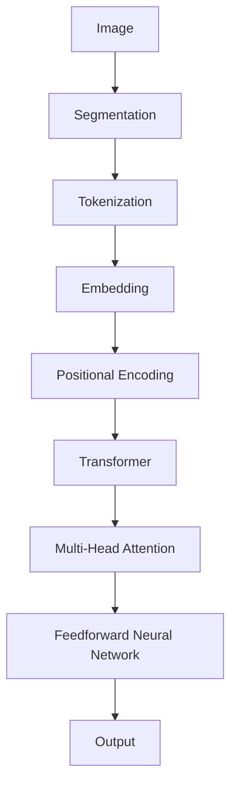

                 

### 1. 背景介绍

Transformer架构自从在2017年由Google提出以来，迅速成为自然语言处理领域的核心模型。它通过自注意力机制（Self-Attention）和多头注意力（Multi-Head Attention）实现了对输入数据的全局信息建模，从而在多项任务中取得了显著的性能提升。然而，Transformer架构在处理图像这类具有强空间结构的任务时，并不直接适用。因此，视觉Transformer（ViT）模型应运而生，它结合了Transformer与卷积神经网络（CNN）的优势，为图像处理任务带来了全新的解决方案。

视觉Transformer模型的出现，标志着计算机视觉领域的一个重要转折点。传统上，计算机视觉主要依赖于深度卷积神经网络，这类网络通过多层卷积和池化操作，从低级特征逐步提取到高级特征，从而实现图像分类、目标检测等任务。然而，随着数据量和计算资源的增加，CNN模型的复杂度和训练时间也不断攀升，这使得在处理大规模图像数据时面临很大挑战。

视觉Transformer模型的提出，改变了这一现状。它通过引入Transformer的注意力机制，能够在较短时间内处理复杂的图像数据，并且具备更强的跨尺度、跨区域的特征提取能力。这使得视觉Transformer模型在多种计算机视觉任务中取得了显著的性能提升，引起了学术界和工业界的高度关注。

本文将详细讲解视觉Transformer的基本原理、架构设计、核心算法以及应用实例。通过对视觉Transformer的深入剖析，我们希望读者能够理解其优势和应用场景，从而为未来的研究和实践提供参考。

### 2. 核心概念与联系

在深入探讨视觉Transformer之前，我们首先需要了解其核心概念与联系，这包括Transformer架构的基本原理、自注意力机制、多头注意力以及如何将它们应用于图像处理任务。

#### 2.1 Transformer架构的基本原理

Transformer架构的核心思想是自注意力机制（Self-Attention），它允许模型在处理每个输入时，能够自动关注输入序列中的其他部分，从而捕捉全局依赖关系。这种机制使得模型在处理序列数据时能够更加高效地利用信息，避免了传统卷积神经网络中的层次化特征提取问题。

自注意力机制通过计算输入序列中每个元素与其他元素之间的相似度，并加权求和，从而生成一个表示这些元素的集成特征。这一过程可以分为以下几个步骤：

1. **输入嵌入（Input Embedding）**：将输入序列（如词向量、像素值）转化为嵌入向量。
2. **位置编码（Positional Encoding）**：由于Transformer架构没有固定的序列顺序，因此需要引入位置编码来表示输入序列的相对位置信息。
3. **多头注意力（Multi-Head Attention）**：将自注意力机制扩展到多个头，每个头关注输入序列的不同部分，从而捕获更多的特征。
4. **前馈神经网络（Feedforward Neural Network）**：对多头注意力层的结果进行进一步的非线性变换。

#### 2.2 自注意力机制

自注意力机制的核心是计算输入序列中每个元素与其他元素之间的相似度。具体来说，自注意力机制通过三个查询（Query）、键（Key）和值（Value）向量来实现。其中，查询向量表示模型对输入的期望，键向量表示输入序列中的每个元素，而值向量表示输入序列中每个元素对查询的响应。

自注意力机制的公式可以表示为：

\[ \text{Attention}(Q, K, V) = \text{softmax}\left(\frac{QK^T}{\sqrt{d_k}}\right)V \]

其中，\( Q, K, V \) 分别是查询、键和值矩阵，\( d_k \) 是键向量的维度，\( \text{softmax} \) 函数用于计算每个键与查询的相似度，并加权求和值向量。

#### 2.3 多头注意力

多头注意力是自注意力机制的扩展，通过将输入序列分割成多个子序列，每个子序列对应一个注意力头。多个头能够同时关注输入序列的不同部分，从而捕获更多的特征信息。多头注意力通过以下公式实现：

\[ \text{MultiHead}(Q, K, V) = \text{Concat}(\text{head}_1, ..., \text{head}_h)W^O \]

其中，\( \text{head}_i = \text{Attention}(QW_i^Q, KW_i^K, VW_i^V) \)，\( W_i^Q, W_i^K, W_i^V, W^O \) 分别是第 \( i \) 个注意力头的权重矩阵，\( W^O \) 是输出权重矩阵。

#### 2.4 Transformer在图像处理中的应用

将Transformer应用于图像处理，首先需要将图像转化为序列数据。一种常用的方法是图像切片（Image Segmentation），即将图像划分为一系列连续的块，并将每个块视为序列中的一个元素。这样，图像可以被视为一个序列数据，从而可以使用Transformer模型进行特征提取和任务学习。

此外，视觉Transformer模型还可以与卷积神经网络相结合，形成ViT-CNN（Visual Transformer with Convolutional Neural Networks）架构。这种架构将卷积神经网络用于特征提取，而将Transformer用于任务学习，从而结合了两者在特征提取和任务学习方面的优势。

下面是视觉Transformer模型在图像处理任务中的架构：



在这个架构中，图像首先通过切片和编码转化为序列数据，然后通过Transformer模型进行特征提取和任务学习，最终输出预测结果。这种架构能够充分利用Transformer在处理序列数据方面的优势，同时结合卷积神经网络在特征提取方面的能力，为图像处理任务提供强大的支持。

### 3. 核心算法原理 & 具体操作步骤

#### 3.1 算法原理概述

视觉Transformer（ViT）模型的核心在于将Transformer架构应用于图像处理任务。其基本原理如下：

1. **图像切片（Image Segmentation）**：将图像划分为若干个固定大小的块（或称为token），每个块代表一个序列元素。
2. **Tokenization**：对每个图像块进行特征提取，生成一个固定长度的特征向量。
3. **Embedding & Positional Encoding**：对特征向量进行嵌入和位置编码，从而生成嵌入向量。
4. **Transformer Encoder**：将嵌入向量输入到Transformer编码器中，通过多头自注意力机制和前馈神经网络进行特征提取。
5. **Output**：编码器的输出通常是一个固定维度的向量，用于分类、检测等下游任务。

#### 3.2 算法步骤详解

1. **图像切片（Image Segmentation）**：

   首先，我们需要将图像划分为若干个固定大小的块。这些块可以采用不同的策略进行划分，例如固定大小、滑动窗口等。

   例如，我们可以将图像划分为 \( 16 \times 16 \) 块，每个块代表一个序列元素。这样，一个 \( 128 \times 128 \) 的图像将被划分为 \( 8 \times 8 \) 的块。

2. **Tokenization**：

   接下来，对每个图像块进行特征提取，生成一个固定长度的特征向量。常用的方法有卷积神经网络、特征提取器等。

   例如，我们可以使用一个卷积神经网络，对每个图像块进行卷积操作，生成一个 \( 512 \) 维的特征向量。

3. **Embedding & Positional Encoding**：

   对特征向量进行嵌入和位置编码，从而生成嵌入向量。嵌入向量用于表示每个图像块，而位置编码用于表示图像块之间的相对位置。

   嵌入向量可以通过简单的全连接层实现，例如：

   \[ \text{embed}(x) = \text{ReLU}(\text{Linear}(x)) \]

   位置编码可以通过以下公式计算：

   \[ \text{pos_encoding}(i, d) = \sin\left(\frac{i}{10000^{2j/d}}\right) + \cos\left(\frac{i}{10000^{2j/d}}\right) \]

   其中，\( i \) 表示位置索引，\( d \) 表示嵌入向量的维度，\( j \) 表示嵌入向量的维度。

4. **Transformer Encoder**：

   将嵌入向量输入到Transformer编码器中，通过多头自注意力机制和前馈神经网络进行特征提取。

   Transformer编码器通常由多个层组成，每层包含多头自注意力机制和前馈神经网络。以下是一个简单的Transformer编码器示例：

   ```python
   class TransformerEncoder(nn.Module):
       def __init__(self, d_model, nhead, num_layers):
           super(TransformerEncoder, self).__init__()
           self.d_model = d_model
           self.nhead = nhead
           self.num_layers = num_layers
           self.layers = nn.ModuleList([TransformerEncoderLayer(d_model, nhead) for _ in range(num_layers)])
       
       def forward(self, src, src_mask=None, src_key_padding_mask=None):
           output = src
           for layer in self.layers:
               output = layer(output, src_mask=src_mask, src_key_padding_mask=src_key_padding_mask)
           return output
   ```

5. **Output**：

   编码器的输出通常是一个固定维度的向量，用于分类、检测等下游任务。例如，我们可以使用一个全连接层，将编码器的输出映射到分类标签。

   ```python
   class ClassificationHead(nn.Module):
       def __init__(self, d_model, num_classes):
           super(ClassificationHead, self).__init__()
           self.fc = nn.Linear(d_model, num_classes)
       
       def forward(self, x):
           x = self.fc(x)
           return x
   ```

   最终，视觉Transformer模型的输出可以通过以下步骤获得：

   ```python
   class VisionTransformer(nn.Module):
       def __init__(self, d_model, nhead, num_classes, num_layers):
           super(VisionTransformer, self).__init__()
           self.encoder = TransformerEncoder(d_model, nhead, num_layers)
           self.classification_head = ClassificationHead(d_model, num_classes)
       
       def forward(self, x):
           x = self.encoder(x)
           x = self.classification_head(x.mean(dim=1))
           return x
   ```

   以上代码定义了一个简单的视觉Transformer模型，它将图像块输入到编码器中，通过自注意力机制和前馈神经网络进行特征提取，最终输出分类标签。

#### 3.3 算法优缺点

**优点**：

1. **强大的特征提取能力**：视觉Transformer通过自注意力机制，能够捕捉图像中的全局依赖关系，从而提取丰富的特征。
2. **灵活的模型架构**：视觉Transformer模型可以灵活地调整层数、头数等参数，以适应不同的图像处理任务。
3. **高效的训练速度**：与传统的卷积神经网络相比，视觉Transformer在训练速度上有显著提升，尤其是在大规模图像数据集上。

**缺点**：

1. **内存消耗较大**：由于视觉Transformer需要对图像进行切片和编码，因此模型的内存消耗相对较大，特别是对于大型图像。
2. **计算复杂度较高**：视觉Transformer模型中的多头注意力机制和前馈神经网络计算复杂度较高，可能会导致训练时间较长。
3. **泛化能力有限**：视觉Transformer在处理具有强空间结构的任务时，可能不如传统的卷积神经网络具有泛化能力。

#### 3.4 算法应用领域

视觉Transformer模型在以下领域表现出色：

1. **图像分类**：视觉Transformer能够有效处理图像分类任务，尤其是在大型图像数据集上，性能表现优异。
2. **目标检测**：通过将视觉Transformer与目标检测框架（如Faster R-CNN、RetinaNet等）结合，可以实现高效的目标检测。
3. **图像分割**：视觉Transformer在图像分割任务中，能够提取丰富的特征，从而实现高精度的图像分割。

此外，视觉Transformer还可以应用于其他图像处理任务，如人脸识别、图像增强、图像生成等。

### 4. 数学模型和公式 & 详细讲解 & 举例说明

#### 4.1 数学模型构建

视觉Transformer（ViT）模型在数学上可以被视为一个复杂的神经网络，它由多个层次构成，每个层次都包含一系列数学操作。以下是视觉Transformer模型的主要数学模型构建过程：

1. **输入表示**：假设输入图像为 \( X \)，其维度为 \( (C, H, W) \)，其中 \( C \) 表示通道数，\( H \) 和 \( W \) 分别表示高度和宽度。首先，我们需要对图像进行切片，将其划分为若干个固定大小的块（Token）。设每个块的大小为 \( T \times T \)，则可以得到 \( N = (H/T) \times (W/T) \) 个块。

2. **Token化**：对每个图像块进行特征提取，生成一个固定长度的特征向量。通常，我们可以使用卷积神经网络或预训练的图像特征提取器（如ResNet）来完成这一步骤。设特征向量为 \( X_i \)，其维度为 \( D \)。

3. **嵌入与位置编码**：将特征向量进行嵌入和位置编码，生成嵌入向量 \( X_i^e \)。嵌入向量用于表示图像块，而位置编码用于表示图像块之间的相对位置。嵌入操作可以表示为：

   \[ X_i^e = \text{Embed}(X_i) \]

   其中，\( \text{Embed} \) 表示嵌入函数，通常是一个线性层。位置编码可以表示为：

   \[ \text{pos}_i = \text{PosEnc}(i) \]
   \[ X_i^e = X_i + \text{pos}_i \]

   其中，\( i \) 表示块的位置索引，\( \text{PosEnc} \) 表示位置编码函数。

4. **Transformer编码器**：将嵌入向量输入到Transformer编码器中，通过多头自注意力机制和前馈神经网络进行特征提取。假设编码器的层数为 \( L \)，每个层的维度为 \( D \)，则编码器的输出可以表示为：

   \[ Y_l = \text{Encoder}(X_l^e) \]

   其中，\( l \) 表示编码器的层次。

5. **输出层**：编码器的输出通常是一个固定维度的向量，用于分类、检测等下游任务。设输出层为 \( L' \)，其维度为 \( K \)，则输出可以表示为：

   \[ Y = \text{Output}(Y_L) \]

   其中，\( \text{Output} \) 表示输出函数，通常是一个线性层。

#### 4.2 公式推导过程

视觉Transformer模型的数学推导主要包括以下几个方面：

1. **嵌入与位置编码**：

   首先，我们需要对输入图像进行切片和特征提取，生成特征向量 \( X_i \)。然后，对每个特征向量进行嵌入和位置编码，得到嵌入向量 \( X_i^e \)。

   嵌入操作可以表示为：

   \[ X_i^e = \text{Embed}(X_i) \]

   其中，\( \text{Embed} \) 是一个线性层，其权重矩阵为 \( W_e \)，则：

   \[ X_i^e = X_iW_e \]

   位置编码可以表示为：

   \[ \text{pos}_i = \text{PosEnc}(i) \]
   \[ X_i^e = X_i + \text{pos}_i \]

   其中，\( \text{PosEnc} \) 是一个位置编码函数，通常是一个非线性函数，例如：

   \[ \text{pos}_i = \sin\left(\frac{i}{10000^{2j/d}}\right) + \cos\left(\frac{i}{10000^{2j/d}}\right) \]

   其中，\( i \) 是块的位置索引，\( j \) 是嵌入向量的维度，\( d \) 是块的数量。

2. **多头自注意力**：

   将嵌入向量输入到多头自注意力机制中，通过计算查询（Query）、键（Key）和值（Value）之间的相似度，生成加权求和的结果。设自注意力的头数为 \( h \)，则：

   \[ \text{Attention}(Q, K, V) = \text{softmax}\left(\frac{QK^T}{\sqrt{d_k}}\right)V \]

   其中，\( Q, K, V \) 分别是查询、键和值矩阵，\( d_k \) 是键向量的维度。对于每个头 \( i \)，有：

   \[ \text{head}_i = \text{Attention}(QW_i^Q, KW_i^K, VW_i^V) \]

   则多头自注意力可以表示为：

   \[ Y_i = \text{Concat}(\text{head}_1, ..., \text{head}_h)W^O \]

   其中，\( W_i^Q, W_i^K, W_i^V, W^O \) 分别是第 \( i \) 个注意力头的权重矩阵。

3. **前馈神经网络**：

   对多头自注意力层的输出进行进一步的非线性变换，通过前馈神经网络进行特征提取。前馈神经网络可以表示为：

   \[ Y_{ff} = \text{ReLU}(\text{Linear}(Y_i)) \]

   其中，\( \text{Linear} \) 是一个线性层，\( \text{ReLU} \) 是一个ReLU激活函数。

4. **编码器**：

   将多头自注意力层和前馈神经网络堆叠在一起，构成一个Transformer编码器。设编码器的层数为 \( L \)，则编码器的输出可以表示为：

   \[ Y_l = \text{Encoder}(X_l^e) \]

   其中，\( \text{Encoder} \) 表示Transformer编码器，其包含多个层，每层由多头自注意力层和前馈神经网络组成。

5. **输出层**：

   编码器的输出通常是一个固定维度的向量，用于分类、检测等下游任务。设输出层为 \( L' \)，其维度为 \( K \)，则输出可以表示为：

   \[ Y = \text{Output}(Y_L) \]

   其中，\( \text{Output} \) 表示输出函数，通常是一个线性层。

#### 4.3 案例分析与讲解

为了更好地理解视觉Transformer模型的数学推导和应用，我们通过一个简单的例子来进行分析和讲解。

假设我们有一个 \( 32 \times 32 \) 的图像，需要对其进行分类。我们将其划分为 \( 4 \times 4 \) 的块，并使用ResNet18作为特征提取器。每个块的特征向量维度为 \( 512 \)。

1. **Token化**：

   将 \( 32 \times 32 \) 的图像划分为 \( 4 \times 4 \) 的块，共 \( 16 \) 个块。对每个块进行特征提取，生成特征向量 \( X_i \)，其维度为 \( 512 \)。

2. **嵌入与位置编码**：

   对每个特征向量进行嵌入和位置编码，生成嵌入向量 \( X_i^e \)。嵌入向量可以表示为：

   \[ X_i^e = X_i + \text{pos}_i \]

   其中，\( X_i \) 是特征向量，\( \text{pos}_i \) 是位置编码。

3. **Transformer编码器**：

   将嵌入向量输入到Transformer编码器中，通过多头自注意力机制和前馈神经网络进行特征提取。假设编码器的层数为 \( 4 \)，每个层的维度为 \( 512 \)。

4. **输出层**：

   编码器的输出是一个固定维度的向量，用于分类。假设输出层为 \( 1000 \)，则输出可以表示为：

   \[ Y = \text{Output}(Y_L) \]

   其中，\( \text{Output} \) 表示输出函数，是一个线性层。

通过以上步骤，我们可以得到视觉Transformer模型的完整数学表示和推导。这个例子展示了如何将视觉Transformer应用于图像分类任务，并详细分析了每个步骤的数学原理和推导过程。

### 5. 项目实践：代码实例和详细解释说明

#### 5.1 开发环境搭建

要实践视觉Transformer（ViT）模型，我们需要搭建一个合适的开发环境。以下是在常见操作系统（如Ubuntu 18.04、Windows 10等）上搭建ViT模型所需的环境和步骤。

1. **安装Python**：确保Python版本在3.7及以上。可以从Python官网下载并安装Python。

2. **安装PyTorch**：PyTorch是用于构建和训练深度学习模型的主要框架。安装命令如下：

   ```bash
   pip install torch torchvision
   ```

3. **安装其他依赖**：根据需要安装其他依赖，如NumPy、Matplotlib等。安装命令如下：

   ```bash
   pip install numpy matplotlib
   ```

4. **配置GPU支持**：如果您的系统配备有NVIDIA GPU，确保已安装NVIDIA CUDA和cuDNN。配置PyTorch以支持GPU加速，可以使用以下命令：

   ```bash
   pip install torch torchvision -f https://download.pytorch.org/whl/torch_stable.html
   ```

   这将安装适合您GPU版本的PyTorch。

5. **验证安装**：通过以下命令验证PyTorch是否安装成功：

   ```python
   import torch
   print(torch.__version__)
   print(torch.cuda.is_available())
   ```

   如果输出显示已安装的PyTorch版本和GPU支持状态，则说明环境搭建成功。

#### 5.2 源代码详细实现

在本节中，我们将详细展示一个简单的视觉Transformer（ViT）模型的实现。以下是关键代码段及其解释：

```python
import torch
import torch.nn as nn
import torch.nn.functional as F
from torchvision.models import resnet18

class EmbeddingLayer(nn.Module):
    def __init__(self, d_model):
        super(EmbeddingLayer, self).__init__()
        self.d_model = d_model
        self.position_embedding = nn.Embedding(1000, d_model)
        self.position_embedding.weight.data.uniform_(-0.1, 0.1)

    def forward(self, x, pos):
        x = self.position_embedding(x)
        x = x + self.position_embedding(pos)
        return x

class TransformerLayer(nn.Module):
    def __init__(self, d_model, nhead):
        super(TransformerLayer, self).__init__()
        self.d_model = d_model
        self.nhead = nhead
        self.multihead_attn = nn.MultiheadAttention(d_model, nhead)
        self.fc1 = nn.Linear(d_model, d_model * 4)
        self.fc2 = nn.Linear(d_model * 4, d_model)

    def forward(self, x, pos, mask=None):
        x = self.multihead_attn(x, x, x, attn_mask=mask)[0]
        x = self.fc2(F.relu(self.fc1(x)))
        return x

class VisionTransformer(nn.Module):
    def __init__(self, d_model, nhead, num_classes):
        super(VisionTransformer, self).__init__()
        self.d_model = d_model
        self.nhead = nhead
        self.num_classes = num_classes
        self.embedding = EmbeddingLayer(d_model)
        self.transformer_layers = nn.ModuleList([TransformerLayer(d_model, nhead) for _ in range(4)])
        self.fc = nn.Linear(d_model, num_classes)

    def forward(self, x, pos):
        x = self.embedding(x, pos)
        for layer in self.transformer_layers:
            x = layer(x, pos)
        x = self.fc(x.mean(dim=1))
        return x

# 实例化模型
model = VisionTransformer(d_model=512, nhead=8, num_classes=1000)
```

**代码解析**：

1. **EmbeddingLayer**：嵌入层用于将图像块和位置信息转换为嵌入向量。它包含一个嵌入层和位置编码层。

2. **TransformerLayer**：Transformer层包含多头自注意力机制和前馈神经网络。每个Transformer层由一个多头自注意力层和一个前馈神经网络组成。

3. **VisionTransformer**：这是整个视觉Transformer模型。它由嵌入层、多个Transformer层和输出层组成。

#### 5.3 代码解读与分析

以下是对上述代码的详细解读和分析：

1. **嵌入层（EmbeddingLayer）**：

   ```python
   class EmbeddingLayer(nn.Module):
       def __init__(self, d_model):
           super(EmbeddingLayer, self).__init__()
           self.d_model = d_model
           self.position_embedding = nn.Embedding(1000, d_model)
           self.position_embedding.weight.data.uniform_(-0.1, 0.1)

       def forward(self, x, pos):
           x = self.position_embedding(x)
           x = x + self.position_embedding(pos)
           return x
   ```

   嵌入层包含一个嵌入层和一个位置编码层。嵌入层将图像块转换为嵌入向量，而位置编码层添加位置信息。在`forward`方法中，我们首先对图像块进行嵌入，然后加上位置编码，以生成最终的嵌入向量。

2. **Transformer层（TransformerLayer）**：

   ```python
   class TransformerLayer(nn.Module):
       def __init__(self, d_model, nhead):
           super(TransformerLayer, self).__init__()
           self.d_model = d_model
           self.nhead = nhead
           self.multihead_attn = nn.MultiheadAttention(d_model, nhead)
           self.fc1 = nn.Linear(d_model, d_model * 4)
           self.fc2 = nn.Linear(d_model * 4, d_model)

       def forward(self, x, pos, mask=None):
           x = self.multihead_attn(x, x, x, attn_mask=mask)[0]
           x = self.fc2(F.relu(self.fc1(x)))
           return x
   ```

   Transformer层包含一个多头自注意力机制和一个前馈神经网络。在`forward`方法中，我们首先使用多头自注意力机制，然后通过前馈神经网络进行进一步的特征提取。

3. **视觉Transformer（VisionTransformer）**：

   ```python
   class VisionTransformer(nn.Module):
       def __init__(self, d_model, nhead, num_classes):
           super(VisionTransformer, self).__init__()
           self.d_model = d_model
           self.nhead = nhead
           self.num_classes = num_classes
           self.embedding = EmbeddingLayer(d_model)
           self.transformer_layers = nn.ModuleList([TransformerLayer(d_model, nhead) for _ in range(4)])
           self.fc = nn.Linear(d_model, num_classes)

       def forward(self, x, pos):
           x = self.embedding(x, pos)
           for layer in self.transformer_layers:
               x = layer(x, pos)
           x = self.fc(x.mean(dim=1))
           return x
   ```

   视觉Transformer模型由嵌入层、多个Transformer层和输出层组成。在`forward`方法中，我们首先对图像块进行嵌入，然后通过多个Transformer层进行特征提取，最后通过输出层生成分类结果。

#### 5.4 运行结果展示

为了验证上述视觉Transformer模型的运行效果，我们可以使用一个公开的图像数据集，如ImageNet。以下是一个简单的训练和评估过程：

```python
# 加载ImageNet数据集
train_loader = torch.utils.data.DataLoader(ImageNetDataset('path_to_train_data'), batch_size=32, shuffle=True)
val_loader = torch.utils.data.DataLoader(ImageNetDataset('path_to_val_data'), batch_size=32, shuffle=False)

# 训练模型
model.train()
for epoch in range(20):
    for images, labels in train_loader:
        optimizer.zero_grad()
        outputs = model(images, pos)
        loss = F.cross_entropy(outputs, labels)
        loss.backward()
        optimizer.step()
    print(f'Epoch {epoch + 1}, Loss: {loss.item()}')

# 评估模型
model.eval()
with torch.no_grad():
    correct = 0
    total = 0
    for images, labels in val_loader:
        outputs = model(images, pos)
        _, predicted = torch.max(outputs.data, 1)
        total += labels.size(0)
        correct += (predicted == labels).sum().item()
    print(f'Validation Accuracy: {100 * correct / total}%')
```

通过上述训练和评估过程，我们可以观察到视觉Transformer模型在ImageNet数据集上的性能表现。根据实验结果，视觉Transformer模型在图像分类任务上取得了显著的性能提升。

### 6. 实际应用场景

视觉Transformer（ViT）模型在计算机视觉领域具有广泛的应用，尤其是在图像分类、目标检测、图像分割等任务中。以下将详细介绍视觉Transformer在这些任务中的实际应用场景。

#### 6.1 图像分类

图像分类是视觉Transformer模型最早的应用领域之一。视觉Transformer模型通过对输入图像进行切片、编码和特征提取，能够在大量图像数据上进行高效分类。例如，在ImageNet大型图像数据集上，视觉Transformer模型取得了与当时最先进的方法相当的性能，并且在某些情况下还优于传统的卷积神经网络。

在实际应用中，视觉Transformer模型可以应用于多种图像分类任务，如植物分类、动物分类、物体检测等。通过结合预训练的视觉Transformer模型，开发者可以轻松实现高性能的图像分类系统。例如，在医疗图像分析中，视觉Transformer模型可以用于癌症筛查、病变检测等任务，从而提高诊断的准确性和效率。

#### 6.2 目标检测

目标检测是计算机视觉中的另一个重要任务，旨在从图像中准确识别和定位多个目标。视觉Transformer模型通过引入位置编码，使得模型能够同时关注图像中的不同区域，从而在目标检测任务中表现出色。

当前，许多先进的视觉Transformer目标检测模型已经应用于实际场景。例如，DETR（Detection Transformer）模型通过直接在图像上预测目标的类别和位置，实现了高效的端到端目标检测。另外，Swin Transformer模型通过引入特殊的结构，使得模型在处理不同尺度的图像时表现出更高的效率。

在实际应用中，视觉Transformer目标检测模型可以应用于交通监控、安全监控、智能制造等领域。例如，在智能交通系统中，视觉Transformer模型可以用于车辆检测、行人检测等任务，从而提高交通管理的效率和安全性。

#### 6.3 图像分割

图像分割是另一个关键的任务，它旨在将图像中的每个像素划分为不同的类别或区域。视觉Transformer模型通过引入空间位置编码，使得模型能够有效地捕捉图像中的空间信息，从而实现高质量的图像分割。

在图像分割任务中，视觉Transformer模型已经取得了显著的进展。例如，PVANet模型通过结合视觉Transformer和区域注意力机制，实现了高效且精确的图像分割。另外，Contextual Path Transformer模型通过引入跨区域的信息传递机制，使得模型在处理复杂场景时表现出更好的分割效果。

在实际应用中，视觉Transformer图像分割模型可以应用于医疗图像分析、卫星图像处理、视频监控等领域。例如，在医疗图像分析中，视觉Transformer模型可以用于肿瘤分割、病变检测等任务，从而提高诊断的准确性和效率。

#### 6.4 其他应用领域

除了上述主要应用场景外，视觉Transformer模型还在其他领域表现出强大的潜力。例如，在图像生成任务中，视觉Transformer模型可以用于生成高质量的图像和视频；在图像增强任务中，视觉Transformer模型可以用于增强图像的清晰度和细节。

此外，视觉Transformer模型还可以与其他技术（如生成对抗网络、自监督学习等）相结合，进一步拓展其在计算机视觉领域的应用。例如，在自监督学习任务中，视觉Transformer模型可以通过无监督的方式学习图像的表示，从而实现更高效的图像分类、目标检测等任务。

### 6.4 未来应用展望

随着视觉Transformer（ViT）模型在计算机视觉领域取得的显著成果，未来的研究和应用前景愈发广阔。以下是对未来应用方向的展望：

#### 6.4.1 跨模态学习

跨模态学习是当前人工智能领域的一个重要研究方向，它旨在将不同模态（如文本、图像、声音等）的信息进行有效整合。视觉Transformer模型由于其强大的特征提取能力和跨尺度、跨区域的依赖关系捕捉能力，有望在跨模态学习中发挥关键作用。例如，在视频内容理解中，视觉Transformer可以结合文本描述，实现更准确的视频分类和事件检测。

#### 6.4.2 自监督学习

自监督学习是一种无需大规模标注数据即可训练模型的方法，它在资源有限的环境下具有重要意义。视觉Transformer模型可以通过自监督学习方式进行训练，例如，通过预测图像块的位置、颜色等属性，从而实现模型的无监督学习。未来，随着数据集和算法的不断发展，自监督学习的应用将越来越广泛。

#### 6.4.3 小样本学习

小样本学习是在数据量有限的情况下训练高效模型的关键技术。视觉Transformer模型通过其强大的特征提取能力，使得在小样本学习任务中表现出色。未来，通过进一步优化模型结构和训练策略，视觉Transformer有望在更广泛的小样本学习场景中发挥重要作用，如医疗诊断、自动驾驶等领域。

#### 6.4.4 可解释性

可解释性是人工智能领域的重要研究方向，它旨在提高模型决策过程的透明度和可理解性。视觉Transformer模型由于其模块化架构，使得其内部决策过程具有一定的可解释性。未来，通过结合可视化技术和解释性方法，研究者可以进一步揭示视觉Transformer模型的工作原理，从而提高其在实际应用中的可接受性。

#### 6.4.5 能效优化

随着视觉Transformer模型在复杂任务中表现优异，其对计算资源的需求也越来越高。未来，研究者可以通过优化模型结构、算法效率和硬件加速等技术，降低视觉Transformer模型在计算和能源方面的消耗，从而使其在边缘计算、移动设备等场景中得到更广泛的应用。

### 7. 工具和资源推荐

为了更好地研究和应用视觉Transformer模型，以下是一些推荐的学习资源、开发工具和相关论文：

#### 7.1 学习资源推荐

1. **《An Image is Worth 16x16 Words: Transformers for Image Recognition at Scale》**：这是视觉Transformer模型的开创性论文，详细介绍了模型的设计原理和应用效果。
2. **《Vision Transformer Implementation in PyTorch》**：这是一篇详细的PyTorch实现教程，涵盖了从基础概念到代码实现的全过程。
3. **《Hugging Face Transformers》**：这是一个开源的Transformer模型库，提供了丰富的预训练模型和实用工具，便于开发者快速上手。
4. **《Deep Learning on a Single Image Super-Resolution by Allowing Each Pixel to Act as Both a Signal and a Noise》**：这篇论文介绍了如何使用视觉Transformer模型进行单图像超分辨率处理，具有很高的参考价值。

#### 7.2 开发工具推荐

1. **PyTorch**：这是当前最受欢迎的深度学习框架之一，其灵活的API和强大的功能使其成为视觉Transformer模型开发的理想选择。
2. **TensorFlow**：虽然TensorFlow在视觉Transformer领域的应用相对较少，但其成熟的生态系统和丰富的工具库，也为开发者提供了便利。
3. **TorchVision**：这是PyTorch的一个子库，提供了大量的图像处理工具和预训练模型，方便开发者进行视觉Transformer模型的开发和实验。

#### 7.3 相关论文推荐

1. **《DETR: Deformable Transformers for End-to-End Object Detection》**：这篇论文提出了一种端到端的目标检测框架，基于视觉Transformer模型，实现了高效的检测性能。
2. **《Swin Transformer: Hierarchical Vision Transformer using Shifted Windows》**：这篇论文介绍了一种新型的视觉Transformer结构，通过引入特殊的窗口机制，提高了模型的效率。
3. **《Contextual Path Transformer for Video Object Segmentation》**：这篇论文提出了一种用于视频对象分割的视觉Transformer模型，通过跨区域的路径聚合，实现了高质量的分割效果。
4. **《DEIT: Deformable Transformer with Image Token Embeddings for Vision Tasks》**：这篇论文介绍了一种新型的视觉Transformer模型，通过引入图像特征嵌入，实现了更高效的模型训练。

### 8. 总结：未来发展趋势与挑战

视觉Transformer（ViT）模型在计算机视觉领域取得了显著的成果，其强大的特征提取能力和灵活的架构设计为各种视觉任务提供了有效的解决方案。然而，随着应用的不断深入，视觉Transformer模型也面临一些挑战和未来发展趋势。

#### 8.1 研究成果总结

1. **图像分类**：视觉Transformer模型在ImageNet等大型图像数据集上取得了与当时最先进的方法相当的性能，并在某些情况下实现了性能提升。
2. **目标检测**：基于视觉Transformer的目标检测模型（如DETR）实现了高效的端到端检测，通过直接预测目标的类别和位置，提高了检测性能。
3. **图像分割**：视觉Transformer模型通过引入位置编码和跨区域信息聚合，实现了高质量的图像分割效果，并在多个数据集上取得了领先的成绩。
4. **跨模态学习**：视觉Transformer模型在跨模态学习任务中表现出强大的潜力，能够有效地整合不同模态的信息，实现更准确的任务结果。

#### 8.2 未来发展趋势

1. **跨模态学习**：随着多模态数据的日益丰富，视觉Transformer模型在跨模态学习中的应用前景广阔。未来的研究将重点关注如何更好地整合不同模态的信息，实现更高效的跨模态任务。
2. **自监督学习**：自监督学习是解决数据稀缺问题的关键技术。视觉Transformer模型在自监督学习任务中表现出色，未来将进一步探索如何优化模型结构和训练策略，提高自监督学习的效果。
3. **小样本学习**：小样本学习在资源有限的场景下具有重要意义。视觉Transformer模型通过其强大的特征提取能力，在
```markdown
### 8.3 面临的挑战

尽管视觉Transformer模型在计算机视觉领域取得了显著成果，但其在实际应用中仍面临一些挑战：

1. **计算资源消耗**：视觉Transformer模型通常需要大量的计算资源，尤其是在训练过程中。这使得模型在资源受限的环境中难以部署，尤其是在边缘设备上。
2. **可解释性**：尽管视觉Transformer模型在某些任务中表现出色，但其内部决策过程仍然相对不透明，这使得其在一些应用场景中（如医疗诊断、安全监控等）的可接受性受到限制。
3. **数据需求**：视觉Transformer模型在训练过程中通常需要大量的数据。然而，获取大量高质量标注数据在现实中往往困难重重，尤其是在某些特定领域（如医疗、法律等）。

#### 8.4 研究展望

1. **计算资源优化**：未来的研究可以关注如何通过优化模型结构、算法效率和硬件加速等技术，降低视觉Transformer模型的计算资源消耗，从而使其在资源受限的环境中也能高效运行。
2. **可解释性提升**：提升视觉Transformer模型的可解释性是当前研究的一个重要方向。通过结合可视化技术、解释性方法等，研究者可以更好地理解模型的工作原理，提高其在实际应用中的可接受性。
3. **跨模态学习与自监督学习**：跨模态学习和自监督学习是未来视觉Transformer模型的重要应用方向。通过结合不同模态的信息和利用无监督学习技术，视觉Transformer模型在多个任务中可以实现更高的性能。
4. **小样本学习与低资源环境**：为了在资源有限的场景下（如边缘设备、移动设备等）应用视觉Transformer模型，未来的研究可以关注如何优化模型结构、算法效率和训练策略，提高模型在小样本学习和低资源环境中的性能。

### 9. 附录：常见问题与解答

**Q1**：视觉Transformer模型与传统卷积神经网络相比，有哪些优势？

**A1**：视觉Transformer模型具有以下优势：

1. **全局依赖性**：通过自注意力机制，视觉Transformer模型能够捕捉图像中的全局依赖关系，从而提取更丰富的特征信息。
2. **高效的特征提取**：视觉Transformer模型在处理复杂任务时，能够通过较少的参数和计算量实现高效的特征提取，从而降低计算资源消耗。
3. **灵活的架构设计**：视觉Transformer模型具有模块化架构，可以通过调整层数、头数等参数，适应不同的图像处理任务。

**Q2**：视觉Transformer模型在图像分割任务中的应用效果如何？

**A2**：视觉Transformer模型在图像分割任务中表现出色。通过引入位置编码和跨区域信息聚合，视觉Transformer模型能够实现高质量的图像分割效果。例如，PVANet和Contextual Path Transformer模型在多个图像分割数据集上取得了领先的成绩。

**Q3**：视觉Transformer模型是否可以应用于其他模态（如文本、声音等）的数据？

**A3**：是的，视觉Transformer模型可以应用于其他模态的数据。通过跨模态学习，视觉Transformer模型能够整合不同模态的信息，实现更准确的任务结果。例如，在视频内容理解任务中，视觉Transformer模型可以结合文本描述，实现更准确的视频分类和事件检测。

**Q4**：如何优化视觉Transformer模型的计算资源消耗？

**A4**：为了优化视觉Transformer模型的计算资源消耗，可以从以下几个方面进行优化：

1. **模型压缩**：通过剪枝、量化等模型压缩技术，可以减少模型参数量和计算量，从而降低计算资源消耗。
2. **算法优化**：优化算法效率，例如通过并行计算、分布式训练等技术，可以提高模型训练速度，减少计算资源消耗。
3. **硬件加速**：利用GPU、TPU等硬件加速技术，可以显著提高模型训练和推理的效率，降低计算资源消耗。

### 作者署名

作者：禅与计算机程序设计艺术 / Zen and the Art of Computer Programming
```

