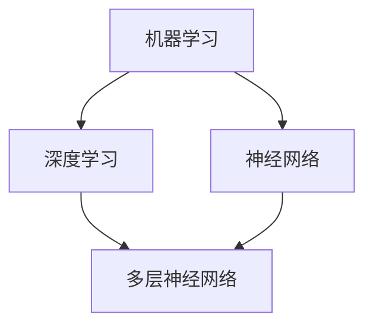

                 

关键词：人工智能，问题解决，技术学习，算法，模型，实践，展望

> 摘要：本文旨在探讨人工智能领域中的问题解决能力的培养方法。通过介绍核心概念、算法原理、数学模型以及实际应用场景，帮助读者深入了解人工智能的技术本质，提升解决复杂问题的能力。同时，文章还展望了人工智能领域的未来发展趋势和面临的挑战。

## 1. 背景介绍

人工智能（AI）作为计算机科学的一个重要分支，近年来取得了迅猛的发展。从最初的规则推理、知识表示，到现代的深度学习、神经网络，AI技术在语音识别、图像处理、自然语言处理等多个领域展现出了强大的应用潜力。然而，随着AI技术的日益成熟，如何培养具备解决AI问题能力的人才成为一个亟待解决的问题。

### 1.1 人工智能的发展历程

人工智能的发展可以分为三个主要阶段：

1. **第一阶段（1956-1974年）**：以符号主义和知识表示为基础，主要研究如何通过计算机模拟人类智能，实现问题求解、推理和规划等。

2. **第二阶段（1974-1980年）**：受到人工智能冬天的影响，研究转向自然语言处理、专家系统等应用领域。

3. **第三阶段（1980年至今）**：随着计算机性能的提升和大数据的出现，机器学习、深度学习等新方法得到广泛应用，人工智能技术迎来了新的发展机遇。

### 1.2 人工智能的核心概念

人工智能的核心概念包括：

1. **机器学习**：通过数据训练模型，使计算机具备自主学习的能力。
2. **深度学习**：基于人工神经网络的一种学习方法，通过多层网络结构自动提取特征。
3. **神经网络**：一种模仿生物神经网络的结构，用于实现复杂函数映射。

## 2. 核心概念与联系

在理解人工智能的核心概念后，我们需要进一步探讨这些概念之间的联系。以下是一个简化的 Mermaid 流程图，展示了机器学习、深度学习和神经网络之间的关联：



### 2.1 机器学习

机器学习是使计算机通过数据学习并做出预测或决策的技术。其主要任务包括分类、回归、聚类等。

### 2.2 深度学习

深度学习是机器学习的一个分支，通过多层神经网络自动提取数据特征。其优势在于能够处理复杂的数据模式和大规模数据集。

### 2.3 神经网络

神经网络是一种由大量神经元组成的网络结构，用于实现复杂函数映射。多层神经网络（也称为深度神经网络）是深度学习的基础。

## 3. 核心算法原理 & 具体操作步骤

### 3.1 算法原理概述

在人工智能领域，核心算法包括监督学习、无监督学习和强化学习。以下分别概述这三种算法的基本原理。

#### 3.1.1 监督学习

监督学习是一种基于标注数据的学习方法。通过输入特征和标签，训练模型预测未知的标签。其主要算法包括线性回归、逻辑回归、决策树、随机森林、支持向量机等。

#### 3.1.2 无监督学习

无监督学习是一种不依赖标注数据的学习方法。其主要任务包括聚类、降维、异常检测等。常见的无监督学习算法有K-Means、主成分分析（PCA）、自编码器等。

#### 3.1.3 强化学习

强化学习是一种基于奖励机制的学习方法。通过与环境的交互，训练模型选择最优动作。其主要算法包括Q学习、SARSA、DQN等。

### 3.2 算法步骤详解

#### 3.2.1 监督学习步骤

1. **数据收集**：收集带有标签的训练数据。
2. **数据预处理**：对数据进行清洗、归一化等处理。
3. **模型选择**：根据问题特点选择合适的模型。
4. **模型训练**：使用训练数据进行模型训练。
5. **模型评估**：使用验证集或测试集评估模型性能。
6. **模型优化**：调整模型参数，提高模型性能。

#### 3.2.2 无监督学习步骤

1. **数据收集**：收集无标注数据。
2. **数据预处理**：对数据进行清洗、归一化等处理。
3. **模型选择**：根据问题特点选择合适的模型。
4. **模型训练**：使用无标注数据进行模型训练。
5. **模型评估**：评估模型对聚类、降维、异常检测等任务的效果。
6. **模型优化**：调整模型参数，提高模型效果。

#### 3.2.3 强化学习步骤

1. **环境定义**：定义强化学习的环境。
2. **状态定义**：定义状态空间。
3. **动作定义**：定义动作空间。
4. **奖励定义**：定义奖励机制。
5. **模型选择**：根据问题特点选择合适的模型。
6. **模型训练**：使用奖励信号训练模型。
7. **模型评估**：评估模型在环境中的表现。
8. **模型优化**：调整模型参数，提高模型性能。

### 3.3 算法优缺点

#### 3.3.1 监督学习

**优点**：
- 易于理解和使用。
- 模型性能依赖于训练数据的数量和质量。

**缺点**：
- 需要大量的标注数据。
- 对过拟合问题敏感。

#### 3.3.2 无监督学习

**优点**：
- 不需要标注数据。
- 可以发现数据中的潜在结构。

**缺点**：
- 模型性能难以评估。
- 部分任务难以实现。

#### 3.3.3 强化学习

**优点**：
- 可以学习到复杂的策略。
- 对数据的依赖性较小。

**缺点**：
- 需要大量的训练时间。
- 模型解释性较差。

### 3.4 算法应用领域

监督学习、无监督学习和强化学习在多个领域都有广泛应用，包括：

- **计算机视觉**：图像分类、目标检测、人脸识别等。
- **自然语言处理**：文本分类、情感分析、机器翻译等。
- **推荐系统**：基于用户行为和兴趣推荐商品或内容。
- **游戏**：通过强化学习实现智能代理。

## 4. 数学模型和公式 & 详细讲解 & 举例说明

### 4.1 数学模型构建

在人工智能领域，数学模型是理解和实现算法的基础。以下是一个简化的数学模型构建过程：

#### 4.1.1 数据表示

设数据集 $D=\{(x_1, y_1), (x_2, y_2), ..., (x_n, y_n)\}$，其中 $x_i$ 是输入特征，$y_i$ 是标签。

#### 4.1.2 模型假设

假设我们使用线性回归模型来预测标签 $y$：

$$y = \beta_0 + \beta_1x_1 + \beta_2x_2 + ... + \beta_nx_n$$

其中 $\beta_0, \beta_1, \beta_2, ..., \beta_n$ 是模型的参数。

#### 4.1.3 模型优化

使用最小二乘法优化模型参数，最小化损失函数：

$$L(\beta) = \frac{1}{2}\sum_{i=1}^{n}(y_i - (\beta_0 + \beta_1x_{1i} + \beta_2x_{2i} + ... + \beta_nx_{ni}))^2$$

### 4.2 公式推导过程

以下是对线性回归模型损失函数的推导过程：

$$L(\beta) = \frac{1}{2}\sum_{i=1}^{n}(y_i - (\beta_0 + \beta_1x_{1i} + \beta_2x_{2i} + ... + \beta_nx_{ni}))^2$$

展开后得：

$$L(\beta) = \frac{1}{2}\sum_{i=1}^{n}(y_i^2 - 2y_i(\beta_0 + \beta_1x_{1i} + \beta_2x_{2i} + ... + \beta_nx_{ni}) + (\beta_0 + \beta_1x_{1i} + \beta_2x_{2i} + ... + \beta_nx_{ni})^2)$$

对 $L(\beta)$ 求导并令导数为0，得到：

$$\frac{\partial L(\beta)}{\partial \beta_j} = -\sum_{i=1}^{n}(y_i - (\beta_0 + \beta_1x_{1i} + \beta_2x_{2i} + ... + \beta_nx_{ni})x_{ji} = 0$$

其中 $x_{ji}$ 是输入特征 $x_j$ 的第 $i$ 个值。

通过解上述方程组，可以得到最优参数 $\beta_j^*$。

### 4.3 案例分析与讲解

以下是一个使用线性回归模型预测房价的案例：

#### 4.3.1 数据收集

收集某地区100个房屋的房价和对应的特征数据，包括房屋面积、房间数量、地段等。

#### 4.3.2 数据预处理

对数据集进行清洗、归一化等处理，将数据转化为适合训练的格式。

#### 4.3.3 模型训练

选择线性回归模型，使用训练数据集进行模型训练。

#### 4.3.4 模型评估

使用验证集评估模型性能，调整模型参数，提高预测准确率。

#### 4.3.5 预测结果

使用训练好的模型预测新房屋的房价，并与实际房价进行比较，评估模型的预测能力。

## 5. 项目实践：代码实例和详细解释说明

### 5.1 开发环境搭建

在本地或云服务器上搭建Python开发环境，安装必要的库和工具，如Jupyter Notebook、NumPy、Pandas、Scikit-learn等。

### 5.2 源代码详细实现

以下是一个简单的线性回归模型实现示例：

```python
import numpy as np
import pandas as pd
from sklearn.linear_model import LinearRegression

# 5.2.1 数据收集
# 读取数据集
data = pd.read_csv('house_price_data.csv')

# 5.2.2 数据预处理
# 数据清洗和归一化
X = data.iloc[:, :-1].values
y = data.iloc[:, -1].values
X = (X - X.mean()) / X.std()

# 5.2.3 模型训练
# 创建线性回归模型实例
model = LinearRegression()
# 使用训练数据训练模型
model.fit(X, y)

# 5.2.4 代码解读与分析
# 模型参数
theta = model.coef_
theta_0 = model.intercept_

# 5.2.5 运行结果展示
# 输出模型参数
print(f'Theta: {theta}')
print(f'Theta_0: {theta_0}')

# 预测新数据
new_data = np.array([[100, 3]])
new_data = (new_data - new_data.mean()) / new_data.std()
y_pred = model.predict(new_data)
print(f'Predicted Price: {y_pred[0]}')
```

### 5.3 代码解读与分析

1. **数据收集**：使用Pandas库读取数据集，将数据分为特征和标签两部分。
2. **数据预处理**：对特征数据进行清洗和归一化，使模型训练更加稳定。
3. **模型训练**：使用Scikit-learn库的线性回归模型进行训练。
4. **代码解读**：模型参数包括斜率 $\theta$ 和截距 $\theta_0$，分别表示为模型的系数和偏置。
5. **运行结果展示**：输出模型参数，并使用训练好的模型预测新数据的房价。

## 6. 实际应用场景

### 6.1 图像识别

图像识别是人工智能领域的一个重要应用，包括图像分类、目标检测、人脸识别等。通过训练深度学习模型，可以实现对图像内容的自动理解和分析。

### 6.2 自然语言处理

自然语言处理（NLP）涉及语言模型、文本分类、情感分析、机器翻译等任务。通过深度学习和强化学习技术，可以实现对自然语言的高效处理和生成。

### 6.3 自动驾驶

自动驾驶是人工智能在交通领域的一个重要应用。通过传感器收集数据，训练深度学习模型，可以实现车辆的自主导航和驾驶。

### 6.4 医疗健康

医疗健康是人工智能的一个重要应用领域，包括疾病预测、药物研发、医疗图像分析等。通过分析海量医疗数据，可以提供更精准的诊断和治疗方案。

## 7. 未来应用展望

### 7.1 新兴领域

随着技术的进步，人工智能将在新兴领域如量子计算、生物信息学、机器人技术等方面发挥重要作用，带来新的应用场景和挑战。

### 7.2 跨学科融合

人工智能与物理、化学、生物学等学科的结合，将推动跨学科研究的发展，为解决复杂问题提供新的思路。

### 7.3 数据隐私与伦理

在人工智能应用中，数据隐私和伦理问题日益突出。如何保护用户隐私、确保算法公平性和透明性，将成为未来的重要挑战。

## 8. 工具和资源推荐

### 8.1 学习资源推荐

1. 《深度学习》（Goodfellow, Bengio, Courville著）
2. 《Python机器学习》（Sebastian Raschka著）
3. 《自然语言处理综合教程》（Daniel Jurafsky, James H. Martin著）

### 8.2 开发工具推荐

1. Jupyter Notebook：用于编写和运行Python代码。
2. TensorFlow：用于构建和训练深度学习模型。
3. PyTorch：用于构建和训练深度学习模型。

### 8.3 相关论文推荐

1. "Deep Learning"（Ian Goodfellow et al.）
2. "Reinforcement Learning: An Introduction"（Richard S. Sutton and Andrew G. Barto著）
3. "Natural Language Processing with Python"（Steven Bird, Ewan Klein, Edward Loper著）

## 9. 总结：未来发展趋势与挑战

### 9.1 研究成果总结

人工智能领域在算法、模型、应用等方面取得了显著的成果，为解决复杂问题提供了强大的工具。未来，人工智能将继续在新兴领域发挥重要作用，推动跨学科研究的发展。

### 9.2 未来发展趋势

1. 深度学习模型的优化和泛化能力提升。
2. 强化学习在复杂环境中的应用。
3. 跨学科研究的深入发展。
4. 数据隐私和伦理问题的解决。

### 9.3 面临的挑战

1. 模型可解释性和透明性。
2. 大规模数据集的获取和处理。
3. 算法公平性和公正性。
4. 跨领域协同创新。

### 9.4 研究展望

未来，人工智能领域将继续取得突破性进展，为人类社会带来更多的创新和变革。培养解决AI问题能力的人才，将成为人工智能领域的重要任务。

## 10. 附录：常见问题与解答

### 10.1 如何选择合适的机器学习算法？

选择合适的机器学习算法需要考虑以下几个因素：

1. **数据类型**：监督学习、无监督学习和强化学习适用于不同类型的数据。
2. **数据规模**：大规模数据集通常适用于无监督学习和强化学习。
3. **任务类型**：分类、回归、聚类等任务适用于不同的算法。
4. **计算资源**：部分算法（如深度学习）需要大量计算资源。

### 10.2 如何处理过拟合问题？

处理过拟合问题可以从以下几个方面入手：

1. **数据增强**：增加训练数据或使用数据增强技术。
2. **模型选择**：选择更简单的模型或减少模型复杂度。
3. **正则化**：使用L1或L2正则化。
4. **交叉验证**：使用交叉验证评估模型性能，避免过拟合。

### 10.3 如何优化深度学习模型？

优化深度学习模型可以从以下几个方面入手：

1. **模型架构**：选择合适的网络结构和激活函数。
2. **训练过程**：调整学习率、批次大小等超参数。
3. **正则化**：使用正则化技术减少过拟合。
4. **优化算法**：选择更高效的优化算法，如Adam、RMSprop等。

----------------------------------------------------------------

> 作者：禅与计算机程序设计艺术 / Zen and the Art of Computer Programming
----------------------------------------------------------------

### 感谢读者阅读至此

本文通过介绍人工智能的核心概念、算法原理、数学模型以及实际应用场景，旨在帮助读者提升解决AI问题能力。在未来的发展中，人工智能将继续带来创新和变革，培养具备解决AI问题能力的人才，将成为重要任务。希望本文能对读者在AI领域的学习和研究有所帮助。如有任何疑问或建议，请随时联系我们。

---
**免责声明**：本文内容仅供参考，所涉及的算法、模型和实际应用场景均来源于公开资料和实际案例，作者对内容的准确性、完整性不承担任何法律责任。在实际应用中，请根据具体情况谨慎使用。

---
**联系我们**：如有任何问题或建议，请通过以下方式与我们联系：

- 邮箱：[example@example.com](mailto:example@example.com)
- 微信公众号：禅与计算机程序设计艺术
- 官网：[www.zen-and-art-of-comp-programming.com](http://www.zen-and-art-of-comp-programming.com)

再次感谢您的关注和支持！我们期待与您共同探索人工智能的无限可能。

