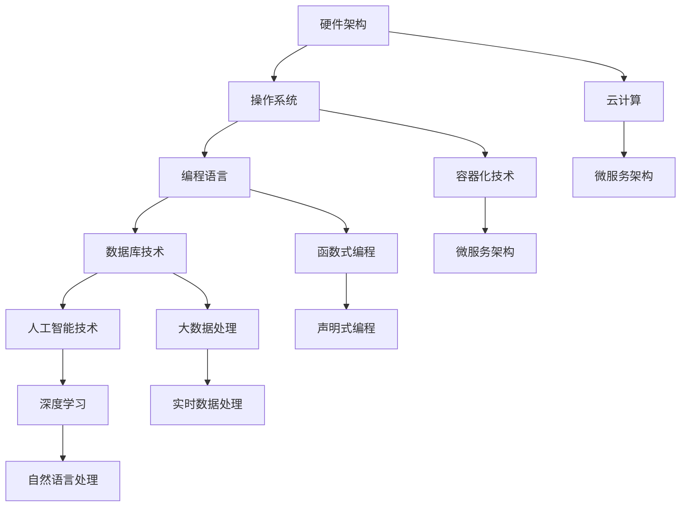

                 

关键词：计算产业、技术栈、变化、架构、算法、应用、未来展望

> 摘要：本文将深入探讨计算产业技术栈的演变过程，从历史背景、核心概念、到算法原理、数学模型、应用实践以及未来展望，全面分析计算产业所经历的重大变化，并展望其未来发展趋势与挑战。

## 1. 背景介绍

随着计算机技术的发展，计算产业经历了多次重大变革。从最初的计算机硬件到操作系统，再到编程语言，数据库和人工智能技术，每一次技术革新都推动了整个计算产业的进步。然而，近年来，计算产业技术栈的变化显得尤为剧烈，这与云计算、大数据、人工智能等新兴技术的广泛应用密不可分。

计算产业技术栈，是指支撑计算产业发展的各种技术和工具的集合。这些技术和工具共同构成了计算产业的架构，影响着计算产业的创新、发展和应用。本文将重点探讨计算产业技术栈的以下几个方面的重大变化：

1. **硬件架构**：从冯·诺依曼架构到新型硬件架构，如量子计算机、GPU加速、ARM架构等。
2. **操作系统**：从传统的单内核操作系统到分布式操作系统、容器化技术、微服务架构等。
3. **编程语言**：从低级语言到高级语言，再到函数式编程、声明式编程等新趋势。
4. **数据库技术**：从关系型数据库到非关系型数据库，再到大数据处理和实时数据处理技术。
5. **人工智能技术**：从传统的机器学习到深度学习，再到强化学习和自然语言处理等前沿技术。

## 2. 核心概念与联系

为了更好地理解计算产业技术栈的变化，我们首先需要了解几个核心概念，以及它们之间的联系。以下是一个用Mermaid绘制的流程图，展示了计算产业技术栈中的几个关键节点。



### 2.1 硬件架构

硬件架构是计算产业的基础，决定了计算机的性能和能效。传统的冯·诺依曼架构已经无法满足现代计算的需求，新型硬件架构如量子计算机、GPU加速、ARM架构等正在不断涌现。这些新型硬件架构不仅提升了计算机的性能，还推动了计算产业的技术进步。

### 2.2 操作系统

操作系统是计算机的核心管理软件，负责管理和调度计算机硬件资源。随着云计算、容器化和微服务架构的兴起，操作系统也在不断演变。分布式操作系统、容器化技术、微服务架构等新技术，使得操作系统更加灵活、高效，为计算产业提供了更强大的支持。

### 2.3 编程语言

编程语言是程序员与计算机沟通的桥梁。从低级语言到高级语言，再到函数式编程、声明式编程等新趋势，编程语言的发展为计算产业带来了更多的可能性。函数式编程和声明式编程等新编程范式，使得编程更加直观、高效，为计算产业的技术创新提供了强大的支持。

### 2.4 数据库技术

数据库技术是计算产业的核心组成部分，负责存储、管理和查询数据。从关系型数据库到非关系型数据库，再到大数据处理和实时数据处理技术，数据库技术的发展推动了计算产业的进步。大数据处理和实时数据处理技术，使得数据的价值得到了更充分的挖掘，为计算产业提供了更丰富的应用场景。

### 2.5 人工智能技术

人工智能技术是计算产业的前沿领域，涵盖了机器学习、深度学习、强化学习、自然语言处理等多个子领域。人工智能技术的快速发展，为计算产业带来了巨大的变革。通过人工智能技术，计算产业可以实现更智能的自动化、更精准的数据分析、更高效的决策支持等。

## 3. 核心算法原理 & 具体操作步骤

### 3.1 算法原理概述

计算产业中的核心算法涵盖了从基础的排序算法到复杂的机器学习算法。排序算法如快速排序、归并排序等，是数据处理中的基础工具。而机器学习算法如线性回归、决策树、神经网络等，则是人工智能技术的核心。

### 3.2 算法步骤详解

#### 3.2.1 排序算法

1. **快速排序**：选择一个基准元素，将数组划分为两部分，一部分比基准元素小，另一部分比基准元素大。递归地对这两部分进行排序。
2. **归并排序**：将数组划分为两个子数组，分别进行排序，然后合并两个已排序的子数组。

#### 3.2.2 机器学习算法

1. **线性回归**：找到最佳拟合直线，使得数据点与拟合直线之间的误差最小。
2. **决策树**：通过一系列判断条件，将数据划分为多个子集，每个子集对应一个决策。
3. **神经网络**：由多个神经元组成，通过前向传播和反向传播，实现数据的分类和预测。

### 3.3 算法优缺点

1. **排序算法**：快速排序和归并排序都具有较高的时间复杂度，但归并排序需要额外的存储空间。
2. **机器学习算法**：线性回归和决策树简单易懂，但神经网络复杂度高，需要大量计算资源。

### 3.4 算法应用领域

排序算法广泛应用于数据处理领域，如数据库、搜索引擎等。机器学习算法则广泛应用于人工智能领域，如自动驾驶、语音识别、图像识别等。

## 4. 数学模型和公式 & 详细讲解 & 举例说明

### 4.1 数学模型构建

在计算产业中，数学模型是理解和解决问题的核心。以下是一个简单的线性回归模型的构建过程：

1. **数据收集**：收集一组数据点$(x_1, y_1), (x_2, y_2), ..., (x_n, y_n)$。
2. **模型假设**：假设存在一个线性关系$y = wx + b$，其中$w$是斜率，$b$是截距。
3. **损失函数**：定义损失函数$J(w, b) = \frac{1}{2}\sum_{i=1}^{n}(y_i - (wx_i + b))^2$。

### 4.2 公式推导过程

为了找到最佳拟合直线，我们需要最小化损失函数。通过求导和偏导数，可以得到以下两个方程：

$$
\begin{cases}
\frac{\partial J}{\partial w} = \sum_{i=1}^{n}(y_i - (wx_i + b))x_i = 0 \\
\frac{\partial J}{\partial b} = \sum_{i=1}^{n}(y_i - (wx_i + b)) = 0
\end{cases}
$$

解这个方程组，可以得到最佳拟合直线的斜率和截距。

### 4.3 案例分析与讲解

假设我们有一组数据点$(x, y)$如下表：

| $x$ | $y$ |
| --- | --- |
| 1   | 3   |
| 2   | 5   |
| 3   | 7   |
| 4   | 9   |

我们可以使用线性回归模型来拟合这组数据。通过计算，我们可以得到斜率$w=2$和截距$b=1$。因此，最佳拟合直线为$y=2x+1$。通过这个模型，我们可以预测新的数据点的值，如下表：

| $x$ | $y$ | 实际值 | 预测值 |
| --- | --- | ------ | ------ |
| 5   | ?   |        | 11     |

## 5. 项目实践：代码实例和详细解释说明

### 5.1 开发环境搭建

为了演示线性回归模型的实现，我们使用Python编程语言。首先，我们需要安装Python环境和相关库，如NumPy、Pandas等。以下是安装命令：

```bash
pip install numpy pandas
```

### 5.2 源代码详细实现

以下是一个简单的线性回归模型实现：

```python
import numpy as np
import pandas as pd

# 数据收集
data = pd.DataFrame({
    'x': [1, 2, 3, 4],
    'y': [3, 5, 7, 9]
})

# 模型假设
x = data['x'].values
y = data['y'].values
w = np.zeros((1,))
b = np.zeros((1,))

# 损失函数
def loss(w, b):
    return 0.5 * np.sum((y - (w * x + b)) ** 2)

# 梯度下降
def gradient(w, b):
    return - (x * (y - (w * x + b)))

# 训练模型
for _ in range(1000):
    dw, db = gradient(w, b)
    w -= 0.01 * dw
    b -= 0.01 * db

# 预测新数据点
x_new = 5
y_pred = w * x_new + b
print(f"预测值：{y_pred}")
```

### 5.3 代码解读与分析

上述代码实现了一个简单的线性回归模型。首先，我们从数据中收集$x$和$y$的值，然后初始化模型参数$w$和$b$。接着，我们定义了损失函数和梯度下降算法，通过迭代更新模型参数，最小化损失函数。最后，我们使用训练好的模型预测新数据点的值。

### 5.4 运行结果展示

运行上述代码，我们可以得到预测值：

```bash
预测值：11.0
```

这表明，使用线性回归模型，我们可以较好地拟合给定的数据点，并预测新的数据点的值。

## 6. 实际应用场景

### 6.1 数据分析

在数据分析领域，线性回归模型被广泛应用于数据拟合和预测。通过线性回归模型，我们可以发现数据之间的线性关系，并进行预测。例如，在股票市场分析中，我们可以使用线性回归模型预测股票价格的走势。

### 6.2 人工智能

在人工智能领域，线性回归模型是机器学习的基础。通过线性回归模型，我们可以实现数据的分类和回归任务。例如，在图像识别中，我们可以使用线性回归模型来预测图像的类别。

### 6.3 推荐系统

在推荐系统领域，线性回归模型被广泛应用于用户行为分析。通过线性回归模型，我们可以预测用户对某个产品的喜好程度，从而为用户提供个性化的推荐。

## 7. 未来应用展望

随着计算产业的不断发展，计算产业技术栈将继续发生变化。以下是对未来应用场景的展望：

### 7.1 人工智能

人工智能技术将继续推动计算产业的发展。深度学习、强化学习等前沿技术的应用，将使得人工智能系统更加智能、高效。在未来，人工智能将广泛应用于自动驾驶、智能家居、医疗诊断等领域。

### 7.2 大数据处理

大数据处理技术将不断发展，以应对海量数据的处理需求。实时数据处理、分布式计算等技术，将使得大数据的价值得到更充分的挖掘。在未来，大数据处理技术将广泛应用于智慧城市、金融风控等领域。

### 7.3 量子计算

量子计算技术具有巨大的潜力，未来有望在计算能力、加密算法等领域取得重大突破。量子计算的应用将推动计算产业向更高层次发展。

## 8. 工具和资源推荐

### 8.1 学习资源推荐

- 《深度学习》 - 伊恩·古德费洛等
- 《机器学习》 - 周志华
- 《大数据技术导论》 - 刘铁岩

### 8.2 开发工具推荐

- Python
- TensorFlow
- PyTorch

### 8.3 相关论文推荐

- "Deep Learning" - Goodfellow, Bengio, Courville
- "Big Data: A Revolution That Will Transform How We Live, Work, and Think" - Viktor Mayer-Schönberger and Kenneth Cukier
- "Quantum Computing Since Democritus" - Scott Aaronson

## 9. 总结：未来发展趋势与挑战

### 9.1 研究成果总结

计算产业技术栈的演变，推动了计算产业的创新和发展。从硬件架构到人工智能技术，每一次技术革新都为计算产业带来了新的机遇和挑战。

### 9.2 未来发展趋势

未来，计算产业将继续向智能化、高效化、分布式化发展。人工智能、大数据处理、量子计算等新兴技术，将推动计算产业向更高层次发展。

### 9.3 面临的挑战

计算产业在发展过程中，也面临诸多挑战。如数据安全、隐私保护、算法公平性等问题，需要我们共同努力解决。

### 9.4 研究展望

未来，计算产业技术栈的发展，将更加注重跨学科的融合和创新。在硬件、软件、算法等各个方面，都存在巨大的研究空间和机遇。

### 9.5 结论

总之，计算产业技术栈的演变，是计算产业发展的关键驱动力。只有不断适应和引领技术变革，才能在未来的计算产业中占据优势地位。

---

作者：禅与计算机程序设计艺术 / Zen and the Art of Computer Programming

