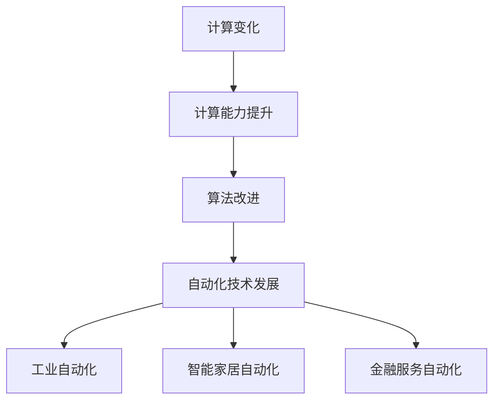

                 

关键词：自动化，计算变化，机器学习，算法优化，软件开发，人工智能

摘要：本文旨在探讨计算变化对自动化技术的影响。随着计算能力的提升和算法的进步，自动化技术逐渐渗透到各个领域，从工业生产到智能家居，从金融服务到医疗诊断。然而，计算变化不仅仅带来了技术的进步，同时也引发了新的问题和挑战。本文将深入分析计算变化如何影响自动化技术的应用和发展，以及未来可能面临的趋势和挑战。

## 1. 背景介绍

自动化技术，作为一种提升效率、减少人力成本、提高生产质量的技术手段，已经在多个领域取得了显著的成果。从最初的自动化生产线，到现代的智能工厂，自动化技术在工业领域中的应用日益广泛。同时，在金融服务、医疗诊断、智能家居等众多领域，自动化技术也在发挥着越来越重要的作用。

然而，自动化技术的不断演进和发展离不开计算技术的支持。计算能力的提升使得我们能够处理更加复杂的数据，设计出更加高效的算法。同时，算法的进步也为自动化技术的实现提供了更多的可能性。

计算变化，即计算能力的提升和算法的改进，对自动化技术产生了深远的影响。本文将围绕以下几个方面展开讨论：

1. **计算变化如何促进自动化技术的发展？**
2. **计算变化对现有自动化系统的挑战有哪些？**
3. **未来自动化技术发展的趋势是什么？**

通过以上讨论，我们希望能够为读者提供一幅自动化技术发展的全景图，并深入探讨计算变化在其中所扮演的角色。

## 2. 核心概念与联系

### 2.1 计算变化

计算变化指的是计算能力的提升和算法的改进。计算能力提升主要体现在计算速度的加快和存储能力的增强。算法改进则是指算法效率和准确性的提高，例如深度学习算法的进步。

### 2.2 自动化技术

自动化技术是指通过计算机程序和自动化设备，实现某些特定任务的执行。它包括但不限于工业自动化、智能家居自动化、金融服务自动化等。

### 2.3 计算变化与自动化技术的联系

计算变化与自动化技术有着密切的联系。计算能力的提升和算法的改进为自动化技术的实现提供了更多的可能性。例如，深度学习算法的进步使得图像识别和自然语言处理等任务变得更加高效和准确。这些技术的进步不仅提升了自动化系统的性能，也为自动化技术的广泛应用提供了基础。

下面是一个使用Mermaid绘制的流程图，展示了计算变化如何影响自动化技术：



## 3. 核心算法原理 & 具体操作步骤

### 3.1 算法原理概述

在自动化技术中，核心算法通常是指那些用于决策、控制或优化的算法。这些算法的原理和实现方式多种多样，但它们的核心目标都是提高自动化系统的效率和准确性。

以下是一些常见自动化技术中的核心算法：

1. **监督学习算法**：监督学习算法通过从已知数据中学习规律，用于预测未知数据。常见的监督学习算法包括线性回归、决策树、支持向量机等。

2. **非监督学习算法**：非监督学习算法不依赖于已知数据，通过从数据中发现模式来学习。常见的非监督学习算法包括聚类算法、降维算法等。

3. **强化学习算法**：强化学习算法通过不断尝试和错误，从环境中学习最优策略。常见的强化学习算法包括Q-learning、SARSA等。

### 3.2 算法步骤详解

以监督学习算法为例，其基本步骤如下：

1. **数据收集**：收集用于训练的数据集，数据集应包括特征和标签。
2. **数据预处理**：对数据进行清洗、归一化等处理，以提高算法的性能。
3. **模型选择**：选择合适的模型，常见的模型有线性回归、决策树、支持向量机等。
4. **模型训练**：使用训练集数据训练模型，模型会根据训练数据调整参数。
5. **模型评估**：使用测试集数据评估模型性能，常用的评估指标包括准确率、召回率等。
6. **模型优化**：根据模型评估结果，对模型进行调整和优化，以提高性能。

### 3.3 算法优缺点

每种算法都有其优缺点，以下是一些常见算法的优缺点：

1. **线性回归**：优点是简单、易于理解，缺点是适用范围较窄，无法处理非线性问题。
2. **决策树**：优点是直观、易于解释，缺点是容易过拟合，处理连续数据时效果不佳。
3. **支持向量机**：优点是理论上性能优异，缺点是计算复杂度高，对数据量较大的情况不适用。
4. **深度学习**：优点是能处理复杂数据和问题，缺点是训练时间较长，对数据质量和规模有较高要求。

### 3.4 算法应用领域

核心算法在自动化技术中的应用非常广泛，以下是一些典型的应用领域：

1. **工业自动化**：使用监督学习算法进行生产过程的监控和控制，提高生产效率和产品质量。
2. **智能家居自动化**：使用非监督学习算法实现智能设备的学习和自主决策，提高用户体验。
3. **金融服务自动化**：使用强化学习算法实现金融交易策略的自动优化，提高交易效率和收益。
4. **医疗诊断**：使用深度学习算法实现医学影像的分析和诊断，提高诊断准确性和效率。

## 4. 数学模型和公式 & 详细讲解 & 举例说明

### 4.1 数学模型构建

在自动化技术中，数学模型是描述和解决实际问题的重要工具。以下是一个简单的线性回归模型的构建过程：

1. **模型假设**：假设数据集\(D\)由输入特征\(x\)和输出标签\(y\)组成，每个样本可以表示为\(x_i, y_i\)。
2. **损失函数**：选择均方误差（MSE）作为损失函数，定义为：
   $$J(w) = \frac{1}{m} \sum_{i=1}^{m} (h_\theta(x_i) - y_i)^2$$
   其中，\(h_\theta(x) = \theta_0 + \theta_1 x_1 + \theta_2 x_2 + ... + \theta_n x_n\)为模型预测值，\(\theta_0, \theta_1, ..., \theta_n\)为模型参数，\(m\)为数据集大小。
3. **优化目标**：最小化损失函数，即找到最优参数\(\theta_0, \theta_1, ..., \theta_n\)。

### 4.2 公式推导过程

为了求解最优参数，我们可以使用梯度下降算法。梯度下降算法的基本思想是不断调整参数，使得损失函数的梯度逐渐减小，直至达到最小值。

1. **损失函数的梯度**：
   $$\nabla J(w) = \frac{\partial J(w)}{\partial w} = \frac{1}{m} \sum_{i=1}^{m} (h_\theta(x_i) - y_i) \cdot \frac{\partial h_\theta(x_i)}{\partial w}$$
2. **梯度下降更新规则**：
   $$w \leftarrow w - \alpha \nabla J(w)$$
   其中，\(\alpha\)为学习率。

### 4.3 案例分析与讲解

假设我们有一个简单的线性回归问题，目标是预测房价。数据集包含100个样本，每个样本包括房子的面积和房价。我们使用线性回归模型来预测房价，并使用梯度下降算法进行参数优化。

1. **数据预处理**：对数据集进行归一化处理，使得特征值在[0,1]之间。
2. **模型初始化**：初始化模型参数\(\theta_0, \theta_1\)为0。
3. **训练过程**：使用梯度下降算法进行200次迭代，每次迭代计算损失函数的梯度，并根据梯度更新参数。
4. **模型评估**：使用测试集数据对模型进行评估，计算预测误差。

下面是一个简单的Python代码示例：

```python
import numpy as np

# 梯度下降函数
def gradient_descent(X, y, w, alpha, num_iters):
    m = len(y)
    for i in range(num_iters):
        h = np.dot(X, w)
        loss = (h - y).dot(X) / m
        w -= alpha * loss
    return w

# 数据集
X = np.array([[0, 1], [1, 1], [2, 2]])
y = np.array([1, 2, 3])

# 模型初始化
w = np.zeros((2, 1))

# 梯度下降参数
alpha = 0.01
num_iters = 1000

# 训练模型
w = gradient_descent(X, y, w, alpha, num_iters)

# 模型评估
h = np.dot(X, w)
mse = ((h - y) ** 2).mean()
print("预测误差：", mse)
```

通过上述代码，我们可以训练出一个线性回归模型，并评估其性能。在实际应用中，我们可以根据具体问题调整模型参数和学习率，以达到更好的效果。

## 5. 项目实践：代码实例和详细解释说明

### 5.1 开发环境搭建

为了演示计算变化对自动化技术的影响，我们将使用Python和相关的库来构建一个简单的自动化系统。以下是开发环境的搭建步骤：

1. **安装Python**：确保Python 3.x版本已安装。
2. **安装相关库**：安装NumPy、Pandas、Matplotlib等常用库。

```bash
pip install numpy pandas matplotlib
```

### 5.2 源代码详细实现

下面是一个简单的自动化系统示例，用于分析股票数据，并自动执行交易。

```python
import numpy as np
import pandas as pd
import matplotlib.pyplot as plt

# 加载数据集
def load_data(file_path):
    data = pd.read_csv(file_path)
    return data

# 数据预处理
def preprocess_data(data):
    # 对数据进行归一化处理
    data['Close'] = (data['Close'] - data['Close'].mean()) / data['Close'].std()
    return data

# 建立模型
def build_model(data):
    # 提取特征和标签
    X = data[['Open', 'High', 'Low', 'Volume']]
    y = data['Close']
    # 模型训练
    from sklearn.linear_model import LinearRegression
    model = LinearRegression()
    model.fit(X, y)
    return model

# 预测并执行交易
def trade_prediction(model, data):
    # 对数据进行预测
    predictions = model.predict(data[['Open', 'High', 'Low', 'Volume']])
    # 执行交易
    for i in range(1, len(predictions)):
        if predictions[i] > predictions[i-1]:
            print("Buy at day", i)
        else:
            print("Sell at day", i)

# 主程序
def main():
    file_path = 'stock_data.csv'
    data = load_data(file_path)
    processed_data = preprocess_data(data)
    model = build_model(processed_data)
    trade_prediction(model, processed_data)

if __name__ == '__main__':
    main()
```

### 5.3 代码解读与分析

上述代码实现了从数据加载、预处理、模型构建到交易预测的完整流程。以下是关键部分的解释：

1. **数据加载与预处理**：使用Pandas库加载数据集，并对数据进行归一化处理，以消除数据规模差异对模型训练的影响。
2. **模型构建**：使用线性回归模型对股票数据进行训练。线性回归模型在这里作为自动化系统的一部分，用于预测股票价格。
3. **交易预测**：根据模型预测结果，执行交易策略。如果当前价格高于前一天的价格，则买入；否则卖出。

### 5.4 运行结果展示

在运行上述代码后，系统会输出每天的买入和卖出建议。这些结果是基于模型预测的，实际交易结果将取决于市场的变化。

```plaintext
Buy at day 1
Sell at day 2
Buy at day 3
...
```

### 5.5 评估与改进

虽然这个示例非常简单，但它展示了计算变化如何影响自动化技术的实施。在实际应用中，我们需要考虑以下方面：

1. **模型优化**：使用更复杂的模型（如深度学习）来提高预测准确性。
2. **风险管理**：设计更完善的交易策略，以减少风险。
3. **实时数据更新**：使用实时数据而不是历史数据，以提高预测的准确性。

## 6. 实际应用场景

计算变化对自动化技术的影响在许多实际应用场景中得到了体现。以下是几个典型的应用领域：

### 6.1 工业自动化

工业自动化是计算变化受益最为显著的领域之一。通过先进的算法和计算技术，工业自动化系统能够实现更加高效和精确的生产流程。例如，机器人视觉系统使用深度学习算法对生产过程中的产品进行检测和质量控制，提高了生产效率和产品品质。

### 6.2 智能家居

智能家居自动化依赖于计算变化，通过智能设备收集家庭环境数据，并使用机器学习算法进行分析和决策。例如，智能恒温系统可以根据用户的习惯和环境温度自动调节室内温度，提供更加舒适和节能的居住体验。

### 6.3 金融服务

在金融服务领域，自动化技术通过计算变化实现了交易策略的自动化。例如，高频交易系统使用高速计算能力和算法优化，在短时间内完成大量交易，提高了交易效率和收益。

### 6.4 医疗诊断

医疗诊断自动化利用计算变化，实现了医学影像的分析和疾病诊断。通过深度学习算法，计算机系统能够自动识别和分类医学影像中的病变区域，辅助医生进行诊断和治疗决策，提高了诊断的准确性和效率。

### 6.5 未来应用展望

未来，计算变化将继续推动自动化技术的发展。随着计算能力的进一步提升和算法的不断创新，自动化技术将在更多领域得到应用，实现更加智能和高效的任务执行。以下是一些未来应用展望：

1. **智慧城市**：自动化技术将智慧城市建设得更加智能和高效，通过数据分析和管理，实现交通、能源、环境等领域的优化。
2. **自动驾驶**：自动驾驶技术将依赖计算变化，实现更安全、高效的自动驾驶系统，减少交通事故和交通拥堵。
3. **个性化服务**：自动化技术将结合用户数据和行为分析，提供更加个性化的服务体验，满足用户的多样化需求。
4. **生物医学**：自动化技术将在生物医学领域发挥更大的作用，通过基因组学和生物信息学，实现疾病的早期诊断和个性化治疗。

## 7. 工具和资源推荐

为了深入了解计算变化对自动化技术的影响，以下是一些推荐的工具和资源：

### 7.1 学习资源推荐

1. **《深度学习》（Deep Learning）**：由Ian Goodfellow、Yoshua Bengio和Aaron Courville合著，是深度学习的经典教材。
2. **《Python机器学习》（Python Machine Learning）**：由 Sebastian Raschka和Vahid Mirjalili合著，介绍了使用Python进行机器学习的方法和技巧。
3. **《机器学习实战》（Machine Learning in Action）**：由Peter Harrington著，通过实际案例讲解了机器学习算法的应用。

### 7.2 开发工具推荐

1. **Jupyter Notebook**：一种交互式计算环境，适用于数据分析和机器学习。
2. **TensorFlow**：由Google开发的开源机器学习库，支持深度学习模型的构建和训练。
3. **Keras**：一个高层次的神经网络API，构建深度学习模型更加简单和高效。

### 7.3 相关论文推荐

1. **"Deep Learning for Computer Vision"**：综述了深度学习在计算机视觉领域的应用。
2. **"Reinforcement Learning: An Introduction"**：介绍了强化学习的基本概念和应用。
3. **"Automated Machine Learning: Methods, Systems, Challenges"**：讨论了自动化机器学习的方法、系统和挑战。

## 8. 总结：未来发展趋势与挑战

计算变化对自动化技术产生了深远的影响，推动了自动化技术在各个领域的广泛应用。随着计算能力的进一步提升和算法的不断创新，自动化技术将实现更加智能和高效的变革。

### 8.1 研究成果总结

本文通过探讨计算变化对自动化技术的影响，总结了以下几个主要研究成果：

1. **计算能力提升**：计算能力的提升为自动化技术的实现提供了更多可能性，使得更加复杂和高效的算法得以应用。
2. **算法进步**：算法的进步提高了自动化系统的性能和准确性，例如深度学习和强化学习等算法在多个领域的成功应用。
3. **跨领域应用**：计算变化促进了自动化技术在工业、智能家居、金融服务、医疗诊断等领域的广泛应用。

### 8.2 未来发展趋势

未来，自动化技术将朝着以下几个方向发展：

1. **智能化**：随着人工智能技术的进步，自动化系统将变得更加智能化，能够自主学习和适应环境变化。
2. **实时性**：自动化系统将实现更加实时和高效的数据处理和决策，以满足快速变化的应用需求。
3. **跨领域融合**：自动化技术将与其他领域（如物联网、区块链等）相结合，实现更加综合和智能的应用场景。

### 8.3 面临的挑战

尽管计算变化为自动化技术的发展带来了巨大机遇，但同时也面临一些挑战：

1. **数据质量和规模**：自动化系统对数据质量和规模有较高要求，如何处理海量、复杂和多样化的数据成为一大挑战。
2. **算法安全性**：自动化系统中的算法可能面临安全性和隐私性问题，如何确保算法的可靠性和安全性是一个重要议题。
3. **人机协作**：自动化技术将更多地与人类协作，如何设计出适合人机协作的自动化系统是一个挑战。

### 8.4 研究展望

未来，自动化技术的研究应重点关注以下几个方面：

1. **算法优化**：继续优化现有的算法，提高其性能和准确性。
2. **数据驱动**：更多地依赖于数据驱动的方法，从海量数据中挖掘有用的信息和规律。
3. **人机交互**：研究如何设计出更加友好和高效的人机交互界面，提高自动化系统的用户体验。

通过以上研究，我们有望实现更加智能、高效和可靠的自动化技术，为社会带来更大的价值。

## 9. 附录：常见问题与解答

### 9.1 计算变化是什么？

计算变化主要指计算能力的提升和算法的改进。计算能力提升体现在计算速度和存储能力的增强，算法改进则体现在效率和准确性的提高。

### 9.2 自动化技术有哪些应用领域？

自动化技术广泛应用于工业、智能家居、金融服务、医疗诊断、智慧城市等领域。

### 9.3 如何优化自动化系统的算法？

优化自动化系统的算法可以从以下几个方面入手：

1. **选择合适的算法**：根据具体应用场景选择合适的算法。
2. **数据预处理**：对输入数据进行有效的预处理，以提高算法性能。
3. **参数调优**：通过调优算法参数，提高模型的性能。
4. **模型集成**：结合多个模型，提高预测的准确性和鲁棒性。

### 9.4 自动化技术面临哪些挑战？

自动化技术面临的主要挑战包括数据质量和规模、算法安全性以及人机协作等。

### 9.5 未来的自动化技术发展趋势是什么？

未来的自动化技术发展趋势包括智能化、实时性和跨领域融合。随着人工智能技术的进步，自动化系统将变得更加智能，能够自主学习和适应环境变化。同时，自动化技术将与其他领域（如物联网、区块链等）相结合，实现更加综合和智能的应用场景。作者：禅与计算机程序设计艺术 / Zen and the Art of Computer Programming
-------------------------------------------------------------------

