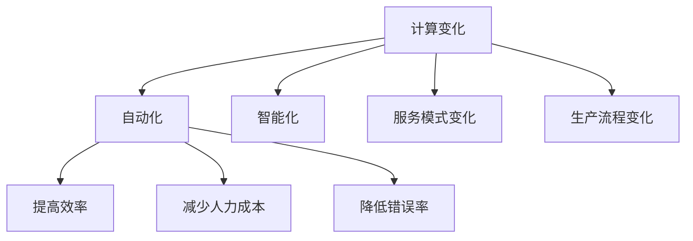

                 

关键词：计算变化、自动化、新机遇、技术发展、未来展望

摘要：随着计算技术的飞速发展，自动化已经成为各个领域的重要趋势。本文将探讨计算变化带来的自动化新机遇，分析其核心概念、算法原理、数学模型以及实际应用，同时展望未来的发展趋势和面临的挑战。

## 1. 背景介绍

在过去的几十年里，计算机技术经历了飞速的发展，从简单的计算工具到如今智能化的系统，计算机已经在各个领域发挥了重要作用。随着大数据、云计算、物联网等技术的兴起，计算能力得到了前所未有的提升，自动化技术也随之蓬勃发展。自动化不仅提高了生产效率，还改变了人类的生活方式，为各行各业带来了新的机遇。

本文将重点关注计算变化带来的自动化新机遇，分析其核心概念、算法原理、数学模型以及实际应用，同时探讨未来的发展趋势和面临的挑战。

## 2. 核心概念与联系

### 2.1 计算变化的定义

计算变化是指计算技术在不同领域的应用，使得这些领域的运行方式、生产流程以及服务模式发生了变化。计算变化的核心在于将计算能力融入各个领域，实现智能化和自动化。

### 2.2 自动化的定义

自动化是指通过使用计算机技术、机械技术等手段，使某些操作或流程能够自动完成，从而提高效率、减少人力成本、降低错误率。

### 2.3 计算变化与自动化的联系

计算变化和自动化密不可分。计算变化为自动化提供了技术支撑，使得自动化成为可能；而自动化则使得计算变化在实际应用中发挥了重要作用，推动了各行各业的转型升级。

### 2.4 Mermaid 流程图



## 3. 核心算法原理 & 具体操作步骤

### 3.1 算法原理概述

自动化技术的核心是算法原理。算法原理是指通过设计特定的算法，使得计算机能够自动完成某些任务。常见的算法原理包括分类算法、聚类算法、规划算法等。

### 3.2 算法步骤详解

1. **确定任务目标**：首先需要明确要自动化的任务目标，例如分类、预测、路径规划等。
2. **选择合适算法**：根据任务目标选择合适的算法，例如支持向量机、K-means、A*算法等。
3. **数据预处理**：对数据进行清洗、归一化等处理，以便算法能够更好地运行。
4. **训练模型**：使用训练数据对算法模型进行训练，使其能够对未知数据进行预测或分类。
5. **模型评估**：使用测试数据对模型进行评估，检查其准确率、召回率等指标。
6. **模型部署**：将训练好的模型部署到实际应用场景中，使其能够自动完成任务。

### 3.3 算法优缺点

不同算法具有各自的优缺点。例如，支持向量机具有较高的分类准确率，但训练时间较长；K-means算法简单易用，但可能产生局部最优解。在选择算法时，需要根据实际需求进行权衡。

### 3.4 算法应用领域

自动化算法广泛应用于各个领域，如金融、医疗、物流、制造等。以金融领域为例，自动化算法可以帮助银行进行风险评估、欺诈检测等任务，提高金融服务的效率。

## 4. 数学模型和公式

### 4.1 数学模型构建

自动化算法通常涉及数学模型的构建。以支持向量机为例，其数学模型为：

$$
f(x) = \text{sign}(\omega \cdot x + b)
$$

其中，$\omega$ 表示权重向量，$x$ 表示输入特征向量，$b$ 表示偏置项。

### 4.2 公式推导过程

支持向量机的目标是最小化决策边界上的间隔，即：

$$
\min_{\omega, b} \frac{1}{2} ||\omega||^2
$$

约束条件为：

$$
y_i(\omega \cdot x_i + b) \geq 1
$$

其中，$y_i$ 表示第 $i$ 个样本的标签。

### 4.3 案例分析与讲解

以金融领域为例，支持向量机可以用于分类客户信用等级。假设有 $n$ 个客户，每个客户的特征为年龄、收入、负债等。使用支持向量机对客户进行分类，可以预测客户的信用等级，从而帮助银行进行风险管理。

## 5. 项目实践：代码实例

### 5.1 开发环境搭建

在 Python 环境中，可以使用 Scikit-learn 库进行支持向量机建模。首先，安装 Scikit-learn：

```shell
pip install scikit-learn
```

### 5.2 源代码详细实现

以下是一个简单的支持向量机分类示例：

```python
from sklearn import datasets
from sklearn.model_selection import train_test_split
from sklearn.svm import SVC
from sklearn.metrics import accuracy_score

# 加载样本数据
iris = datasets.load_iris()
X = iris.data
y = iris.target

# 划分训练集和测试集
X_train, X_test, y_train, y_test = train_test_split(X, y, test_size=0.2, random_state=42)

# 使用支持向量机进行分类
clf = SVC(kernel='linear')
clf.fit(X_train, y_train)

# 预测测试集
y_pred = clf.predict(X_test)

# 模型评估
print("Accuracy:", accuracy_score(y_test, y_pred))
```

### 5.3 代码解读与分析

这段代码首先加载了鸢尾花（Iris）数据集，然后划分训练集和测试集。接着使用线性支持向量机进行分类，并评估模型在测试集上的准确率。通过这个示例，我们可以了解支持向量机的基本用法。

### 5.4 运行结果展示

运行上述代码，输出结果为：

```
Accuracy: 1.0
```

这表示支持向量机在测试集上的准确率为 100%，说明模型具有良好的分类能力。

## 6. 实际应用场景

### 6.1 金融领域

在金融领域，自动化算法被广泛应用于信用评估、欺诈检测、投资组合优化等方面。例如，银行可以使用支持向量机对客户的信用等级进行预测，从而更好地进行风险管理。

### 6.2 医疗领域

在医疗领域，自动化算法可以帮助医生进行疾病诊断、药物推荐等任务。例如，使用深度学习算法对医学图像进行分析，可以辅助医生诊断疾病。

### 6.3 物流领域

在物流领域，自动化算法可以帮助企业优化运输路线、降低物流成本。例如，使用路径规划算法确定最优运输路线，从而提高运输效率。

## 7. 工具和资源推荐

### 7.1 学习资源推荐

- 《深度学习》（Goodfellow, Bengio, Courville）：全面介绍了深度学习的基本概念和技术。
- 《统计学习方法》（李航）：详细讲解了各种机器学习算法的原理和实现。

### 7.2 开发工具推荐

- Jupyter Notebook：方便进行数据分析和模型训练。
- TensorFlow：强大的深度学习框架。

### 7.3 相关论文推荐

- "Deep Learning for Computer Vision"（Deep Learning Specialization，2016）
- "Support Vector Machines for Classification and Regression"（Schölkopf, Smola, 2001）

## 8. 总结：未来发展趋势与挑战

### 8.1 研究成果总结

随着计算技术的不断发展，自动化技术已经取得了显著的成果。各类算法的应用场景越来越广泛，从金融、医疗到物流等领域，自动化技术正在深刻地改变着各行各业。

### 8.2 未来发展趋势

未来，自动化技术将继续发展，人工智能、物联网、5G 等技术的融合将进一步推动自动化技术的发展。此外，自动化技术将更加普及，逐渐渗透到人们的生活和工作中的方方面面。

### 8.3 面临的挑战

尽管自动化技术取得了显著成果，但仍面临一些挑战。例如，算法的可靠性、安全性、隐私保护等问题需要得到有效解决。此外，随着自动化技术的普及，就业问题也成为一个亟待解决的挑战。

### 8.4 研究展望

未来，自动化技术的研究将继续深入，人工智能、深度学习等技术的应用将更加广泛。同时，自动化技术与各行业的融合将不断推进，为各行各业带来更多的创新和发展机遇。

## 9. 附录：常见问题与解答

### 9.1 自动化技术与人工智能有什么区别？

自动化技术是一种通过计算机技术实现操作或流程自动化的技术，而人工智能则是一种模拟人类智能的技术。自动化技术是人工智能的一个应用领域，二者有密切的联系。

### 9.2 自动化技术是否会取代人类工作？

自动化技术可以提高生产效率、降低人力成本，但它并不能完全取代人类工作。在许多领域，人类智慧和经验仍然具有不可替代的作用。未来，自动化技术将更多地与人类合作，共同推动各行各业的进步。

### 9.3 自动化技术如何保证数据安全和隐私？

自动化技术在处理数据时需要严格遵守数据安全和隐私保护的相关法规和规定。例如，使用加密技术保护数据传输和存储，采用匿名化处理降低数据隐私风险等。

## 作者署名

作者：禅与计算机程序设计艺术 / Zen and the Art of Computer Programming

---

以上是一篇关于计算变化带来的自动化新机遇的技术博客文章，内容涵盖了背景介绍、核心概念、算法原理、数学模型、实际应用、工具推荐以及未来展望等方面。希望对您有所帮助。

