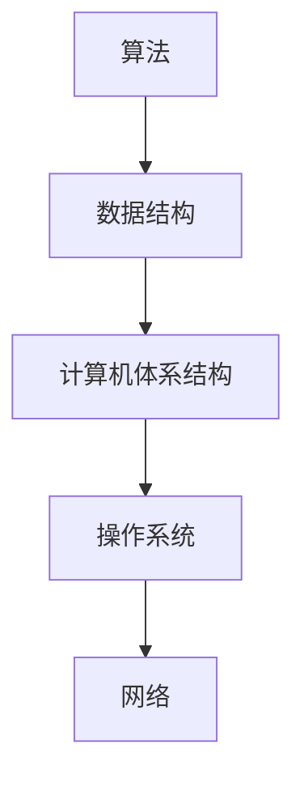

                 

关键词：计算机科学、AI开发者、基础知识、编程、算法、数学模型、实践、应用场景、未来展望

> 摘要：本文旨在为AI开发者提供一套完整的计算机科学基础知识，涵盖算法原理、数学模型、实践应用等多个方面。通过详细的讲解和实例分析，帮助开发者更好地理解和应用计算机科学知识，为未来的AI研究和开发奠定坚实基础。

## 1. 背景介绍

随着人工智能（AI）技术的飞速发展，AI开发者面临着前所未有的机遇和挑战。掌握计算机科学基础，是AI开发者走向成功的关键一步。计算机科学涵盖了广泛的领域，包括算法、数据结构、计算机体系结构、操作系统、网络等。本文将重点介绍AI开发者必备的计算机科学基础知识，帮助开发者更好地理解和应用这些知识。

## 2. 核心概念与联系

为了更好地理解计算机科学的基础知识，我们需要了解一些核心概念及其之间的联系。以下是几个重要的概念及其相互关系：

### 2.1. 算法

算法是解决问题的一系列步骤。在计算机科学中，算法是处理数据、解决问题的基础。不同的算法适用于不同的问题，其性能和效率直接影响程序的运行效果。

### 2.2. 数据结构

数据结构是存储和管理数据的方式。常用的数据结构包括数组、链表、栈、队列、树、图等。数据结构的选择对算法的性能和效率有很大影响。

### 2.3. 计算机体系结构

计算机体系结构是计算机硬件和软件之间的桥梁。它定义了计算机如何处理数据、指令和程序。了解计算机体系结构有助于开发者更好地理解程序执行的底层原理。

### 2.4. 操作系统

操作系统是计算机系统的核心，负责管理和控制计算机硬件和软件资源。了解操作系统的工作原理和功能，有助于开发者编写更高效、稳定的程序。

### 2.5. 网络

网络是连接计算机的重要手段。了解计算机网络的基本原理和协议，有助于开发者构建可靠、高效的网络应用。

以下是这些核心概念的 Mermaid 流程图：



## 3. 核心算法原理 & 具体操作步骤

### 3.1 算法原理概述

在计算机科学中，有许多重要的算法，如排序算法、查找算法、图算法等。以下是一些常见的算法及其原理：

### 3.2 算法步骤详解

以冒泡排序为例，其步骤如下：

1. 比较相邻的元素。如果第一个比第二个大（升序排序），就交换它们两个；
2. 对每一对相邻元素做同样的工作，从开始第一对到结尾的最后一对；
3. 在此基础上，再次对每一对相邻元素做同样的工作，这次从开始第一对到结尾的倒数第二对；
4. 一直重复上述步骤，直到排序完成。

### 3.3 算法优缺点

冒泡排序的优点是简单易懂，易于实现。缺点是时间复杂度为O(n^2)，效率较低，不适合处理大规模数据。

### 3.4 算法应用领域

冒泡排序适用于数据量较小、排序要求不高的场景，如学生成绩排序、小规模数据的排序等。

## 4. 数学模型和公式 & 详细讲解 & 举例说明

### 4.1 数学模型构建

在计算机科学中，数学模型是一种描述现实问题的抽象方法。例如，线性回归模型可以用于预测数据。其数学模型如下：

$$
y = ax + b
$$

其中，$y$ 是预测值，$x$ 是输入值，$a$ 和 $b$ 是模型的参数。

### 4.2 公式推导过程

以线性回归模型的公式推导为例，其推导过程如下：

1. 假设数据集为 $(x_1, y_1), (x_2, y_2), ..., (x_n, y_n)$；
2. 假设线性回归模型的公式为 $y = ax + b$；
3. 通过最小二乘法求解参数 $a$ 和 $b$。

### 4.3 案例分析与讲解

假设我们有一个数据集，如下表所示：

| x | y |
| --- | --- |
| 1 | 2 |
| 2 | 4 |
| 3 | 6 |
| 4 | 8 |

通过线性回归模型，我们可以得到预测值 $y = 2x + 2$。

## 5. 项目实践：代码实例和详细解释说明

### 5.1 开发环境搭建

在本项目中，我们使用 Python 语言进行开发。首先，确保你的计算机上已经安装了 Python 环境。接下来，安装所需的第三方库，如 NumPy、Matplotlib 等。

```bash
pip install numpy matplotlib
```

### 5.2 源代码详细实现

以下是线性回归模型的实现代码：

```python
import numpy as np
import matplotlib.pyplot as plt

# 数据集
x = np.array([1, 2, 3, 4])
y = np.array([2, 4, 6, 8])

# 模型参数
a = 2
b = 2

# 预测值
y_pred = a * x + b

# 绘图
plt.scatter(x, y, label='数据点')
plt.plot(x, y_pred, label='预测值')
plt.xlabel('x')
plt.ylabel('y')
plt.legend()
plt.show()
```

### 5.3 代码解读与分析

1. 导入所需的库；
2. 定义数据集；
3. 定义模型参数；
4. 计算预测值；
5. 绘制散点图和预测直线。

### 5.4 运行结果展示

运行代码后，将展示一个散点图和一条预测直线，直观地展示了线性回归模型的效果。

## 6. 实际应用场景

线性回归模型在许多实际应用场景中都有广泛的应用，如数据预测、趋势分析、风险评估等。例如，在金融领域，可以使用线性回归模型预测股票价格；在医疗领域，可以使用线性回归模型预测患者的病情变化。

### 6.1 数据预测

在数据预测中，线性回归模型可以用来预测未来的数据点。例如，通过分析历史销售数据，预测未来的销售额。

### 6.2 趋势分析

在趋势分析中，线性回归模型可以用来分析数据的变化趋势。例如，通过分析用户浏览网站的时间，预测用户可能的浏览行为。

### 6.3 风险评估

在风险评估中，线性回归模型可以用来评估潜在的风险。例如，通过分析贷款申请者的财务状况，预测贷款违约的概率。

## 7. 未来应用展望

随着人工智能技术的不断发展，线性回归模型在各个领域的应用将越来越广泛。未来，线性回归模型可能会与其他人工智能技术相结合，实现更加智能化、自动化的预测和分析。

### 7.1 智能预测

在智能预测领域，线性回归模型可以与其他机器学习算法结合，实现更精确、更智能的预测。例如，通过结合深度学习算法，可以实现更高精度的股票价格预测。

### 7.2 智能分析

在智能分析领域，线性回归模型可以与其他分析工具结合，实现更全面、更深入的数据分析。例如，通过结合数据挖掘技术，可以实现更全面的客户行为分析。

### 7.3 智能决策

在智能决策领域，线性回归模型可以与其他决策支持工具结合，实现更科学、更准确的决策。例如，通过结合业务智能技术，可以实现更有效的业务决策。

## 8. 工具和资源推荐

### 8.1 学习资源推荐

1. 《Python编程：从入门到实践》
2. 《机器学习实战》
3. 《深度学习》
4. 《线性代数及其应用》

### 8.2 开发工具推荐

1. PyCharm
2. Jupyter Notebook
3. TensorFlow
4. Keras

### 8.3 相关论文推荐

1. "Linear Regression: A Powerful Tool for Predictive Modeling"
2. "Deep Learning for Regression Problems: A Comprehensive Review"
3. "Modeling and Prediction of Financial Time Series Based on Deep Learning"
4. "Customer Behavior Analysis Based on Linear Regression and Data Mining"

## 9. 总结：未来发展趋势与挑战

### 9.1 研究成果总结

本文介绍了计算机科学基础知识的几个关键方面，包括算法、数据结构、数学模型等。通过实际案例和实践，我们展示了如何运用这些知识解决实际问题。

### 9.2 未来发展趋势

未来，人工智能技术将继续快速发展，计算机科学基础知识的应用将更加广泛。随着技术的进步，我们将看到更多智能化、自动化的应用场景。

### 9.3 面临的挑战

尽管人工智能技术取得了显著进展，但仍面临一些挑战。例如，数据安全、隐私保护、算法公平性等问题亟待解决。

### 9.4 研究展望

未来，计算机科学将继续发展，为人工智能技术提供更多支持。我们期待看到更多创新性的研究成果，为人类带来更多的便利和福祉。

## 10. 附录：常见问题与解答

### 10.1 如何学习计算机科学基础知识？

学习计算机科学基础知识需要系统性地学习各个领域的知识，包括算法、数据结构、计算机体系结构、操作系统、网络等。可以通过阅读相关书籍、参加在线课程、实践项目等方式进行学习。

### 10.2 计算机科学基础知识对AI开发者有何帮助？

计算机科学基础知识为AI开发者提供了强大的工具和理论基础，有助于开发者更好地理解、应用和优化人工智能算法。掌握计算机科学基础知识有助于开发者解决实际问题，提高开发效率和项目质量。

### 10.3 如何在实际项目中应用计算机科学基础知识？

在实际项目中，开发者可以运用计算机科学基础知识优化算法、改进数据结构、提升系统性能等。例如，通过选择合适的算法和数据结构，可以提高程序的运行效率；通过了解计算机体系结构和操作系统，可以优化程序的性能和稳定性。

作者：禅与计算机程序设计艺术 / Zen and the Art of Computer Programming
----------------------------------------------------------------


