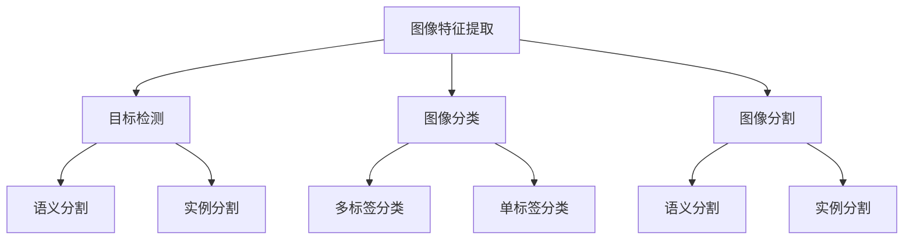

                 

关键词：计算机视觉，图像处理，深度学习，算法，代码实例

摘要：本文旨在深入讲解计算机视觉（CV）的基本原理，包括核心概念、算法原理、数学模型、项目实践等。文章将通过实例代码展示如何实现计算机视觉算法，并探讨其在实际应用中的前景和挑战。

## 1. 背景介绍

计算机视觉是人工智能的一个重要分支，旨在使计算机能够从图像或视频中提取信息，理解场景内容，并做出相应的决策。随着深度学习技术的发展，计算机视觉取得了显著的进步，成为许多领域的关键技术，如自动驾驶、医疗诊断、安全监控、娱乐等。

本文将介绍计算机视觉的基本原理和关键技术，并通过实际代码实例展示如何实现这些算法。文章结构如下：

- 1. 背景介绍
- 2. 核心概念与联系
- 3. 核心算法原理 & 具体操作步骤
- 4. 数学模型和公式 & 详细讲解 & 举例说明
- 5. 项目实践：代码实例和详细解释说明
- 6. 实际应用场景
- 7. 工具和资源推荐
- 8. 总结：未来发展趋势与挑战
- 9. 附录：常见问题与解答

## 2. 核心概念与联系

计算机视觉涉及许多核心概念，如图像特征提取、目标检测、图像分类、图像分割等。以下是一个简单的 Mermaid 流程图，展示了这些概念之间的联系。



### 2.1 图像特征提取

图像特征提取是计算机视觉的基础。它涉及将原始图像转换为能够表征图像内容的特征向量。常见的方法包括边缘检测、角点检测、纹理分析等。

### 2.2 目标检测

目标检测旨在识别图像中的多个对象，并为其生成边界框。常见的方法有基于传统算法（如HOG、SVM）和深度学习算法（如YOLO、SSD、Faster R-CNN）。

### 2.3 图像分类

图像分类是将图像分为预定义的类别。常见的方法有基于传统算法（如SVM、KNN）和深度学习算法（如CNN、ResNet）。

### 2.4 图像分割

图像分割是将图像划分为不同的区域，每个区域代表图像中的一个对象或背景。常见的方法有基于阈值、基于边缘、基于区域生长等。

## 3. 核心算法原理 & 具体操作步骤

### 3.1 算法原理概述

计算机视觉算法主要分为以下几类：

- **传统算法**：基于手工设计的特征和模型，如HOG、SVM等。
- **深度学习算法**：基于大规模数据训练的神经网络模型，如CNN、R-CNN等。
- **多模态融合算法**：结合不同数据源（如图像、文本、声音）的算法，如多模态CNN等。

### 3.2 算法步骤详解

以深度学习中的卷积神经网络（CNN）为例，算法步骤如下：

1. **数据预处理**：对输入图像进行缩放、裁剪、翻转等预处理操作。
2. **特征提取**：通过卷积、池化等操作提取图像特征。
3. **全连接层**：将特征向量输入到全连接层进行分类。
4. **损失函数**：使用交叉熵损失函数优化模型参数。
5. **反向传播**：通过反向传播更新模型参数。

### 3.3 算法优缺点

- **传统算法**：计算效率高，但精度较低；对特征设计有较高要求。
- **深度学习算法**：精度高，但对数据量有较高要求；计算效率较低。
- **多模态融合算法**：能够结合多种数据源提高模型性能，但计算复杂度较高。

### 3.4 算法应用领域

计算机视觉算法广泛应用于以下领域：

- **自动驾驶**：车辆检测、行人检测、交通标志识别等。
- **医疗诊断**：病变检测、医学图像分割等。
- **安全监控**：人脸识别、行为识别等。
- **娱乐**：图像生成、视频编辑等。

## 4. 数学模型和公式 & 详细讲解 & 举例说明

### 4.1 数学模型构建

计算机视觉中的数学模型主要包括：

- **线性模型**：如线性回归、逻辑回归等。
- **非线性模型**：如神经网络、支持向量机等。
- **概率模型**：如贝叶斯网络、条件概率等。

### 4.2 公式推导过程

以下是一个简单的线性回归公式推导过程：

$$
y = \beta_0 + \beta_1 \cdot x
$$

$$
J(\theta) = \frac{1}{2m} \sum_{i=1}^{m} (h_\theta(x^{(i)}) - y^{(i)})^2
$$

$$
\theta_{\text{update}} = \theta - \alpha \cdot \frac{\partial J(\theta)}{\partial \theta}
$$

### 4.3 案例分析与讲解

假设我们有一个简单的线性回归问题，目标是预测房价。给定一组房屋面积和房价数据，我们需要训练一个线性回归模型来预测新的房屋面积对应的房价。

数据集：

| 面积 | 房价 |
| --- | --- |
| 1000 | 200000 |
| 1500 | 300000 |
| 2000 | 400000 |
| 2500 | 500000 |

通过最小二乘法，我们可以得到以下模型：

$$
y = \beta_0 + \beta_1 \cdot x
$$

$$
\beta_0 = \frac{1}{m} \sum_{i=1}^{m} y^{(i)} - \beta_1 \cdot \frac{1}{m} \sum_{i=1}^{m} x^{(i)}
$$

$$
\beta_1 = \frac{1}{m} \sum_{i=1}^{m} (x^{(i)} - \bar{x}) \cdot (y^{(i)} - \bar{y})
$$

计算得到：

$$
\beta_0 = 250000, \beta_1 = 100000
$$

因此，房价预测模型为：

$$
y = 250000 + 100000 \cdot x
$$

预测新房屋面积为3000平方米的房价：

$$
y = 250000 + 100000 \cdot 3000 = 350000000
$$

## 5. 项目实践：代码实例和详细解释说明

在本节中，我们将使用Python和TensorFlow实现一个简单的卷积神经网络（CNN）进行图像分类。

### 5.1 开发环境搭建

确保安装以下软件：

- Python 3.x
- TensorFlow 2.x
- NumPy
- Matplotlib

### 5.2 源代码详细实现

以下是一个简单的CNN实现，用于分类MNIST手写数字数据集。

```python
import tensorflow as tf
from tensorflow.keras import layers
import numpy as np

# 加载MNIST数据集
mnist = tf.keras.datasets.mnist
(x_train, y_train), (x_test, y_test) = mnist.load_data()

# 数据预处理
x_train = x_train / 255.0
x_test = x_test / 255.0
x_train = x_train[..., tf.newaxis]
x_test = x_test[..., tf.newaxis]

# 构建CNN模型
model = tf.keras.Sequential([
    layers.Conv2D(32, (3, 3), activation='relu', input_shape=(28, 28, 1)),
    layers.MaxPooling2D((2, 2)),
    layers.Conv2D(64, (3, 3), activation='relu'),
    layers.MaxPooling2D((2, 2)),
    layers.Flatten(),
    layers.Dense(128, activation='relu'),
    layers.Dense(10, activation='softmax')
])

# 编译模型
model.compile(optimizer='adam',
              loss='sparse_categorical_crossentropy',
              metrics=['accuracy'])

# 训练模型
model.fit(x_train, y_train, epochs=5)

# 评估模型
test_loss, test_acc = model.evaluate(x_test, y_test)
print(f'测试准确率：{test_acc:.2f}')

# 预测
predictions = model.predict(x_test)
predicted_labels = np.argmax(predictions, axis=1)
```

### 5.3 代码解读与分析

- **数据预处理**：将图像数据缩放到0-1范围内，并将数据形状调整为模型所需。
- **模型构建**：使用`Sequential`模型堆叠多个层，包括卷积层、池化层、全连接层。
- **模型编译**：设置优化器和损失函数。
- **模型训练**：使用训练数据训练模型。
- **模型评估**：使用测试数据评估模型性能。
- **预测**：使用训练好的模型预测测试数据的标签。

## 6. 实际应用场景

计算机视觉技术在许多领域都有广泛应用，以下是一些实际应用场景：

- **自动驾驶**：车辆检测、道路识别、障碍物检测等。
- **医疗诊断**：病变检测、医学图像分割、疾病预测等。
- **安全监控**：人脸识别、行为识别、异常检测等。
- **娱乐**：图像生成、视频编辑、虚拟现实等。

## 7. 工具和资源推荐

### 7.1 学习资源推荐

- 《深度学习》（Goodfellow, Bengio, Courville）
- 《计算机视觉：算法与应用》（Richard Szeliski）
- 《计算机视觉基础》（Berthold K.P. Horn）

### 7.2 开发工具推荐

- TensorFlow
- PyTorch
- OpenCV

### 7.3 相关论文推荐

- YOLOv4: Optimal Speed and Accuracy of Object Detection
- Deep Residual Learning for Image Recognition
- A Neural Algorithm of Artistic Style

## 8. 总结：未来发展趋势与挑战

### 8.1 研究成果总结

计算机视觉在图像识别、目标检测、图像分割等方面取得了显著进展。随着深度学习技术的发展，计算机视觉算法的精度和效率不断提高。

### 8.2 未来发展趋势

- **小样本学习**：减少对大规模数据集的依赖。
- **跨模态学习**：结合多种数据源提高模型性能。
- **实时处理**：提高算法在实时应用中的性能。

### 8.3 面临的挑战

- **数据隐私**：如何保护用户隐私。
- **计算资源**：如何优化算法以适应有限计算资源。

### 8.4 研究展望

随着计算机视觉技术的不断进步，未来将在自动驾驶、医疗诊断、安全监控等领域发挥更大作用。同时，如何解决数据隐私和计算资源问题将是研究的重要方向。

## 9. 附录：常见问题与解答

### 9.1 问题1：如何处理图像数据？

**回答**：图像数据通常需要经过缩放、裁剪、翻转等预处理操作。此外，可以采用数据增强技术（如随机裁剪、旋转等）增加模型的泛化能力。

### 9.2 问题2：如何选择合适的神经网络结构？

**回答**：根据任务需求和数据集规模选择合适的神经网络结构。对于小样本问题，可以选择轻量级网络结构；对于大样本问题，可以选择更复杂的网络结构。

### 9.3 问题3：如何优化神经网络训练过程？

**回答**：可以通过调整学习率、批量大小、正则化方法等超参数来优化训练过程。此外，可以采用学习率衰减、梯度裁剪等技术提高训练效果。

----------------------------------------------------------------

作者：禅与计算机程序设计艺术 / Zen and the Art of Computer Programming

本文详细讲解了计算机视觉的基本原理、算法、数学模型和项目实践，并对未来发展趋势和挑战进行了探讨。希望本文能为计算机视觉领域的研究者和开发者提供有益的参考。

