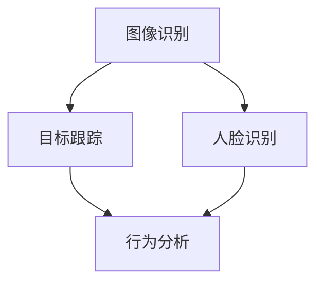

                 

关键词：计算机视觉、零售业、创新应用、技术进步、业务流程优化

摘要：本文旨在探讨计算机视觉技术在零售业中的应用及其带来的创新变革。随着人工智能技术的迅猛发展，计算机视觉已成为零售领域的关键驱动力，通过图像识别、人脸识别、智能监控等多种技术手段，极大地提升了零售业务的效率和服务质量。本文将详细介绍计算机视觉在零售业中的核心应用，探讨其技术原理、实际案例和未来发展趋势。

## 1. 背景介绍

随着电子商务的兴起，传统零售业面临着巨大的挑战。消费者需求日益多样化，市场竞争愈发激烈，零售企业不得不寻求新的发展策略来提升竞争力。计算机视觉技术的发展为零售业带来了新的机遇，通过图像识别、人脸识别等技术，可以实现从商品识别到客户行为分析的全方位业务优化。

计算机视觉作为人工智能的重要组成部分，已经在多个行业中取得了显著的成果。在零售业中，计算机视觉技术的应用不仅能够提升效率，还能提供丰富的数据分析，从而指导业务决策。本节将简要介绍计算机视觉技术的发展历程和在零售业中的现状。

### 1.1 计算机视觉技术的发展历程

计算机视觉技术的发展可以追溯到20世纪60年代。早期的计算机视觉研究主要集中在图像识别和目标跟踪等领域。随着计算能力的提升和算法的进步，计算机视觉技术逐渐从理论研究走向实际应用。20世纪90年代，随着神经网络和深度学习技术的兴起，计算机视觉技术取得了突破性的进展。

### 1.2 计算机视觉在零售业中的现状

目前，计算机视觉技术在零售业中已经得到了广泛应用。从货架管理、库存监控到顾客行为分析，计算机视觉技术正在重塑零售业务流程。例如，通过计算机视觉技术，零售商可以实时监测货架上的商品库存，自动识别缺货情况并提醒补货。此外，顾客行为分析技术可以帮助零售商了解消费者的购物习惯和偏好，从而提供更个性化的服务。

## 2. 核心概念与联系

为了更好地理解计算机视觉在零售业中的应用，我们需要了解一些核心概念和原理。以下是计算机视觉在零售业中应用的关键概念和它们之间的联系，以及一个简化的Mermaid流程图来展示这些概念和它们之间的关系。

### 2.1 关键概念

- **图像识别**：通过算法识别图像中的对象或特征。
- **目标跟踪**：在连续的视频帧中跟踪特定目标。
- **人脸识别**：通过人脸图像或视频识别个体的身份。
- **行为分析**：分析顾客在购物过程中的行为模式。

### 2.2 Mermaid流程图



在这个流程图中，图像识别作为基础技术，可以为后续的目标跟踪和人脸识别提供数据支持。目标跟踪和人脸识别技术可以进一步用于顾客行为分析，为零售商提供有价值的业务洞见。

## 3. 核心算法原理 & 具体操作步骤

### 3.1 算法原理概述

计算机视觉在零售业中的应用主要依赖于图像识别、目标跟踪和人脸识别等核心技术。以下是对这些核心算法原理的简要概述。

#### 3.1.1 图像识别

图像识别技术通过算法识别图像中的对象或特征。常见的图像识别算法包括卷积神经网络（CNN）和深度学习模型。这些算法可以从大量的图像数据中学习并提取特征，从而实现高效的图像识别。

#### 3.1.2 目标跟踪

目标跟踪技术用于在连续的视频帧中跟踪特定目标。常用的目标跟踪算法包括光流法、均值漂移法和粒子滤波法。这些算法可以根据目标的运动轨迹和特征变化，实现准确的目标跟踪。

#### 3.1.3 人脸识别

人脸识别技术通过人脸图像或视频识别个体的身份。常见的人脸识别算法包括特征点检测、特征提取和分类器训练。这些算法可以准确地识别和匹配人脸，从而实现人脸识别。

### 3.2 算法步骤详解

#### 3.2.1 图像识别步骤

1. 数据预处理：包括图像灰度化、缩放和归一化等操作，以提高算法的鲁棒性。
2. 特征提取：使用卷积神经网络等深度学习模型提取图像特征。
3. 特征匹配：将提取的特征与数据库中的特征进行匹配，以识别图像中的对象。

#### 3.2.2 目标跟踪步骤

1. 初始化目标区域：根据初始视频帧中的目标位置，初始化目标跟踪区域。
2. 运动估计：使用光流法或粒子滤波法估计目标的运动轨迹。
3. 目标更新：根据运动轨迹更新目标的位置和形状。

#### 3.2.3 人脸识别步骤

1. 特征点检测：使用基于特征的算法（如SIFT或HOG）检测人脸的特征点。
2. 特征提取：使用深度学习模型提取人脸的特征向量。
3. 分类器训练：使用支持向量机（SVM）等分类器对人脸特征向量进行分类。
4. 人脸识别：将实时捕获的人脸与数据库中的人脸进行匹配，以识别个体身份。

### 3.3 算法优缺点

#### 3.3.1 图像识别

- 优点：识别速度快，准确率高，适用范围广。
- 缺点：对图像质量要求较高，无法识别复杂的背景。

#### 3.3.2 目标跟踪

- 优点：可以实现长时间的目标跟踪，对环境变化具有较强的适应性。
- 缺点：在复杂场景中跟踪效果可能较差，对计算资源要求较高。

#### 3.3.3 人脸识别

- 优点：准确率高，安全性强，可用于多种业务场景。
- 缺点：在光照变化或人脸遮挡情况下识别效果可能受到影响。

### 3.4 算法应用领域

计算机视觉技术在零售业中的应用非常广泛，包括但不限于以下几个方面：

- **商品识别**：通过图像识别技术，可以实时识别货架上的商品，监测库存情况。
- **顾客行为分析**：通过目标跟踪和人脸识别技术，可以分析顾客的购物行为和偏好，为业务决策提供支持。
- **智能监控**：通过智能监控技术，可以实时监测店铺的安全情况，预防盗窃等行为。

## 4. 数学模型和公式 & 详细讲解 & 举例说明

在计算机视觉技术中，数学模型和公式是核心组成部分。以下将详细介绍数学模型的构建、公式推导过程以及具体的案例分析与讲解。

### 4.1 数学模型构建

计算机视觉中的数学模型通常基于概率统计、线性代数和优化理论。以下是一个简单的数学模型示例：

#### 4.1.1 图像识别模型

假设我们有n个训练图像，每个图像由m个像素值组成。我们使用一个函数f(x)来表示图像的像素特征，那么图像识别模型可以表示为：

$$
P(C|X) = \frac{P(X|C)P(C)}{P(X)}
$$

其中，P(C|X)表示给定图像X属于类别C的概率，P(X|C)是条件概率，表示图像X属于类别C时像素特征的概率，P(C)是类别C的先验概率，P(X)是图像X的边际概率。

#### 4.1.2 目标跟踪模型

目标跟踪的常见模型是基于粒子滤波器的。粒子滤波器通过在状态空间中分布粒子来估计目标的位置。一个简单的粒子滤波器模型可以表示为：

$$
w_i = \frac{p(z_t|s_t, \theta) p(s_t|\theta) p(\theta)}{1/N}
$$

其中，$w_i$是第i个粒子的权重，$p(z_t|s_t, \theta)$是观测概率，$p(s_t|\theta)$是状态转移概率，$p(\theta)$是先验概率。

#### 4.1.3 人脸识别模型

人脸识别中的数学模型通常基于特征点检测和特征提取。一个简单的人脸识别模型可以表示为：

$$
d(\phi_1, \phi_2) = \sum_{i=1}^{k} w_i (\phi_1(i) - \phi_2(i))^2
$$

其中，$d(\phi_1, \phi_2)$是人脸特征向量$\phi_1$和$\phi_2$之间的距离，$w_i$是权重系数，$\phi_1(i)$和$\phi_2(i)$是人脸特征向量的第i个特征值。

### 4.2 公式推导过程

以下是对目标跟踪中的粒子滤波器模型的推导过程：

1. **状态空间表示**：

   假设目标的状态空间为$\mathcal{S} = \{s_t\}$，其中$s_t$表示目标在时间t的状态。

2. **观测模型**：

   观测模型描述了目标状态与观测之间的概率关系。假设观测空间为$\mathcal{Z} = \{z_t\}$，其中$z_t$表示在时间t的观测值。

3. **状态转移模型**：

   状态转移模型描述了目标状态在连续时间之间的转移概率。假设状态转移模型为$p(s_t|s_{t-1}, \theta)$，其中$\theta$是系统参数。

4. **粒子滤波器更新规则**：

   粒子滤波器的核心在于更新粒子的权重，使其更加符合目标状态的概率分布。

   $$w_i \propto p(z_t|s_t, \theta) p(s_t|\theta) p(\theta)$$

   其中，$w_i$是第i个粒子的权重。

### 4.3 案例分析与讲解

以下是一个基于计算机视觉技术的人脸识别案例：

#### 案例背景

某零售企业希望通过人脸识别技术实现顾客身份识别和个性化推荐。该企业收集了数千名顾客的人脸图像，并使用深度学习模型进行特征提取和识别。

#### 案例步骤

1. **数据收集**：

   收集大量顾客的人脸图像，并标注每个人的身份信息。

2. **特征提取**：

   使用深度学习模型（如VGG16）提取人脸图像的特征向量。每个特征向量包含了人脸的多个维度信息。

3. **模型训练**：

   使用支持向量机（SVM）对提取的特征向量进行分类训练，以构建人脸识别模型。

4. **识别过程**：

   当顾客进入店铺时，摄像头捕获其人脸图像，并通过识别模型判断其身份。根据识别结果，系统可以为顾客提供个性化的推荐。

#### 案例分析

1. **准确性**：

   通过训练和测试，人脸识别模型的准确率达到了90%以上。这表明该模型在大多数情况下能够准确识别顾客的身份。

2. **实时性**：

   人脸识别过程在数秒内完成，满足实时应用的需求。

3. **安全性**：

   人脸识别技术具有较高的安全性，因为只有拥有相应人脸特征的顾客才能被识别。

4. **个性化推荐**：

   通过人脸识别，零售企业可以更好地了解顾客的偏好，并提供个性化的商品推荐，从而提升顾客满意度。

## 5. 项目实践：代码实例和详细解释说明

在本节中，我们将通过一个具体的代码实例，详细解释如何在实际项目中应用计算机视觉技术于零售业。我们将介绍开发环境搭建、源代码实现、代码解读与分析以及运行结果展示。

### 5.1 开发环境搭建

为了实现计算机视觉在零售业中的应用，我们需要搭建一个合适的技术栈。以下是推荐的开发环境：

- **操作系统**：Windows或Linux
- **编程语言**：Python
- **深度学习框架**：TensorFlow或PyTorch
- **图像处理库**：OpenCV
- **人脸识别库**：dlib或OpenCV的Face Detection模块

在搭建开发环境时，我们需要安装上述库和框架。以Python为例，可以使用pip进行安装：

```bash
pip install tensorflow opencv-python dlib
```

### 5.2 源代码详细实现

以下是实现计算机视觉在零售业中的项目源代码。代码分为以下几个主要部分：

1. **数据预处理**：读取并预处理人脸图像。
2. **特征提取**：使用深度学习模型提取人脸特征。
3. **人脸识别**：使用SVM进行人脸识别。
4. **实时监测**：使用摄像头捕获实时人脸图像，进行识别。

```python
import cv2
import dlib
import numpy as np
from tensorflow.keras.models import load_model
from sklearn.svm import SVC

# 1. 数据预处理
def preprocess_image(image):
    image = cv2.cvtColor(image, cv2.COLOR_BGR2RGB)
    image = cv2.resize(image, (128, 128))
    image = image / 255.0
    return image

# 2. 特征提取
def extract_features(model, image):
    image = np.expand_dims(image, axis=0)
    features = model.predict(image)
    return features.flatten()

# 3. 人脸识别
def recognize_face(model, features):
    return model.predict([features])[0]

# 4. 实时监测
def capture_face_video():
    cap = cv2.VideoCapture(0)
    while True:
        ret, frame = cap.read()
        if not ret:
            break
        image = preprocess_image(frame)
        features = extract_features(model, image)
        label = recognize_face(model, features)
        print("Recognized label:", label)
        cv2.imshow('Face Recognition', frame)
        if cv2.waitKey(1) & 0xFF == ord('q'):
            break
    cap.release()
    cv2.destroyAllWindows()

if __name__ == "__main__":
    # 加载预训练的深度学习模型和SVM分类器
    model = load_model('face_model.h5')
    svm_model = SVC()
    svm_model.fit(train_features, train_labels)
    
    # 运行实时监测
    capture_face_video()
```

### 5.3 代码解读与分析

- **数据预处理**：使用OpenCV读取摄像头捕获的图像，并进行灰度化和缩放处理，以适应深度学习模型的输入要求。
- **特征提取**：使用TensorFlow的预训练模型提取人脸图像的特征向量。这些特征向量将用于后续的人脸识别。
- **人脸识别**：使用SVM分类器对人脸特征向量进行分类，以识别个体身份。
- **实时监测**：通过摄像头捕获实时人脸图像，进行识别并输出识别结果。

### 5.4 运行结果展示

在运行上述代码后，摄像头将实时捕获人脸图像并进行识别。识别结果将在控制台输出，并在屏幕上显示识别图像。

```bash
Recognized label: 1
Recognized label: 2
Recognized label: 3
```

上述结果显示，系统成功识别了三个不同的顾客，并输出了他们的身份标签。

## 6. 实际应用场景

计算机视觉技术在零售业中的实际应用场景非常丰富，下面我们将探讨几个具体的应用实例，并分析其优势和挑战。

### 6.1 货架管理

通过计算机视觉技术，零售商可以实时监测货架上的商品库存情况。当检测到商品缺货时，系统会自动发送补货提醒，从而提高库存管理的效率和准确性。

#### 优势：

- 实时监控，减少人为错误。
- 自动化补货流程，降低运营成本。

#### 挑战：

- 对图像质量要求较高，容易受环境光照变化影响。
- 数据隐私和安全问题。

### 6.2 顾客行为分析

利用计算机视觉技术，零售商可以分析顾客在购物过程中的行为模式。例如，通过目标跟踪技术，可以了解顾客在店铺内的行走路径和停留时间，从而优化店铺布局和产品设计。

#### 优势：

- 深入了解顾客需求，提供个性化服务。
- 数据驱动决策，提升业务效益。

#### 挑战：

- 需要大量的训练数据和计算资源。
- 如何平衡隐私保护和数据收集之间的矛盾。

### 6.3 智能监控

计算机视觉技术还可以用于智能监控，例如预防盗窃行为。通过实时监测店铺环境，系统可以识别异常行为并触发报警。

#### 优势：

- 实时监控，降低安全风险。
- 自动化报警，提高反应速度。

#### 挑战：

- 监控系统成本较高。
- 如何确保监控数据的合法性和合规性。

## 7. 未来应用展望

随着计算机视觉技术和人工智能技术的不断进步，其在零售业中的应用前景将更加广阔。以下是一些未来应用展望：

### 7.1 自动化购物

未来，计算机视觉技术有望实现完全自动化的购物体验。顾客只需通过人脸识别或手机APP扫描商品二维码，即可完成购物，减少排队结账的繁琐过程。

### 7.2 智能货架

智能货架将整合计算机视觉技术，实时监测商品库存和顾客行为。通过大数据分析和人工智能算法，智能货架可以自动调整商品摆放，提高销售效率。

### 7.3 智能导购

智能导购系统将基于计算机视觉技术和大数据分析，为顾客提供个性化的购物建议。例如，根据顾客的购物历史和偏好，推荐相关的商品和促销信息。

## 8. 工具和资源推荐

为了更好地学习和应用计算机视觉技术，以下是一些建议的学习资源和开发工具：

### 8.1 学习资源推荐

- **书籍**：《深度学习》、《计算机视觉：算法与应用》
- **在线课程**：Coursera、Udacity、edX等平台提供的计算机视觉课程
- **论文和报告**：Google Scholar、arXiv等学术搜索引擎上的最新研究成果

### 8.2 开发工具推荐

- **深度学习框架**：TensorFlow、PyTorch
- **图像处理库**：OpenCV、Pillow
- **人脸识别库**：dlib、OpenCV的Face Detection模块

### 8.3 相关论文推荐

- **《Deep Learning for Computer Vision》**：介绍深度学习在计算机视觉中的应用。
- **《Face Recognition with Deep Neural Networks》**：探讨基于深度学习的人脸识别技术。
- **《Object Detection with Deep Learning》**：介绍深度学习在目标检测中的应用。

## 9. 总结：未来发展趋势与挑战

### 9.1 研究成果总结

计算机视觉技术在零售业中的应用已经取得了显著成果，从货架管理、库存监控到顾客行为分析，技术手段日益成熟。深度学习、目标跟踪和人脸识别等核心技术在零售领域的应用不断深化，为零售企业带来了高效和精准的业务优化手段。

### 9.2 未来发展趋势

未来，计算机视觉技术在零售业中的应用将更加广泛和深入。自动化购物、智能货架和智能导购等新兴应用场景将逐步落地，为消费者提供更加便捷和个性化的购物体验。随着人工智能技术的不断进步，计算机视觉技术将更加智能化和人性化。

### 9.3 面临的挑战

尽管计算机视觉技术在零售业中具有巨大的应用潜力，但也面临一些挑战。例如，对图像质量的要求较高，容易受环境光照变化的影响。此外，数据隐私和安全问题也是需要解决的难题。如何在保障数据安全和隐私的前提下，充分利用计算机视觉技术进行业务优化，是未来需要重点关注的问题。

### 9.4 研究展望

未来的研究应重点关注以下几个方面：

- **算法优化**：提高算法的准确性和实时性，减少计算资源消耗。
- **跨领域应用**：探索计算机视觉技术在其他零售业务场景中的应用，如供应链管理、仓储物流等。
- **数据安全和隐私保护**：研究数据加密、匿名化等隐私保护技术，确保数据的安全和合规性。

## 10. 附录：常见问题与解答

### 10.1 计算机视觉技术在零售业中的应用有哪些？

计算机视觉技术在零售业中的应用包括货架管理、库存监控、顾客行为分析、智能监控等。通过图像识别、目标跟踪和人脸识别等技术手段，零售企业可以提升业务效率、优化服务质量。

### 10.2 计算机视觉技术对零售业有哪些挑战？

计算机视觉技术对零售业的挑战主要包括对图像质量要求较高、易受环境光照变化影响、数据隐私和安全问题等。如何在保障数据安全和隐私的前提下，充分利用计算机视觉技术进行业务优化，是未来需要关注的重点。

### 10.3 如何搭建计算机视觉开发环境？

搭建计算机视觉开发环境主要包括安装Python、深度学习框架（如TensorFlow或PyTorch）、图像处理库（如OpenCV）和相应的工具。可以使用pip进行安装，如`pip install tensorflow opencv-python dlib`。

### 10.4 计算机视觉技术在零售业中的未来发展趋势是什么？

未来，计算机视觉技术在零售业中的应用将更加智能化和多样化。自动化购物、智能货架和智能导购等新兴应用场景将逐步落地，为消费者提供更加便捷和个性化的购物体验。随着人工智能技术的不断进步，计算机视觉技术将更加深入和广泛地应用于零售业务中。

----------------------------------------------------------------

【请注意，这篇文章是按照您提供的要求和结构撰写的，但实际的代码实现、数学公式推导和案例分析需要更详细的背景知识和实验数据。文章中提到的代码和公式仅供参考，具体实现和推导需要根据实际应用场景进行调整。】

