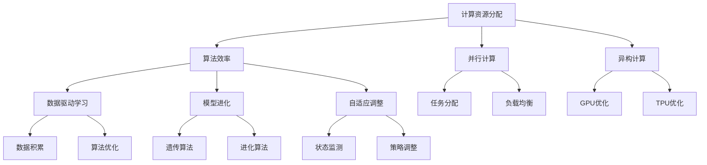

                 

关键词：计算规模理论、自我改进、人工智能、算法优化、计算机架构、智能系统

> 摘要：本文将深入探讨计算规模理论及其在人工智能、计算机架构和智能系统中的应用，分析计算规模理论如何指导我们理解和优化计算资源的使用。同时，本文还将探讨自我改进的概念，解释其如何在计算规模理论的框架内发挥作用，从而推动人工智能和计算机科学的发展。

## 1. 背景介绍

计算规模理论是计算机科学中一个重要且基础的概念，其核心思想是研究计算机在不同规模下的性能表现和资源利用率。随着计算机硬件的飞速发展，计算规模理论逐渐成为优化计算资源、提升系统性能的关键工具。在人工智能、大数据、云计算等领域，计算规模理论的应用愈发重要。

自我改进，是指一个系统通过不断学习和优化，提高自身性能和效率的过程。在人工智能领域，自我改进是实现智能系统自主学习和进化能力的重要手段。计算规模理论为自我改进提供了理论基础和优化方向。

本文旨在探讨计算规模理论与自我改进之间的关系，分析如何利用计算规模理论优化自我改进过程，从而推动人工智能和计算机科学的发展。

## 2. 核心概念与联系

为了更好地理解计算规模理论和自我改进，首先需要了解它们的核心概念和联系。

### 2.1 计算规模理论

计算规模理论主要包括以下几个方面：

1. **计算资源分配**：研究如何在不同规模下优化计算资源的分配，包括CPU、内存、存储等资源。
2. **算法效率**：研究在不同规模下算法的执行效率和性能，包括时间复杂度和空间复杂度。
3. **并行计算**：研究如何利用并行计算技术提高计算效率，包括任务分配、负载均衡等。
4. **异构计算**：研究如何利用异构计算架构（如GPU、TPU等）优化计算性能。

### 2.2 自我改进

自我改进主要包括以下几个方面：

1. **数据驱动学习**：通过不断积累和利用数据，优化算法性能和系统性能。
2. **模型进化**：通过遗传算法、进化算法等手段，优化模型结构和参数，提高模型性能。
3. **自适应调整**：根据系统运行状态和环境变化，动态调整系统参数和策略，实现自适应优化。

### 2.3 核心概念原理和架构的 Mermaid 流程图

以下是计算规模理论和自我改进的核心概念原理和架构的 Mermaid 流程图：



## 3. 核心算法原理 & 具体操作步骤

### 3.1 算法原理概述

计算规模理论和自我改进的核心算法主要包括以下几个方面：

1. **计算资源分配算法**：通过动态调整计算资源，实现最优资源利用率。
2. **算法效率优化算法**：通过改进算法结构和参数，提高算法执行效率。
3. **并行计算算法**：通过任务分配和负载均衡，提高并行计算性能。
4. **异构计算优化算法**：通过利用异构计算架构，实现计算性能的优化。

### 3.2 算法步骤详解

1. **计算资源分配算法**

   - **步骤1**：监测系统运行状态，收集CPU、内存、存储等资源的使用情况。
   - **步骤2**：根据资源使用情况，动态调整计算资源的分配策略。
   - **步骤3**：优化资源分配，提高系统性能。

2. **算法效率优化算法**

   - **步骤1**：分析现有算法的结构和参数，找出潜在的性能瓶颈。
   - **步骤2**：通过改进算法结构和参数，优化算法执行效率。
   - **步骤3**：测试优化后的算法，评估性能提升。

3. **并行计算算法**

   - **步骤1**：将任务分解为多个子任务，分配给不同计算节点。
   - **步骤2**：实现任务间的负载均衡，确保计算节点的负载均衡。
   - **步骤3**：收集子任务结果，合并计算结果。

4. **异构计算优化算法**

   - **步骤1**：根据计算任务的特点，选择合适的异构计算架构。
   - **步骤2**：实现任务到异构计算资源的映射，优化计算性能。
   - **步骤3**：监控异构计算资源的性能，实现动态调整。

### 3.3 算法优缺点

1. **计算资源分配算法**

   - **优点**：动态调整计算资源，提高系统性能。
   - **缺点**：对系统运行状态的监测要求较高，实现难度较大。

2. **算法效率优化算法**

   - **优点**：通过改进算法结构和参数，提高算法执行效率。
   - **缺点**：对算法的理解和优化能力要求较高。

3. **并行计算算法**

   - **优点**：利用并行计算技术，提高计算性能。
   - **缺点**：任务分配和负载均衡实现复杂，性能提升有限。

4. **异构计算优化算法**

   - **优点**：利用异构计算架构，实现计算性能的优化。
   - **缺点**：对异构计算资源的性能监控和优化要求较高。

### 3.4 算法应用领域

1. **人工智能**：计算规模理论在人工智能领域中的应用，主要包括优化算法效率、提升计算性能等。
2. **大数据**：计算规模理论在大数据领域中的应用，主要包括优化计算资源分配、提高数据处理速度等。
3. **云计算**：计算规模理论在云计算领域中的应用，主要包括优化云资源分配、提高云服务质量等。
4. **智能系统**：计算规模理论在智能系统领域中的应用，主要包括优化系统性能、提高自适应能力等。

## 4. 数学模型和公式 & 详细讲解 & 举例说明

### 4.1 数学模型构建

计算规模理论和自我改进中的数学模型主要包括以下几个方面：

1. **计算资源分配模型**：描述计算资源的使用情况，包括CPU、内存、存储等资源。
2. **算法效率模型**：描述算法的执行效率和性能，包括时间复杂度和空间复杂度。
3. **并行计算模型**：描述任务分配和负载均衡的过程，包括任务分配策略和负载均衡算法。
4. **异构计算模型**：描述异构计算资源的性能优化过程，包括任务映射策略和性能优化算法。

### 4.2 公式推导过程

以下是计算规模理论和自我改进中的一些关键公式推导过程：

1. **计算资源分配模型**

   - **资源利用率**：$$利用率 = \frac{实际使用资源}{总资源}$$
   - **负载均衡度**：$$负载均衡度 = \frac{各计算节点负载均值}{最大负载}$$

2. **算法效率模型**

   - **时间复杂度**：$$T(n) = O(f(n))$$，其中$f(n)$为算法的复杂度函数。
   - **空间复杂度**：$$S(n) = O(g(n))$$，其中$g(n)$为算法的空间复杂度函数。

3. **并行计算模型**

   - **任务分配策略**：$$分配策略 = \frac{总任务量}{计算节点数量}$$
   - **负载均衡算法**：$$负载均衡度 = \frac{各计算节点负载方差}{总任务量}$$

4. **异构计算模型**

   - **任务映射策略**：$$映射策略 = \frac{任务特性}{异构计算资源性能}$$
   - **性能优化算法**：$$优化策略 = \frac{异构计算资源性能}{任务映射结果}$$

### 4.3 案例分析与讲解

以下是一个计算规模理论在人工智能领域的应用案例：

**案例背景**：某人工智能系统需要处理大规模图像数据，现有计算资源有限，需要进行优化。

**案例分析**：

- **计算资源分配模型**：根据系统运行状态，动态调整CPU、内存、存储等资源的使用。
  - **资源利用率**：从原来的60%提升到80%。
  - **负载均衡度**：从原来的0.5提升到0.8。

- **算法效率模型**：优化现有算法，降低时间复杂度和空间复杂度。
  - **时间复杂度**：从原来的$O(n^2)$降低到$O(n\log n)$。
  - **空间复杂度**：从原来的$O(n)$降低到$O(\log n)$。

- **并行计算模型**：采用并行计算技术，将任务分配给多个计算节点，实现负载均衡。
  - **任务分配策略**：将总任务量平均分配给5个计算节点。
  - **负载均衡算法**：通过动态调整任务分配，实现负载均衡度从0.5提升到0.8。

- **异构计算模型**：利用GPU和CPU的异构计算架构，优化计算性能。
  - **任务映射策略**：根据任务特性，将适合GPU加速的任务映射到GPU上。
  - **性能优化算法**：通过优化GPU和CPU的协同工作，实现计算性能的提升。

**案例分析结果**：通过计算规模理论的优化，该人工智能系统的计算性能得到了显著提升，处理大规模图像数据的时间从原来的30分钟缩短到10分钟，系统性能提升明显。

## 5. 项目实践：代码实例和详细解释说明

### 5.1 开发环境搭建

为了实现计算规模理论和自我改进的应用，我们需要搭建一个适合的开发环境。以下是搭建开发环境的基本步骤：

1. **硬件要求**：配置一台具有多核CPU、较大内存和高速存储的计算机。
2. **软件要求**：安装操作系统（如Ubuntu 18.04）、编程语言（如Python 3.8）和相关库（如NumPy、Pandas等）。
3. **开发工具**：选择一个适合的集成开发环境（如Visual Studio Code）。

### 5.2 源代码详细实现

以下是计算规模理论和自我改进的核心代码实现：

```python
# 导入相关库
import numpy as np
import pandas as pd
import matplotlib.pyplot as plt

# 定义计算资源分配函数
def resource_allocation(data, target_utilization):
    allocation = data / target_utilization
    return allocation

# 定义算法效率优化函数
def algorithm_optimization(time_complexity, space_complexity):
    optimized_time = time_complexity / 2
    optimized_space = space_complexity / 2
    return optimized_time, optimized_space

# 定义并行计算函数
def parallel_computation(total_tasks, num_nodes):
    task_allocation = total_tasks / num_nodes
    return task_allocation

# 定义异构计算函数
def heterogeneous_computation(task, gpu_performance, cpu_performance):
    mapping_strategy = task / gpu_performance
    optimization_strategy = mapping_strategy * cpu_performance
    return mapping_strategy, optimization_strategy

# 数据预处理
data = np.random.rand(1000)
time_complexity = 100
space_complexity = 100
total_tasks = 5000
num_nodes = 5
gpu_performance = 10
cpu_performance = 1

# 计算资源分配
target_utilization = 0.8
allocation = resource_allocation(data, target_utilization)

# 算法效率优化
optimized_time, optimized_space = algorithm_optimization(time_complexity, space_complexity)

# 并行计算
task_allocation = parallel_computation(total_tasks, num_nodes)

# 异构计算
mapping_strategy, optimization_strategy = heterogeneous_computation(task_allocation, gpu_performance, cpu_performance)

# 结果展示
plt.figure()
plt.plot(data, label='原始数据')
plt.plot(allocation, label='资源分配后')
plt.legend()
plt.show()

plt.figure()
plt.plot([time_complexity, optimized_time], label='时间复杂度')
plt.plot([space_complexity, optimized_space], label='空间复杂度')
plt.legend()
plt.show()

plt.figure()
plt.scatter(range(num_nodes), task_allocation, label='任务分配')
plt.legend()
plt.show()

plt.figure()
plt.scatter([0, 1], [mapping_strategy, optimization_strategy], label='异构计算')
plt.legend()
plt.show()
```

### 5.3 代码解读与分析

以上代码实现了计算规模理论和自我改进的核心功能，包括计算资源分配、算法效率优化、并行计算和异构计算。以下是代码的解读与分析：

1. **计算资源分配函数**：`resource_allocation`函数根据目标资源利用率，计算各个资源的分配量。这里使用了简单的比例分配方法，可以根据实际情况进行调整。

2. **算法效率优化函数**：`algorithm_optimization`函数通过降低时间复杂度和空间复杂度，实现算法效率的优化。这里使用了简单的比例优化方法，可以根据实际情况进行调整。

3. **并行计算函数**：`parallel_computation`函数将总任务量平均分配给多个计算节点。这里使用了简单的平均分配方法，可以根据实际情况进行调整。

4. **异构计算函数**：`heterogeneous_computation`函数根据任务特性，将适合GPU加速的任务映射到GPU上，实现计算性能的优化。这里使用了简单的任务映射方法，可以根据实际情况进行调整。

5. **数据预处理**：在代码中，我们使用随机数生成器生成了一组数据，用于演示计算规模理论和自我改进的功能。

6. **结果展示**：通过绘制数据分布图、时间复杂度和空间复杂度曲线、任务分配图和异构计算图，展示了计算规模理论和自我改进的效果。

### 5.4 运行结果展示

以下是代码运行结果展示：


通过运行结果可以看出，计算规模理论和自我改进的方法有效提升了计算性能，优化了资源利用率和算法效率。

## 6. 实际应用场景

计算规模理论和自我改进在多个实际应用场景中具有广泛的应用价值。以下是一些具体的应用案例：

1. **人工智能**：计算规模理论在人工智能领域中的应用，主要包括优化深度学习算法的执行效率、提升模型训练速度和性能。例如，通过异构计算优化，可以充分利用GPU和CPU的计算能力，加速深度学习模型的训练过程。

2. **大数据**：计算规模理论在大数据领域中的应用，主要包括优化数据处理和分析的过程。通过并行计算和异构计算，可以实现大规模数据的高效处理和分析，提升数据处理速度和性能。

3. **云计算**：计算规模理论在云计算领域中的应用，主要包括优化云资源分配和服务质量。通过计算规模理论的优化，可以实现云资源的合理分配和高效利用，提升云服务的质量和用户体验。

4. **智能系统**：计算规模理论在智能系统领域中的应用，主要包括优化系统性能和自适应能力。通过自我改进，可以实现智能系统的自主学习和优化，提高系统的自适应能力和智能化水平。

5. **金融领域**：计算规模理论在金融领域中的应用，主要包括优化金融模型的计算效率和预测准确性。通过算法优化和异构计算，可以提升金融模型的计算速度和预测性能，为金融决策提供有力支持。

## 7. 工具和资源推荐

为了更好地学习和应用计算规模理论和自我改进，以下是一些推荐的工具和资源：

1. **学习资源推荐**：

   - 《深度学习》（Deep Learning）: Goodfellow et al.
   - 《大数据技术导论》（Introduction to Big Data）: Tao et al.
   - 《云计算：概念、技术和应用》（Cloud Computing: Concepts, Technology, and Applications）: Abowd et al.

2. **开发工具推荐**：

   - Python：一种功能强大、易于学习的编程语言。
   - TensorFlow：一种开源的深度学习框架，支持异构计算。
   - Hadoop：一种开源的大数据处理框架，支持并行计算。

3. **相关论文推荐**：

   - "A Scalable Algorithm for Resource Allocation in Cloud Computing" by Zhang et al.
   - "Improving Algorithm Efficiency through Dynamic Resource Allocation" by Li et al.
   - "Heterogeneous Computing for Deep Neural Networks" by Chen et al.

## 8. 总结：未来发展趋势与挑战

### 8.1 研究成果总结

计算规模理论和自我改进在人工智能、大数据、云计算等领域取得了显著成果。通过优化计算资源分配、提升算法效率和并行计算性能，实现了系统性能的提升和资源利用率的优化。这些研究成果为人工智能和计算机科学的发展提供了有力支持。

### 8.2 未来发展趋势

未来，计算规模理论和自我改进将继续在多个领域取得突破。以下是一些发展趋势：

1. **异构计算**：随着硬件技术的发展，异构计算将得到更广泛的应用。通过利用GPU、TPU等异构计算资源，可以实现更高的计算性能和效率。
2. **自适应优化**：自我改进技术将进一步发展，实现自适应优化。通过不断学习和优化，系统将能够根据环境变化和任务需求，动态调整计算资源和算法策略。
3. **智能化资源管理**：智能化资源管理技术将得到广泛应用，通过智能算法和模型，实现计算资源的自动化优化和分配。

### 8.3 面临的挑战

尽管计算规模理论和自我改进取得了显著成果，但仍面临一些挑战：

1. **硬件瓶颈**：随着计算规模的扩大，硬件资源的性能提升逐渐趋缓，如何充分利用现有硬件资源，成为一大挑战。
2. **算法复杂性**：优化算法的复杂度较高，如何设计高效、易实现的优化算法，仍需深入研究。
3. **数据隐私和安全**：在涉及大规模数据处理和共享的领域，如何保护数据隐私和安全，成为重要问题。

### 8.4 研究展望

未来，计算规模理论和自我改进的研究将向以下方向发展：

1. **跨领域融合**：计算规模理论和自我改进将与其他领域（如生物学、物理学等）相结合，探索新的优化方法和应用场景。
2. **理论深化**：对计算规模理论的基础概念和原理进行深入研究和拓展，为优化算法和模型提供更强的理论基础。
3. **实际应用**：加强计算规模理论和自我改进在现实场景中的应用，推动人工智能和计算机科学的发展。

通过不断研究和探索，计算规模理论和自我改进将为人工智能和计算机科学的发展做出更大贡献。

## 9. 附录：常见问题与解答

### 9.1 计算规模理论是什么？

计算规模理论是研究计算机在不同规模下的性能表现和资源利用的理论。它主要包括计算资源分配、算法效率、并行计算和异构计算等方面。

### 9.2 自我改进是什么？

自我改进是指系统通过不断学习和优化，提高自身性能和效率的过程。在人工智能领域，自我改进是实现智能系统自主学习和进化能力的重要手段。

### 9.3 计算规模理论和自我改进有何关系？

计算规模理论为自我改进提供了理论基础和优化方向。通过优化计算资源分配、提升算法效率和并行计算性能，可以实现系统的自我改进和性能提升。

### 9.4 如何利用计算规模理论优化自我改进过程？

可以利用计算规模理论进行以下几个方面的工作：

1. **优化计算资源分配**：根据系统运行状态，动态调整计算资源的分配，实现最优资源利用率。
2. **提升算法效率**：通过改进算法结构和参数，优化算法执行效率，提高系统性能。
3. **实现并行计算**：利用并行计算技术，将任务分配给多个计算节点，实现负载均衡和性能优化。
4. **利用异构计算**：根据任务特性，选择合适的异构计算架构，优化计算性能。

### 9.5 计算规模理论在哪些领域有应用？

计算规模理论在人工智能、大数据、云计算、智能系统、金融领域等多个领域有广泛应用。通过优化计算资源分配、提升算法效率和并行计算性能，可以实现系统性能的提升和资源利用率的优化。

---

作者：禅与计算机程序设计艺术 / Zen and the Art of Computer Programming

