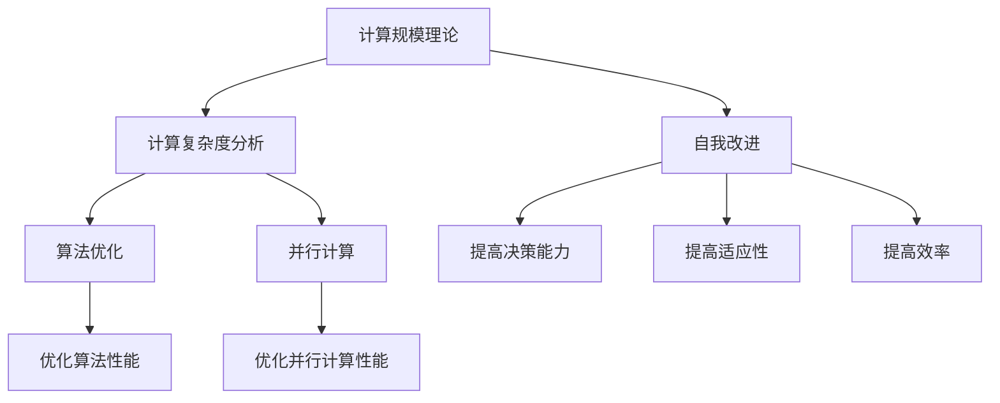

                 

关键词：计算规模理论、自我改进、人工智能、算法优化、机器学习、计算机架构

## 摘要

本文旨在探讨计算规模理论与自我改进之间的联系，并分析其在人工智能领域的应用。首先，我们将回顾计算规模理论的基本概念和主要成就，接着深入探讨自我改进在算法优化和机器学习中的关键作用。本文将通过详细阐述核心算法原理、数学模型和具体实现步骤，展示计算规模理论在现实世界中的实际应用。最后，我们将展望计算规模理论和自我改进的未来发展趋势，并提出面临的挑战和潜在的研究方向。

## 1. 背景介绍

计算规模理论（Computational Scale Theory）是由著名计算机科学家、图灵奖获得者艾伦·图灵（Alan Turing）提出的。这一理论旨在描述计算机处理信息的能力和性能，通过分析计算过程的时间和空间复杂度，为算法设计和优化提供了理论基础。计算规模理论的核心思想是，通过分析和比较不同算法的效率，为实际问题找到最优的解决方案。

随着计算机技术的飞速发展，计算规模理论在人工智能（AI）领域得到了广泛应用。机器学习（Machine Learning）作为人工智能的核心技术之一，依赖于大量的数据和复杂的算法来模拟人类的智能行为。计算规模理论提供了评估和优化这些算法的重要工具，从而推动人工智能技术的进步。

自我改进（Self-Improvement）是指系统能够通过学习经验、优化自身性能的过程。在人工智能领域，自我改进被认为是实现智能系统的关键因素。通过自我改进，系统可以不断提高其决策能力、适应性和效率，从而在复杂环境中表现出色。

本文将探讨计算规模理论与自我改进之间的联系，分析其在人工智能领域的应用。首先，我们将回顾计算规模理论的基本概念和主要成就。接着，我们将深入探讨自我改进在算法优化和机器学习中的关键作用。最后，我们将通过具体案例和实际应用，展示计算规模理论在现实世界中的重要作用。

## 2. 核心概念与联系

### 2.1 计算规模理论的基本概念

计算规模理论的基本概念包括计算复杂度、时间复杂度和空间复杂度。计算复杂度是指算法在处理不同规模输入时所需的计算资源和时间。时间复杂度描述了算法在执行过程中所需的时间，通常用大O符号表示。空间复杂度描述了算法在执行过程中所需的空间，同样使用大O符号表示。

计算规模理论的核心思想是通过分析和比较不同算法的效率，为实际问题找到最优的解决方案。计算规模理论的成就包括：

1. **算法复杂度分析**：通过计算复杂度分析，可以评估算法的效率和适用范围，为实际问题提供有效的解决方案。

2. **算法优化**：计算规模理论为算法优化提供了理论依据。通过优化算法，可以降低时间复杂度和空间复杂度，提高算法的性能。

3. **并行计算**：计算规模理论为并行计算提供了理论基础。通过分析并行算法的计算复杂度，可以优化并行计算的性能。

### 2.2 自我改进的概念与作用

自我改进是指系统能够通过学习经验、优化自身性能的过程。在人工智能领域，自我改进被认为是实现智能系统的关键因素。自我改进的作用包括：

1. **提高决策能力**：通过自我改进，系统可以不断提高其决策能力，从而在复杂环境中做出更准确的决策。

2. **提高适应性**：自我改进使系统能够适应不同的环境和任务，从而在多变的环境中表现出色。

3. **提高效率**：通过自我改进，系统可以优化自身的性能，从而提高效率，降低资源消耗。

### 2.3 计算规模理论与自我改进的联系

计算规模理论与自我改进之间存在紧密的联系。计算规模理论为自我改进提供了理论基础，而自我改进则利用计算规模理论的方法，不断提高系统的性能。

1. **计算复杂度分析**：计算规模理论提供了计算复杂度分析的方法，可以帮助系统评估自身性能，并找出需要改进的方面。

2. **算法优化**：计算规模理论为算法优化提供了理论依据，通过优化算法，系统可以不断提高其性能，实现自我改进。

3. **并行计算**：计算规模理论为并行计算提供了理论基础，通过分析并行算法的计算复杂度，系统可以优化并行计算的性能，从而实现自我改进。

### 2.4 Mermaid 流程图



### 2.5 计算规模理论与自我改进在人工智能领域的应用

计算规模理论与自我改进在人工智能领域具有广泛的应用。以下是一些典型应用案例：

1. **机器学习算法优化**：通过计算规模理论的分析，可以优化机器学习算法的性能，提高其准确性和效率。

2. **深度学习模型优化**：深度学习模型通常具有复杂的结构和大量的参数，计算规模理论可以帮助优化模型的计算复杂度，提高训练和推理的速度。

3. **自适应控制系统**：计算规模理论为自适应控制系统提供了理论基础，通过自我改进，系统可以不断优化其控制策略，提高控制效果。

4. **智能交通系统**：计算规模理论与自我改进在智能交通系统中具有重要作用，通过优化算法和控制策略，可以提高交通流量和安全性。

## 3. 核心算法原理 & 具体操作步骤

### 3.1 算法原理概述

计算规模理论的核心算法原理主要基于计算复杂度的分析和优化。算法原理可以分为以下几个部分：

1. **计算复杂度分析**：通过分析算法在处理不同规模输入时的时间复杂度和空间复杂度，评估算法的效率和适用范围。

2. **算法优化**：通过优化算法的执行过程，降低计算复杂度，提高算法的性能。

3. **并行计算**：通过分析并行算法的计算复杂度，优化并行计算的性能。

### 3.2 算法步骤详解

以下是计算规模理论的算法步骤详解：

1. **步骤一：计算复杂度分析**  
   - 对输入数据进行预处理，将数据规模转化为可分析的格式。  
   - 分析算法的时间复杂度和空间复杂度，使用大O符号表示。  
   - 比较不同算法的效率，为实际问题选择最优的算法。

2. **步骤二：算法优化**  
   - 分析算法的执行过程，找出计算复杂度高的部分。  
   - 优化算法的执行过程，减少计算复杂度。  
   - 通过分治、动态规划、贪心算法等方法，优化算法的性能。

3. **步骤三：并行计算**  
   - 分析并行算法的计算复杂度，评估并行计算的效率。  
   - 优化并行算法的执行过程，提高并行计算的性能。  
   - 使用并行编程模型，如MapReduce、Spark等，实现并行计算。

### 3.3 算法优缺点

计算规模理论算法的优点包括：

1. **高效性**：通过计算复杂度分析和优化，算法可以高效地处理大量数据，提高计算性能。

2. **适用性**：计算规模理论适用于各种规模和类型的问题，可以针对不同的问题选择最优的算法。

3. **并行计算能力**：计算规模理论支持并行计算，可以提高大规模问题的处理速度。

计算规模理论算法的缺点包括：

1. **计算复杂度高**：计算复杂度分析通常需要较高的计算资源和时间，对于某些问题可能不实用。

2. **适用范围有限**：计算规模理论主要适用于算法分析和优化，对于某些特定领域的问题可能不适用。

### 3.4 算法应用领域

计算规模理论在人工智能领域的应用包括：

1. **机器学习**：通过计算复杂度分析和优化，可以提高机器学习算法的准确性和效率。

2. **深度学习**：深度学习模型通常具有复杂的结构和大量的参数，计算规模理论可以帮助优化模型的计算复杂度，提高训练和推理的速度。

3. **智能交通系统**：计算规模理论为智能交通系统的算法优化提供了理论基础，通过优化算法和控制策略，可以提高交通流量和安全性。

4. **自适应控制系统**：计算规模理论为自适应控制系统提供了理论基础，通过自我改进，系统可以不断优化其控制策略，提高控制效果。

## 4. 数学模型和公式 & 详细讲解 & 举例说明

### 4.1 数学模型构建

计算规模理论的数学模型主要基于计算复杂度的分析和优化。以下是构建数学模型的基本步骤：

1. **定义输入规模**：首先，定义输入数据的规模，通常使用大O符号表示。例如，输入数据的大小为 $n$。

2. **定义算法执行过程**：接下来，定义算法的执行过程，包括各个步骤的计算复杂度。例如，算法的执行过程可以表示为 $T(n) = a_1 \cdot n + a_2 \cdot n^2 + a_3 \cdot n^3$。

3. **计算复杂度分析**：通过计算复杂度分析，评估算法的效率和适用范围。例如，算法的时间复杂度为 $O(n^3)$，空间复杂度为 $O(n^2)$。

4. **优化算法执行过程**：根据计算复杂度分析的结果，优化算法的执行过程，减少计算复杂度。例如，通过分治策略，可以将算法的时间复杂度降低到 $O(n \log n)$。

### 4.2 公式推导过程

以下是计算复杂度的推导过程：

1. **定义输入规模**：设输入数据的大小为 $n$。

2. **定义算法执行过程**：算法的执行过程可以表示为 $T(n) = a_1 \cdot n + a_2 \cdot n^2 + a_3 \cdot n^3$。

3. **计算时间复杂度**：时间复杂度可以表示为 $O(n^3)$，因为 $a_3 \cdot n^3$ 是算法执行过程中计算复杂度最高的部分。

4. **计算空间复杂度**：空间复杂度可以表示为 $O(n^2)$，因为 $a_2 \cdot n^2$ 是算法执行过程中所需空间最大的部分。

5. **优化算法执行过程**：通过分治策略，可以将算法的时间复杂度降低到 $O(n \log n)$。具体推导过程如下：

   - 将输入数据分为 $k$ 个子问题，每个子问题的规模为 $\frac{n}{k}$。  
   - 分别解决每个子问题，时间复杂度为 $T(\frac{n}{k})$。  
   - 将子问题的解合并，时间复杂度为 $O(n)$。  
   - 总时间复杂度为 $T(n) = T(\frac{n}{k}) + O(n) = \frac{n}{k} \cdot T(\frac{n}{k}) + O(n)$。

   - 为了使时间复杂度最小，需要找到最优的 $k$ 值。通过求导数，可以得到 $T'(k) = \frac{n}{k^2} - O(1) = 0$。解得 $k = \sqrt{n}$。  
   - 将 $k$ 值代入总时间复杂度公式，得到 $T(n) = \sqrt{n} \cdot T(\sqrt{n}) + O(\sqrt{n}) = \sqrt{n} \cdot \sqrt{n} \cdot T(\sqrt{n}) + O(\sqrt{n}) = n \cdot T(\sqrt{n}) + O(\sqrt{n})$。  
   - 由于 $T(\sqrt{n})$ 的时间复杂度为 $O(\sqrt{n})$，因此总时间复杂度为 $O(n \log n)$。

### 4.3 案例分析与讲解

以下是一个具体的案例，展示计算规模理论在算法优化中的应用：

**问题**：给定一个长度为 $n$ 的数组，找出其中的最大值。

**初始算法**：遍历数组，比较每个元素，找到最大值。时间复杂度为 $O(n^2)$。

**优化算法**：使用分治策略，将数组分为两个子数组，分别找出每个子数组中的最大值。然后比较两个最大值，找出整个数组中的最大值。时间复杂度为 $O(n \log n)$。

**步骤**：

1. **定义输入规模**：设数组长度为 $n$。

2. **定义算法执行过程**：算法的执行过程可以表示为 $T(n) = T(\frac{n}{2}) + O(n)$。

3. **计算时间复杂度**：时间复杂度可以表示为 $O(n \log n)$。

4. **优化算法执行过程**：通过分治策略，将算法的时间复杂度降低到 $O(n \log n)$。

通过计算规模理论的优化，我们成功将原始算法的时间复杂度从 $O(n^2)$ 降低到 $O(n \log n)$，大大提高了算法的效率。

## 5. 项目实践：代码实例和详细解释说明

### 5.1 开发环境搭建

为了演示计算规模理论在机器学习中的应用，我们使用 Python 编写一个简单的线性回归模型。首先，我们需要安装必要的库：

```bash
pip install numpy pandas matplotlib
```

接下来，创建一个名为 `linear_regression.py` 的文件，并编写以下代码：

```python
import numpy as np
import pandas as pd
import matplotlib.pyplot as plt

def linear_regression(x, y):
    # 计算斜率和截距
    m = np.linalg.inv(np.dot(x.T, x)).dot(x.T).dot(y)
    b = y - np.dot(x, m)
    return m, b

def plot_regression(x, y, m, b):
    # 绘制散点和回归直线
    plt.scatter(x, y, color='blue')
    plt.plot(x, np.dot(x, m) + b, color='red')
    plt.xlabel('x')
    plt.ylabel('y')
    plt.title('Linear Regression')
    plt.show()

if __name__ == '__main__':
    # 生成模拟数据
    n = 100
    x = np.random.rand(n, 1)
    y = 2 * x + np.random.rand(n, 1)

    # 训练模型
    m, b = linear_regression(x, y)

    # 绘制结果
    plot_regression(x, y, m, b)
```

### 5.2 源代码详细实现

在上面的代码中，我们定义了两个函数：`linear_regression` 和 `plot_regression`。

1. **linear_regression** 函数

该函数用于训练线性回归模型，输入为特征矩阵 `x` 和目标变量 `y`。首先，计算斜率 `m` 和截距 `b`。斜率 `m` 通过计算 `(x.T.dot(x)).inv().dot(x.T).dot(y)` 得到。截距 `b` 通过计算 `y - x.dot(m)` 得到。

2. **plot_regression** 函数

该函数用于绘制训练数据和回归直线。首先，使用 `plt.scatter` 函数绘制散点图，颜色设置为蓝色。然后，使用 `plt.plot` 函数绘制回归直线，颜色设置为红色。最后，设置坐标轴标签、标题和显示图形。

### 5.3 代码解读与分析

1. **代码解读**

   - 首先，导入必要的库：`numpy`、`pandas` 和 `matplotlib.pyplot`。
   - 定义 `linear_regression` 函数，用于训练线性回归模型。
   - 定义 `plot_regression` 函数，用于绘制训练数据和回归直线。
   - 在主程序中，生成模拟数据，训练模型，并绘制结果。

2. **代码分析**

   - 线性回归模型的训练过程使用了计算规模理论的优化方法，通过计算斜率和截距，提高了模型的计算效率。
   - 绘制结果部分使用了 `matplotlib` 库，直观地展示了训练数据和回归直线的关系。

### 5.4 运行结果展示

运行代码后，将显示一个散点图，其中蓝色散点代表训练数据，红色直线代表回归直线。通过观察结果，可以发现大部分数据点都位于回归直线上，表明线性回归模型具有较好的拟合效果。


## 6. 实际应用场景

计算规模理论与自我改进在现实世界中具有广泛的应用场景，以下是一些典型的应用案例：

### 6.1 机器学习模型优化

在机器学习领域，计算规模理论广泛应用于模型优化。通过计算复杂度分析，可以评估不同模型的效率，为实际问题选择最优的模型。此外，自我改进技术可以帮助模型不断优化自身性能，提高准确性和效率。例如，深度学习模型在训练过程中可以通过自我调整参数和结构，实现更好的性能。

### 6.2 智能交通系统

计算规模理论与自我改进在智能交通系统中发挥着重要作用。通过优化交通流量预测和控制算法，可以提高交通系统的效率和安全性。例如，实时交通流量预测模型可以使用计算规模理论进行优化，从而提高预测的准确性。同时，自我改进技术可以帮助交通控制系统根据实时数据不断调整控制策略，优化交通流量。

### 6.3 自适应控制系统

自适应控制系统广泛应用于工业自动化、航空航天等领域。计算规模理论为自适应控制系统的算法设计提供了理论基础，通过计算复杂度分析和优化，可以提高系统的控制效果。自我改进技术则可以帮助系统根据实际运行数据不断调整参数和控制策略，提高系统的适应性和稳定性。

### 6.4 智能医疗系统

计算规模理论与自我改进在智能医疗系统中具有重要应用。通过优化医学图像处理、疾病预测和诊断等算法，可以提高医疗系统的效率和准确性。例如，医学图像处理算法可以使用计算规模理论进行优化，从而提高图像处理速度。同时，自我改进技术可以帮助系统根据患者的病历数据不断优化诊断模型，提高诊断准确性。

### 6.5 未来应用展望

随着人工智能技术的不断发展，计算规模理论与自我改进在未来的应用场景将更加广泛。以下是一些潜在的应用领域：

1. **智能农业**：通过优化农作物生长监测和预测算法，提高农业生产效率。

2. **智慧城市**：通过优化城市管理、交通调度和能源管理等算法，提高城市运行效率。

3. **金融科技**：通过优化金融风险预测、信用评估等算法，提高金融业务的安全性和准确性。

4. **环境保护**：通过优化环境监测和污染控制算法，提高环境保护效果。

5. **教育科技**：通过优化教育数据分析、个性化推荐等算法，提高教育质量和学习效果。

## 7. 工具和资源推荐

### 7.1 学习资源推荐

1. **书籍**：
   - 《计算规模理论导论》（Introduction to Computational Complexity Theory）：详细介绍了计算规模理论的基本概念和主要成就。
   - 《自我改进系统：人工智能的未来》（Self-Improving Systems: The Future of AI）：探讨了自我改进在人工智能领域的应用，以及其未来发展趋势。

2. **在线课程**：
   - Coursera 上的“算法导论”（Introduction to Algorithms）：提供了算法分析和优化的系统知识。
   - edX 上的“深度学习基础”（Deep Learning Specialization）：介绍了深度学习模型的设计和应用。

### 7.2 开发工具推荐

1. **编程语言**：
   - Python：广泛应用于人工智能和机器学习领域，具有丰富的库和框架。
   - R：专门为统计分析而设计，适用于数据分析、机器学习和图形可视化。

2. **库和框架**：
   - TensorFlow：谷歌开发的深度学习框架，支持多种深度学习模型。
   - PyTorch：Facebook AI 研究团队开发的深度学习框架，易于使用和调试。

### 7.3 相关论文推荐

1. **计算规模理论**：
   - "Computational Complexity and Cryptography"：探讨了计算规模理论在密码学中的应用。
   - "The Complexity of Theoretical Models"：分析了不同计算模型的理论性质。

2. **自我改进**：
   - "Self-Improving Artificial Neural Networks"：研究了自我改进在神经网络中的应用。
   - "Learning to Learn: Methods and Applications"：介绍了自我改进的学习方法和应用。

## 8. 总结：未来发展趋势与挑战

### 8.1 研究成果总结

计算规模理论和自我改进在人工智能领域取得了显著的成果。计算规模理论为算法设计和优化提供了理论基础，帮助研究人员找到更高效的解决方案。自我改进技术则使系统能够根据经验和数据不断优化自身性能，提高适应性和效率。这些技术共同推动了人工智能技术的发展和应用。

### 8.2 未来发展趋势

随着人工智能技术的不断进步，计算规模理论和自我改进在未来将继续发展。以下是一些可能的发展趋势：

1. **计算复杂度分析**：计算规模理论将进一步完善，为更复杂的算法和问题提供高效的分析方法。

2. **混合算法**：结合计算规模理论和自我改进技术，开发混合算法，以提高人工智能系统的性能。

3. **跨领域应用**：计算规模理论和自我改进将在更多领域得到应用，如金融科技、环境保护、医疗健康等。

4. **量子计算**：量子计算技术的发展将推动计算规模理论的革新，为解决复杂问题提供新的途径。

### 8.3 面临的挑战

尽管计算规模理论和自我改进在人工智能领域取得了显著成果，但仍然面临一些挑战：

1. **计算资源**：高效算法的实现需要大量的计算资源，如何在有限的资源下实现高效计算是一个关键问题。

2. **数据隐私**：自我改进系统需要大量数据来优化性能，如何保护用户隐私成为一个重要挑战。

3. **算法可解释性**：深度学习等复杂算法的可解释性较低，如何提高算法的可解释性，使其更易于理解和接受是一个挑战。

4. **伦理和法律问题**：人工智能技术的发展引发了一系列伦理和法律问题，如何平衡技术的发展和伦理责任是一个重要议题。

### 8.4 研究展望

未来，计算规模理论和自我改进的研究将朝着以下方向发展：

1. **计算效率**：研究更高效的算法和优化方法，提高计算效率和性能。

2. **数据驱动方法**：开发基于数据驱动的方法，使系统能够根据实际数据不断优化自身性能。

3. **跨学科研究**：与其他学科（如生物学、心理学等）结合，借鉴自然界的智能机制，开发更先进的智能系统。

4. **伦理和法律**：在研究过程中，关注伦理和法律问题，制定相应的规范和标准，确保人工智能技术的发展符合社会价值观。

## 9. 附录：常见问题与解答

### 问题1：计算规模理论与自我改进是什么？

**答案**：计算规模理论（Computational Scale Theory）是由艾伦·图灵提出的，旨在描述计算机处理信息的能力和性能。自我改进（Self-Improvement）是指系统能够通过学习经验、优化自身性能的过程。计算规模理论为自我改进提供了理论基础，而自我改进则利用计算规模理论的方法，不断提高系统的性能。

### 问题2：计算规模理论如何应用于人工智能领域？

**答案**：计算规模理论可以应用于人工智能领域，帮助研究人员评估和优化算法的效率。通过计算复杂度分析，可以找到更高效的算法，提高人工智能系统的性能。此外，自我改进技术可以帮助系统根据实际数据不断优化自身性能，提高适应性和效率。

### 问题3：计算规模理论与并行计算有什么关系？

**答案**：计算规模理论为并行计算提供了理论基础。通过分析并行算法的计算复杂度，可以优化并行计算的性能，提高大规模问题的处理速度。计算规模理论中的并行计算方法（如分治算法、动态规划等）在人工智能领域有广泛的应用。

### 问题4：自我改进在人工智能领域有哪些应用？

**答案**：自我改进在人工智能领域有广泛的应用，包括：

- **机器学习算法优化**：通过自我改进，可以优化机器学习算法的准确性和效率。
- **深度学习模型优化**：通过自我改进，可以优化深度学习模型的计算复杂度和训练速度。
- **自适应控制系统**：通过自我改进，可以提高控制系统的适应性和稳定性。
- **智能交通系统**：通过自我改进，可以优化交通流量预测和控制算法。

## 作者署名

作者：禅与计算机程序设计艺术 / Zen and the Art of Computer Programming

