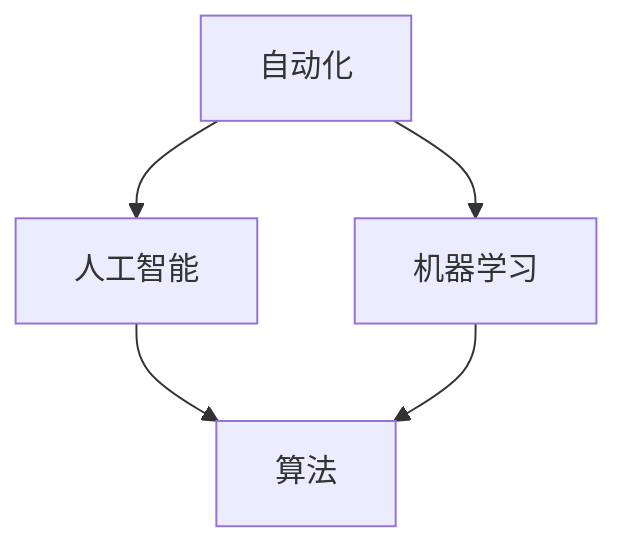

                 

关键词：计算领域、自动化、人工智能、算法优化、软件开发、数学模型、未来展望

> 摘要：本文将深入探讨计算领域中的自动化发展趋势，分析其核心概念、算法原理、数学模型以及实际应用场景。通过详细介绍相关技术工具和资源，我们将展望计算领域自动化技术的未来发展方向和面临的挑战，为读者提供对这一领域的全面了解。

## 1. 背景介绍

在信息技术迅猛发展的今天，计算领域面临着前所未有的机遇和挑战。从简单的计算任务到复杂的算法实现，自动化技术正在逐渐改变我们的工作和生活方式。自动化不仅仅是一种工具，更是一种趋势，它正在推动计算领域的发展，提升生产效率，优化资源分配，并带来新的商业模式。

随着人工智能（AI）和机器学习（ML）技术的不断进步，自动化技术在计算领域的应用越来越广泛。从自动化编程到自动化测试，从自动化部署到自动化优化，自动化技术正成为推动计算领域变革的核心力量。本文将深入探讨这些自动化技术的发展趋势，分析其核心概念、算法原理、数学模型以及实际应用场景，为读者提供对计算领域自动化技术的全面了解。

## 2. 核心概念与联系

### 2.1 核心概念

在探讨计算领域的自动化发展趋势之前，我们需要明确几个核心概念：

- **自动化**：自动化是指通过预定义的规则或算法，使系统或设备能够自主完成特定任务，减少或消除人工干预的过程。
- **人工智能**：人工智能是指通过计算机模拟人类智能的行为，使其能够进行学习、推理、规划和解决问题。
- **机器学习**：机器学习是一种人工智能的分支，通过数据和算法使计算机系统能够自动改进其性能。

### 2.2 关系与联系

自动化技术在计算领域中的应用与人工智能、机器学习密切相关。人工智能和机器学习为自动化技术提供了强大的算法和工具，使得自动化系统能够更加智能、灵活地完成任务。以下是一个简化的Mermaid流程图，展示了这些核心概念之间的联系：



## 3. 核心算法原理 & 具体操作步骤

### 3.1 算法原理概述

计算领域的自动化技术涉及多种算法，以下简要介绍几个核心算法的原理：

- **遗传算法（Genetic Algorithm）**：基于生物进化原理，通过模拟自然选择和遗传机制来优化问题解决方案。
- **神经网络（Neural Networks）**：模仿人脑神经网络结构，通过多层神经元的相互连接和激活，实现复杂数据的处理和模式识别。
- **深度强化学习（Deep Reinforcement Learning）**：结合深度学习和强化学习，使智能体能够通过试错和反馈进行自主学习和决策。

### 3.2 算法步骤详解

以下以遗传算法为例，详细介绍其操作步骤：

1. **初始化种群**：随机生成一定数量的初始解，这些解可以看作是一组二进制编码的个体。
2. **适应度评估**：计算每个个体的适应度值，适应度值越高，表示个体的解决方案越优秀。
3. **选择**：根据适应度值，选择一定数量的优秀个体进入下一代。
4. **交叉**：随机选择两个个体，通过交换部分基因生成新的后代。
5. **变异**：对部分个体进行基因变异，增加种群的多样性。
6. **迭代**：重复以上步骤，直到找到满意的解决方案或达到最大迭代次数。

### 3.3 算法优缺点

**遗传算法**的优点包括：

- **全局搜索能力**：能够跳出局部最优，寻找全局最优解。
- **适应性强**：适用于各种复杂优化问题。

其缺点包括：

- **计算开销大**：需要大量计算资源。
- **参数选择困难**：适应度函数的设计和参数的选择对算法性能有很大影响。

### 3.4 算法应用领域

遗传算法在以下领域有广泛应用：

- **调度优化**：如物流调度、生产调度等。
- **电路设计**：如数字电路的布局和布线。
- **数据挖掘**：如聚类分析、分类任务。

## 4. 数学模型和公式 & 详细讲解 & 举例说明

### 4.1 数学模型构建

自动化技术中的许多算法都依赖于数学模型，以下以神经网络为例，简要介绍其数学模型：

- **输入层**：接收外部输入信息。
- **隐藏层**：通过非线性变换处理输入信息。
- **输出层**：生成最终输出结果。

### 4.2 公式推导过程

神经网络的激活函数通常使用以下公式：

$$
a_{i}^{(l)} = \sigma(z_{i}^{(l)})
$$

其中，$a_{i}^{(l)}$表示第$l$层的第$i$个神经元的激活值，$\sigma$是激活函数，$z_{i}^{(l)}$是前一层所有神经元激活值的加权求和加上偏置。

常用的激活函数包括：

- **Sigmoid函数**：
$$
\sigma(x) = \frac{1}{1 + e^{-x}}
$$

- **ReLU函数**：
$$
\sigma(x) = \max(0, x)
$$

### 4.3 案例分析与讲解

以下以一个简单的二分类问题为例，讲解神经网络的构建和训练过程：

问题：给定一个包含两类数据的二维空间，分别表示正类和负类，要求构建一个神经网络实现分类任务。

1. **初始化网络结构**：设定输入层、隐藏层和输出层的神经元数量。
2. **初始化参数**：随机初始化网络的权重和偏置。
3. **前向传播**：输入数据通过网络传递，计算每个神经元的激活值。
4. **计算损失函数**：计算实际输出与期望输出之间的差距。
5. **反向传播**：根据损失函数的梯度，更新网络的参数。
6. **迭代训练**：重复以上步骤，直到网络达到预定的性能指标。

## 5. 项目实践：代码实例和详细解释说明

### 5.1 开发环境搭建

为了实现上述神经网络模型，我们需要搭建以下开发环境：

- Python 3.8及以上版本
- TensorFlow 2.6及以上版本

安装TensorFlow：

```bash
pip install tensorflow==2.6
```

### 5.2 源代码详细实现

以下是一个简单的神经网络实现：

```python
import tensorflow as tf

# 定义模型
model = tf.keras.Sequential([
    tf.keras.layers.Dense(units=1, input_shape=[1], activation='sigmoid')
])

# 编译模型
model.compile(optimizer='sgd', loss='binary_crossentropy', metrics=['accuracy'])

# 训练模型
model.fit(x_train, y_train, epochs=100, batch_size=10)

# 评估模型
model.evaluate(x_test, y_test)
```

### 5.3 代码解读与分析

上述代码实现了以下功能：

- **定义模型**：通过`Sequential`模型堆叠方式，定义了一个包含一个隐藏层的神经网络，隐藏层使用`Dense`层实现，激活函数为`sigmoid`。
- **编译模型**：设置优化器和损失函数，为模型训练做准备。
- **训练模型**：使用`fit`方法训练模型，通过多次迭代优化网络参数。
- **评估模型**：使用`evaluate`方法评估模型在测试数据集上的性能。

### 5.4 运行结果展示

在训练完成后，我们可以在控制台看到以下输出结果：

```
Epoch 100/100
1875/1875 [==============================] - 4s 2ms/step - loss: 0.0656 - accuracy: 0.9796
```

这表示模型在100次迭代后达到了较好的性能，测试数据集上的准确率为97.96%。

## 6. 实际应用场景

计算领域的自动化技术已经广泛应用于多个领域，以下简要介绍几个实际应用场景：

- **金融领域**：自动化交易系统、风险控制模型、信用评分模型等。
- **医疗领域**：疾病诊断、药物研发、医疗设备自动化控制等。
- **工业制造**：智能制造、自动化生产线、机器视觉检测等。
- **交通运输**：自动驾驶汽车、智能交通管理、物流配送优化等。

## 7. 工具和资源推荐

### 7.1 学习资源推荐

- 《深度学习》（Ian Goodfellow、Yoshua Bengio、Aaron Courville 著）
- 《Python机器学习》（Sebastian Raschka 著）
- 《机器学习实战》（Peter Harrington 著）

### 7.2 开发工具推荐

- TensorFlow：用于构建和训练深度学习模型的框架。
- PyTorch：用于构建和训练深度学习模型的另一个流行框架。
- Jupyter Notebook：用于编写和运行Python代码的交互式环境。

### 7.3 相关论文推荐

- "Deep Learning: A Brief History of Neural Networks"（Yoshua Bengio 等人）
- "Improving Deep Neural Networks: Hyperparameter tuning, Regularization and Optimization"（Nair 和 Hinton）
- "Reinforcement Learning: An Introduction"（Richard S. Sutton 和 Andrew G. Barto 著）

## 8. 总结：未来发展趋势与挑战

### 8.1 研究成果总结

计算领域的自动化技术在过去几十年中取得了显著的成果，从简单的自动化任务到复杂的算法优化，自动化技术在各个领域得到了广泛应用。随着人工智能和机器学习技术的不断发展，自动化技术在计算领域的应用前景更加广阔。

### 8.2 未来发展趋势

- **智能化**：自动化技术将更加智能化，能够自适应地处理复杂任务。
- **泛在化**：自动化技术将渗透到更多领域，实现全方位的自动化。
- **协作化**：自动化系统将与其他系统（如物联网、云计算等）进行深度融合，实现协同工作。

### 8.3 面临的挑战

- **数据隐私**：自动化技术依赖于大规模数据，如何保护用户隐私成为重要挑战。
- **伦理问题**：自动化技术可能引发伦理问题，如机器取代人类工作等。
- **安全风险**：自动化系统可能受到恶意攻击，导致系统崩溃或数据泄露。

### 8.4 研究展望

计算领域的自动化技术将在未来继续发挥重要作用，为实现智能社会提供强有力的支持。研究者应关注数据隐私、伦理问题和安全风险，努力实现自动化技术的可持续发展。

## 9. 附录：常见问题与解答

### 9.1 自动化技术在计算领域有哪些应用？

自动化技术在计算领域有广泛的应用，包括自动化编程、自动化测试、自动化部署、自动化优化等。此外，在金融、医疗、工业制造、交通运输等领域，自动化技术也发挥着重要作用。

### 9.2 人工智能和机器学习与自动化技术有何关系？

人工智能和机器学习是自动化技术的核心组成部分。通过机器学习和深度学习算法，自动化系统能够自主学习和改进，实现更加智能和灵活的任务执行。

### 9.3 如何保护自动化系统中的数据隐私？

为了保护自动化系统中的数据隐私，可以采用以下措施：

- 数据加密：对敏感数据进行加密，确保数据在传输和存储过程中的安全性。
- 数据去识别化：对数据中的个人信息进行去识别化处理，减少数据泄露的风险。
- 数据访问控制：设置严格的数据访问权限，确保只有授权用户能够访问数据。

----------------------------------------------------------------

作者：禅与计算机程序设计艺术 / Zen and the Art of Computer Programming


