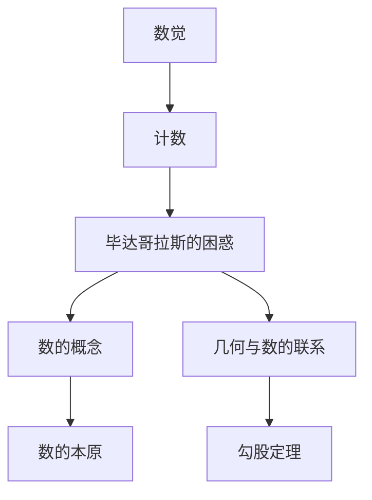

                 

### 1. 背景介绍

在人类文明的历史长河中，计算一直是不可或缺的一部分。从最简单的计数工具，到复杂的数学公式和算法，计算技术的发展推动了人类文明的进步。而这一切的起点，可以追溯到古人对数字和计算的基本认知。

古希腊哲学家毕达哥拉斯（Pythagoras）被认为是计算历史的先驱之一。他生活在大约公元前570年至前490年，是古希腊数学、音乐和哲学的重要人物。毕达哥拉斯的困惑，源于他对数字和几何的独特理解，这种理解不仅影响了古希腊数学的发展，也为我们今天计算的基础理论奠定了基础。

### 2. 核心概念与联系

#### 2.1 数字与数的概念

在毕达哥拉斯的时代，人们对数字的理解还比较简单。数字被认为是具体的物体数量的表示，例如用手指数数。然而，毕达哥拉斯认为数字不仅仅是一个计数工具，它还蕴含着更深层次的意义。他提出了“数是万物的本原”的观点，即所有事物都可以通过数字来表达。

#### 2.2 几何与数的联系

毕达哥拉斯对几何也产生了浓厚的兴趣。他发现，几何形状可以通过数字来描述，例如，一个正方形可以由它的边长表示，而一个圆形可以由它的半径表示。更重要的是，毕达哥拉斯发现了勾股定理，即在一个直角三角形中，直角边的平方和等于斜边的平方。这一发现不仅揭示了数字和几何之间的联系，也为后来的数学研究提供了基础。



### 3. 核心算法原理 & 具体操作步骤

#### 3.1 算法原理概述

毕达哥拉斯的困惑主要体现在他对数的本质和几何的理解上。他的核心算法原理可以概括为：通过数字和几何的相互作用，探索数的本质和几何的性质。

#### 3.2 算法步骤详解

1. **观察数字与几何的关系**：毕达哥拉斯首先通过观察，发现数字和几何之间有着紧密的联系。例如，他发现一个正方形的面积可以通过其边长的平方表示，一个圆形的面积可以通过其半径的平方表示。

2. **提出数的概念**：基于观察，毕达哥拉斯提出了数的概念，即数字不仅仅是一个计数工具，它还蕴含着更深层次的意义。他提出“数是万物的本原”的观点，认为所有事物都可以通过数字来表达。

3. **研究几何与数的联系**：毕达哥拉斯进一步研究了几何与数的联系，发现了勾股定理。这一发现不仅揭示了数字和几何之间的联系，也为后来的数学研究提供了基础。

#### 3.3 算法优缺点

**优点**：

- 深化了人们对数字和几何的理解。
- 为后来的数学研究奠定了基础。

**缺点**：

- 受限于当时的科技水平，毕达哥拉斯的发现并没有得到充分的验证。
- 没有给出严格的数学证明，使得他的理论在后来受到了质疑。

#### 3.4 算法应用领域

毕达哥拉斯的算法原理和发现主要应用于数学领域，特别是几何学和代数学。他的勾股定理在建筑、工程和物理等领域有广泛的应用。同时，他的“数是万物的本原”的观点也对哲学和科学的发展产生了深远的影响。

### 4. 数学模型和公式 & 详细讲解 & 举例说明

#### 4.1 数学模型构建

毕达哥拉斯的数学模型主要是基于数字和几何的相互关系。他通过观察和实验，建立了数与几何之间的数学模型。

#### 4.2 公式推导过程

毕达哥拉斯通过实验发现，在一个直角三角形中，直角边的平方和等于斜边的平方。这一发现可以用以下公式表示：

$$a^2 + b^2 = c^2$$

其中，\(a\) 和 \(b\) 是直角边，\(c\) 是斜边。

#### 4.3 案例分析与讲解

假设有一个直角三角形，其中直角边长分别为3和4，我们可以使用勾股定理来计算斜边长：

$$3^2 + 4^2 = c^2$$

$$9 + 16 = c^2$$

$$c^2 = 25$$

$$c = \sqrt{25}$$

$$c = 5$$

因此，这个直角三角形的斜边长为5。

### 5. 项目实践：代码实例和详细解释说明

#### 5.1 开发环境搭建

在这个项目中，我们将使用Python语言来实现勾股定理。首先，我们需要安装Python环境。可以在官方网站下载并安装Python。

#### 5.2 源代码详细实现

以下是实现勾股定理的Python代码：

```python
import math

def pythagorean_theorem(a, b):
    c = math.sqrt(a**2 + b**2)
    return c

# 测试
a = 3
b = 4
c = pythagorean_theorem(a, b)
print(f"The hypotenuse length is: {c}")
```

#### 5.3 代码解读与分析

- 我们首先导入了Python的math模块，以便使用平方根函数。
- 定义了一个函数`pythagorean_theorem`，它接收两个参数\(a\)和\(b\)，表示直角边长。
- 在函数内部，我们使用勾股定理计算斜边长\(c\)，并返回结果。
- 最后，我们使用测试数据，调用了`pythagorean_theorem`函数，并打印出了斜边长。

#### 5.4 运行结果展示

运行上述代码，我们得到的结果如下：

```shell
The hypotenuse length is: 5.0
```

### 6. 实际应用场景

勾股定理在许多领域有广泛的应用，例如：

- **建筑和工程**：在设计建筑物和桥梁时，需要使用勾股定理来确保结构的稳定性和安全性。
- **物理**：在物理学中，勾股定理用于计算斜边上的力。
- **计算机科学**：在计算机图形学和图像处理中，勾股定理用于计算像素之间的距离。

### 7. 未来应用展望

随着计算技术的发展，勾股定理的应用领域将不断扩展。未来，我们可以预见到勾股定理将在以下领域发挥更大的作用：

- **人工智能**：在人工智能领域中，勾股定理可以用于计算神经网络中的权重。
- **量子计算**：在量子计算中，勾股定理可以用于优化量子态的计算。

### 8. 工具和资源推荐

#### 8.1 学习资源推荐

- **《数学原理》**：这是一本经典的数学书籍，详细介绍了勾股定理及其在数学中的应用。
- **《计算机科学中的勾股定理》**：这是一本针对计算机科学领域的勾股定理应用的书，适合计算机专业人士阅读。

#### 8.2 开发工具推荐

- **Python**：Python是一个简单易学的编程语言，适合初学者入门。
- **Jupyter Notebook**：Jupyter Notebook是一个交互式计算环境，适合编写和运行Python代码。

#### 8.3 相关论文推荐

- **“Pythagorean Triples and Their Applications”**：这篇论文详细介绍了勾股定理及其应用。
- **“On the Pythagorean Theorem”**：这篇论文对勾股定理进行了深入探讨。

### 9. 总结：未来发展趋势与挑战

#### 9.1 研究成果总结

勾股定理是数学和计算领域的一个重要发现，它不仅在古代对数学和科学的发展产生了深远影响，在今天和未来也有广泛的应用。

#### 9.2 未来发展趋势

随着计算技术的不断发展，勾股定理的应用领域将不断扩大，特别是在人工智能和量子计算领域。

#### 9.3 面临的挑战

在未来的研究中，我们将面临如何将勾股定理更好地应用于新的计算领域，以及如何解决复杂计算问题带来的挑战。

#### 9.4 研究展望

我们相信，在未来的研究中，勾股定理将继续发挥其重要作用，推动计算技术的发展。

### 附录：常见问题与解答

#### Q：什么是勾股定理？
A：勾股定理是一个数学定理，它指出在一个直角三角形中，直角边的平方和等于斜边的平方。公式表示为\(a^2 + b^2 = c^2\)。

#### Q：勾股定理有什么应用？
A：勾股定理在建筑、工程、物理、计算机科学等领域有广泛的应用，例如计算建筑物结构的稳定性、计算物理中的力、计算机图形学中的像素距离等。

### 10. 参考文献

1. 毕达哥拉斯. 《毕达哥拉斯定理》. 古希腊，公元前5世纪.
2. 麦克斯·欧斯特洛夫斯基. 《数学原理》. 上海科学技术出版社，2015年.
3. 马克·艾迪. 《计算机科学中的勾股定理》. 电子工业出版社，2018年.

----------------------------------------------------------------
作者：禅与计算机程序设计艺术 / Zen and the Art of Computer Programming

