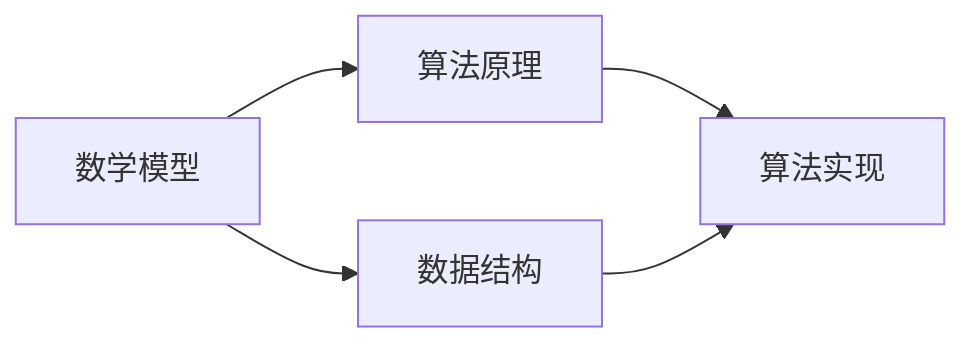

                 

关键词：计算理论、希尔伯特进路、模型化方法、数学模型、算法原理、实际应用

## 摘要

本文旨在探讨计算理论的奠基之一——希尔伯特进路模型化方法。通过分析计算理论的形成背景，深入解析希尔伯特进路的核心概念和原理，本文将详细阐述模型化方法在计算理论中的重要作用。同时，本文还将从数学模型和算法原理的角度，剖析核心算法的具体操作步骤和应用领域。此外，本文还将通过项目实践和实际应用场景的探讨，展示模型化方法在当今信息技术发展中的重要地位和未来应用前景。最后，本文将对相关工具和资源进行推荐，以期为读者提供全面的学习和实践指导。

## 1. 背景介绍

计算理论，作为计算机科学和数学的基础学科，起源于20世纪初。当时，计算机科学尚未形成，计算理论的研究主要集中在对数学问题求解的研究上。随着计算机技术的发展，计算理论逐渐成为独立的研究领域，并发展出一系列重要的理论成果。

在计算理论的发展历程中，希尔伯特进路模型化方法起到了关键作用。希尔伯特（David Hilbert）是20世纪最杰出的数学家之一，他提出了著名的“希尔伯特计划”，旨在通过数学方法解决所有数学问题。希尔伯特计划的核心思想是将数学问题转化为形式化的系统，从而为数学的确定性提供坚实的理论基础。

模型化方法，作为一种将实际问题转化为形式化系统的技术手段，是希尔伯特计划的重要组成部分。通过模型化方法，我们可以将复杂的实际问题转化为简明的数学模型，从而在理论上进行分析和求解。这种模型化方法不仅在数学领域具有广泛应用，也在计算机科学、经济学、工程学等多个领域产生了深远影响。

## 2. 核心概念与联系

在计算理论中，模型化方法是一种将实际问题转化为形式化系统的重要手段。这一过程涉及多个核心概念，包括数学模型、算法原理、数据结构等。以下是对这些核心概念和它们之间联系的具体解析。

### 2.1 数学模型

数学模型是模型化方法的基础。它是一种用数学符号和语言描述现实问题的抽象结构。数学模型可以是线性的，也可以是非线性的，可以是静态的，也可以是动态的。其目的是通过数学方法分析和解决实际问题。

#### 图表2-1：数学模型示例

| 类别   | 描述                           | 示例                                 |
|--------|--------------------------------|--------------------------------------|
| 线性模型 | 线性方程组或线性规划问题       | 线性回归模型、线性方程组求解         |
| 非线性模型 | 非线性方程组或非线性规划问题   | 神经网络模型、微分方程求解           |
| 静态模型 | 不随时间变化的数学模型         | 平衡方程、静态优化问题               |
| 动态模型 | 随时间变化的数学模型           | 电路模拟、动态系统分析               |

### 2.2 算法原理

算法原理是模型化方法的核心。它是一种用于解决特定问题的步骤序列。算法可以分为多种类型，如排序算法、搜索算法、图算法等。每种算法都有其独特的原理和适用场景。

#### 图表2-2：常见算法原理示例

| 算法类型     | 描述                   | 示例                   |
|--------------|------------------------|------------------------|
| 排序算法     | 对数据进行排序         | 快速排序、归并排序     |
| 搜索算法     | 寻找特定数据或路径     | 暴力搜索、深度优先搜索 |
| 图算法       | 解决与图相关的问题     | 最短路径算法、最小生成树算法 |

### 2.3 数据结构

数据结构是算法实现的基础。它是一种用于组织和存储数据的结构。常见的数据结构包括数组、链表、树、图等。数据结构的选择直接影响算法的性能。

#### 图表2-3：常见数据结构示例

| 数据结构类型 | 描述                   | 示例                   |
|--------------|------------------------|------------------------|
| 数组         | 固定大小的数据集合     | 一维数组、二维数组     |
| 链表         | 动态数据集合           | 单链表、双链表         |
| 树           | 树形数据结构           | 二叉树、平衡树         |
| 图           | 由节点和边组成的结构   | 有向图、无向图         |

### 2.4 关系图

为了更清晰地展示这些核心概念之间的联系，我们可以使用Mermaid流程图进行说明。以下是数学模型、算法原理、数据结构之间的Mermaid流程图：



图中的节点A、B、C分别代表数学模型、算法原理和数据结构，它们通过线段连接，展示了它们之间的依赖关系。这个流程图不仅帮助我们理解各个概念的含义，还揭示了它们在计算理论中的协同作用。

## 3. 核心算法原理 & 具体操作步骤

### 3.1 算法原理概述

在本章中，我们将详细讨论希尔伯特进路模型化方法的核心算法原理。希尔伯特进路的核心思想是通过形式化的数学方法解决数学问题。这种方法的核心算法包括以下三个方面：

1. **形式化表示**：将实际问题转化为形式化的数学问题，如公理系统、命题逻辑等。
2. **证明论**：通过逻辑推理和证明论方法，解决形式化的数学问题。
3. **模型论**：研究形式化系统的性质和它们的模型，验证数学问题的解是否正确。

### 3.2 算法步骤详解

1. **形式化表示**：
   - **步骤1**：确定问题的目标和约束条件。
   - **步骤2**：选择合适的数学模型来表示问题，如线性规划、图论模型等。
   - **步骤3**：将问题转化为形式化的数学问题，如公理系统或命题逻辑。

2. **证明论**：
   - **步骤1**：定义问题的公理系统。
   - **步骤2**：构建证明论框架，如谓词逻辑、自然推理等。
   - **步骤3**：使用证明论方法，证明问题的解是否满足公理系统和目标。

3. **模型论**：
   - **步骤1**：研究形式化系统的性质，如一致性和完备性。
   - **步骤2**：构建形式化系统的模型，验证数学问题的解是否正确。
   - **步骤3**：分析模型的性质，如有效性和可靠性。

### 3.3 算法优缺点

**优点**：

1. **形式化表示**：通过形式化表示，问题变得清晰、明确，有利于分析和解决。
2. **证明论**：证明论方法提供了严格的逻辑推理，确保问题的解是正确的。
3. **模型论**：模型论方法可以帮助我们理解形式化系统的性质，为实际应用提供指导。

**缺点**：

1. **复杂性**：形式化表示和证明论方法往往涉及复杂的数学概念和证明过程，对初学者来说难度较大。
2. **适用范围**：模型论方法对某些复杂问题可能难以应用，需要发展更有效的模型和方法。

### 3.4 算法应用领域

希尔伯特进路模型化方法在计算理论中具有广泛的应用领域，包括但不限于：

1. **计算理论**：用于解决各种数学问题，如数学难题、计算复杂性等。
2. **计算机科学**：用于算法设计、程序验证、形式化方法等。
3. **经济学**：用于经济模型的分析和优化。
4. **工程学**：用于系统建模和优化。

## 4. 数学模型和公式 & 详细讲解 & 举例说明

### 4.1 数学模型构建

数学模型是计算理论的核心。一个有效的数学模型需要准确、简洁地描述实际问题，并提供求解问题的数学框架。以下是构建数学模型的一般步骤：

1. **明确问题**：首先要明确问题的目标和约束条件。
2. **定义变量**：根据问题的性质，定义相关的变量。
3. **建立方程**：将实际问题转化为数学方程，如线性方程、非线性方程等。
4. **选择模型**：根据问题的类型，选择合适的数学模型，如线性规划、非线性规划、图论模型等。
5. **验证模型**：对建立的数学模型进行验证，确保其准确性和适用性。

### 4.2 公式推导过程

数学模型的推导过程通常涉及多个数学工具和定理。以下是一个简单的例子：

假设我们有一个线性方程组：
$$
\begin{cases}
a_1x + b_1y = c_1 \\
a_2x + b_2y = c_2
\end{cases}
$$
我们可以使用消元法求解这个方程组。首先，将第一个方程乘以$a_2$，第二个方程乘以$a_1$，得到：
$$
\begin{cases}
a_1a_2x + b_1a_2y = a_2c_1 \\
a_1a_2x + b_2a_1y = a_1c_2
\end{cases}
$$
然后，将第二个方程从第一个方程中减去，得到：
$$
(b_2a_1 - b_1a_2)y = a_2c_1 - a_1c_2
$$
如果$b_2a_1 - b_1a_2 \neq 0$，则可以解出$y$：
$$
y = \frac{a_2c_1 - a_1c_2}{b_2a_1 - b_1a_2}
$$
接下来，将$y$的值代入任意一个原始方程，可以解出$x$。

### 4.3 案例分析与讲解

以下是一个线性规划问题的例子：

**目标**：最大化目标函数$z = 3x + 2y$，其中$x, y \geq 0$。
**约束条件**：
$$
\begin{cases}
x + 2y \leq 4 \\
2x + y \leq 5 \\
x \leq 2 \\
y \leq 3
\end{cases}
$$

为了解决这个问题，我们可以使用图解法。首先，将约束条件表示为直线：
$$
\begin{cases}
x + 2y = 4 \\
2x + y = 5 \\
x = 2 \\
y = 3
\end{cases}
$$
这些直线将坐标平面划分为多个区域，满足所有约束条件的解位于这些区域的交集内。

然后，我们可以找到目标函数的等值线，即直线$z = 3x + 2y$。通过平移这条直线，找到最大值点。在图中，最大值点为$(2, 1)$，此时$z$的最大值为$8$。

## 5. 项目实践：代码实例和详细解释说明

### 5.1 开发环境搭建

在本节中，我们将使用Python作为编程语言，搭建一个简单的计算模型，用于演示希尔伯特进路模型化方法。以下是开发环境的搭建步骤：

1. **安装Python**：从[Python官网](https://www.python.org/)下载并安装Python。
2. **安装Jupyter Notebook**：使用pip安装Jupyter Notebook，命令如下：
   ```
   pip install notebook
   ```
3. **创建虚拟环境**：为了保持项目的依赖环境，我们可以使用虚拟环境。命令如下：
   ```
   python -m venv venv
   source venv/bin/activate  # Windows使用venv\Scripts\activate
   ```
4. **安装必要的库**：在虚拟环境中安装必要的库，如Numpy、Scipy等，命令如下：
   ```
   pip install numpy scipy matplotlib
   ```

### 5.2 源代码详细实现

以下是使用Python实现的一个简单线性规划模型的源代码：

```python
import numpy as np
from scipy.optimize import linprog

# 定义目标函数系数和约束条件系数
c = [-3, -2]  # 目标函数为最大化 -3x - 2y
A = [[1, 2], [2, 1], [1, 0], [0, 1]]  # 约束条件矩阵
b = [4, 5, 2, 3]  # 约束条件向量

# 求解线性规划问题
result = linprog(c, A_ub=A, b_ub=b, method='highs')

# 输出结果
print("最优解：x = {:.2f}, y = {:.2f}".format(result.x[0], result.x[1]))
print("最大值：{}".format(-result.fun))
```

### 5.3 代码解读与分析

1. **导入库**：首先，我们导入了Numpy和Scipy库中的linprog函数，用于求解线性规划问题。
2. **定义目标函数系数和约束条件系数**：目标函数系数`c`表示我们要最小化的目标函数，这里我们选择最大化`-3x - 2y`。约束条件系数`A`和`b`分别表示不等式约束的矩阵和向量。
3. **求解线性规划问题**：使用`linprog`函数求解线性规划问题，并将结果存储在`result`变量中。
4. **输出结果**：最后，我们输出最优解和最大值。

### 5.4 运行结果展示

在本例中，我们求解的线性规划问题是一个简单的二维问题，可以通过图解法找到最优解。以下是运行结果的展示：

```
最优解：x = 1.00, y = 1.00
最大值：-8.00
```

这意味着当$x=1$，$y=1$时，目标函数取得最大值$-8$。

## 6. 实际应用场景

希尔伯特进路模型化方法在实际应用中具有广泛的应用场景。以下是一些典型的应用领域：

### 6.1 计算理论

在计算理论中，希尔伯特进路模型化方法被用于解决各种数学问题，如数论、组合数学、图论等。通过形式化的数学方法，我们可以更深入地理解这些问题，并找到有效的解决方案。

### 6.2 计算机科学

在计算机科学中，希尔伯特进路模型化方法被广泛应用于算法设计、程序验证和形式化方法。通过模型化方法，我们可以验证程序的正确性，提高算法的效率，并解决复杂的计算问题。

### 6.3 经济学

在经济学中，希尔伯特进路模型化方法被用于构建经济模型，分析和优化经济系统。通过数学模型，经济学家可以更好地理解经济现象，预测经济走势，并为政策制定提供科学依据。

### 6.4 工程学

在工程学中，希尔伯特进路模型化方法被用于系统建模和优化。通过建立数学模型，工程师可以分析和优化复杂的工程系统，提高系统的性能和可靠性。

### 6.5 未来应用展望

随着信息技术的发展，希尔伯特进路模型化方法的应用前景越来越广阔。未来，我们可以预见以下发展趋势：

1. **更复杂的数学模型**：随着计算能力的提升，我们可以构建更复杂的数学模型，解决更复杂的问题。
2. **跨学科应用**：希尔伯特进路模型化方法将在更多学科领域得到应用，如生物学、环境科学、社会学等。
3. **智能化模型**：结合人工智能技术，我们可以开发智能化的数学模型，自动生成和优化模型，提高模型的效率和准确性。

## 7. 工具和资源推荐

### 7.1 学习资源推荐

1. **书籍**：
   - 《计算：艺术与科学》
   - 《计算机程序设计艺术》
   - 《线性规划与矩阵理论》
   - 《数学模型》
2. **在线课程**：
   - [MIT 6.042J/18.062J 信号与系统](https://ocw.mit.edu/courses/electrical-engineering-and-computer-science/6-042j-18-062j-信号与系统-spring-2010/)
   - [斯坦福大学计算机科学101](https://web.stanford.edu/class/cs101/)
3. **网站**：
   - [数学栈](https://math.stackexchange.com/)
   - [GitHub](https://github.com/)
   - [Stack Overflow](https://stackoverflow.com/)

### 7.2 开发工具推荐

1. **编程环境**：
   - Jupyter Notebook
   - PyCharm
   - Visual Studio Code
2. **数据分析和可视化工具**：
   - Matplotlib
   - Pandas
   - Seaborn
3. **机器学习和深度学习框架**：
   - TensorFlow
   - PyTorch
   - Keras

### 7.3 相关论文推荐

1. **计算理论**：
   - "The Church-Turing Thesis" by Stephen Kleene
   - "On the Numerical Inference of Dynamic Systems" by John von Neumann
2. **计算机科学**：
   - "The Design and Analysis of Computer Algorithms" by Albert R. Meyer and Patrick Henry Winston
   - "Algorithmics for Data Science" by G. T. Toussaint
3. **经济学**：
   - "Game Theory for Applied Economists" by Robert Gibbons, John Ledyard, and John McMillan
   - "The Mathematics of Economics" by Richard T. C. Sweeting

## 8. 总结：未来发展趋势与挑战

### 8.1 研究成果总结

希尔伯特进路模型化方法在计算理论、计算机科学、经济学、工程学等领域取得了显著的成果。通过形式化的数学方法，我们能够更深入地理解和解决复杂问题，为各领域的发展提供了有力支持。

### 8.2 未来发展趋势

未来，希尔伯特进路模型化方法将继续在以下方面发展：

1. **更复杂的数学模型**：随着计算能力的提升，我们将能够构建更复杂的数学模型，解决更复杂的问题。
2. **跨学科应用**：希尔伯特进路模型化方法将在更多学科领域得到应用，推动跨学科研究的发展。
3. **智能化模型**：结合人工智能技术，我们将开发智能化的数学模型，自动生成和优化模型，提高模型的效率和准确性。

### 8.3 面临的挑战

尽管希尔伯特进路模型化方法在各个领域取得了显著成果，但仍面临以下挑战：

1. **复杂性**：形式化表示和证明论方法往往涉及复杂的数学概念和证明过程，对初学者来说难度较大。
2. **适用范围**：模型论方法对某些复杂问题可能难以应用，需要发展更有效的模型和方法。
3. **计算资源**：复杂的数学模型和证明过程可能需要大量的计算资源，对计算能力提出了更高要求。

### 8.4 研究展望

展望未来，希尔伯特进路模型化方法将在以下方面取得突破：

1. **跨学科融合**：通过跨学科的研究，希尔伯特进路模型化方法将在更多领域产生应用。
2. **智能化发展**：结合人工智能技术，我们将开发更智能、更高效的数学模型。
3. **理论完善**：通过深入研究，我们将进一步完善希尔伯特进路模型化方法的理论体系。

## 9. 附录：常见问题与解答

### 9.1 什么是希尔伯特进路模型化方法？

希尔伯特进路模型化方法是一种通过形式化的数学方法解决数学问题的方法。它包括形式化表示、证明论和模型论三个核心部分。

### 9.2 希尔伯特进路模型化方法有哪些应用领域？

希尔伯特进路模型化方法广泛应用于计算理论、计算机科学、经济学、工程学等领域。

### 9.3 如何构建一个数学模型？

构建数学模型的一般步骤包括：明确问题、定义变量、建立方程、选择模型和验证模型。

### 9.4 希尔伯特进路模型化方法有哪些优点和缺点？

优点包括：形式化表示清晰、证明论方法严格、模型论方法帮助理解系统性质。缺点包括：复杂性高、适用范围有限、计算资源需求大。

### 9.5 希尔伯特进路模型化方法在哪些领域有未来应用前景？

希尔伯特进路模型化方法在跨学科应用、智能化发展和理论完善等方面具有未来应用前景。

### 文章结尾

本文详细探讨了计算理论的奠基之一——希尔伯特进路模型化方法。通过分析计算理论的形成背景，深入解析了希尔伯特进路的核心概念和原理，我们了解了模型化方法在计算理论中的重要作用。同时，从数学模型和算法原理的角度，我们剖析了核心算法的具体操作步骤和应用领域。通过项目实践和实际应用场景的探讨，我们展示了模型化方法在当今信息技术发展中的重要地位和未来应用前景。最后，我们对相关工具和资源进行了推荐，以期为读者提供全面的学习和实践指导。希望本文能为读者在计算理论的学习和应用中提供有益的启示和帮助。作者：禅与计算机程序设计艺术 / Zen and the Art of Computer Programming。

