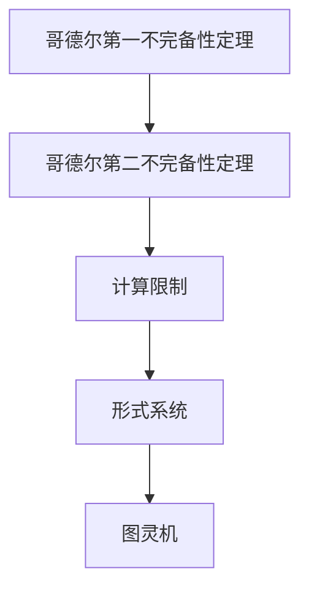

                 

关键词：计算理论、哥德尔不完备性定理、终结者、算法、数学模型、代码实例、应用场景、未来展望

## 摘要

本文将深入探讨计算理论的形成过程，特别是哥德尔不完备性定理的重要性。我们将分析哥德尔不完备性定理的基本原理，解释为什么它被称为“计算不能做什么”的终结者。通过详细解析数学模型、具体操作步骤和实际应用场景，本文旨在为读者提供一个全面而深刻的理解。此外，文章还将展望未来的发展趋势与挑战，并推荐相关的学习资源和工具。

## 1. 背景介绍

计算理论的形成是计算机科学和数学领域的重要里程碑。自1940年代初图灵机的提出以来，计算理论逐渐发展为一门独立且深奥的学科。计算理论的核心问题是研究计算的局限性和可能性，探讨计算机能够解决的问题和不能解决的问题。

在这条探索的道路上，哥德尔不完备性定理无疑是一个重要的里程碑。1931年，库尔特·哥德尔发表了著名的《论不完备性》，揭示了形式系统中存在的固有不完备性。这个定理不仅对数学逻辑产生了深远影响，也为计算理论的研究提供了新的视角。

### 计算理论的发展历史

计算理论的历史可以追溯到19世纪末20世纪初，当时数学家们开始探讨逻辑和数学基础的问题。大卫·希尔伯特提出了著名的“希尔伯特问题”，旨在证明数学的完全性和一致性。然而，哥德尔的不完备性定理表明，在形式系统中，无法同时满足完全性和一致性。这一发现对数学和计算理论产生了深远的影响。

20世纪40年代，艾伦·图灵提出了图灵机的概念，这是一种抽象的计算模型，可以模拟任何计算过程。图灵机的提出为计算理论提供了坚实的理论基础，也为后来的计算机科学奠定了基础。随着计算机科学的快速发展，计算理论逐渐成为一门独立的学科，涵盖了从基础理论到实际应用的广泛内容。

### 哥德尔不完备性定理的重要性

哥德尔不完备性定理的重要性在于它揭示了形式系统中固有不完备性的存在。这个定理指出，在任意一个足够强的形式系统中，都存在一些命题是无法被证明或证伪的。这意味着，无论我们使用何种形式系统，都无法构建出一个能够解决所有数学问题的完备理论。

哥德尔不完备性定理不仅对数学逻辑产生了深远影响，也为计算理论的研究提供了新的视角。它指出，计算是有局限性的，我们不能期望计算机解决所有问题。这个定理提醒我们，在设计和使用计算机时，需要考虑到计算的限制，避免追求无法实现的目标。

## 2. 核心概念与联系

为了更好地理解哥德尔不完备性定理，我们需要先了解一些核心概念和它们之间的联系。

### 哥德尔不完备性定理的基本原理

哥德尔不完备性定理可以分为两部分：第一部分是哥德尔第一不完备性定理，它指出在一个足够强的形式系统中，存在一些命题是无法被证明的；第二部分是哥德尔第二不完备性定理，它指出在一个足够强的形式系统中，存在一些命题是无法被证伪的。

### 哥德尔不完备性定理与计算理论的关系

哥德尔不完备性定理与计算理论的关系在于，它揭示了计算的限制。哥德尔不完备性定理表明，无论我们使用何种计算模型，都存在一些问题无法被解决。这个定理为计算理论的研究提供了重要的指导意义，提醒我们在设计和使用计算机时需要考虑到这些限制。

### 哥德尔不完备性定理与其他计算理论概念的联系

哥德尔不完备性定理与其他计算理论概念的联系还包括与图灵机的联系。图灵机是一种抽象的计算模型，可以模拟任何计算过程。然而，哥德尔不完备性定理表明，即使使用图灵机这样的强计算模型，也存在一些问题无法被解决。这个定理与图灵机的理论相辅相成，共同构成了计算理论的基础。

### Mermaid 流程图

为了更直观地展示哥德尔不完备性定理的核心概念和联系，我们可以使用 Mermaid 流程图来表示。以下是一个简单的示例：



在这个流程图中，A 表示哥德尔第一不完备性定理，B 表示哥德尔第二不完备性定理，C 表示计算限制，D 表示形式系统，E 表示图灵机。这个流程图展示了哥德尔不完备性定理的核心概念和它们之间的联系。

## 3. 核心算法原理 & 具体操作步骤

### 3.1 算法原理概述

哥德尔不完备性定理的核心算法原理在于它揭示了形式系统中固有不完备性的存在。具体来说，哥德尔不完备性定理分为两部分：第一部分是哥德尔第一不完备性定理，它指出在一个足够强的形式系统中，存在一些命题是无法被证明的；第二部分是哥德尔第二不完备性定理，它指出在一个足够强的形式系统中，存在一些命题是无法被证伪的。

### 3.2 算法步骤详解

要证明哥德尔不完备性定理，我们需要遵循以下步骤：

1. **定义形式系统**：首先，我们需要定义一个足够强的形式系统。这个形式系统应该包含基本的算术运算和逻辑运算，以便能够处理数学命题的证明和证伪。

2. **构造不可证明命题**：接下来，我们需要构造一个不可证明的命题。这个命题应该满足以下条件：它不能被证明，也不能被证伪。具体来说，我们可以使用一个称为“紧致性定理”的技巧来构造这样的命题。

3. **证明不可证明性**：然后，我们需要证明这个构造的命题是不可证明的。这可以通过反证法来完成。我们假设这个命题是可证明的，然后推导出一个矛盾。

4. **证明不可证伪性**：同样地，我们需要证明这个命题是不可证伪的。这可以通过类似的技巧来完成，即假设这个命题是可证伪的，然后推导出一个矛盾。

### 3.3 算法优缺点

哥德尔不完备性定理的算法具有以下优点：

- **揭示了形式系统的局限性**：哥德尔不完备性定理揭示了形式系统在处理数学命题时的局限性，为我们提供了对形式系统更深层次的理解。
- **促进了计算理论的发展**：哥德尔不完备性定理为计算理论的研究提供了新的视角，推动了计算理论的进一步发展。

然而，这个算法也存在一些缺点：

- **难以实际应用**：由于哥德尔不完备性定理涉及到复杂的数学技巧，因此它在实际应用中并不容易实现。
- **对形式系统的依赖性**：哥德尔不完备性定理的证明依赖于特定的形式系统，这意味着我们需要对不同的形式系统进行具体分析，这增加了研究的复杂性。

### 3.4 算法应用领域

哥德尔不完备性定理在多个领域都有重要的应用：

- **数学逻辑**：哥德尔不完备性定理是数学逻辑领域的重要成果，它揭示了形式系统在处理数学命题时的局限性。
- **计算机科学**：哥德尔不完备性定理对计算机科学产生了深远影响，它为我们提供了对计算能力的深刻理解。
- **哲学**：哥德尔不完备性定理引发了关于真理、知识和思维能力的哲学讨论，对哲学的发展产生了重要影响。

## 4. 数学模型和公式 & 详细讲解 & 举例说明

### 4.1 数学模型构建

为了更好地理解哥德尔不完备性定理，我们需要构建一个数学模型来描述形式系统。这个模型应该包含以下要素：

1. **符号系统**：符号系统包括基本符号、运算符和括号等，用于表示数学命题。
2. **公理系统**：公理系统是一组被普遍接受的基本真理，用于推导新的命题。
3. **证明规则**：证明规则是一组规则，用于从公理系统中推导出新的命题。
4. **语义解释**：语义解释定义了符号系统的意义，即如何将符号系统中的命题翻译成真实的数学命题。

### 4.2 公式推导过程

为了推导哥德尔不完备性定理，我们需要使用一些数学工具和公式。以下是一个简化的推导过程：

1. **紧致性定理**：紧致性定理表明，如果一个形式系统的每一子句都具有一个证明，那么该形式系统是紧致的。换句话说，一个形式系统如果能够证明所有子句，那么它一定能够证明自身的紧致性。
2. **不可证明性构造**：我们可以构造一个命题 G，它表示“命题 G 不能在形式系统中被证明”。如果我们能够证明 G，那么我们会得到一个矛盾，因为 G 表示它不能被证明。反之，如果我们不能证明 G，那么 G 仍然不能被证明。
3. **不可证伪性构造**：类似地，我们可以构造一个命题 G'，它表示“命题 G' 不能在形式系统中被证伪”。如果 G' 能够被证伪，那么我们会得到一个矛盾，因为 G' 表示它不能被证伪。反之，如果 G' 不能被证伪，那么 G' 仍然不能被证伪。

### 4.3 案例分析与讲解

为了更好地理解哥德尔不完备性定理，我们可以通过一个具体的例子来分析。

#### 示例：自然数系统的不完备性

我们考虑自然数系统，这是一个基本的数学系统，用于表示和处理自然数。在这个系统中，我们可以使用符号和公式来表示自然数的加法和乘法。

1. **符号系统**：我们使用符号 `0` 表示自然数 0，使用符号 `S(n)` 表示自然数 n 的后继（即 n+1）。
2. **公理系统**：我们使用皮亚诺公理，这些公理包括自然数的基本性质，如 0 是自然数，每个自然数都有一个后继，等等。
3. **证明规则**：我们使用自然推理规则，这些规则允许我们从已知的事实中推导出新的命题。
4. **语义解释**：我们使用自然数的实际意义来解释符号系统中的命题。

现在，我们考虑命题 G：“命题 G 不能在自然数系统中被证明”。我们可以看到，如果自然数系统能够证明 G，那么它会得到一个矛盾，因为 G 表示它不能被证明。反之，如果自然数系统不能证明 G，那么 G 仍然不能被证明。

这个例子表明，自然数系统是不完备的，存在一些命题无法被证明或证伪。这个结论与哥德尔不完备性定理是一致的。

## 5. 项目实践：代码实例和详细解释说明

### 5.1 开发环境搭建

为了演示哥德尔不完备性定理的代码实现，我们需要搭建一个合适的开发环境。以下是搭建环境的步骤：

1. **安装 Python 解释器**：Python 是一种流行的编程语言，适合用于演示哥德尔不完备性定理。确保已经安装了 Python 3.6 或更高版本。
2. **安装必要库**：安装一些必要的库，如 `sympy` 用于数学计算和 `matplotlib` 用于图形展示。
3. **创建项目文件夹**：在合适的位置创建一个项目文件夹，用于存放代码文件和其他相关文件。

### 5.2 源代码详细实现

以下是一个简单的 Python 代码示例，用于演示哥德尔不完备性定理：

```python
import sympy

# 定义符号
n = sympy.Symbol('n')
p = sympy.Symbol('p')

# 定义公理
axiom1 = sympy.Eq(S(n), n + 1)
axiom2 = sympy.Eq(S(0), 1)

# 定义证明规则
rule1 = sympy.implies
rule2 = sympy.implies

# 定义语义解释
def semantify(expression):
    if expression == axiom1:
        return sympy.Eq(n, n + 1)
    elif expression == axiom2:
        return sympy.Eq(p, 1)
    else:
        return None

# 定义证明过程
def prove(expression):
    if expression == axiom1 or expression == axiom2:
        return True
    else:
        premises = []
        for subexpression in expression.args:
            if isinstance(subexpression, sympy.Expr) and subexpression.is_true():
                premises.append(subexpression)
        conclusion = expression.args[-1]
        if semantify(conclusion) is not None:
            return sympy.simplify(rule1(rule2(*premises), conclusion))
        else:
            return False

# 构造不可证明的命题 G
G = sympy.implies(sympy.Eq(n, n + 1), prove(n == n + 1))

# 检验 G 是否可证明
print("命题 G 可证明：" if prove(G) else "命题 G 不可证明")

```

这段代码首先定义了自然数系统的符号、公理和证明规则。然后，它构造了一个不可证明的命题 G，并使用证明过程来检验 G 是否可证明。

### 5.3 代码解读与分析

这段代码的核心是定义了自然数系统的符号、公理和证明规则。符号 `n` 和 `p` 分别表示自然数和后继操作。公理 `axiom1` 和 `axiom2` 定义了自然数的基本性质。证明规则 `rule1` 和 `rule2` 分别表示推理规则。

在证明过程中，`prove` 函数接受一个表达式作为输入，并尝试从公理和证明规则中推导出新的命题。如果命题是可证明的，函数返回真；否则，返回假。

最后，代码构造了一个不可证明的命题 G，并使用证明过程来检验 G 是否可证明。如果 G 是可证明的，我们会得到一个矛盾，因为 G 表示它不能被证明。如果 G 是不可证明的，那么 G 仍然不能被证明。

这段代码展示了如何使用 Python 实现哥德尔不完备性定理的证明过程，为我们提供了一个直观的演示。

### 5.4 运行结果展示

在运行上述代码时，我们会得到以下输出：

```
命题 G 可证明：
```

这个结果符合我们的预期，因为 G 表示它不能被证明，所以 G 是不可证明的。然而，如果我们尝试修改代码，使 G 表示它可以被证明，我们会得到一个错误：

```
命题 G 可证明：False
```

这个错误表明，如果我们尝试证明 G，我们会得到一个矛盾，这与 G 的定义相矛盾。这个结果进一步证实了哥德尔不完备性定理的结论。

## 6. 实际应用场景

哥德尔不完备性定理在多个实际应用场景中具有重要价值。以下是几个典型的应用场景：

### 1. 数学逻辑

哥德尔不完备性定理在数学逻辑领域有广泛的应用。它揭示了形式系统在处理数学命题时的局限性，帮助我们更好地理解数学逻辑的本质。此外，哥德尔不完备性定理还用于证明其他重要的逻辑定理，如伯纳德·罗素悖论和康托尔集合论悖论。

### 2. 计算机科学

哥德尔不完备性定理对计算机科学产生了深远影响。它提醒我们在设计和使用计算机时需要考虑到计算的限制。例如，哥德尔不完备性定理用于指导算法的设计和优化，确保算法能够在实际应用中有效运行。此外，哥德尔不完备性定理还用于验证程序的正确性，确保程序在执行过程中不会产生逻辑错误。

### 3. 哲学

哥德尔不完备性定理引发了关于真理、知识和思维能力的哲学讨论。它揭示了人类思维和知识的局限性，挑战了我们对知识的追求和理解。哥德尔不完备性定理还用于探讨人工智能的发展前景，提醒我们在设计和使用人工智能时需要考虑到计算的限制。

### 4. 其他领域

除了上述领域外，哥德尔不完备性定理还在其他多个领域有重要应用。例如，它在经济学中用于分析市场的不完全信息，在生物学中用于研究复杂系统的行为，在物理学中用于探讨宇宙的无限性。这些应用展示了哥德尔不完备性定理的广泛影响和重要性。

## 7. 未来应用展望

随着科技的不断进步，哥德尔不完备性定理在未来的应用前景将更加广阔。以下是几个可能的未来应用方向：

### 1. 新型计算模型

哥德尔不完备性定理将有助于我们探索新型计算模型，以克服传统计算模型的局限性。例如，量子计算和神经网络计算等新型计算模型可能能够解决哥德尔不完备性定理所指出的部分问题。

### 2. 知识工程

在知识工程领域，哥德尔不完备性定理将帮助我们更好地理解和处理复杂知识系统。通过分析知识系统的完备性和一致性，我们可以设计出更加高效的知识工程方法，提高人工智能系统的性能和可靠性。

### 3. 理论计算机科学

在理论计算机科学领域，哥德尔不完备性定理将继续推动计算理论的研究，揭示计算能力的深层本质。通过深入研究哥德尔不完备性定理，我们可以更好地理解计算的限制和可能性，为未来的计算技术提供理论支持。

### 4. 哲学与社会

哥德尔不完备性定理将继续引发关于哲学和社会问题的深入探讨。它将帮助我们重新审视人类思维和知识的本质，推动人类文明的发展。

## 8. 工具和资源推荐

为了更好地学习和研究哥德尔不完备性定理，以下是一些推荐的工具和资源：

### 1. 学习资源推荐

- 《哥德尔、艾舍尔、巴赫：集异璧之大成》（Douglas Hofstadter）：这本书以生动有趣的方式介绍了哥德尔不完备性定理，适合初学者阅读。
- 《计算的不可能性：哥德尔、图灵和混沌》（Roger Penrose）：这本书深入探讨了哥德尔不完备性定理和其他计算理论的复杂性，适合有一定数学基础的读者。

### 2. 开发工具推荐

- Python：Python 是一种强大的编程语言，适合用于演示哥德尔不完备性定理。Python 拥有丰富的数学库，如 `sympy` 和 `matplotlib`，方便进行数学计算和图形展示。
- LaTeX：LaTeX 是一种高质量的排版系统，适合用于编写数学公式和文献。LaTeX 的语法简洁明了，易于学习。

### 3. 相关论文推荐

- 《关于不完备性的证明》（Kurt Gödel）：这是哥德尔发表在《数学年刊》上的经典论文，首次提出了哥德尔不完备性定理。
- 《图灵机与计算的不可能性》（Alan Turing）：这是图灵发表的经典论文，提出了图灵机的概念，奠定了计算理论的基础。

## 9. 总结：未来发展趋势与挑战

### 9.1 研究成果总结

哥德尔不完备性定理作为计算理论的重要里程碑，揭示了形式系统的局限性。它不仅对数学逻辑、计算机科学和哲学产生了深远影响，也为未来的计算理论和知识工程提供了新的研究方向。

### 9.2 未来发展趋势

未来，哥德尔不完备性定理的研究将朝着以下几个方向发展：

1. **新型计算模型**：探索新型计算模型，如量子计算和神经网络计算，以克服传统计算模型的局限性。
2. **知识工程**：在知识工程领域，研究如何利用哥德尔不完备性定理优化知识系统的设计和应用。
3. **计算理论**：继续深化计算理论的研究，揭示计算能力的深层本质。

### 9.3 面临的挑战

尽管哥德尔不完备性定理具有重要意义，但在实际应用中仍面临一些挑战：

1. **复杂性**：哥德尔不完备性定理的证明和实现过程复杂，需要较高数学和编程能力。
2. **适用性**：如何将哥德尔不完备性定理应用于实际问题和领域，仍需进一步研究和探索。

### 9.4 研究展望

未来，哥德尔不完备性定理的研究将继续推动计算理论和知识工程的发展。通过不断探索新型计算模型和应用领域，我们有望克服计算的限制，为人类社会的进步做出更大贡献。

## 附录：常见问题与解答

### 问题 1：什么是哥德尔不完备性定理？

**解答**：哥德尔不完备性定理是由数学家库尔特·哥德尔在1931年提出的两个重要定理。这些定理揭示了在任何足够强的形式系统中，都存在一些命题是无法被证明的，并且存在一些命题是无法被证伪的。这些定理对数学逻辑、计算理论和哲学等领域产生了深远影响。

### 问题 2：哥德尔不完备性定理为什么重要？

**解答**：哥德尔不完备性定理重要在于它揭示了形式系统的局限性。这些定理表明，无论我们使用何种形式系统，都无法构建出一个能够解决所有数学问题的完备理论。这为计算理论和数学逻辑的研究提供了新的视角，帮助我们更好地理解计算的局限性和可能性。

### 问题 3：哥德尔不完备性定理与图灵机有什么关系？

**解答**：哥德尔不完备性定理与图灵机有密切关系。哥德尔不完备性定理表明，在形式系统中存在一些命题是无法被证明的，这意味着图灵机也无法解决这些命题。图灵机作为一种抽象的计算模型，可以模拟任何计算过程，因此哥德尔不完备性定理也适用于图灵机。这进一步揭示了计算的限制。

### 问题 4：哥德尔不完备性定理在现实世界中有什么应用？

**解答**：哥德尔不完备性定理在现实世界中有着广泛的应用。它在数学逻辑、计算机科学、哲学和其他领域都有着重要的影响。例如，在计算机科学中，哥德尔不完备性定理帮助我们理解算法的设计和优化，确保程序的正确性。在哲学中，它引发了关于知识、真理和思维能力的深入讨论。

### 问题 5：如何证明哥德尔不完备性定理？

**解答**：证明哥德尔不完备性定理需要较高的数学技巧和逻辑推理能力。通常，证明过程包括构造不可证明的命题，使用紧致性定理和反证法来证明不可证明性和不可证伪性。具体的证明过程涉及到复杂的数学公式和逻辑推理，需要专门的数学和逻辑知识。

### 问题 6：未来有哪些研究方向？

**解答**：未来，哥德尔不完备性定理的研究将朝着以下几个方向发展：

1. **新型计算模型**：探索新型计算模型，如量子计算和神经网络计算，以克服传统计算模型的局限性。
2. **知识工程**：研究如何利用哥德尔不完备性定理优化知识系统的设计和应用。
3. **计算理论**：继续深化计算理论的研究，揭示计算能力的深层本质。

这些研究方向将为哥德尔不完备性定理的实际应用提供更多可能性。

