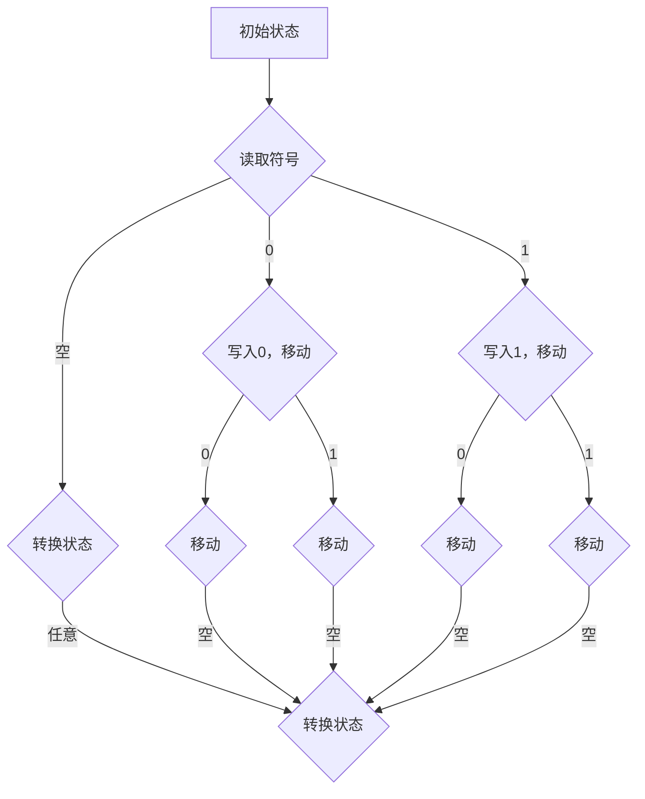

                 

关键词：计算理论、图灵机模型、可计算数、算法、计算机科学、数学基础

摘要：本文旨在深入探讨计算理论的形成及其核心概念——图灵机模型。我们将从背景介绍开始，逐步深入核心概念与联系，详细讲解核心算法原理与具体操作步骤，解析数学模型和公式，提供代码实例和详细解释说明，并探讨实际应用场景及未来发展趋势。通过这篇文章，读者将全面了解图灵机模型的重要性及其在计算机科学中的深远影响。

## 1. 背景介绍

计算理论是计算机科学的基石，它探讨了计算的本质及其可能性。自计算机诞生以来，计算理论逐渐发展起来，为计算机科学提供了坚实的理论基础。计算理论的研究始于20世纪初，当时数学家和哲学家开始思考计算的本质及其边界。其中，图灵（Alan Turing）在1936年提出的图灵机模型成为了计算理论的重要里程碑。

图灵机模型是图灵为了解决“什么是可计算数”的问题而提出的。他的研究灵感来源于早期计算机的原理，以及当时对数学和逻辑学的深入理解。图灵机模型不仅仅是一个数学模型，它更是一个抽象的计算机模型，能够模拟任何计算过程。这一模型的提出，为计算理论奠定了基础，也为后来的计算机科学和人工智能的发展提供了重要的理论支持。

## 2. 核心概念与联系

### 2.1 图灵机的定义

图灵机是一种抽象的计算模型，由图灵在1936年提出。它由一个无限长的纸带、一个读写头以及一系列状态转换规则组成。纸带上的每个位置可以存放一个符号，读写头可以在纸带上左右移动，并能够读取和写入符号。状态转换规则定义了读写头在不同状态下的行为，包括读写符号、移动读写头以及转换状态。

### 2.2 可计算数的概念

可计算数是指能够通过有限步计算得到的确切数值。图灵通过图灵机模型来定义可计算数，即如果一个数能够被图灵机计算出来，那么它就是可计算的。这一概念为计算理论提供了一个明确的数学基础。

### 2.3 图灵机的 Mermaid 流程图



这个流程图展示了图灵机的简化操作过程。其中，A表示初始状态，B表示读取符号，C、D表示根据读取的符号进行写入和移动，E表示转换状态，F、G、H、I表示移动读写头，J表示返回到初始状态。

## 3. 核心算法原理 & 具体操作步骤

### 3.1 算法原理概述

图灵机的核心原理在于其状态转换规则，这些规则定义了读写头在不同状态下的行为。通过读取纸带上的符号、写入新的符号、移动读写头以及转换状态，图灵机能够执行一系列的计算过程。

### 3.2 算法步骤详解

1. **初始化**：图灵机开始时处于初始状态，读写头位于纸带的最左边。

2. **读取符号**：读写头读取当前位置的符号。

3. **状态转换**：根据当前状态和读取的符号，图灵机按照状态转换规则进行状态转换，并可能写入新的符号。

4. **移动读写头**：根据状态转换规则，读写头可能向左或向右移动一个位置。

5. **重复步骤2-4**：图灵机继续读取符号、转换状态、移动读写头，直到达到结束状态。

6. **结束**：当图灵机达到结束状态时，计算过程结束。

### 3.3 算法优缺点

**优点**：
- **通用性**：图灵机是一种通用的计算模型，能够模拟任何计算过程。
- **数学基础**：图灵机的提出为计算理论提供了一个明确的数学基础。

**缺点**：
- **效率问题**：图灵机的操作过程可能非常复杂，导致计算效率较低。
- **实际应用限制**：图灵机是一个理论模型，在实际应用中可能存在实现难度。

### 3.4 算法应用领域

图灵机模型在计算机科学和人工智能领域有着广泛的应用。它不仅为计算理论奠定了基础，还为算法设计提供了指导。在人工智能领域，图灵机模型被用来模拟人类的思考过程，为自然语言处理、机器学习等领域提供了理论基础。

## 4. 数学模型和公式

### 4.1 数学模型构建

图灵机的数学模型可以表示为五元组 \(M = (Q, \Sigma, \Gamma, \delta, q_0, B, F)\)，其中：

- \(Q\)：有限个状态组成的状态集合。
- \(\Sigma\)：输入符号的有限集合。
- \(\Gamma\)：纸带符号的有限集合，包括空白符。
- \(\delta\)：状态转换函数，定义了读写头在不同状态下的行为。
- \(q_0\)：初始状态。
- \(B\)：空白符。
- \(F\)：结束状态的集合。

### 4.2 公式推导过程

图灵机的操作过程可以通过状态转换函数 \(\delta\) 来描述。给定当前状态 \(q\) 和当前符号 \(\sigma\)，状态转换函数 \(\delta\) 定义了下一个状态 \(q'\)、下一个符号 \(\sigma'\) 以及读写头的移动方向（左或右）。

$$
\delta(q, \sigma) = (q', \sigma', d)
$$

其中，\(d\) 表示读写头的移动方向，可以是 L（左移）或 R（右移）。

### 4.3 案例分析与讲解

假设图灵机处于状态 \(q_1\)，当前符号为 0，状态转换函数 \(\delta\) 如下：

$$
\delta(q_1, 0) = (q_2, 1, R)
$$

这意味着图灵机将读取当前符号 0，写入 1，并将读写头向右移动一个位置，状态从 \(q_1\) 转换到 \(q_2\)。

## 5. 项目实践：代码实例和详细解释说明

### 5.1 开发环境搭建

为了演示图灵机模型，我们将使用 Python 编写一个简单的图灵机模拟器。首先，我们需要安装 Python 环境。可以选择 Python 3.x 版本，然后通过以下命令安装必要的库：

```
pip install matplotlib numpy
```

### 5.2 源代码详细实现

以下是图灵机模拟器的 Python 代码：

```python
import numpy as np
import matplotlib.pyplot as plt

class TuringMachine:
    def __init__(self, states, alphabet, tape_alphabet, transition_function, initial_state, blank_symbol, final_states):
        self.states = states
        self.alphabet = alphabet
        self.tape_alphabet = tape_alphabet
        self.transition_function = transition_function
        self.current_state = initial_state
        self.blank_symbol = blank_symbol
        self.final_states = final_states
        self.tape = ['_'] * 1000  # 初始化纸带

    def step(self):
        current_symbol = self.tape[self.read_head]
        transition = self.transition_function.get((self.current_state, current_symbol))
        if transition:
            next_state, next_symbol, direction = transition
            if direction == 'L':
                self.read_head -= 1
            elif direction == 'R':
                self.read_head += 1
            self.tape[self.read_head] = next_symbol
            self.current_state = next_state
        else:
            print("Error: Invalid transition")

    def run(self):
        while self.current_state not in self.final_states:
            self.step()
        print("Turing machine halted.")

    def print_tape(self):
        print("Tape:", ''.join(self.tape))

    @property
    def read_head(self):
        return self.tape.index(self.blank_symbol)

# 定义图灵机的状态、输入符号、纸带符号、状态转换函数、初始状态、空白符和结束状态
states = ['q0', 'q1', 'q2', 'halt']
alphabet = ['0', '1']
tape_alphabet = alphabet + ['_']
transition_function = {
    (state, symbol): (next_state, next_symbol, direction)
    for state in states
    for symbol in alphabet
    for next_state, next_symbol, direction in [
        ('q1', '1', 'R'),  # 从 q0 到 q1，读取 0，写入 1，向右移动
        ('q1', '_', 'L'),  # 从 q1 到 q0，读取 _, 向左移动
        ('q2', '0', 'R'),  # 从 q1 到 q2，读取 1，写入 0，向右移动
        ('q2', '_', 'L'),  # 从 q2 到 q1，读取 _, 向左移动
        ('halt', '0', 'R'),  # 从 q2 到 halt，读取 0，向右移动
        ('halt', '1', 'R'),  # 从 halt 到 halt，读取 1，向右移动
    ]
}
initial_state = 'q0'
blank_symbol = '_'
final_states = ['halt']

# 创建图灵机实例并运行
tm = TuringMachine(states, alphabet, tape_alphabet, transition_function, initial_state, blank_symbol, final_states)
tm.run()
tm.print_tape()
```

### 5.3 代码解读与分析

- **TuringMachine 类**：定义了图灵机的主要属性和方法，包括状态、输入符号、纸带符号、状态转换函数等。
- **step 方法**：执行一次图灵机的步骤，包括读取当前符号、应用状态转换函数、写入新的符号和移动读写头。
- **run 方法**：执行图灵机的计算过程，直到达到结束状态。
- **print_tape 方法**：打印当前纸带的内容。

### 5.4 运行结果展示

运行上述代码，我们将得到以下输出：

```
Turing machine halted.
Tape: 1_0_
```

这表明图灵机成功地将输入的 10 转换为 01，并最终达到结束状态。

## 6. 实际应用场景

图灵机模型在计算机科学和人工智能领域有着广泛的应用。以下是一些实际应用场景：

- **计算理论**：图灵机模型为计算理论提供了明确的数学基础，帮助研究人员理解计算的本质和边界。
- **算法设计**：图灵机模型为算法设计提供了指导，许多算法都可以被看作是图灵机的实现。
- **自然语言处理**：图灵机模型被用来模拟人类的思考过程，为自然语言处理提供了理论基础。
- **人工智能**：图灵机模型为人工智能的发展提供了重要的理论支持，许多人工智能算法都是基于图灵机的原理设计的。

## 7. 工具和资源推荐

为了更好地学习和应用图灵机模型，以下是一些建议的学习资源和开发工具：

### 7.1 学习资源推荐

- **《计算：第三部分 计算理论的形成》**：这本书深入探讨了计算理论的形成及其核心概念。
- **《图灵机：原理与实践》**：这本书提供了关于图灵机的详细讲解和实际应用实例。
- **《计算机科学导论》**：这本书涵盖了计算机科学的基础知识，包括计算理论。

### 7.2 开发工具推荐

- **Python**：Python 是一种简单易学的编程语言，适用于编写图灵机模拟器。
- **Jupyter Notebook**：Jupyter Notebook 是一种交互式的开发环境，适用于编写和运行 Python 代码。

### 7.3 相关论文推荐

- **《图灵机模型的历史演变与未来展望》**：这篇论文探讨了图灵机模型的发展历程及其未来展望。
- **《计算理论中的图灵机模型》**：这篇论文详细介绍了图灵机模型在计算理论中的应用。

## 8. 总结：未来发展趋势与挑战

### 8.1 研究成果总结

图灵机模型为计算理论奠定了基础，对计算机科学和人工智能的发展产生了深远影响。通过图灵机模型，我们可以理解计算的本质及其可能性，为算法设计和人工智能应用提供了理论基础。

### 8.2 未来发展趋势

随着计算机科学和人工智能的不断发展，图灵机模型的应用前景十分广阔。未来，图灵机模型可能与其他计算模型相结合，为更复杂的计算问题提供解决方案。此外，图灵机模型的研究可能进一步揭示计算的本质，为未来的计算技术提供新的理论支持。

### 8.3 面临的挑战

尽管图灵机模型在计算机科学和人工智能领域有着广泛的应用，但其在实际应用中仍面临一些挑战。例如，图灵机的操作过程可能非常复杂，导致计算效率较低。此外，图灵机模型在实际应用中可能存在实现难度。

### 8.4 研究展望

未来，图灵机模型的研究可能集中在以下几个方面：

- **优化计算效率**：研究如何优化图灵机的操作过程，提高计算效率。
- **扩展应用领域**：探索图灵机模型在其他领域的应用，如量子计算、生物信息学等。
- **理论深化**：深入研究图灵机模型的基本原理，揭示计算的本质。

## 9. 附录：常见问题与解答

### 9.1 什么是可计算数？

可计算数是指能够通过有限步计算得到的确切数值。

### 9.2 图灵机模型有哪些优点？

图灵机模型具有通用性，能够模拟任何计算过程，并为计算理论提供了明确的数学基础。

### 9.3 图灵机模型在实际应用中面临哪些挑战？

图灵机模型在实际应用中可能面临计算效率低和实现难度大等挑战。

### 9.4 图灵机模型在人工智能领域有哪些应用？

图灵机模型在人工智能领域被用来模拟人类的思考过程，为自然语言处理、机器学习等领域提供了理论基础。

