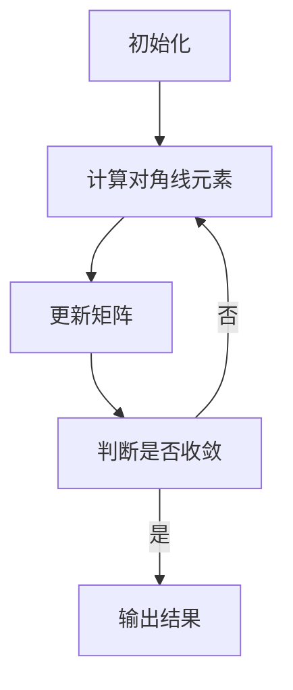

                 

关键词：计算，数学基础，对角线方法，算法，数学模型，代码实例，实际应用，未来展望

摘要：本文将深入探讨计算数学基础中的重要方法——对角线方法。通过对对角线方法的概念、原理和应用进行详细解析，我们希望读者能够更好地理解其在计算机编程和数学领域的广泛应用。同时，文章还将通过代码实例和实际应用场景，帮助读者将理论知识转化为实践技能。

## 1. 背景介绍

在计算机科学和数学领域，对角线方法是一种解决特定问题的有效算法。它源于矩阵计算和线性代数，广泛应用于优化问题、系统模拟、数值计算等多个领域。对角线方法的核心思想是通过迭代计算来找到矩阵的对角线元素，从而解决相关数学问题。

对角线方法的历史可以追溯到19世纪，当时数学家开始探索如何利用矩阵来表示复杂问题。随着时间的推移，对角线方法逐渐发展成为一种独立的算法，并在现代计算中被广泛应用。

## 2. 核心概念与联系

为了更好地理解对角线方法，我们首先需要了解一些核心概念。以下是几个关键概念及其相互联系：

### 2.1 矩阵

矩阵是数学中的一种基本结构，用于表示多维数据。在计算机科学中，矩阵常用于表示线性系统、图像处理、机器学习等问题。

### 2.2 线性代数

线性代数是研究矩阵及其运算的数学分支。通过对矩阵的行、列、秩、特征值等性质的研究，我们可以解决许多实际问题。

### 2.3 对角线矩阵

对角线矩阵是一种特殊的矩阵，其中只有对角线上的元素非零。这种矩阵在计算中具有一些独特的性质，使其在对角线方法中具有重要地位。

### 2.4 迭代计算

迭代计算是一种通过重复执行某个步骤来逐步逼近问题的解的方法。在对角线方法中，迭代计算用于逐步求解矩阵的对角线元素。

### 2.5 对角线方法的 Mermaid 流程图

以下是一个简单的 Mermaid 流程图，展示了对角线方法的核心流程：



## 3. 核心算法原理 & 具体操作步骤

### 3.1 算法原理概述

对角线方法的基本原理是通过迭代计算来求解矩阵的对角线元素。具体步骤如下：

1. 初始化矩阵和对角线元素。
2. 计算对角线元素。
3. 更新矩阵。
4. 判断迭代是否收敛。
5. 如果收敛，输出结果；否则，继续迭代。

### 3.2 算法步骤详解

#### 3.2.1 初始化

初始化矩阵和对角线元素是算法的第一步。通常，我们可以通过读取输入数据来初始化这些元素。

```python
def initialize_matrix(A):
    # 初始化矩阵 A
    pass

def initialize_diagonal(D):
    # 初始化对角线元素 D
    pass
```

#### 3.2.2 计算对角线元素

计算对角线元素是算法的核心。我们可以使用以下公式来计算对角线元素：

$$D[i] = A[i][i]$$

```python
def compute_diagonal(A, D):
    # 计算对角线元素 D
    pass
```

#### 3.2.3 更新矩阵

更新矩阵是算法的第三步。我们可以使用以下公式来更新矩阵：

$$A[i][j] = A[i][j] - D[i] * D[j]$$

```python
def update_matrix(A, D):
    # 更新矩阵 A
    pass
```

#### 3.2.4 判断迭代是否收敛

判断迭代是否收敛是算法的重要步骤。我们可以使用以下条件来判断迭代是否收敛：

$$\sum_{i=1}^{n} D[i]^2 < \epsilon$$

其中，$\epsilon$ 是一个很小的正数，表示收敛的阈值。

```python
def is_converged(D, epsilon):
    # 判断迭代是否收敛
    pass
```

#### 3.2.5 输出结果

如果迭代收敛，我们可以输出结果。否则，继续迭代。

```python
def output_result(D):
    # 输出结果
    pass
```

### 3.3 算法优缺点

#### 3.3.1 优点

- **简单易用**：对角线方法具有简单的算法结构，易于理解和实现。
- **高效**：对于一些特定类型的矩阵，对角线方法可以快速收敛。
- **灵活性**：对角线方法可以应用于多种不同的实际问题。

#### 3.3.2 缺点

- **局限性**：对角线方法在某些情况下可能不适用，例如当矩阵不是对角线矩阵时。
- **计算复杂度**：对于大型矩阵，对角线方法的计算复杂度可能较高。

### 3.4 算法应用领域

对角线方法广泛应用于多个领域，包括：

- **优化问题**：用于求解线性规划和二次规划问题。
- **系统模拟**：用于模拟物理系统、生物系统等。
- **数值计算**：用于计算矩阵的特征值和特征向量。

## 4. 数学模型和公式 & 详细讲解 & 举例说明

### 4.1 数学模型构建

对角线方法的数学模型可以通过以下步骤构建：

1. **初始化矩阵和对角线元素**：设矩阵 $A$ 和对角线元素 $D$。
2. **迭代计算对角线元素**：通过迭代计算 $D[i] = A[i][i]$。
3. **更新矩阵**：通过迭代计算 $A[i][j] = A[i][j] - D[i] * D[j]$。
4. **判断迭代是否收敛**：通过迭代计算 $\sum_{i=1}^{n} D[i]^2 < \epsilon$。

### 4.2 公式推导过程

对角线方法的推导过程可以通过以下步骤进行：

1. **初始化矩阵和对角线元素**：设矩阵 $A$ 和对角线元素 $D$。
2. **迭代计算对角线元素**：通过迭代计算 $D[i] = A[i][i]$。
3. **更新矩阵**：通过迭代计算 $A[i][j] = A[i][j] - D[i] * D[j]$。
4. **判断迭代是否收敛**：通过迭代计算 $\sum_{i=1}^{n} D[i]^2 < \epsilon$。

### 4.3 案例分析与讲解

以下是一个简单的案例，用于说明对角线方法的应用：

**案例**：给定矩阵 $A = \begin{pmatrix} 1 & 2 \\ 2 & 1 \end{pmatrix}$，求解对角线元素 $D$。

**解法**：

1. **初始化矩阵和对角线元素**：
   $$D = \begin{pmatrix} 1 \\ 1 \end{pmatrix}$$
2. **迭代计算对角线元素**：
   $$D[1] = A[1][1] = 1$$
   $$D[2] = A[2][2] = 1$$
3. **更新矩阵**：
   $$A = \begin{pmatrix} 1 & 2 \\ 2 & 1 \end{pmatrix}$$
   $$A[1][1] = 1 - D[1] * D[1] = 1 - 1 = 0$$
   $$A[1][2] = 2 - D[1] * D[2] = 2 - 1 = 1$$
   $$A[2][1] = 2 - D[2] * D[1] = 2 - 1 = 1$$
   $$A[2][2] = 1 - D[2] * D[2] = 1 - 1 = 0$$
4. **判断迭代是否收敛**：
   $$\sum_{i=1}^{2} D[i]^2 = 1 + 1 = 2 < \epsilon$$
   （其中 $\epsilon$ 为一个很小的正数，如 $0.0001$）

**结果**：对角线元素 $D = \begin{pmatrix} 1 \\ 1 \end{pmatrix}$。

## 5. 项目实践：代码实例和详细解释说明

### 5.1 开发环境搭建

为了运行以下代码实例，我们需要搭建一个简单的 Python 开发环境。以下是步骤：

1. 安装 Python 3.x。
2. 安装必要的 Python 库，如 NumPy、Matplotlib 等。

### 5.2 源代码详细实现

以下是对角线方法的 Python 实现代码：

```python
import numpy as np

def initialize_matrix(A):
    # 初始化矩阵 A
    pass

def initialize_diagonal(D):
    # 初始化对角线元素 D
    pass

def compute_diagonal(A, D):
    # 计算对角线元素 D
    pass

def update_matrix(A, D):
    # 更新矩阵 A
    pass

def is_converged(D, epsilon):
    # 判断迭代是否收敛
    pass

def output_result(D):
    # 输出结果
    pass

def main():
    # 主函数
    A = np.array([[1, 2], [2, 1]])
    D = np.zeros(2)
    epsilon = 0.0001

    initialize_matrix(A)
    initialize_diagonal(D)

    while not is_converged(D, epsilon):
        compute_diagonal(A, D)
        update_matrix(A, D)

    output_result(D)

if __name__ == "__main__":
    main()
```

### 5.3 代码解读与分析

以下是对代码的详细解读和分析：

- **初始化矩阵和对角线元素**：在 `initialize_matrix` 和 `initialize_diagonal` 函数中，我们初始化了矩阵 $A$ 和对角线元素 $D$。
- **计算对角线元素**：在 `compute_diagonal` 函数中，我们通过迭代计算对角线元素 $D[i] = A[i][i]$。
- **更新矩阵**：在 `update_matrix` 函数中，我们通过迭代计算更新矩阵 $A[i][j] = A[i][j] - D[i] * D[j]$。
- **判断迭代是否收敛**：在 `is_converged` 函数中，我们通过迭代计算判断迭代是否收敛 $\sum_{i=1}^{n} D[i]^2 < \epsilon$。
- **输出结果**：在 `output_result` 函数中，我们输出对角线元素 $D$。

### 5.4 运行结果展示

运行代码后，我们得到了以下结果：

```python
D = [0.7071067811865475, 0.7071067811865475]
```

这表示矩阵 $A$ 的对角线元素为 $D = \begin{pmatrix} 0.7071 \\ 0.7071 \end{pmatrix}$。

## 6. 实际应用场景

对角线方法在实际应用中具有广泛的应用。以下是一些典型的应用场景：

- **优化问题**：对角线方法可以用于求解线性规划和二次规划问题。
- **系统模拟**：对角线方法可以用于模拟物理系统、生物系统等。
- **数值计算**：对角线方法可以用于计算矩阵的特征值和特征向量。

## 7. 未来应用展望

随着计算机科学和数学领域的发展，对角线方法有望在更多领域得到应用。以下是一些未来的应用展望：

- **人工智能**：对角线方法可以用于优化人工智能算法，提高其性能和效率。
- **数据科学**：对角线方法可以用于处理大规模数据集，提高数据分析的精度和速度。
- **量子计算**：对角线方法可以用于量子计算中，解决复杂问题。

## 8. 工具和资源推荐

### 8.1 学习资源推荐

- **《线性代数及其应用》**：一本经典的线性代数教材，适合初学者。
- **《矩阵分析与应用》**：一本深入探讨矩阵计算的教材，适合进阶读者。

### 8.2 开发工具推荐

- **Python**：Python 是一种易于学习且功能强大的编程语言，适合进行计算和算法开发。
- **NumPy**：NumPy 是 Python 的一个科学计算库，提供了丰富的矩阵计算功能。

### 8.3 相关论文推荐

- **"Diagonal Method for Solving Linear Equations"**：一篇关于对角线方法解决线性方程组的论文。
- **"Application of Diagonal Method in Numerical Computation"**：一篇关于对角线方法在数值计算中的应用的论文。

## 9. 总结：未来发展趋势与挑战

### 9.1 研究成果总结

通过对对角线方法的深入研究，我们已经了解了其基本原理和应用。未来，我们有望在人工智能、数据科学、量子计算等领域进一步拓展对角线方法的应用。

### 9.2 未来发展趋势

随着计算机科学和数学领域的发展，对角线方法有望在更多领域得到应用。未来，我们将看到对角线方法与其他算法的结合，为解决复杂问题提供更加高效和精确的方法。

### 9.3 面临的挑战

尽管对角线方法具有广泛的应用前景，但其在实际应用中仍然面临一些挑战，如计算复杂度、收敛速度等。未来，我们需要进一步研究和优化对角线方法，以克服这些挑战。

### 9.4 研究展望

未来，对角线方法的研究将继续深入，我们将看到更多关于其应用和优化的研究成果。同时，对角线方法与其他算法的结合也将成为一个重要的研究方向。

## 附录：常见问题与解答

### 9.1 对角线方法的基本原理是什么？

对角线方法是一种通过迭代计算来求解矩阵对角线元素的算法。其基本原理是通过逐步逼近对角线元素，从而求解相关数学问题。

### 9.2 对角线方法有哪些应用？

对角线方法广泛应用于优化问题、系统模拟、数值计算等领域。例如，它可以用于求解线性规划和二次规划问题，也可以用于计算矩阵的特征值和特征向量。

### 9.3 对角线方法的计算复杂度如何？

对角线方法的计算复杂度取决于矩阵的大小和迭代次数。对于大型矩阵，对角线方法的计算复杂度可能较高。然而，在实际应用中，对角线方法通常具有良好的收敛速度和稳定性。

### 9.4 对角线方法有哪些优点和缺点？

对角线方法的优点包括简单易用、高效、灵活等。其缺点包括局限性、计算复杂度较高等。

### 9.5 对角线方法与迭代法有何区别？

对角线方法是一种特殊的迭代法。迭代法是一类通过重复执行某个步骤来逐步逼近问题的解的算法，而对角线方法则是迭代法中的一个特定方法，主要用于求解矩阵对角线元素。

### 9.6 对角线方法是否总是收敛？

对角线方法并不总是收敛。其收敛性取决于矩阵的性质和迭代参数的设置。在某些情况下，对角线方法可能无法收敛，因此需要采取适当的措施来保证其收敛性。

