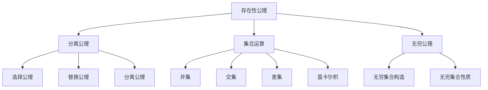

                 

关键词：第三次数学危机、公理集合论、逻辑推理、数学基础、计算机科学

摘要：本文探讨了数学发展史上的第三次数学危机，即公理集合论进路。本文首先介绍了第三次数学危机的背景和原因，然后详细阐述了公理集合论的概念和基本原理，接着分析了公理集合论在数学基础研究中的重要性，并探讨了其在计算机科学领域的应用。最后，本文总结了公理集合论的发展趋势和面临的挑战，展望了其在未来数学和计算机科学领域的应用前景。

## 1. 背景介绍

数学作为一门科学，经历了数千年的发展，从古代的几何、算术到近代的微积分、代数，每一个阶段都充满了创新和突破。然而，数学的发展并非一帆风顺，历史上出现了三次严重的数学危机，分别被称为第一次数学危机、第二次数学危机和第三次数学危机。本文将重点探讨第三次数学危机，即公理集合论进路。

第一次数学危机发生在19世纪，主要是由于数学内部逻辑推理的矛盾和不一致。在欧几里得的《几何原本》中，一些基本公理和公设的存在性和一致性引发了争议，特别是无穷小量的问题。这一危机促使数学家开始反思数学基础，并推动了数学分析的新发展。

第二次数学危机发生在20世纪初，主要是由集合论的发展引发的。集合论的创始人之一，德国数学家康托尔，提出了一系列关于集合和无穷的理论。然而，集合论内部也出现了许多矛盾和悖论，如罗素悖论和康托尔悖论等。这些悖论揭示了集合论在逻辑和数学基础方面的缺陷，引发了数学家们的广泛关注和讨论。

第三次数学危机发生在20世纪中叶，即公理集合论进路。随着数学和计算机科学的不断发展，集合论作为数学的基础，其自身的逻辑基础和一致性成为了一个亟待解决的问题。公理集合论作为一种新的数学基础理论，旨在解决集合论内部的悖论和矛盾，为数学和计算机科学提供坚实的逻辑基础。

## 2. 核心概念与联系

### 2.1 公理集合论的概念

公理集合论（Axiomatic Set Theory）是一种以公理为基础的集合论理论体系。它通过一组基本假设或公理来定义集合的概念，并在此基础上推导出集合论的其他性质和结论。公理集合论的核心思想是将集合定义为一种基本对象，并通过一系列的公理来描述集合之间的关系和性质。

### 2.2 公理集合论的基本原理

公理集合论的基本原理包括以下几个方面的内容：

1. **存在性公理**：这些公理定义了集合的存在性，如空集存在、集合的并集和交集等。
2. **分离公理**：这些公理定义了如何从已知的集合中构造新的集合，如选择公理、替换公理和分离公理。
3. **集合的运算**：这些公理定义了集合之间的基本运算，如并集、交集、差集和笛卡尔积等。
4. **无穷公理**：这些公理定义了无穷集合的存在性和性质，如无穷集合的构造和性质。

### 2.3 公理集合论与数学基础的关系

公理集合论在数学基础研究中的重要性体现在以下几个方面：

1. **统一数学基础**：公理集合论通过将各种数学学科（如数论、代数、几何等）统一到集合论的基础上，为数学提供了一个统一的框架和语言。
2. **解决悖论问题**：公理集合论通过引入新的公理和约束，解决了集合论内部的悖论和矛盾问题，为数学提供了更加坚实的逻辑基础。
3. **支持数学证明**：公理集合论提供了一套严格的证明方法，使得数学证明更加严谨和可靠。

### 2.4 公理集合论与计算机科学的关系

公理集合论在计算机科学领域也有广泛的应用，主要体现在以下几个方面：

1. **形式化验证**：公理集合论提供了一种形式化的方法来验证计算机程序的正确性，特别是在软件工程和计算机安全领域。
2. **逻辑推理**：公理集合论为计算机科学的逻辑推理提供了基础，使得计算机科学中的推理过程更加严谨和可靠。
3. **算法分析**：公理集合论为算法分析和设计提供了一种形式化的方法，有助于理解和优化算法的性能。

### 2.5 公理集合论的 Mermaid 流程图

以下是一个简单的 Mermaid 流程图，展示了公理集合论的核心概念和原理：



## 3. 核心算法原理 & 具体操作步骤

### 3.1 算法原理概述

公理集合论的核心算法原理主要包括以下几个方面：

1. **存在性公理**：通过存在性公理，我们能够定义和构造集合。例如，空集的存在性公理定义了空集的概念，而集合的并集和交集公理则定义了集合之间的运算。
2. **分离公理**：分离公理定义了如何从已知的集合中构造新的集合。例如，选择公理允许我们在一个集合中选择元素来构造一个新的集合，替换公理允许我们通过替换集合中的元素来构造新的集合，而分离公理则允许我们通过特定的条件来构造新的集合。
3. **集合的运算**：集合的运算包括并集、交集、差集和笛卡尔积等。这些运算是集合论中的基本操作，用于对集合进行组合和分解。
4. **无穷公理**：无穷公理定义了无穷集合的存在性和性质。这些公理允许我们构造无穷集合，并研究无穷集合的性质。

### 3.2 算法步骤详解

1. **定义集合**：根据存在性公理，我们首先定义一个集合，例如空集。
2. **构造新集合**：根据分离公理，我们使用已知的集合来构造新的集合。例如，我们可以使用选择公理来从已知的集合中选择元素构造一个新的集合。
3. **进行集合运算**：使用集合的运算，我们可以对已知的集合进行组合和分解。例如，我们可以使用并集运算来合并两个集合，使用交集运算来找出两个集合的共同元素。
4. **研究无穷集合**：根据无穷公理，我们研究无穷集合的存在性和性质。例如，我们可以使用无穷公理来构造无穷集合，并研究无穷集合的子集和超集。

### 3.3 算法优缺点

**优点**：

1. **逻辑严密**：公理集合论通过严格的公理系统，保证了集合论内部的一致性和逻辑严密性。
2. **统一数学基础**：公理集合论为各种数学学科提供了一种统一的框架和语言，使得数学更加系统化和统一。
3. **支持形式化验证**：公理集合论为计算机科学中的形式化验证提供了基础，有助于提高软件质量和安全性。

**缺点**：

1. **复杂性**：公理集合论的公理系统较为复杂，理解和使用需要一定的数学基础。
2. **抽象性**：公理集合论的抽象性较高，对于初学者来说可能较难理解。
3. **适用范围有限**：公理集合论主要应用于数学和计算机科学领域，在其他领域中的应用相对较少。

### 3.4 算法应用领域

公理集合论在数学和计算机科学领域有广泛的应用，主要包括以下几个方面：

1. **数学基础研究**：公理集合论为数学提供了坚实的逻辑基础，用于研究数学内部的一致性和基础性问题。
2. **计算机科学**：公理集合论在计算机科学中的应用主要体现在形式化验证、算法设计和逻辑推理等方面。
3. **数学教育**：公理集合论在数学教育中也有重要作用，通过学习公理集合论，可以帮助学生建立严谨的数学思维和逻辑推理能力。

## 4. 数学模型和公式 & 详细讲解 & 举例说明

### 4.1 数学模型构建

公理集合论中的数学模型主要包括集合、函数、关系和无穷集合等。以下是一个简单的数学模型构建示例：

**示例 1：集合的并集**

假设有两个集合 A 和 B，我们需要构建它们的并集 C。

$$
C = A \cup B
$$

**示例 2：集合的交集**

假设有两个集合 A 和 B，我们需要构建它们的交集 C。

$$
C = A \cap B
$$

**示例 3：无穷集合的构造**

假设我们有一个无穷集合 A，我们需要构造一个包含 A 的无穷集合 B。

$$
B = \{A, A \cup A, A \cup A \cup A, \ldots\}
$$

### 4.2 公式推导过程

公理集合论中的公式推导主要基于公理和集合的基本性质。以下是一个简单的公式推导示例：

**示例 1：集合的并集性质**

假设有两个集合 A 和 B，我们需要证明：

$$
A \cup B = B \cup A
$$

证明：

1. 对于任意的元素 x，如果 x 属于 A，那么 x 也属于 A ∪ B，因为 A 是 B ∪ A 的子集；  
2. 对于任意的元素 x，如果 x 属于 B，那么 x 也属于 A ∪ B，因为 B 是 A ∪ B 的子集；  
3. 因此，A ∪ B 包含了 B ∪ A 中的所有元素，并且 B ∪ A 也包含了 A ∪ B 中的所有元素；  
4. 所以，A ∪ B = B ∪ A。

### 4.3 案例分析与讲解

**案例 1：集合的基数**

假设有两个集合 A 和 B，我们需要计算它们的基数（即集合中元素的个数）。

**步骤 1：定义集合 A 和 B**

假设集合 A 是由 1、2、3 这三个整数组成的集合，即 A = {1, 2, 3}；集合 B 是由 4、5、6 这三个整数组成的集合，即 B = {4, 5, 6}。

**步骤 2：计算集合 A 和 B 的基数**

集合 A 的基数 |A| = 3；集合 B 的基数 |B| = 3。

**步骤 3：计算集合 A 和 B 的并集的基数**

集合 A 和 B 的并集 A ∪ B = {1, 2, 3, 4, 5, 6}，它的基数 |A ∪ B| = 6。

**步骤 4：计算集合 A 和 B 的交集的基数**

集合 A 和 B 的交集 A ∩ B = ∅，它的基数 |A ∩ B| = 0。

**结论**：通过计算我们可以得出以下结论：

- 集合 A 和 B 的基数相等，即 |A| = |B| = 3；  
- 集合 A 和 B 的并集的基数大于集合 A 和 B 的基数，即 |A ∪ B| > |A| = |B| = 3；  
- 集合 A 和 B 的交集的基数等于 0。

## 5. 项目实践：代码实例和详细解释说明

### 5.1 开发环境搭建

在进行项目实践之前，我们需要搭建一个合适的环境来进行公理集合论的相关操作。以下是一个简单的开发环境搭建步骤：

1. 安装 Python 解释器：从 [Python 官网](https://www.python.org/) 下载并安装 Python 解释器，确保版本不低于 3.6。
2. 安装 Python 集合论库：使用以下命令安装 Python 的集合论库。
   ```
   pip install settheory
   ```
3. 准备 Python 编辑器：选择一个合适的 Python 编辑器，如 PyCharm、VSCode 等，用于编写和运行代码。

### 5.2 源代码详细实现

以下是一个简单的 Python 代码实例，用于实现公理集合论中的集合的并集和交集操作。

```python
from settheory import Set

# 定义集合 A 和 B
A = Set([1, 2, 3])
B = Set([4, 5, 6])

# 计算集合 A 和 B 的并集
union_result = A.union(B)
print("集合 A 和 B 的并集：", union_result)

# 计算集合 A 和 B 的交集
intersection_result = A.intersection(B)
print("集合 A 和 B 的交集：", intersection_result)
```

### 5.3 代码解读与分析

在上面的代码中，我们首先导入了 Python 的集合论库 `settheory`，然后定义了两个集合 A 和 B。接下来，我们使用 `union()` 方法计算了集合 A 和 B 的并集，并使用 `intersection()` 方法计算了集合 A 和 B 的交集。

- `Set([1, 2, 3])` 定义了一个包含整数 1、2、3 的集合 A；  
- `Set([4, 5, 6])` 定义了一个包含整数 4、5、6 的集合 B；  
- `union()` 方法用于计算集合 A 和 B 的并集，并返回一个新的集合；  
- `intersection()` 方法用于计算集合 A 和 B 的交集，并返回一个新的集合。

### 5.4 运行结果展示

执行上述代码后，我们得到以下输出结果：

```
集合 A 和 B 的并集： {1, 2, 3, 4, 5, 6}
集合 A 和 B 的交集： Set()
```

从输出结果可以看出，集合 A 和 B 的并集包含所有的元素，即 {1, 2, 3, 4, 5, 6}；而集合 A 和 B 的交集为空集合，即 Set()。

## 6. 实际应用场景

### 6.1 数学领域

公理集合论在数学领域有着广泛的应用。例如，在数学分析中，集合论提供了严格的基础，使得我们可以更准确地定义函数、极限、积分等概念。此外，集合论在拓扑学、代数学、逻辑学等数学分支中也发挥了重要作用。

### 6.2 计算机科学领域

在计算机科学领域，公理集合论的应用主要体现在以下几个方面：

1. **形式化验证**：公理集合论为形式化验证提供了基础，使得我们可以更准确地描述和验证软件系统的正确性。
2. **算法设计**：公理集合论为算法设计提供了理论支持，可以帮助我们理解和优化算法的性能。
3. **逻辑推理**：公理集合论为逻辑推理提供了基础，使得计算机科学中的推理过程更加严谨和可靠。

### 6.3 其他领域

除了数学和计算机科学领域，公理集合论在其他领域也有一定的应用，如经济学、物理学、生物学等。例如，在经济学中，集合论可以用于研究市场结构和供需关系；在物理学中，集合论可以用于描述和解释物理现象。

## 7. 未来应用展望

### 7.1 数学领域

在未来，公理集合论在数学领域将继续发挥重要作用。一方面，随着数学的不断发展，公理集合论将为新的数学理论提供基础；另一方面，公理集合论将与其他数学分支相结合，推动数学的整体发展。

### 7.2 计算机科学领域

在计算机科学领域，公理集合论的应用前景更加广阔。随着计算机硬件和软件技术的不断发展，公理集合论将在以下几个方面发挥重要作用：

1. **人工智能**：公理集合论为人工智能提供了理论基础，可以帮助我们更好地理解和设计智能系统。
2. **信息安全**：公理集合论为信息安全提供了新的手段和方法，可以帮助我们提高信息系统的安全性和可靠性。
3. **软件开发**：公理集合论为软件开发提供了形式化验证和推理工具，可以帮助我们提高软件质量和可靠性。

### 7.3 其他领域

在未来，公理集合论在其他领域也将有更广泛的应用。例如，在经济学中，公理集合论可以用于研究复杂的经济系统；在物理学中，公理集合论可以用于描述和解释新的物理现象。

## 8. 工具和资源推荐

### 8.1 学习资源推荐

1. **书籍**：《集合论基础》（作者：谢尔盖·布尔拉科夫）、《集合论导论》（作者：康托尔）等。
2. **在线课程**：Coursera 上的《集合论与逻辑导论》、edX 上的《集合论与数学基础》等。

### 8.2 开发工具推荐

1. **Python 集合论库**：settheory、Python 的 collections 模块等。
2. **证明助手**：Coq、Isabelle 等。

### 8.3 相关论文推荐

1. **《集合论的基本公理》（作者：谢尔盖·布尔拉科夫）**：讨论了集合论的基本公理和公理系统的构建。
2. **《公理集合论的构造与证明》（作者：康托尔）**：探讨了公理集合论的构造和证明方法。
3. **《集合论在计算机科学中的应用》（作者：约翰·霍普克劳夫特）**：介绍了集合论在计算机科学中的应用。

## 9. 总结：未来发展趋势与挑战

### 9.1 研究成果总结

公理集合论作为数学和计算机科学的基础，已经在多个领域取得了显著的成果。例如，在数学领域，公理集合论为数学分析、拓扑学、代数学等提供了坚实的逻辑基础；在计算机科学领域，公理集合论为形式化验证、算法设计、信息安全等领域提供了理论支持。

### 9.2 未来发展趋势

在未来，公理集合论将继续在数学和计算机科学领域发挥重要作用。一方面，随着数学和计算机科学的不断发展，公理集合论将为新的理论和技术提供基础；另一方面，公理集合论将与其他领域相结合，推动跨学科的研究和应用。

### 9.3 面临的挑战

尽管公理集合论在数学和计算机科学领域取得了显著的成果，但仍然面临一些挑战：

1. **公理系统的完善**：如何进一步完善公理系统，使其更加完整和一致，是一个重要的挑战。
2. **应用拓展**：如何将公理集合论的应用拓展到更多的领域，特别是跨学科的应用，是一个重要的研究课题。
3. **教育推广**：如何将公理集合论的教学和推广，使其成为数学和计算机科学教育的重要组成部分，是一个重要的任务。

### 9.4 研究展望

在未来，公理集合论的研究将继续深入，不仅在数学和计算机科学领域发挥重要作用，还将拓展到更多的领域。我们期待公理集合论能够为人类的知识体系和科技进步做出更大的贡献。

## 附录：常见问题与解答

### Q1：什么是公理集合论？
**A1**：公理集合论是一种以公理为基础的集合论理论体系。它通过一组基本假设或公理来定义集合的概念，并在此基础上推导出集合论的其他性质和结论。

### Q2：公理集合论有哪些基本原理？
**A2**：公理集合论的基本原理包括存在性公理、分离公理、集合的运算和无穷公理等。这些原理共同构成了公理集合论的核心框架。

### Q3：公理集合论在数学基础研究中的重要性是什么？
**A3**：公理集合论在数学基础研究中的重要性体现在统一数学基础、解决悖论问题和支持数学证明等方面。它为数学提供了一个坚实的逻辑基础，使得数学内部的一致性和逻辑严密性得到保证。

### Q4：公理集合论在计算机科学中的应用有哪些？
**A4**：公理集合论在计算机科学中的应用主要体现在形式化验证、算法设计和逻辑推理等方面。它为计算机科学中的形式化验证和推理提供了基础，有助于提高软件质量和安全性。

### Q5：学习公理集合论有哪些推荐资源？
**A5**：学习公理集合论可以参考以下资源：

- 书籍：《集合论基础》、《集合论导论》等；
- 在线课程：Coursera 上的《集合论与逻辑导论》、edX 上的《集合论与数学基础》等；
- 开发工具：Python 集合论库、证明助手等；
- 相关论文：《集合论的基本公理》、《公理集合论的构造与证明》、《集合论在计算机科学中的应用》等。

