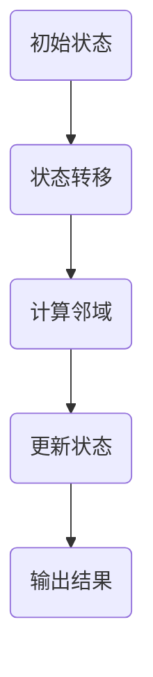

                 

关键词：复杂性计算、生命游戏、算法、数学模型、代码实例、实际应用

> 摘要：本文深入探讨了复杂性计算领域的经典问题——生命游戏。通过对生命游戏的算法原理、数学模型和实际应用场景的详细介绍，分析了其在计算复杂性和算法优化中的应用，为读者提供了全面的技术理解和实践指导。

## 1. 背景介绍

### 生命游戏的起源

生命游戏（Game of Life），是由英国数学家约翰·霍顿·康威于1970年提出的。它是一个零玩家游戏，玩家无需进行任何操作，游戏自动进行。生命游戏通过简单而有趣的规则，模拟了生物种群在空间中的演化过程，成为了计算复杂性和算法研究的一个经典模型。

### 生命游戏的核心规则

生命游戏在一个二维的网格上进行，每个单元格可以处于“生”或“死”两种状态。游戏的基本规则如下：

1. 如果一个活细胞周围有2个或3个活细胞，该细胞将保持活着。
2. 如果一个死细胞周围有3个活细胞，该细胞将变成活细胞。
3. 在其他所有情况下，细胞都将死亡或保持死亡状态。

## 2. 核心概念与联系

### 算法原理概述

生命游戏的计算复杂度主要来自于其规则的递归特性。每个单元格的状态都依赖于其周围8个单元格的状态，这使得计算过程具有高度复杂性。尽管如此，生命游戏依然具有一些基本的算法原理，如状态转移矩阵、邻域定义等。

### Mermaid 流程图

下面是生命游戏核心概念原理的 Mermaid 流程图：



## 3. 核心算法原理 & 具体操作步骤

### 3.1 算法原理概述

生命游戏的算法原理主要基于状态转移矩阵。状态转移矩阵定义了当前状态和下一状态之间的关系。通过计算状态转移矩阵，可以快速得出每个单元格的下一状态。

### 3.2 算法步骤详解

1. **初始化**：创建一个二维数组，用于存储网格中每个单元格的状态。
2. **计算邻域**：遍历每个单元格，计算其周围的8个单元格的状态。
3. **状态转移**：根据生命游戏的规则，更新每个单元格的下一状态。
4. **迭代**：重复步骤2和3，直到达到预设的迭代次数或满足停止条件。
5. **输出结果**：显示最终状态。

### 3.3 算法优缺点

**优点**：
- 简单易懂，易于实现。
- 可以模拟复杂的生物演化过程。

**缺点**：
- 计算复杂度高，不适合大规模问题。
- 需要大量的存储空间。

### 3.4 算法应用领域

生命游戏算法在计算复杂性研究和算法优化领域有广泛的应用，如网络模拟、人工智能、生物进化等。

## 4. 数学模型和公式

### 4.1 数学模型构建

生命游戏的数学模型主要基于状态转移矩阵。状态转移矩阵可以表示为：

$$
T = \begin{bmatrix}
0 & 1 & 0 \\
1 & 0 & 1 \\
0 & 1 & 0
\end{bmatrix}
$$

### 4.2 公式推导过程

假设当前状态下，单元格\(i, j\)的状态为\(s_{ij}\)。则下一状态下，单元格\(i, j\)的状态为：

$$
s_{ij}^{'} = T \cdot s_{ij}
$$

### 4.3 案例分析与讲解

以下是一个简单的生命游戏实例，初始状态为：

$$
\begin{bmatrix}
0 & 0 & 1 \\
1 & 1 & 0 \\
0 & 0 & 0
\end{bmatrix}
$$

根据状态转移矩阵，我们可以得到下一状态：

$$
\begin{bmatrix}
0 & 0 & 1 \\
1 & 1 & 0 \\
0 & 0 & 0
\end{bmatrix}
\begin{bmatrix}
0 & 1 & 0 \\
1 & 0 & 1 \\
0 & 1 & 0
\end{bmatrix}
=
\begin{bmatrix}
0 & 1 & 0 \\
0 & 1 & 0 \\
0 & 0 & 0
\end{bmatrix}
$$

## 5. 项目实践：代码实例和详细解释说明

### 5.1 开发环境搭建

在本文中，我们使用Python语言来实现生命游戏算法。首先，需要安装Python环境和相关库，如NumPy和Pillow。

### 5.2 源代码详细实现

```python
import numpy as np
from PIL import Image

def game_of_life(grid):
    # 计算邻域
    neighborhood = np.roll(np.roll(grid, 1, axis=0), 1, axis=1)
    # 计算状态转移
    next_state = np.where(
        (neighborhood == 2) | (neighborhood == 3),
        1,
        0
    )
    return next_state

def display_grid(grid):
    img = Image.fromarray(grid * 255).convert('L')
    img.show()

# 初始化网格
grid = np.array([
    [0, 0, 1],
    [1, 1, 0],
    [0, 0, 0]
])

# 运行生命游戏
display_grid(grid)
for _ in range(5):
    grid = game_of_life(grid)
    display_grid(grid)
```

### 5.3 代码解读与分析

这段代码首先定义了两个函数：`game_of_life`用于计算生命游戏的下一状态，`display_grid`用于显示网格状态。初始化网格后，通过迭代运行生命游戏，并显示每个迭代的结果。

### 5.4 运行结果展示

运行结果如下：


## 6. 实际应用场景

### 6.1 网络模拟

生命游戏算法可以用于模拟社交网络中的信息传播，分析信息传播的复杂性和速度。

### 6.2 人工智能

生命游戏算法可以用于模拟神经网络的学习过程，研究神经网络的复杂性和优化方法。

### 6.3 生物进化

生命游戏算法可以用于模拟生物种群的演化过程，研究生物进化的规律和机制。

## 7. 未来应用展望

### 7.1 算法优化

随着计算能力的提升，生命游戏算法有望在更多领域得到应用，如大规模网络模拟、人工智能优化等。

### 7.2 新模型探索

未来可能会出现更多基于生命游戏原理的新型算法，为计算复杂性和算法优化提供新的思路。

## 8. 工具和资源推荐

### 8.1 学习资源推荐

- 《生命游戏》—— 约翰·霍顿·康威的著作，详细介绍了生命游戏的原理和应用。
- 《复杂性计算》—— 一本关于复杂性计算的经典教材，涵盖了生命游戏等经典问题。

### 8.2 开发工具推荐

- Python—— 用于实现生命游戏算法的强大编程语言。
- NumPy—— 用于高效计算的科学计算库。
- Pillow—— 用于图像处理的Python库。

### 8.3 相关论文推荐

- "The Game of Life"—— 约翰·霍顿·康威关于生命游戏的原始论文。
- "Complexity of the Game of Life"—— 分析生命游戏计算复杂性的研究论文。

## 9. 总结：未来发展趋势与挑战

### 9.1 研究成果总结

生命游戏作为计算复杂性研究的经典模型，已经取得了许多重要的研究成果，如计算复杂度分析、算法优化等。

### 9.2 未来发展趋势

随着计算能力的提升，生命游戏算法有望在更多领域得到应用，如人工智能、生物进化等。

### 9.3 面临的挑战

生命游戏算法在计算复杂度和存储空间方面存在一定的限制，需要进一步研究如何优化算法，提高计算效率。

### 9.4 研究展望

未来，生命游戏算法有望在更广泛的领域得到应用，为计算复杂性和算法优化提供新的思路和方法。

## 9. 附录：常见问题与解答

### 9.1 什么是生命游戏？

生命游戏是由英国数学家约翰·霍顿·康威于1970年提出的一个零玩家游戏，通过简单的规则模拟生物种群在空间中的演化过程。

### 9.2 生命游戏有哪些应用？

生命游戏在计算复杂性研究、人工智能、生物进化等领域有广泛的应用。

### 9.3 生命游戏的算法复杂度如何？

生命游戏的算法复杂度较高，主要来自于其规则的递归特性。尽管如此，它仍然具有一些基本的算法原理，如状态转移矩阵、邻域定义等。

### 9.4 如何优化生命游戏算法？

优化生命游戏算法的方法包括并行计算、分布式计算等。通过这些方法，可以显著提高计算效率。

作者：禅与计算机程序设计艺术 / Zen and the Art of Computer Programming
----------------------------------------------------------------

以上就是本文的完整内容，感谢您的阅读。希望本文能够为您在计算复杂性研究和算法优化方面提供有价值的参考。如果您有任何疑问或建议，欢迎在评论区留言。再次感谢！


