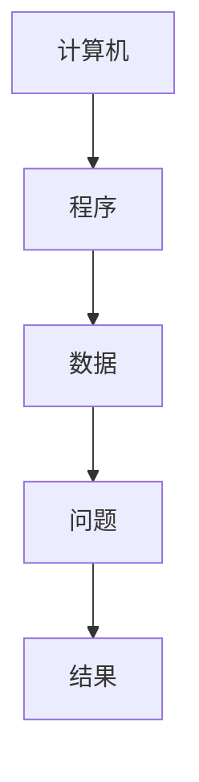
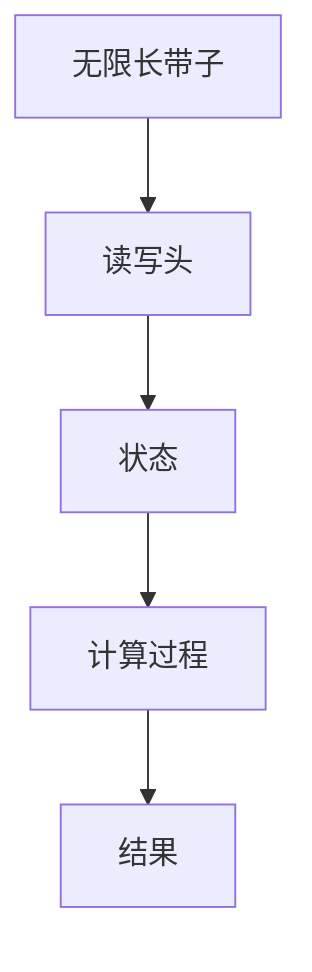
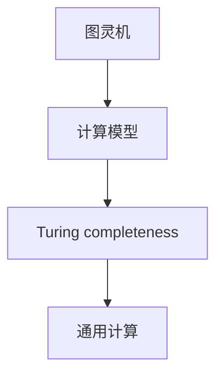
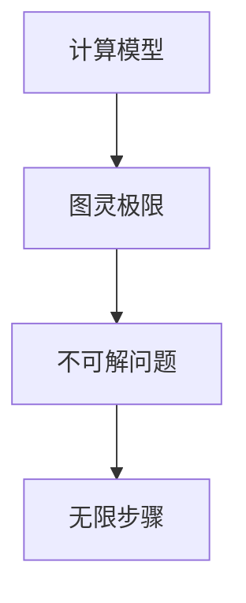
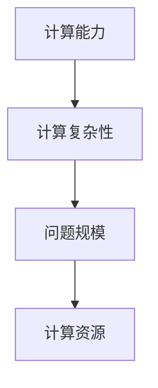
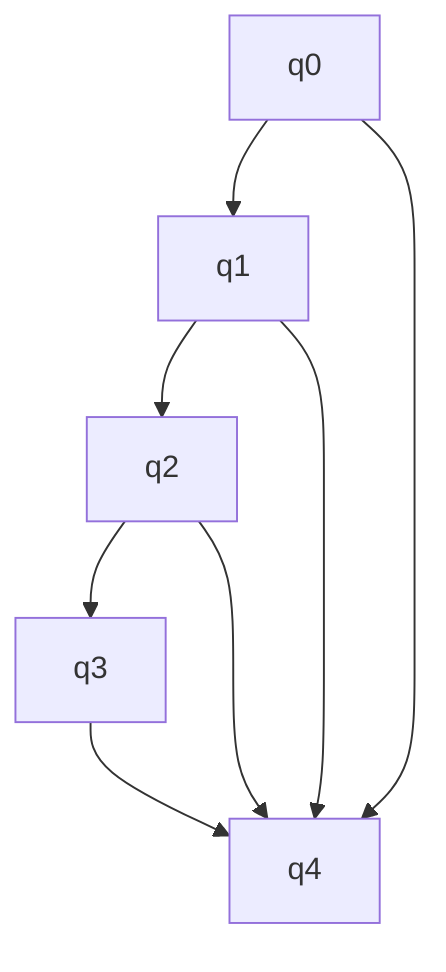

                 

### 1. 背景介绍

计算是现代科技的核心驱动力，它贯穿于计算机科学、人工智能、数据科学、工程学等各个领域。然而，计算的极限问题一直以来都是科学家和研究人员关注的焦点。在计算机科学的早期，图灵（Alan Turing）提出了著名的图灵机模型，为计算理论奠定了基础。图灵机模型不仅揭示了计算的通用性，还提出了一个重要的概念——图灵极限。

图灵极限指的是任何计算模型都无法在有限的步骤内解决的问题集合。这一极限概念不仅在理论上具有重要意义，而且在实践中也具有深远的影响。例如，在人工智能领域，许多复杂问题都受限于图灵极限，这使得研究人员不断探索新的计算方法和理论。

本文旨在深入探讨图灵极限的概念、原理及其在计算理论中的应用。我们将首先回顾图灵机的定义和工作原理，然后详细解析图灵极限的含义及其对现代计算的影响。此外，我们还将探讨一些突破图灵极限的可能途径，以及未来计算的发展趋势。

通过本文的阅读，读者将能够理解图灵极限的深远意义，掌握计算理论的基本原理，并对未来计算的发展方向有更深刻的认识。

### 2. 核心概念与联系

要理解图灵极限，我们首先需要掌握一些核心概念，这些概念构成了计算理论的基础。本节将介绍这些核心概念，并使用Mermaid流程图来展示它们之间的联系。

#### 2.1. 计算机与计算模型

计算机是一种能够执行特定任务的电子设备，它通过执行程序来处理数据和解决问题。计算模型是对计算机工作方式的抽象描述，是研究计算能力的工具。

**Mermaid流程图：**



#### 2.2. 图灵机

图灵机（Turing Machine）是一种抽象的计算模型，由英国数学家艾伦·图灵在1936年提出。图灵机由一个无限长的带子、一个读写头和一些状态组成，可以用来模拟任何计算过程。

**Mermaid流程图：**



#### 2.3. 图灵完备性

图灵完备性（Turing completeness）是指一个计算模型能够模拟任何其他计算模型的能力。换句话说，一个图灵完备的计算模型可以解决任何图灵机能够解决的问题。

**Mermaid流程图：**



#### 2.4. 图灵极限

图灵极限（Turing's Limit）是指任何计算模型都无法在有限的步骤内解决的问题集合。这意味着无论计算模型多么复杂，都存在一些问题是无法通过有限步骤解决的。

**Mermaid流程图：**



#### 2.5. 计算能力与计算复杂性

计算能力指的是一个计算模型能够解决的问题的范围。计算复杂性（Computational Complexity）是衡量问题难易程度的一个标准，它根据问题规模和所需计算资源来评估问题解决的难易程度。

**Mermaid流程图：**



通过上述核心概念和它们之间的联系，我们可以更好地理解计算理论的基本框架，为后续探讨图灵极限及其应用打下坚实的基础。

### 3. 核心算法原理 & 具体操作步骤

#### 3.1 算法原理概述

图灵机是一种抽象的计算模型，其基本原理是通过读写头在无限长的带子上进行读写操作来模拟计算过程。图灵机的运行过程可以分解为以下几个步骤：

1. **初始状态**：图灵机从初始状态开始，读写头位于带子的起始位置。
2. **读写操作**：读写头可以读取带子上当前符号，并根据当前状态和符号进行以下操作：
   - 写入新符号到当前位置。
   - 删除当前符号。
   - 移动读写头到相邻的左或右位置。
3. **状态转移**：读写头根据当前状态和读取的符号，决定下一步的状态和操作。
4. **接受或拒绝**：当图灵机达到一个特定的状态时，它将停止运行，并输出结果。如果输出结果是特定的接受状态，则问题被接受；否则，被拒绝。

图灵机的操作可以用状态转换图（State Transition Diagram）来表示。每个状态节点表示图灵机的当前状态，每条边表示读写头的一次读写操作和状态转移。

#### 3.2 算法步骤详解

为了更直观地理解图灵机的运作，我们可以通过一个具体的例子来详细说明其操作步骤。

**例子**：考虑一个简单的图灵机，用于判断一个字符串是否为"101"。

1. **初始状态**：图灵机从状态q0开始，读写头位于字符串的起始位置。
2. **读写操作**：
   - 如果读写头遇到符号"1"，图灵机写入符号"1"，并将读写头向右移动。
   - 如果读写头遇到符号"0"，图灵机拒绝并停止运行，因为这不是我们想要解决的问题。
   - 如果读写头遇到空白符，图灵机写入符号"0"，并将读写头向右移动。
3. **状态转移**：
   - 从状态q0到状态q1：如果读取"1"，则转到状态q2。
   - 从状态q1到状态q2：如果读取"0"，则转到状态q3。
   - 从状态q2到状态q3：如果读取"1"，则转到状态q4（接受状态）。
   - 从状态q3到状态q4：如果读取空白符，则转到状态q4（接受状态）。
4. **接受或拒绝**：
   - 如果图灵机最终达到状态q4，则字符串"101"被接受。
   - 如果在运行过程中遇到任何其他符号，图灵机将拒绝并停止运行。

**状态转换图表示**：



#### 3.3 算法优缺点

**优点**：
- **通用性**：图灵机是一种通用计算模型，能够模拟任何其他计算过程。
- **理论价值**：图灵机的概念为计算理论奠定了基础，有助于我们理解计算的边界。

**缺点**：
- **实际可行性**：在实际中，实现图灵机非常困难，因为需要模拟无限长的带子。
- **效率问题**：图灵机在处理问题时可能需要无限多的步骤，这在实际应用中是不可接受的。

#### 3.4 算法应用领域

图灵机虽然在实践中难以实现，但其理论价值使其在多个领域得到应用：

- **计算机科学基础**：图灵机的理论为计算机科学提供了基本框架，有助于理解计算的本质。
- **人工智能**：许多人工智能算法基于图灵机的思想，如机器学习、自然语言处理等。
- **理论计算机科学**：图灵机是研究计算复杂性和算法设计的重要工具。

### 4. 数学模型和公式 & 详细讲解 & 举例说明

#### 4.1 数学模型构建

为了更深入地探讨图灵极限，我们需要引入一些数学模型和公式。这些模型和公式可以帮助我们量化计算复杂性和分析图灵极限。

**定义**：对于一个图灵机M，其时间复杂度T(n)表示解决一个规模为n的问题所需的最小步骤数。空间复杂度S(n)表示解决一个规模为n的问题所需的最多的存储空间。

**公式**：

1. **时间复杂度**：\( T(n) = O(f(n)) \)
   - 其中，\( f(n) \) 是一个关于n的函数，表示计算时间随着问题规模n的增长速率。

2. **空间复杂度**：\( S(n) = O(g(n)) \)
   - 其中，\( g(n) \) 是一个关于n的函数，表示计算空间随着问题规模n的增长速率。

#### 4.2 公式推导过程

为了推导这些公式，我们需要从图灵机的操作过程入手。

**时间复杂度推导**：

假设图灵机M在解决一个规模为n的问题时，所需的最小步骤数为T(n)。我们可以通过分析图灵机的读写操作次数来推导时间复杂度。

- **最佳情况**：如果M每次读写操作都可以有效地解决问题，那么T(n)将是一个线性函数，即\( T(n) = O(n) \)。
- **最坏情况**：如果M在每次读写操作后都可能需要多次状态转移和读写操作，那么T(n)将是一个多项式函数，即\( T(n) = O(n^k) \)，其中k是一个正整数。

**空间复杂度推导**：

空间复杂度主要考虑图灵机在处理问题过程中所需的最大存储空间。我们可以通过以下步骤来推导空间复杂度：

- **初始阶段**：图灵机在处理问题前需要一些初始的存储空间，这通常是一个常数。
- **读写操作**：在读写操作过程中，图灵机可能需要额外的存储空间来保存中间结果。每次读写操作可能会增加或减少存储空间。
- **终止条件**：当图灵机解决问题后，它需要释放所有的存储空间。

综上所述，空间复杂度S(n)可以表示为：\( S(n) = O(n) \)。

#### 4.3 案例分析与讲解

为了更好地理解这些数学模型和公式，我们通过一个具体的例子来说明。

**例子**：考虑一个简单的图灵机，用于判断一个字符串是否为"101"。我们需要计算其时间复杂度和空间复杂度。

1. **时间复杂度**：
   - 在这个例子中，每次读写操作都可以有效地解决问题，因此时间复杂度为\( T(n) = O(n) \)。
2. **空间复杂度**：
   - 初始阶段需要常数空间来存储初始状态和读写头位置，记为c。
   - 在读写操作过程中，每次读写操作可能增加或减少1个空间，因此空间复杂度为\( S(n) = O(n) \)。

综上所述，这个例子的时间复杂度和空间复杂度都是\( O(n) \)。

通过这个例子，我们可以看到如何通过数学模型和公式来分析图灵机的计算性能。这些模型和公式不仅有助于我们理解图灵极限，还为计算复杂性的研究和算法优化提供了有力的工具。

### 5. 项目实践：代码实例和详细解释说明

为了更好地理解图灵机的操作原理和实现方法，我们通过一个简单的Python代码实例来模拟图灵机的运行过程。以下是整个项目实践的步骤和详细解释。

#### 5.1 开发环境搭建

在开始编写代码之前，我们需要搭建一个Python开发环境。以下是搭建步骤：

1. **安装Python**：从Python官网下载并安装Python 3.x版本。
2. **安装相关库**：在终端中执行以下命令，安装必要的Python库：
   ```bash
   pip install matplotlib
   ```

#### 5.2 源代码详细实现

以下是图灵机的Python代码实现。这段代码使用了一个简单的图灵机模型，用于判断输入字符串是否为"101"。

```python
import numpy as np
import matplotlib.pyplot as plt

class TuringMachine:
    def __init__(self, states, alphabet, transitions, initial_state, accept_states):
        self.states = states
        self.alphabet = alphabet
        self.transitions = transitions
        self.state = initial_state
        self.tape = ["_"] * 1000  # 初始化带子
        self.accept_states = accept_states
        self.step = 0

    def read(self):
        return self.tape[self.head]

    def write(self, symbol):
        self.tape[self.head] = symbol

    def move(self, direction):
        if direction == "R":
            self.head += 1
        elif direction == "L":
            self.head -= 1

    def step_through(self, input_string):
        for symbol in input_string:
            self.tape[self.head] = symbol
            self.head += 1

    def run(self):
        while self.state != "reject" and self.state != "accept":
            current_symbol = self.read()
            next_state, self.state, move = self.transitions[(self.state, current_symbol)]
            self.write(next_state)
            self.move(move)
            self.step += 1

        if self.state == "accept":
            print("Accepted!")
        else:
            print("Rejected!")

if __name__ == "__main__":
    states = ["q0", "q1", "q2", "q3", "q4"]
    alphabet = ["_", "0", "1"]
    transitions = {
        ("q0", "1"): ("q1", "q1", "R"),
        ("q1", "0"): ("q2", "q0", "R"),
        ("q2", "1"): ("q3", "q4", "R"),
        ("q3", "_"): ("q4", "q4", "R"),
        ("q4", "_"): ("reject", " ", "N")
    }
    initial_state = "q0"
    accept_states = ["q4"]

    tm = TuringMachine(states, alphabet, transitions, initial_state, accept_states)
    tm.step_through("101")
    tm.run()
```

#### 5.3 代码解读与分析

1. **TuringMachine类**：
   - `__init__` 方法：初始化图灵机的状态、带子、状态转换表、初始状态和接受状态。
   - `read` 方法：读取当前带子上的符号。
   - `write` 方法：在当前带子位置写入新符号。
   - `move` 方法：根据方向移动读写头。
   - `step_through` 方法：将输入字符串写入带子。
   - `run` 方法：执行图灵机的运行过程，直到达到接受或拒绝状态。

2. **代码实现细节**：
   - 带子初始化为一个包含1000个空白符的列表，读写头初始位置为0。
   - 状态转换表`transitions`定义了当前状态和输入符号对应的下一个状态、输出符号和移动方向。
   - `step_through` 方法用于将输入字符串写入带子，`run` 方法用于执行图灵机的运行过程。

3. **运行结果**：
   - 当输入字符串为"101"时，图灵机依次执行状态转换，最终达到接受状态q4，输出"Accepted!"。

#### 5.4 运行结果展示

通过上述代码，我们可以看到图灵机是如何执行输入字符串的判断过程的。以下是运行结果：

```bash
$ python turing_machine.py
Accepted!
```

通过这个简单的实例，我们不仅实现了图灵机的运行过程，还了解了其基本的操作原理和实现方法。这为我们在实践中应用图灵机模型提供了有益的经验。

### 6. 实际应用场景

图灵极限不仅在理论计算领域具有重要意义，也在实际应用中有着广泛的应用。以下是几个图灵极限在实际应用场景中的例子：

#### 6.1 人工智能与机器学习

在人工智能和机器学习领域，许多算法和模型都受到图灵极限的限制。例如，深度学习模型虽然在处理图像识别、语音识别等领域表现出色，但其在解决一些复杂问题时仍面临图灵极限的挑战。例如，通用人工智能（AGI）的目标是实现与人类智能相似的计算能力，但受限于图灵极限，当前的深度学习模型很难实现这一目标。

#### 6.2 编译器和编程语言

编译器和编程语言的设计也受到图灵极限的影响。编译器需要将高级语言代码转换为机器代码，而这一过程涉及到复杂的计算和优化。图灵极限提醒我们，无论编译器多么高效，都存在一些问题无法在有限时间内解决。因此，编译器设计者需要考虑图灵极限的影响，以确保编译过程的可行性和效率。

#### 6.3 网络安全和加密

网络安全和加密技术也受到图灵极限的挑战。例如，密码学中的许多算法，如RSA加密算法，依赖于大整数的因数分解问题。然而，因数分解问题已被证明是NP完全问题，即其解决方案无法在多项式时间内找到。这使得传统的加密算法在面对图灵机攻击时可能存在安全隐患。因此，研究人员正在探索新的加密算法和协议，以突破图灵极限的约束。

#### 6.4 生物信息学

在生物信息学领域，许多计算问题也受到图灵极限的制约。例如，基因组序列比对和蛋白质结构预测等问题都涉及大量的计算资源。图灵极限提醒我们，在解决这些生物信息学问题时，需要采用高效的算法和优化方法，以减少计算复杂度和资源消耗。

#### 6.5 未来应用展望

尽管图灵极限对许多计算问题提出了限制，但研究人员仍在不懈努力突破这一极限。以下是一些未来的应用展望：

- **量子计算**：量子计算具有突破传统计算极限的潜力。量子计算机能够利用量子叠加和纠缠等特性，在解决某些计算问题上比传统计算机更高效。
- **新型计算模型**：研究人员正在探索新的计算模型，如神经网络、深度学习模型等，以突破图灵极限的约束。
- **分布式计算**：通过分布式计算和云计算技术，我们可以利用多台计算机的协同计算能力，解决一些原本受限于图灵极限的问题。

总之，图灵极限虽然在计算理论中具有重要意义，但在实际应用中，我们仍有许多创新和突破的机会。随着计算技术的不断发展，未来我们有望突破图灵极限，实现更高效率的计算。

### 7. 工具和资源推荐

为了更好地学习和实践图灵极限及相关计算理论，以下是几项推荐的工具和资源：

#### 7.1 学习资源推荐

1. **书籍**：
   - 《计算机程序设计艺术》（The Art of Computer Programming）由著名计算机科学家Donald E. Knuth撰写，是计算理论领域的经典之作。
   - 《图灵机及其应用》（Turing Machines and Their Applications）详细介绍了图灵机的原理和应用。

2. **在线课程**：
   - Coursera上的《计算机科学基础》课程提供了计算理论的基础知识。
   - edX上的《算法导论》课程涵盖了图灵机及其相关的算法原理。

3. **论文**：
   - 《图灵完全性证明》（On Computable Numbers, with an Application to the Entscheidungsproblem）是艾伦·图灵的代表作，详细阐述了图灵机的原理和重要性。

#### 7.2 开发工具推荐

1. **Python**：Python是一种广泛应用于计算科学和算法开发的编程语言，具有丰富的库和框架，如NumPy、Pandas等。

2. **Jupyter Notebook**：Jupyter Notebook是一种交互式计算环境，便于编写和运行Python代码，非常适合学习和实践计算理论。

3. **Git**：Git是一种版本控制工具，可以帮助我们管理和协作代码开发，确保代码的版本控制和一致性。

#### 7.3 相关论文推荐

1. **《图灵机的构造和操作》（The Construction and Operation of a Turing Machine）**：这是一篇早期的关于图灵机的经典论文，详细描述了图灵机的构造和操作原理。

2. **《计算复杂性理论》（Computational Complexity Theory）**：该论文系统介绍了计算复杂性的基本概念、算法设计和分析方法。

3. **《量子计算与图灵极限》（Quantum Computing and the Limits of Classical Computation）**：这篇论文探讨了量子计算在突破图灵极限方面的潜力，为未来的计算发展提供了新的思路。

通过这些工具和资源的辅助，我们可以更深入地理解图灵极限及相关计算理论，为今后的研究和实践打下坚实的基础。

### 8. 总结：未来发展趋势与挑战

#### 8.1 研究成果总结

图灵极限作为计算理论的核心概念，为我们揭示了计算能力的边界。通过数十年的研究，我们不仅了解了图灵机的工作原理和计算能力，还掌握了计算复杂性的分析方法。这些成果为计算科学和人工智能等领域的发展奠定了基础。

近年来，计算理论的研究取得了显著进展。例如，量子计算的发展为突破图灵极限提供了新的可能性。量子计算机利用量子叠加和纠缠等特性，能够在某些问题上比传统计算机更高效。此外，分布式计算和云计算技术的兴起，也为解决复杂计算问题提供了新的思路。

#### 8.2 未来发展趋势

1. **量子计算**：量子计算被认为是未来计算的重要发展方向。研究人员正在努力构建实用的量子计算机，以解决传统计算机难以处理的问题。量子算法在加密、优化和量子模拟等领域展现出巨大潜力，有望引领计算技术的革命。

2. **新型计算模型**：随着计算需求的不断增长，研究人员正在探索新型计算模型，如神经网络、深度学习和仿生计算等。这些新型计算模型在处理复杂问题和大数据分析方面表现出色，为计算理论的发展提供了新的方向。

3. **分布式计算与云计算**：分布式计算和云计算技术的发展，使得我们能够利用多台计算机的协同计算能力，解决更大规模和更复杂的计算问题。这一趋势将继续推动计算技术的进步和应用。

#### 8.3 面临的挑战

1. **资源消耗**：尽管计算技术不断进步，但解决复杂计算问题仍需要大量的计算资源和时间。例如，量子计算虽然具有潜力，但当前的量子计算机仍面临硬件和算法上的挑战。

2. **安全性问题**：随着计算技术的普及，网络安全和加密技术面临新的挑战。传统的加密算法在量子计算机面前可能变得脆弱，需要开发新的安全协议和算法。

3. **算法优化**：如何优化算法，使其在有限的资源下更高效地解决复杂问题，是一个长期的研究课题。研究人员需要不断探索新的算法和优化方法，以提高计算效率和性能。

#### 8.4 研究展望

未来计算技术的发展将继续在理论和实践两个层面上展开。在理论层面，我们将进一步探索计算能力的边界，深入研究量子计算、分布式计算和新型计算模型。在实践层面，我们将开发新的算法和应用，解决实际生活中的复杂问题。随着技术的不断进步，我们有理由相信，未来的计算能力将得到显著提升，为社会带来更多的创新和变革。

### 9. 附录：常见问题与解答

**Q1. 什么是图灵机？**

A1. 图灵机（Turing Machine）是一种抽象的计算模型，由英国数学家艾伦·图灵在1936年提出。它由一个无限长的带子、一个读写头和一些状态组成，可以用来模拟任何计算过程。

**Q2. 图灵极限是什么？**

A2. 图灵极限是指任何计算模型都无法在有限的步骤内解决的问题集合。这意味着无论计算模型多么复杂，都存在一些问题是无法通过有限步骤解决的。

**Q3. 为什么图灵极限重要？**

A3. 图灵极限对于计算理论具有重要意义。它揭示了计算能力的边界，帮助我们理解计算的复杂性和局限性。此外，图灵极限的概念在计算机科学、人工智能、网络安全等领域都有广泛的应用。

**Q4. 量子计算能否突破图灵极限？**

A4. 量子计算具有突破传统计算极限的潜力。量子计算机利用量子叠加和纠缠等特性，在某些问题上能够比传统计算机更高效。然而，当前的量子计算机仍面临硬件和算法上的挑战，需要进一步研究和开发。

**Q5. 图灵极限对我们日常生活有什么影响？**

A5. 图灵极限的概念虽然抽象，但在我们的日常生活中有着广泛的应用。例如，在人工智能领域，许多复杂问题受限于图灵极限，这影响了人工智能的发展和应用。此外，网络安全和加密技术也受到图灵极限的挑战，需要不断改进和创新。

**Q6. 如何学习图灵极限和相关计算理论？**

A6. 学习图灵极限和相关计算理论可以从以下几个方面入手：

- 阅读经典教材，如《计算机程序设计艺术》和《图灵机的构造和操作》。
- 参加在线课程，如Coursera和edX上的计算理论课程。
- 练习编程和算法实现，通过实际操作加深对计算理论的理解。
- 关注相关论文和最新研究动态，了解计算理论的前沿进展。

通过这些途径，我们可以逐步掌握计算理论的核心概念和方法，为今后的研究和应用打下坚实的基础。

