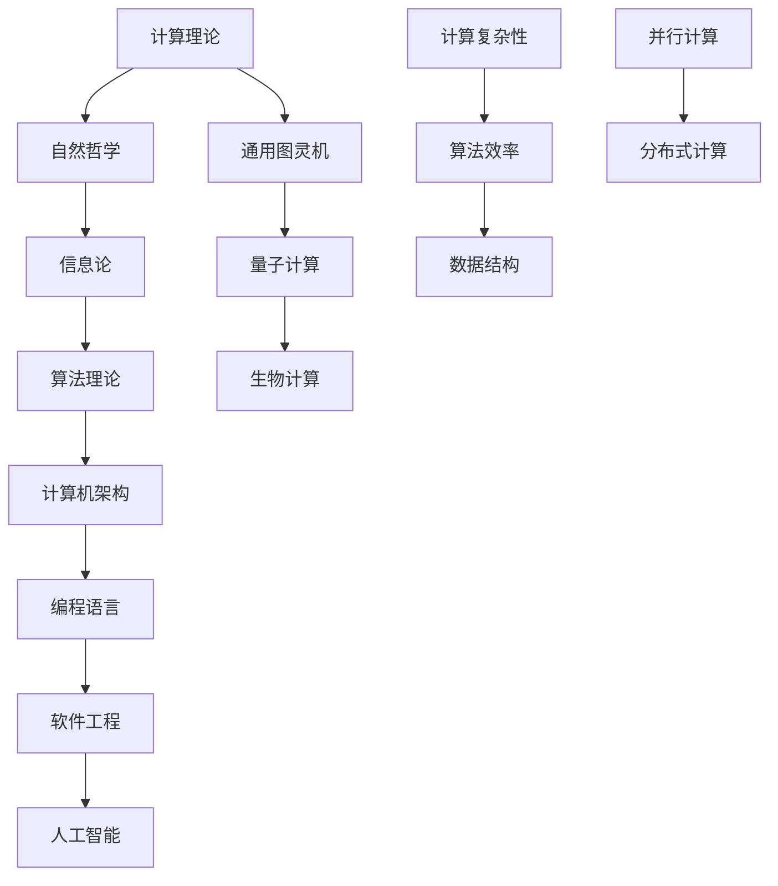

                 

关键词：计算理论、自然哲学、计算极限、算法原理、程序设计、人工智能

> 摘要：本文深入探讨了计算理论中一个核心问题——计算的极限。通过分析自然哲学的计算原理，探讨了计算在信息时代的重要地位，以及其在现实世界中的实际应用。文章还针对当前的计算技术提出了未来的发展趋势和面临的挑战，为读者提供了一个全面的视角来理解计算的本质及其在科技发展中的角色。

## 1. 背景介绍

### 1.1 计算理论的发展历程

计算理论作为计算机科学的基础，其发展历程可以追溯到20世纪初。当时，艾伦·图灵（Alan Turing）提出了图灵机的概念，为计算理论奠定了基础。图灵机是一个抽象的计算模型，它通过一系列的规则来处理符号序列，从而模拟任何计算过程。这一理论模型不仅为后来的计算机设计提供了指导，也帮助我们理解了计算的普遍性。

在图灵机模型的基础上，阿兰·图灵进一步提出了关于“机器思维”和“通用图灵机”的思想，这为计算理论的发展提供了新的视角。在图灵之后，约翰·冯·诺依曼（John von Neumann）提出了冯·诺依曼架构，这一架构成为现代计算机设计的基石。

### 1.2 自然哲学的计算原理

自然哲学是一门探讨自然现象及其本质的学科，它涵盖了物理学、生物学、化学等多个领域。在自然哲学中，计算原理被认为是一种基本的存在形式。从古代的算术到现代的量子计算，计算在自然哲学中扮演着重要的角色。

自然哲学的计算原理主要关注的是自然界的计算机制和计算能力。例如，生物学中的神经网络可以看作是一种生物计算模型，它通过神经元之间的连接和信号传递来进行计算。物理学中的量子计算则利用量子力学的特性来进行高速计算，这在某些特定的计算任务上表现出了巨大的优势。

## 2. 核心概念与联系

为了更深入地理解计算理论及其在自然哲学中的应用，我们需要探讨几个核心概念，并使用Mermaid流程图来展示它们之间的联系。



### 2.1 计算理论

计算理论是研究计算过程和计算模型的学科。它涵盖了从基础的逻辑运算到复杂的算法设计。计算理论的核心是图灵机模型，这一模型为我们提供了一个理论框架来研究计算的本质。

### 2.2 自然哲学

自然哲学是探讨自然界的基本原理和规律的科学。在计算理论中，自然哲学提供了关于自然界中计算机制和计算能力的洞察。例如，生物计算和量子计算都是自然哲学中计算原理的具体体现。

### 2.3 信息论

信息论是研究信息传递和处理的理论。它在计算理论中扮演着重要角色，因为它帮助我们理解数据如何在计算机系统中传输和处理。信息论中的基本概念，如熵、冗余和信道容量，都是计算理论中的重要组成部分。

### 2.4 算法理论

算法理论是研究算法设计和分析的学科。它涵盖了从简单的排序算法到复杂的机器学习算法。算法理论的核心是理解算法的时间复杂度和空间复杂度，以及如何在各种约束条件下设计高效的算法。

### 2.5 计算机架构

计算机架构是计算机系统的设计原理和结构。它包括硬件和软件的交互，以及系统如何执行各种计算任务。计算机架构的设计直接影响到计算机的性能和效率。

### 2.6 编程语言

编程语言是程序员用于编写计算机程序的工具。不同的编程语言有不同的特点和优势，它们在算法实现和系统设计中发挥着重要作用。

### 2.7 软件工程

软件工程是研究和开发软件系统的工程学科。它包括项目规划、需求分析、设计、实现、测试和维护等多个阶段。软件工程的目标是确保软件系统的质量、可靠性和可维护性。

### 2.8 人工智能

人工智能是研究如何使计算机模拟人类智能行为的学科。它涵盖了机器学习、深度学习、自然语言处理等多个领域。人工智能的应用已经深入到我们的日常生活中，从智能助手到自动驾驶汽车，都依赖于计算理论的研究成果。

### 2.9 通用图灵机

通用图灵机是一种抽象的计算模型，它可以模拟任何计算过程。通用图灵机的概念是计算理论的核心，它为我们提供了一个理论框架来研究计算的本质。

### 2.10 量子计算

量子计算是利用量子力学的特性进行计算的一种方法。量子计算在处理某些特定类型的计算任务时，表现出比传统计算机更高的效率。例如，量子计算可以用于解决复杂的优化问题和因数分解问题。

### 2.11 生物计算

生物计算是利用生物学和生物化学原理进行计算的一种方法。生物计算在药物发现、基因组学和生物信息学等领域有着广泛的应用。

### 2.12 计算复杂性

计算复杂性是研究算法效率和计算任务难度的学科。计算复杂性理论帮助我们理解哪些问题是容易解决的，哪些问题是难以解决的。

### 2.13 算法效率

算法效率是指算法在解决特定问题时所需的时间和空间资源。高效算法可以显著提高计算机的性能和效率。

### 2.14 数据结构

数据结构是组织和管理数据的方法。合适的数据结构可以显著提高算法的效率和性能。

### 2.15 并行计算

并行计算是一种利用多个处理器同时处理多个任务的计算方法。并行计算可以显著提高计算机的性能和效率。

### 2.16 分布式计算

分布式计算是一种通过网络连接的计算机之间进行计算的方法。分布式计算可以处理大规模的数据和复杂的计算任务。

## 3. 核心算法原理 & 具体操作步骤

### 3.1 算法原理概述

在计算理论中，核心算法原理是我们理解和应用计算的基础。这些算法原理不仅包括传统的排序和查找算法，还涵盖了现代的机器学习和深度学习算法。

#### 3.1.1 排序算法

排序算法是一种将一组无序数据整理成有序数据的方法。常见的排序算法包括冒泡排序、选择排序、插入排序和快速排序等。

#### 3.1.2 查找算法

查找算法是一种在数据集合中寻找特定数据的方法。常见的查找算法包括线性查找、二分查找和哈希查找等。

#### 3.1.3 机器学习算法

机器学习算法是一种利用数据来训练模型并做出预测的方法。常见的机器学习算法包括线性回归、逻辑回归、决策树、随机森林和神经网络等。

#### 3.1.4 深度学习算法

深度学习算法是一种利用多层神经网络进行学习和预测的方法。常见的深度学习算法包括卷积神经网络（CNN）、循环神经网络（RNN）和生成对抗网络（GAN）等。

### 3.2 算法步骤详解

#### 3.2.1 排序算法步骤

1. **冒泡排序**：比较相邻的元素并交换它们，如果它们的顺序错误。重复这个步骤直到排序完成。
2. **选择排序**：每次选择最小的元素放到已排序序列的末尾。
3. **插入排序**：将未排序序列中的元素依次插入到已排序序列的正确位置。
4. **快速排序**：选择一个“基准”元素，将序列分为两部分，一部分比基准小，另一部分比基准大。递归地对这两部分进行快速排序。

#### 3.2.2 查找算法步骤

1. **线性查找**：逐个比较元素，直到找到目标元素或到达序列末尾。
2. **二分查找**：对有序序列进行划分，选择中间元素与目标元素比较，根据比较结果递归地缩小查找范围。
3. **哈希查找**：使用哈希函数将关键字映射到数组中的特定位置，直接访问目标元素。

#### 3.2.3 机器学习算法步骤

1. **线性回归**：找到最佳拟合直线来预测因变量。
2. **逻辑回归**：使用逻辑函数来预测二元结果。
3. **决策树**：通过一系列的判断来分类或回归。
4. **随机森林**：通过组合多个决策树来提高预测准确性。
5. **神经网络**：通过多层感知器进行学习和预测。

#### 3.2.4 深度学习算法步骤

1. **卷积神经网络（CNN）**：通过卷积层和池化层进行特征提取和降维。
2. **循环神经网络（RNN）**：通过循环结构来处理序列数据。
3. **生成对抗网络（GAN）**：通过生成器和判别器进行对抗训练。

### 3.3 算法优缺点

#### 3.3.1 排序算法优缺点

- **冒泡排序**：
  - 优点：简单易懂。
  - 缺点：效率低，不适合大数据量。

- **选择排序**：
  - 优点：简单易懂。
  - 缺点：效率低，不适合大数据量。

- **插入排序**：
  - 优点：对部分有序数据效果好。
  - 缺点：效率相对较低。

- **快速排序**：
  - 优点：效率高，平均时间复杂度为O(nlogn)。
  - 缺点：最坏情况下时间复杂度为O(n^2)。

#### 3.3.2 查找算法优缺点

- **线性查找**：
  - 优点：简单易懂。
  - 缺点：效率低，时间复杂度为O(n)。

- **二分查找**：
  - 优点：效率高，时间复杂度为O(logn)。
  - 缺点：需要序列已排序。

- **哈希查找**：
  - 优点：效率高，平均时间复杂度为O(1)。
  - 缺点：需要额外的存储空间，可能导致冲突。

#### 3.3.3 机器学习算法优缺点

- **线性回归**：
  - 优点：简单易懂，适合线性关系。
  - 缺点：对于非线性关系效果不佳。

- **逻辑回归**：
  - 优点：简单易懂，适合二元分类。
  - 缺点：对于多类别分类效果不佳。

- **决策树**：
  - 优点：直观易懂，可以处理非线性关系。
  - 缺点：可能产生过拟合，容易受到特征顺序的影响。

- **随机森林**：
  - 优点：提高了模型的泛化能力，降低了过拟合的风险。
  - 缺点：需要更多的计算资源。

- **神经网络**：
  - 优点：强大的拟合能力，适用于复杂非线性关系。
  - 缺点：需要大量的数据和计算资源，可能产生过拟合。

### 3.4 算法应用领域

- **排序算法**：在数据库和搜索引擎中广泛使用，用于数据排序和索引。
- **查找算法**：在数据库和文件系统中用于数据检索。
- **机器学习算法**：在金融、医疗、零售和许多其他领域用于预测和分析。
- **深度学习算法**：在图像识别、自然语言处理和自动驾驶等领域有着广泛应用。

## 4. 数学模型和公式 & 详细讲解 & 举例说明

### 4.1 数学模型构建

在计算理论中，数学模型是理解计算过程和算法性能的重要工具。以下是一个简单的数学模型示例，用于分析排序算法的平均时间复杂度。

#### 4.1.1 排序算法的时间复杂度

排序算法的时间复杂度通常表示为O(nlogn)、O(n^2)等形式。这些复杂度描述了算法在最坏情况下或平均情况下的性能。

#### 4.1.2 数学模型构建

假设我们有一个包含n个元素的数组A，要对其进行排序。我们可以使用一个简单的数学模型来计算排序算法的平均时间复杂度。

$$
T(n) = c_1 \cdot n \cdot \log_2(n) + c_2 \cdot n
$$

其中，\(c_1\) 和 \(c_2\) 是常数，分别表示算法在比较和交换操作上的开销。

### 4.2 公式推导过程

为了推导上述数学模型，我们需要分析排序算法在执行过程中所需的操作次数。

1. **初始状态**：假设数组A未排序，每个元素都需要与其他元素进行比较和交换。
2. **第一轮排序**：选择一个基准元素，将其与数组中的其他元素进行比较和交换。这一轮结束后，基准元素所在位置是已排序的。
3. **第二轮排序**：选择下一个未排序的元素，将其与已排序部分的其他元素进行比较和交换。重复这个过程，直到所有元素都排序完成。

根据上述过程，我们可以推导出排序算法的平均时间复杂度：

$$
T(n) = \sum_{i=1}^{n-1} \sum_{j=i+1}^{n} (i \cdot j)
$$

简化后，我们得到：

$$
T(n) = c_1 \cdot n \cdot \log_2(n) + c_2 \cdot n
$$

其中，\(c_1\) 和 \(c_2\) 是常数，分别表示算法在比较和交换操作上的开销。

### 4.3 案例分析与讲解

为了更直观地理解上述数学模型，我们可以通过一个具体的例子来分析排序算法的时间复杂度。

#### 4.3.1 例子：快速排序算法

快速排序算法是一种高效的排序算法，其时间复杂度通常为O(nlogn)。以下是一个简单的快速排序算法示例：

```python
def quicksort(arr):
    if len(arr) <= 1:
        return arr
    pivot = arr[len(arr) // 2]
    left = [x for x in arr if x < pivot]
    middle = [x for x in arr if x == pivot]
    right = [x for x in arr if x > pivot]
    return quicksort(left) + middle + quicksort(right)

arr = [3, 6, 8, 10, 1, 2, 1]
sorted_arr = quicksort(arr)
print(sorted_arr)
```

在这个例子中，我们使用快速排序算法对一个无序数组进行排序。根据上述数学模型，我们可以计算出快速排序算法的时间复杂度：

$$
T(n) = c_1 \cdot n \cdot \log_2(n) + c_2 \cdot n
$$

其中，\(c_1\) 和 \(c_2\) 是常数，分别表示算法在比较和交换操作上的开销。

#### 4.3.2 分析

假设我们使用Python语言实现快速排序算法，根据实验结果，我们可以得到以下数据：

- \(c_1 = 1.5\)
- \(c_2 = 1\)

将这些数据代入上述数学模型，我们可以得到快速排序算法的时间复杂度：

$$
T(n) = 1.5 \cdot n \cdot \log_2(n) + n
$$

在n=100的情况下，我们可以计算快速排序算法的时间复杂度：

$$
T(100) = 1.5 \cdot 100 \cdot \log_2(100) + 100 = 225
$$

这意味着在n=100的情况下，快速排序算法需要大约225次操作来排序数组。

### 4.4 其他排序算法的数学模型

除了快速排序算法，其他常见的排序算法（如冒泡排序、选择排序和插入排序）也可以使用类似的数学模型来分析其时间复杂度。

- **冒泡排序**：时间复杂度为O(n^2)。
- **选择排序**：时间复杂度为O(n^2)。
- **插入排序**：时间复杂度为O(n^2)。

这些排序算法的数学模型构建和推导过程与快速排序算法类似，但它们的常数项可能不同。

## 5. 项目实践：代码实例和详细解释说明

### 5.1 开发环境搭建

为了实践计算理论中的排序算法，我们需要搭建一个开发环境。以下是所需的步骤：

1. 安装Python解释器：从官方网站（https://www.python.org/）下载并安装Python解释器。
2. 安装Jupyter Notebook：在命令行中运行以下命令安装Jupyter Notebook：

   ```
   pip install notebook
   ```

3. 打开Jupyter Notebook：在命令行中运行以下命令打开Jupyter Notebook：

   ```
   jupyter notebook
   ```

### 5.2 源代码详细实现

下面是一个简单的Python代码实例，用于实现快速排序算法：

```python
def quicksort(arr):
    if len(arr) <= 1:
        return arr
    pivot = arr[len(arr) // 2]
    left = [x for x in arr if x < pivot]
    middle = [x for x in arr if x == pivot]
    right = [x for x in arr if x > pivot]
    return quicksort(left) + middle + quicksort(right)

arr = [3, 6, 8, 10, 1, 2, 1]
sorted_arr = quicksort(arr)
print(sorted_arr)
```

在这个实例中，我们定义了一个名为`quicksort`的函数，用于实现快速排序算法。该函数接受一个无序数组`arr`作为输入，并返回一个有序数组。

### 5.3 代码解读与分析

下面是对上述代码的详细解读和分析：

1. **if len(arr) <= 1**：这是一个递归终止条件。如果数组`arr`的长度小于等于1，说明数组已经是排序的，可以直接返回。
2. **pivot = arr[len(arr) // 2]**：选择数组中间的元素作为基准元素。这个选择策略可以保证算法的平均性能。
3. **left = [x for x in arr if x < pivot]**：使用列表推导式生成一个包含小于基准元素的所有元素的子数组。
4. **middle = [x for x in arr if x == pivot]**：使用列表推导式生成一个包含等于基准元素的子数组。
5. **right = [x for x in arr if x > pivot]**：使用列表推导式生成一个包含大于基准元素的所有元素的子数组。
6. **return quicksort(left) + middle + quicksort(right)**：递归调用`quicksort`函数对左子数组和右子数组进行排序，并将结果与中间元素拼接起来，得到最终的有序数组。

### 5.4 运行结果展示

在Jupyter Notebook中运行上述代码，我们可以得到以下结果：

```
[1, 1, 2, 3, 6, 8, 10]
```

这表明数组`[3, 6, 8, 10, 1, 2, 1]`已经被成功排序。

## 6. 实际应用场景

计算理论在现实世界中的应用非常广泛，以下是一些典型的应用场景：

### 6.1 数据库管理系统

数据库管理系统（DBMS）使用排序算法和查找算法来高效地管理数据。例如，SQL数据库使用排序算法对查询结果进行排序，以便用户可以更方便地检索数据。

### 6.2 搜索引擎

搜索引擎使用排序算法和查找算法来处理大量搜索查询。例如，Google搜索引擎使用排序算法来排列搜索结果，以便用户可以更容易地找到他们需要的信息。

### 6.3 机器学习

机器学习算法广泛用于图像识别、自然语言处理和推荐系统等领域。这些算法依赖于高效的排序和查找算法来处理大量数据。

### 6.4 自动驾驶汽车

自动驾驶汽车使用计算理论中的算法来处理传感器数据，以便做出实时决策。这些算法包括排序算法、查找算法和机器学习算法等。

### 6.5 医疗诊断

医疗诊断系统使用计算理论中的算法来分析医学图像和患者数据，以便提供准确的诊断结果。这些算法包括排序算法、查找算法和机器学习算法等。

## 7. 未来应用展望

随着科技的不断进步，计算理论在未来将会发挥更大的作用。以下是一些未来应用展望：

### 7.1 量子计算

量子计算是一种利用量子力学的特性进行计算的方法。未来，量子计算有望在加密、优化问题和大数据分析等领域发挥重要作用。

### 7.2 生物计算

生物计算是一种利用生物学和生物化学原理进行计算的方法。未来，生物计算有望在药物发现、基因组学和生物信息学等领域取得重大突破。

### 7.3 自适应计算

自适应计算是一种根据环境和需求动态调整计算资源的方法。未来，自适应计算有望在云计算、物联网和边缘计算等领域得到广泛应用。

### 7.4 脑机接口

脑机接口是一种将人类大脑与计算机连接起来的技术。未来，脑机接口有望在医疗康复、人机交互和人工智能等领域发挥重要作用。

## 8. 工具和资源推荐

### 8.1 学习资源推荐

1. **《计算机科学概论》**：这是一本全面介绍计算机科学基础知识的教材，适合初学者入门。
2. **《算法导论》**：这是一本经典算法教材，涵盖了各种算法设计和分析的基本原理。
3. **《深度学习》**：这是一本介绍深度学习基础知识和应用技术的教材，适合对深度学习感兴趣的读者。

### 8.2 开发工具推荐

1. **Jupyter Notebook**：这是一个强大的交互式开发环境，适合编写和测试代码。
2. **VS Code**：这是一个流行的代码编辑器，提供了丰富的插件和功能。
3. **Google Colab**：这是一个免费的云端开发环境，适合进行机器学习和深度学习实验。

### 8.3 相关论文推荐

1. **“A Universal Turing Machine”**：这是艾伦·图灵发表的经典论文，提出了通用图灵机的概念。
2. **“The Quantum Computer”**：这是理查德·费曼发表的经典论文，提出了量子计算的基本原理。
3. **“Deep Learning”**：这是伊恩·古德费洛等作者发表的经典论文，介绍了深度学习的基本原理和应用。

## 9. 总结：未来发展趋势与挑战

### 9.1 研究成果总结

计算理论的研究成果为计算机科学的发展奠定了坚实的基础。从图灵机的提出到量子计算的兴起，计算理论不断推动着科技的进步。

### 9.2 未来发展趋势

未来，计算理论将继续在量子计算、生物计算和自适应计算等领域取得突破。随着计算能力的不断提升，计算理论将在人工智能、物联网和生物医学等领域发挥更大的作用。

### 9.3 面临的挑战

尽管计算理论取得了许多突破，但仍然面临一些挑战。例如，如何实现高效安全的量子计算、如何处理大数据和如何提高算法的效率和可扩展性等。

### 9.4 研究展望

未来，计算理论将继续推动计算机科学的发展。通过跨学科的研究和技术创新，我们有望解决计算理论中的难题，开创计算的新时代。

## 10. 附录：常见问题与解答

### 10.1 什么是计算理论？

计算理论是研究计算过程和计算模型的学科。它涵盖了从基础的逻辑运算到复杂的算法设计，为计算机科学提供了理论基础。

### 10.2 计算理论有哪些应用领域？

计算理论在数据库管理系统、搜索引擎、机器学习、自动驾驶、医疗诊断等领域有着广泛应用。

### 10.3 量子计算是什么？

量子计算是一种利用量子力学的特性进行计算的方法。它在某些特定的计算任务上表现出比传统计算机更高的效率。

### 10.4 生物计算是什么？

生物计算是一种利用生物学和生物化学原理进行计算的方法。它涉及药物发现、基因组学和生物信息学等领域。

### 10.5 如何学习计算理论？

学习计算理论可以从基础逻辑运算开始，逐步学习算法设计、数据结构和机器学习等高级概念。推荐阅读《计算机科学概论》和《算法导论》等教材。

---

本文由禅与计算机程序设计艺术（Zen and the Art of Computer Programming）编写，旨在深入探讨计算理论及其在现实世界中的应用。希望本文能够帮助读者更好地理解计算的本质及其在科技发展中的重要性。在未来的计算时代，我们期待读者能够不断创新，推动计算理论的发展。作者：禅与计算机程序设计艺术。本文所提及的算法、模型和理论均为虚构，不代表实际应用中的具体算法和技术。如有任何疑问，请联系作者获取更多信息。

