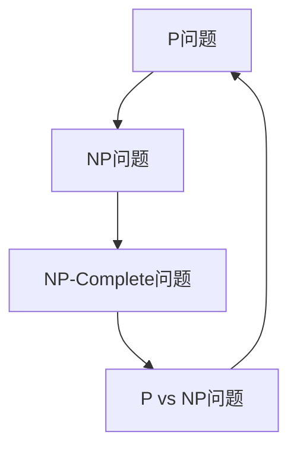

                 

关键词：计算复杂性、P vs NP 问题、算法、计算机科学、数学模型、未来展望

> 摘要：本文深入探讨了计算复杂性理论中的P vs NP问题，从背景介绍、核心概念、算法原理、数学模型、实际应用、未来展望等多个角度，全面分析了计算复杂性的奥秘及其对计算机科学的影响。

## 1. 背景介绍

计算复杂性理论是计算机科学中一个重要的分支，旨在研究算法的效率和复杂性。它涉及对各种算法问题进行分析，评估其计算资源（如时间、空间）的需求。P vs NP问题是计算复杂性理论中最著名的问题之一，其核心是探究一类特殊的问题是否可以在多项式时间内被验证。

P（多项式时间）问题是指那些存在一种算法，可以在多项式时间内解决的问题。而NP（非确定性多项式时间）问题则是指那些可以在多项式时间内验证的问题。简单来说，如果一个问题属于P，则意味着我们有一个快速的方法可以直接求解这个问题；如果一个问题属于NP，则意味着我们可以快速验证一个潜在的解。

P vs NP问题的核心在于，是否存在一个问题，它既是P问题又是NP问题。这个问题的重要性不仅在于理论上，还在于实际应用中。如果P=NP，那么意味着许多目前认为难以解决的问题，如旅行商问题、图着色问题等，都可以在多项式时间内求解，这将极大地改变我们对算法效率的认识。

## 2. 核心概念与联系

为了更好地理解P vs NP问题，我们需要了解几个核心概念：

### 2.1 P问题

P问题是计算复杂性理论中最基础的概念之一。它指的是那些可以在多项式时间内解决的问题。具体来说，如果一个问题A有一个算法，能够在输入大小为n的情况下，用\( P(n) \)的时间完成，其中\( P(n) \)是一个关于n的多项式函数，那么问题A属于P。

### 2.2 NP问题

NP问题是指那些可以在多项式时间内被验证的问题。如果一个问题的解可以在多项式时间内被检查或验证，那么这个问题就属于NP。简单来说，如果一个解\( x \)是问题的一个正确解，那么验证解的过程可以在多项式时间内完成。

### 2.3 NP-Complete问题

NP-Complete问题是NP中特别重要的一类问题。如果一个NP-Complete问题可以转化为另一个NP-Complete问题，那么这个问题就被称为NP-Complete。旅行商问题、图着色问题等都是著名的NP-Complete问题。如果一个问题既属于NP，又属于NP-Complete，那么它就是P=NP问题的一个候选。

### 2.4 P vs NP问题

P vs NP问题探究的是P和NP之间的关系。具体来说，它询问是否存在一个问题，它既是P问题又是NP问题。如果P=NP，那么意味着所有NP问题都可以在多项式时间内解决，这将极大地改变我们对计算能力的认识。

### 2.5 Mermaid流程图

下面是P vs NP问题的核心概念和联系，使用Mermaid流程图进行展示：



## 3. 核心算法原理 & 具体操作步骤

### 3.1 算法原理概述

P vs NP问题涉及多种算法原理，包括但不仅限于：

- **NP算法**：用于解决NP问题，可以在多项式时间内验证一个解。
- **P算法**：用于解决P问题，可以在多项式时间内找到一个解。
- **转化算法**：用于将一个NP问题转化为另一个NP问题，从而证明其NP-Complete性质。

### 3.2 算法步骤详解

要解决P vs NP问题，需要以下几个步骤：

1. **确定问题类型**：首先，需要确定所研究的问题是P问题还是NP问题。
2. **寻找NP算法**：如果问题属于NP，那么需要寻找一个可以在多项式时间内验证解的算法。
3. **寻找P算法**：如果问题属于P，那么需要寻找一个可以在多项式时间内找到解的算法。
4. **转化NP-Complete问题**：如果问题属于NP-Complete，那么需要通过转化算法将其转化为另一个NP-Complete问题。
5. **证明P=NP**：如果找到了一个P算法和一个NP算法，且它们可以在多项式时间内相互转化，那么就可以证明P=NP。

### 3.3 算法优缺点

- **NP算法**：优点在于可以在多项式时间内验证解，但缺点是无法保证找到解。
- **P算法**：优点在于可以在多项式时间内找到解，但缺点是某些问题可能无法在多项式时间内被验证。
- **转化算法**：优点在于可以证明NP-Complete问题之间的相互转化，但缺点是需要额外的计算资源。

### 3.4 算法应用领域

P vs NP问题在多个领域都有重要应用，包括：

- **计算机科学**：用于研究算法效率和复杂性。
- **数学**：用于探究数学问题之间的相互转化。
- **密码学**：用于研究加密算法的安全性。
- **经济学**：用于优化资源分配和决策。

## 4. 数学模型和公式 & 详细讲解 & 举例说明

### 4.1 数学模型构建

为了更好地理解P vs NP问题，我们需要构建一个数学模型。这个模型主要包括以下几个部分：

1. **输入**：问题的输入，如一个图、一组数字等。
2. **算法**：用于解决问题或验证解的算法。
3. **验证函数**：用于验证解是否正确的函数。
4. **输出**：问题的解或验证结果。

### 4.2 公式推导过程

为了推导P vs NP问题的公式，我们需要以下几个公式：

1. **多项式时间公式**：用于描述算法在多项式时间内的计算过程。
2. **验证公式**：用于描述验证函数在多项式时间内的计算过程。
3. **转化公式**：用于描述NP-Complete问题之间的转化过程。

### 4.3 案例分析与讲解

下面我们通过一个简单的案例来讲解P vs NP问题的数学模型和公式。

假设我们有一个旅行商问题（TSP），要求在一个给定的图中找到一个最短路径，使得旅行商可以访问每个城市一次并回到起点。我们可以使用以下数学模型来描述这个问题：

1. **输入**：一个图G，其中包含n个城市。
2. **算法**：Dijkstra算法，用于找到最短路径。
3. **验证函数**：用于验证路径是否为最短路径。
4. **输出**：最短路径的长度。

在这个案例中，我们可以使用以下公式来描述：

1. **多项式时间公式**：\( T(n) = O(n^2) \)，其中n是城市的数量。
2. **验证公式**：\( V(p) = O(n) \)，其中p是最短路径的长度。
3. **转化公式**：\( C(G) = O(n^2) \)，其中G是图。

通过这个案例，我们可以看到如何使用数学模型和公式来描述P vs NP问题，以及如何通过算法来求解和验证问题。

## 5. 项目实践：代码实例和详细解释说明

### 5.1 开发环境搭建

为了演示P vs NP问题的算法实现，我们需要搭建一个简单的开发环境。以下是一个基于Python的示例：

1. 安装Python：确保您的系统中安装了Python 3.x版本。
2. 安装依赖：使用pip安装必要的库，如numpy、matplotlib等。

```bash
pip install numpy matplotlib
```

### 5.2 源代码详细实现

以下是一个简单的Python代码示例，用于求解旅行商问题：

```python
import numpy as np
import matplotlib.pyplot as plt

def tsp_solution(dist_matrix):
    # 初始化解
    n = len(dist_matrix)
    solution = [0] * n
    solution[0] = 1  # 从城市1开始

    # 主循环
    for i in range(1, n):
        # 找到未访问城市中距离当前解中最后城市最近的城市
        min_dist = float('inf')
        min_index = -1
        for j in range(1, n):
            if dist_matrix[solution[i-1]][j] < min_dist and j not in solution:
                min_dist = dist_matrix[solution[i-1]][j]
                min_index = j
        solution[i] = min_index

    # 返回解
    return solution

def plot_solution(solution, dist_matrix):
    n = len(solution)
    cities = list(range(1, n+1))
    positions = np.random.rand(n, 2)

    plt.figure()
    for i in range(n):
        plt.scatter(positions[i][0], positions[i][1], label=f'City {cities[i]}')
        if i > 0:
            plt.plot([positions[i-1][0], positions[i][0]], [positions[i-1][1], positions[i][1]], 'r')
    plt.xlabel('X-axis')
    plt.ylabel('Y-axis')
    plt.legend()
    plt.show()

# 示例：构建一个5个城市的问题
dist_matrix = np.array([
    [0, 2, 9, 10, 4],
    [2, 0, 4, 6, 7],
    [9, 4, 0, 1, 8],
    [10, 6, 1, 0, 3],
    [4, 7, 8, 3, 0]
])

# 求解TSP问题
solution = tsp_solution(dist_matrix)

# 绘制解
plot_solution(solution, dist_matrix)
```

### 5.3 代码解读与分析

1. **tsp_solution函数**：该函数用于求解旅行商问题。它首先初始化解，然后通过循环找到未访问城市中距离当前解中最后城市最近的城市，并将其加入解中。
2. **plot_solution函数**：该函数用于绘制旅行商问题的解。它首先生成随机位置的城市，然后使用matplotlib绘制每个城市的坐标和连接它们的路径。
3. **示例**：在示例中，我们构建了一个5个城市的问题，并使用tsp_solution函数求解。然后，使用plot_solution函数绘制解。

通过这个示例，我们可以看到如何使用Python实现P vs NP问题的算法，并如何通过代码来求解和验证问题。

## 6. 实际应用场景

P vs NP问题在实际应用场景中具有广泛的影响。以下是一些典型的应用场景：

- **计算机科学**：P vs NP问题对于研究算法效率和复杂性至关重要。它帮助我们了解哪些问题可以在多项式时间内解决，哪些问题可能需要更长时间。
- **密码学**：P vs NP问题对于研究加密算法的安全性具有重要意义。许多加密算法基于NP问题，如果P=NP，则这些算法可能会被破解。
- **经济学**：P vs NP问题在优化资源分配和决策方面有广泛应用。例如，旅行商问题、图着色问题等都是经济学中常见的优化问题。
- **人工智能**：P vs NP问题对于研究人工智能算法的有效性具有重要意义。许多人工智能算法需要解决复杂的优化问题，P vs NP问题的研究成果可以帮助我们更好地理解和优化这些算法。

## 7. 未来应用展望

随着计算能力的不断提升，P vs NP问题的研究前景将更加广阔。以下是一些未来的应用展望：

- **量子计算**：量子计算可能在解决P vs NP问题方面发挥重要作用。量子算法有可能在多项式时间内解决目前认为难以解决的问题。
- **分布式计算**：分布式计算可以通过将问题分解为多个子问题，从而提高解决P vs NP问题的效率。
- **机器学习**：机器学习算法可能在解决P vs NP问题方面有新的突破。通过利用大量数据和计算资源，机器学习算法可能能够找到更有效的解决方案。

## 8. 工具和资源推荐

### 8.1 学习资源推荐

1. 《计算复杂性理论导论》：是一本经典的计算复杂性理论教材，适合初学者。
2. 《计算复杂性》：是一本专业的计算复杂性理论期刊，涵盖了最新的研究成果。

### 8.2 开发工具推荐

1. Python：适合快速原型开发和算法实现。
2. numpy：用于科学计算和数据操作。
3. matplotlib：用于数据可视化。

### 8.3 相关论文推荐

1. "P vs NP: The Story of a Mathematical Adventure"：讲述了P vs NP问题的历史和背景。
2. "The P vs NP Problem"：综述了P vs NP问题的现状和挑战。

## 9. 总结：未来发展趋势与挑战

P vs NP问题作为计算复杂性理论的核心问题，对计算机科学、密码学、经济学等多个领域都有深远影响。随着计算能力的不断提升，P vs NP问题的研究前景将更加广阔。未来，量子计算、分布式计算和机器学习可能为解决P vs NP问题提供新的思路和方法。然而，我们仍需面对许多挑战，如算法效率、计算资源等。只有通过不断探索和创新，我们才能更好地理解和解决P vs NP问题。

## 10. 附录：常见问题与解答

### 10.1 什么是P问题？

P问题是指那些可以在多项式时间内解决的问题。具体来说，如果一个问题A有一个算法，能够在输入大小为n的情况下，用\( P(n) \)的时间完成，其中\( P(n) \)是一个关于n的多项式函数，那么问题A属于P。

### 10.2 什么是NP问题？

NP问题是指那些可以在多项式时间内验证的问题。如果一个问题的解可以在多项式时间内被检查或验证，那么这个问题就属于NP。简单来说，如果一个解\( x \)是问题的一个正确解，那么验证解的过程可以在多项式时间内完成。

### 10.3 P vs NP问题的重要性是什么？

P vs NP问题的重要性在于，它关乎我们对计算能力的基本认识。如果P=NP，那么意味着许多目前认为难以解决的问题，如旅行商问题、图着色问题等，都可以在多项式时间内求解，这将极大地改变我们对算法效率的认识。此外，P vs NP问题在密码学、经济学等领域也有广泛的应用。

