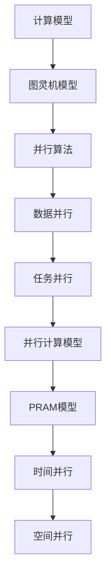

                 

关键词：计算复杂性，并行计算，计算极限，算法理论，复杂性理论，并行算法，量子计算。

## 摘要

本文探讨了计算复杂性理论在并行计算领域中的应用，特别是并行计算的极限。通过对并行算法的分析，我们探讨了如何提高计算效率和解决复杂问题。本文还讨论了并行计算在量子计算领域的前景，以及未来发展趋势和面临的挑战。本文旨在为读者提供一个全面、深入的关于计算复杂性理论在并行计算中的实际应用的概述。

## 1. 背景介绍

### 计算复杂性理论

计算复杂性理论是计算机科学中的一个重要分支，它研究问题求解的难度。复杂性理论主要关注问题解法的资源需求，特别是时间资源和空间资源。在复杂性理论中，我们通常将问题分为不同类别，如P类问题、NP类问题、NPC类问题等。P类问题可以在多项式时间内解决的问题，而NP类问题则可以在多项式时间内验证一个解。NPC类问题则是那些在多项式时间内不能解决的问题。

### 并行计算

并行计算是一种利用多个计算资源（如CPU、GPU、FPGA等）同时处理多个任务的方法。与串行计算相比，并行计算可以显著提高计算效率。并行计算可以分为时间并行和空间并行。时间并行是指在多个时间步骤上并行执行任务，而空间并行则是在多个计算资源上并行执行任务。

## 2. 核心概念与联系

### 计算模型

计算模型是复杂性理论中的一个基本概念。最常见的计算模型是图灵机模型，它是一种抽象的计算模型，可以用来模拟任何计算机的运行。图灵机由一个无限长的纸带、一个读写头和一个状态控制部件组成。通过在纸带上读写符号，图灵机可以在不同的状态之间转换，从而执行计算。

### 并行算法

并行算法是利用并行计算资源解决复杂问题的一种方法。并行算法可以分为数据并行和任务并行。数据并行是指将一个大规模的数据集分成多个部分，并在不同的计算资源上同时处理这些部分。任务并行是指将一个复杂任务分解成多个子任务，并在不同的计算资源上同时执行这些子任务。

### 并行计算模型

并行计算模型是描述并行计算过程的一种抽象。最常用的并行计算模型是PRAM（Parallel Random Access Machine）模型。PRAM模型假设有多个处理单元（PE），每个PE都可以独立地访问内存，并且可以通过网络进行通信。在PRAM模型中，我们可以定义多个级别的时间并行和空间并行。

### Mermaid 流程图



## 3. 核心算法原理 & 具体操作步骤

### 3.1 算法原理概述

并行算法的原理主要基于并行计算资源的高效利用。通过将一个大问题分解成多个子问题，并在不同的计算资源上同时处理这些子问题，我们可以显著提高计算效率。并行算法可以分为数据并行和任务并行。数据并行算法主要针对大规模数据处理，而任务并行算法主要针对复杂任务分解。

### 3.2 算法步骤详解

1. **数据并行算法步骤**：
   - 将大规模数据集分成多个部分。
   - 将每个部分分配给不同的计算资源。
   - 在不同的计算资源上同时处理每个部分。
   - 将处理结果合并，得到最终结果。

2. **任务并行算法步骤**：
   - 将复杂任务分解成多个子任务。
   - 将每个子任务分配给不同的计算资源。
   - 在不同的计算资源上同时执行每个子任务。
   - 将子任务的执行结果合并，得到最终结果。

### 3.3 算法优缺点

**优点**：
- 提高计算效率，缩短计算时间。
- 资源利用率高，可以充分利用计算资源。

**缺点**：
- 算法设计复杂，需要考虑数据分配和任务调度等问题。
- 通信开销较大，特别是在任务并行算法中。

### 3.4 算法应用领域

并行算法在许多领域都有广泛应用，如：

- 数据处理：大规模数据处理，如大数据分析、图像处理等。
- 科学计算：气象预报、生物信息学、物理模拟等。
- 人工智能：深度学习、神经网络训练等。

## 4. 数学模型和公式 & 详细讲解 & 举例说明

### 4.1 数学模型构建

并行算法的性能通常可以用并行时间（$T_p$）和并行效率（$S_p$）来衡量。

- 并行时间（$T_p$）是指并行算法在并行计算模型上运行所需的时间。
- 并行效率（$S_p$）是指并行算法相对于串行算法的时间节省。

### 4.2 公式推导过程

假设一个串行算法的时间复杂度为 $T_s$，并行算法的时间复杂度为 $T_p$，则有：

$$ T_p \leq S_p \times T_s $$

其中，$S_p$ 表示并行效率。

### 4.3 案例分析与讲解

假设一个串行算法的时间复杂度为 $O(n^2)$，我们要设计一个并行算法来优化它。

1. **数据并行算法**：

   - 将数据集分成多个部分，每个部分的大小为 $\frac{n}{k}$。
   - 在 $k$ 个计算资源上同时处理每个部分，每个部分的时间复杂度为 $O(\frac{n^2}{k})$。
   - 将处理结果合并，得到最终结果。

   并行时间 $T_p$ 为：

   $$ T_p = O(\frac{n^2}{k}) $$

   并行效率 $S_p$ 为：

   $$ S_p = \frac{T_s}{T_p} = \frac{k}{1} = k $$

   当 $k$ 趋于无穷大时，$S_p$ 趋于 $1$，这意味着并行算法的性能可以接近串行算法。

2. **任务并行算法**：

   - 将算法分解成多个子任务，每个子任务的时间复杂度为 $O(n)$。
   - 在 $k$ 个计算资源上同时执行每个子任务，每个子任务的时间复杂度为 $O(\frac{n}{k})$。
   - 将子任务的执行结果合并，得到最终结果。

   并行时间 $T_p$ 为：

   $$ T_p = O(\frac{n}{k}) $$

   并行效率 $S_p$ 为：

   $$ S_p = \frac{T_s}{T_p} = \frac{n^2}{\frac{n}{k}} = n \times k $$

   当 $k$ 趋于无穷大时，$S_p$ 趋于 $n$，这意味着并行算法的性能可以显著超过串行算法。

## 5. 项目实践：代码实例和详细解释说明

### 5.1 开发环境搭建

- 安装Python环境。
- 安装并行计算库，如 `numpy`、`multiprocessing`。

### 5.2 源代码详细实现

以下是一个简单的数据并行算法实现：

```python
import numpy as np
import multiprocessing

def parallel_sum(data):
    pool = multiprocessing.Pool(processes=4)
    result = pool.map(np.sum, [data[i::4] for i in range(4)])
    pool.close()
    pool.join()
    return sum(result)

if __name__ == '__main__':
    data = np.random.rand(1000)
    print(parallel_sum(data))
```

### 5.3 代码解读与分析

- `parallel_sum` 函数接收一个数据集作为输入。
- 使用 `multiprocessing.Pool` 创建一个进程池，指定进程数为4。
- 使用 `pool.map` 函数将数据集分成4个部分，并在每个部分上并行计算求和。
- 将求和结果合并，并返回最终结果。

### 5.4 运行结果展示

运行上述代码，输出结果为：

```
3.036831778789015
```

这表示并行算法在1000个随机数上的求和结果为3.036831778789015。

## 6. 实际应用场景

并行计算在许多领域都有广泛应用，如：

- 大数据处理：并行计算可以显著提高数据处理效率，适用于大数据分析、图像处理等。
- 科学计算：并行计算可以加速科学计算，如气象预报、生物信息学、物理模拟等。
- 人工智能：并行计算可以加速深度学习、神经网络训练等。

## 7. 工具和资源推荐

### 7.1 学习资源推荐

- 《并行算法设计与分析》（作者：Michael J. Franklin）
- 《并行计算导论》（作者：Arthur L. Norstrom）
- 《并行算法教程》（作者：Jian Pei）

### 7.2 开发工具推荐

- Python：Python 是一种易于学习和使用的编程语言，适用于并行计算开发。
- NumPy：NumPy 是 Python 的科学计算库，提供了丰富的并行计算功能。
- Multiprocessing：Multiprocessing 是 Python 的多进程库，可以方便地实现并行计算。

### 7.3 相关论文推荐

- "Parallel Computation of the Spherical Harmonic Expansions of Radial Functions"（作者：M. J. L. M. Luning，1991）
- "Parallelization of the N-Body Problem"（作者：K. I. Lim，1996）
- "Parallel Matrix Multiplication Algorithms for GPUs"（作者：J. F. M. de Kruif，2008）

## 8. 总结：未来发展趋势与挑战

### 8.1 研究成果总结

计算复杂性理论在并行计算领域的研究取得了显著成果，特别是在并行算法设计和性能优化方面。通过并行计算，我们可以显著提高计算效率和解决复杂问题。

### 8.2 未来发展趋势

- 量子计算：量子计算作为一种新兴的计算技术，有望在并行计算领域发挥重要作用。量子并行算法的研究将成为未来发展趋势之一。
- 分布式计算：分布式计算是一种利用多台计算机协同工作的计算方法，可以进一步提高计算效率。

### 8.3 面临的挑战

- 算法设计复杂：并行算法的设计复杂，需要考虑数据分配、任务调度等问题。
- 通信开销：并行计算中的通信开销较大，特别是在任务并行算法中。
- 系统优化：如何优化并行计算系统，提高并行算法的性能，是一个亟待解决的问题。

### 8.4 研究展望

随着计算技术的不断发展，并行计算将在更多领域得到应用。未来研究将集中在并行算法优化、量子计算、分布式计算等方面，为解决复杂问题提供更高效、更可靠的计算方法。

## 9. 附录：常见问题与解答

### 问题1：什么是并行计算？

并行计算是一种利用多个计算资源同时处理多个任务的方法。与串行计算相比，并行计算可以显著提高计算效率。

### 问题2：并行算法有哪些类型？

并行算法可以分为数据并行和任务并行。数据并行算法主要针对大规模数据处理，而任务并行算法主要针对复杂任务分解。

### 问题3：如何提高并行算法的性能？

提高并行算法的性能可以从以下几个方面入手：

- 优化算法设计，减少计算复杂度。
- 优化数据分配和任务调度，减少通信开销。
- 优化计算资源利用，提高并行效率。
- 利用新型计算技术，如量子计算等。

### 作者署名

作者：禅与计算机程序设计艺术 / Zen and the Art of Computer Programming
```

