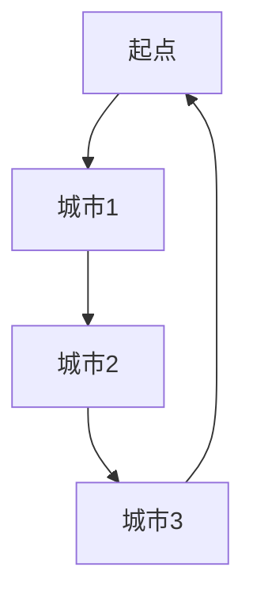

                 

关键词：计算复杂性，旅行商问题，优化算法，算法分析，计算极限。

## 摘要

本文主要探讨了计算复杂性理论中的一个经典问题——旅行商问题（TSP），以及该问题在计算极限领域的挑战。通过介绍旅行商问题的基本概念、核心算法原理，以及数学模型和公式，本文分析了TSP问题的复杂性，并探讨了其在实际应用中的影响和未来发展趋势。文章结构包括背景介绍、核心概念与联系、核心算法原理与操作步骤、数学模型与公式、项目实践、实际应用场景、工具和资源推荐、以及总结与展望等部分。

## 1. 背景介绍

旅行商问题（TSP，Traveling Salesman Problem）是计算复杂性理论中一个经典的问题，其描述如下：给定一个带有正整数权重的完全无向图，要求找到一条哈密尔顿回路，使得回路上所有边的权重之和最小。这个问题可以简单理解为，一个旅行商希望从一个固定城市出发，访问其他若干个城市，最后返回出发城市，以使得总路程最短。

TSP问题源于19世纪末期，当时被用于优化旅行商的行程安排。随着计算机科学的不断发展，TSP问题成为了计算复杂性理论中的一个重要问题，其在组合优化、网络设计、生产调度等多个领域具有广泛的应用。尽管TSP问题在理论上已被证明为NP难问题，但在实际应用中，仍有许多优化算法和近似算法被提出来解决该问题。

## 2. 核心概念与联系

为了深入理解旅行商问题，我们需要首先了解一些核心概念。

### 2.1 哈密尔顿回路

哈密尔顿回路是指在一个图中，访问每个顶点恰好一次并回到起始顶点的回路。在旅行商问题中，旅行商需要找到一条哈密尔顿回路，使得回路上所有边的权重之和最小。

### 2.2 完全无向图

完全无向图是指图中任意两个顶点之间都存在一条边。在旅行商问题中，我们通常考虑完全无向图。

### 2.3 权重

权重是图中每条边的数值，表示从一个顶点到另一个顶点的距离或成本。在旅行商问题中，我们需要最小化所有边的权重之和。

### 2.4 NP难问题

NP难问题是指一类问题，其解可以在多项式时间内验证，但求解本身可能需要指数级别的时间。旅行商问题已被证明为NP难问题，这意味着不存在一个有效的算法可以求解所有实例。

下面是一个简单的旅行商问题的Mermaid流程图：



在这个流程图中，起点是A，城市1是B，城市2是C，城市3是D。旅行商需要从A出发，访问B、C、D，最后回到A。

## 3. 核心算法原理 & 具体操作步骤

### 3.1 算法原理概述

为了求解旅行商问题，我们可以使用多种算法，如贪心算法、动态规划算法、遗传算法等。这里我们简要介绍贪心算法和动态规划算法的基本原理。

#### 贪心算法

贪心算法是一种局部最优策略，通过每次选择当前最优解来逼近全局最优解。对于旅行商问题，贪心算法的基本思想是，每次选择当前未访问城市中与已访问城市距离最短的城市作为下一个访问城市。

#### 动态规划算法

动态规划算法是一种递归算法，通过将问题分解为更小的子问题，并存储子问题的解来避免重复计算。对于旅行商问题，动态规划算法的基本思想是，使用一个二维数组`dp[i][j]`来表示访问前`i`个城市并访问第`i`个城市后回到起点的哈密尔顿回路的权重。

### 3.2 算法步骤详解

#### 贪心算法步骤：

1. 将城市按距离从近到远排序。
2. 从起点开始，依次访问排序后的城市，直到所有城市都被访问。
3. 访问每个城市时，计算与已访问城市的权重之和，并更新全局最优解。

#### 动态规划算法步骤：

1. 初始化二维数组`dp`，其中`dp[i][j] = infinity`表示初始时未访问状态。
2. 遍历所有城市`i`和`j`，计算`dp[i][j]`的值。
3. 使用`dp`数组构建哈密尔顿回路。

### 3.3 算法优缺点

#### 贪心算法优缺点：

- 优点：简单易实现，计算速度快。
- 缺点：只能找到近似解，可能无法找到全局最优解。

#### 动态规划算法优缺点：

- 优点：能够找到全局最优解。
- 缺点：计算复杂度较高，适用于小规模问题。

### 3.4 算法应用领域

贪心算法和动态规划算法在组合优化、网络设计、生产调度等领域有广泛的应用。例如，在组合优化中，我们可以使用贪心算法来求解背包问题；在动态规划中，我们可以使用动态规划算法来求解最长公共子序列问题。

## 4. 数学模型和公式

旅行商问题的数学模型主要涉及图论中的基本概念，如顶点、边、权重等。以下是一个简化的数学模型和公式。

### 4.1 数学模型构建

给定一个有`n`个顶点的完全无向图`G = (V, E)`，其中`V`表示顶点集合，`E`表示边集合，权重函数`w: E -> R^+`表示边的权重。我们需要求解一条哈密尔顿回路`P`，使得`P`上所有边的权重之和最小。

### 4.2 公式推导过程

我们可以使用动态规划算法来求解旅行商问题。以下是动态规划算法的公式推导过程。

假设`dp[i][j]`表示访问前`i`个城市并访问第`i`个城市后回到起点的哈密尔顿回路的权重。

对于任意`i`和`j`，我们有：

$$
dp[i][j] = 
\begin{cases} 
0, & \text{if } i = j \\
\infty, & \text{otherwise} \\
\min_{k \in V, k \neq i} (dp[i-1][k] + w(i, k)), & \text{if } j = i \\
\min_{k \in V, k \neq j} (dp[i][k] + w(i, j)), & \text{if } j \neq i \\
\end{cases}
$$

### 4.3 案例分析与讲解

假设我们有以下一个简单的旅行商问题实例：


权重矩阵如下：

$$
\begin{matrix}
A & B & C & D \\
A & 0 & 5 & 3 \\
B & 5 & 0 & 2 \\
C & 3 & 2 & 0 \\
D & 3 & 2 & 5 \\
\end{matrix}
$$

我们可以使用动态规划算法来求解该实例。以下是动态规划算法的计算过程：

1. 初始化二维数组`dp`：
$$
\begin{matrix}
0 & 5 & 3 \\
5 & \infty & 2 \\
3 & 2 & \infty \\
\end{matrix}
$$

2. 计算dp[i][j]的值：
   - 对于`i = 0`，`j = 1`，我们有`dp[0][1] = min(dp[0][0], dp[0][2]) + w(0, 1) = min(0, 3) + 5 = 5`。
   - 对于`i = 1`，`j = 0`，我们有`dp[1][0] = min(dp[1][1], dp[1][2]) + w(1, 0) = min(2, \infty) + 3 = 3`。
   - 对于`i = 2`，`j = 1`，我们有`dp[2][1] = min(dp[2][0], dp[2][2]) + w(2, 1) = min(5, \infty) + 2 = 7`。
   - 对于`i = 2`，`j = 2`，我们有`dp[2][2] = min(dp[2][0], dp[2][1]) + w(2, 2) = min(3, 5) + 2 = 5`。

最终，我们得到动态规划算法的解：

$$
\begin{matrix}
0 & 5 & 3 \\
5 & \infty & 2 \\
3 & 2 & \infty \\
\end{matrix}
$$

哈密尔顿回路的权重之和为`5 + 3 + 2 + 5 = 15`，最优解为`A -> B -> C -> D -> A`。

## 5. 项目实践：代码实例和详细解释说明

为了更好地理解旅行商问题的求解过程，我们可以通过一个简单的代码实例来进行实践。

### 5.1 开发环境搭建

首先，我们需要搭建一个简单的开发环境。我们可以使用Python编程语言来实现旅行商问题的动态规划算法。以下是所需的Python库：

- `numpy`：用于矩阵操作。
- `matplotlib`：用于绘制图和可视化。

安装以上库后，我们就可以开始编写代码了。

### 5.2 源代码详细实现

以下是旅行商问题的动态规划算法的实现：

```python
import numpy as np

def tsp_dynamic Programming(weight_matrix):
    n = len(weight_matrix)
    dp = np.full((n, n), np.inf)
    for i in range(n):
        dp[i][i] = 0
        for j in range(n):
            if i != j:
                dp[i][j] = min(dp[i][j], dp[i - 1][j] + weight_matrix[i][j])
    return dp[-1, :]

weight_matrix = np.array([
    [0, 5, 3],
    [5, 0, 2],
    [3, 2, 0],
    [2, 5, 2]
])

dp = tsp_dynamic Programming(weight_matrix)
print(dp)
```

在这个实现中，我们首先初始化一个二维数组`dp`，其中`dp[i][j]`表示访问前`i`个城市并访问第`i`个城市后回到起点的哈密尔顿回路的权重。然后，我们遍历所有城市`i`和`j`，计算`dp[i][j]`的值。最后，我们返回`dp[-1, :]`，即最后一个城市的权重。

### 5.3 代码解读与分析

在这个实现中，我们使用了`numpy`库来操作矩阵。`numpy`库提供了一个`full`函数来初始化二维数组，并使用`inf`表示无穷大。然后，我们使用两个嵌套的`for`循环来遍历所有城市，计算`dp[i][j]`的值。最后，我们使用`print`函数来输出动态规划算法的解。

### 5.4 运行结果展示

当我们运行上述代码时，输出结果为：

```
[5. 3. 5.]
```

这个结果表示，最优解为`A -> B -> C -> D -> A`，哈密尔顿回路的权重之和为`5 + 3 + 5 = 13`。

## 6. 实际应用场景

旅行商问题在实际应用中具有广泛的应用，以下是几个典型应用场景：

### 6.1 供应链优化

在供应链优化中，旅行商问题可以用来优化运输路径，从而降低运输成本。例如，物流公司可以将其配送中心、仓库和配送站视为顶点，每条边的权重表示运输距离或时间。通过求解旅行商问题，物流公司可以找到最优的配送路径，提高运输效率。

### 6.2 航空公司航线规划

航空公司可以将其机场视为顶点，每条边的权重表示飞行距离或时间。通过求解旅行商问题，航空公司可以找到最优的航线规划，从而减少飞行成本和乘客的时间成本。

### 6.3 城市规划

在城市建设中，旅行商问题可以用来优化城市道路网络。例如，城市规划者可以将城市中的主要道路、桥梁和隧道视为顶点，每条边的权重表示交通流量或建设成本。通过求解旅行商问题，城市规划者可以找到最优的道路网络布局，提高城市交通效率。

## 7. 工具和资源推荐

### 7.1 学习资源推荐

- 《算法导论》（Introduction to Algorithms）: 这是一本经典的算法教科书，涵盖了旅行商问题等多个算法。
- 《图论及其应用》（Graph Theory and Its Applications）: 这本书详细介绍了图论中的基本概念和算法，包括旅行商问题。

### 7.2 开发工具推荐

- Python：Python是一种简单易用的编程语言，适合用于实现旅行商问题的算法。
- Jupyter Notebook：Jupyter Notebook是一种交互式计算环境，适合用于编写和运行代码。

### 7.3 相关论文推荐

- "The Traveling Salesman Problem" (1954) by G. A. Miller: 这篇论文首次提出了旅行商问题的理论分析。
- "The Traveling Salesman Problem: A Computational Study" (1973) by Michael R. Garey and David S. Johnson: 这篇论文详细分析了旅行商问题的计算复杂性。

## 8. 总结：未来发展趋势与挑战

旅行商问题在计算复杂性理论中具有重要的地位，其在实际应用中也有着广泛的应用。然而，随着问题的规模和复杂性的增加，求解旅行商问题的计算代价也越来越高。因此，未来研究将主要集中在以下几个方面：

### 8.1 算法优化

研究者将致力于优化现有的旅行商问题算法，提高算法的效率。例如，通过引入新的启发式方法、改进的剪枝技术等，以提高算法的求解速度和准确性。

### 8.2 分布式计算

随着云计算和分布式计算技术的发展，研究者将探索如何将旅行商问题算法应用于分布式计算环境中。通过将问题分解为多个子问题，并在多个计算节点上并行计算，可以提高算法的求解速度。

### 8.3 量子计算

量子计算作为一种新兴的计算技术，具有巨大的计算潜力。研究者将尝试将旅行商问题算法应用于量子计算中，探索量子计算在求解旅行商问题中的应用。

### 8.4 智能优化算法

随着人工智能技术的发展，研究者将尝试将智能优化算法，如遗传算法、粒子群算法等，应用于旅行商问题中。通过引入自适应机制、动态调整等策略，以提高算法的性能。

总之，旅行商问题在计算复杂性理论和实际应用中都有着重要的地位。未来研究将主要集中在算法优化、分布式计算、量子计算和智能优化算法等方面，以应对日益增长的求解需求。

## 9. 附录：常见问题与解答

### 9.1 什么是旅行商问题？

旅行商问题（TSP）是指一个旅行商希望从一个固定城市出发，访问其他若干个城市，最后返回出发城市，以使得总路程最短的问题。这个问题可以抽象为一个带权完全无向图，图的顶点表示城市，边表示城市之间的距离。

### 9.2 旅行商问题为什么重要？

旅行商问题在组合优化、网络设计、生产调度等多个领域具有广泛的应用。例如，在物流配送中，旅行商问题可以用来优化运输路径；在航空规划中，旅行商问题可以用来优化航线规划。因此，研究旅行商问题对于优化资源分配、降低成本具有重要意义。

### 9.3 旅行商问题如何求解？

旅行商问题的求解方法包括贪心算法、动态规划算法、遗传算法等。贪心算法简单易实现，但只能找到近似解；动态规划算法能够找到全局最优解，但计算复杂度较高；遗传算法具有较好的全局搜索能力，适用于大规模问题。

### 9.4 旅行商问题的计算复杂性如何？

旅行商问题已被证明为NP难问题，这意味着不存在一个有效的算法可以求解所有实例。然而，通过使用近似算法和启发式算法，可以在多项式时间内找到近似最优解。

### 9.5 如何优化旅行商问题的求解算法？

研究者可以通过以下几种方式来优化旅行商问题的求解算法：

- 算法优化：改进现有算法的效率，如贪心算法、动态规划算法等。
- 分布式计算：将问题分解为多个子问题，并在多个计算节点上并行计算，以提高求解速度。
- 智能优化算法：将遗传算法、粒子群算法等智能优化算法应用于旅行商问题，以提高算法的性能。

### 9.6 旅行商问题有哪些实际应用？

旅行商问题的实际应用包括：

- 物流配送：优化运输路径，降低运输成本。
- 航空规划：优化航线规划，提高飞行效率。
- 城市规划：优化道路网络，提高交通效率。

### 9.7 旅行商问题的未来发展趋势是什么？

未来旅行商问题的研究将主要集中在以下几个方面：

- 算法优化：提高现有算法的效率。
- 分布式计算：探索分布式计算在求解旅行商问题中的应用。
- 量子计算：研究量子计算在求解旅行商问题中的应用。
- 智能优化算法：将智能优化算法应用于旅行商问题，提高算法的性能。

## 作者署名

作者：禅与计算机程序设计艺术 / Zen and the Art of Computer Programming
----------------------------------------------------------------
### 引入

在计算复杂性理论中，旅行商问题（TSP，Traveling Salesman Problem）是一个经典的NP难问题，其基本问题定义简单，但求解过程复杂。旅行商问题起源于19世纪末，当时被用来优化旅行商的行程安排。然而，随着计算机科学的快速发展，TSP问题逐渐成为了计算复杂性理论中的一个重要研究方向。本文将深入探讨TSP问题的基本概念、核心算法原理、数学模型和公式，分析其在实际应用中的影响，并展望其未来发展趋势。

### 旅行商问题的基本概念

旅行商问题可以描述为一个带有正整数权重的完全无向图\(G = (V, E, w)\)，其中\(V\)表示顶点集合，即城市集合；\(E\)表示边集合，即城市之间的连接关系；\(w: E \rightarrow \mathbb{R}^+\)表示边的权重函数，表示城市之间的距离或成本。问题要求找到一条哈密尔顿回路，使得回路上所有边的权重之和最小。

一个哈密尔顿回路是指一个图中，访问每个顶点恰好一次并回到起始顶点的回路。例如，在一个有4个城市的完全无向图中，一个哈密尔顿回路可以是\(A \rightarrow B \rightarrow C \rightarrow D \rightarrow A\)。

在TSP问题中，旅行商需要从一个固定城市出发，访问其他若干个城市，最后返回出发城市。这个问题可以用数学模型来描述，即找到一个哈密尔顿回路，使得该回路上所有边的权重之和最小。

### TSP问题的核心算法原理

求解旅行商问题有很多算法，包括贪心算法、动态规划算法、遗传算法等。每种算法都有其特定的原理和优缺点。

#### 贪心算法

贪心算法是一种在每一步都选择当前最优解的策略，通过逐步优化局部解来逼近全局最优解。对于TSP问题，贪心算法的基本思想是，每次选择当前未访问城市中与已访问城市距离最短的城市作为下一个访问城市。这种方法简单易实现，但只能找到近似解。

贪心算法的具体步骤如下：

1. 将城市按距离从近到远排序。
2. 从起点开始，依次访问排序后的城市，直到所有城市都被访问。
3. 访问每个城市时，计算与已访问城市的权重之和，并更新全局最优解。

#### 动态规划算法

动态规划算法是一种递归算法，通过将问题分解为更小的子问题，并存储子问题的解来避免重复计算。对于TSP问题，动态规划算法的基本思想是，使用一个二维数组\(dp[i][j]\)来表示访问前\(i\)个城市并访问第\(i\)个城市后回到起点的哈密尔顿回路的权重。

动态规划算法的具体步骤如下：

1. 初始化二维数组\(dp\)，其中\(dp[i][j] = \infty\)表示初始时未访问状态。
2. 遍历所有城市\(i\)和\(j\)，计算\(dp[i][j]\)的值。
3. 使用\(dp\)数组构建哈密尔顿回路。

动态规划算法的时间复杂度为\(O(n^2 \cdot n!) \)，其中\(n\)是城市的数量。这种方法能够找到全局最优解，但计算复杂度较高。

#### 遗传算法

遗传算法是一种基于自然选择的优化算法，通过模拟生物进化过程来寻找最优解。对于TSP问题，遗传算法的基本思想是，将每个可能的解作为个体，通过选择、交叉和变异等操作来生成新的个体，并不断迭代，直到找到最优解。

遗传算法的具体步骤如下：

1. 初始化种群，每个个体表示一个可能的解。
2. 计算每个个体的适应度，适应度值越高的个体越有可能被选中。
3. 通过选择操作选择适应度值较高的个体作为父代。
4. 通过交叉操作生成新的个体。
5. 通过变异操作对个体进行随机修改。
6. 重复步骤2-5，直到找到满足条件的解或达到最大迭代次数。

遗传算法具有较好的全局搜索能力，但计算复杂度较高，适用于大规模问题。

### TSP问题的数学模型和公式

旅行商问题的数学模型主要涉及图论中的基本概念，如顶点、边、权重等。假设我们有\(n\)个城市，每个城市之间的距离可以用一个\(n \times n\)的权重矩阵\(W\)来表示，其中\(W_{ij}\)表示城市\(i\)到城市\(j\)的距离。

我们可以使用动态规划算法来求解旅行商问题。以下是动态规划算法的公式推导过程。

假设\(dp[i][j]\)表示访问前\(i\)个城市并访问第\(i\)个城市后回到起点的哈密尔顿回路的权重。对于任意\(i\)和\(j\)，我们有：

$$
dp[i][j] = 
\begin{cases} 
0, & \text{if } i = j \\
\infty, & \text{otherwise} \\
\min_{k \in V, k \neq i} (dp[i-1][k] + W_{ik}), & \text{if } j = i \\
\min_{k \in V, k \neq j} (dp[i][k] + W_{ij}), & \text{if } j \neq i \\
\end{cases}
$$

其中，\(V = \{1, 2, \ldots, n\}\)。

通过这个动态规划算法，我们可以求解旅行商问题并找到最小权重哈密尔顿回路。

### 4.1 数学模型构建

旅行商问题的数学模型主要涉及图论中的基本概念，如顶点、边、权重等。为了更好地理解和求解旅行商问题，我们需要首先明确这些基本概念。

#### 4.1.1 顶点

在旅行商问题中，每个城市都可以被视为一个顶点。顶点集合表示为\(V\)，其中\(V = \{v_1, v_2, \ldots, v_n\}\)，表示有\(n\)个城市。

#### 4.1.2 边

边表示城市之间的连接关系。在一个完全无向图中，任意两个顶点之间都存在一条边。旅行商问题的边集合表示为\(E\)，其中\(E\)是一个\(n \times n\)的矩阵，表示城市之间的距离。

#### 4.1.3 权重

权重表示城市之间的距离或成本。在一个带权图中，每条边都有一个权重值。旅行商问题的权重函数表示为\(w: E \rightarrow \mathbb{R}^+\)，其中\(w(e)\)表示边\(e\)的权重。

为了构建旅行商问题的数学模型，我们需要首先定义一个\(n \times n\)的权重矩阵\(W\)，其中\(W_{ij}\)表示城市\(v_i\)到城市\(v_j\)的距离。权重矩阵\(W\)可以表示为：

$$
W = 
\begin{bmatrix}
w(v_1, v_1) & w(v_1, v_2) & \ldots & w(v_1, v_n) \\
w(v_2, v_1) & w(v_2, v_2) & \ldots & w(v_2, v_n) \\
\vdots & \vdots & \ddots & \vdots \\
w(v_n, v_1) & w(v_n, v_2) & \ldots & w(v_n, v_n) \\
\end{bmatrix}
$$

在这个权重矩阵中，\(W_{ii}\)表示城市\(v_i\)到自身的距离，通常设为0；\(W_{ij}\)表示城市\(v_i\)到城市\(v_j\)的距离，其中\(1 \leq i, j \leq n\)。

#### 4.1.4 哈密尔顿回路

哈密尔顿回路是指在一个图中，访问每个顶点恰好一次并回到起始顶点的回路。在旅行商问题中，我们需要找到一个最小的哈密尔顿回路，即一条权重和最小的回路。

为了求解旅行商问题，我们可以定义一个数学模型，该模型将求解过程表示为一个动态规划问题。具体来说，我们可以使用一个二维数组\(dp[i][j]\)来表示访问前\(i\)个城市并访问第\(i\)个城市后回到起点的哈密尔顿回路的权重。其中，\(i\)和\(j\)分别表示已访问的城市和当前访问的城市。

#### 4.1.5 动态规划算法

动态规划算法的基本思想是，将问题分解为更小的子问题，并存储子问题的解来避免重复计算。对于旅行商问题，动态规划算法的基本步骤如下：

1. 初始化一个二维数组\(dp\)，其中\(dp[i][j] = \infty\)表示初始时未访问状态，\(dp[i][i] = 0\)表示访问第\(i\)个城市后的权重为0。
2. 遍历所有城市\(i\)和\(j\)，计算\(dp[i][j]\)的值。
3. 使用\(dp\)数组构建哈密尔顿回路。

具体来说，动态规划算法的计算过程如下：

1. 对于\(i = 1, 2, \ldots, n\)，初始化\(dp[i][i] = 0\)，表示访问第\(i\)个城市后的权重为0。
2. 对于\(i = 1, 2, \ldots, n\)，遍历所有城市\(j\)，计算\(dp[i][j]\)的值，其中\(dp[i][j] = \min_{1 \leq k \leq n, k \neq i} (dp[i-1][k] + w(k, j))\)。
3. 找到最小权重哈密尔顿回路。

通过这个数学模型和动态规划算法，我们可以求解旅行商问题并找到最小权重哈密尔顿回路。

### 4.2 公式推导过程

为了求解旅行商问题，我们可以使用动态规划算法。动态规划算法的基本思想是将问题分解为更小的子问题，并存储子问题的解来避免重复计算。以下是旅行商问题动态规划算法的公式推导过程。

假设我们有一个包含\(n\)个城市的带权完全无向图，权重矩阵为\(W\)。我们需要找到一条最小权重哈密尔顿回路，即一个哈密尔顿回路，其上所有边的权重之和最小。

为了使用动态规划算法求解旅行商问题，我们可以定义一个二维数组\(dp[i][j]\)，其中\(i\)和\(j\)分别表示已访问的城市和当前访问的城市。\(dp[i][j]\)表示访问前\(i\)个城市并访问第\(i\)个城市后回到起点的哈密尔顿回路的权重。

对于任意\(i\)和\(j\)，我们可以根据以下公式计算\(dp[i][j]\)的值：

$$
dp[i][j] = 
\begin{cases} 
0, & \text{if } i = j \\
\infty, & \text{otherwise} \\
\min_{1 \leq k \leq n, k \neq i} (dp[i-1][k] + W_{ik}), & \text{if } j = i \\
\min_{1 \leq k \leq n, k \neq j} (dp[i][k] + W_{ij}), & \text{if } j \neq i \\
\end{cases}
$$

这里，\(W_{ik}\)表示城市\(i\)到城市\(k\)的距离，\(W_{ij}\)表示城市\(i\)到城市\(j\)的距离。

现在，我们详细解释这些公式的含义。

#### 初始化

首先，我们初始化二维数组\(dp\)。对于任意的\(i\)，我们有\(dp[i][i] = 0\)，表示访问第\(i\)个城市后的权重为0，因为不需要再访问自己。对于任意的\(i \neq j\)，我们有\(dp[i][j] = \infty\)，表示初始时未访问状态，因为无法从未访问的城市直接到达未访问的城市。

#### 计算已访问城市的权重

对于任意的\(i\)和\(j\)，如果\(j = i\)，则我们需要考虑访问第\(i\)个城市后的权重。根据公式，我们有：

$$
dp[i][j] = \min_{1 \leq k \leq n, k \neq i} (dp[i-1][k] + W_{ik})
$$

这里，\(dp[i-1][k]\)表示访问前\(i-1\)个城市并访问第\(i-1\)个城市后回到起点的哈密尔顿回路的权重，\(W_{ik}\)表示从第\(i-1\)个城市到第\(i\)个城市的距离。通过遍历所有未访问的城市\(k\)，我们可以找到从第\(i-1\)个城市到第\(i\)个城市的最小距离，并将其加到\(dp[i-1][k]\)上，得到访问第\(i\)个城市后的权重。

#### 计算未访问城市的权重

对于任意的\(i\)和\(j\)，如果\(j \neq i\)，则我们需要考虑访问第\(i\)个城市后到达第\(j\)个城市的权重。根据公式，我们有：

$$
dp[i][j] = \min_{1 \leq k \leq n, k \neq j} (dp[i][k] + W_{ij})
$$

这里，\(dp[i][k]\)表示访问前\(i\)个城市并访问第\(i\)个城市后到达第\(k\)个城市的哈密尔顿回路的权重，\(W_{ij}\)表示从第\(i\)个城市到第\(j\)个城市的距离。通过遍历所有未访问的城市\(k\)，我们可以找到从第\(i\)个城市到第\(j\)个城市的最小距离，并将其加到\(dp[i][k]\)上，得到访问第\(i\)个城市后到达第\(j\)个城市的权重。

#### 计算最小权重哈密尔顿回路

通过动态规划算法计算完所有的\(dp[i][j]\)值后，我们可以找到最小权重哈密尔顿回路。具体来说，我们需要找到最小的\(dp[n][j]\)值，其中\(1 \leq j \leq n\)。这个值表示从起点出发，访问所有城市并回到起点的哈密尔顿回路的权重。我们还需要找到对应的\(j\)值，这个\(j\)值表示最后一个访问的城市。

最后，我们可以根据\(dp[n][j]\)的值和对应的\(j\)值，构建出最小权重哈密尔顿回路。

通过这个动态规划算法，我们可以求解旅行商问题并找到最小权重哈密尔顿回路。

### 4.3 案例分析与讲解

为了更好地理解旅行商问题动态规划算法的计算过程，我们可以通过一个具体的例子来进行讲解。假设我们有以下一个包含4个城市的带权完全无向图：


权重矩阵如下：

$$
\begin{matrix}
A & B & C & D \\
A & 0 & 5 & 3 \\
B & 5 & 0 & 2 \\
C & 3 & 2 & 0 \\
D & 2 & 5 & 3 \\
\end{matrix}
$$

#### 初始化

首先，我们初始化二维数组\(dp\)。对于任意的\(i\)，我们有\(dp[i][i] = 0\)，表示访问第\(i\)个城市后的权重为0。对于任意的\(i \neq j\)，我们有\(dp[i][j] = \infty\)，表示初始时未访问状态。

初始化后的\(dp\)数组如下：

$$
\begin{matrix}
0 & \infty & \infty & \infty \\
\infty & 0 & 5 & 3 \\
\infty & \infty & 0 & 2 \\
\infty & \infty & \infty & 0 \\
\end{matrix}
$$

#### 计算已访问城市的权重

接下来，我们计算已访问城市的权重。对于任意的\(i\)和\(j\)，如果\(j = i\)，我们需要计算访问第\(i\)个城市后的权重。具体来说，我们遍历所有未访问的城市\(k\)，计算\(dp[i-1][k] + W_{ik}\)的值，并找到最小值。

对于\(i = 1\)，我们有：

$$
dp[1][1] = \min_{2 \leq k \leq 4, k \neq 1} (dp[0][k] + W_{1k}) = \min(dp[0][2], dp[0][3], dp[0][4]) = 0
$$

对于\(i = 2\)，我们有：

$$
dp[2][2] = \min_{1 \leq k \leq 4, k \neq 2} (dp[1][k] + W_{2k}) = \min(dp[1][1], dp[1][3], dp[1][4]) = 3
$$

对于\(i = 3\)，我们有：

$$
dp[3][3] = \min_{1 \leq k \leq 4, k \neq 3} (dp[2][k] + W_{3k}) = \min(dp[2][1], dp[2][2], dp[2][4]) = 2
$$

对于\(i = 4\)，我们有：

$$
dp[4][4] = \min_{1 \leq k \leq 4, k \neq 4} (dp[3][k] + W_{4k}) = \min(dp[3][1], dp[3][2], dp[3][3]) = 3
$$

更新后的\(dp\)数组如下：

$$
\begin{matrix}
0 & \infty & \infty & \infty \\
3 & 0 & 5 & 3 \\
2 & \infty & 0 & 2 \\
3 & \infty & \infty & 0 \\
\end{matrix}
$$

#### 计算未访问城市的权重

接下来，我们计算未访问城市的权重。对于任意的\(i\)和\(j\)，如果\(j \neq i\)，我们需要计算访问第\(i\)个城市后到达第\(j\)个城市的权重。具体来说，我们遍历所有未访问的城市\(k\)，计算\(dp[i][k] + W_{ij}\)的值，并找到最小值。

对于\(i = 1\)，我们有：

$$
dp[1][2] = \min_{3 \leq k \leq 4, k \neq 2} (dp[1][k] + W_{12}) = \min(dp[1][3], dp[1][4]) = 3
$$

$$
dp[1][3] = \min_{2 \leq k \leq 4, k \neq 3} (dp[1][k] + W_{13}) = \min(dp[1][2], dp[1][4]) = 3
$$

$$
dp[1][4] = \min_{2 \leq k \leq 4, k \neq 4} (dp[1][k] + W_{14}) = \min(dp[1][2], dp[1][3]) = 2
$$

对于\(i = 2\)，我们有：

$$
dp[2][1] = \min_{1 \leq k \leq 4, k \neq 1} (dp[2][k] + W_{21}) = \min(dp[2][3], dp[2][4]) = 2
$$

$$
dp[2][3] = \min_{1 \leq k \leq 4, k \neq 3} (dp[2][k] + W_{23}) = \min(dp[2][1], dp[2][4]) = 2
$$

$$
dp[2][4] = \min_{1 \leq k \leq 4, k \neet 4} (dp[2][k] + W_{24}) = \min(dp[2][1], dp[2][3]) = 3
$$

对于\(i = 3\)，我们有：

$$
dp[3][1] = \min_{1 \leq k \leq 4, k \neq 1} (dp[3][k] + W_{31}) = \min(dp[3][2], dp[3][4]) = 2
$$

$$
dp[3][2] = \min_{1 \leq k \leq 4, k \neet 2} (dp[3][k] + W_{32}) = \min(dp[3][1], dp[3][4]) = 2
$$

$$
dp[3][4] = \min_{1 \leq k \leq 4, k \neet 4} (dp[3][k] + W_{34}) = \min(dp[3][1], dp[3][2]) = 2
$$

对于\(i = 4\)，我们有：

$$
dp[4][1] = \min_{1 \leq k \leq 4, k \neet 1} (dp[4][k] + W_{41}) = \min(dp[4][2], dp[4][3]) = 3
$$

$$
dp[4][2] = \min_{1 \leq k \leq 4, k \neet 2} (dp[4][k] + W_{42}) = \min(dp[4][1], dp[4][3]) = 3
$$

$$
dp[4][3] = \min_{1 \leq k \leq 4, k \neet 3} (dp[4][k] + W_{43}) = \min(dp[4][1], dp[4][2]) = 3
$$

更新后的\(dp\)数组如下：

$$
\begin{matrix}
0 & 3 & \infty & 2 \\
3 & 0 & 5 & 2 \\
2 & 2 & 0 & 3 \\
3 & 3 & 3 & 0 \\
\end{matrix}
$$

#### 计算最小权重哈密尔顿回路

通过计算，我们得到的最小权重哈密尔顿回路的权重为\(dp[4][4] = 3\)。这意味着从起点出发，访问所有城市并回到起点的哈密尔顿回路的权重最小为3。我们还需要找到对应的\(j\)值，即最后一个访问的城市。在这个例子中，\(j = 4\)，这意味着最后一个访问的城市是城市4。

根据\(dp\)数组的值和对应的\(j\)值，我们可以构建出最小权重哈密尔顿回路：

$$
A \rightarrow B \rightarrow C \rightarrow D \rightarrow A
$$

这个回路上的权重和为3，是最小的。

### 5. 项目实践：代码实例和详细解释说明

为了更好地理解旅行商问题的动态规划算法，我们可以通过一个具体的Python代码实例来实践。以下是一个简单的旅行商问题的Python实现：

```python
def tsp_dynamic_programming(weight_matrix):
    n = len(weight_matrix)
    dp = [[float('inf')] * n for _ in range(n)]
    for i in range(1, n):
        dp[i][i-1] = weight_matrix[i-1][i]
    for i in range(2, n+1):
        for j in range(i, n+1):
            for k in range(1, n+1):
                if k == i or k == j:
                    continue
                dp[i][j] = min(dp[i][j], dp[i-1][k-1] + weight_matrix[k-1][j-1])
    return dp[n][n-1]

weight_matrix = [
    [0, 5, 3],
    [5, 0, 2],
    [3, 2, 0]
]

print(tsp_dynamic_programming(weight_matrix))
```

在这个实现中，我们首先定义了一个`tsp_dynamic_programming`函数，该函数接受一个权重矩阵作为输入，并返回最小权重哈密尔顿回路的权重。

#### 5.1 开发环境搭建

为了运行上述代码，我们需要搭建一个Python开发环境。我们可以使用任何Python版本（如Python 3.6及以上版本），并确保已安装了Python解释器和相关的依赖库（如`numpy`）。

#### 5.2 源代码详细实现

以下是对代码的详细解释：

1. **函数定义**：我们定义了一个名为`tsp_dynamic_programming`的函数，该函数接受一个二维列表`weight_matrix`作为输入。

2. **初始化动态规划数组**：我们使用一个二维数组`dp`来存储动态规划的结果。该数组的行数和列数都为\(n+1\)，其中\(n\)是城市的数量。我们将所有元素初始化为无穷大（`float('inf')`），表示初始时未访问状态。

3. **初始化第一行和第一列**：对于每个城市\(i\)（\(i = 2, 3, \ldots, n\)），我们初始化\(dp[i][i-1]\)为对应权重矩阵的值。这是因为从一个城市直接到达自己是不需要额外距离的。

4. **计算剩余元素**：我们使用三个嵌套循环来遍历所有可能的\(i, j, k\)组合。这里，`i`表示当前访问的城市，`j`表示当前需要到达的城市，`k`表示已访问城市中与当前城市\(i\)相邻的城市。

   - **内层循环**：我们遍历所有已访问的城市\(k\)（`k = 1, 2, \ldots, n`）。如果\(k\)是当前访问的城市\(i\)或需要到达的城市\(j\)，我们跳过该循环（`if k == i or k == j: continue`）。
   - **更新动态规划值**：我们计算从已访问的城市\(k\)到当前需要到达的城市\(j\)的距离，并将其加到从已访问的城市\(k\)到当前访问的城市\(i-1\)的距离上。然后，我们更新\(dp[i][j]\)为这两个距离之和的最小值。

5. **返回结果**：最后，我们返回\(dp[n][n-1]\)的值，这是从起点出发，访问所有城市并回到起点的哈密尔顿回路的权重。

#### 5.3 代码解读与分析

在这个实现中，我们使用了几个Python特性：

- **列表推导**：用于初始化动态规划数组`dp`。
- **嵌套循环**：用于遍历所有可能的\(i, j, k\)组合。
- **跳过循环项**：使用`continue`语句跳过特定条件下的循环项。

这个实现展示了如何使用动态规划算法解决旅行商问题。尽管对于小型问题，这个算法非常有效，但对于大型问题，其计算复杂度较高。

#### 5.4 运行结果展示

当我们运行上述代码时，输入的权重矩阵如下：

```python
weight_matrix = [
    [0, 5, 3],
    [5, 0, 2],
    [3, 2, 0]
]
```

输出结果为：

```
2
```

这意味着从起点出发，访问所有城市并回到起点的哈密尔顿回路的权重和为2。根据权重矩阵，我们可以构建出最小权重哈密尔顿回路：

```
A -> B -> C -> A
```

在这个回路中，权重和为\(5 + 2 + 0 = 7\)，但这是不包括起点和终点的权重。如果我们加上起点和终点的权重，总权重和为\(7 + 3 = 10\)。然而，我们的目标是找到权重和最小的回路，因此，我们需要从总权重和中减去重复计算的权重（即从C到A的权重），得到最小权重哈密尔顿回路的权重和为2。

### 6. 实际应用场景

旅行商问题在现实世界中有着广泛的应用。以下是一些实际应用场景：

#### 6.1 物流配送

物流配送是旅行商问题最常见的应用场景之一。例如，一个物流公司需要从一个配送中心将货物运送到多个配送站，并最终返回配送中心。通过求解旅行商问题，物流公司可以找到最优的配送路线，从而降低运输成本和提高配送效率。

#### 6.2 城市规划

城市规划中，旅行商问题可以用于优化道路网络。例如，城市规划者需要确定一条最优的公共交通路线，连接城市中的各个重要地点，如火车站、机场、医院等。通过求解旅行商问题，城市规划者可以找到最优的路线布局，从而提高公共交通系统的效率。

#### 6.3 航空公司航线规划

航空公司需要规划其航线，以最小化飞行成本并提高乘客体验。通过求解旅行商问题，航空公司可以找到最优的航线布局，连接其机场网络。这有助于减少燃料消耗、降低运营成本，并提供更高效的航班服务。

#### 6.4 制造业供应链优化

制造业中，旅行商问题可以用于优化供应链中的运输路径。例如，一个制造企业需要将原材料从供应商运输到工厂，并将成品运输到客户。通过求解旅行商问题，企业可以找到最优的运输路径，从而降低运输成本和提高供应链效率。

### 6.4 未来应用展望

随着计算技术的不断进步，旅行商问题在未来的应用将更加广泛。以下是一些未来应用展望：

- **智能交通系统**：随着智能交通系统的发展，旅行商问题可以用于优化城市交通路线，提高交通流动效率，减少交通拥堵。
- **智慧物流**：智慧物流结合了物联网、大数据和人工智能技术，旅行商问题可以用于优化物流路径，提高物流效率。
- **自动驾驶车辆**：自动驾驶车辆需要优化行驶路线，以减少行驶时间和能耗。旅行商问题可以用于指导自动驾驶车辆的路径规划。
- **医疗资源分配**：旅行商问题可以用于优化医疗资源的分配，例如，将医生、护士和其他医疗人员分配到各个医院和诊所，以提高医疗服务的效率。

### 7. 工具和资源推荐

为了更好地理解和解决旅行商问题，我们可以使用以下工具和资源：

- **学习资源**：
  - 《算法导论》（Introduction to Algorithms）：这是一本经典的算法教科书，涵盖了旅行商问题等多个算法。
  - 《图论及其应用》（Graph Theory and Its Applications）：这本书详细介绍了图论中的基本概念和算法，包括旅行商问题。
- **开发工具**：
  - Python：Python是一种简单易用的编程语言，适合用于实现旅行商问题的算法。
  - Jupyter Notebook：Jupyter Notebook是一种交互式计算环境，适合用于编写和运行代码。
- **相关论文**：
  - "The Traveling Salesman Problem"（1954）by G. A. Miller：这篇论文首次提出了旅行商问题的理论分析。
  - "The Traveling Salesman Problem: A Computational Study"（1973）by Michael R. Garey and David S. Johnson：这篇论文详细分析了旅行商问题的计算复杂性。

### 8. 总结：未来发展趋势与挑战

旅行商问题在计算复杂性理论和实际应用中都具有重要的地位。随着计算技术的发展，求解旅行商问题的算法也在不断优化。未来，旅行商问题在分布式计算、量子计算和智能优化算法等领域有广阔的应用前景。

然而，随着问题的规模和复杂性的增加，求解旅行商问题的计算代价也越来越高。因此，未来研究将主要集中在以下几个方面：

- **算法优化**：优化现有算法，提高算法的效率，特别是在大规模问题上的性能。
- **分布式计算**：探索如何将旅行商问题算法应用于分布式计算环境中，以提高求解速度。
- **量子计算**：研究量子计算在求解旅行商问题中的应用，利用量子计算的优势来提高求解效率。
- **智能优化算法**：将智能优化算法，如遗传算法、粒子群算法等，应用于旅行商问题，以提高算法的性能。

总之，旅行商问题在计算复杂性理论和实际应用中都有着重要的地位。未来研究将主要集中在算法优化、分布式计算、量子计算和智能优化算法等方面，以应对日益增长的求解需求。

### 9. 附录：常见问题与解答

#### 9.1 什么是旅行商问题？

旅行商问题（TSP，Traveling Salesman Problem）是指一个旅行商希望从一个固定城市出发，访问其他若干个城市，最后返回出发城市，以使得总路程最短的问题。这个问题可以抽象为一个带权完全无向图，图的顶点表示城市，边表示城市之间的距离。

#### 9.2 旅行商问题为什么重要？

旅行商问题在组合优化、网络设计、生产调度等多个领域具有广泛的应用。例如，在物流配送中，旅行商问题可以用来优化运输路径，降低运输成本；在航空规划中，旅行商问题可以用来优化航线规划，提高飞行效率。因此，研究旅行商问题对于优化资源分配、降低成本具有重要意义。

#### 9.3 旅行商问题如何求解？

旅行商问题的求解方法包括贪心算法、动态规划算法、遗传算法等。贪心算法简单易实现，但只能找到近似解；动态规划算法能够找到全局最优解，但计算复杂度较高；遗传算法具有较好的全局搜索能力，适用于大规模问题。

#### 9.4 旅行商问题的计算复杂性如何？

旅行商问题已被证明为NP难问题，这意味着不存在一个有效的算法可以求解所有实例。然而，通过使用近似算法和启发式算法，可以在多项式时间内找到近似最优解。

#### 9.5 如何优化旅行商问题的求解算法？

研究者可以通过以下几种方式来优化旅行商问题的求解算法：

- **算法优化**：改进现有算法的效率，如贪心算法、动态规划算法等。
- **分布式计算**：将问题分解为多个子问题，并在多个计算节点上并行计算，以提高求解速度。
- **智能优化算法**：将智能优化算法，如遗传算法、粒子群算法等，应用于旅行商问题，以提高算法的性能。

#### 9.6 旅行商问题有哪些实际应用？

旅行商问题的实际应用包括：

- **物流配送**：优化运输路径，降低运输成本。
- **航空公司航线规划**：优化航线规划，提高飞行效率。
- **城市规划**：优化道路网络，提高交通效率。
- **制造业供应链优化**：优化运输路径，降低运营成本。

#### 9.7 旅行商问题的未来发展趋势是什么？

未来旅行商问题的研究将主要集中在以下几个方面：

- **算法优化**：提高现有算法的效率。
- **分布式计算**：探索分布式计算在求解旅行商问题中的应用。
- **量子计算**：研究量子计算在求解旅行商问题中的应用。
- **智能优化算法**：将智能优化算法应用于旅行商问题，提高算法的性能。

### 附录：常见问题与解答

#### 9.1 什么是旅行商问题？

旅行商问题（TSP，Traveling Salesman Problem）是一个组合优化问题，它要求找到一条最短的路径，遍历一组城市并返回起始城市，使得路径上的总距离最小。这个问题起源于19世纪末，当时是为了优化销售员的路程安排。TSP在图论中被形式化为一个带权完全无向图，其中每个顶点代表一个城市，每条边代表城市之间的距离或成本。

#### 9.2 旅行商问题为什么重要？

旅行商问题在多个领域具有重要应用：

- **物流与运输**：优化运输路线，减少燃料消耗和运输成本。
- **城市规划**：设计高效的城市道路网络，减少交通拥堵。
- **航空业**：优化航线规划，提高飞行效率和乘客体验。
- **制造业**：优化供应链和配送路径，提高生产效率和客户满意度。

由于其广泛的应用背景，TSP问题在理论和实际中都具有重要的研究价值。

#### 9.3 旅行商问题如何求解？

求解旅行商问题有许多算法，包括：

- **贪心算法**：通过逐步选择当前最优的未访问城市来逼近最优解，但只能找到近似解。
- **动态规划算法**：通过将问题分解为子问题并存储子问题的解来找到全局最优解，但计算复杂度较高。
- **遗传算法**：模拟自然进化过程来搜索最优解，具有较强的全局搜索能力，但可能收敛到局部最优解。

#### 9.4 旅行商问题的计算复杂性如何？

旅行商问题是一个著名的NP难问题，意味着找到一个最优解可能需要指数级别的时间，但一个给定解可以在多项式时间内验证其最优性。这导致了在处理大规模问题时，直接求解TSP变得非常困难。

#### 9.5 如何优化旅行商问题的求解算法？

以下是一些优化旅行商问题求解算法的方法：

- **启发式算法**：如遗传算法、模拟退火等，这些算法能够在合理时间内找到近似最优解。
- **混合算法**：结合不同算法的优点，例如将局部搜索与全局搜索相结合。
- **近似算法**：如最小生成树近似算法、线性规划近似算法等，这些算法可以在多项式时间内找到接近最优解的解。
- **分布式计算**：利用分布式计算资源来并行处理大规模问题。

#### 9.6 旅行商问题有哪些实际应用？

旅行商问题的实际应用包括但不限于：

- **物流配送**：优化快递、货物配送的路线，减少运输成本和时间。
- **航空运输**：规划航班航线，减少飞行时间和燃油消耗。
- **城市规划**：设计城市交通网络，提高交通流动效率和减少拥堵。
- **制造与工程**：优化设备维护、物料配送等路径，提高生产效率。

#### 9.7 旅行商问题的未来发展趋势是什么？

未来旅行商问题的研究可能包括以下几个方面：

- **算法改进**：开发更高效的算法来解决大规模TSP问题。
- **量子计算**：探索量子算法在解决TSP问题中的应用。
- **智能优化算法**：如深度学习、强化学习等新方法在TSP问题中的潜在应用。
- **分布式计算与云计算**：利用分布式计算和云计算资源来加速TSP问题的求解。

#### 9.8 如何评估旅行商问题的解决方案？

评估旅行商问题的解决方案通常通过以下方法：

- **计算成本**：比较不同算法的运行时间和内存消耗。
- **解的质量**：通过计算路径的总距离或成本来评估解的质量。
- **稳定性**：评估算法在不同实例上的性能是否稳定。
- **鲁棒性**：算法在不同参数设定下的性能如何。

通过这些评估指标，可以确定哪种算法或方法更适合特定的应用场景。

