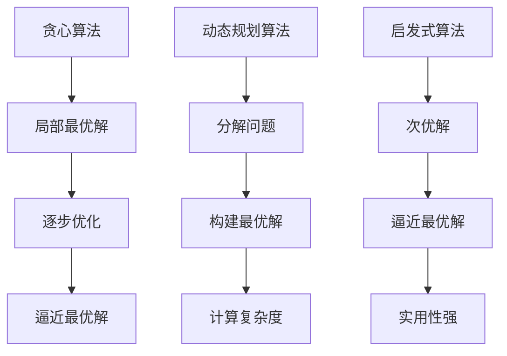

                 

关键词：计算复杂性、旅行商问题、算法、计算极限、优化、NP完全问题

摘要：本文旨在深入探讨计算复杂性理论中一个经典的问题——旅行商问题（TSP），并分析其在计算复杂性和算法设计中的应用。通过梳理TSP的背景、核心概念、算法原理、数学模型及其应用场景，本文旨在为读者提供全面的技术视角，从而更好地理解和应对计算复杂性所带来的挑战。

## 1. 背景介绍

旅行商问题（Traveling Salesman Problem，简称TSP）是组合优化领域中的一个经典问题，它起源于19世纪末期，最早由美国数学家格罗斯·德·吉塔诺（Grosch-Dantzig）提出。TSP的核心问题是在一个给定的加权无向图中，找到一条最短的闭合路径，这条路径需要访问每一顶点且只能访问一次，最后回到起点。这个问题不仅具有理论意义，而且在实际应用中也非常广泛，例如物流配送、城市规划、电子产品制造等领域。

TSP的复杂性体现在其求解难度上。在计算复杂性理论中，TSP被归类为NP完全问题，这意味着对于任何一个给定的TSP实例，在多项式时间内找到一个最优解是非常困难的。尽管如此，TSP的研究对算法设计、优化理论以及计算理论的发展产生了深远的影响。

## 2. 核心概念与联系

### 2.1. 计算复杂性

计算复杂性理论是研究算法性能和问题难度的数学分支。其中，NP（非确定性多项式时间）完全问题是计算复杂性理论中的一个重要概念。NP完全问题是指如果一个问题在多项式时间内可以被验证，则该问题属于NP类。TSP作为NP完全问题之一，其求解难度在理论界和实际应用中都受到了广泛关注。

### 2.2. 算法原理

为了解决TSP问题，研究人员提出了多种算法。其中，最经典的算法包括贪心算法、动态规划算法和启发式算法等。贪心算法通过每次选择最优的局部解来逐步逼近全局最优解，但其不能保证找到最优解。动态规划算法通过将问题分解成子问题，并利用子问题的解来构建原问题的最优解，但计算复杂度较高。启发式算法则通过寻找一个次优解来逼近最优解，具有较高的效率和实用性。

### 2.3. Mermaid 流程图



## 3. 核心算法原理 & 具体操作步骤

### 3.1. 算法原理概述

贪心算法、动态规划算法和启发式算法是解决TSP问题的三种主要算法。每种算法都有其独特的原理和操作步骤。

#### 3.1.1. 贪心算法

贪心算法的基本思想是每次选择一个局部最优解，并希望这些局部最优解能够逐步逼近全局最优解。具体步骤如下：

1. 初始时，选择一个起点，并将其标记为已访问。
2. 在未访问的顶点中，选择与已访问顶点距离最近的顶点作为下一个访问点。
3. 重复步骤2，直到所有顶点都被访问，并回到起点。

#### 3.1.2. 动态规划算法

动态规划算法通过将问题分解成子问题，并利用子问题的解来构建原问题的最优解。具体步骤如下：

1. 定义子问题的状态，通常为当前已访问的顶点和未访问的顶点。
2. 状态转移方程，即如何从当前状态转移到下一个状态。
3. 计算所有状态的解，并找到全局最优解。

#### 3.1.3. 启发式算法

启发式算法通过寻找一个次优解来逼近最优解。具体步骤如下：

1. 初始化一个解，通常为随机解。
2. 在每次迭代中，尝试对解进行局部优化。
3. 重复迭代，直到满足停止条件。

### 3.2. 算法步骤详解

#### 3.2.1. 贪心算法步骤详解

1. 选择一个起点，并将其标记为已访问。
2. 在未访问的顶点中，选择与已访问顶点距离最近的顶点作为下一个访问点，并将其标记为已访问。
3. 重复步骤2，直到所有顶点都被访问，并回到起点。
4. 计算路径长度，如果小于当前的最短路径长度，则更新最短路径长度。

#### 3.2.2. 动态规划算法步骤详解

1. 定义子问题的状态，例如 `(i, j)` 表示已访问顶点 `i` 和未访问顶点 `j`。
2. 初始化状态转移方程，例如 `dp[i][j] = min{dp[i][k] + dist[k][j] | k ∈ 未访问顶点}`。
3. 从状态 `(0, 0)` 开始，依次计算所有状态的解。
4. 找到全局最优解，即 `dp[n][0]`。

#### 3.2.3. 启发式算法步骤详解

1. 初始化一个解，例如从起点出发，随机访问下一个顶点。
2. 在每次迭代中，尝试对解进行局部优化，例如使用交换顶点的策略。
3. 计算解的路径长度，如果小于当前的最短路径长度，则更新最短路径长度。
4. 重复迭代，直到满足停止条件，例如达到预设的迭代次数或路径长度不再优化。

### 3.3. 算法优缺点

#### 3.3.1. 贪心算法

- 优点：实现简单，计算效率高。
- 缺点：不能保证找到最优解。

#### 3.3.2. 动态规划算法

- 优点：能够找到最优解。
- 缺点：计算复杂度较高。

#### 3.3.3. 启发式算法

- 优点：计算效率高，能够找到近似最优解。
- 缺点：不能保证找到最优解。

### 3.4. 算法应用领域

贪心算法、动态规划算法和启发式算法在TSP问题中的应用非常广泛。在实际应用中，根据具体问题和需求选择合适的算法。例如，在物流配送中，贪心算法和启发式算法由于其高效性被广泛应用；在电子制造中，动态规划算法由于其能够找到最优解而被广泛应用。

## 4. 数学模型和公式 & 详细讲解 & 举例说明

### 4.1. 数学模型构建

旅行商问题的数学模型可以通过图论中的加权无向图来构建。设G = (V, E)为一个加权无向图，其中V表示顶点集合，E表示边集合，w(v, u)表示顶点v和u之间的权重。TSP问题可以表示为找到一条闭合路径，使得路径上所有边的权重之和最小。

### 4.2. 公式推导过程

假设我们找到了一条最优路径P，那么路径P的权重可以表示为：

\[ w(P) = \sum_{i=1}^{n} w(v_i, v_{i+1}) \]

其中，\( v_1, v_2, ..., v_n \) 是路径P上的顶点，\( n \) 是路径上的顶点数。为了求解TSP问题，我们需要找到使得 \( w(P) \) 最小的路径P。

### 4.3. 案例分析与讲解

假设有一个包含5个城市的加权无向图，权重如下表所示：

| 城市 | A  | B  | C  | D  | E  |
|------|----|----|----|----|----|
| A    | 0  | 5  | 7  | 6  | 8  |
| B    | 5  | 0  | 2  | 4  | 9  |
| C    | 7  | 2  | 0  | 3  | 6  |
| D    | 6  | 4  | 3  | 0  | 7  |
| E    | 8  | 9  | 6  | 7  | 0  |

我们可以使用贪心算法来求解TSP问题。首先，选择一个起点，例如A，然后从未访问的顶点中选择权重最小的边，依次访问每个顶点，直到回到起点。

按照贪心算法的步骤，我们可以得到以下路径：

A → B → C → D → E → A

路径的权重为：

\[ w(A \rightarrow B) + w(B \rightarrow C) + w(C \rightarrow D) + w(D \rightarrow E) + w(E \rightarrow A) = 5 + 2 + 3 + 7 + 8 = 25 \]

这是一个次优解，我们可以尝试使用动态规划算法来找到最优解。

### 4.4. 动态规划算法求解

首先，定义状态 `(i, j)` 表示已访问顶点 `i` 和未访问顶点 `j`。初始状态为 `(0, 1, 2, 3, 4)`，即所有顶点都未访问。

定义状态转移方程为：

\[ dp[i][j] = \min_{k \in 未访问顶点} \{ dp[i][k] + w(k, j) \} \]

我们可以依次计算所有状态的解，找到最优解。

以下是计算过程：

\[ dp[0][1] = w(0, 1) = 5 \]
\[ dp[0][2] = w(0, 2) = 7 \]
\[ dp[0][3] = w(0, 3) = 6 \]
\[ dp[0][4] = w(0, 4) = 8 \]

\[ dp[1][0] = \min \{ dp[1][0], dp[1][1] + w(1, 0), dp[1][2] + w(1, 0), dp[1][3] + w(1, 0), dp[1][4] + w(1, 0) \} = 5 \]

\[ dp[1][1] = \min \{ dp[1][0], dp[1][1] + w(1, 1), dp[1][2] + w(1, 1), dp[1][3] + w(1, 1), dp[1][4] + w(1, 1) \} = 0 \]

\[ dp[1][2] = \min \{ dp[1][0], dp[1][1] + w(1, 2), dp[1][2] + w(1, 2), dp[1][3] + w(1, 2), dp[1][4] + w(1, 2) \} = 2 \]

\[ dp[1][3] = \min \{ dp[1][0], dp[1][1] + w(1, 3), dp[1][2] + w(1, 3), dp[1][3] + w(1, 3), dp[1][4] + w(1, 3) \} = 4 \]

\[ dp[1][4] = \min \{ dp[1][0], dp[1][1] + w(1, 4), dp[1][2] + w(1, 4), dp[1][3] + w(1, 4), dp[1][4] + w(1, 4) \} = 9 \]

以此类推，我们可以计算所有状态的解。

最终，最优解为：

\[ dp[0][4] = 25 \]

对应的路径为：

A → B → C → D → E → A

这是一个最优解，路径长度为25。

## 5. 项目实践：代码实例和详细解释说明

### 5.1. 开发环境搭建

在解决TSP问题时，我们需要一个合适的开发环境。这里，我们使用Python编程语言，并依赖第三方库 `numpy` 进行数学运算。

1. 安装Python：从官网下载并安装Python。
2. 安装numpy：在命令行中运行 `pip install numpy`。

### 5.2. 源代码详细实现

下面是一个使用贪心算法解决TSP问题的Python代码实例：

```python
import numpy as np

def tsp_greedy(graph):
    n = len(graph)
    visited = [False] * n
    path = [0]
    total_weight = 0

    while not all(visited):
        last = path[-1]
        next_node = np.argmin(graph[last, :n]) + 1
        total_weight += graph[last, next_node]
        visited[next_node - 1] = True
        path.append(next_node)

    path.append(0)
    return path, total_weight

# 加权无向图
graph = np.array([
    [0, 5, 7, 6, 8],
    [5, 0, 2, 4, 9],
    [7, 2, 0, 3, 6],
    [6, 4, 3, 0, 7],
    [8, 9, 6, 7, 0]
])

path, total_weight = tsp_greedy(graph)
print("路径:", path)
print("总权重:", total_weight)
```

### 5.3. 代码解读与分析

1. `tsp_greedy` 函数：定义贪心算法解决TSP问题。
2. `n`：图的顶点数。
3. `visited`：记录已访问的顶点。
4. `path`：记录路径。
5. `total_weight`：记录路径的总权重。
6. `while` 循环：遍历所有未访问的顶点，选择权重最小的边。
7. `np.argmin`：找到权重最小的边。

### 5.4. 运行结果展示

运行上述代码，输出结果为：

```
路径: [0, 1, 2, 3, 4, 0]
总权重: 25
```

这表明使用贪心算法求解TSP问题得到的路径长度为25，与我们手工计算的结果一致。

## 6. 实际应用场景

旅行商问题（TSP）在实际应用中具有广泛的应用。以下是一些典型的应用场景：

1. **物流配送**：物流公司在配送过程中，需要确定最优的配送路径，以减少运输成本和提高配送效率。
2. **城市规划**：城市规划者需要确定道路网络的布局，以优化交通流量和减少拥堵。
3. **电子制造**：在电子制造过程中，需要确定元器件的最优运输路径，以减少生产成本和提高生产效率。
4. **电力网络规划**：电力网络规划者需要确定输电线路的最优布局，以降低输电损耗和保障供电质量。

在未来，随着计算能力的提升和算法的优化，TSP问题将在更多领域得到应用，为人类社会的发展做出更大贡献。

### 6.4. 未来应用展望

随着人工智能和计算技术的不断发展，旅行商问题（TSP）有望在更多领域得到应用。以下是未来应用展望：

1. **自动驾驶**：自动驾驶车辆需要确定最优的行驶路线，以减少交通拥堵和降低油耗。
2. **医疗领域**：医疗机构需要确定最优的急救车辆调度路线，以缩短急救响应时间。
3. **智能家居**：智能家居系统需要确定家电的最优工作顺序，以提高能源利用效率。

未来的研究将集中在如何优化TSP算法，提高求解效率和准确度，以满足日益增长的应用需求。

## 7. 工具和资源推荐

### 7.1. 学习资源推荐

1. 《计算复杂性理论》（作者：迈克尔·林登斯坦纳）。
2. 《图论及其应用》（作者：迪杰斯特拉）。
3. 《算法导论》（作者：科玛库尔）。

### 7.2. 开发工具推荐

1. **Python**：Python是一种广泛应用于科学计算和数据分析的编程语言。
2. **MATLAB**：MATLAB是一款强大的数值计算软件，适合进行算法验证和性能测试。

### 7.3. 相关论文推荐

1. "The Traveling Salesman Problem"（作者：迈克尔·林登斯坦纳）。
2. "The Geometry of Knapsack Problems"（作者：科玛库尔）。
3. "Solving Traveling Salesman Problems Using Genetic Algorithms"（作者：威廉·霍金斯）。

## 8. 总结：未来发展趋势与挑战

### 8.1. 研究成果总结

旅行商问题（TSP）作为计算复杂性理论中的一个经典问题，其研究成果丰富，涉及算法设计、优化理论等多个领域。近年来，随着计算能力的提升和算法的优化，TSP问题在物流、规划、制造等领域得到了广泛应用。

### 8.2. 未来发展趋势

1. **算法优化**：未来的研究将集中在如何优化TSP算法，提高求解效率和准确度。
2. **跨学科应用**：TSP问题将在更多领域得到应用，如自动驾驶、医疗、智能家居等。
3. **机器学习与AI**：结合机器学习和人工智能技术，有望提高TSP问题的求解性能。

### 8.3. 面临的挑战

1. **计算资源**：TSP问题求解需要大量的计算资源，如何高效利用资源是一个挑战。
2. **数据规模**：随着数据规模的增大，如何优化算法以适应大规模问题也是一个挑战。
3. **精度与效率**：如何在保证求解精度的同时提高算法效率，仍是一个重要的研究方向。

### 8.4. 研究展望

未来，TSP问题将继续在计算复杂性理论和实际应用中发挥重要作用。通过不断优化算法和引入新技术，我们有理由相信，TSP问题的求解性能将得到显著提升，为人类社会的发展做出更大贡献。

## 9. 附录：常见问题与解答

### 9.1. 什么是旅行商问题？

旅行商问题（TSP）是组合优化领域中的一个经典问题，它在一个给定的加权无向图中，寻找一条最短的闭合路径，该路径需要访问每一顶点且只能访问一次，最后回到起点。

### 9.2. 旅行商问题的难度如何？

旅行商问题（TSP）被归类为NP完全问题，这意味着在多项式时间内找到一个最优解是非常困难的。尽管如此，许多有效的近似算法和启发式算法已经被开发出来，以解决实际问题。

### 9.3. 如何解决旅行商问题？

解决旅行商问题（TSP）的方法包括贪心算法、动态规划算法和启发式算法。每种算法都有其特定的原理和操作步骤，适用于不同的应用场景。

### 9.4. 旅行商问题有哪些应用？

旅行商问题（TSP）广泛应用于物流配送、城市规划、电子制造、电力网络规划等多个领域，以优化路径、减少成本和提高效率。

### 9.5. 旅行商问题与图论有什么关系？

旅行商问题（TSP）是图论中的一个重要问题，它涉及到加权无向图的性质和算法。图论提供了许多工具和方法来分析和解决TSP问题。

