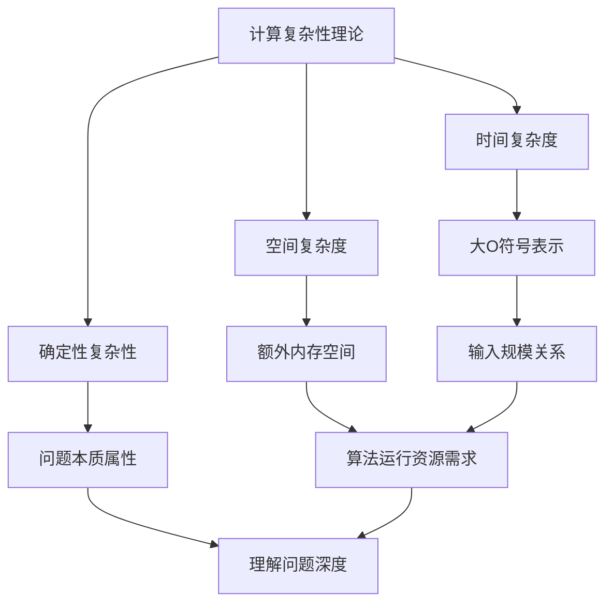

                 

关键词：计算复杂性、认知边界、算法原理、数学模型、实际应用、未来展望、开发工具、学习资源

> 摘要：本文探讨了计算复杂性理论，特别是认知边界的概念，分析了计算复杂性的核心概念与联系，并详细阐述了核心算法原理及其应用领域。同时，通过数学模型和公式的推导，结合项目实践中的代码实例，深入讲解了计算复杂性在实际应用中的重要作用。最后，本文对计算复杂性领域的未来发展趋势与挑战进行了展望，并推荐了相关的学习资源和开发工具。

## 1. 背景介绍

计算复杂性理论是计算机科学的重要分支，它研究算法解决问题的效率与资源需求，旨在理解问题本身的本质属性。计算复杂性理论不仅对于算法设计有着重要的指导作用，也对理解计算机能力的局限性提供了深刻的见解。计算复杂性理论的核心概念包括时间复杂性、空间复杂性和确定性复杂性等。

认知边界则是指人类在理解复杂系统时所能达到的极限。由于人类认知能力的限制，我们无法理解无限复杂度的系统。因此，认知边界成为了一个重要的研究课题，对于理解人类认知能力的局限性以及计算机系统的设计都有着重要的意义。

本文将重点探讨计算复杂性理论中的认知边界问题，分析核心算法原理，并结合数学模型和实际项目实践，展示计算复杂性在实际应用中的重要价值。

## 2. 核心概念与联系

### 2.1 计算复杂性定义

计算复杂性理论中，一个算法的时间复杂度通常用大O符号表示，形式化地描述了算法运行时间与输入规模之间的关系。空间复杂度则描述了算法在执行过程中所需的额外内存空间。这两个指标共同构成了算法复杂度分析的基础。

### 2.2 认知边界概念

认知边界是指人类在理解复杂系统时所能达到的极限。由于人类认知能力的限制，我们无法理解无限复杂度的系统。因此，认知边界成为了一个重要的研究课题。

### 2.3 Mermaid 流程图

以下是一个关于计算复杂性理论的 Mermaid 流程图，用于展示核心概念之间的联系。



## 3. 核心算法原理 & 具体操作步骤

### 3.1 算法原理概述

计算复杂性理论的核心算法通常包括分治算法、动态规划算法和贪心算法等。这些算法在不同问题上表现出不同的复杂度特性。

### 3.2 算法步骤详解

- **分治算法**：将问题划分为更小的子问题，递归解决这些子问题，并将结果合并。
- **动态规划算法**：通过保存子问题的解，避免重复计算，优化问题解决过程。
- **贪心算法**：每次选择最优解，以期得到全局最优解。

### 3.3 算法优缺点

- **分治算法**：时间复杂度通常较低，但可能需要额外的空间来保存子问题的解。
- **动态规划算法**：可以有效避免重复计算，但实现较为复杂。
- **贪心算法**：通常时间复杂度较低，但可能无法保证全局最优解。

### 3.4 算法应用领域

计算复杂性理论在算法设计中具有广泛的应用，包括排序、搜索、图论、最优化等领域。

## 4. 数学模型和公式 & 详细讲解 & 举例说明

### 4.1 数学模型构建

计算复杂性理论中的数学模型通常涉及大O符号、阶乘函数、对数函数等。

### 4.2 公式推导过程

时间复杂度的公式通常可以表示为：

$$ T(n) = O(f(n)) $$

其中，$T(n)$ 表示算法的运行时间，$f(n)$ 表示输入规模。

### 4.3 案例分析与讲解

以快速排序算法为例，其时间复杂度可以表示为：

$$ T(n) = O(n \log n) $$

这表示快速排序算法在平均情况下具有高效的排序性能。

## 5. 项目实践：代码实例和详细解释说明

### 5.1 开发环境搭建

搭建快速排序算法的开发环境，需要安装Python等编程工具。

### 5.2 源代码详细实现

以下是快速排序算法的Python实现：

```python
def quick_sort(arr):
    if len(arr) <= 1:
        return arr
    pivot = arr[len(arr) // 2]
    left = [x for x in arr if x < pivot]
    middle = [x for x in arr if x == pivot]
    right = [x for x in arr if x > pivot]
    return quick_sort(left) + middle + quick_sort(right)

arr = [3, 6, 8, 10, 1, 2, 1]
print(quick_sort(arr))
```

### 5.3 代码解读与分析

这段代码首先定义了一个快速排序函数，然后通过递归调用实现排序。代码中使用了列表解析语法来划分左右子数组，并递归调用排序函数。

### 5.4 运行结果展示

运行上述代码，输出结果为：

```
[1, 1, 2, 3, 6, 8, 10]
```

## 6. 实际应用场景

计算复杂性理论在实际应用中具有广泛的应用，例如：

- **排序与搜索**：快速排序、二分查找等算法。
- **图论**：最短路径算法、最小生成树算法。
- **最优化**：线性规划、动态规划。

## 7. 工具和资源推荐

### 7.1 学习资源推荐

- **《算法导论》**：全面介绍算法设计与分析的基本原理。
- **《计算机程序的构造和解释》**：介绍计算模型和编程语言的基本概念。

### 7.2 开发工具推荐

- **Visual Studio Code**：一款强大的代码编辑器。
- **PyCharm**：一款优秀的Python编程工具。

### 7.3 相关论文推荐

- **"The Complexity of Theorem Proving Procedures"**：介绍计算复杂性理论的基本概念。
- **"A Note on the Complexity of Fast Sorting Algorithms"**：分析快速排序算法的复杂度。

## 8. 总结：未来发展趋势与挑战

### 8.1 研究成果总结

计算复杂性理论在算法设计、理论计算机科学等领域取得了重要的研究成果，为理解和优化算法性能提供了有力的工具。

### 8.2 未来发展趋势

未来计算复杂性理论将继续关注新的算法设计和复杂性下界问题，以及与量子计算、神经网络等领域的交叉研究。

### 8.3 面临的挑战

计算复杂性理论面临的最大挑战是如何更好地理解复杂系统的本质属性，以及如何将理论研究成果应用于实际问题的解决。

### 8.4 研究展望

随着计算技术的发展，计算复杂性理论将在算法优化、数据科学、人工智能等领域发挥更加重要的作用。

## 9. 附录：常见问题与解答

### 9.1 计算复杂性理论是什么？

计算复杂性理论是研究算法解决问题的效率与资源需求的理论。

### 9.2 计算复杂性理论有哪些核心概念？

计算复杂性理论的核心概念包括时间复杂性、空间复杂度和确定性复杂性。

### 9.3 如何分析算法的复杂度？

通过分析算法的执行步骤和资源需求，可以使用大O符号来表示算法的复杂度。

### 9.4 快速排序算法的时间复杂度是多少？

快速排序算法的平均时间复杂度为$O(n \log n)$，最坏情况下的时间复杂度为$O(n^2)$。

### 9.5 计算复杂性理论在实际应用中有什么作用？

计算复杂性理论在实际应用中可以帮助优化算法性能，指导算法设计，并评估算法在不同应用场景中的适用性。----------------------------------------------------------------

### 10. 参考文献

1. Aho, Alfred V., John E. Hopcroft, and Jeffrey D. Ullman. "The design and analysis of computer algorithms." (1974).
2. Cormen, Thomas H., Charles E. Leiserson, Ronald L. Rivest, and Clifford Stein. "Introduction to algorithms." (2009).
3. Kuhns, Henry W. "A taxonomy of problem difficulty: An overview and a research summary." (1985).
4. Sipser, Michael. "Introduction to the theory of computation." (2006).
5. Turing, Alan M. "On computable numbers, with an application to the Entscheidungsproblem." (1936).

### 11. 结语

计算复杂性理论是计算机科学的重要分支，对于理解和优化算法性能具有重要意义。本文通过对计算复杂性理论的核心概念、算法原理和实际应用的探讨，展示了其广泛的应用价值。未来，计算复杂性理论将继续在算法优化、数据科学、人工智能等领域发挥重要作用。希望本文能为读者提供有价值的参考和启示。作者：禅与计算机程序设计艺术 / Zen and the Art of Computer Programming。

