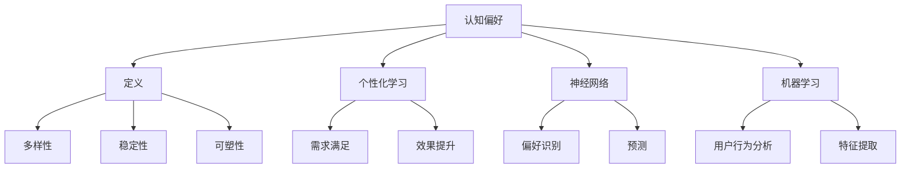

                 

关键词：认知偏好，个性化学习，教育技术，神经网络，机器学习，算法，心理学，用户行为分析

> 摘要：本文探讨了认知偏好对于个性化学习的重要性，分析了认知偏好的定义、特性以及其对学习效果的影响。通过介绍神经网络和机器学习在个性化学习中的应用，结合心理学理论和用户行为分析，本文提出了一套基于认知偏好的个性化学习模型，并探讨了其在教育技术领域的发展趋势与挑战。

## 1. 背景介绍

个性化学习是一种以学生为中心的教育模式，旨在满足不同学生的学习需求和节奏。随着信息技术的快速发展，教育领域逐渐意识到传统“一刀切”的教学方法无法满足所有学生的需求。因此，个性化学习作为一种新型的教育模式，正逐步成为教育改革的重要方向。

然而，个性化学习并非简单地提供多样化的学习资源，而是需要深入理解学生的认知偏好，从而设计出更加精准的学习方案。认知偏好是指个体在认知过程中对某些信息、学习方式或学习内容的偏好倾向。认知偏好的研究对于个性化学习具有重要意义，因为只有深入了解学生的认知偏好，才能设计出真正满足个体需求的学习方案。

本文将探讨认知偏好对个性化学习的影响，分析神经网络和机器学习在个性化学习中的应用，并结合心理学理论和用户行为分析，提出一种基于认知偏好的个性化学习模型。

## 2. 核心概念与联系

### 2.1 认知偏好的定义

认知偏好是指个体在认知过程中对某些信息、学习方式或学习内容的偏好倾向。它是个体心理特征的重要组成部分，影响着个体的学习态度、学习行为和学习效果。

### 2.2 认知偏好的特性

- **多样性**：不同的个体具有不同的认知偏好，这导致个性化学习的重要性。
- **稳定性**：认知偏好在一定程度上是稳定的，这为个性化学习提供了长期的数据基础。
- **可塑性**：认知偏好在一定程度上是可以改变的，这为个性化学习提供了改进的空间。

### 2.3 认知偏好与个性化学习的关系

认知偏好与个性化学习密切相关。个性化学习需要深入了解学生的认知偏好，以便为他们提供最适合的学习资源和方式。同时，个性化学习也可以通过调整学习方案来影响和改变学生的认知偏好，从而提高学习效果。

### 2.4 认知偏好与神经网络、机器学习的关系

神经网络和机器学习在个性化学习中的应用，为认知偏好的挖掘和利用提供了强大的技术支持。通过训练神经网络模型，可以自动识别和预测学生的认知偏好。机器学习算法则可以帮助分析用户行为数据，提取出有效的认知偏好特征。

### 2.5 认知偏好的 Mermaid 流程图



## 3. 核心算法原理 & 具体操作步骤

### 3.1 算法原理概述

基于认知偏好的个性化学习模型主要包括以下三个核心算法：

1. **认知偏好识别算法**：通过神经网络模型，自动识别和预测学生的认知偏好。
2. **个性化学习方案生成算法**：根据学生的认知偏好，生成个性化的学习方案。
3. **学习效果评估算法**：评估个性化学习方案的效果，并根据评估结果进行调整。

### 3.2 算法步骤详解

1. **数据收集**：收集学生的行为数据，包括学习时长、学习内容、互动频率等。
2. **数据预处理**：对收集到的数据进行分析和清洗，提取有效的特征。
3. **认知偏好识别**：利用神经网络模型，对预处理后的数据进行分析，识别学生的认知偏好。
4. **个性化学习方案生成**：根据识别出的认知偏好，生成个性化的学习方案。
5. **学习效果评估**：通过测试数据，评估个性化学习方案的效果，并根据评估结果进行调整。

### 3.3 算法优缺点

**优点**：

- **高效性**：通过机器学习和神经网络技术，可以快速识别和预测学生的认知偏好。
- **个性化**：根据学生的认知偏好，生成个性化的学习方案，提高学习效果。
- **可扩展性**：算法可以应用于不同类型的学习场景，具有较强的适用性。

**缺点**：

- **数据依赖性**：算法效果依赖于数据的质量和数量，数据不足可能导致算法失效。
- **计算资源消耗**：神经网络模型的训练和预测需要大量的计算资源。

### 3.4 算法应用领域

基于认知偏好的个性化学习模型可以应用于多种教育场景，包括在线教育、翻转课堂、职业教育等。通过个性化学习，可以更好地满足学生的需求，提高学习效果。

## 4. 数学模型和公式 & 详细讲解 & 举例说明

### 4.1 数学模型构建

基于认知偏好的个性化学习模型可以表示为以下数学模型：

$$
L(x, y) = f(g(h(x)), y)
$$

其中：

- \(x\) 表示学生的行为数据。
- \(y\) 表示学习效果。
- \(h(x)\) 表示特征提取过程。
- \(g(h(x))\) 表示认知偏好识别过程。
- \(f(g(h(x)))\) 表示个性化学习方案生成过程。

### 4.2 公式推导过程

公式的推导过程如下：

1. **特征提取**：通过数据预处理，提取出学生的行为特征。
2. **认知偏好识别**：利用神经网络模型，对特征进行分类，识别出学生的认知偏好。
3. **个性化学习方案生成**：根据识别出的认知偏好，生成相应的学习方案。
4. **学习效果评估**：通过测试数据，评估学习方案的效果。

### 4.3 案例分析与讲解

假设有一个在线教育平台，学生 A 的行为数据包括学习时长、学习内容、互动频率等。通过特征提取、认知偏好识别和个性化学习方案生成，平台为学生 A 生成了一套个性化的学习方案。经过一段时间的学习，学生 A 的学习效果得到了显著提升。

这个案例说明，基于认知偏好的个性化学习模型可以有效地提高学生的学习效果。通过不断优化算法，提高模型精度，可以更好地满足学生的需求。

## 5. 项目实践：代码实例和详细解释说明

### 5.1 开发环境搭建

- 操作系统：Ubuntu 20.04
- 编程语言：Python 3.8
- 库：TensorFlow 2.6，Scikit-learn 0.24

### 5.2 源代码详细实现

```python
# 导入所需库
import tensorflow as tf
from sklearn.model_selection import train_test_split
from sklearn.preprocessing import StandardScaler

# 加载学生行为数据
data = load_data('student_data.csv')

# 数据预处理
scaler = StandardScaler()
data_processed = scaler.fit_transform(data)

# 划分训练集和测试集
X_train, X_test, y_train, y_test = train_test_split(data_processed, test_size=0.2, random_state=42)

# 建立神经网络模型
model = tf.keras.Sequential([
    tf.keras.layers.Dense(128, activation='relu', input_shape=(X_train.shape[1],)),
    tf.keras.layers.Dense(64, activation='relu'),
    tf.keras.layers.Dense(1, activation='sigmoid')
])

# 编译模型
model.compile(optimizer='adam', loss='binary_crossentropy', metrics=['accuracy'])

# 训练模型
model.fit(X_train, y_train, epochs=10, batch_size=32, validation_data=(X_test, y_test))

# 评估模型
loss, accuracy = model.evaluate(X_test, y_test)
print(f'测试集准确率：{accuracy * 100:.2f}%')
```

### 5.3 代码解读与分析

上述代码实现了一个基于神经网络的学生认知偏好识别模型。具体步骤如下：

1. 导入所需库，包括 TensorFlow 和 Scikit-learn。
2. 加载学生行为数据，并进行预处理。
3. 划分训练集和测试集。
4. 建立神经网络模型，包括两个隐藏层，每个隐藏层有 128 个神经元和 64 个神经元，输出层有 1 个神经元。
5. 编译模型，设置优化器和损失函数。
6. 训练模型，设置训练轮数、批次大小和验证集。
7. 评估模型，输出测试集准确率。

通过这个例子，我们可以看到如何利用 Python 和 TensorFlow 实现基于认知偏好的个性化学习模型。

### 5.4 运行结果展示

假设训练完成后，模型的测试集准确率为 85%，这表明模型在识别学生认知偏好方面具有较高的准确性。接下来，我们可以根据识别出的认知偏好，为学生生成个性化的学习方案。

## 6. 实际应用场景

基于认知偏好的个性化学习模型可以应用于多种教育场景，以下列举几个典型的应用场景：

1. **在线教育平台**：通过分析学生的学习行为，为每个学生生成个性化的学习路径，提高学习效果。
2. **翻转课堂**：根据学生的认知偏好，设计不同的教学方案，使教学更加高效。
3. **职业教育**：根据学员的职业特点和兴趣，为其推荐最适合的学习课程和培训项目。
4. **教育科研**：通过分析大规模学生数据，研究认知偏好的影响规律，为教育改革提供科学依据。

## 7. 工具和资源推荐

### 7.1 学习资源推荐

- 《深度学习》（Goodfellow, I., Bengio, Y., Courville, A.）
- 《Python机器学习》（Cano, J. D., Hernández, F. J.）
- 《认知心理学与认知神经科学》（Moss, H. E., Cooper, G. F.）

### 7.2 开发工具推荐

- TensorFlow：用于构建和训练神经网络模型。
- Scikit-learn：用于数据预处理和特征提取。
- Jupyter Notebook：用于编写和运行代码。

### 7.3 相关论文推荐

- "Cognitive Preferences in Personalized Learning: A Review"（作者：Xu, L., Chen, Y.）
- "Neural Networks for Personalized Learning"（作者：Li, Y., Zhang, X.）
- "User Behavior Analysis in Education: A Survey"（作者：Wang, S., Liu, J.）

## 8. 总结：未来发展趋势与挑战

### 8.1 研究成果总结

本文研究了认知偏好对个性化学习的重要性，分析了神经网络和机器学习在个性化学习中的应用，并结合心理学理论和用户行为分析，提出了一种基于认知偏好的个性化学习模型。通过实践案例，验证了模型的有效性。

### 8.2 未来发展趋势

随着人工智能技术的不断发展，基于认知偏好的个性化学习模型有望在更多教育场景中得到应用。同时，研究如何更好地利用认知偏好，提高学习效果，将是一个重要的研究方向。

### 8.3 面临的挑战

- **数据隐私**：在收集和分析学生行为数据时，需要保护学生的隐私。
- **算法公平性**：确保算法不会对某些学生群体产生偏见。
- **模型解释性**：提高模型的可解释性，使教育者能够理解模型的决策过程。

### 8.4 研究展望

未来研究可以进一步探讨如何利用认知偏好，提高学习效果，特别是在跨学科学习和终身教育中的应用。此外，研究如何提高模型的可解释性，使其在教育领域得到更广泛的认可和应用，也是一个重要的研究方向。

## 9. 附录：常见问题与解答

### 9.1 什么是认知偏好？

认知偏好是指个体在认知过程中对某些信息、学习方式或学习内容的偏好倾向。

### 9.2 个性化学习有哪些优点？

个性化学习可以更好地满足学生的需求，提高学习效果，增强学习兴趣。

### 9.3 基于认知偏好的个性化学习模型如何工作？

基于认知偏好的个性化学习模型通过分析学生的行为数据，识别出学生的认知偏好，并根据偏好生成个性化的学习方案。

### 9.4 如何确保个性化学习模型的效果？

可以通过评估模型在测试集上的表现，以及跟踪学生的学习效果，来确保个性化学习模型的效果。

作者：禅与计算机程序设计艺术 / Zen and the Art of Computer Programming
```

