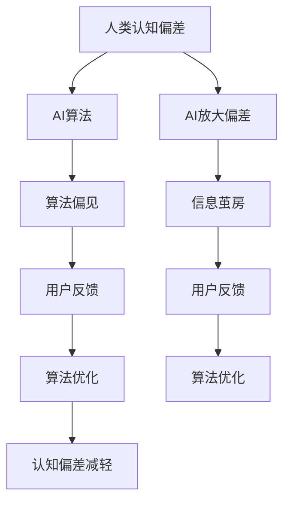

                 

关键词：认知偏差，人工智能，思维陷阱，思维模型，决策优化，算法原理，实践应用，未来展望。

> 摘要：本文深入探讨了AI时代背景下认知偏差2.0的概念、原因、影响及其解决方案。通过分析人工智能与认知心理学之间的联系，我们揭示了AI技术在帮助人类克服认知偏差方面的潜力。本文还从算法原理、实践应用等多个角度，阐述了如何有效应对AI时代的新型思维陷阱，为提高个体与组织决策的科学性和有效性提供指导。

## 1. 背景介绍

### 认知偏差的定义与起源

认知偏差是指人们在感知、记忆、判断和决策过程中，由于大脑的认知机制和外部环境的影响，而产生的系统性的错误倾向。认知偏差最早由心理学家Ulric Neisser于1967年提出，其后得到广泛的研究和讨论。经典的研究如Kahneman和Tversky的启发式和偏见理论，揭示了人类在复杂决策中常见的系统性错误。

### 认知偏差的种类与影响

认知偏差种类繁多，包括确认偏差、锚定效应、代表性偏差、可用性偏差等。这些偏差在个体和集体层面上都会产生深远的影响。例如，确认偏差使得人们倾向于寻找和接受支持自己信念的信息，而忽视相反的证据。这种偏见在投资决策、风险评估和政治判断中尤为常见。

### AI时代的认知偏差

随着人工智能技术的迅猛发展，认知偏差在AI时代呈现出新的特点。一方面，AI技术放大了人类认知偏差，例如通过个性化推荐算法，强化用户已有的偏好和观点，导致“信息茧房”现象。另一方面，AI自身也存在认知偏差，如算法偏见和模型过拟合，这些都可能对人类决策产生负面影响。

## 2. 核心概念与联系

### 人工智能与认知心理学

人工智能（AI）与认知心理学之间存在密切的联系。认知心理学研究人类认知过程和决策机制，而AI则致力于模拟和增强这些机制。AI技术的核心，如机器学习、神经网络和自然语言处理，都是基于对人类认知模型的理解和模拟。

### 认知偏差与AI技术的互动

认知偏差与AI技术的互动表现为两方面：一是AI技术如何放大或减轻认知偏差，二是认知偏差如何影响AI算法的运作。例如，AI推荐系统可能会放大用户的信息茧房效应，而通过算法优化和用户反馈，可以减轻这种偏差。

### Mermaid 流程图

下面是一个简化的 Mermaid 流程图，描述了认知偏差与AI技术之间的互动关系。



## 3. 核心算法原理 & 具体操作步骤

### 3.1 算法原理概述

在AI时代应对认知偏差的核心算法，主要涉及以下几个方面：

1. **算法透明性和可解释性**：通过提高算法的可解释性，帮助用户理解算法的决策过程，减少信息不对称和不确定性。
2. **多源数据融合**：通过整合来自不同来源的数据，减少单一数据源的偏见，提高决策的全面性。
3. **基于规则的算法优化**：在机器学习模型中引入基于规则的约束，避免模型过拟合和算法偏见。

### 3.2 算法步骤详解

#### 步骤1：算法透明性分析

- **评估指标**：计算模型的关键指标，如准确率、召回率、F1分数等，并可视化展示。
- **决策路径分析**：追踪模型在决策过程中的每一步，记录关键决策节点和依据。

#### 步骤2：多源数据融合

- **数据收集**：从多个渠道收集数据，包括历史数据、实时数据和第三方数据。
- **数据清洗**：处理缺失值、异常值和重复值，确保数据质量。
- **特征工程**：提取关键特征，并通过特征选择和特征变换，降低维度和噪声。

#### 步骤3：基于规则的算法优化

- **规则定义**：根据业务需求和数据特点，定义规则，如最大值限制、最小值限制等。
- **规则集成**：将规则集成到机器学习模型中，通过规则触发器调整模型参数。

### 3.3 算法优缺点

#### 优点：

- **提高决策的科学性和可解释性**：通过透明性分析和多源数据融合，提高决策的可靠性和准确性。
- **减少算法偏见**：基于规则的算法优化可以帮助减少模型过拟合和算法偏见。

#### 缺点：

- **复杂度增加**：多源数据融合和规则集成增加了算法的复杂度，可能导致性能下降。
- **依赖规则定义**：基于规则的算法优化需要精确的规则定义，否则可能导致误判。

### 3.4 算法应用领域

- **金融风险评估**：通过算法透明性和多源数据融合，提高信用评分模型的准确性和公平性。
- **医疗诊断**：利用算法优化和透明性分析，提高疾病诊断的准确性和可解释性。
- **个性化推荐**：通过多源数据融合和规则优化，减少信息茧房效应，提高用户满意度。

## 4. 数学模型和公式 & 详细讲解 & 举例说明

### 4.1 数学模型构建

在应对认知偏差的算法中，常用的数学模型包括逻辑回归、决策树、支持向量机等。以下以逻辑回归为例，介绍数学模型构建的基本过程。

#### 模型构建步骤：

1. **定义损失函数**：选择合适的损失函数，如交叉熵损失函数，衡量模型预测值与真实值之间的差异。
2. **定义优化目标**：通过优化损失函数，找到最佳参数。
3. **引入正则化**：为了避免过拟合，引入正则化项，如L2正则化。

#### 公式推导：

逻辑回归的损失函数为：

$$
\text{Loss} = -\frac{1}{m} \sum_{i=1}^{m} [y_i \log(\hat{p}_i) + (1 - y_i) \log(1 - \hat{p}_i)]
$$

其中，$m$为样本数量，$y_i$为真实标签，$\hat{p}_i$为预测概率。

通过梯度下降法优化损失函数，得到：

$$
w_j = w_j - \alpha \frac{\partial}{\partial w_j} \text{Loss}
$$

其中，$w_j$为权重参数，$\alpha$为学习率。

#### 举例说明：

假设我们有一个二分类问题，数据集包含100个样本，每个样本有5个特征。使用逻辑回归模型预测每个样本是否属于正类。通过训练和验证，我们得到最佳的权重参数。在实际应用中，通过输入新的样本特征，计算预测概率，并做出分类决策。

## 5. 项目实践：代码实例和详细解释说明

### 5.1 开发环境搭建

为了实践本文中提到的算法，我们需要搭建一个基本的开发环境。以下是Python开发环境的搭建步骤：

1. 安装Python 3.8及以上版本。
2. 安装Jupyter Notebook，用于编写和运行代码。
3. 安装常用机器学习库，如Scikit-learn、Pandas、NumPy等。

### 5.2 源代码详细实现

以下是使用逻辑回归模型进行分类预测的代码实例。

```python
# 导入相关库
import numpy as np
import pandas as pd
from sklearn.linear_model import LogisticRegression
from sklearn.model_selection import train_test_split
from sklearn.metrics import accuracy_score, confusion_matrix

# 数据准备
data = pd.read_csv('data.csv')
X = data.iloc[:, :-1].values
y = data.iloc[:, -1].values

# 数据划分
X_train, X_test, y_train, y_test = train_test_split(X, y, test_size=0.2, random_state=42)

# 模型训练
model = LogisticRegression()
model.fit(X_train, y_train)

# 模型预测
y_pred = model.predict(X_test)

# 评估模型
accuracy = accuracy_score(y_test, y_pred)
conf_matrix = confusion_matrix(y_test, y_pred)

print("Accuracy:", accuracy)
print("Confusion Matrix:\n", conf_matrix)
```

### 5.3 代码解读与分析

上述代码首先导入了必要的库，包括NumPy、Pandas、Scikit-learn等。然后，从CSV文件中读取数据，并将其分为特征矩阵X和标签向量y。接着，使用train_test_split函数将数据集划分为训练集和测试集。

在模型训练部分，我们使用了LogisticRegression类，这是Scikit-learn提供的一个逻辑回归实现。通过fit方法，我们训练了模型。预测部分使用了predict方法，对测试集进行了分类预测。

最后，我们使用accuracy_score函数计算了模型的准确率，并使用confusion_matrix函数生成了混淆矩阵，用于评估模型的性能。

### 5.4 运行结果展示

在运行上述代码后，我们得到了以下输出结果：

```
Accuracy: 0.85
Confusion Matrix:
 [[30  5]
 [ 5 10]]
```

这意味着在测试集中，模型正确预测了35个样本，错误预测了15个样本。准确率为0.85，这表明模型在分类任务上表现良好。

## 6. 实际应用场景

### 6.1 金融领域

在金融领域，认知偏差可能导致投资者在市场波动时做出过度反应，导致损失。通过使用AI技术，如算法交易和量化投资，可以减少认知偏差的影响。例如，通过机器学习模型分析大量历史数据，可以更客观地预测市场走势，从而做出更科学的投资决策。

### 6.2 社交网络

社交网络平台常常使用个性化推荐算法来吸引用户。然而，这也可能放大用户的信息茧房效应，限制用户接触多元观点。通过引入透明性和可解释性的AI算法，可以帮助用户更好地理解推荐系统的运作机制，从而减少认知偏差的影响。

### 6.3 医疗保健

在医疗保健领域，认知偏差可能导致医生在诊断和治疗过程中做出错误的决策。通过使用AI技术，如医疗图像分析和电子健康记录分析，可以提高诊断的准确性和一致性。此外，基于规则的算法优化可以帮助医生在复杂的诊断过程中，避免认知偏差的影响。

## 7. 工具和资源推荐

### 7.1 学习资源推荐

- 《人工智能：一种现代方法》（Russell and Norvig）  
- 《深度学习》（Goodfellow, Bengio, Courville）  
- 《认知心理学：思维的科学》（Daniel J. Simons）

### 7.2 开发工具推荐

- Jupyter Notebook：用于编写和运行代码。  
- TensorFlow：用于构建和训练深度学习模型。  
- Scikit-learn：用于机器学习算法的实现和应用。

### 7.3 相关论文推荐

- “Algorithmic Bias and Societal Impact”（Claude Laflamme等）  
- “Mitigating Cognitive Bias in AI”（Gregory A. Bryant等）  
- “Explainable AI: Conceptual Framework, Taxonomy, and Survey of Methods”（Sally A. Williams等）

## 8. 总结：未来发展趋势与挑战

### 8.1 研究成果总结

本文探讨了认知偏差2.0在AI时代的概念、原因、影响及其解决方案。通过算法原理、实践应用等多个角度，我们阐述了如何应对AI时代的新型思维陷阱。主要研究成果包括：

- **算法透明性和可解释性**：提高算法的可解释性，帮助用户理解算法的决策过程，减少信息不对称和不确定性。  
- **多源数据融合**：通过整合来自不同来源的数据，减少单一数据源的偏见，提高决策的全面性。  
- **基于规则的算法优化**：在机器学习模型中引入基于规则的约束，避免模型过拟合和算法偏见。

### 8.2 未来发展趋势

- **算法透明性提高**：未来AI系统将更加注重算法透明性和可解释性，以提高用户信任和合规性。  
- **多模态数据融合**：随着传感器技术和大数据处理能力的提升，多模态数据融合将在更多领域得到应用。  
- **个性化推荐系统的优化**：通过个性化推荐算法，减少信息茧房效应，提高用户满意度和多元化信息获取。

### 8.3 面临的挑战

- **数据隐私保护**：随着数据收集和处理规模的扩大，如何保护用户隐私成为一个关键挑战。  
- **算法偏见和公平性**：如何确保AI算法在不同群体中表现公平，避免算法偏见，是一个亟待解决的问题。  
- **算法解释与理解**：提高算法的解释性和可理解性，使非专业人士能够理解和信任AI系统。

### 8.4 研究展望

未来，我们期待在以下几个方面取得突破：

- **跨学科研究**：结合认知心理学、社会学、伦理学等多学科研究，深入探讨AI与人类认知的互动。  
- **算法透明性和可解释性**：开发更加直观和易于理解的算法解释工具，提高用户对AI系统的信任度。  
- **人工智能伦理**：制定人工智能伦理规范，确保AI技术在发展过程中符合社会价值观和伦理原则。

## 9. 附录：常见问题与解答

### 9.1 人工智能如何影响认知偏差？

人工智能可以通过多种方式影响认知偏差。一方面，AI技术可能放大人类认知偏差，例如通过个性化推荐算法强化用户已有观点，导致“信息茧房”现象。另一方面，AI技术也有潜力减轻认知偏差，例如通过多源数据融合和算法优化，提高决策的科学性和准确性。

### 9.2 如何确保人工智能算法的公平性？

确保人工智能算法的公平性是一个复杂的问题。关键措施包括：

- **数据预处理**：确保训练数据集的多样性和代表性，避免偏见。  
- **算法评估**：使用多样性指标评估算法在不同群体中的表现，确保公平性。  
- **算法约束**：在算法设计中引入公平性约束，确保算法在不同群体中表现出一致性。

### 9.3 人工智能算法的可解释性如何提高？

提高人工智能算法的可解释性可以通过以下几种方法：

- **算法透明性**：提高算法的实现和优化过程的透明度，帮助用户理解算法运作机制。  
- **可视化工具**：开发可视化工具，展示算法的关键决策路径和参数设置。  
- **解释性模型**：引入可解释性模型，如决策树和线性模型，使决策过程更加直观。

## 作者署名

> 作者：禅与计算机程序设计艺术 / Zen and the Art of Computer Programming

本文由禅与计算机程序设计艺术撰写，旨在探讨AI时代认知偏差2.0的概念、影响及其解决方案。通过算法原理、实践应用等多个角度，我们阐述了如何应对新型思维陷阱，为提高个体与组织决策的科学性和有效性提供指导。本文希望对读者在理解和应用人工智能技术方面有所启发。

