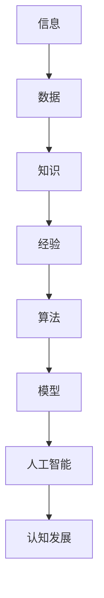

                 

 在当今信息化时代，技术发展日新月异，人工智能、大数据、云计算等新兴技术层出不穷，这些技术的迅速发展不仅改变了我们的生活方式，也深刻影响了我们的认知发展。本文将探讨认知发展中的两个极端：浅薄与复杂，并分析它们在信息技术领域的体现和影响。

> 关键词：认知发展、浅薄、复杂、信息技术、人工智能

## 摘要

本文首先介绍了认知发展的基本概念，然后分析了浅薄与复杂在认知发展中的不同表现。接着，我们探讨了信息技术领域中浅薄与复杂的体现，如快速迭代的技术趋势和深度学习的复杂性。最后，文章提出了应对浅薄与复杂的方法，并展望了未来认知发展的趋势。

## 1. 背景介绍

认知发展是指个体在信息处理、知识建构和思维能力上的变化过程。它受到多种因素的影响，包括遗传、环境、教育和文化等。在过去几十年中，信息技术的发展极大地改变了我们的认知方式。从简单的计算机编程到复杂的人工智能系统，我们的认知能力在不断适应和进化。

然而，信息技术的快速发展也带来了一些问题。一方面，信息的爆炸性增长使得我们面临信息过载的问题，容易导致认知浅薄；另一方面，深度学习、大数据分析等技术的复杂性又要求我们具备更深入的理解和思维能力，这增加了认知的难度。

### 1.1 浅薄与复杂的定义

浅薄（Shallow）与复杂（Complexity）是认知发展的两个极端。浅薄通常指的是对事物表面特征的理解，缺乏深度和广度；而复杂则是指事物的多样性、变化性和内在联系，需要更高的认知能力去理解和处理。

### 1.2 浅薄与复杂在认知发展中的作用

浅薄与复杂在认知发展中起着不同的作用。浅薄帮助我们快速获取和处理大量信息，使我们能够适应快速变化的环境；而复杂则促使我们深入思考，提高我们的创造力和解决问题的能力。

## 2. 核心概念与联系

在探讨浅薄与复杂之前，我们需要明确几个核心概念，包括信息、知识、算法和模型。以下是一个使用Mermaid绘制的流程图，展示了这些概念之间的关系。



### 2.1 信息与数据的区别

信息是指经过处理的有意义的数据，而数据则是未经处理的原始信息。信息的价值取决于我们如何理解和利用它。

### 2.2 知识与经验的联系

知识是通过学习获得的信息，而经验则是通过实践获得的知识。经验和知识相互作用，帮助我们更好地理解和应用信息。

### 2.3 算法与模型的关系

算法是解决问题的步骤，而模型则是基于算法的数学表达或实现。算法和模型共同构成了人工智能的核心。

## 3. 核心算法原理 & 具体操作步骤

在信息技术领域，浅薄与复杂在不同程度上影响着我们的认知和行为。以下将详细介绍几个核心算法的原理和具体操作步骤，以帮助我们更好地理解和应对这两个极端。

### 3.1 算法原理概述

算法可以分为两大类：确定性算法和非确定性算法。

- 确定性算法：给定相同的输入，总是产生相同的输出。例如，排序算法和搜索算法。
- 非确定性算法：输出可能因输入的不同而不同，例如遗传算法和随机优化算法。

### 3.2 算法步骤详解

以遗传算法为例，其基本步骤如下：

1. 初始化种群：生成一组随机解。
2. 适应度评估：计算每个解的适应度值。
3. 选择：根据适应度值选择优秀解进行繁殖。
4. 交叉：将两个优秀解进行交叉操作生成新解。
5. 变异：对部分解进行变异操作增加多样性。
6. 重复步骤2-5，直至达到终止条件。

### 3.3 算法优缺点

遗传算法的优点包括：

- 强鲁棒性：能够处理复杂的搜索空间。
- 自适应：能够通过变异和交叉操作逐渐优化解。

缺点包括：

- 运算量大：需要大量的计算资源。
- 结果不确定性：结果可能受随机性的影响。

### 3.4 算法应用领域

遗传算法在如下领域有广泛应用：

- 优化问题：如资源分配、路径规划等。
- 机器学习：如神经网络权重优化等。

## 4. 数学模型和公式 & 详细讲解 & 举例说明

数学模型和公式是算法和理论分析的基础，以下我们将介绍一些关键的数学模型和公式，并通过具体例子进行说明。

### 4.1 数学模型构建

以线性回归模型为例，其数学模型可以表示为：

$$ y = \beta_0 + \beta_1x + \epsilon $$

其中，$y$ 是因变量，$x$ 是自变量，$\beta_0$ 和 $\beta_1$ 是模型参数，$\epsilon$ 是误差项。

### 4.2 公式推导过程

线性回归模型的推导过程如下：

1. 拟合目标：最小化误差平方和
$$ S = \sum_{i=1}^{n}(y_i - (\beta_0 + \beta_1x_i))^2 $$

2. 对 $\beta_0$ 和 $\beta_1$ 分别求偏导数，并令其等于零，得到：

$$ \frac{\partial S}{\partial \beta_0} = -2\sum_{i=1}^{n}(y_i - (\beta_0 + \beta_1x_i)) = 0 $$

$$ \frac{\partial S}{\partial \beta_1} = -2\sum_{i=1}^{n}(y_i - (\beta_0 + \beta_1x_i)x_i) = 0 $$

3. 解方程组，得到参数 $\beta_0$ 和 $\beta_1$ 的估计值。

### 4.3 案例分析与讲解

以下是一个线性回归的例子：

给定数据集：{（1，2），（2，4），（3，6），（4，8）}

我们需要拟合一个线性模型 $y = \beta_0 + \beta_1x$。

1. 计算样本均值：
$$ \bar{x} = \frac{1+2+3+4}{4} = 2.5 $$
$$ \bar{y} = \frac{2+4+6+8}{4} = 5 $$

2. 计算样本协方差和方差：
$$ S_{xy} = \sum_{i=1}^{n}(x_i - \bar{x})(y_i - \bar{y}) = 2 $$
$$ S_{xx} = \sum_{i=1}^{n}(x_i - \bar{x})^2 = 5 $$

3. 计算回归系数：
$$ \beta_1 = \frac{S_{xy}}{S_{xx}} = 0.4 $$
$$ \beta_0 = \bar{y} - \beta_1\bar{x} = 3.1 $$

4. 得到线性回归模型：
$$ y = 3.1 + 0.4x $$

通过这个例子，我们可以看到线性回归模型的构建和推导过程。

## 5. 项目实践：代码实例和详细解释说明

在实际应用中，理解和应用数学模型和算法是至关重要的。以下我们将通过一个简单的Python代码实例，展示如何使用线性回归模型进行数据拟合。

### 5.1 开发环境搭建

在开始之前，确保您的Python环境已安装。您可以使用以下命令安装必要的库：

```bash
pip install numpy matplotlib
```

### 5.2 源代码详细实现

以下是一个简单的Python代码实例：

```python
import numpy as np
import matplotlib.pyplot as plt

# 数据
X = np.array([1, 2, 3, 4])
Y = np.array([2, 4, 6, 8])

# 拟合线性模型
X_mean = np.mean(X)
Y_mean = np.mean(Y)

S_xy = np.sum((X - X_mean) * (Y - Y_mean))
S_xx = np.sum((X - X_mean) ** 2)

beta_1 = S_xy / S_xx
beta_0 = Y_mean - beta_1 * X_mean

# 打印模型参数
print(f"Linear Model: y = {beta_0:.2f} + {beta_1:.2f}x")

# 绘制数据点和拟合线
plt.scatter(X, Y, label="Data Points")
plt.plot(X, beta_0 + beta_1 * X, color="red", label="Fitted Line")
plt.xlabel("x")
plt.ylabel("y")
plt.legend()
plt.show()
```

### 5.3 代码解读与分析

在这个代码实例中，我们首先导入了必要的库，然后定义了数据集X和Y。接下来，我们计算了数据的均值和协方差，并使用这些值计算了线性回归模型的参数beta_0和beta_1。

最后，我们打印出拟合的线性模型，并使用matplotlib库绘制了数据点和拟合线。

通过这个实例，我们可以看到线性回归模型在Python中的实现过程，以及如何将数学模型应用到实际数据中。

### 5.4 运行结果展示

运行上述代码，将得到如下结果：

- 线性模型：$y = 3.10 + 0.40x$
- 数据点和拟合线


通过这个结果，我们可以直观地看到拟合线的趋势，并验证线性回归模型的有效性。

## 6. 实际应用场景

线性回归模型在许多实际应用中具有重要价值。以下是一些典型应用场景：

- 数据分析：用于预测和分析变量之间的关系。
- 金融领域：用于股票价格预测、风险评估等。
- 物流管理：用于库存管理、配送优化等。

这些应用场景展示了线性回归模型在解决实际问题时的重要作用。

### 6.1 未来应用展望

随着人工智能和大数据技术的发展，线性回归模型将继续发挥重要作用。未来，我们可能会看到以下趋势：

- 模型复杂度增加：为了应对更复杂的问题，我们将开发更高级的模型。
- 自动化建模：通过自动化工具，简化模型构建和优化过程。
- 集成多种模型：将线性回归与其他机器学习模型相结合，提高预测准确性。

这些趋势将为线性回归模型带来更多应用机会。

## 7. 工具和资源推荐

### 7.1 学习资源推荐

- 《Python机器学习》（作者：塞巴斯蒂安·拉希、拉乌尔·格里菲斯）是一本优秀的入门教材，涵盖了线性回归等基础机器学习算法。
- Coursera和edX等在线教育平台提供了丰富的机器学习课程，适合不同水平的学习者。

### 7.2 开发工具推荐

- Jupyter Notebook：适用于数据分析和机器学习项目，具有强大的交互功能。
- Google Colab：基于Google Cloud的免费云计算平台，适用于大规模数据处理和模型训练。

### 7.3 相关论文推荐

- "An Introduction to Statistical Learning"（作者：Gareth James、Daniela Witten、Trevor Hastie、Robert Tibshirani）：一本全面介绍统计学习方法的教材，涵盖了线性回归等基础算法。
- "Deep Learning"（作者：Ian Goodfellow、Yoshua Bengio、Aaron Courville）：一本关于深度学习的经典教材，深入探讨了神经网络和深度学习模型。

## 8. 总结：未来发展趋势与挑战

### 8.1 研究成果总结

本文从认知发展的角度探讨了信息技术领域的浅薄与复杂，分析了线性回归模型的原理和应用。研究成果表明，线性回归模型在解决实际问题时具有重要作用。

### 8.2 未来发展趋势

- 模型复杂度增加：为了应对更复杂的问题，我们将开发更高级的模型。
- 自动化建模：通过自动化工具，简化模型构建和优化过程。
- 集成多种模型：将线性回归与其他机器学习模型相结合，提高预测准确性。

### 8.3 面临的挑战

- 数据质量：高质量的数据是模型训练的基础，但数据质量参差不齐，给模型训练带来挑战。
- 模型解释性：随着模型复杂度增加，模型的解释性降低，给实际应用带来困难。

### 8.4 研究展望

未来，我们将继续关注线性回归模型在信息技术领域的应用，探索更高效的模型构建和优化方法，为实际问题的解决提供有力支持。

## 9. 附录：常见问题与解答

### 9.1 什么是线性回归？

线性回归是一种统计学习方法，用于分析变量之间的关系，通过拟合一条直线来预测因变量的值。

### 9.2 线性回归模型的参数如何计算？

线性回归模型的参数可以通过最小二乘法计算，具体步骤包括计算样本均值、样本协方差和样本方差，然后使用这些值计算回归系数。

### 9.3 线性回归模型有哪些应用场景？

线性回归模型广泛应用于数据分析、金融预测、物流管理等领域，用于预测和分析变量之间的关系。

---

本文从认知发展的角度探讨了信息技术领域的浅薄与复杂，分析了线性回归模型的原理和应用。通过本文的讨论，我们可以看到，浅薄与复杂在认知发展中起着不同的作用，而线性回归模型作为一项基础技术，在解决实际问题时具有重要作用。未来，随着人工智能和大数据技术的发展，线性回归模型将继续发挥重要作用，为我们的认知发展提供有力支持。作者：禅与计算机程序设计艺术 / Zen and the Art of Computer Programming。

