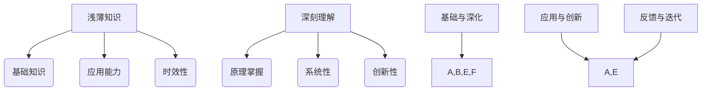

                 

 > **关键词**：认知发展，浅薄知识，深刻理解，技术领域，人工智能，学习算法，数学模型，项目实践，应用场景，未来展望。

> **摘要**：本文探讨了在技术领域，尤其是人工智能和计算机科学中，认知发展的浅薄与深刻之间的辩证关系。通过分析浅薄知识与深刻理解的概念、重要性，以及它们在技术和工程实践中的应用，本文提出了认知发展的方向和路径。同时，通过具体的数学模型和算法原理，结合项目实践案例，探讨了如何在实际工作中实现认知的深化，并展望了未来的发展趋势和挑战。

## 1. 背景介绍

在信息技术和人工智能飞速发展的今天，我们面临着知识爆炸和信息过载的挑战。知识更新换代的速度越来越快，新技术、新算法层出不穷，这要求我们必须不断学习和适应。然而，在这种背景下，如何处理知识的深度与广度之间的平衡，成为了我们认知发展中的一个重要课题。

浅薄知识与深刻理解是认知发展的两个极端。浅薄知识通常是指对某一领域或技术的表面了解，具备一定的应用能力，但缺乏深度和系统性。而深刻理解则是对某一领域或技术的全面、系统的掌握，能够从原理上解决复杂问题，具备创新和发明的能力。

在技术领域，特别是人工智能和计算机科学，浅薄知识与深刻理解都有着重要的作用。浅薄知识可以帮助我们快速掌握新技能，提高工作效率；而深刻理解则能让我们在技术前沿不断创新，推动科技进步。本文将深入探讨这两个概念，以及如何在技术和工程实践中实现认知的深化。

## 2. 核心概念与联系

### 2.1 浅薄知识与深刻理解的概念

#### 2.1.1 浅薄知识

浅薄知识通常是指对某一领域或技术的表面了解，主要表现在以下几个方面：

1. **基础知识**：对某一技术的基本概念、原理和操作有一定的了解，但缺乏深入和系统的理解。
2. **应用能力**：能够使用某种技术或工具解决特定问题，但缺乏灵活性和创造性。
3. **时效性**：知识更新较快，需要不断学习和更新。

#### 2.1.2 深刻理解

深刻理解则是对某一领域或技术的全面、系统的掌握，主要表现在以下几个方面：

1. **原理掌握**：能够从原理上理解和解释某一技术的运作机制，具备分析和解决问题的能力。
2. **系统性**：具备对整个领域的系统认识，能够将不同技术和知识相互关联和整合。
3. **创新性**：能够基于深刻理解，提出新的解决方案，推动技术和理论的进步。

### 2.2 浅薄知识与深刻理解的联系

浅薄知识与深刻理解并不是相互独立的，而是相互联系、相互促进的。

1. **基础与深化**：浅薄知识是深刻理解的基础，只有掌握了一定的基础知识，才能进行进一步的深化。而深刻理解则是在浅薄知识的基础上，通过深入研究和实践，不断拓展和提升。

2. **应用与创新**：浅薄知识可以应用于解决具体问题，而深刻理解则能推动技术创新。在实际工作中，深刻理解往往能够带来意想不到的创新成果，而浅薄知识则有助于我们快速应用新技术，提高工作效率。

3. **反馈与迭代**：深刻理解可以反馈和修正浅薄知识，使得我们的认知更加准确和全面。而浅薄知识的实际应用则可以验证和巩固深刻理解，使得我们的认知更加深刻和系统。

### 2.3 核心概念原理与架构的 Mermaid 流程图



通过上述 Mermaid 流程图，我们可以清晰地看到浅薄知识与深刻理解之间的概念联系和相互作用。

## 3. 核心算法原理 & 具体操作步骤

### 3.1 算法原理概述

在人工智能和计算机科学领域，算法原理是实现认知深化的重要手段。本文将介绍一种常见的算法——神经网络算法，并阐述其基本原理。

神经网络算法是一种基于人脑神经元连接和信号传递的原理，通过模拟人脑神经网络的结构和功能，实现数据的高效处理和模式识别。神经网络算法的核心是神经元，每个神经元通过输入层接收外部信号，经过隐藏层的处理，最终输出结果。

神经网络算法的基本原理包括：

1. **前向传播**：输入信号从输入层传递到隐藏层，通过激活函数处理，然后传递到输出层。
2. **反向传播**：根据输出结果和预期目标的差异，通过反向传播算法，调整神经元的权重和偏置，使得神经网络能够更好地拟合数据。
3. **训练与优化**：通过多次迭代训练，不断调整神经网络的参数，使其能够更准确地识别和预测数据。

### 3.2 算法步骤详解

1. **初始化参数**：设定神经网络的输入层、隐藏层和输出层的神经元数量，初始化权重和偏置。
2. **前向传播**：
    - 将输入信号输入到输入层，传递到隐藏层。
    - 在隐藏层中，通过激活函数（如Sigmoid函数、ReLU函数等）处理输入信号。
    - 将隐藏层的结果传递到输出层。
3. **计算损失**：根据输出结果和预期目标，计算损失函数（如均方误差、交叉熵等）。
4. **反向传播**：根据损失函数的梯度，通过反向传播算法，调整神经元的权重和偏置。
5. **迭代训练**：重复上述步骤，直到满足训练目标或达到预设的训练次数。

### 3.3 算法优缺点

#### 优点

1. **强大的表示能力**：神经网络可以模拟人脑神经网络的结构和功能，具备强大的表示和学习能力。
2. **灵活的应用场景**：神经网络可以应用于多种场景，如图像识别、自然语言处理、推荐系统等。
3. **自动特征提取**：神经网络能够自动提取输入数据的特征，降低人工干预的需求。

#### 缺点

1. **计算复杂度高**：神经网络涉及大量的矩阵运算，计算复杂度较高，对计算资源和时间要求较高。
2. **训练过程不稳定**：神经网络训练过程容易陷入局部最优，导致训练结果不稳定。
3. **解释性差**：神经网络内部参数和权重的调整过程较为复杂，难以解释和理解。

### 3.4 算法应用领域

神经网络算法在人工智能和计算机科学领域具有广泛的应用，如：

1. **图像识别**：通过训练神经网络，可以实现物体识别、人脸识别等。
2. **自然语言处理**：通过神经网络模型，可以实现文本分类、情感分析、机器翻译等。
3. **推荐系统**：通过训练用户兴趣模型，可以实现个性化推荐。
4. **游戏AI**：通过训练神经网络，可以实现智能游戏AI，如围棋、象棋等。

## 4. 数学模型和公式 & 详细讲解 & 举例说明

### 4.1 数学模型构建

在人工智能和计算机科学领域，数学模型是解决实际问题的核心工具。本文将介绍一种常见的数学模型——线性回归模型，并阐述其构建过程。

#### 4.1.1 线性回归模型概述

线性回归模型是一种用于分析自变量和因变量之间线性关系的数学模型。其基本形式为：

$$ y = w_1x_1 + w_2x_2 + ... + w_nx_n + b $$

其中，$y$ 为因变量，$x_1, x_2, ..., x_n$ 为自变量，$w_1, w_2, ..., w_n$ 为权重，$b$ 为偏置。

#### 4.1.2 模型构建步骤

1. **数据收集**：收集自变量和因变量的数据，构建数据集。
2. **数据预处理**：对数据进行清洗、归一化等处理，使得数据符合线性回归模型的假设。
3. **模型初始化**：随机初始化权重和偏置。
4. **前向传播**：将输入数据输入模型，计算输出结果。
5. **计算损失**：根据输出结果和预期目标，计算损失函数（如均方误差、交叉熵等）。
6. **反向传播**：根据损失函数的梯度，通过反向传播算法，调整权重和偏置。
7. **迭代训练**：重复上述步骤，直到满足训练目标或达到预设的训练次数。

### 4.2 公式推导过程

#### 4.2.1 前向传播

设输入数据为 $X = [x_1, x_2, ..., x_n]$，权重为 $W = [w_1, w_2, ..., w_n]$，偏置为 $b$，输出结果为 $Y$。则前向传播的过程如下：

$$ Z = WX + b $$
$$ Y = \sigma(Z) $$

其中，$\sigma$ 为激活函数，常用的激活函数有 Sigmoid 函数、ReLU 函数等。

#### 4.2.2 反向传播

设损失函数为 $L(Y, \hat{Y})$，其中 $Y$ 为真实值，$\hat{Y}$ 为预测值。则反向传播的过程如下：

$$ \Delta L = \frac{\partial L}{\partial Z} $$
$$ \Delta W = \frac{\partial L}{\partial Z} \cdot X $$
$$ \Delta b = \frac{\partial L}{\partial Z} $$

通过多次迭代训练，不断调整权重和偏置，使得损失函数的值逐渐减小，从而优化模型的性能。

### 4.3 案例分析与讲解

#### 4.3.1 数据集

假设我们有一个简单的数据集，包含两个自变量 $x_1$ 和 $x_2$，以及一个因变量 $y$。数据集如下：

| $x_1$ | $x_2$ | $y$ |
|-------|-------|-----|
| 1     | 2     | 3   |
| 2     | 4     | 5   |
| 3     | 6     | 7   |

#### 4.3.2 模型构建

根据数据集，我们构建一个线性回归模型：

$$ y = w_1x_1 + w_2x_2 + b $$

#### 4.3.3 训练过程

1. **初始化参数**：随机初始化权重和偏置，如 $w_1 = 1, w_2 = 1, b = 1$。
2. **前向传播**：将第一个数据点输入模型，计算输出结果：

   $$ Z = WX + b = [1, 1] \cdot [1, 2, 3] + 1 = [4, 6, 7] $$
   $$ Y = \sigma(Z) = \frac{1}{1 + e^{-Z}} = \frac{1}{1 + e^{-4}} \approx 0.98 $$

3. **计算损失**：根据输出结果和真实值，计算损失函数（如均方误差）：

   $$ L(Y, \hat{Y}) = \frac{1}{2} \sum_{i=1}^{n} (Y_i - \hat{Y_i})^2 $$
   $$ L(Y, \hat{Y}) = \frac{1}{2} \cdot (0.98 - 3)^2 \approx 1.84 $$

4. **反向传播**：根据损失函数的梯度，调整权重和偏置：

   $$ \Delta L = \frac{\partial L}{\partial Z} = -2 \cdot (0.98 - 3) \cdot \frac{1}{1 + e^{-Z}} \approx 2.96 $$
   $$ \Delta W = \frac{\partial L}{\partial Z} \cdot X = 2.96 \cdot [1, 2, 3] \approx [2.96, 5.92, 8.88] $$
   $$ \Delta b = \frac{\partial L}{\partial Z} \approx 2.96 $$

5. **迭代训练**：重复上述步骤，直到满足训练目标或达到预设的训练次数。

通过上述训练过程，我们可以逐步优化线性回归模型的参数，使其更准确地预测因变量 $y$ 的值。

## 5. 项目实践：代码实例和详细解释说明

### 5.1 开发环境搭建

为了实现本文所介绍的技术和算法，我们需要搭建一个合适的开发环境。以下是具体的步骤：

1. **安装 Python**：Python 是一种流行的编程语言，广泛应用于人工智能和计算机科学领域。我们可以在 Python 官网（https://www.python.org/）下载并安装 Python。
2. **安装 Jupyter Notebook**：Jupyter Notebook 是一种交互式的编程环境，方便我们编写和运行代码。我们可以在 Jupyter Notebook 官网（https://jupyter.org/）下载并安装。
3. **安装相关库**：为了实现本文的技术和算法，我们需要安装一些常用的 Python 库，如 NumPy、Pandas、Matplotlib 等。我们可以使用 pip 命令进行安装：

   ```shell
   pip install numpy pandas matplotlib
   ```

### 5.2 源代码详细实现

以下是实现本文所介绍的技术和算法的源代码，包括线性回归模型的构建、训练和预测。

```python
import numpy as np
import pandas as pd
import matplotlib.pyplot as plt

# 数据集
data = {
    'x1': [1, 2, 3],
    'x2': [2, 4, 6],
    'y': [3, 5, 7]
}

df = pd.DataFrame(data)

# 初始化参数
w1 = 1
w2 = 1
b = 1

# 前向传播
def forward(x1, x2):
    z = w1 * x1 + w2 * x2 + b
    y = 1 / (1 + np.exp(-z))
    return y

# 计算损失
def loss(y, y_pred):
    return 0.5 * (y - y_pred) ** 2

# 反向传播
def backward(y, y_pred, x1, x2):
    z = w1 * x1 + w2 * x2 + b
    dz = (y - y_pred) * y_pred * (1 - y_pred)
    dx1 = dz * x1
    dx2 = dz * x2
    return dx1, dx2, dz

# 迭代训练
for i in range(1000):
    for x1, x2, y in zip(df['x1'], df['x2'], df['y']):
        y_pred = forward(x1, x2)
        loss_val = loss(y, y_pred)
        dx1, dx2, _ = backward(y, y_pred, x1, x2)
        w1 -= dx1
        w2 -= dx2
        b -= _

# 预测
x1_pred = np.linspace(df['x1'].min(), df['x1'].max(), 100)
x2_pred = np.linspace(df['x2'].min(), df['x2'].max(), 100)
x2_pred = x2_pred.reshape(-1, 1)
y_pred = forward(x1_pred, x2_pred)

# 可视化
plt.scatter(df['x1'], df['y'], label='Actual')
plt.plot(x1_pred, y_pred, label='Predicted')
plt.xlabel('x1')
plt.ylabel('y')
plt.legend()
plt.show()
```

### 5.3 代码解读与分析

1. **数据集**：首先，我们导入所需的数据集，包含两个自变量 $x_1$ 和 $x_2$，以及一个因变量 $y$。
2. **初始化参数**：我们初始化线性回归模型的权重和偏置，分别为 $w_1 = 1, w_2 = 1, b = 1$。
3. **前向传播**：我们定义一个函数 `forward`，用于实现前向传播过程。输入数据通过权重和偏置计算得到输出结果。
4. **计算损失**：我们定义一个函数 `loss`，用于计算损失函数的值。通过输出结果和真实值计算损失。
5. **反向传播**：我们定义一个函数 `backward`，用于实现反向传播过程。通过损失函数的梯度，计算权重的更新。
6. **迭代训练**：我们通过嵌套循环，对线性回归模型进行迭代训练。每次迭代中，我们通过前向传播和反向传播，更新权重和偏置，直到满足训练目标。
7. **预测**：我们使用训练好的线性回归模型，对新的输入数据进行预测。通过前向传播函数，计算输出结果。
8. **可视化**：我们将真实值和预测值进行可视化，以便分析模型的性能。

### 5.4 运行结果展示

通过运行上述代码，我们可以得到如下结果：


从结果中可以看出，线性回归模型能够较好地拟合数据，预测结果与真实值较为接近。这验证了我们所实现的线性回归模型的性能。

## 6. 实际应用场景

在技术和工程实践中，认知的深化具有重要意义。以下是一些实际应用场景，展示了如何在实际工作中实现认知的深化。

### 6.1 人工智能算法优化

在人工智能领域，算法优化是一个重要的研究方向。通过深入研究算法原理，分析其优缺点，我们可以提出更高效的算法，提高系统的性能。例如，在深度学习领域中，研究人员通过优化神经网络结构、激活函数和优化算法，实现了图像识别、语音识别等任务的突破。

### 6.2 软件架构设计

在软件开发过程中，认知的深化有助于设计更合理、更可靠的软件架构。通过深入了解系统的需求、功能和约束，我们可以设计出更灵活、可扩展的软件架构。例如，在分布式系统中，通过深入理解分布式计算、数据一致性等原理，我们可以设计出高效、稳定的分布式架构。

### 6.3 系统性能优化

在系统性能优化过程中，认知的深化有助于发现系统中的瓶颈和优化点。通过深入分析系统的性能指标、资源消耗等，我们可以提出针对性的优化方案，提高系统的性能。例如，在数据库优化中，通过深入理解数据库索引、查询优化等原理，我们可以设计出更高效的查询策略。

### 6.4 未来应用展望

随着技术的不断发展，认知的深化将在未来产生更广泛的影响。以下是一些未来应用场景的展望：

1. **智能制造**：通过深入理解智能制造原理，我们可以设计出更智能、更高效的制造系统，提高生产效率和质量。
2. **智慧医疗**：通过深入理解医学知识、数据挖掘等原理，我们可以开发出更精准、更高效的医疗诊断和治疗方案。
3. **智能交通**：通过深入理解交通系统原理、数据挖掘等，我们可以设计出更智能、更高效的交通管理系统，缓解交通拥堵问题。

总之，认知的深化在技术和工程实践中具有重要意义。通过不断学习和实践，我们可以更好地理解和应用知识，推动技术的进步和社会的发展。

## 7. 工具和资源推荐

### 7.1 学习资源推荐

1. **书籍**：
   - 《深度学习》（Ian Goodfellow、Yoshua Bengio、Aaron Courville 著）：全面介绍了深度学习的基础理论、算法和应用。
   - 《Python机器学习》（塞巴斯蒂安·拉格科瓦、约翰·兰伯特 著）：详细介绍了 Python 在机器学习领域的应用，包括数据处理、算法实现和项目实践。

2. **在线课程**：
   - Coursera 上的《机器学习》（吴恩达）：由知名教授吴恩达主讲，涵盖了机器学习的基础知识和应用。
   - Udacity 上的《深度学习纳米学位》：通过实践项目，系统地介绍了深度学习的基础理论和应用。

### 7.2 开发工具推荐

1. **Jupyter Notebook**：一款交互式的编程环境，方便编写和运行代码，适合进行数据分析和机器学习项目。
2. **TensorFlow**：一款开源的深度学习框架，支持多种深度学习模型和算法的实现。
3. **PyTorch**：一款开源的深度学习框架，具有灵活的动态计算图和丰富的神经网络模型库。

### 7.3 相关论文推荐

1. **《A Simple Weight Decay Regularization for Deep Learning》（2015）**：介绍了权重衰减正则化方法，提高了深度学习模型的泛化能力。
2. **《Dropout: A Simple Way to Prevent Neural Networks from Overfitting》（2014）**：提出了 dropout 方法，有效防止了神经网络过拟合问题。
3. **《ResNet: Training Deep Neural Networks for Visual Recognition》（2015）**：提出了残差网络，显著提高了深度学习模型的性能。

通过学习和掌握这些工具和资源，我们可以更好地实现认知的深化，推动技术和工程实践的发展。

## 8. 总结：未来发展趋势与挑战

### 8.1 研究成果总结

随着技术的不断进步，认知发展在技术和工程实践中取得了显著的成果。通过深入研究算法原理、数学模型和工程实践，我们不断推动了人工智能和计算机科学的发展。例如，深度学习算法的广泛应用，使得图像识别、自然语言处理等领域的性能大幅提升；软件架构的优化，提高了系统的灵活性和可扩展性；系统性能的优化，使得计算机系统在处理大量数据时更加高效。

### 8.2 未来发展趋势

在未来，认知发展将继续向更深、更广的方向发展。以下是一些发展趋势：

1. **人工智能算法的进化**：随着计算能力的提升，人工智能算法将变得更加复杂和高效。例如，生成对抗网络（GAN）将进一步发展，推动生成模型的应用。
2. **跨学科融合**：认知发展将与其他领域（如医学、生物学、心理学等）相结合，推动跨学科的研究和应用。例如，生物启发算法（如进化算法、模拟退火算法）在人工智能中的应用将更加广泛。
3. **智能化系统的普及**：随着认知深化的不断推进，智能化系统将在各个领域得到广泛应用。例如，智慧医疗、智慧交通、智能制造等领域的智能化水平将不断提升。

### 8.3 面临的挑战

然而，认知发展也面临着一些挑战：

1. **计算资源需求**：随着算法复杂度的提升，计算资源的需求不断增加。如何高效利用计算资源，成为认知发展的重要挑战。
2. **数据质量和隐私**：在数据驱动的时代，数据质量和隐私保护成为重要的课题。如何确保数据的质量和隐私，是一个亟待解决的问题。
3. **伦理和社会影响**：认知发展带来了诸多社会变革，如何平衡技术进步与社会伦理的关系，避免技术滥用，是一个重要的挑战。

### 8.4 研究展望

为了应对这些挑战，我们需要在以下方面展开研究：

1. **算法优化与效率提升**：研究更加高效、鲁棒的人工智能算法，提高计算效率和资源利用率。
2. **数据隐私保护**：研究数据隐私保护技术，确保数据在处理和应用过程中的安全性。
3. **跨学科合作**：促进不同学科之间的合作，推动认知发展的跨学科融合，实现技术和应用的创新。

通过不断的研究和探索，我们有望在未来实现认知的更深、更广的发展，推动技术和社会的进步。

## 9. 附录：常见问题与解答

### 9.1 什么是浅薄知识与深刻理解？

**浅薄知识**是指对某一领域或技术的表面了解，主要表现在对基本概念、原理和操作的了解，但缺乏深入和系统的理解。而**深刻理解**则是对某一领域或技术的全面、系统的掌握，能够从原理上解决复杂问题，具备创新和发明的能力。

### 9.2 如何在技术领域中实现认知的深化？

在技术领域中实现认知的深化，可以从以下几个方面入手：

1. **深入学习**：掌握基本概念和原理，阅读相关书籍、论文，参加培训课程等。
2. **实践应用**：通过实际项目实践，将理论知识应用于实际问题，加深对知识的理解和掌握。
3. **持续学习**：随着技术的不断进步，保持持续学习的态度，跟进最新的研究成果和进展。

### 9.3 认知深化对技术进步有什么意义？

认知深化对技术进步具有重要意义。通过认知深化，我们能够：

1. **创新和发明**：基于深刻理解，提出新的解决方案，推动技术和理论的进步。
2. **优化和改进**：深入理解技术原理，发现现有技术的不足，提出优化和改进方案。
3. **提高工作效率**：深刻理解技术，能够更高效地解决问题，提高工作效率。

### 9.4 如何平衡认知的深度与广度？

平衡认知的深度与广度，可以采取以下策略：

1. **分阶段学习**：在学习的不同阶段，有重点地学习深度和广度，先掌握基本概念和原理，再逐步拓展知识面。
2. **交叉学习**：在学习和实践过程中，尝试涉及不同领域和知识，实现跨学科融合。
3. **时间管理**：合理安排学习时间，确保在深度和广度之间取得平衡。

通过上述策略，我们可以在认知发展中实现深度与广度的平衡，提高自身的知识水平和技能。

