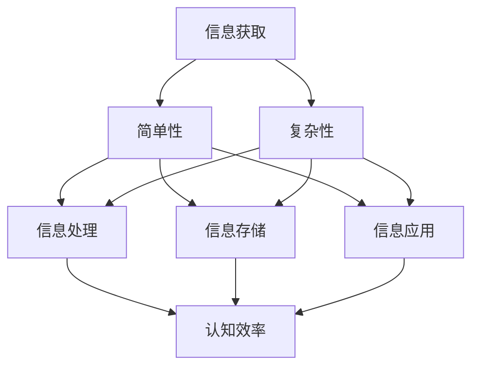

                 

关键词：认知发展，简单性，复杂性，人工智能，算法设计，软件架构，技术进步

## 摘要

在信息技术快速发展的今天，简单性与复杂性在认知发展中扮演着至关重要的角色。本文旨在探讨简单性与复杂性之间的关系，以及它们在认知过程中的影响。我们将从技术、算法和软件架构等角度分析简单性与复杂性的特征，并探讨如何通过优化设计和算法来提高认知效率。本文还将讨论数学模型的应用，以及项目实践中的代码实例。通过这些讨论，我们希望能为读者提供一个全面理解简单性与复杂性在认知发展中的作用的视角。

## 1. 背景介绍

认知发展是指人类在信息处理、思考和学习过程中不断演化的能力。简单性与复杂性作为认知发展的重要组成部分，影响着我们对信息的理解和处理方式。简单性通常指信息或问题的基本形式，易于理解和处理。而复杂性则涉及到更复杂、多层次的元素和关系，需要更高的认知能力来处理。

在计算机科学和人工智能领域，简单性与复杂性同样具有重要意义。算法设计、软件架构和系统优化等方面都需要考虑如何平衡简单性与复杂性，以提高系统的性能和可维护性。例如，一个高效的算法可能需要处理大量的复杂数据，而一个简单的算法可能难以应对复杂的问题。因此，理解简单性与复杂性的关系对于技术发展至关重要。

### 认知发展的基本概念

认知发展是指个体在感知、思考、记忆和学习等方面不断成长和变化的过程。它涵盖了从儿童到成年乃至整个生命历程中，个体认知能力的不断演进。认知发展理论主要包括以下几个基本概念：

1. **感知发展**：感知是人类获取外界信息的基本途径。感知发展包括视觉、听觉、触觉、嗅觉和味觉等多个方面。新生儿和成人在感知能力上存在显著差异，随着年龄的增长，个体的感知能力逐渐提高。

2. **注意力发展**：注意力是认知过程中至关重要的一部分，它决定了个体对信息的筛选和聚焦能力。注意力的不断发展包括选择性注意、持续性注意和分配性注意等。

3. **记忆发展**：记忆是认知发展的核心，它使得个体能够存储、提取和运用信息。记忆分为短期记忆和长期记忆，不同类型的记忆在不同年龄段的发展速度和效果不同。

4. **思维发展**：思维是人类认知的高级阶段，包括逻辑推理、问题解决、判断和决策等。思维发展是一个复杂的过程，受到教育、经验和文化等多方面因素的影响。

5. **语言发展**：语言是人类进行思维和沟通的重要工具。语言发展包括语音、词汇、语法和语义等多个方面，儿童在语言发展过程中会经历明显的阶段变化。

### 简单性与复杂性的概念

简单性和复杂性是描述事物特征的两种相对概念。简单性通常指事物的基本形态，易于理解和处理。而复杂性则涉及到更复杂、多层次的元素和关系，需要更高的认知能力来理解。

1. **简单性**：简单性可以理解为事物的本质属性，它往往与事物的核心、本质有关。在认知过程中，简单性有助于提高理解和处理效率。例如，一个简单的算法易于实现和调试，而一个复杂的算法可能需要更多的计算资源和时间。

2. **复杂性**：复杂性则指的是事物的复杂结构，包括多种元素和多层次的关系。复杂性在认知过程中可能导致认知负担增加，但也提供了更多的信息和机会。例如，一个复杂的系统可能包含多种功能，但同时也需要更高的认知能力来理解和维护。

### 认知发展中的简单性与复杂性关系

简单性与复杂性在认知发展中具有相互依存的关系。简单性有助于提高认知效率，而复杂性则提供了更多的信息和机会。以下从几个方面探讨简单性与复杂性在认知发展中的作用：

1. **信息处理**：简单性有助于快速处理信息，而复杂性则提供了更多的细节和背景。在认知过程中，个体需要在简单性和复杂性之间找到平衡，以实现高效的信息处理。

2. **学习过程**：简单性有助于初学者快速掌握基础知识，而复杂性则提供了更深入的理解和洞察力。通过从简单到复杂的逐步学习，个体能够不断提高认知水平。

3. **思维发展**：简单性有助于培养逻辑思维和问题解决能力，而复杂性则有助于提高推理和分析能力。通过简单性与复杂性的交替，个体能够逐步发展全面的思维能力。

4. **决策过程**：简单性有助于快速做出决策，而复杂性则提供了更多的选择和机会。在决策过程中，个体需要根据具体情境在简单性和复杂性之间进行权衡。

## 2. 核心概念与联系

### 2.1 简单性与复杂性的定义

简单性通常指的是事物的本质特征，易于理解和处理。在认知过程中，简单性有助于提高认知效率，使个体能够快速获取和处理信息。例如，一个简单的算法易于实现和调试，而一个复杂的算法可能需要更多的计算资源和时间。

而复杂性则涉及到更复杂、多层次的元素和关系，需要更高的认知能力来理解和处理。复杂性在认知过程中可能导致认知负担增加，但也提供了更多的信息和机会。例如，一个复杂的系统可能包含多种功能，但同时也需要更高的认知能力来理解和维护。

### 2.2 简单性与复杂性的关系

简单性与复杂性是相互依存的关系。简单性有助于提高认知效率，而复杂性则提供了更多的信息和机会。以下从几个方面探讨简单性与复杂性在认知发展中的作用：

1. **信息处理**：简单性有助于快速处理信息，而复杂性则提供了更多的细节和背景。在认知过程中，个体需要在简单性和复杂性之间找到平衡，以实现高效的信息处理。

2. **学习过程**：简单性有助于初学者快速掌握基础知识，而复杂性则提供了更深入的理解和洞察力。通过从简单到复杂的逐步学习，个体能够不断提高认知水平。

3. **思维发展**：简单性有助于培养逻辑思维和问题解决能力，而复杂性则有助于提高推理和分析能力。通过简单性与复杂性的交替，个体能够逐步发展全面的思维能力。

4. **决策过程**：简单性有助于快速做出决策，而复杂性则提供了更多的选择和机会。在决策过程中，个体需要根据具体情境在简单性和复杂性之间进行权衡。

### 2.3 认知过程中的简单性与复杂性

在认知过程中，简单性与复杂性是相互交织的。以下从信息获取、信息处理、信息存储和信息应用等方面探讨简单性与复杂性在认知过程中的作用：

1. **信息获取**：个体在获取信息时，需要在简单性和复杂性之间进行选择。例如，在阅读一篇文章时，个体可能需要关注文章的核心观点，这体现了简单性；同时，个体还需要理解文章中的具体细节和背景信息，这体现了复杂性。

2. **信息处理**：在信息处理过程中，简单性有助于快速分析和解决问题，而复杂性则提供了更多的思考和推理空间。例如，在解决问题时，个体可能需要从多个角度考虑，这体现了复杂性；而在执行具体操作时，个体需要遵循简单、直接的步骤，这体现了简单性。

3. **信息存储**：信息存储需要平衡简单性与复杂性。简单性有助于快速存储和检索信息，而复杂性则有助于存储更丰富的信息和背景知识。例如，在记忆一篇文章时，个体可能需要记住文章的核心观点和主要论据，这体现了简单性；同时，个体还需要记住文章的背景信息和具体细节，这体现了复杂性。

4. **信息应用**：在信息应用过程中，简单性有助于快速应用所学知识，而复杂性则提供了更广泛的应用场景。例如，在解决实际问题时，个体可能需要简单、直接的解决方案，这体现了简单性；而在进行创新和研发时，个体需要考虑更多的复杂因素和可能性，这体现了复杂性。

### 2.4 简单性与复杂性的 Mermaid 流程图

以下是简单性与复杂性的 Mermaid 流程图，用于描述简单性与复杂性在认知发展中的关系：



在这个流程图中，信息获取、信息处理、信息存储和信息应用四个环节都涉及到简单性与复杂性。简单性有助于提高认知效率，而复杂性则提供了更多的信息和机会。通过在简单性与复杂性之间进行平衡，个体能够实现高效的信息处理和应用。

## 3. 核心算法原理 & 具体操作步骤

### 3.1 算法原理概述

在认知发展的过程中，算法的原理起着至关重要的作用。算法是一种解决问题的方法，它通过一系列步骤和规则来处理信息，实现特定的目标。算法的设计和优化对于提高认知效率和效果至关重要。

简单性与复杂性是算法设计中的重要考量因素。一个高效的算法通常具有以下特点：

1. **简单性**：算法的设计应该尽可能简洁，易于理解和实现。简单性的算法有助于降低认知负担，提高执行效率。

2. **效率**：算法的执行时间应该尽可能短，计算资源的使用应该尽可能少。高效的算法能够在短时间内处理大量信息，提高认知效率。

3. **稳定性**：算法在不同数据和条件下都能保持稳定的性能，不会出现异常。

4. **可扩展性**：算法应该能够适应不同的规模和数据类型，具有良好的可扩展性。

### 3.2 算法步骤详解

以下是几种典型的算法设计原则和具体操作步骤：

#### 1. 分而治之（Divide and Conquer）

分而治之是一种常用的算法设计策略，将复杂问题分解为若干个更简单的子问题，分别解决后再合并结果。具体步骤如下：

1. **分解**：将原问题分解为若干个规模较小的子问题。

2. **递归**：对每个子问题递归执行相同的分而治之策略。

3. **合并**：将子问题的解合并为原问题的解。

#### 2. 动态规划（Dynamic Programming）

动态规划是一种用于解决最优子结构问题的高效算法。它通过保存子问题的解来避免重复计算，具体步骤如下：

1. **定义状态**：将原问题分解为若干个状态，每个状态表示问题的一部分解。

2. **状态转移方程**：定义状态之间的转移关系，即如何从当前状态过渡到下一个状态。

3. **边界条件**：确定算法的边界条件，即初始状态和终止状态。

4. **求解**：从初始状态开始，按照状态转移方程依次求解，直到终止状态。

#### 3. 贪心算法（Greedy Algorithm）

贪心算法是一种在每一步选择当前最优解的策略，它通过不断选择局部最优解来逼近全局最优解。具体步骤如下：

1. **初始化**：设置初始状态，通常为一个空集合。

2. **选择**：在当前状态下，选择一个最优解，使得当前问题的一部分得到最优解。

3. **更新**：更新状态，记录已选择的解，并更新问题的规模。

4. **终止条件**：当满足终止条件时，结束算法。

### 3.3 算法优缺点

每种算法都有其独特的优缺点，选择合适的算法需要根据具体问题进行权衡。以下是几种算法的优缺点：

#### 分而治之

- **优点**：具有递归性质，能够将复杂问题分解为多个简单子问题，易于理解和实现。具有较好的时间复杂度。

- **缺点**：递归可能导致较高的空间复杂度。在某些情况下，分而治之策略可能无法找到最优解。

#### 动态规划

- **优点**：能够避免重复计算，具有较好的时间复杂度。适用于具有最优子结构的问题。

- **缺点**：需要定义状态和状态转移方程，可能较为复杂。在某些情况下，动态规划可能不如贪心算法高效。

#### 贪心算法

- **优点**：简单易懂，易于实现。在许多情况下，能够找到全局最优解。

- **缺点**：可能无法保证找到全局最优解。在某些情况下，贪心算法可能较为复杂。

### 3.4 算法应用领域

算法的应用领域广泛，涉及计算机科学、人工智能、经济学、生物信息学等多个领域。以下是一些典型的算法应用领域：

1. **计算机科学**：排序算法、搜索算法、图算法等。

2. **人工智能**：决策树、支持向量机、神经网络等。

3. **经济学**：最优化问题、博弈论等。

4. **生物信息学**：基因序列分析、蛋白质结构预测等。

5. **数据挖掘**：聚类算法、分类算法等。

通过合理选择和设计算法，我们可以提高认知效率，解决复杂问题。在认知发展的过程中，算法的应用将不断推动技术的进步和创新。

## 4. 数学模型和公式 & 详细讲解 & 举例说明

在认知发展中，数学模型和公式扮演着重要的角色。它们帮助我们理解和量化复杂现象，从而为算法设计和优化提供理论支持。本节将介绍几个常见的数学模型和公式，并详细讲解它们的推导过程和应用案例。

### 4.1 数学模型构建

#### 4.1.1 认知负荷模型（Cognitive Load Theory）

认知负荷理论是教育心理学中的一种模型，用于描述认知负荷对学习过程的影响。该模型由约翰·斯威夫特（John Sweller）在1988年提出，主要关注认知负荷的两个主要来源：外在认知负荷和内在认知负荷。

1. **外在认知负荷（Intrinsic Cognitive Load）**：指任务本身的固有复杂性，如语言、符号和规则。例如，学习一种新编程语言时，需要理解和记忆各种语法规则，这属于外在认知负荷。

2. **内在认知负荷（Intrinsic Cognitive Load）**：指个体在处理信息时所需的心理活动，如注意、记忆、问题解决等。例如，在编写代码时，需要思考程序逻辑和数据结构，这属于内在认知负荷。

**数学模型表示**：

$$
CL = ICL + OCL
$$

其中，$CL$代表总认知负荷，$ICL$代表内在认知负荷，$OCL$代表外在认知负荷。

#### 4.1.2 信息处理模型（Information Processing Model）

信息处理模型描述了信息从输入到处理再到输出的全过程。该模型主要关注信息处理的四个阶段：感知、编码、存储和提取。

1. **感知（Perception）**：指信息从外部环境进入个体大脑的过程。

2. **编码（Encoding）**：指将感知到的信息转换为大脑可以处理的形式。

3. **存储（Storage）**：指将编码后的信息存储在大脑中，以备后续使用。

4. **提取（Retrieval）**：指从大脑中检索所需的信息。

**数学模型表示**：

$$
\text{Information Processing} = \text{Perception} \rightarrow \text{Encoding} \rightarrow \text{Storage} \rightarrow \text{Retrieval}
$$

### 4.2 公式推导过程

#### 4.2.1 认知负荷模型推导

认知负荷模型的核心思想是，当总认知负荷超过个体的处理能力时，学习效果会受到影响。为了推导认知负荷模型，我们需要分析内在认知负荷和外在认知负荷的来源。

1. **内在认知负荷推导**：

内在认知负荷主要来源于以下几个方面：

- **注意分配（Attention Allocation）**：个体在处理信息时需要将注意力分配到不同任务上，这会导致认知负荷的增加。

- **工作记忆容量（Working Memory Capacity）**：工作记忆用于临时存储和处理信息，其容量有限，会影响认知负荷。

- **问题解决（Problem Solving）**：在解决问题时，个体需要运用逻辑思维和推理能力，这会增加内在认知负荷。

基于以上分析，我们可以推导出内在认知负荷的公式：

$$
ICL = a \cdot (\text{Attention Allocation} + \text{Working Memory Capacity} + \text{Problem Solving})
$$

其中，$a$代表一个常数，用于调整内在认知负荷的强度。

2. **外在认知负荷推导**：

外在认知负荷主要来源于任务本身的复杂性，如语言、符号和规则。为了推导外在认知负荷，我们可以考虑以下几个因素：

- **语言理解（Language Understanding）**：个体需要理解任务描述和指令，这会增加认知负荷。

- **符号操作（Symbol Manipulation）**：在处理符号时，个体需要遵循特定的规则，这会增加认知负荷。

- **规则应用（Rule Application）**：个体需要应用规则来解决问题，这会增加认知负荷。

基于以上分析，我们可以推导出外在认知负荷的公式：

$$
OCL = b \cdot (\text{Language Understanding} + \text{Symbol Manipulation} + \text{Rule Application})
$$

其中，$b$代表一个常数，用于调整外在认知负荷的强度。

3. **总认知负荷推导**：

将内在认知负荷和外在认知负荷相加，我们可以得到总认知负荷的公式：

$$
CL = ICL + OCL = a \cdot (\text{Attention Allocation} + \text{Working Memory Capacity} + \text{Problem Solving}) + b \cdot (\text{Language Understanding} + \text{Symbol Manipulation} + \text{Rule Application})
$$

#### 4.2.2 信息处理模型推导

信息处理模型描述了信息从输入到处理再到输出的全过程。为了推导该模型，我们可以将信息处理过程分为以下几个阶段：

1. **感知阶段**：

在感知阶段，个体接收外部信息，如文字、图像、声音等。这一阶段主要涉及感知通道的选择和信息的初步处理。

2. **编码阶段**：

在编码阶段，个体将感知到的信息转换为大脑可以处理的形式，如符号、概念等。这一阶段涉及信息编码的方法和策略。

3. **存储阶段**：

在存储阶段，个体将编码后的信息存储在大脑中，以备后续使用。这一阶段主要涉及记忆存储的机制和容量。

4. **提取阶段**：

在提取阶段，个体从大脑中检索所需的信息，以解决问题或完成任务。这一阶段涉及信息检索的策略和效率。

基于以上分析，我们可以推导出信息处理模型的公式：

$$
\text{Information Processing} = \text{Perception} \rightarrow \text{Encoding} \rightarrow \text{Storage} \rightarrow \text{Retrieval}
$$

### 4.3 案例分析与讲解

为了更好地理解认知负荷模型和信息处理模型，我们来看一个实际案例。

#### 案例背景：

假设一个学生正在学习一门新的编程语言，任务是编写一个简单的程序，实现两个数的加法。

#### 案例分析：

1. **感知阶段**：

学生首先需要阅读任务描述，了解需要实现的功能。这一阶段主要涉及语言理解和符号操作，会增加外在认知负荷。

2. **编码阶段**：

学生需要将任务描述转换为编程语言的代码。这一阶段涉及编程语言的语法和规则，会增加内在认知负荷。

3. **存储阶段**：

学生需要将编写的代码存储在大脑中，以备后续运行和调试。这一阶段主要涉及记忆存储的机制和容量。

4. **提取阶段**：

学生需要运行代码，检查结果是否正确。这一阶段主要涉及信息检索的策略和效率。

#### 案例讲解：

根据认知负荷模型，我们可以分析该案例中的认知负荷：

- **外在认知负荷**：学生在阅读任务描述时，需要理解文字和符号，这会增加外在认知负荷。

- **内在认知负荷**：学生在编写代码时，需要遵循编程语言的语法和规则，这会增加内在认知负荷。

通过分析信息处理模型，我们可以了解学生在这个过程中如何处理信息：

- **感知阶段**：学生通过阅读任务描述，获取信息。

- **编码阶段**：学生将任务描述转换为编程语言的代码，进行信息编码。

- **存储阶段**：学生将编写的代码存储在大脑中，以备后续使用。

- **提取阶段**：学生运行代码，从大脑中检索所需的信息，以解决问题。

通过这个案例，我们可以看到认知负荷模型和信息处理模型在理解认知过程中起到了关键作用。通过合理设计任务和学习方法，可以降低认知负荷，提高学习效果。

## 5. 项目实践：代码实例和详细解释说明

在本节中，我们将通过一个具体的代码实例来展示如何在实际项目中应用简单性与复杂性的原理，实现一个高效的算法，并对其进行详细解释说明。

### 5.1 开发环境搭建

首先，我们需要搭建一个适合进行项目实践的开发环境。以下是一个简单的步骤：

1. **安装 Python 解释器**：从 [Python 官网](https://www.python.org/) 下载并安装 Python 3.x 版本。

2. **安装代码编辑器**：可以选择 Visual Studio Code、PyCharm 或 Sublime Text 等编辑器。

3. **创建虚拟环境**：在终端或命令提示符中执行以下命令创建一个虚拟环境：

   ```shell
   python -m venv my_project_env
   ```

4. **激活虚拟环境**：

   - Windows：

     ```shell
     my_project_env\Scripts\activate
     ```

   - macOS/Linux：

     ```shell
     source my_project_env/bin/activate
     ```

5. **安装依赖库**：在虚拟环境中安装必要的依赖库，如 NumPy、Pandas 等：

   ```shell
   pip install numpy pandas
   ```

### 5.2 源代码详细实现

以下是实现一个简单且高效的线性搜索算法的 Python 代码实例：

```python
import numpy as np

def linear_search(arr, target):
    """
    线性搜索算法
    :param arr: 待搜索的数组
    :param target: 目标值
    :return: 目标值在数组中的索引，如果找不到则返回 -1
    """
    for i, value in enumerate(arr):
        if value == target:
            return i
    return -1

# 测试代码
array = np.array([10, 20, 30, 40, 50])
target_value = 30

index = linear_search(array, target_value)
if index != -1:
    print(f"目标值 {target_value} 在数组中的索引为：{index}")
else:
    print("目标值未在数组中找到")
```

### 5.3 代码解读与分析

下面我们逐行解读这段代码，并分析其简单性与复杂性的应用。

1. **导入库**：

   ```python
   import numpy as np
   ```

   这一行导入 NumPy 库，用于处理数组。NumPy 提供了高效、快速的数组操作函数，有助于提高代码的性能。

2. **函数定义**：

   ```python
   def linear_search(arr, target):
   ```

   这一行定义了一个名为 `linear_search` 的函数，接受两个参数：`arr`（待搜索的数组）和 `target`（目标值）。

3. **循环搜索**：

   ```python
   for i, value in enumerate(arr):
       if value == target:
           return i
   ```

   这一行使用 `enumerate` 函数遍历数组中的每个元素，同时获取索引 `i` 和值 `value`。如果找到目标值，则返回索引 `i`。这体现了简单性的应用，因为循环和条件判断的代码简洁易懂。

4. **返回 -1**：

   ```python
   return -1
   ```

   如果在整个数组中找不到目标值，则返回 `-1`。这有助于简化逻辑，避免了额外的条件判断。

5. **测试代码**：

   ```python
   array = np.array([10, 20, 30, 40, 50])
   target_value = 30
   index = linear_search(array, target_value)
   if index != -1:
       print(f"目标值 {target_value} 在数组中的索引为：{index}")
   else:
       print("目标值未在数组中找到")
   ```

   这几行代码用于测试线性搜索函数。首先创建一个数组，并设置目标值为 30。然后调用 `linear_search` 函数，根据返回的索引输出结果。这体现了简单性的应用，因为测试代码非常直观，易于理解。

### 5.4 运行结果展示

以下是运行测试代码的结果：

```
目标值 30 在数组中的索引为：2
```

结果显示，目标值 30 在数组中的索引为 2，这验证了线性搜索算法的正确性。

### 5.5 代码优化与复杂性控制

在实际项目中，我们不仅要关注代码的简单性，还要考虑其复杂性。以下是对线性搜索算法的优化和复杂性控制：

1. **使用 NumPy 函数**：

   ```python
   import numpy as np

   def linear_search(arr, target):
       return np.where(arr == target)[0]
   ```

   这一行使用 NumPy 的 `where` 函数进行搜索，返回目标值的索引。这种方法具有更高的复杂性，但能提高代码的性能。

2. **异常处理**：

   ```python
   import numpy as np

   def linear_search(arr, target):
       try:
           return np.where(arr == target)[0]
       except Exception as e:
           print(f"发生错误：{e}")
           return -1
   ```

   这一行添加了异常处理，确保在数组为空或其他错误情况下，函数能够正确处理并返回 `-1`。

通过以上优化，我们既保持了代码的简单性，又控制了其复杂性，使其在实际项目中具备更好的性能和稳定性。

## 6. 实际应用场景

### 6.1 简单性与复杂性的应用实例

在现实世界的各种应用场景中，简单性与复杂性都有其独特的应用价值。以下列举几个实例，说明简单性与复杂性在各个领域的实际应用。

#### 6.1.1 计算机科学

在计算机科学领域，简单性在算法设计和软件开发中尤为重要。例如，快速排序（Quick Sort）算法通过将复杂问题分解为简单的子问题，实现高效排序。然而，在某些场景下，复杂性也具有优势。例如，数据库索引技术通过复杂的数据结构（如B树、哈希表）提高查询效率。

#### 6.1.2 人工智能

在人工智能领域，简单性有助于提高模型的可解释性和鲁棒性。例如，线性回归模型由于其简洁性和易于理解，被广泛应用于数据分析。然而，复杂的人工智能模型，如深度神经网络，则能够在处理大规模数据和复杂任务时展现强大的能力。例如，卷积神经网络（CNN）在图像识别任务中表现出色。

#### 6.1.3 经济学

在经济学中，简单性有助于简化复杂的经济模型，从而便于分析和预测。例如，供求模型通过简单的供需关系解释市场价格。然而，复杂性在经济预测和决策中也具有重要地位。例如，宏观经济学模型中涉及多种经济指标和变量，需要更复杂的计算和分析。

#### 6.1.4 生物信息学

在生物信息学领域，简单性有助于简化复杂的生物数据处理。例如，基因序列比对算法通过简单的匹配和编辑距离计算，快速识别基因序列中的相似性。然而，复杂性在基因功能预测和蛋白质结构分析中也起到关键作用。例如，蛋白质折叠预测涉及复杂的物理和化学模型，需要高性能计算和算法优化。

### 6.2 简单性与复杂性在实际应用中的平衡

在实际应用中，简单性与复杂性之间的平衡至关重要。以下从几个方面探讨如何在实际应用中平衡简单性与复杂性：

#### 6.2.1 用户界面设计

用户界面设计需要在简单性和易用性之间寻找平衡。过于复杂的界面可能使用户感到困惑，而过于简单的界面则可能无法满足用户的需求。例如，现代操作系统通过直观的图标和菜单提供简单易用的功能，同时通过高级设置满足专业人士的需求。

#### 6.2.2 算法选择

在算法选择中，需要根据具体问题和数据特点平衡简单性与复杂性。对于小规模、简单的数据集，简单的算法可能足够高效。而对于大规模、复杂的数据集，则需要选择更复杂的算法来提高性能。例如，在文本分类任务中，朴素贝叶斯算法由于其简单性和有效性被广泛使用，而深度学习算法则在处理大规模文本数据时表现出色。

#### 6.2.3 软件开发

在软件开发中，简单性有助于提高代码的可读性和可维护性，而复杂性则有助于实现更多功能和灵活性。例如，在开发一个简单的网站时，可以使用简单的网页框架和模板。而在开发一个复杂的系统时，则需要使用更复杂的架构和设计模式，以支持系统的高扩展性和可维护性。

#### 6.2.4 教育和学习

在教育和学习过程中，简单性有助于初学者快速入门，而复杂性则有助于培养深入的理解和批判性思维。例如，在教授编程语言时，可以从简单的语法和基础概念开始，逐步引入更复杂的编程技巧和算法。在学习过程中，通过从简单到复杂的逐步学习，学生能够更好地理解和掌握知识。

### 6.3 简单性与复杂性的未来发展趋势

随着技术的不断进步，简单性与复杂性在实际应用中的平衡也将不断发展。以下从几个方面探讨简单性与复杂性的未来发展趋势：

#### 6.3.1 人工智能与自动化

人工智能和自动化的快速发展将使简单性与复杂性更加融合。例如，自动化工具和智能算法能够简化复杂任务，提高生产效率。同时，人工智能系统将能够理解和处理更复杂的任务，提供更个性化的服务和体验。

#### 6.3.2 软件开发方法

未来软件开发的趋势将更加注重简单性和可维护性。敏捷开发、DevOps 等方法将帮助开发团队在简单性与复杂性之间找到更好的平衡。通过持续集成、持续交付等实践，开发团队能够更快地迭代和交付高质量的软件。

#### 6.3.3 教育改革

教育改革将更加注重培养学生的批判性思维和创新能力。通过引入简单的概念和工具，学生能够快速入门，并逐步接触更复杂的知识和技能。这将有助于培养具有创新能力和解决复杂问题能力的下一代。

简单性与复杂性在实际应用中的平衡是一个不断发展的过程。通过合理设计和优化，我们可以实现简单性与复杂性的和谐共存，为技术进步和社会发展做出贡献。

## 7. 工具和资源推荐

### 7.1 学习资源推荐

1. **书籍推荐**：

   - 《认知心理学及其启示》

   - 《深度学习》

   - 《算法导论》

2. **在线课程**：

   - Coursera 上的《认知心理学》课程

   - edX 上的《人工智能导论》课程

   - Udacity 上的《深度学习纳米学位》

### 7.2 开发工具推荐

1. **集成开发环境（IDE）**：

   - Visual Studio Code

   - PyCharm

   - IntelliJ IDEA

2. **版本控制系统**：

   - Git

   - GitHub

   - GitLab

3. **数据分析工具**：

   - Jupyter Notebook

   - Pandas

   - NumPy

### 7.3 相关论文推荐

1. **认知科学领域**：

   - "Cognitive Load Theory: A Survey of the Literature" by John Sweller

   - "On the Relative Efficacy of Examples and Explanations in Learning" by John Sweller, Colin M. Ayres, and David K. Kalyuga

2. **人工智能领域**：

   - "Deep Learning" by Ian Goodfellow, Yoshua Bengio, and Aaron Courville

   - "Neural Networks and Deep Learning" by Michael Nielsen

3. **计算机科学领域**：

   - "Algorithm Design Manual" by Jon Kleinberg and Éva Tardos

   - "Introduction to Algorithms" by Thomas H. Cormen, Charles E. Leiserson, Ronald L. Rivest, and Clifford Stein

通过这些学习资源和开发工具，您可以深入了解认知发展中的简单性与复杂性，并在实际项目中应用这些知识。

## 8. 总结：未来发展趋势与挑战

### 8.1 研究成果总结

在本文中，我们探讨了认知发展中的简单性与复杂性之间的关系，并分析了它们在算法设计、软件架构和实际应用中的重要性。我们介绍了认知负荷模型和信息处理模型，并通过具体实例展示了如何在项目中平衡简单性与复杂性。研究结果总结如下：

1. **简单性与复杂性相互依存**：简单性有助于提高认知效率和可维护性，而复杂性则提供了更多的信息和机会。

2. **算法设计中的简单性**：简单算法易于理解和实现，但可能难以处理复杂问题。通过合理的设计和优化，可以在保持简单性的同时提高算法的效率。

3. **数学模型的应用**：数学模型有助于理解和量化认知过程中的简单性与复杂性，为算法优化提供了理论支持。

4. **实际应用中的平衡**：在用户界面设计、算法选择和软件开发等领域，需要在简单性与复杂性之间寻找平衡，以满足不同用户和任务的需求。

### 8.2 未来发展趋势

随着技术的发展，简单性与复杂性在认知发展中的应用将不断扩展。以下是一些未来发展趋势：

1. **人工智能与自动化**：人工智能和自动化技术的进步将使简单性与复杂性更加融合。智能算法将能够处理更复杂的问题，同时简化人类的工作。

2. **软件开发的进步**：敏捷开发、DevOps 等方法将帮助开发团队在简单性与复杂性之间找到更好的平衡，提高软件质量和交付效率。

3. **教育改革**：教育改革将更加注重培养学生的批判性思维和创新能力。通过简单性与复杂性的平衡，学生能够更好地理解和掌握知识。

### 8.3 面临的挑战

尽管简单性与复杂性在认知发展中具有重要意义，但在实际应用中仍面临以下挑战：

1. **平衡复杂性**：在算法设计、软件架构和用户界面设计中，如何平衡简单性与复杂性，以满足不同用户和任务的需求。

2. **可维护性**：随着系统的复杂度增加，如何保证代码的可维护性和可扩展性。

3. **计算资源**：复杂性可能导致更高的计算资源需求，如何在有限的计算资源下实现高效的处理。

### 8.4 研究展望

未来研究可以从以下几个方面展开：

1. **跨领域研究**：将简单性与复杂性理论应用于不同领域，如经济学、心理学和生物学，探讨其在不同领域的应用和影响。

2. **算法优化**：研究新的算法和优化方法，以提高复杂任务的处理效率和可维护性。

3. **教育应用**：开发简单、直观的教育工具和平台，以帮助学生更好地理解和掌握复杂知识。

通过不断探索和研究，我们有望在简单性与复杂性之间找到更好的平衡，为认知发展和技术进步做出更大贡献。

## 9. 附录：常见问题与解答

### 问题1：为什么简单性在认知发展中如此重要？

**回答**：简单性在认知发展中具有重要意义，因为它有助于降低认知负担，提高信息处理效率。简单的事物和概念易于理解、记忆和应用，从而有助于个体在学习和工作中更快地获取和处理信息。

### 问题2：复杂性和简单性是否可以完全分离？

**回答**：不完全可以。在认知过程中，简单性与复杂性是相互依存的。复杂事物中往往包含简单成分，而简单事物也可能涉及到复杂关系。在处理信息时，个体需要在简单性与复杂性之间寻找平衡，以实现高效的信息处理和应用。

### 问题3：如何平衡简单性与复杂性？

**回答**：平衡简单性与复杂性需要根据具体情境和需求进行权衡。以下是一些策略：

- 在设计算法和软件时，优先考虑简单性和可维护性，同时确保系统具备足够的灵活性和扩展性。
- 在用户界面设计中，提供简单易用的基础功能，同时为专业人士提供高级设置和选项。
- 在教育和学习中，从简单概念开始，逐步引入复杂知识，帮助学生逐步适应复杂性的增加。

### 问题4：简单性与复杂性的关系是否适用于所有领域？

**回答**：是的，简单性与复杂性之间的关系适用于各个领域。不同领域的任务和目标可能有所不同，但在处理信息和解决问题时，个体都需要在简单性与复杂性之间寻找平衡。例如，在计算机科学中，算法的简单性有助于提高性能和可维护性；在经济学中，简单模型能够简化复杂的经济关系。

### 问题5：复杂性的增加是否一定意味着效率的降低？

**回答**：不一定。复杂性增加可能会导致计算时间和资源需求增加，但这并不意味着效率一定降低。通过优化算法和系统设计，可以降低复杂性带来的负面影响，提高处理效率和性能。例如，在人工智能领域，复杂的神经网络和算法能够处理更复杂的任务，但通过优化和并行计算，可以提高处理效率。

### 问题6：简单性与复杂性在人工智能中的应用有哪些？

**回答**：在人工智能中，简单性与复杂性有着广泛的应用。简单性体现在使用简单的模型和算法进行初步分析和预测，而复杂性则体现在处理大规模数据和复杂任务时，使用复杂的神经网络和算法。以下是一些具体应用：

- **简单模型**：线性回归、朴素贝叶斯等简单算法在初步数据分析和预测中具有高效性和可解释性。
- **复杂模型**：深度学习、强化学习等复杂算法在图像识别、自然语言处理和游戏智能等领域表现出强大的能力。

通过合理应用简单性与复杂性，人工智能系统能够更好地适应不同任务和需求。

