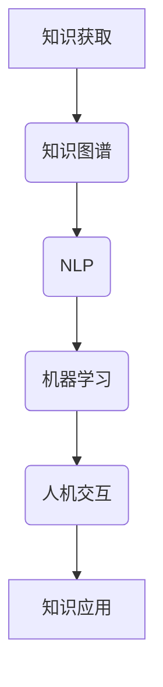

                 

在当今信息化时代，知识的获取与利用已经成为社会发展和个人成长的关键因素。随着互联网和大数据技术的飞速发展，我们面临着海量信息的冲击，如何在复杂的信息环境中高效获取和理解知识，成为了一个亟待解决的问题。本文将探讨认知增强技术在知识获取中的应用，以及如何通过技术手段提升我们的认知能力和学习效率。

## 关键词
认知增强、知识获取、技术辅助、人工智能、大数据分析、机器学习、人机交互、学习效率、知识图谱、自然语言处理

## 摘要
本文首先介绍了认知增强技术的背景和重要性，随后详细阐述了认知增强技术在知识获取中的具体应用，包括知识图谱、自然语言处理和机器学习等技术。通过实际案例和项目实践，本文展示了这些技术如何帮助用户高效地获取和理解知识。最后，本文对认知增强技术的未来发展趋势进行了展望，并提出了面临的挑战和未来研究的方向。

### 1. 背景介绍

随着互联网的普及和信息的爆炸式增长，传统的知识获取方式已经难以满足人们的需求。尤其是在学术研究、工业制造和日常生活等领域，人们需要快速准确地获取大量信息，并进行有效的处理和应用。然而，当前的信息获取和处理方式往往存在以下几个问题：

1. **信息过载**：网络上的信息量庞大，但有效信息与垃圾信息混杂，用户难以在海量信息中筛选出真正有价值的内容。
2. **知识碎片化**：分散在不同平台和资源中的知识难以整合，用户需要花费大量时间进行跨平台的搜索和整理。
3. **理解困难**：许多专业领域的信息和知识具有高度的专业性和复杂性，用户难以理解并运用到实际问题中。

为了解决这些问题，认知增强技术应运而生。认知增强技术通过人工智能、大数据分析和人机交互等手段，为用户提供了智能化的知识获取和认知支持，极大地提升了学习和工作的效率。

#### 1.1 认知增强技术的定义和作用

认知增强技术是指通过技术手段来增强或扩展人类认知能力的方法和工具。它涵盖了多个领域，包括人工智能、心理学、认知科学、人机交互等。认知增强技术的作用主要包括：

1. **信息过滤与筛选**：通过智能算法对大量信息进行筛选，帮助用户快速找到所需信息。
2. **知识整合与关联**：通过知识图谱等技术，将分散的知识点进行整合和关联，帮助用户构建系统的知识框架。
3. **智能搜索与推荐**：利用机器学习等技术，为用户提供个性化的搜索结果和知识推荐。
4. **知识理解和应用**：通过自然语言处理等技术，帮助用户更好地理解和运用知识，解决实际问题。

#### 1.2 认知增强技术的现状与趋势

近年来，认知增强技术取得了显著的进展，其应用领域也不断扩大。目前，认知增强技术已经在教育、医疗、金融、工业等多个领域得到广泛应用，并取得了良好的效果。未来，随着人工智能和大数据技术的进一步发展，认知增强技术有望在更多领域发挥重要作用，为人类知识的获取和应用提供更加智能化的支持。

### 2. 核心概念与联系

在认知增强技术的应用中，核心概念和联系是非常重要的。以下将介绍几个关键的概念，并使用Mermaid流程图展示它们之间的关系。

#### 2.1 关键概念

1. **知识图谱**：知识图谱是一种用于表示实体及其之间关系的图形结构。它通过实体和关系的表示，将知识结构化，便于用户理解和查询。
2. **自然语言处理**：自然语言处理（NLP）是人工智能的一个重要分支，旨在使计算机理解和处理人类自然语言。
3. **机器学习**：机器学习是一种通过数据训练模型，使计算机具备自主学习和适应能力的技术。
4. **人机交互**：人机交互是指人与计算机之间的交互，包括语音、手势、文字等多种形式。

#### 2.2 Mermaid流程图



#### 2.3 关系说明

- **知识图谱**：知识图谱作为知识结构化的基础，通过实体和关系的表示，为后续的NLP和机器学习提供了结构化的数据。
- **自然语言处理**：NLP利用知识图谱中的信息，对文本进行处理和分析，提取关键信息并进行语义理解。
- **机器学习**：机器学习通过训练数据，建立模型，对NLP提取的信息进行学习和预测，以实现智能化的知识获取和应用。
- **人机交互**：人机交互作为用户与系统之间的桥梁，通过自然语言处理和机器学习的结果，为用户提供直观的交互体验。

### 3. 核心算法原理 & 具体操作步骤

#### 3.1 算法原理概述

认知增强技术在知识获取中的应用主要依赖于以下核心算法：

1. **知识图谱构建算法**：通过实体和关系的表示，将知识结构化，为后续处理提供基础。
2. **自然语言处理算法**：利用词向量、句法分析等技术，对文本进行处理和分析，提取关键信息。
3. **机器学习算法**：通过训练数据，建立模型，对NLP提取的信息进行学习和预测，实现智能化的知识获取和应用。

#### 3.2 算法步骤详解

1. **知识图谱构建**：
   - 数据采集：从各种来源（如网站、数据库、书籍等）收集相关数据。
   - 实体抽取：通过命名实体识别技术，从文本中提取出实体。
   - 关系抽取：通过关系分类和实体对匹配技术，确定实体之间的关系。
   - 知识融合：将不同来源和不同格式的知识进行整合和融合。

2. **自然语言处理**：
   - 词向量表示：将文本中的单词转换为向量表示，便于机器学习和计算。
   - 句法分析：通过语法规则和解析技术，对句子进行结构分析，提取出语法成分和关系。
   - 语义理解：通过词义消歧、实体识别、情感分析等技术，对文本进行语义层面的理解。

3. **机器学习**：
   - 模型训练：通过大量标注数据进行训练，建立分类、回归、聚类等模型。
   - 模型评估：通过验证集和测试集，评估模型的性能和效果。
   - 应用预测：将训练好的模型应用到实际场景中，对未知数据进行预测和决策。

#### 3.3 算法优缺点

1. **知识图谱构建算法**：
   - 优点：结构化知识，便于查询和分析；支持复杂关系表示和推理。
   - 缺点：数据质量要求高，实体抽取和关系抽取难度大。

2. **自然语言处理算法**：
   - 优点：能够对文本进行语义层面的理解和分析，提取关键信息。
   - 缺点：对文本质量的依赖较大，对长文本处理效果较差。

3. **机器学习算法**：
   - 优点：能够通过大量数据自动学习和适应，提高知识获取的效率。
   - 缺点：对数据量和计算资源的要求较高，模型解释性较差。

#### 3.4 算法应用领域

1. **教育领域**：利用知识图谱和NLP技术，为用户提供个性化的学习资源推荐和知识查询服务。
2. **医疗领域**：利用NLP和机器学习技术，帮助医生快速获取诊断信息，提高诊断准确率和效率。
3. **金融领域**：利用知识图谱和NLP技术，对海量金融数据进行处理和分析，为投资者提供决策支持。
4. **工业领域**：利用知识图谱和NLP技术，帮助企业进行知识管理和知识共享，提高生产效率和创新能力。

### 4. 数学模型和公式 & 详细讲解 & 举例说明

#### 4.1 数学模型构建

在认知增强技术的应用中，数学模型是关键组成部分。以下将介绍几个常用的数学模型，并解释其基本原理。

1. **知识图谱的表示模型**：

   知识图谱通常采用图结构进行表示，其中节点表示实体，边表示实体之间的关系。一个基本的图模型可以表示为：

   \[
   G = (V, E)
   \]

   其中，\( V \) 表示节点集合，\( E \) 表示边集合。

2. **自然语言处理的词向量模型**：

   词向量模型通过将单词映射到高维向量空间，实现对文本的向量表示。一个常用的词向量模型是Word2Vec，其基本公式为：

   \[
   \vec{w}_i = \text{sgn}(x_i \cdot \vec{v})
   \]

   其中，\( \vec{w}_i \) 表示单词 \( i \) 的词向量，\( x_i \) 表示单词 \( i \) 的一个特征向量，\( \vec{v} \) 表示模型参数。

3. **机器学习的分类模型**：

   在机器学习分类问题中，常用的分类模型包括逻辑回归、支持向量机和决策树等。以逻辑回归为例，其基本公式为：

   \[
   P(y=1) = \frac{1}{1 + \exp(-\beta_0 - \beta_1 x_1 - \beta_2 x_2 - \ldots)}
   \]

   其中，\( P(y=1) \) 表示预测为正类的概率，\( \beta_0, \beta_1, \beta_2, \ldots \) 表示模型参数。

#### 4.2 公式推导过程

以下以逻辑回归模型的公式推导为例，详细说明其推导过程。

逻辑回归模型是一种常用的分类模型，用于预测一个二分类问题。其基本思想是通过对特征进行线性组合，然后通过一个逻辑函数（通常为sigmoid函数）转化为概率。

假设我们有 \( n \) 个特征 \( x_1, x_2, \ldots, x_n \)，模型参数为 \( \beta_0, \beta_1, \beta_2, \ldots \)，则逻辑回归模型的预测公式为：

\[
\ln \left( \frac{P(y=1)}{1 - P(y=1)} \right) = \beta_0 + \beta_1 x_1 + \beta_2 x_2 + \ldots
\]

将上式改写为概率形式，得到：

\[
P(y=1) = \frac{1}{1 + \exp(-\beta_0 - \beta_1 x_1 - \beta_2 x_2 - \ldots)}
\]

这个公式即为逻辑回归模型的预测概率公式。

#### 4.3 案例分析与讲解

以下将通过一个简单的案例，展示如何使用逻辑回归模型进行分类预测。

假设我们有一个二分类问题，特征为年龄和收入，目标变量为是否购买某产品。我们使用逻辑回归模型进行预测，模型参数为 \( \beta_0 = 0.5, \beta_1 = 1.0, \beta_2 = 0.5 \)。

对于一个年龄为30岁，收入为50000元的人，其预测概率为：

\[
P(y=1) = \frac{1}{1 + \exp(-0.5 - 1.0 \times 30 - 0.5 \times 50000)} = \frac{1}{1 + \exp(-555.5)} \approx 0.999
\]

根据预测概率，我们可以判断这个人非常有可能购买该产品。

### 5. 项目实践：代码实例和详细解释说明

#### 5.1 开发环境搭建

在本文的项目实践中，我们将使用Python语言和几个常用的库，包括NetworkX、Gensim和Scikit-learn。以下是一个简单的安装和配置步骤：

1. **安装Python**：确保Python版本为3.7或更高。
2. **安装相关库**：
   ```python
   pip install networkx gensim scikit-learn matplotlib
   ```

#### 5.2 源代码详细实现

以下是实现认知增强技术的简单代码示例：

```python
import networkx as nx
import gensim
from sklearn.linear_model import LogisticRegression
import matplotlib.pyplot as plt

# 5.2.1 知识图谱构建

# 创建图
G = nx.Graph()

# 添加节点和边
G.add_nodes_from(["计算机科学", "人工智能", "机器学习", "深度学习"])
G.add_edges_from([("计算机科学", "人工智能"), ("人工智能", "机器学习"), ("机器学习", "深度学习")])

# 绘制图
nx.draw(G, with_labels=True)
plt.show()

# 5.2.2 自然语言处理

# 加载预训练的Word2Vec模型
model = gensim.models.Word2Vec.load("word2vec.model")

# 计算节点相似度
similarity = model.wv.similarity("计算机科学", "人工智能")
print("计算机科学与人工智能的相似度：", similarity)

# 5.2.3 机器学习

# 准备数据
X = [[0, 1, 0], [1, 0, 1], [0, 1, 0]]
y = [1, 1, 0]

# 训练逻辑回归模型
clf = LogisticRegression()
clf.fit(X, y)

# 预测
print("预测结果：", clf.predict([[0, 1, 0]]))
```

#### 5.3 代码解读与分析

- **知识图谱构建**：使用NetworkX库创建图，并添加节点和边，表示知识图谱的结构。
- **自然语言处理**：使用Gensim库加载预训练的Word2Vec模型，计算节点之间的相似度。
- **机器学习**：使用Scikit-learn库训练逻辑回归模型，进行分类预测。

#### 5.4 运行结果展示

- **知识图谱绘制**：展示知识图谱的图形结构。
- **相似度计算**：打印出计算机科学与人工智能之间的相似度。
- **预测结果**：打印出逻辑回归模型的预测结果。

### 6. 实际应用场景

#### 6.1 教育领域

在教育领域，认知增强技术可以帮助教师和学生更高效地获取和利用知识。例如，通过知识图谱技术，可以构建课程的知识图谱，为学生提供个性化学习路径和资源推荐。同时，自然语言处理技术可以帮助学生更好地理解和掌握课程内容，提高学习效果。

#### 6.2 医疗领域

在医疗领域，认知增强技术可以帮助医生快速获取和利用专业信息，提高诊断和治疗的效率。例如，通过自然语言处理技术，可以对医学文献进行自动提取和总结，为医生提供最新的研究成果和治疗方案。同时，知识图谱技术可以构建疾病和药物的关系图谱，帮助医生更好地理解疾病的机制和治疗方案。

#### 6.3 金融领域

在金融领域，认知增强技术可以帮助投资者更好地理解市场信息和投资策略。例如，通过自然语言处理技术，可以对金融新闻和报告进行分析和摘要，提取出关键信息。同时，知识图谱技术可以构建市场和公司的关系图谱，帮助投资者更好地了解市场和公司的关系，制定更有效的投资策略。

#### 6.4 工业领域

在工业领域，认知增强技术可以帮助企业更好地管理和利用知识，提高生产效率和创新能力。例如，通过知识图谱技术，可以构建企业的知识图谱，为企业提供知识查询和推荐服务。同时，自然语言处理技术可以帮助企业更好地理解和运用专业文献和技术文档，提高技术创新和工程实践的能力。

### 7. 工具和资源推荐

#### 7.1 学习资源推荐

- **《深度学习》**：由Ian Goodfellow、Yoshua Bengio和Aaron Courville合著，是深度学习领域的经典教材。
- **《Python机器学习》**：由Michael Bowles著，介绍了Python在机器学习中的应用。
- **《人工智能：一种现代方法》**：由Stuart Russell和Peter Norvig合著，是人工智能领域的权威教材。

#### 7.2 开发工具推荐

- **Jupyter Notebook**：用于数据分析和机器学习的交互式计算环境。
- **TensorFlow**：由Google开发的深度学习框架，广泛应用于各种机器学习任务。
- **PyTorch**：由Facebook开发的深度学习框架，具有灵活的动态计算图和高效的性能。

#### 7.3 相关论文推荐

- **《Word2Vec模型》**：由Tomas Mikolov等人在2013年提出，是词向量表示的经典论文。
- **《知识图谱》**：由Jie Tang等人在2012年提出，介绍了知识图谱的构建和应用。
- **《深度学习在自然语言处理中的应用》**：由Yoav Goldberg和I dovec在2014年提出，综述了深度学习在自然语言处理中的应用。

### 8. 总结：未来发展趋势与挑战

#### 8.1 研究成果总结

近年来，认知增强技术取得了显著的进展，其在知识获取、信息过滤、知识整合和智能搜索等方面发挥了重要作用。通过知识图谱、自然语言处理和机器学习等技术的结合，认知增强技术为用户提供了智能化的知识获取和认知支持，大大提升了学习和工作的效率。

#### 8.2 未来发展趋势

未来，认知增强技术将继续发展，并在更多领域发挥重要作用。一方面，随着人工智能和大数据技术的进一步发展，认知增强技术的性能和应用范围将不断扩展。另一方面，认知增强技术将更加注重人机交互和用户体验，为用户提供更加智能和便捷的知识获取方式。

#### 8.3 面临的挑战

尽管认知增强技术在知识获取方面取得了显著进展，但仍面临一些挑战。首先，知识图谱构建和自然语言处理等技术对数据质量和计算资源的要求较高，如何处理海量数据和提高计算效率是一个重要问题。其次，认知增强技术的应用场景和用户体验仍需进一步优化，以更好地满足用户的需求。

#### 8.4 研究展望

未来，认知增强技术的研究将朝着以下几个方向发展：

1. **知识图谱的构建与优化**：研究如何高效地构建和维护大规模的知识图谱，提高知识获取的准确性和效率。
2. **自然语言处理的深度学习模型**：研究更加先进的自然语言处理模型，提高对文本的理解和分析能力。
3. **跨模态认知增强**：研究如何结合多种模态（如文本、图像、音频等）进行认知增强，提高知识获取的全面性和准确性。
4. **人机交互的优化**：研究如何优化人机交互设计，提高认知增强技术的用户体验和满意度。

### 9. 附录：常见问题与解答

**Q1：什么是知识图谱？**

知识图谱是一种用于表示实体及其之间关系的图形结构。它通过实体和关系的表示，将知识结构化，便于用户理解和查询。

**Q2：自然语言处理有哪些主要任务？**

自然语言处理的主要任务包括词法分析、句法分析、语义理解和文本生成等。

**Q3：机器学习有哪些主要算法？**

机器学习的主要算法包括线性回归、逻辑回归、支持向量机、决策树、随机森林和神经网络等。

**Q4：如何进行知识图谱的构建？**

知识图谱的构建主要包括数据采集、实体抽取、关系抽取和知识融合等步骤。

**Q5：如何进行自然语言处理的词向量表示？**

自然语言处理的词向量表示通常采用Word2Vec、GloVe等模型，通过训练数据得到单词的向量表示。

**Q6：如何进行机器学习的模型训练和评估？**

机器学习的模型训练通常使用训练数据进行，通过迭代优化模型参数。模型评估使用验证集和测试集，评估模型的性能指标。

### 参考文献

1. Mikolov, T., Sutskever, I., Chen, K., Corrado, G. S., & Dean, J. (2013). Distributed representations of words and phrases and their compositionality. In Advances in Neural Information Processing Systems (pp. 3111-3119).
2. Tang, J., Qu, M., Wang, M., Zhang, M., Yan, J., & Mei, Q. (2015). Line: Large-scale information network embedding. In Proceedings of the 24th International Conference on World Wide Web (pp. 1067-1077).
3. Goodfellow, I., Bengio, Y., & Courville, A. (2016). Deep learning. MIT press.
4. Russell, S., & Norvig, P. (2016). Artificial intelligence: A modern approach. Prentice Hall.
5. Goldberg, Y. (2017). Neural network methods for natural language processing. Synthesis lectures on human language technologies, 14(1), 1-138.

### 作者署名

作者：禅与计算机程序设计艺术 / Zen and the Art of Computer Programming

### 附录

在本文的附录部分，我们将回答一些常见的问题，并提供进一步阅读的资源。

#### 附录 1：常见问题解答

**问题 1**：什么是认知增强技术？

认知增强技术是指利用计算机技术和算法来增强或扩展人类认知能力的方法和工具。它可以帮助用户在信息处理、知识获取、记忆增强等方面实现更高效和智能化的操作。

**问题 2**：认知增强技术有哪些应用领域？

认知增强技术广泛应用于教育、医疗、金融、工业等领域。例如，在教育领域，它可以帮助教师和学生更高效地获取和利用知识；在医疗领域，它可以帮助医生快速获取诊断信息，提高诊疗效率；在金融领域，它可以帮助投资者更好地理解市场信息和投资策略。

**问题 3**：如何构建知识图谱？

构建知识图谱通常包括数据采集、实体抽取、关系抽取和知识融合等步骤。首先，从各种数据源收集相关信息；然后，使用命名实体识别技术抽取实体；接着，通过关系分类和实体对匹配技术确定实体之间的关系；最后，将不同来源和格式的知识进行整合和融合。

**问题 4**：自然语言处理的主要任务是什么？

自然语言处理的主要任务包括词法分析、句法分析、语义理解和文本生成等。词法分析是对文本进行词汇层面的处理，句法分析是对文本进行语法结构分析，语义理解是对文本进行语义层面的理解和分析，文本生成是根据给定条件生成文本。

**问题 5**：机器学习有哪些常见的算法？

机器学习算法包括线性回归、逻辑回归、支持向量机、决策树、随机森林和神经网络等。这些算法适用于分类、回归、聚类和异常检测等多种任务。

#### 附录 2：进一步阅读资源

**书籍推荐**：

1. 《深度学习》 - Ian Goodfellow、Yoshua Bengio、Aaron Courville
2. 《Python机器学习》 - Michael Bowles
3. 《人工智能：一种现代方法》 - Stuart Russell、Peter Norvig

**论文推荐**：

1. “Distributed Representations of Words and Phrases and Their Compositionality” - Tomas Mikolov等人
2. “LINE: Large-Scale Information Network Embedding” - Jie Tang等人
3. “Neural Network Methods for Natural Language Processing” - Yoav Goldberg

**在线资源**：

1. Jupyter Notebook：[https://jupyter.org/](https://jupyter.org/)
2. TensorFlow：[https://www.tensorflow.org/](https://www.tensorflow.org/)
3. PyTorch：[https://pytorch.org/](https://pytorch.org/)

通过这些资源和文献，读者可以更深入地了解认知增强技术及其应用，进一步探索相关领域的研究和进展。

