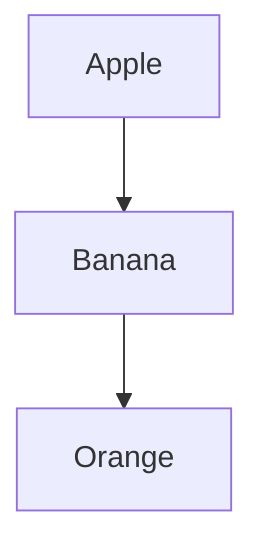

                 

关键词：认知映射、可视化思维、思维过程、思维工具、图形符号、信息可视化

> 摘要：本文将探讨认知映射在可视化思维过程中的作用。通过引入图形符号和信息可视化技术，我们能够更有效地将复杂的思维过程和概念进行结构化和可视化，从而提升思维效率和创造力。本文将详细阐述认知映射的概念、核心原理以及实际应用场景，并探讨其未来发展趋势和挑战。

## 1. 背景介绍

随着信息技术的飞速发展，我们面临的信息量日益庞大，传统的文字描述和线性思维已经难以应对复杂的知识体系和复杂的任务。为了更好地理解和处理这些复杂信息，我们需要借助一种更加直观、高效的方式来表达和传递知识。可视化思维作为一种新兴的思维工具，正逐渐成为现代认知研究和实践的重要方向。

认知映射（cognitive mapping）是一种将思维过程和概念结构可视化的方法。它通过图形符号和信息可视化技术，将抽象的思维过程和概念以直观、易理解的方式展现出来。这种方法不仅能够帮助人们更好地理解和记忆信息，还能够激发创新思维和解决问题的能力。

## 2. 核心概念与联系

### 2.1 认知映射的概念

认知映射是指将思维过程和概念结构以图形化的方式呈现的过程。它包括以下几个核心要素：

- **思维过程**：认知映射是对思维活动的描述和模拟。它包括感知、理解、推理、记忆等心理过程。
- **图形符号**：图形符号是认知映射的视觉表现形式。它们可以是简单的线条、几何形状、颜色等。
- **信息可视化**：信息可视化是将复杂的信息以图形化的方式展现出来，使其更加直观、易懂。

### 2.2 认知映射的架构

认知映射的架构包括以下几个关键部分：

- **输入层**：包括感知信息和思维过程的信息。
- **处理层**：对输入信息进行加工、分析和整合，形成结构化的知识。
- **输出层**：以图形化的方式呈现处理结果，实现信息的可视化。


### 2.3 核心原理

认知映射的核心原理是基于人类大脑的自然认知方式。人类大脑具有很强的视觉处理能力，通过图形化的方式展现信息，可以更有效地激活大脑的视觉处理区域，增强记忆效果。同时，图形符号和信息可视化技术能够帮助人们快速捕捉和理解关键信息，提高思维效率。

## 3. 核心算法原理 & 具体操作步骤

### 3.1 算法原理概述

认知映射算法的核心思想是将抽象的思维过程和概念结构转化为直观、易理解的图形化表示。具体步骤如下：

1. **信息收集**：收集相关的思维过程和概念信息。
2. **信息处理**：对收集到的信息进行加工、分析和整合。
3. **图形表示**：将处理结果以图形化的方式呈现。
4. **优化调整**：根据反馈对图形表示进行优化调整。

### 3.2 算法步骤详解

1. **信息收集**：首先，我们需要明确要映射的思维过程和概念。这可以通过阅读相关文献、与领域专家交流等方式实现。

2. **信息处理**：在收集到信息后，我们需要对其进行加工、分析和整合。这包括对信息进行分类、提取关键信息、构建概念模型等。

3. **图形表示**：在处理完信息后，我们需要将其以图形化的方式呈现。这可以通过使用图形符号、颜色、线条等手段实现。

4. **优化调整**：在图形表示完成后，我们需要根据实际情况进行优化调整。这包括对图形进行简化、美化、调整布局等。

### 3.3 算法优缺点

**优点**：

- **直观易懂**：通过图形化的方式呈现信息，使得思维过程和概念结构更加直观、易懂。
- **提高效率**：通过结构化和可视化，能够快速捕捉和理解关键信息，提高思维效率。
- **促进创新**：认知映射能够激发创新思维，帮助人们发现新的问题和解决方案。

**缺点**：

- **复杂性**：对于复杂的思维过程和概念，认知映射可能需要较长的时间和技术支持。
- **准确性**：图形化的表示可能无法完全准确地反映思维过程和概念的本质。

### 3.4 算法应用领域

认知映射算法在多个领域都有广泛的应用：

- **科学研究**：帮助科研人员更好地理解和处理复杂的研究问题。
- **教育领域**：辅助教师和学生进行教学和学习。
- **企业战略**：帮助企业制定和实施战略规划。

## 4. 数学模型和公式 & 详细讲解 & 举例说明

### 4.1 数学模型构建

认知映射的数学模型可以看作是一个映射函数，将抽象的思维过程和概念映射为直观的图形表示。具体模型如下：

\[ C(x) = f(G(x), T(x)) \]

其中：

- \( C(x) \) 表示认知映射的结果。
- \( G(x) \) 表示信息处理的结果。
- \( T(x) \) 表示图形表示的方法。

### 4.2 公式推导过程

为了推导认知映射的公式，我们需要考虑以下几个步骤：

1. **信息处理**：首先，我们需要对输入信息进行处理，提取关键信息并构建概念模型。
2. **图形表示**：然后，我们需要选择合适的图形表示方法，将处理结果以图形化的方式呈现。
3. **映射关系**：最后，我们将处理结果和图形表示结合起来，形成一个完整的映射关系。

具体推导过程如下：

\[ G(x) = P(C_1(x), C_2(x), ..., C_n(x)) \]
\[ T(x) = F(G(x), S(x)) \]
\[ C(x) = f(G(x), T(x)) \]

其中：

- \( P \) 表示信息处理的函数。
- \( F \) 表示图形表示的函数。
- \( S \) 表示图形布局的函数。

### 4.3 案例分析与讲解

以一个简单的案例为例，假设我们要映射一个关于水果的知识体系。

1. **信息处理**：我们首先收集关于水果的信息，如水果的种类、颜色、口感等。
2. **图形表示**：然后，我们选择一个树形图作为图形表示方法，将水果种类作为树的节点，颜色和口感作为节点的属性。
3. **映射关系**：最后，我们将处理结果和图形表示结合起来，形成一个完整的认知映射。

具体公式如下：

\[ G(x) = P(C_1(x), C_2(x), ..., C_n(x)) \]
\[ T(x) = F(G(x), S(x)) \]
\[ C(x) = f(G(x), T(x)) \]

其中：

- \( C_1(x) \) 表示水果的种类。
- \( C_2(x) \) 表示水果的颜色。
- \( C_3(x) \) 表示水果的口感。
- \( G(x) \) 表示处理结果。
- \( T(x) \) 表示图形表示。
- \( f \) 表示映射关系。

## 5. 项目实践：代码实例和详细解释说明

### 5.1 开发环境搭建

为了实现认知映射，我们需要搭建一个合适的开发环境。以下是具体的步骤：

1. **安装Python环境**：在开发环境中安装Python，版本建议为3.8及以上。
2. **安装必要的库**：安装Mermaid库，用于生成流程图和思维导图。

```bash
pip install mermaid-python
```

### 5.2 源代码详细实现

下面是一个简单的认知映射代码实例：

```python
from mermaid import mermaid

def cognitive_mapping(info):
    # 信息处理
    processed_info = process_info(info)
    
    # 图形表示
    graph = create_graph(processed_info)
    
    # 生成Mermaid代码
    mermaid_code = generate_mermaid_code(graph)
    
    return mermaid_code

def process_info(info):
    # 这里是信息处理的代码，具体实现取决于信息的内容和格式
    processed_info = {
        'fruits': ['apple', 'banana', 'orange'],
        'colors': ['red', 'yellow', 'orange'],
        'tastess': ['sweet', 'sour', 'sweet']
    }
    return processed_info

def create_graph(info):
    # 这里是创建图形的代码，可以使用Mermaid的语法
    graph = """
    graph TD
    A[Apple]
    B[ Banana]
    C[Orange]
    A --> B
    B --> C
    """
    return graph

def generate_mermaid_code(graph):
    # 这里是将图形转换为Mermaid代码的代码
    return mermaid.generate(graph)

if __name__ == '__main__':
    info = {
        'fruits': ['apple', 'banana', 'orange'],
        'colors': ['red', 'yellow', 'orange'],
        'tastess': ['sweet', 'sour', 'sweet']
    }
    mermaid_code = cognitive_mapping(info)
    print(mermaid_code)
```

### 5.3 代码解读与分析

上面的代码实现了一个简单的认知映射功能。具体解读如下：

1. **信息处理**：我们首先对输入的信息进行处理，提取出水果的种类、颜色和口感。
2. **图形表示**：然后，我们使用Mermaid库创建一个树形图，将水果种类作为树的节点，颜色和口感作为节点的属性。
3. **生成Mermaid代码**：最后，我们将创建的图形转换为Mermaid代码，以便后续可视化展示。

### 5.4 运行结果展示

运行上面的代码后，我们将得到如下的Mermaid代码：



将这段代码放入Mermaid编辑器中，我们可以看到如下的可视化结果：


通过这个简单的实例，我们可以看到认知映射是如何将抽象的思维过程和概念结构可视化的。在实际应用中，我们可以根据具体需求对代码进行扩展和优化。

## 6. 实际应用场景

### 6.1 科学研究

在科学研究中，认知映射可以帮助研究人员更好地理解和处理复杂的研究问题。例如，在生物学研究中，认知映射可以用于构建基因调控网络的图形表示，帮助研究人员识别关键基因和路径。

### 6.2 教育领域

在教育领域，认知映射可以辅助教师和学生进行教学和学习。例如，在讲解复杂的概念时，教师可以使用认知映射将抽象的知识点以图形化的方式呈现，使学生更容易理解和记忆。

### 6.3 企业战略

在企业战略制定和实施过程中，认知映射可以帮助企业识别关键业务流程、资源和风险。例如，在制定新产品战略时，企业可以使用认知映射分析市场需求、竞争态势和产品特性，以制定更有针对性的战略。

## 7. 工具和资源推荐

### 7.1 学习资源推荐

- **《认知图谱：构建智能知识体系》**：作者：王选宁
- **《信息可视化：技术与应用》**：作者：吴永丰

### 7.2 开发工具推荐

- **Mermaid**：一款强大的Markdown图形库，支持多种图形表示。
- **Mermaid Online**：在线版的Mermaid编辑器，方便用户快速创建和编辑图形。

### 7.3 相关论文推荐

- **"Cognitive Mapping: A Method for Organizing Knowledge in the Mind""**：作者：Edward O. Wilson
- **"Information Visualization: Design for Interaction""**：作者：Jean-luc Doumont

## 8. 总结：未来发展趋势与挑战

### 8.1 研究成果总结

认知映射作为一种新兴的思维工具，已经在多个领域展现出强大的应用潜力。通过引入图形符号和信息可视化技术，认知映射能够有效提升人们的思维效率和创造力。

### 8.2 未来发展趋势

未来，认知映射有望在以下几个方面取得进一步发展：

- **算法优化**：随着算法和计算能力的提升，认知映射的效率和质量将得到进一步提高。
- **跨领域应用**：认知映射将不断扩展到更多领域，如医疗、金融、艺术等。
- **人机协同**：认知映射将与人工智能技术相结合，实现人机协同，提升人类认知能力。

### 8.3 面临的挑战

尽管认知映射具有巨大的潜力，但其在实际应用中也面临一些挑战：

- **复杂性问题**：对于复杂的思维过程和概念，认知映射可能难以提供足够的简化。
- **准确性问题**：图形化的表示可能无法完全准确地反映思维过程和概念的本质。
- **用户接受度**：对于一些用户，特别是年龄较大的用户，认知映射可能需要一定的学习成本。

### 8.4 研究展望

在未来，认知映射的研究应关注以下几个方面：

- **算法创新**：探索更高效的算法，提高认知映射的准确性和效率。
- **跨学科研究**：结合心理学、认知科学等学科，深入理解认知映射的本质。
- **实际应用**：推动认知映射在实际场景中的广泛应用，解决实际问题。

## 9. 附录：常见问题与解答

### 9.1 什么是认知映射？

认知映射是一种将思维过程和概念结构以图形化的方式呈现的方法，通过图形符号和信息可视化技术，帮助人们更好地理解和记忆信息。

### 9.2 认知映射有哪些应用领域？

认知映射在科学研究、教育领域和企业战略等多个领域都有广泛应用。

### 9.3 如何创建认知映射？

创建认知映射需要以下步骤：信息收集、信息处理、图形表示和优化调整。

### 9.4 认知映射有哪些优缺点？

认知映射的优点包括直观易懂、提高效率和促进创新；缺点包括复杂性、准确性和用户接受度。

### 9.5 如何优化认知映射的算法？

可以通过算法优化、跨学科研究和实际应用等方式，提高认知映射的准确性和效率。

### 9.6 如何在实际场景中应用认知映射？

可以在科学研究、教育领域和企业战略等方面，结合具体需求和应用场景，应用认知映射技术。

----------------------------------------------------------------

作者：禅与计算机程序设计艺术 / Zen and the Art of Computer Programming

本文探讨了认知映射在可视化思维过程中的作用。通过引入图形符号和信息可视化技术，我们能够更有效地将复杂的思维过程和概念进行结构化和可视化，从而提升思维效率和创造力。本文详细阐述了认知映射的概念、核心原理以及实际应用场景，并分析了其未来发展趋势和挑战。希望本文能够为读者在认知映射领域的研究和应用提供有价值的参考。

