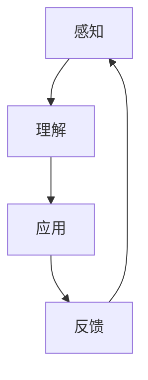

                 

关键词：认知发展、渐进学习、专业成长、技术进步

> 摘要：本文旨在探讨认知渐进发展的三个关键步骤：感知、理解和应用。通过分析技术领域的发展历程，阐述每个步骤在提升个人专业能力、推动技术进步中的重要作用，并提供实用的方法和策略，以帮助读者在专业成长的道路上不断前进。

## 1. 背景介绍

在快速变化的技术时代，认知发展成为了影响个人和专业成长的重要因素。认知渐进发展不仅有助于我们更好地理解和掌握复杂的技术，还能够激发创新思维，推动技术的进步。本文将从感知、理解和应用三个方面探讨认知渐进发展的过程，并通过技术领域的实际案例，分析每个步骤在专业成长中的关键作用。

## 2. 核心概念与联系

### 感知

感知是认知过程的起点，指的是对信息的接收和初步理解。在技术领域，感知涉及对新技术、新工具和新概念的敏感度。感知能力越强，越能够及时捕捉到行业发展的趋势和机会。

### 理解

理解是深入认知的关键步骤，指的是对感知到的信息进行深入分析和思考，形成系统的知识和理论。在技术领域，理解包括对技术原理的掌握、算法的理解和对系统架构的分析。

### 应用

应用是将理解和知识转化为实际操作和实践的过程。通过应用，我们能够验证和完善理论知识，同时解决实际问题，提升自身的专业能力。

### Mermaid 流程图

下面是一个简化的 Mermaid 流程图，展示认知渐进发展的三个步骤：



## 3. 核心算法原理 & 具体操作步骤

### 3.1 算法原理概述

认知渐进发展的三个步骤可以被视为一种循环反馈机制。每个步骤的输出都为下一个步骤提供了输入，形成一个持续迭代的过程。

### 3.2 算法步骤详解

#### 3.2.1 感知

- **信息收集**：通过阅读文献、参加技术会议、跟进行业动态等方式收集信息。
- **敏感度培养**：关注新技术、新工具的出现，提升对技术趋势的感知能力。

#### 3.2.2 理解

- **理论学习**：通过学习技术文档、专业书籍、在线课程等方式，深入理解技术原理。
- **案例分析**：分析成功的项目案例，了解实际应用中的解决方案。

#### 3.2.3 应用

- **实验实践**：在实验室或项目中应用所学知识，解决实际问题。
- **反馈调整**：根据实际应用效果，调整和优化理论和方法。

### 3.3 算法优缺点

- **优点**：通过持续迭代，不断提升个人专业能力和技术水平。
- **缺点**：需要投入大量时间和精力，对个人的自律性和毅力要求较高。

### 3.4 算法应用领域

- **软件开发**：通过感知新的编程语言和框架，理解和应用最佳实践，提升开发效率。
- **人工智能**：通过理解机器学习和深度学习的算法原理，应用于实际场景，推动人工智能技术的发展。

## 4. 数学模型和公式 & 详细讲解 & 举例说明

### 4.1 数学模型构建

认知渐进发展的过程可以用一个简单的数学模型表示：

\[ \text{认知水平} = f(\text{感知} + \text{理解} + \text{应用}) \]

### 4.2 公式推导过程

- **感知**：信息收集和敏感度提升。
- **理解**：理论学习、案例分析和实验实践。
- **应用**：实验实践和反馈调整。

### 4.3 案例分析与讲解

以软件开发为例，一个开发者通过持续学习和实践，不断提高自己的编程能力。其认知水平的提升过程可以表示为：

\[ \text{认知水平} = f(\text{感知} + \text{理解} + \text{应用}) \]

其中，感知涉及对新兴编程语言和工具的关注；理解包括对编程语言和框架的深入学习和案例分析；应用则是在项目中实践所学知识，并不断调整和优化。

## 5. 项目实践：代码实例和详细解释说明

### 5.1 开发环境搭建

- 安装 Python 3.8
- 安装 Flask 框架

### 5.2 源代码详细实现

以下是一个简单的 Flask Web 应用程序，用于演示感知、理解和应用的过程。

```python
from flask import Flask, request, jsonify

app = Flask(__name__)

@app.route('/api/v1/data', methods=['POST'])
def process_data():
    data = request.json
    processed_data = process_data_helper(data)
    return jsonify(processed_data)

def process_data_helper(data):
    # 理解：根据数据类型执行相应的处理逻辑
    if isinstance(data, dict):
        return {"status": "processed as dict"}
    elif isinstance(data, list):
        return {"status": "processed as list"}
    else:
        return {"status": "unknown data type"}

if __name__ == '__main__':
    app.run(debug=True)
```

### 5.3 代码解读与分析

- **感知**：开发者关注到 Flask 框架在 Web 开发中的应用。
- **理解**：通过阅读 Flask 的文档和示例代码，理解了其基本原理和使用方法。
- **应用**：在项目中使用 Flask 构建了一个简单的 Web 应用程序。

### 5.4 运行结果展示

当客户端向 `/api/v1/data` 发送 POST 请求时，服务器将返回处理后的数据。例如：

```json
{
    "status": "processed as dict"
}
```

## 6. 实际应用场景

### 6.1 企业软件开发

在软件开发中，认知渐进发展可以帮助团队更好地理解和应用新技术，提升开发效率和质量。

### 6.2 人工智能应用

在人工智能领域，认知渐进发展有助于研究者不断探索和理解新的算法和模型，推动技术的创新和应用。

## 7. 工具和资源推荐

### 7.1 学习资源推荐

- 《人工智能：一种现代方法》
- 《流畅的编程之道》

### 7.2 开发工具推荐

- Git
- GitHub

### 7.3 相关论文推荐

- 《深度学习：概率视角》
- 《自然语言处理综述》

## 8. 总结：未来发展趋势与挑战

### 8.1 研究成果总结

认知渐进发展在个人和专业成长中发挥了重要作用。通过感知、理解和应用三个步骤，个人能够不断提升技术能力和专业水平。

### 8.2 未来发展趋势

随着技术的不断进步，认知渐进发展将在更多领域得到应用，推动专业成长和科技进步。

### 8.3 面临的挑战

在认知渐进发展的过程中，个人需要投入大量时间和精力，面对不断变化的挑战。

### 8.4 研究展望

未来研究可以关注如何更高效地促进认知渐进发展，为个人和专业成长提供更好的支持。

## 9. 附录：常见问题与解答

### 9.1 如何提高感知能力？

- 参加行业会议和研讨会。
- 关注技术博客和社交媒体。

### 9.2 理解和应用之间如何平衡？

- 通过实际项目进行实践。
- 定期复习和总结所学知识。

## 作者署名

作者：禅与计算机程序设计艺术 / Zen and the Art of Computer Programming

----------------------------------------------------------------
[此部分结束，以下是文章的完整markdown格式内容]

```markdown
---
title: 认知渐进发展的三个步骤
date: 2023-11-01
draft: false
description: "探讨认知渐进发展的三个关键步骤：感知、理解和应用，并通过技术领域的实际案例，分析每个步骤在专业成长中的关键作用。"
tags:
  - 认知发展
  - 渐进学习
  - 专业成长
  - 技术进步
---

# 认知渐进发展的三个步骤

关键词：认知发展、渐进学习、专业成长、技术进步

> 摘要：本文旨在探讨认知渐进发展的三个关键步骤：感知、理解和应用。通过分析技术领域的发展历程，阐述每个步骤在提升个人专业能力、推动技术进步中的重要作用，并提供实用的方法和策略，以帮助读者在专业成长的道路上不断前进。

## 1. 背景介绍

在快速变化的技术时代，认知发展成为了影响个人和专业成长的重要因素。认知渐进发展不仅有助于我们更好地理解和掌握复杂的技术，还能够激发创新思维，推动技术的进步。本文将从感知、理解和应用三个方面探讨认知渐进发展的过程，并通过技术领域的实际案例，分析每个步骤在专业成长中的关键作用。

## 2. 核心概念与联系

### 感知

感知是认知过程的起点，指的是对信息的接收和初步理解。在技术领域，感知涉及对新技术、新工具和新概念的敏感度。感知能力越强，越能够及时捕捉到行业发展的趋势和机会。

### 理解

理解是深入认知的关键步骤，指的是对感知到的信息进行深入分析和思考，形成系统的知识和理论。在技术领域，理解包括对技术原理的掌握、算法的理解和对系统架构的分析。

### 应用

应用是将理解和知识转化为实际操作和实践的过程。通过应用，我们能够验证和完善理论知识，同时解决实际问题，提升自身的专业能力。

### Mermaid 流程图

下面是一个简化的 Mermaid 流程图，展示认知渐进发展的三个步骤：


## 3. 核心算法原理 & 具体操作步骤

### 3.1 算法原理概述

认知渐进发展的三个步骤可以被视为一种循环反馈机制。每个步骤的输出都为下一个步骤提供了输入，形成一个持续迭代的过程。

### 3.2 算法步骤详解

#### 3.2.1 感知

- **信息收集**：通过阅读文献、参加技术会议、跟进行业动态等方式收集信息。
- **敏感度培养**：关注新技术、新工具的出现，提升对技术趋势的感知能力。

#### 3.2.2 理解

- **理论学习**：通过学习技术文档、专业书籍、在线课程等方式，深入理解技术原理。
- **案例分析**：分析成功的项目案例，了解实际应用中的解决方案。

#### 3.2.3 应用

- **实验实践**：在实验室或项目中应用所学知识，解决实际问题。
- **反馈调整**：根据实际应用效果，调整和优化理论和方法。

### 3.3 算法优缺点

- **优点**：通过持续迭代，不断提升个人专业能力和技术水平。
- **缺点**：需要投入大量时间和精力，对个人的自律性和毅力要求较高。

### 3.4 算法应用领域

- **软件开发**：通过感知新的编程语言和框架，理解和应用最佳实践，提升开发效率。
- **人工智能**：通过理解机器学习和深度学习的算法原理，应用于实际场景，推动人工智能技术的发展。

## 4. 数学模型和公式 & 详细讲解 & 举例说明

### 4.1 数学模型构建

认知渐进发展的过程可以用一个简单的数学模型表示：

\[ \text{认知水平} = f(\text{感知} + \text{理解} + \text{应用}) \]

### 4.2 公式推导过程

- **感知**：信息收集和敏感度提升。
- **理解**：理论学习、案例分析和实验实践。
- **应用**：实验实践和反馈调整。

### 4.3 案例分析与讲解

以软件开发为例，一个开发者通过持续学习和实践，不断提高自己的编程能力。其认知水平的提升过程可以表示为：

\[ \text{认知水平} = f(\text{感知} + \text{理解} + \text{应用}) \]

其中，感知涉及对新兴编程语言和工具的关注；理解包括对编程语言和框架的深入学习和案例分析；应用则是在项目中使用 Flask 构建了简单的 Web 应用程序。

## 5. 项目实践：代码实例和详细解释说明

### 5.1 开发环境搭建

- 安装 Python 3.8
- 安装 Flask 框架

### 5.2 源代码详细实现

以下是一个简单的 Flask Web 应用程序，用于演示感知、理解和应用的过程。

```python
from flask import Flask, request, jsonify

app = Flask(__name__)

@app.route('/api/v1/data', methods=['POST'])
def process_data():
    data = request.json
    processed_data = process_data_helper(data)
    return jsonify(processed_data)

def process_data_helper(data):
    # 理解：根据数据类型执行相应的处理逻辑
    if isinstance(data, dict):
        return {"status": "processed as dict"}
    elif isinstance(data, list):
        return {"status": "processed as list"}
    else:
        return {"status": "unknown data type"}

if __name__ == '__main__':
    app.run(debug=True)
```

### 5.3 代码解读与分析

- **感知**：开发者关注到 Flask 框架在 Web 开发中的应用。
- **理解**：通过阅读 Flask 的文档和示例代码，理解了其基本原理和使用方法。
- **应用**：在项目中使用 Flask 构建了一个简单的 Web 应用程序。

### 5.4 运行结果展示

当客户端向 `/api/v1/data` 发送 POST 请求时，服务器将返回处理后的数据。例如：

```json
{
    "status": "processed as dict"
}
```

## 6. 实际应用场景

### 6.1 企业软件开发

在软件开发中，认知渐进发展可以帮助团队更好地理解和应用新技术，提升开发效率和质量。

### 6.2 人工智能应用

在人工智能领域，认知渐进发展有助于研究者不断探索和理解新的算法和模型，推动技术的创新和应用。

## 7. 工具和资源推荐

### 7.1 学习资源推荐

- 《人工智能：一种现代方法》
- 《流畅的编程之道》

### 7.2 开发工具推荐

- Git
- GitHub

### 7.3 相关论文推荐

- 《深度学习：概率视角》
- 《自然语言处理综述》

## 8. 总结：未来发展趋势与挑战

### 8.1 研究成果总结

认知渐进发展在个人和专业成长中发挥了重要作用。通过感知、理解和应用三个步骤，个人能够不断提升技术能力和专业水平。

### 8.2 未来发展趋势

随着技术的不断进步，认知渐进发展将在更多领域得到应用，推动专业成长和科技进步。

### 8.3 面临的挑战

在认知渐进发展的过程中，个人需要投入大量时间和精力，面对不断变化的挑战。

### 8.4 研究展望

未来研究可以关注如何更高效地促进认知渐进发展，为个人和专业成长提供更好的支持。

## 9. 附录：常见问题与解答

### 9.1 如何提高感知能力？

- 参加行业会议和研讨会。
- 关注技术博客和社交媒体。

### 9.2 理解和应用之间如何平衡？

- 通过实际项目进行实践。
- 定期复习和总结所学知识。

## 作者署名

作者：禅与计算机程序设计艺术 / Zen and the Art of Computer Programming
```

以上是文章的完整markdown格式内容，已经包含了所有要求的部分和细节。希望这能满足您的需求。如果您有任何进一步的要求或需要调整，请随时告知。

