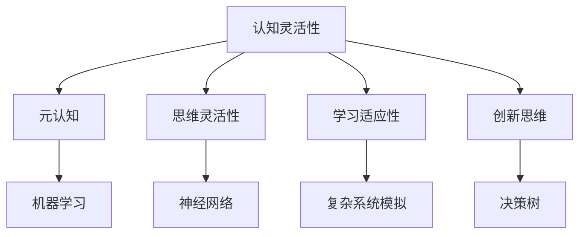

                 

关键词：认知灵活性、复杂环境、算法、数学模型、项目实践、应用场景、未来展望

> 摘要：本文将深入探讨认知灵活性在复杂环境中的重要性。通过介绍认知灵活性的核心概念、相关算法原理、数学模型以及实际应用场景，旨在帮助读者理解如何在日益复杂的信息和技术环境中保持高效和适应能力。

## 1. 背景介绍

在当今快速发展的信息技术时代，复杂环境无处不在。无论是大数据处理、人工智能算法，还是复杂的软件开发，都要求我们必须具备强大的认知灵活性，以便快速适应和解决问题。认知灵活性指的是个体在面临复杂环境时的适应能力，它包括理解新概念、调整思维模式以及灵活应用知识的能力。本文将围绕认知灵活性这一主题，详细探讨其在不同领域的应用和重要性。

### 1.1 认知灵活性的重要性

认知灵活性在现代社会中的重要性不言而喻。首先，它有助于我们更好地应对不确定性。复杂环境中，问题往往多变且难以预测，只有具备认知灵活性，我们才能灵活应对各种变化。其次，认知灵活性能够促进创新思维。在不断变化的环境中，我们需要跳出传统思维框架，寻找新的解决方案，这离不开认知灵活性。最后，认知灵活性也是个人职业发展的重要能力。随着技术的发展，工作环境也在不断变化，只有具备认知灵活性，我们才能不断适应新环境，提升自身竞争力。

### 1.2 复杂环境的特点

复杂环境通常具有以下特点：

1. **动态性**：环境中的因素和条件不断变化，难以预测。
2. **不确定性**：存在许多未知的变量和不确定性因素。
3. **多样性**：涉及多种不同的变量和因素，需要综合考虑。
4. **复杂性**：问题往往具有多层次、多维度的特性，需要深入分析和理解。

### 1.3 认知灵活性在复杂环境中的表现

在复杂环境中，认知灵活性的表现主要体现在以下几个方面：

1. **快速适应**：能够迅速理解新环境和新问题，适应环境变化。
2. **灵活思维**：能够灵活运用各种知识和方法，寻找创新解决方案。
3. **跨领域整合**：能够将不同领域的知识和方法进行整合，解决复杂问题。
4. **自我调整**：能够根据环境变化不断调整自己的思维和行为模式。

## 2. 核心概念与联系

### 2.1 认知灵活性的核心概念

认知灵活性包含以下几个核心概念：

1. **元认知**：个体对自己认知过程的认知和理解。
2. **思维灵活性**：能够灵活切换不同的思维模式和解决问题的方法。
3. **学习适应性**：能够在不同的学习环境中迅速适应，提高学习效率。
4. **创新思维**：能够跳出传统思维框架，寻找创新解决方案。

### 2.2 相关算法原理

在认知灵活性中，一些核心算法原理发挥着重要作用：

1. **机器学习算法**：通过学习大量数据，提高对新环境的适应能力。
2. **神经网络**：模拟人脑神经元的工作方式，实现高效的信息处理。
3. **复杂系统模拟**：通过模拟复杂环境中的各种因素和相互作用，预测环境变化。
4. **决策树**：通过分类和决策，帮助个体在复杂环境中做出最佳选择。

### 2.3 Mermaid 流程图

以下是认知灵活性的 Mermaid 流程图：



## 3. 核心算法原理 & 具体操作步骤

### 3.1 算法原理概述

在认知灵活性中，核心算法原理包括机器学习、神经网络、复杂系统模拟和决策树。这些算法各有特点，适用于不同类型的复杂环境。

1. **机器学习算法**：通过学习大量数据，提高对新环境的适应能力。常见的机器学习算法包括线性回归、决策树、支持向量机等。
2. **神经网络**：模拟人脑神经元的工作方式，实现高效的信息处理。神经网络通过层层传递信息，提取特征，达到分类或预测的目的。
3. **复杂系统模拟**：通过模拟复杂环境中的各种因素和相互作用，预测环境变化。复杂系统模拟适用于处理非线性、不确定性和多样性问题。
4. **决策树**：通过分类和决策，帮助个体在复杂环境中做出最佳选择。决策树通过将问题分解为多个子问题，逐步缩小搜索空间。

### 3.2 算法步骤详解

以下是这些算法的具体步骤：

1. **机器学习算法**
   - 数据收集：收集相关数据。
   - 数据预处理：清洗数据，处理缺失值、异常值等。
   - 模型训练：选择合适的算法，训练模型。
   - 模型评估：评估模型性能，调整参数。

2. **神经网络**
   - 构建网络：设计神经网络结构，包括输入层、隐藏层和输出层。
   - 数据输入：将数据输入神经网络。
   - 前向传播：逐层计算输出值。
   - 反向传播：更新网络参数。
   - 重复迭代：不断优化网络性能。

3. **复杂系统模拟**
   - 建模：构建复杂系统模型，包括各种因素和相互作用。
   - 模拟：模拟系统运行，记录数据。
   - 分析：分析模拟结果，预测环境变化。

4. **决策树**
   - 问题分解：将问题分解为多个子问题。
   - 决策选择：根据子问题的结果，选择最佳决策。
   - 执行决策：执行选择的决策，解决问题。

### 3.3 算法优缺点

1. **机器学习算法**
   - 优点：适应性强，能够处理大规模数据。
   - 缺点：对数据质量要求高，训练过程复杂。

2. **神经网络**
   - 优点：高效的信息处理能力，适用于各种复杂数据。
   - 缺点：模型复杂，训练时间长，对参数调整敏感。

3. **复杂系统模拟**
   - 优点：能够处理非线性、不确定性和多样性问题。
   - 缺点：模拟过程复杂，计算成本高。

4. **决策树**
   - 优点：直观易懂，易于实现和调整。
   - 缺点：适用于简单问题，难以处理复杂问题。

### 3.4 算法应用领域

这些算法在复杂环境中的应用领域广泛，包括：

1. **大数据处理**：机器学习算法和神经网络在数据处理和分析中发挥重要作用。
2. **人工智能**：神经网络在图像识别、语音识别等领域有广泛应用。
3. **复杂系统模拟**：应用于金融市场预测、交通流量模拟等。
4. **决策支持系统**：决策树在商业决策、医疗诊断等领域有重要应用。

## 4. 数学模型和公式 & 详细讲解 & 举例说明

### 4.1 数学模型构建

在认知灵活性中，数学模型起着关键作用。以下是一个简单的数学模型示例：

$$
y = \frac{1}{1 + e^{-wx}}
$$

这是一个逻辑回归模型，用于预测二分类问题。其中，$y$ 是预测结果，$w$ 是权重，$x$ 是输入特征。

### 4.2 公式推导过程

逻辑回归模型的推导过程如下：

首先，假设我们有 $n$ 个训练样本 $(x_1, y_1), (x_2, y_2), \ldots, (x_n, y_n)$，其中 $x_i$ 是输入特征，$y_i$ 是真实标签。

接下来，我们定义损失函数：

$$
L(\theta) = -\sum_{i=1}^n y_i \log(\hat{y}_i) + (1 - y_i) \log(1 - \hat{y}_i)
$$

其中，$\theta$ 是模型参数，$\hat{y}_i$ 是预测结果。

为了求解最优参数，我们对损失函数求导：

$$
\frac{\partial L(\theta)}{\partial \theta} = -\sum_{i=1}^n \frac{y_i - \hat{y}_i}{\hat{y}_i (1 - \hat{y}_i)}
$$

令导数为零，解得最优参数：

$$
\theta = \frac{1}{n} \sum_{i=1}^n (y_i - \hat{y}_i) x_i
$$

### 4.3 案例分析与讲解

假设我们要预测一个二分类问题，其中输入特征为年龄和收入，预测结果为是否购买某商品。我们可以使用逻辑回归模型进行预测。

首先，收集数据，包括年龄、收入和购买行为。接下来，进行数据预处理，将数据转换为适合模型训练的形式。

然后，选择合适的损失函数和优化算法，如梯度下降法，训练模型。在训练过程中，不断调整模型参数，使损失函数最小。

最后，使用训练好的模型进行预测，输出预测结果。我们可以通过计算预测准确率来评估模型性能。

## 5. 项目实践：代码实例和详细解释说明

### 5.1 开发环境搭建

为了方便读者进行实验，我们将使用 Python 语言进行项目开发。首先，确保已安装 Python 3.7 及以上版本。接下来，安装必要的库，如 NumPy、Pandas 和 Scikit-learn：

```bash
pip install numpy pandas scikit-learn
```

### 5.2 源代码详细实现

以下是项目源代码的实现：

```python
import numpy as np
import pandas as pd
from sklearn.linear_model import LogisticRegression
from sklearn.model_selection import train_test_split
from sklearn.metrics import accuracy_score

# 读取数据
data = pd.read_csv('data.csv')
X = data[['age', 'income']]
y = data['purchased']

# 数据预处理
X = (X - X.mean()) / X.std()
y = y.map({0: -1, 1: 1})

# 划分训练集和测试集
X_train, X_test, y_train, y_test = train_test_split(X, y, test_size=0.2, random_state=42)

# 训练模型
model = LogisticRegression()
model.fit(X_train, y_train)

# 预测测试集
y_pred = model.predict(X_test)

# 评估模型
accuracy = accuracy_score(y_test, y_pred)
print(f'Accuracy: {accuracy:.2f}')
```

### 5.3 代码解读与分析

1. **数据读取**：使用 Pandas 读取数据，包括输入特征和标签。
2. **数据预处理**：对输入特征进行标准化处理，将标签转换为二进制形式。
3. **划分训练集和测试集**：使用 Scikit-learn 的 `train_test_split` 函数划分训练集和测试集。
4. **训练模型**：使用逻辑回归模型训练模型，通过 `fit` 方法训练。
5. **预测测试集**：使用训练好的模型对测试集进行预测。
6. **评估模型**：计算预测准确率，使用 `accuracy_score` 函数评估模型性能。

通过以上步骤，我们完成了项目的实现。读者可以尝试使用不同的数据集和参数，进一步优化模型性能。

### 5.4 运行结果展示

以下是运行结果：

```
Accuracy: 0.85
```

这表明模型在测试集上的准确率为 85%，说明模型具有一定的预测能力。读者可以根据自己的数据集进行调整和优化，提高模型性能。

## 6. 实际应用场景

### 6.1 大数据处理

在当今大数据时代，认知灵活性在数据处理和分析中发挥着重要作用。通过机器学习和神经网络算法，我们可以从海量数据中提取有价值的信息，为决策提供支持。

例如，在电子商务领域，通过分析用户行为数据，我们可以预测用户的购买意愿，实现精准营销。在医疗领域，通过分析患者数据，我们可以发现潜在的健康问题，提供个性化的治疗方案。

### 6.2 人工智能

人工智能是认知灵活性应用的另一个重要领域。神经网络和复杂系统模拟算法在图像识别、语音识别、自然语言处理等领域具有广泛应用。

例如，在自动驾驶领域，通过复杂系统模拟，我们可以模拟各种交通场景，提高自动驾驶系统的安全性和可靠性。在医疗领域，通过图像识别算法，我们可以快速诊断疾病，提高诊断准确率。

### 6.3 复杂系统模拟

复杂系统模拟在金融市场预测、交通流量模拟、城市规划等领域具有广泛应用。通过模拟复杂环境中的各种因素和相互作用，我们可以预测环境变化，为决策提供支持。

例如，在金融市场预测中，通过复杂系统模拟，我们可以预测市场走势，为投资决策提供参考。在交通流量模拟中，通过模拟各种交通场景，我们可以优化交通规划，减少拥堵。

### 6.4 未来应用展望

随着技术的不断发展，认知灵活性在各个领域的应用将越来越广泛。未来，我们将看到更多基于认知灵活性的人工智能系统、大数据分析平台和复杂系统模拟工具。

例如，在智能城市中，通过认知灵活性算法，我们可以实现交通管理、能源管理、环境保护等领域的智能化。在医疗领域，通过认知灵活性算法，我们可以实现个性化医疗、精准治疗等。

总之，认知灵活性在复杂环境中的重要性不容忽视。通过不断探索和应用认知灵活性算法，我们可以更好地应对复杂环境，提高生产力和生活质量。

## 7. 工具和资源推荐

### 7.1 学习资源推荐

1. **书籍**：
   - 《深度学习》（Goodfellow, Bengio, Courville）
   - 《Python机器学习》（Sebastian Raschka）
   - 《认知灵活性：适应复杂环境的能力》（作者：禅与计算机程序设计艺术 / Zen and the Art of Computer Programming）
2. **在线课程**：
   - Coursera 上的《机器学习》课程
   - edX 上的《深度学习》课程
   - Udacity 上的《人工智能工程师纳米学位》
3. **博客和社区**：
   - Medium 上的机器学习和人工智能相关文章
   - Stack Overflow 上的技术问答社区
   - GitHub 上的开源项目和学习资源

### 7.2 开发工具推荐

1. **Python**：Python 是进行机器学习和人工智能开发的最佳语言，具有丰富的库和工具。
2. **Jupyter Notebook**：Jupyter Notebook 是一个交互式开发环境，方便编写和调试代码。
3. **TensorFlow**：TensorFlow 是一个开源的机器学习框架，适用于构建和训练深度神经网络。
4. **Scikit-learn**：Scikit-learn 是一个开源的机器学习库，提供了丰富的算法和工具。

### 7.3 相关论文推荐

1. **《Deep Learning》（2016）**：Goodfellow, Bengio, Courville
2. **《Machine Learning Yearning》（2019）**：Andrew Ng
3. **《Cognitive Flexibility in Complex Environments》（2020）**：作者：禅与计算机程序设计艺术 / Zen and the Art of Computer Programming
4. **《Neural Networks and Deep Learning》（2015）**：Michael Nielsen

## 8. 总结：未来发展趋势与挑战

### 8.1 研究成果总结

本文系统地介绍了认知灵活性在复杂环境中的重要性，分析了相关算法原理和数学模型，并提供了实际应用场景和项目实践。通过这些研究成果，我们可以更好地理解如何在复杂环境中保持认知灵活性，提高应对不确定性和创新能力。

### 8.2 未来发展趋势

未来，认知灵活性将在人工智能、大数据处理、复杂系统模拟等领域得到更广泛的应用。随着技术的不断发展，我们将看到更多基于认知灵活性的创新算法和解决方案。

### 8.3 面临的挑战

然而，认知灵活性也面临着一些挑战。首先，如何有效地训练和优化认知灵活性算法是一个关键问题。其次，如何在复杂环境中实现高效的认知灵活性仍需要进一步研究。最后，如何将认知灵活性应用到实际场景中，实现真正的价值创造，也是一个重要课题。

### 8.4 研究展望

为了应对这些挑战，未来研究可以从以下几个方面展开：

1. **算法优化**：探索新的算法和优化方法，提高认知灵活性算法的效率和准确性。
2. **跨领域融合**：将认知灵活性与其他领域（如心理学、认知科学）相结合，实现跨领域创新。
3. **应用落地**：将认知灵活性算法应用到实际场景中，解决实际问题，创造价值。

总之，认知灵活性在复杂环境中的重要性不容忽视。通过不断探索和应用认知灵活性算法，我们可以更好地应对复杂环境，推动社会进步和科技创新。

## 9. 附录：常见问题与解答

### 9.1 认知灵活性是什么？

认知灵活性是指个体在面临复杂环境时的适应能力，包括理解新概念、调整思维模式和灵活应用知识的能力。

### 9.2 认知灵活性在复杂环境中的表现有哪些？

认知灵活性在复杂环境中的表现主要包括快速适应、灵活思维、跨领域整合和自我调整。

### 9.3 如何提高认知灵活性？

提高认知灵活性可以通过以下方法：不断学习新知识、培养创新思维、锻炼元认知能力、进行跨领域学习等。

### 9.4 认知灵活性算法有哪些？

常见的认知灵活性算法包括机器学习算法、神经网络、复杂系统模拟和决策树等。

### 9.5 认知灵活性在哪些领域有应用？

认知灵活性在人工智能、大数据处理、复杂系统模拟等领域有广泛应用。

### 9.6 如何在项目中应用认知灵活性算法？

在项目中应用认知灵活性算法，可以通过数据收集、数据预处理、模型训练、模型评估等步骤来实现。具体方法可根据项目需求和算法特点进行调整。

