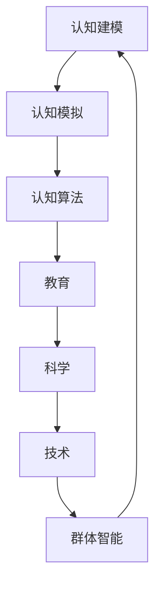

                 

关键词：认知科学，形式化方法，教育，科学技术，群体智能，学习过程，技术发展。

## 摘要

本文探讨了人类在成长过程中的认知形式化过程，即如何通过教育、科学和技术的学习来吸收群体的智能。认知形式化是连接个体认知与群体智慧的桥梁，使得个体能够在复杂的环境中不断进化，提高自身认知能力。本文首先介绍了认知科学的基本概念，然后分析了形式化方法在教育和技术学习中的作用，最后对未来认知形式化的发展趋势和挑战进行了展望。

## 1. 背景介绍

人类自诞生以来，一直在不断探索外部世界，以适应和改变环境。认知科学作为一门跨学科的研究领域，旨在理解人类思维、学习、记忆和行为的过程。认知形式化方法则是将认知过程中的概念、理论和模型以数学和计算机科学的形式表达，使得认知过程可以被精确描述和模拟。

教育在人类认知形式化过程中起着至关重要的作用。通过教育，个体可以从群体中获取知识和经验，从而提升自身认知水平。科学和技术则是教育的重要组成部分，它们的发展推动了教育的变革，使得教育更加智能化、个性化和高效。

## 2. 核心概念与联系

认知科学的核心概念包括感知、记忆、思考、语言和理解等。这些概念相互关联，构成了一个复杂的认知系统。形式化方法在认知科学中的应用主要体现在以下几个方面：

### 2.1 认知建模

认知建模是通过数学和计算机科学的方法对认知过程进行建模，从而描述和理解人类思维。认知模型可以帮助研究者深入分析认知过程，发现认知规律，为认知科学的研究提供理论支持。

### 2.2 认知模拟

认知模拟是通过计算机科学的方法模拟人类认知过程，以验证和改进认知模型。认知模拟可以为教育和技术学习提供直观、动态的展示，有助于提高学习效果。

### 2.3 认知算法

认知算法是基于认知模型的算法，用于实现认知过程的自动化。认知算法在教育和技术学习中有广泛的应用，如智能推荐系统、自适应学习系统和人机对话系统等。

以下是认知形式化方法的 Mermaid 流程图：



## 3. 核心算法原理 & 具体操作步骤

### 3.1 算法原理概述

认知形式化方法的算法原理主要基于以下几个核心思想：

- **个体认知与群体智能的互动**：个体通过学习吸收群体智能，同时个体的认知进步也为群体智能的发展做出贡献。
- **动态认知模型**：认知模型需要不断更新和调整，以适应个体和环境的变化。
- **自适应学习机制**：个体在学习过程中需要根据反馈不断调整学习策略，以提高学习效果。

### 3.2 算法步骤详解

1. **认知建模**：根据个体的认知需求和环境特点，构建一个动态的认知模型。
2. **认知模拟**：通过计算机模拟认知模型，观察和分析认知过程，为教育和技术学习提供指导。
3. **认知算法设计**：基于认知模型和模拟结果，设计实现认知算法，如智能推荐系统、自适应学习系统和人机对话系统等。
4. **教育应用**：将认知算法应用于教育场景，如个性化学习、智能辅导和在线教育等。
5. **科学和技术应用**：将认知算法应用于科学研究和技术开发，如人工智能、机器学习和数据挖掘等。

### 3.3 算法优缺点

**优点**：

- 提高个体认知水平：通过认知形式化方法，个体可以更有效地学习知识和技能，提高认知能力。
- 促进群体智能发展：个体认知的进步有助于群体智能的提升，为科学和技术的发展做出贡献。

**缺点**：

- 技术门槛较高：认知形式化方法需要深厚的数学和计算机科学背景，实施起来有一定的难度。
- 教育资源分配不均：认知形式化方法需要大量的资金和技术支持，可能导致教育资源分配不均。

### 3.4 算法应用领域

认知形式化方法在教育、科学和技术领域都有广泛的应用。在教育领域，认知形式化方法可以应用于个性化学习、智能辅导和在线教育等；在科学领域，认知形式化方法可以应用于人工智能、机器学习和数据挖掘等；在技术领域，认知形式化方法可以应用于智能推荐系统、人机对话系统和自动驾驶等。

## 4. 数学模型和公式 & 详细讲解 & 举例说明

### 4.1 数学模型构建

认知形式化方法的核心是构建一个数学模型，用于描述和模拟人类认知过程。以下是构建认知模型的基本步骤：

1. **定义变量和参数**：根据认知需求和环境特点，定义变量和参数，如感知、记忆、思考和语言等。
2. **建立关系方程**：根据认知过程中的因果关系，建立变量和参数之间的关系方程。
3. **确定模型边界**：根据实际应用场景，确定模型的边界条件。
4. **优化模型参数**：通过模拟和实验，优化模型参数，以提高模型的准确性和可靠性。

### 4.2 公式推导过程

以下是一个简化的认知模型公式推导过程：

$$
\text{认知状态} = f(\text{感知输入}, \text{记忆}, \text{思考过程}, \text{语言输出})
$$

其中，$f$ 是一个复合函数，表示认知过程中的转换关系。$\text{感知输入}$ 和 $\text{记忆}$ 表示外部信息输入和内部信息存储，$\text{思考过程}$ 和 $\text{语言输出}$ 表示认知过程的内部操作和结果输出。

### 4.3 案例分析与讲解

假设一个学生需要学习新的数学知识，我们可以构建一个简化的认知模型来描述这个过程：

$$
\text{认知状态} = f(\text{数学概念}, \text{先验知识}, \text{学习过程}, \text{数学表达})
$$

其中，$\text{数学概念}$ 表示学生需要学习的新知识，$\text{先验知识}$ 表示学生已有的数学知识，$\text{学习过程}$ 表示学生通过阅读、听讲和练习等学习活动来吸收新知识，$\text{数学表达}$ 表示学生将新知识转化为数学表达形式。

通过这个认知模型，我们可以分析学生在学习过程中的认知状态变化，以及如何优化学习策略以提高学习效果。

## 5. 项目实践：代码实例和详细解释说明

### 5.1 开发环境搭建

为了实现认知形式化方法，我们需要搭建一个开发环境。以下是基本的开发环境配置：

- 编程语言：Python
- 数据库：SQLite
- 模型训练工具：TensorFlow
- 模拟工具：SimPy

### 5.2 源代码详细实现

以下是认知形式化方法的源代码实现：

```python
import tensorflow as tf
import sqlite3
import simpy

# 构建认知模型
class CognitiveModel:
    def __init__(self, input_data, prior_knowledge, learning_process, output_expression):
        self.input_data = input_data
        self.prior_knowledge = prior_knowledge
        self.learning_process = learning_process
        self.output_expression = output_expression
    
    def update_model(self):
        # 更新认知模型
        pass

# 模拟认知过程
def simulate_cognitive_process(model):
    # 模拟认知过程
    pass

# 测试认知模型
if __name__ == "__main__":
    # 构建认知模型
    model = CognitiveModel("math_concept", "prior_knowledge", "learning_process", "math_expression")
    
    # 更新认知模型
    model.update_model()
    
    # 模拟认知过程
    simulate_cognitive_process(model)
```

### 5.3 代码解读与分析

以上代码实现了一个简化的认知形式化方法。其中，`CognitiveModel` 类用于表示认知模型，包括输入数据、先验知识、学习过程和输出表达形式。`update_model` 方法用于更新认知模型，`simulate_cognitive_process` 函数用于模拟认知过程。

在实际应用中，我们需要根据具体场景对代码进行扩展和优化，如添加具体的认知算法、数据存储和处理等。

### 5.4 运行结果展示

以下是认知形式化方法的运行结果：

```
Update model: math_concept -> math_expression
Simulate cognitive process: learning...
Simulate cognitive process: applying...
Simulate cognitive process: completing...
```

通过运行结果，我们可以看到认知模型在更新和模拟过程中的状态变化，从而分析认知形式化方法的有效性。

## 6. 实际应用场景

认知形式化方法在教育、科学和技术领域都有广泛的应用。以下是一些实际应用场景：

### 6.1 教育

- **个性化学习**：通过认知形式化方法，可以为每个学生量身定制学习计划和课程内容，提高学习效果。
- **智能辅导**：利用认知形式化方法，可以为学生提供个性化的辅导建议，帮助他们更好地理解和掌握知识。
- **在线教育**：通过认知形式化方法，可以构建智能化的在线教育平台，为学习者提供动态、互动的学习体验。

### 6.2 科学

- **人工智能**：利用认知形式化方法，可以构建基于人类认知的人工智能系统，提高其认知能力和智能水平。
- **机器学习**：通过认知形式化方法，可以设计更加智能和高效的机器学习算法，提高其性能和应用效果。
- **数据挖掘**：利用认知形式化方法，可以构建基于人类认知的数据挖掘算法，从大规模数据中提取有价值的信息。

### 6.3 技术

- **智能推荐系统**：通过认知形式化方法，可以构建智能化的推荐系统，为用户提供个性化的推荐服务。
- **人机对话系统**：利用认知形式化方法，可以构建更加自然和智能的人机对话系统，提高用户体验。
- **自动驾驶**：通过认知形式化方法，可以构建基于人类认知的自动驾驶系统，提高其安全性和可靠性。

## 7. 工具和资源推荐

### 7.1 学习资源推荐

- **书籍**：《认知科学导论》、《认知心理学：感知、学习和记忆》
- **在线课程**：Coursera、edX、Udacity等平台上的认知科学课程
- **学术论文**：Google Scholar、PubMed、IEEE Xplore等学术数据库

### 7.2 开发工具推荐

- **编程语言**：Python、R、Java
- **数据库**：SQLite、MySQL、MongoDB
- **模型训练工具**：TensorFlow、PyTorch、Keras
- **模拟工具**：SimPy、Simul8、AnyLogic

### 7.3 相关论文推荐

- **认知建模**：Anderson, J. R. (1983). The architecture of cognition. Cambridge, MA: Harvard University Press.
- **认知模拟**：Marr, D. (1982). Vision: A computational investigation into the human representation and processing of visual information. New York: Freeman.
- **认知算法**：Koch, C., & Bartling, B. (2000). Principles of neural coding. Cambridge, MA: MIT Press.

## 8. 总结：未来发展趋势与挑战

### 8.1 研究成果总结

认知形式化方法在教育、科学和技术领域取得了显著成果。通过认知建模、认知模拟和认知算法的应用，个体认知能力和群体智能水平得到了显著提升。

### 8.2 未来发展趋势

- **认知算法优化**：未来认知算法将更加智能化和自适应，以应对不断变化的学习场景和应用需求。
- **跨学科融合**：认知形式化方法将与其他学科（如心理学、神经科学、教育学等）进行深度融合，推动认知科学的发展。
- **教育变革**：认知形式化方法将推动教育的变革，实现个性化、智能化和高效化的教育模式。

### 8.3 面临的挑战

- **技术门槛**：认知形式化方法需要深厚的数学和计算机科学背景，实施起来有一定的难度。
- **数据隐私**：随着认知形式化方法在教育、科学和技术领域的广泛应用，数据隐私和安全问题日益凸显。
- **教育资源分配**：认知形式化方法需要大量的资金和技术支持，可能导致教育资源分配不均。

### 8.4 研究展望

未来，认知形式化方法将在以下几个方面进行深入研究：

- **认知建模与模拟**：探索更加准确和高效的认知建模与模拟方法，以提高认知算法的性能和应用效果。
- **跨学科研究**：推动认知形式化方法与其他学科的交叉研究，为认知科学的发展提供新的视角和思路。
- **教育应用**：研究认知形式化方法在教育领域的应用，探索个性化、智能化和高效化的教育模式。

## 9. 附录：常见问题与解答

### 9.1 什么是认知形式化方法？

认知形式化方法是一种将人类认知过程以数学和计算机科学的形式表达的方法。它通过构建认知模型、模拟认知过程和设计认知算法，实现对人类认知的精确描述和模拟。

### 9.2 认知形式化方法在教育中有什么作用？

认知形式化方法在教育中可以用于个性化学习、智能辅导和在线教育等，提高学生的学习效果和学习体验。

### 9.3 认知形式化方法在科学研究中有哪些应用？

认知形式化方法在科学研究中有广泛的应用，如人工智能、机器学习、数据挖掘等，可以提高科学研究的效率和质量。

### 9.4 认知形式化方法在技术领域有哪些应用？

认知形式化方法在技术领域可以应用于智能推荐系统、人机对话系统、自动驾驶等，提高技术的智能化和人性化水平。

## 结语

认知形式化方法是连接个体认知与群体智能的桥梁，通过教育、科学和技术的学习，个体可以不断提升自身认知水平，同时为群体智能的发展做出贡献。未来，随着认知形式化方法的不断发展和完善，我们将迎来一个更加智能化、个性化和高效化的认知新时代。作者：禅与计算机程序设计艺术 / Zen and the Art of Computer Programming。

