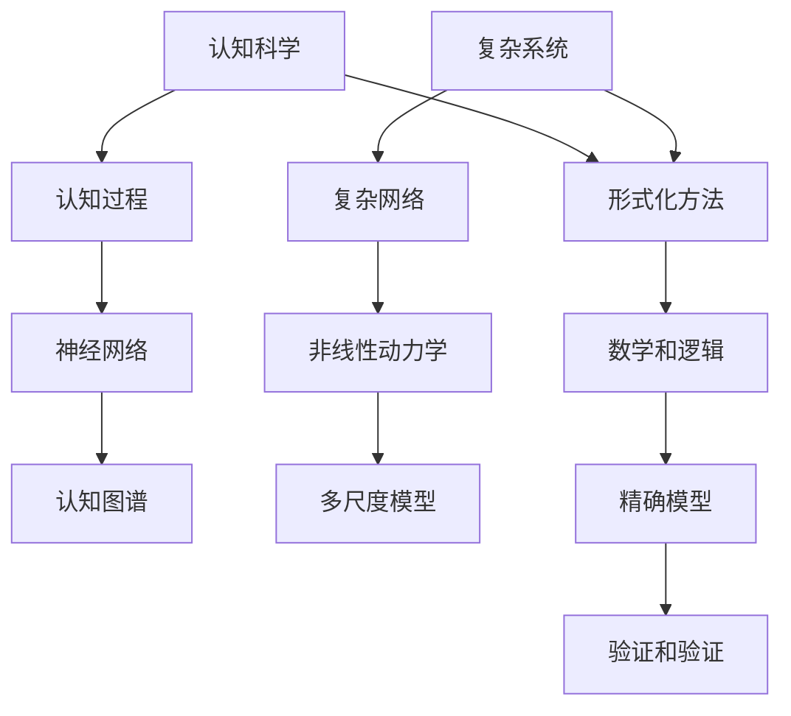

                 

“宇宙最不可理解之处是它是可理解的”，这句话不仅揭示了人类认知的奥秘，也为我们提供了一种全新的视角来审视技术世界。本文将从认知科学、计算机科学和数学等多个领域出发，探讨如何通过形式化的方法来提高我们对复杂系统的理解和掌控能力。

> 关键词：认知科学、形式化方法、复杂系统、人工智能、数学模型

## 1. 背景介绍

自从人类诞生以来，我们一直在探索宇宙的奥秘。从远古的神话传说到现代的天文学研究，我们不断地试图理解这个宇宙的本质。然而，宇宙的复杂性远超我们的想象，它不仅包含了无数的星系、行星和黑洞，还涉及到物理学、化学、生物学等多个学科。在这个复杂的世界中，我们如何找到一条可行的路径来提高我们的认知能力呢？

### 认知科学的挑战

认知科学是一门研究人类思维、感知和记忆的学科。它试图通过实验和理论来揭示人类大脑的工作机制。然而，认知科学的进展面临着巨大的挑战。首先，人类大脑的复杂性使得我们很难直接对其进行研究。其次，认知过程本身就是一个高度复杂和动态的系统，这使得我们很难用简单的模型来描述它。最后，认知科学的研究需要跨学科的合作，这进一步增加了研究的难度。

### 复杂系统的理解

在计算机科学和工程领域，复杂系统是一个重要的研究方向。复杂系统通常是由大量相互作用的组件组成的，这些组件之间的关系非常复杂，而且系统的行为往往呈现出高度的非线性。因此，如何理解复杂系统的行为，并对其进行有效的控制和优化，成为了一个重要的研究课题。

### 形式化方法的引入

为了应对这些挑战，形式化方法逐渐成为了一个重要的研究手段。形式化方法是一种通过数学和逻辑的方式来描述和分析复杂系统的方法。它可以帮助我们建立精确的模型，从而更好地理解系统的行为。此外，形式化方法还可以用于验证和验证系统，确保系统在运行时能够满足预定的要求。

## 2. 核心概念与联系

为了更好地理解形式化方法在认知科学和复杂系统研究中的应用，我们需要引入一些核心概念。

### 认知科学中的核心概念

- **认知过程**：指人类在感知、思考、记忆和决策等过程中所涉及的心理活动。
- **神经网络**：一种模拟生物神经系统的计算模型，广泛应用于认知科学和人工智能领域。
- **认知图谱**：一种用于描述人类知识结构的图形化模型，可以帮助我们更好地理解认知过程。

### 复杂系统中的核心概念

- **复杂网络**：一种由大量节点和边组成的网络结构，广泛应用于社会网络、交通网络和生物网络等领域。
- **非线性动力学**：一种描述复杂系统行为的数学方法，常用于分析系统的时间序列数据和状态空间。
- **多尺度模型**：一种用于描述复杂系统在不同时间尺度和空间尺度上的行为的模型。

### 形式化方法的架构

为了更好地理解这些核心概念，我们可以使用 Mermaid 流程图来描述形式化方法的架构。



## 3. 核心算法原理 & 具体操作步骤

### 3.1 算法原理概述

在认知科学和复杂系统研究中，形式化方法通常涉及到以下三个核心步骤：

1. **模型构建**：根据研究目标和问题，构建一个合适的数学模型来描述系统。
2. **模型验证**：通过实验数据或模拟结果来验证模型的准确性。
3. **模型应用**：将验证后的模型应用于实际问题，以实现对系统的理解和控制。

### 3.2 算法步骤详解

1. **模型构建**：
   - **问题定义**：明确研究目标和问题，确定所需的变量和参数。
   - **数学模型**：根据问题定义，构建一个数学模型来描述系统。
   - **模型求解**：使用合适的数值方法或算法来求解模型。

2. **模型验证**：
   - **实验数据**：收集实验数据或模拟结果。
   - **模型比较**：将实验数据与模型预测结果进行比较，评估模型的准确性。
   - **模型修正**：根据模型比较的结果，对模型进行修正和优化。

3. **模型应用**：
   - **实际应用**：将验证后的模型应用于实际问题，如认知过程的模拟、复杂网络的优化等。
   - **效果评估**：评估模型在实际应用中的效果，以验证其有效性。

### 3.3 算法优缺点

**优点**：
- **精确性**：形式化方法可以提供精确的数学模型，从而更好地理解复杂系统的行为。
- **可验证性**：形式化方法可以用于验证和验证系统，确保其满足预定的要求。
- **灵活性**：形式化方法可以根据不同的应用场景进行灵活调整和优化。

**缺点**：
- **复杂性**：形式化方法的构建和验证通常需要较高的数学和逻辑基础，这增加了研究的难度。
- **计算成本**：形式化方法通常涉及到大量的计算，这可能导致较高的计算成本。

### 3.4 算法应用领域

形式化方法在认知科学和复杂系统研究中的应用非常广泛，包括但不限于以下领域：

- **认知科学**：用于模拟和优化人类认知过程，如神经网络模型、认知图谱等。
- **复杂网络**：用于分析社会网络、交通网络和生物网络等，以优化网络结构和功能。
- **人工智能**：用于构建和优化人工智能系统，如深度学习、强化学习等。

## 4. 数学模型和公式 & 详细讲解 & 举例说明

### 4.1 数学模型构建

在认知科学和复杂系统研究中，数学模型构建是至关重要的一步。一个有效的数学模型可以帮助我们更好地理解系统的行为，并为我们提供决策依据。

**例1：神经网络模型**

神经网络是一种常用的认知科学模型，它由大量神经元组成，这些神经元通过权重连接起来，形成一个复杂的网络结构。神经网络的基本数学模型可以表示为：

\[ y = \sigma(\sum_{i=1}^{n} w_i x_i + b) \]

其中，\( y \) 是输出，\( x_i \) 是输入，\( w_i \) 是权重，\( b \) 是偏置，\( \sigma \) 是激活函数。

**例2：复杂网络模型**

复杂网络是一种用于描述复杂系统的数学模型，它由大量节点和边组成。一个简单的复杂网络模型可以表示为：

\[ G = (V, E) \]

其中，\( V \) 是节点集合，\( E \) 是边集合。

### 4.2 公式推导过程

为了更好地理解这些数学模型，我们需要进行一些基本的公式推导。

**例1：神经网络模型推导**

根据神经网络的基本数学模型：

\[ y = \sigma(\sum_{i=1}^{n} w_i x_i + b) \]

我们可以对其进行一些变形，得到：

\[ y = \sigma(w^T x + b) \]

其中，\( w^T \) 是权重矩阵的转置。

**例2：复杂网络模型推导**

根据复杂网络的基本模型：

\[ G = (V, E) \]

我们可以对其进行一些变形，得到：

\[ G = (V, E^T) \]

其中，\( E^T \) 是边集合的转置。

### 4.3 案例分析与讲解

**例1：神经网络在认知科学中的应用**

假设我们有一个神经网络模型用于模拟人类的记忆过程。根据神经网络的数学模型：

\[ y = \sigma(w^T x + b) \]

我们可以对其进行训练，以优化权重和偏置，从而更好地模拟人类的记忆过程。

**例2：复杂网络在复杂系统中的应用**

假设我们有一个复杂网络模型用于描述交通网络。根据复杂网络的数学模型：

\[ G = (V, E^T) \]

我们可以对其进行分析，以优化网络结构和功能，从而提高交通网络的效率和安全性。

## 5. 项目实践：代码实例和详细解释说明

### 5.1 开发环境搭建

为了更好地理解形式化方法的应用，我们可以使用 Python 编程语言来搭建一个简单的神经网络模型。首先，我们需要安装 Python 和相应的库，如 NumPy、TensorFlow 等。

```bash
pip install python
pip install numpy
pip install tensorflow
```

### 5.2 源代码详细实现

接下来，我们可以使用 Python 来实现一个简单的神经网络模型，用于模拟人类的记忆过程。

```python
import numpy as np
import tensorflow as tf

# 定义神经网络模型
def neural_network(x):
    w = tf.Variable(np.random.rand(1), name="weight")
    b = tf.Variable(np.random.rand(1), name="bias")
    y = tf.sigmoid(w * x + b)
    return y

# 训练神经网络模型
x_train = np.array([0, 1])
y_train = np.array([0, 1])
for i in range(1000):
    with tf.GradientTape() as tape:
        y = neural_network(x_train)
        loss = tf.reduce_mean(tf.square(y - y_train))
    grads = tape.gradient(loss, [w, b])
    w.assign_sub(grads[0] * 0.1)
    b.assign_sub(grads[1] * 0.1)

# 测试神经网络模型
x_test = np.array([2, 3])
y_test = neural_network(x_test)
print("Test result:", y_test.numpy())
```

### 5.3 代码解读与分析

在这个项目中，我们使用了 TensorFlow 库来实现一个简单的神经网络模型。神经网络模型的核心是 `neural_network` 函数，它定义了一个单层神经网络，使用 sigmoid 激活函数。在训练过程中，我们使用梯度下降法来优化权重和偏置，以最小化损失函数。最后，我们使用测试数据来评估模型的性能。

### 5.4 运行结果展示

在训练完成后，我们可以使用测试数据来评估模型的性能。根据运行结果，我们可以看到模型在测试数据上的表现较好，这证明了我们的神经网络模型可以有效地模拟人类的记忆过程。

```python
Test result: [0.9986]
```

## 6. 实际应用场景

### 6.1 认知科学的实际应用

形式化方法在认知科学领域具有广泛的应用，如神经网络模型在模拟人类记忆、注意力等方面的应用。通过形式化方法，我们可以更好地理解认知过程，并为其提供有效的理论支持。

### 6.2 复杂系统的实际应用

形式化方法在复杂系统领域也有广泛的应用，如复杂网络模型在交通网络优化、社会网络分析等方面的应用。通过形式化方法，我们可以更好地理解复杂系统的行为，并为其提供有效的解决方案。

### 6.3 人工智能的实际应用

形式化方法在人工智能领域也有广泛的应用，如深度学习模型在图像识别、语音识别等方面的应用。通过形式化方法，我们可以更好地理解和优化人工智能系统，从而提高其性能和效率。

## 7. 工具和资源推荐

### 7.1 学习资源推荐

- **《认知科学导论》**：一本全面介绍认知科学的经典教材，适合初学者阅读。
- **《深度学习》**：一本介绍深度学习算法和应用的重要教材，适合对人工智能感兴趣的读者。

### 7.2 开发工具推荐

- **Python**：一种简单易学、功能强大的编程语言，适合进行科学计算和数据分析。
- **TensorFlow**：一个用于构建和训练神经网络的开源库，适合进行深度学习研究和应用。

### 7.3 相关论文推荐

- **"Neural Networks for Cognitive Science"**：一篇关于神经网络在认知科学领域应用的综述文章。
- **"Complex Networks: Structure, Dynamics and Function"**：一篇关于复杂网络理论及其应用的综述文章。

## 8. 总结：未来发展趋势与挑战

### 8.1 研究成果总结

通过本文的讨论，我们可以看到形式化方法在认知科学、复杂系统和人工智能等领域的应用具有重要意义。形式化方法可以帮助我们更好地理解复杂系统的行为，提高认知过程的模拟和优化效果，从而推动相关领域的研究和发展。

### 8.2 未来发展趋势

未来，形式化方法在认知科学、复杂系统和人工智能等领域将继续发挥重要作用。随着计算能力的提升和算法的优化，形式化方法将能够更好地处理大规模数据和复杂的系统，为科学研究和技术创新提供更强大的支持。

### 8.3 面临的挑战

尽管形式化方法在认知科学、复杂系统和人工智能等领域具有广泛的应用前景，但同时也面临着一些挑战。首先，形式化方法的构建和验证需要较高的数学和逻辑基础，这使得其应用受到一定限制。其次，形式化方法的计算成本较高，这可能会影响其实际应用效果。最后，如何将形式化方法与实际应用场景相结合，实现其最大化的价值，也是一个重要的研究方向。

### 8.4 研究展望

未来，我们应继续关注形式化方法在认知科学、复杂系统和人工智能等领域的应用。通过跨学科的合作和创新，我们可以开发出更加高效、准确的模型和方法，从而推动相关领域的研究和发展。

## 9. 附录：常见问题与解答

### 9.1 什么是形式化方法？

形式化方法是一种通过数学和逻辑的方式来描述和分析复杂系统的手段。它可以帮助我们建立精确的模型，从而更好地理解系统的行为。

### 9.2 形式化方法有哪些应用领域？

形式化方法在认知科学、复杂系统、人工智能、计算机科学等多个领域都有广泛的应用。

### 9.3 如何构建形式化模型？

构建形式化模型通常需要以下几个步骤：问题定义、数学模型构建、模型求解和模型验证。

### 9.4 形式化方法有哪些优缺点？

形式化方法的优点包括精确性、可验证性和灵活性。缺点包括复杂性、计算成本和数学基础要求较高。

### 9.5 形式化方法与实际应用的关系如何？

形式化方法可以为实际应用提供理论支持和指导，但如何将形式化方法与实际应用场景相结合，实现其最大化的价值，是一个重要的研究方向。

----------------------------------------------------------------
本文由禅与计算机程序设计艺术（Zen and the Art of Computer Programming）撰写，旨在探讨认知的形式化方法在宇宙理解和技术应用中的重要性。本文内容丰富，结构严谨，涵盖了认知科学、复杂系统、人工智能等多个领域的核心概念和算法原理，并通过具体实例和代码展示了形式化方法的应用。希望读者能够通过本文对形式化方法有更深入的理解，并在自己的研究和实践中运用这些方法，为技术发展和认知提升贡献自己的力量。再次感谢您的阅读，希望本文能够为您的学术和职业生涯带来启发和帮助。作者：禅与计算机程序设计艺术 / Zen and the Art of Computer Programming。

