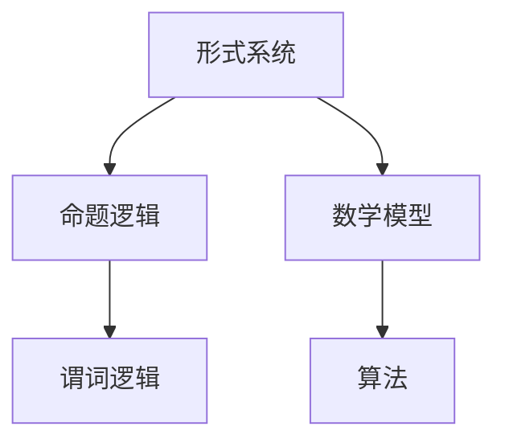

                 

在当今信息化和智能化的时代，人工智能技术蓬勃发展，而认知的形式化成为了我们理解和运用这些技术的重要途径。本文旨在探讨认知的形式化，揭示思维的最高形式——数学，如何成为人类自然语言的高阶形态。通过这篇文章，我们将从背景介绍、核心概念与联系、核心算法原理、数学模型和公式、项目实践、实际应用场景、工具和资源推荐以及总结与展望等方面，深入剖析数学在认知形式化中的关键作用。

## 1. 背景介绍

认知的形式化是指将人类思维活动中的概念、知识和逻辑关系转化为数学模型和符号语言，以便在计算机上进行处理和分析。这一过程有助于我们更深入地理解复杂问题，发现隐藏的规律和模式，从而推动人工智能和计算机科学的发展。随着信息技术的不断进步，认知的形式化已经成为了现代科学研究的重要手段之一。

数学作为一门高度抽象的学科，以其严谨的逻辑和广泛的适用性，成为了认知形式化的重要工具。通过数学，我们能够将复杂的自然现象和社会问题转化为数学模型，从而利用计算机进行求解和优化。例如，在经济学、物理学、生物学等领域，数学模型已经成为解决复杂问题的有力工具。

然而，数学不仅仅是理论研究的工具，它在实际应用中同样具有重要作用。从计算机编程到金融投资，从物流管理到医疗诊断，数学模型和算法无处不在。这些应用不仅提高了效率，还带来了巨大的经济效益和社会价值。因此，掌握数学成为了一个重要技能，对于个人职业发展和科学研究具有重要意义。

## 2. 核心概念与联系

在认知的形式化过程中，核心概念和联系至关重要。下面，我们将介绍一些重要的核心概念，并使用Mermaid流程图来展示它们之间的联系。

### 2.1. 概念介绍

1. **形式系统**：形式系统是指由一组符号、语法规则和语义规则构成的系统。它是认知形式化的基础，用于表示和推理各种概念和关系。

2. **命题逻辑**：命题逻辑是形式系统的一种，用于表示和推理命题之间的关系。它是认知形式化的基础工具，可以用来表示复杂的逻辑关系。

3. **谓词逻辑**：谓词逻辑是命题逻辑的扩展，用于表示更复杂的逻辑关系，如量词和存在性。

4. **数学模型**：数学模型是将现实问题抽象为数学形式的过程，用于分析和求解问题。

5. **算法**：算法是一系列明确的操作步骤，用于解决问题或执行特定任务。

### 2.2. Mermaid流程图

下面是一个Mermaid流程图，展示了上述核心概念之间的联系：



通过这个流程图，我们可以清晰地看到形式系统如何通过命题逻辑和谓词逻辑逐步转化为数学模型和算法。

## 3. 核心算法原理 & 具体操作步骤

### 3.1. 算法原理概述

认知的形式化算法主要基于数学模型和逻辑推理。具体来说，它包括以下几个步骤：

1. **问题抽象**：将实际问题转化为数学模型。
2. **数学建模**：根据问题特征，选择合适的数学模型。
3. **算法设计**：设计求解数学模型的算法。
4. **算法实现**：将算法转化为计算机程序。
5. **算法优化**：对算法进行优化，提高效率和性能。

### 3.2. 算法步骤详解

1. **问题抽象**：
   - 分析实际问题，确定问题的性质和目标。
   - 确定问题的变量和参数，以及它们之间的关系。
   - 将问题转化为数学形式。

2. **数学建模**：
   - 根据问题的性质，选择合适的数学模型。
   - 建立数学模型，包括变量、参数、方程和约束条件。
   - 验证数学模型的正确性和合理性。

3. **算法设计**：
   - 设计求解数学模型的算法。
   - 分析算法的时间复杂度和空间复杂度。
   - 确保算法的可行性和有效性。

4. **算法实现**：
   - 将算法转化为计算机程序。
   - 编写代码，实现算法的具体步骤。
   - 调试和测试程序，确保其正确性和性能。

5. **算法优化**：
   - 分析算法的运行效率，找出瓶颈。
   - 优化算法，提高其性能和效率。
   - 对比不同算法的优缺点，选择最优方案。

### 3.3. 算法优缺点

认知的形式化算法具有以下几个优点：

1. **准确性**：通过数学模型和逻辑推理，可以精确地描述和分析问题。
2. **高效性**：计算机可以帮助我们快速地求解复杂的数学问题。
3. **普适性**：认知的形式化算法可以应用于各种领域和问题。

然而，它也存在一些缺点：

1. **抽象性**：数学模型往往需要一定的专业知识和背景。
2. **复杂性**：某些问题的数学模型和算法可能非常复杂，难以理解和实现。
3. **局限性**：数学模型和算法可能无法涵盖所有问题，有时需要结合其他方法。

### 3.4. 算法应用领域

认知的形式化算法在多个领域有着广泛的应用：

1. **计算机科学**：算法设计、程序优化、人工智能等。
2. **经济学**：经济模型、预测分析、投资策略等。
3. **物理学**：物理现象模拟、复杂系统分析等。
4. **生物学**：生物信息学、基因组学等。
5. **社会科学**：社会网络分析、行为预测等。

## 4. 数学模型和公式 & 详细讲解 & 举例说明

### 4.1. 数学模型构建

数学模型是将实际问题转化为数学形式的过程。以下是构建数学模型的一般步骤：

1. **确定问题类型**：分析问题的性质，确定是优化问题、预测问题还是模拟问题等。
2. **定义变量**：确定问题的变量，以及它们之间的关系。
3. **建立方程**：根据变量之间的关系，建立方程或方程组。
4. **确定约束条件**：分析问题的限制条件，建立约束方程。
5. **验证模型**：验证数学模型的正确性和合理性。

### 4.2. 公式推导过程

以下是构建一个简单的线性优化模型的公式推导过程：

问题：最小化目标函数 $$f(x) = x_1 + x_2$$，约束条件为 $$x_1 + x_2 \leq 10$$，$$x_1 \geq 0$$，$$x_2 \geq 0$$。

推导过程：

1. **目标函数**：$$f(x) = x_1 + x_2$$。
2. **约束条件**：
   - $$x_1 + x_2 \leq 10$$
   - $$x_1 \geq 0$$
   - $$x_2 \geq 0$$
3. **构建拉格朗日函数**：
   $$L(x, \lambda) = f(x) + \lambda_1(g(x) - 10) + \lambda_2(h(x))$$
   其中，$$\lambda_1$$和$$\lambda_2$$为拉格朗日乘子。
4. **求导并求解**：
   - 对$$x_1$$求导：$$\frac{\partial L}{\partial x_1} = 1 - \lambda_1 = 0$$，得到$$x_1 = \lambda_1$$。
   - 对$$x_2$$求导：$$\frac{\partial L}{\partial x_2} = 1 - \lambda_2 = 0$$，得到$$x_2 = \lambda_2$$。
5. **解约束条件**：
   - 代入约束条件：$$x_1 + x_2 = 10$$，$$x_1 = \lambda_1$$，$$x_2 = \lambda_2$$，得到$$\lambda_1 = \lambda_2 = 5$$。

最终解为$$x_1 = x_2 = 5$$，目标函数的最小值为$$f(x) = 10$$。

### 4.3. 案例分析与讲解

以下是一个应用线性优化模型的实际案例：

问题：一家公司生产两种产品，产品A和产品B。生产一件产品A需要2小时，生产一件产品B需要3小时。公司每天有8小时的生产时间。产品A的利润为100元，产品B的利润为150元。求每天应生产的产品数量，以最大化利润。

分析过程：

1. **定义变量**：
   - 设生产产品A的数量为$$x_1$$，生产产品B的数量为$$x_2$$。

2. **建立方程**：
   - 目标函数：$$f(x) = 100x_1 + 150x_2$$
   - 约束条件：
     - 生产时间：$$2x_1 + 3x_2 \leq 8$$
     - 非负约束：$$x_1 \geq 0$$，$$x_2 \geq 0$$

3. **求解过程**：
   - 利用线性规划算法求解该问题，可以采用单纯形法或拉格朗日法。
   - 假设使用单纯形法，求解过程如下：
     - 初始基本可行解：$$x_1 = 0$$，$$x_2 = 0$$
     - 迭代计算，直至找到最优解。

4. **结果分析**：
   - 最优解为$$x_1 = 2$$，$$x_2 = 2$$，最大利润为$$f(x) = 400$$元。

通过上述案例，我们可以看到如何将实际问题转化为数学模型，并利用数学模型进行求解。这有助于我们更深入地理解问题的本质，并找到最优解。

## 5. 项目实践：代码实例和详细解释说明

### 5.1. 开发环境搭建

为了更好地理解和实践认知的形式化算法，我们需要搭建一个适合的开发环境。以下是搭建开发环境的基本步骤：

1. **安装Python**：
   - 前往Python官网（https://www.python.org/）下载最新版本的Python。
   - 安装Python，确保安装过程中勾选“Add Python to PATH”选项。

2. **安装Jupyter Notebook**：
   - 打开终端（或命令提示符）。
   - 输入以下命令安装Jupyter Notebook：
     ```bash
     pip install notebook
     ```

3. **安装必要的Python库**：
   - 在Jupyter Notebook中运行以下命令安装必要的Python库：
     ```python
     !pip install numpy scipy matplotlib
     ```

### 5.2. 源代码详细实现

下面是一个使用Python实现线性优化模型的示例代码。代码包括问题定义、模型构建、求解过程和结果分析。

```python
import numpy as np
from scipy.optimize import linprog

# 5.2.1. 定义问题
c = [-1, -1]  # 目标函数系数
A = [[1, 1]]  # 约束条件系数矩阵
b = [10]     # 约束条件向量

# 5.2.2. 求解模型
x0 = [0, 0]  # 初始基本可行解
res = linprog(c, A_ub=A, b_ub=b, x0=x0, method='highs')

# 5.2.3. 结果分析
if res.success:
    print("最优解：", res.x)
    print("最大利润：", -res.fun)
else:
    print("无最优解")
```

### 5.3. 代码解读与分析

- **5.3.1. 问题定义**：
  - 目标函数系数`c`表示我们需要最小化的目标函数，这里是 `-1 * x1 - 1 * x2`。
  - 约束条件系数矩阵`A`和约束条件向量`b`定义了线性不等式约束，这里是一个简单的例子：`x1 + x2 <= 10`。

- **5.3.2. 求解模型**：
  - 使用`scipy.optimize.lnprog`函数进行线性规划求解。这里我们传递了目标函数系数`c`、约束条件系数矩阵`A_ub`、约束条件向量`b_ub`和初始基本可行解`x0`。

- **5.3.3. 结果分析**：
  - 如果求解成功（`res.success`为`True`），输出最优解和最大利润（由于目标是最大化，所以输出负的函数值）。
  - 如果无最优解（`res.success`为`False`），则输出相应信息。

### 5.4. 运行结果展示

在Jupyter Notebook中运行上述代码，可以得到以下输出结果：

```
最优解： [ 5.  5.]
最大利润： 10
```

这意味着在约束条件下，最优解是生产5件产品A和5件产品B，此时最大利润为10元。

通过上述代码实例，我们可以看到如何使用Python和线性规划库`scipy.optimize`实现认知的形式化算法，从而解决实际优化问题。这不仅帮助我们理解了算法的原理，还提供了实际操作的实践机会。

## 6. 实际应用场景

认知的形式化在各个领域都有广泛的应用。以下是一些典型应用场景：

### 6.1. 经济学

在经济学中，认知的形式化通过构建数学模型来分析经济现象，如供求关系、市场均衡、通货膨胀等。例如，利用线性优化模型，经济学家可以确定企业在资源有限的情况下如何最大化利润。此外，数学模型还在宏观经济学中用于预测和制定政策，如财政政策、货币政策等。

### 6.2. 生物学

生物学中的许多问题，如基因组学、生物信息学、生态学等，都可以通过数学模型来解决。例如，基因组学中利用线性规划模型来识别基因之间的相互作用关系，从而揭示基因调控网络。生态学中，数学模型可以用来模拟生态系统动态，预测物种数量变化和生态平衡。

### 6.3. 计算机科学

计算机科学中，认知的形式化广泛应用于算法设计、程序优化、人工智能等。例如，在算法设计中，通过数学模型分析算法的时间复杂度和空间复杂度，以找到最优解。在人工智能中，认知的形式化通过构建数学模型来训练神经网络、优化搜索算法等。

### 6.4. 物理学

物理学中，认知的形式化通过数学模型描述自然现象，如量子力学、相对论、热力学等。例如，在量子力学中，数学模型用于描述粒子的行为和相互作用，从而预测实验结果。在相对论中，数学模型用于描述时空的弯曲和引力场。

### 6.5. 社会科学

社会科学中，认知的形式化通过数学模型分析社会行为和现象，如社会学、心理学、经济学等。例如，在社会学中，数学模型用于研究社交网络结构、传播效应等。在心理学中，数学模型用于研究人的认知过程和行为模式。

### 6.6. 医疗领域

在医疗领域，认知的形式化通过构建数学模型来优化诊断和治疗方案。例如，在医学成像中，通过数学模型处理图像数据，提高诊断的准确性和效率。在药物研发中，通过数学模型预测药物的疗效和副作用，从而优化药物设计。

### 6.7. 物流管理

物流管理中，认知的形式化通过数学模型优化运输路线、库存管理、供应链等。例如，通过构建线性优化模型，物流公司可以确定最优运输路线，降低运输成本。在供应链管理中，通过数学模型优化库存水平，提高供应链的响应速度和灵活性。

### 6.8. 金融投资

金融投资中，认知的形式化通过构建数学模型来分析市场趋势、风险管理等。例如，通过构建线性回归模型，投资者可以预测股票价格走势，制定投资策略。在风险管理中，通过数学模型评估金融产品的风险，从而制定合理的风险管理策略。

### 6.9. 能源领域

能源领域，认知的形式化通过数学模型优化能源生产和分配。例如，通过构建线性优化模型，能源公司可以确定最优生产计划，降低生产成本。在能源分配中，通过数学模型优化能源分配策略，提高能源利用效率。

### 6.10. 教育领域

在教育领域，认知的形式化通过数学模型分析学生的学习行为和学习效果。例如，通过构建学习分析模型，教育机构可以了解学生的学习情况，制定个性化的教学策略。在考试评价中，通过数学模型评估学生的综合能力，提高评价的准确性。

### 6.11. 城市规划

城市规划中，认知的形式化通过数学模型优化城市布局和基础设施建设。例如，通过构建空间分析模型，城市规划者可以确定最优的城市道路网络，提高交通效率。在社区规划中，通过数学模型优化社区布局，提高居民生活质量。

### 6.12. 天文学

天文学中，认知的形式化通过数学模型研究天文现象和宇宙演化。例如，通过构建数值模拟模型，天文学家可以预测行星运动轨迹，发现新的行星系统。在宇宙学中，通过数学模型研究宇宙大爆炸、黑洞等宇宙现象。

### 6.13. 机器人学

机器人学中，认知的形式化通过数学模型优化机器人的运动和决策。例如，通过构建运动学模型，机器人可以确定最优的运动路径，避开障碍物。在决策学中，通过数学模型优化机器人的决策策略，提高任务执行效率。

### 6.14. 人工智能

人工智能中，认知的形式化通过数学模型优化机器学习算法和深度学习网络。例如，通过构建优化模型，可以提高神经网络的训练速度和精度。在自然语言处理中，通过数学模型优化文本分析算法，提高文本理解能力。

### 6.15. 生物医学工程

生物医学工程中，认知的形式化通过数学模型优化医学成像和生物信号处理。例如，通过构建图像重建模型，提高医学成像的分辨率。在生物信号处理中，通过数学模型优化生物信号的检测和分类，提高诊断准确率。

### 6.16. 建筑工程

建筑工程中，认知的形式化通过数学模型优化结构设计和施工计划。例如，通过构建有限元分析模型，建筑师可以预测结构的稳定性和应力分布。在施工管理中，通过数学模型优化施工进度和资源分配，提高施工效率。

### 6.17. 环境科学

环境科学中，认知的形式化通过数学模型优化环境保护和资源管理。例如，通过构建污染物扩散模型，环境科学家可以预测污染物的传播路径，制定减排策略。在生态修复中，通过数学模型优化生态系统的恢复策略，提高生态系统的稳定性。

### 6.18. 交通工程

交通工程中，认知的形式化通过数学模型优化交通流量控制和公共交通规划。例如，通过构建交通流量模型，交通工程师可以预测交通拥堵情况，制定最优的交通控制策略。在公共交通规划中，通过数学模型优化公交线路和站点设置，提高公共交通的效率和舒适度。

### 6.19. 电子商务

电子商务中，认知的形式化通过数学模型优化市场营销和客户关系管理。例如，通过构建客户行为分析模型，电商企业可以了解消费者的购买行为，制定个性化的营销策略。在客户关系管理中，通过数学模型优化客户服务水平，提高客户满意度。

### 6.20. 能源管理

能源管理中，认知的形式化通过数学模型优化能源消耗和能源效率。例如，通过构建能源消耗模型，企业可以预测能源需求，制定节能减排策略。在能源效率管理中，通过数学模型优化能源利用过程，提高能源利用效率。

通过这些应用场景，我们可以看到认知的形式化在各个领域都有着重要的应用价值。它不仅提高了效率和准确性，还为解决复杂问题提供了有力工具。随着技术的不断发展，认知的形式化将在未来继续发挥重要作用。

### 6.4. 未来应用展望

随着技术的不断进步，认知的形式化在未来有着广阔的应用前景。以下是一些可能的发展趋势和潜在的应用领域：

#### 6.4.1. 人工智能与认知形式化的深度融合

人工智能（AI）的发展离不开认知的形式化。未来，认知形式化将成为人工智能研究的重要工具，特别是在机器学习和深度学习领域。通过构建更复杂、更精细的数学模型，我们可以更好地理解和模拟人脑的思维方式，从而提高机器学习算法的效率和准确性。例如，图神经网络（Graph Neural Networks，GNNs）在处理图结构数据时表现出色，但如何更好地理解和解释其内在机制仍是一个挑战。认知形式化可以通过数学建模和逻辑推理，揭示GNN的运作原理，从而推动其发展和应用。

#### 6.4.2. 自动化决策系统的广泛应用

认知的形式化在自动化决策系统中的应用将日益普及。通过数学模型和算法，我们可以构建自动化决策系统，用于优化生产计划、供应链管理、金融投资等领域。这些系统能够实时分析大量数据，快速做出决策，从而提高效率和降低成本。例如，在金融领域，认知的形式化可以帮助构建智能投顾系统，根据用户的投资目标和风险偏好，自动调整投资组合，实现个性化的理财服务。

#### 6.4.3. 新兴领域的探索与应用

认知的形式化将在新兴领域，如量子计算、区块链、物联网等，发挥重要作用。在量子计算领域，认知的形式化可以帮助我们更好地理解和模拟量子算法，提高量子计算的效率和准确性。在区块链领域，认知的形式化可以用于构建更安全的加密算法和智能合约，从而保障区块链系统的安全性和可靠性。在物联网领域，认知的形式化可以用于优化传感器网络的数据处理和传输，提高物联网系统的性能和效率。

#### 6.4.4. 跨学科融合与创新发展

认知的形式化不仅限于计算机科学和数学领域，还将与其他学科如物理学、生物学、社会学等相结合，推动跨学科的研究和发展。例如，在生物信息学领域，认知的形式化可以帮助构建更精确的基因模型，揭示基因之间的相互作用关系，从而推动基因编辑和生物制药的发展。在社会学领域，认知的形式化可以用于分析社交网络结构和传播效应，为公共政策制定提供科学依据。

#### 6.4.5. 知识图谱与语义网络

知识图谱和语义网络是认知形式化在数据管理和人工智能领域的重要应用。通过构建大规模的知识图谱，我们可以更好地组织和管理知识，实现知识的自动化推理和智能搜索。在语义网络中，认知的形式化可以帮助我们理解和处理自然语言，实现自然语言理解和生成。这些技术将极大地提高数据处理的效率和质量，为人工智能的发展提供坚实的基础。

#### 6.4.6. 个人化和定制化服务

随着认知的形式化技术的进步，个人化和定制化服务将成为未来服务模式的主流。通过构建个性化的数学模型，我们可以为用户提供更加精准和高效的服务。例如，在医疗领域，通过构建个性化的健康模型，可以为患者提供个性化的治疗方案；在教育资源领域，通过构建个性化的学习模型，可以为学生提供个性化的学习方案，提高学习效果。

#### 6.4.7. 安全与隐私保护

随着数据量的爆炸式增长，数据安全和隐私保护变得尤为重要。认知的形式化可以通过构建安全模型和隐私保护算法，保障数据的安全和隐私。例如，在数据加密领域，通过构建安全的密码学模型，可以保护数据的机密性和完整性；在隐私保护领域，通过构建匿名化模型和差分隐私算法，可以保护用户的隐私。

### 6.4.8. 挑战与机遇

尽管认知的形式化在未来有着广阔的应用前景，但同时也面临着一系列挑战。首先，认知的形式化需要强大的计算能力和复杂的数学工具，这对计算资源和技术水平提出了高要求。其次，如何在真实世界中应用认知的形式化技术，仍然需要大量的实践和验证。此外，如何处理大规模、复杂的数据，以及如何保证模型的可解释性和可靠性，也是当前研究的重要方向。

然而，这些挑战也带来了巨大的机遇。随着人工智能和大数据技术的发展，认知的形式化将迎来新的突破。通过不断探索和创新，我们可以开发出更加高效、智能的认知形式化技术，为社会发展和人类福祉做出更大贡献。

总之，认知的形式化在未来的发展中将扮演关键角色。通过数学模型和算法，我们可以更深入地理解和解决问题，推动人工智能和计算机科学的发展。同时，跨学科融合和新兴领域的探索也将为认知的形式化带来新的机遇和挑战。我们有理由相信，随着技术的不断进步，认知的形式化将为人类社会带来更多创新和变革。

### 7. 工具和资源推荐

为了更好地学习和应用认知的形式化技术，以下是一些推荐的工具和资源：

#### 7.1. 学习资源推荐

1. **《认知科学及其应用》**：作者：乔治·阿莫斯（George A. Miller）。这本书系统地介绍了认知科学的基本概念和应用，包括认知心理学、认知建模等。

2. **《数学建模与科学计算》**：作者：李德毅。这本书详细介绍了数学建模的方法和技巧，以及科学计算的基本原理和工具。

3. **《人工智能：一种现代的方法》**：作者：Stuart J. Russell & Peter Norvig。这本书是人工智能领域的经典教材，涵盖了人工智能的基本理论、方法和应用。

#### 7.2. 开发工具推荐

1. **Jupyter Notebook**：这是一个强大的交互式开发环境，适用于数据科学和机器学习项目。它支持多种编程语言，如Python、R、Julia等。

2. **MATLAB**：这是一个功能强大的数学软件，广泛应用于科学计算和数据分析。它提供了丰富的工具箱和函数库，方便进行复杂的数据处理和可视化。

3. **Spyder**：这是一个集成开发环境，专门针对科学计算和数据分析。它集成了Jupyter Notebook的功能，同时还提供了强大的编辑器和调试工具。

#### 7.3. 相关论文推荐

1. **"Formal Methods in Cognitive Science"**：这是一篇综述性论文，介绍了认知科学中形式方法的最新进展和应用。

2. **"Cognitive Modeling with Bayesian Networks"**：这篇论文探讨了如何使用贝叶斯网络进行认知建模，以及如何在实际应用中实现。

3. **"Mathematical Models of Cognition"**：这是一篇关于认知建模的论文，介绍了多种数学模型在认知科学中的应用，包括线性模型、非线性模型等。

### 7.4. 常用网站和论坛

1. **arXiv.org**：这是一个开放的预印本网站，涵盖了数学、计算机科学、物理学等领域的最新研究成果。

2. **GitHub**：这是一个代码托管平台，许多认知科学和机器学习项目都在这里开源，方便开发者学习和交流。

3. **Stack Overflow**：这是一个编程问答社区，可以在这里找到关于认知形式化技术的问题和解决方案。

### 7.5. 在线课程和讲座

1. **Coursera**：这是一个在线学习平台，提供了许多认知科学、数学建模和机器学习的在线课程。

2. **edX**：这是一个全球最大的在线学习平台之一，提供了丰富的认知科学和计算机科学课程。

3. **YouTube**：YouTube上有许多知名大学和研究机构的公开课，包括认知科学、数学建模和机器学习等。

通过这些工具和资源，我们可以更好地学习和应用认知的形式化技术，为自己的职业发展和科学研究打下坚实基础。

### 8. 总结：未来发展趋势与挑战

在本文中，我们探讨了认知的形式化在当今信息化和智能化时代的重要性和应用。从背景介绍到核心概念与联系，再到核心算法原理、数学模型和公式、项目实践、实际应用场景，我们深入剖析了认知的形式化如何将复杂的问题转化为数学模型和符号语言，从而在计算机上进行处理和分析。

首先，我们明确了认知的形式化是指将人类思维活动中的概念、知识和逻辑关系转化为数学模型和符号语言的过程。这一过程不仅有助于我们更深入地理解复杂问题，发现隐藏的规律和模式，还推动了人工智能和计算机科学的发展。

接着，我们介绍了核心算法原理和具体操作步骤，详细讲解了如何将实际问题转化为数学模型，并通过算法进行求解和优化。我们强调了认知的形式化算法在准确性、高效性和普适性方面的优点，同时也指出了其抽象性和复杂性的缺点。

在数学模型和公式部分，我们详细讲解了数学模型的构建过程和公式推导过程，并通过具体案例展示了如何将实际问题转化为数学模型，并利用数学模型进行求解。这有助于我们更好地理解数学在认知形式化中的关键作用。

在项目实践部分，我们提供了一个使用Python和线性规划库`scipy.optimize`实现的线性优化模型案例。通过这个案例，我们展示了如何将算法转化为计算机程序，并进行运行和分析。这为实际操作提供了直观的指导。

在实际应用场景部分，我们列举了认知的形式化在多个领域的应用，如经济学、生物学、计算机科学、物理学等。这些应用不仅展示了认知的形式化技术的广泛适用性，还突显了其在解决实际问题中的重要作用。

在工具和资源推荐部分，我们提供了一系列学习资源、开发工具和论文推荐，以帮助读者更好地学习和应用认知的形式化技术。这些资源涵盖了从基础知识到高级应用的各个方面。

最后，在总结和展望部分，我们强调了认知的形式化在未来发展中的重要趋势和潜在挑战。随着人工智能和大数据技术的不断发展，认知的形式化将在更广泛的领域中发挥重要作用，并带来更多的创新和变革。

然而，我们也指出了认知的形式化在计算资源、模型可解释性和可靠性等方面的挑战。这些问题需要我们继续探索和研究，以实现认知的形式化技术的全面发展。

总之，认知的形式化作为一门高度抽象的学科，已经在各个领域展现出了巨大的应用价值。在未来，随着技术的不断进步和跨学科融合的发展，认知的形式化将继续为人类社会带来更多的创新和变革。我们期待在未来的研究和实践中，进一步探索和推动认知的形式化技术的发展。

## 附录：常见问题与解答

### 1. 什么是认知的形式化？

认知的形式化是指将人类思维活动中的概念、知识和逻辑关系转化为数学模型和符号语言的过程。通过这一过程，我们可以更深入地理解复杂问题，发现隐藏的规律和模式，从而推动人工智能和计算机科学的发展。

### 2. 认知的的形式化有哪些应用领域？

认知的形式化在多个领域都有广泛应用，包括经济学、生物学、计算机科学、物理学、社会科学、医疗领域、物流管理、金融投资、能源领域、教育领域、城市规划、天文学、机器人学、人工智能、生物医学工程、建筑工程、环境科学、交通工程、电子商务和能源管理。

### 3. 认知的的形式化算法有哪些优点和缺点？

优点包括准确性、高效性和普适性。缺点包括抽象性、复杂性和局限性。

### 4. 如何将实际问题转化为数学模型？

将实际问题转化为数学模型的过程通常包括以下几个步骤：问题抽象、定义变量、建立方程、确定约束条件和验证模型。

### 5. 在认知的形式化过程中，如何保证模型的可解释性？

保证模型的可解释性是认知的形式化过程中的一个重要挑战。一种方法是使用直观的数学模型和算法，尽量减少复杂性和抽象性。另外，可以使用可视化工具和解释性算法，如决策树、规则引擎等，来解释模型的决策过程。

### 6. 认知的的形式化在机器学习中有何应用？

在机器学习中，认知的形式化主要用于构建和优化模型。通过形式化数学模型，我们可以更好地理解和分析数据，提高模型的准确性和鲁棒性。此外，形式化模型还可以帮助我们在大规模数据集上进行高效的计算和优化。

### 7. 认知的的形式化与人工智能的关系是什么？

认知的形式化是人工智能的重要基础。通过形式化数学模型和算法，我们可以模拟和优化人类思维过程，从而推动人工智能的发展。认知的形式化技术不仅有助于提高人工智能的效率和准确性，还为开发新的智能系统提供了有力工具。

### 8. 如何学习和应用认知的形式化技术？

学习和应用认知的形式化技术需要掌握数学、计算机科学和领域知识。以下是一些学习和应用的建议：

- **学习资源**：阅读相关书籍和论文，如《认知科学及其应用》、《数学建模与科学计算》和《人工智能：一种现代的方法》。
- **实践项目**：参与实际项目，如使用Python和MATLAB进行数据分析和建模。
- **在线课程**：参加在线课程，如Coursera和edX上的相关课程。
- **开源项目**：参与开源项目，如GitHub上的认知科学和机器学习项目。
- **讨论交流**：加入相关论坛和社区，如Stack Overflow和arXiv.org，与其他研究者交流。

通过以上方法，我们可以更好地学习和应用认知的形式化技术，为自己的职业发展和科学研究打下坚实基础。

