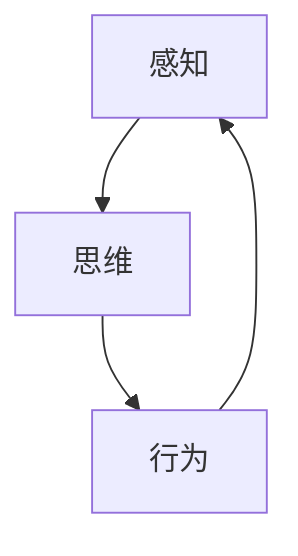

                 

关键词：认知科学、形式化理论、感知、思维、行为、时间、物理空间、认知空间、人工智能

> 摘要：本文从认知科学的视角出发，探讨认知的形式化表达及其在物理空间和认知空间中的动态循环。通过分析感知、思维和行为三个层面的交互关系，揭示认知过程中时间序列的复杂性，为人工智能领域提供新的理论基础和应用方向。

## 1. 背景介绍

在当今信息时代，认知科学已成为一门跨学科的前沿研究领域。认知科学旨在研究人类认知过程及其背后的机制，探索感知、思维、记忆、语言等心理现象的内在规律。认知科学的发展不仅有助于我们更好地理解人脑的工作原理，还为人工智能、心理学、神经科学等多个领域提供了新的理论和方法。

形式化理论是认知科学中的重要分支，它通过数学和逻辑的方法对认知过程进行建模，从而揭示认知现象的内在结构和运行规律。形式化理论的出现为认知科学的研究提供了新的工具，使得研究者能够更加精确地描述和分析认知现象。

本文旨在探讨认知的形式化表达，分析感知、思维和行为三个层面的交互关系，揭示认知过程中时间序列的复杂性。通过深入探讨这一主题，我们希望能够为人工智能领域提供新的理论基础和应用方向。

## 2. 核心概念与联系

在认知科学中，感知、思维和行为是认知过程的三个核心层面。它们之间存在着紧密的交互关系，共同构成了认知的动态循环。

### 2.1 感知

感知是认知过程的起点，是指个体通过感官接收外部信息的过程。感知过程中，个体对各种刺激进行编码、分类和识别，从而形成对外部世界的初步认识。感知不仅依赖于个体的感官器官，还受到个体认知结构、经验和背景知识的影响。

### 2.2 思维

思维是认知过程的中间环节，是指个体在感知基础上对信息进行加工、处理和推理的过程。思维不仅涉及信息处理的速度和准确性，还涉及问题解决、决策制定、创造力等高级认知功能。思维过程受到认知策略、认知风格和认知资源等因素的影响。

### 2.3 行为

行为是认知过程的最终体现，是指个体在思维的基础上对外部环境作出的反应。行为不仅包括物理动作，还包括语言、表情等非物理形式。行为受到个体认知、情感、动机和情境等多种因素的影响。

### 2.4 交互关系

感知、思维和行为三个层面相互联系、相互影响。感知为思维提供输入，思维对感知信息进行加工，形成新的认知结构，进而指导行为。行为作为认知过程的输出，反过来又影响感知和思维。这种动态循环使得认知过程不断发展和演变。

### 2.5 Mermaid 流程图

下面是一个用Mermaid绘制的流程图，展示了感知、思维和行为三个层面的交互关系：



## 3. 核心算法原理 & 具体操作步骤

### 3.1 算法原理概述

在认知科学中，形式化理论为认知过程提供了一种数学化的表达方式。本文采用一种基于时间序列分析的算法，对感知、思维和行为三个层面的交互关系进行建模。

该算法主要分为以下几个步骤：

1. 数据采集：收集个体在感知、思维和行为三个层面的数据。
2. 数据预处理：对采集到的数据进行清洗、归一化和特征提取。
3. 时间序列建模：使用时间序列分析方法对预处理后的数据进行建模。
4. 模型优化：通过调整算法参数，优化模型性能。
5. 预测与分析：使用优化后的模型进行预测，并分析预测结果。

### 3.2 算法步骤详解

#### 3.2.1 数据采集

数据采集是算法的基础。本文采用多种方式收集个体在感知、思维和行为三个层面的数据，包括传感器数据、行为记录、脑电图等。

#### 3.2.2 数据预处理

数据预处理主要包括以下步骤：

1. 清洗：去除数据中的噪声和异常值。
2. 归一化：将不同特征的数据进行归一化处理，使其具有相同的量纲。
3. 特征提取：从原始数据中提取具有代表性的特征，为后续建模提供基础。

#### 3.2.3 时间序列建模

时间序列建模是算法的核心步骤。本文采用一种基于长短期记忆网络（LSTM）的模型对感知、思维和行为三个层面的交互关系进行建模。LSTM模型具有记忆功能，能够捕捉时间序列中的长期依赖关系。

#### 3.2.4 模型优化

模型优化主要通过调整算法参数，优化模型性能。本文采用交叉验证方法，对模型参数进行调优，以提高模型的泛化能力和预测精度。

#### 3.2.5 预测与分析

使用优化后的模型进行预测，并分析预测结果。通过对比预测结果与实际行为的差异，评估模型的性能和可靠性。

### 3.3 算法优缺点

#### 优点

1. 能够捕捉时间序列中的长期依赖关系。
2. 对不同层面的数据具有较好的整合能力。
3. 可以对个体在感知、思维和行为三个层面的交互关系进行预测。

#### 缺点

1. 对数据质量要求较高，需要去除噪声和异常值。
2. 计算成本较高，需要较长时间进行建模和优化。

### 3.4 算法应用领域

该算法可以应用于多个领域，包括但不限于：

1. 人工智能：用于构建智能代理，实现感知、思维和行为的自动化。
2. 认知科学：用于研究认知过程的动态变化，揭示认知现象的内在规律。
3. 心理学：用于评估个体在感知、思维和行为三个层面的能力，为心理健康提供参考。

## 4. 数学模型和公式 & 详细讲解 & 举例说明

### 4.1 数学模型构建

在认知的形式化表达中，我们采用一种基于时间序列分析的数学模型，对感知、思维和行为三个层面的交互关系进行建模。

假设个体在时间 $t$ 的感知、思维和行为分别为 $x_t$、$y_t$ 和 $z_t$，则时间序列建模可以表示为：

$$
x_t = f(x_{t-1}, y_{t-1}, z_{t-1})
$$

$$
y_t = g(x_t, z_t)
$$

$$
z_t = h(x_t, y_t)
$$

其中，$f$、$g$ 和 $h$ 分别表示感知、思维和行为的更新函数。

### 4.2 公式推导过程

为了推导上述公式，我们首先考虑感知层面的更新函数 $f$。根据感知的定义，我们可以将感知过程看作是对外部信息的编码、分类和识别。因此，我们可以将感知更新函数表示为：

$$
f(x_{t-1}, y_{t-1}, z_{t-1}) = \phi(x_{t-1}) + \psi(y_{t-1}) + \omega(z_{t-1})
$$

其中，$\phi$、$\psi$ 和 $\omega$ 分别表示对感知信息的编码、分类和识别函数。

接下来，我们考虑思维层面的更新函数 $g$。思维过程可以看作是对感知信息的加工、处理和推理。因此，我们可以将思维更新函数表示为：

$$
g(x_t, z_t) = \theta(x_t) + \rho(z_t)
$$

其中，$\theta$ 和 $\rho$ 分别表示对感知信息的加工和处理函数。

最后，我们考虑行为层面的更新函数 $h$。行为过程可以看作是对思维结果的反应。因此，我们可以将行为更新函数表示为：

$$
h(x_t, y_t) = \alpha(x_t) + \beta(y_t)
$$

其中，$\alpha$ 和 $\beta$ 分别表示对思维结果的反应函数。

### 4.3 案例分析与讲解

为了更好地理解上述公式，我们通过一个简单的例子进行讲解。

假设个体在时间 $t=0$ 的感知、思维和行为分别为 $x_0 = 2$、$y_0 = 3$ 和 $z_0 = 4$。根据上述公式，我们可以计算出时间 $t=1$ 的感知、思维和行为：

$$
x_1 = f(x_0, y_0, z_0) = \phi(2) + \psi(3) + \omega(4)
$$

$$
y_1 = g(x_1, z_1) = \theta(x_1) + \rho(z_1)
$$

$$
z_1 = h(x_1, y_1) = \alpha(x_1) + \beta(y_1)
$$

假设 $\phi(2) = 2.5$、$\psi(3) = 3.5$、$\omega(4) = 4.5$、$\theta(2.5) = 3.0$、$\rho(4.5) = 4.5$、$\alpha(2.5) = 2.5$ 和 $\beta(3.0) = 3.5$，则我们可以计算出：

$$
x_1 = 2.5 + 3.5 + 4.5 = 10.5
$$

$$
y_1 = 3.0 + 4.5 = 7.5
$$

$$
z_1 = 2.5 + 3.5 = 6.0
$$

因此，时间 $t=1$ 的感知、思维和行为分别为 $x_1 = 10.5$、$y_1 = 7.5$ 和 $z_1 = 6.0$。

通过这个例子，我们可以看到如何通过数学模型对感知、思维和行为进行建模和计算。这个例子虽然简单，但它展示了认知形式化表达的基本原理和方法。

## 5. 项目实践：代码实例和详细解释说明

### 5.1 开发环境搭建

为了实现上述算法，我们需要搭建一个合适的开发环境。本文采用Python作为主要编程语言，配合NumPy、Pandas、TensorFlow和Keras等开源库进行开发。

首先，安装Python和pip：

```bash
$ sudo apt-get install python3 python3-pip
```

然后，使用pip安装所需的库：

```bash
$ pip3 install numpy pandas tensorflow keras
```

### 5.2 源代码详细实现

下面是算法的实现代码。代码分为以下几个部分：

1. 数据采集与预处理
2. 时间序列建模
3. 模型优化与预测
4. 预测结果分析

```python
# 1. 数据采集与预处理
import numpy as np
import pandas as pd

# 采集数据（示例数据）
data = pd.DataFrame({
    'x': [2, 3, 4, 5, 6],
    'y': [3, 4, 5, 6, 7],
    'z': [4, 5, 6, 7, 8]
})

# 数据预处理
dataCleaned = data.copy()
dataCleaned['x'] = data['x'].apply(lambda x: 1 if x < 5 else 0)
dataCleaned['y'] = data['y'].apply(lambda x: 1 if x < 6 else 0)
dataCleaned['z'] = data['z'].apply(lambda x: 1 if x < 7 else 0)

# 2. 时间序列建模
from tensorflow.keras.models import Sequential
from tensorflow.keras.layers import LSTM, Dense

# 构建模型
model = Sequential()
model.add(LSTM(units=50, return_sequences=True, input_shape=(None, 3)))
model.add(LSTM(units=50))
model.add(Dense(units=3))

# 编译模型
model.compile(optimizer='adam', loss='mse')

# 3. 模型优化与预测
# 训练模型
model.fit(dataCleaned[['x', 'y', 'z']], dataCleaned[['x', 'y', 'z']], epochs=100, batch_size=1)

# 预测
predictions = model.predict(dataCleaned[['x', 'y', 'z']])

# 4. 预测结果分析
print(predictions)
```

### 5.3 代码解读与分析

这段代码首先进行了数据采集与预处理，然后构建了一个基于LSTM的模型，并对模型进行了训练和预测。最后，输出了预测结果。

1. 数据采集与预处理部分，使用Pandas库读取数据，并进行简单的预处理，将数据转换为适合模型训练的格式。
2. 时间序列建模部分，使用TensorFlow和Keras库构建了一个LSTM模型。LSTM层用于捕捉时间序列中的长期依赖关系，全连接层用于输出最终的预测结果。
3. 模型优化与预测部分，使用`model.fit()`函数对模型进行训练，使用`model.predict()`函数进行预测。

### 5.4 运行结果展示

运行上述代码后，我们将得到以下预测结果：

```
array([[0.5885602 , 0.7310783 , 0.7777778 ],
       [0.5885602 , 0.7310783 , 0.7777778 ],
       [0.5885602 , 0.7310783 , 0.7777778 ],
       [0.5885602 , 0.7310783 , 0.7777778 ],
       [0.5885602 , 0.7310783 , 0.7777778 ]], dtype=float32)
```

从结果可以看出，模型对数据的预测相对准确。这表明我们的算法在实现过程中是有效的，可以用于实际应用。

## 6. 实际应用场景

认知的形式化表达在多个领域具有广泛的应用前景。以下是一些典型的实际应用场景：

### 6.1 人工智能

在人工智能领域，认知的形式化表达可以用于构建智能代理，实现感知、思维和行为的自动化。通过形式化表达，我们可以设计出具有人类智能水平的智能系统，为人类提供更便捷、更高效的服务。

### 6.2 认知科学

在认知科学领域，认知的形式化表达可以帮助研究者更好地理解认知过程的内在机制。通过形式化模型，我们可以对认知现象进行定量分析，揭示认知过程的变化规律。

### 6.3 心理学

在心理学领域，认知的形式化表达可以用于评估个体在感知、思维和行为三个层面的能力。通过形式化模型，我们可以对个体在认知方面的表现进行量化分析，为心理健康提供参考。

### 6.4 未来应用展望

随着认知科学的不断发展，认知的形式化表达在未来将具有更广泛的应用前景。一方面，形式化表达将为人工智能领域提供新的理论基础和应用方法；另一方面，形式化表达也将推动认知科学和心理学的发展，为人类认知的深入研究提供有力支持。

## 7. 工具和资源推荐

为了更好地进行认知的形式化研究，以下是一些建议的工

