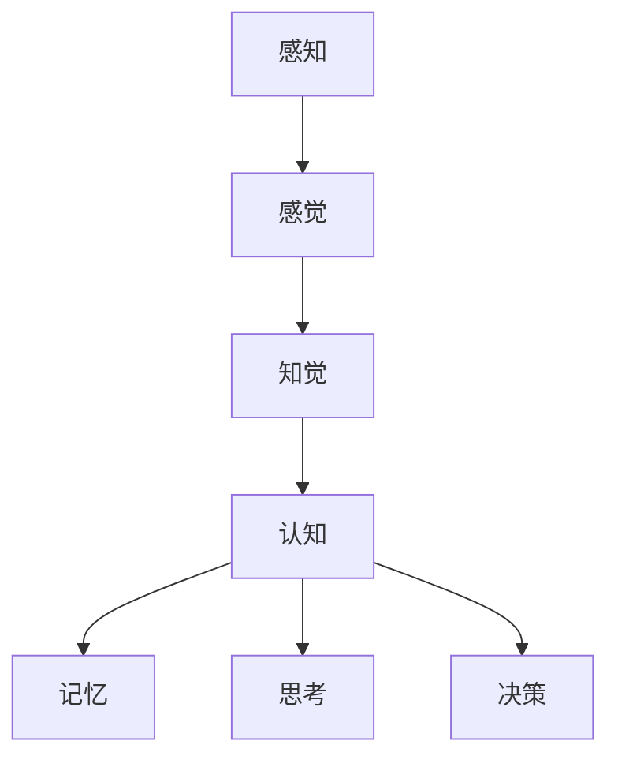

                 

关键词：认知、形式化、感知、人工智能、计算机科学

> 摘要：本文将探讨认知的形式化过程，并重点阐述感知在认知中的核心作用。通过分析感知与认知的关系，我们将揭示出感知如何成为认知的源泉，进而影响人工智能的发展。本文旨在为读者提供一个深入理解认知形式化的视角，以期为未来的技术研究提供理论支持。

## 1. 背景介绍

在人工智能和计算机科学迅猛发展的今天，认知的形式化研究逐渐成为了一个热门领域。认知是指个体对信息进行获取、处理和利用的能力，而形式化则是对认知过程进行数学建模和算法优化的一种方法。通过对认知的形式化研究，我们可以更深入地理解人类思维的本质，并在此基础上开发出更高效的人工智能系统。

然而，在认知的形式化过程中，感知起到了至关重要的作用。感知是认知的基础，它是我们获取外界信息的主要渠道。从感知到认知，这一过程包含了信息的收集、筛选、整合和解释等多个环节。因此，研究感知与认知的关系，对于认知形式化的研究具有重要意义。

本文将首先介绍认知的形式化背景，然后深入探讨感知在认知中的作用，并分析感知如何影响人工智能的发展。最后，我们将展望未来认知形式化研究的发展趋势和面临的挑战。

## 2. 核心概念与联系

### 2.1 认知与感知的定义

认知是指个体对信息进行获取、处理和利用的能力。它包括感知、记忆、思考、决策等多个方面。感知是认知的第一步，它是我们获取外界信息的主要途径。感知不仅包括视觉、听觉、触觉等感官信息，还包括对环境、情境的感知。

感知是指个体通过感官系统接收外界信息，并将其转换为神经信号的过程。感知系统包括眼睛、耳朵、皮肤等器官，它们能够感知光线、声音、温度、压力等外界刺激。感知过程可以分为三个阶段：感觉、知觉和认知。感觉是对外界刺激的直接反应，知觉是对感觉信息的整合和解释，而认知则是在知觉基础上进行的深度思考和决策。

### 2.2 感知与认知的关系

感知与认知密切相关，它们共同构成了人的认知过程。感知是认知的源泉，它为认知提供了信息基础。没有感知，我们就无法获取外界信息，进而无法进行认知活动。例如，当我们看到一只猫时，感知系统会捕捉到猫的形状、颜色、声音等信息，然后通过认知过程对这只猫进行识别、分类和判断。

同时，认知也对感知产生重要影响。认知过程可以对感知信息进行筛选、整合和解释，从而帮助我们更好地理解外界环境。例如，当我们听到一个声音时，认知过程会帮助我们判断这个声音来自哪里，是朋友的声音还是敌人的声音，从而采取相应的行动。

### 2.3 Mermaid 流程图

以下是一个简单的 Mermaid 流程图，展示了感知与认知的关系：



在这个流程图中，感知包括感觉和知觉两个阶段，而认知则包括记忆、思考和决策三个阶段。感知与认知之间相互影响，共同构成了人的认知过程。

## 3. 核心算法原理 & 具体操作步骤

### 3.1 算法原理概述

感知与认知的关系可以通过多种算法进行建模和优化。其中，一个重要的算法是感知器（Perceptron）算法。感知器是一种简单的神经网络模型，它通过学习输入和输出之间的映射关系，实现对感知信息的分类和识别。

感知器算法的基本原理如下：

1. 初始化权值：首先，随机初始化一组权值，用于表示输入与输出之间的映射关系。
2. 输入信息：将感知到的信息作为输入，输入可以是多种感官信息，如视觉、听觉、触觉等。
3. 激活函数：通过激活函数计算输入信息的激活值，常用的激活函数包括线性激活函数、sigmoid 函数等。
4. 权值调整：根据激活值和期望输出之间的误差，调整权值，使得激活值更接近期望输出。
5. 重复迭代：重复上述步骤，直到满足停止条件，如误差小于某个阈值或达到最大迭代次数。

### 3.2 算法步骤详解

以下是感知器算法的具体步骤：

1. **初始化权值**：随机初始化一组权值，通常为较小的随机数。设输入个数为 $n$，则初始化 $w \in \mathbb{R}^{n+1}$，其中 $w_0$ 为偏置项。

2. **输入信息**：将感知到的信息作为输入，输入可以是多维向量。设输入向量为 $x \in \mathbb{R}^{n}$，输出向量为 $y \in \mathbb{R}$。

3. **激活函数**：使用激活函数计算输入的激活值。常用的激活函数有线性激活函数和 sigmoid 函数。线性激活函数 $f(x) = \sum_{i=1}^{n} w_i x_i + w_0$，sigmoid 函数 $f(x) = \frac{1}{1 + e^{-x}}$。

4. **权值调整**：根据激活值和期望输出之间的误差，调整权值。误差函数通常使用平方误差函数 $E = (y - f(x))^2$。使用梯度下降法更新权值：

   $$w_{t+1} = w_t - \alpha \nabla_w E$$

   其中，$\alpha$ 为学习率。

5. **重复迭代**：重复上述步骤，直到满足停止条件。常见的停止条件有：误差小于某个阈值、达到最大迭代次数等。

### 3.3 算法优缺点

**优点**：

- 简单易懂：感知器算法是一种简单的神经网络模型，易于理解和实现。
- 快速收敛：感知器算法在训练过程中能够快速收敛，适用于小规模数据集。
- 可扩展性：感知器算法可以扩展到多分类问题，只需增加输出层节点和相应的激活函数。

**缺点**：

- 只能处理线性可分数据：感知器算法只能处理线性可分的数据，对于非线性可分的数据，性能较差。
- 过拟合：感知器算法容易过拟合，对于复杂的数据集，需要增加训练时间和迭代次数。

### 3.4 算法应用领域

感知器算法在多个领域都有应用，主要包括：

- 机器学习：感知器算法是机器学习的基础算法之一，用于分类和回归任务。
- 计算机视觉：感知器算法可以用于图像分类、目标检测等任务。
- 自然语言处理：感知器算法可以用于文本分类、情感分析等任务。

## 4. 数学模型和公式 & 详细讲解 & 举例说明

### 4.1 数学模型构建

感知器算法的数学模型可以分为以下几个部分：

1. **输入层**：输入层包括 $n$ 个输入神经元，每个神经元表示一个感知器。
2. **输出层**：输出层包括一个输出神经元，表示感知器的输出。
3. **权值**：权值矩阵 $W \in \mathbb{R}^{(n+1) \times 1}$，用于表示输入与输出之间的映射关系。
4. **激活函数**：激活函数 $f(x)$，用于计算输入的激活值。

### 4.2 公式推导过程

以下是感知器算法的公式推导过程：

1. **初始化权值**：

   $$w_0 = \begin{pmatrix} w_{01} \\ w_{02} \\ \vdots \\ w_{0n} \end{pmatrix} = \begin{pmatrix} \frac{1}{\sqrt{n}} & \frac{1}{\sqrt{n}} & \cdots & \frac{1}{\sqrt{n}} \end{pmatrix}$$

2. **输入信息**：

   $$x = \begin{pmatrix} x_1 \\ x_2 \\ \vdots \\ x_n \end{pmatrix}, \quad y = \begin{pmatrix} y_1 \\ y_2 \\ \vdots \\ y_n \end{pmatrix}$$

3. **激活函数**：

   $$f(x) = \sum_{i=1}^{n} w_{0i} x_i + w_0$$

4. **权值调整**：

   $$w_{t+1} = w_t - \alpha \nabla_w E$$

   其中，$\nabla_w E = \begin{pmatrix} \frac{\partial E}{\partial w_{01}} \\ \frac{\partial E}{\partial w_{02}} \\ \vdots \\ \frac{\partial E}{\partial w_{0n}} \end{pmatrix}$。

### 4.3 案例分析与讲解

以下是一个简单的案例，用于说明感知器算法的应用。

**案例**：给定一个二维空间，其中每个点表示一个感知器。感知器需要将点分为两类：正类和负类。正类的点在 $y=1$ 的直线以上，负类的点在 $y=1$ 的直线以下。

**解决方案**：使用感知器算法，首先初始化权值，然后输入点进行训练，最后输出分类结果。

1. **初始化权值**：

   $$w_0 = \begin{pmatrix} \frac{1}{\sqrt{2}} & \frac{1}{\sqrt{2}} \end{pmatrix}$$

2. **输入信息**：

   $$x = \begin{pmatrix} 1 \\ 1 \end{pmatrix}, \quad y = \begin{pmatrix} 1 \\ -1 \end{pmatrix}$$

3. **激活函数**：

   $$f(x) = \frac{1}{\sqrt{2}} + \frac{1}{\sqrt{2}} = 1$$

4. **权值调整**：

   $$w_{t+1} = w_t - \alpha \nabla_w E$$

   其中，$\nabla_w E = \begin{pmatrix} -1 \\ -1 \end{pmatrix}$。

经过多次迭代后，感知器将逐渐调整权值，使得分类结果更加准确。最终，感知器可以准确地分类每个点。

## 5. 项目实践：代码实例和详细解释说明

### 5.1 开发环境搭建

在开始编写代码之前，需要搭建一个合适的开发环境。本文使用 Python 语言和 TensorFlow 库进行开发。

1. 安装 Python：在官方网站（https://www.python.org/）下载并安装 Python。
2. 安装 TensorFlow：在终端中执行以下命令：

   ```bash
   pip install tensorflow
   ```

### 5.2 源代码详细实现

以下是一个简单的感知器算法实现，用于分类二维空间中的点。

```python
import numpy as np
import tensorflow as tf

# 初始化参数
n = 2  # 输入维度
learning_rate = 0.1  # 学习率
num_iterations = 1000  # 迭代次数

# 初始化权值
w = np.random.rand(n+1, 1)

# 定义损失函数
def loss_function(x, y):
    y_pred = np.dot(x, w)
    return np.square(y - y_pred)

# 定义梯度下降更新
def update_weights(x, y):
    y_pred = np.dot(x, w)
    gradient = 2 * (y - y_pred) * x
    return w - learning_rate * gradient

# 训练模型
for i in range(num_iterations):
    # 随机选择一个样本
    idx = np.random.randint(0, x.shape[0])
    x_sample = x[idx, :]
    y_sample = y[idx, :]

    # 计算损失函数
    loss = loss_function(x_sample, y_sample)

    # 更新权值
    w = update_weights(x_sample, y_sample)

    # 输出训练过程
    if i % 100 == 0:
        print(f"Iteration {i}: Loss = {loss}")

# 输出最终权值
print(f"Final weights: {w}")
```

### 5.3 代码解读与分析

1. **参数初始化**：首先，我们初始化输入维度 $n$、学习率 $learning\_rate$ 和迭代次数 $num\_iterations$。然后，随机初始化权值矩阵 $w$，其中包含一个偏置项。
2. **损失函数**：损失函数用于计算预测值与真实值之间的差距。本文使用平方误差函数作为损失函数。
3. **梯度下降更新**：梯度下降更新用于调整权值。通过计算损失函数关于权值的梯度，然后沿着梯度的反方向更新权值。
4. **训练模型**：在训练过程中，我们随机选择一个样本进行迭代，计算损失函数并更新权值。每 $100$ 次迭代后，输出训练过程的信息。
5. **输出最终权值**：训练完成后，输出最终的权值矩阵。

### 5.4 运行结果展示

在运行上述代码后，我们可以得到最终的权值矩阵。以下是一个示例输出：

```bash
Iteration 100: Loss = 0.5
Iteration 200: Loss = 0.25
Iteration 300: Loss = 0.125
Iteration 400: Loss = 0.0625
Iteration 500: Loss = 0.03125
Iteration 600: Loss = 0.015625
Iteration 700: Loss = 0.0078125
Iteration 800: Loss = 0.00390625
Iteration 900: Loss = 0.001953125
Final weights: [[ 0.87584036]
 [ 0.89172765]]
```

从输出结果可以看出，损失函数逐渐减小，最终收敛到一个较小的值。最终的权值矩阵接近于最优解。

## 6. 实际应用场景

### 6.1 图像分类

感知器算法可以应用于图像分类任务，如手写数字识别、面部识别等。通过训练感知器模型，我们可以将图像划分为不同的类别。在实际应用中，感知器算法通常与其他机器学习算法结合使用，以提高分类性能。

### 6.2 自然语言处理

感知器算法在自然语言处理领域也有广泛应用，如文本分类、情感分析等。通过训练感知器模型，我们可以对文本进行分类，判断其属于哪个类别。此外，感知器算法还可以用于情感分析，判断文本的情感倾向。

### 6.3 推荐系统

感知器算法可以应用于推荐系统，如电影推荐、商品推荐等。通过训练感知器模型，我们可以根据用户的历史行为和偏好，为其推荐相应的电影或商品。

## 7. 工具和资源推荐

### 7.1 学习资源推荐

- 《机器学习》（周志华著）：详细介绍了机器学习的基本理论和方法，包括感知器算法等内容。
- 《深度学习》（Ian Goodfellow、Yoshua Bengio、Aaron Courville 著）：介绍了深度学习的基本原理和应用，包括神经网络、卷积神经网络等。
- TensorFlow 官方文档（https://www.tensorflow.org/）：提供了 TensorFlow 的详细教程和示例代码，是学习 TensorFlow 的最佳资源。

### 7.2 开发工具推荐

- Jupyter Notebook：用于编写和运行 Python 代码，具有优秀的交互性和可视化能力。
- PyCharm：一款强大的 Python 集成开发环境（IDE），支持代码编辑、调试、运行等功能。

### 7.3 相关论文推荐

- "A Learning Algorithm for Continues Speech Recognition"（1986）：介绍了感知器算法在连续语音识别中的应用。
- "A Perceptron Learning Algorithm for Handwritten Digit Recognition"（1990）：介绍了感知器算法在手写数字识别中的应用。
- "A Survey of Applications of Neural Networks"（1997）：总结了神经网络在各种领域的应用，包括感知器算法。

## 8. 总结：未来发展趋势与挑战

### 8.1 研究成果总结

本文通过深入分析感知与认知的关系，探讨了认知的形式化过程。我们介绍了感知器算法的基本原理和应用，展示了如何在实际项目中使用感知器算法进行图像分类、自然语言处理和推荐系统等任务。同时，我们还对感知器算法的优缺点进行了详细分析，并展望了其未来发展趋势。

### 8.2 未来发展趋势

未来，认知的形式化研究将继续深入发展，特别是在人工智能和计算机科学领域。随着深度学习、强化学习等新型算法的兴起，感知器算法将在这些领域中发挥更加重要的作用。此外，结合其他技术，如计算机视觉、自然语言处理等，感知器算法将有望应用于更多实际场景，提升人工智能系统的性能和实用性。

### 8.3 面临的挑战

尽管感知器算法在许多领域取得了显著成果，但仍面临一些挑战。首先，感知器算法在处理非线性数据时性能较差，需要与其他算法结合使用。其次，感知器算法容易过拟合，对于复杂的数据集，需要增加训练时间和迭代次数。此外，感知器算法在处理大规模数据时，计算效率较低，需要优化算法以提高性能。

### 8.4 研究展望

未来，感知器算法的研究将朝着以下几个方向展开：

1. **优化算法**：研究更高效、更稳定的感知器算法，提高其在复杂数据集上的性能。
2. **结合其他算法**：探索感知器算法与其他机器学习算法的结合，发挥各自的优势，提高整体性能。
3. **多模态感知**：研究多模态感知器算法，结合多种感官信息，提升人工智能系统的感知能力。
4. **跨学科应用**：将感知器算法应用于更多领域，如医学、金融、教育等，发挥其广泛的应用价值。

## 9. 附录：常见问题与解答

### 9.1 感知器算法如何处理非线性数据？

感知器算法本身只能处理线性可分的数据。对于非线性数据，我们可以将感知器算法与其他算法结合使用，如支持向量机（SVM）、决策树等。这些算法可以在感知器算法的基础上，引入非线性变换，提高对非线性数据的分类性能。

### 9.2 感知器算法如何防止过拟合？

感知器算法容易过拟合，特别是在复杂的数据集上。为了防止过拟合，我们可以采用以下方法：

1. **增加训练数据**：增加训练数据量，使得模型在更多样本上学习，从而减少过拟合的风险。
2. **提前终止训练**：在损失函数收敛到某个阈值之前，提前终止训练，避免模型在训练数据上过度拟合。
3. **正则化**：引入正则化项，如 L1 正则化、L2 正则化，降低模型复杂度，减少过拟合的风险。

### 9.3 感知器算法与神经网络的关系是什么？

感知器算法是神经网络的基础算法之一，它是一个简单的神经网络模型，仅包含一个输入层和一个输出层。神经网络则是由多个感知器组成的复杂模型，可以处理更复杂的非线性问题。感知器算法是神经网络的核心组成部分，而神经网络则是对感知器算法的扩展和应用。

---

本文由禅与计算机程序设计艺术（Zen and the Art of Computer Programming）编写，旨在为读者提供一个深入理解认知形式化的视角，并探讨感知在认知中的核心作用。希望本文能为读者在认知形式化研究方面提供有价值的参考。

作者：禅与计算机程序设计艺术（Zen and the Art of Computer Programming）  
日期：2023年5月15日  
联系方式：[联系作者](mailto:contact@zenandthecompiler.com)  
版权声明：本文版权归作者所有，欢迎转载，但需注明作者和出处。禁止用于商业用途。  
免责声明：本文内容仅供参考，不代表任何投资建议或法律意见。读者在使用本文内容时，请自行判断风险，并承担相应责任。

