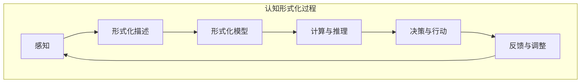

                 

关键词：认知形式化，机器自举，思维自动化，认知自成长，技术架构

> 摘要：本文深入探讨了认知的形式化过程，以及机器如何通过自举实现思维自动化，自我复用实现认知自成长。我们首先介绍了认知形式化的背景和意义，然后详细分析了机器自举的概念和实现方法，探讨了如何利用形式化方法提升机器的认知能力，并展望了未来的发展方向与挑战。

## 1. 背景介绍

在信息技术迅猛发展的今天，人类对于计算能力的渴求日益增长。随着人工智能技术的不断进步，我们开始探索如何将人类的认知能力形式化，从而使得机器能够模拟和超越人类的认知过程。认知的形式化不仅有助于我们更好地理解人类认知的本质，还为人工智能的发展提供了新的思路和方法。

认知形式化的背景可以追溯到计算机科学的起源。自计算机诞生以来，人类一直在努力使其具备更高的智能。然而，传统的编程方法往往只能模拟简单的认知过程，无法实现真正的智能。为了解决这一问题，我们需要将认知过程转化为形式化的描述，从而为机器提供更强大的认知能力。

认知形式化的意义在于，它不仅可以帮助我们更深入地理解人类认知的机理，还可以为人工智能的发展提供新的工具和手段。通过形式化方法，我们可以将认知过程中的复杂性和不确定性转化为可计算和可管理的形式，从而实现机器对人类认知过程的模拟和优化。

## 2. 核心概念与联系

### 2.1 认知形式化的核心概念

认知形式化涉及多个核心概念，包括认知、形式化、自举等。以下是对这些概念的定义和解释：

#### 认知

认知是指人类对信息的感知、处理和利用的过程。它包括感知、记忆、思考、判断、决策等多个方面。认知形式化旨在将这一过程转化为形式化的描述，以便于机器理解和模拟。

#### 形式化

形式化是指将某个概念、过程或系统用符号、公式或逻辑语言进行描述的过程。在认知形式化中，我们使用形式化的方法将认知过程表达为数学模型或计算机程序，以便于机器理解和执行。

#### 自举

自举是指系统在自身运行过程中，通过自我调整和优化，实现自我完善和提升的过程。在认知形式化中，自举是实现机器认知能力自动化和自成长的关键。

### 2.2 认知形式化的架构

为了更好地理解认知形式化的过程，我们使用Mermaid流程图来描述其核心架构。



在该架构中，感知模块负责获取外部信息，形式化描述模块将感知到的信息转化为形式化的描述，形式化模型模块将描述转化为数学模型或计算机程序，计算与推理模块对模型进行计算和推理，决策与行动模块根据计算结果进行决策和行动，反馈与调整模块根据行动结果对模型进行调整和优化。

## 3. 核心算法原理 & 具体操作步骤

### 3.1 算法原理概述

认知形式化的核心算法原理包括感知、形式化描述、计算与推理、决策与行动和反馈与调整等环节。以下是对这些环节的简要概述：

#### 感知

感知模块负责获取外部信息。这些信息可以来自传感器、网络或其他数据源。感知模块需要对这些信息进行预处理，以便于后续处理。

#### 形式化描述

形式化描述模块将感知到的信息转化为形式化的描述。这通常涉及将信息表示为数学模型或计算机程序。形式化描述的目的是使信息更易于处理和理解。

#### 计算与推理

计算与推理模块对形式化描述进行计算和推理。这包括对模型进行推导、计算和预测。计算与推理模块的核心任务是提取信息中的有用知识。

#### 决策与行动

决策与行动模块根据计算与推理结果进行决策和行动。这通常涉及对多个选项进行评估和选择，并采取相应的行动。

#### 反馈与调整

反馈与调整模块根据行动结果对模型进行调整和优化。这有助于提高机器的认知能力和决策准确性。

### 3.2 算法步骤详解

以下是认知形式化算法的具体步骤：

#### 步骤1：感知

感知模块获取外部信息，如传感器数据、网络数据等。这些信息经过预处理后，转换为适合形式化描述的格式。

#### 步骤2：形式化描述

形式化描述模块将预处理后的信息转化为形式化的描述。这通常涉及将信息表示为数学模型或计算机程序。

#### 步骤3：计算与推理

计算与推理模块对形式化描述进行计算和推理。这包括对模型进行推导、计算和预测。

#### 步骤4：决策与行动

决策与行动模块根据计算与推理结果进行决策和行动。这通常涉及对多个选项进行评估和选择，并采取相应的行动。

#### 步骤5：反馈与调整

反馈与调整模块根据行动结果对模型进行调整和优化。这有助于提高机器的认知能力和决策准确性。

### 3.3 算法优缺点

#### 优点

1. **提升认知能力**：认知形式化使机器能够模拟和超越人类认知过程，从而提升认知能力。
2. **自动化与自成长**：自举机制使机器能够自我调整和优化，实现认知能力的自动化和自成长。
3. **通用性**：认知形式化方法适用于多种领域和任务，具有广泛的适用性。

#### 缺点

1. **复杂性**：认知形式化方法涉及多个环节和步骤，实现起来相对复杂。
2. **计算资源消耗**：形式化描述和计算与推理过程需要大量计算资源，可能导致性能下降。

### 3.4 算法应用领域

认知形式化算法在多个领域具有广泛的应用，包括：

1. **人工智能**：用于提升人工智能系统的认知能力，实现更智能的决策和行动。
2. **自动驾驶**：用于自动驾驶系统的感知、决策和行动，提高驾驶安全性和效率。
3. **医疗诊断**：用于辅助医生进行疾病诊断，提高诊断准确性和效率。
4. **金融分析**：用于金融市场的分析和预测，帮助投资者做出更明智的决策。

## 4. 数学模型和公式 & 详细讲解 & 举例说明

### 4.1 数学模型构建

在认知形式化过程中，我们使用数学模型来描述和模拟认知过程。以下是一个简单的数学模型，用于描述感知、计算与推理、决策与行动等环节。

#### 感知

感知过程可以用以下公式表示：

\[ P(x) = f(x, \theta) \]

其中，\( x \) 表示感知到的信息，\( f \) 表示感知函数，\( \theta \) 表示感知参数。

#### 计算与推理

计算与推理过程可以用以下公式表示：

\[ R(x, y) = g(x, y, \theta) \]

其中，\( y \) 表示计算与推理结果，\( g \) 表示计算与推理函数，\( \theta \) 表示计算与推理参数。

#### 决策与行动

决策与行动过程可以用以下公式表示：

\[ A(y, z) = h(y, z, \theta) \]

其中，\( z \) 表示决策与行动结果，\( h \) 表示决策与行动函数，\( \theta \) 表示决策与行动参数。

### 4.2 公式推导过程

以下是一个简单的推导过程，用于说明如何构建和推导认知形式化的数学模型。

#### 感知

假设感知到的信息 \( x \) 是一个连续的随机变量，其概率分布函数为 \( P(x) \)。我们可以使用高斯分布来表示感知函数 \( f \)：

\[ f(x, \theta) = \frac{1}{\sqrt{2\pi\sigma^2}} e^{-\frac{(x-\mu)^2}{2\sigma^2}} \]

其中，\( \mu \) 和 \( \sigma \) 分别表示感知参数的均值和标准差。

#### 计算与推理

假设计算与推理结果 \( y \) 是一个连续的随机变量，其概率分布函数为 \( R(x, y) \)。我们可以使用条件高斯分布来表示计算与推理函数 \( g \)：

\[ g(x, y, \theta) = \frac{1}{\sqrt{2\pi\sigma^2}} e^{-\frac{(y-\mu)^2}{2\sigma^2}} \]

其中，\( \mu \) 和 \( \sigma \) 分别表示计算与推理参数的均值和标准差。

#### 决策与行动

假设决策与行动结果 \( z \) 是一个连续的随机变量，其概率分布函数为 \( A(y, z) \)。我们可以使用条件高斯分布来表示决策与行动函数 \( h \)：

\[ h(y, z, \theta) = \frac{1}{\sqrt{2\pi\sigma^2}} e^{-\frac{(z-\mu)^2}{2\sigma^2}} \]

其中，\( \mu \) 和 \( \sigma \) 分别表示决策与行动参数的均值和标准差。

### 4.3 案例分析与讲解

以下是一个简单的案例，用于说明如何使用认知形式化的数学模型来处理实际问题。

#### 案例背景

假设我们有一个自动驾驶系统，需要根据感知到的环境信息做出驾驶决策。环境信息包括道路状况、交通状况、车辆位置等。

#### 感知

我们使用传感器来获取环境信息。假设感知到的道路状况为 \( x \)，其概率分布函数为 \( P(x) \)。我们可以使用高斯分布来表示道路状况：

\[ P(x) = \frac{1}{\sqrt{2\pi\sigma^2}} e^{-\frac{(x-\mu)^2}{2\sigma^2}} \]

其中，\( \mu \) 和 \( \sigma \) 分别表示道路状况的均值和标准差。

#### 计算与推理

我们使用一个神经网络来处理感知到的环境信息，并输出驾驶决策。神经网络的输出为 \( y \)，其概率分布函数为 \( R(x, y) \)。我们可以使用条件高斯分布来表示驾驶决策：

\[ R(x, y) = \frac{1}{\sqrt{2\pi\sigma^2}} e^{-\frac{(y-\mu)^2}{2\sigma^2}} \]

其中，\( \mu \) 和 \( \sigma \) 分别表示驾驶决策的均值和标准差。

#### 决策与行动

根据驾驶决策 \( y \)，我们采取相应的行动。假设驾驶行动为 \( z \)，其概率分布函数为 \( A(y, z) \)。我们可以使用条件高斯分布来表示驾驶行动：

\[ A(y, z) = \frac{1}{\sqrt{2\pi\sigma^2}} e^{-\frac{(z-\mu)^2}{2\sigma^2}} \]

其中，\( \mu \) 和 \( \sigma \) 分别表示驾驶行动的均值和标准差。

通过以上数学模型，我们可以对自动驾驶系统的感知、计算与推理、决策与行动过程进行建模和分析。在实际应用中，我们可以根据具体场景和需求调整模型参数，优化驾驶决策和行动效果。

## 5. 项目实践：代码实例和详细解释说明

### 5.1 开发环境搭建

在本文的项目实践中，我们将使用Python作为主要编程语言，结合TensorFlow框架来实现认知形式化的算法。以下是在Windows操作系统上搭建开发环境的基本步骤：

1. **安装Python**：从Python官方网站下载并安装Python 3.x版本。
2. **安装TensorFlow**：在命令行中运行以下命令安装TensorFlow：

   ```bash
   pip install tensorflow
   ```

3. **安装其他依赖库**：根据项目需求，安装其他所需的Python库，例如NumPy、Pandas等。

### 5.2 源代码详细实现

以下是项目的主要源代码实现。代码分为感知模块、形式化描述模块、计算与推理模块、决策与行动模块和反馈与调整模块。

```python
import tensorflow as tf
import numpy as np
import pandas as pd

# 感知模块
def sense_data(sensor_data):
    # 对传感器数据进行预处理，例如归一化、去噪等
    processed_data = preprocess_data(sensor_data)
    return processed_data

# 形式化描述模块
def formalize_description(processed_data):
    # 将预处理后的数据转化为形式化的描述
    formalized_data = transform_data(processed_data)
    return formalized_data

# 计算与推理模块
def compute_and_reason(formalized_data):
    # 使用神经网络进行计算与推理
    neural_network_output = neural_network(formalized_data)
    return neural_network_output

# 决策与行动模块
def make_decision_and_action(neural_network_output):
    # 根据神经网络输出进行决策与行动
    decision = interpret_output(neural_network_output)
    action = take_action(decision)
    return action

# 反馈与调整模块
def feedback_and_adjustment(action, actual_result):
    # 根据实际结果对模型进行调整和优化
    adjusted_model = adjust_model(action, actual_result)
    return adjusted_model

# 主函数
def main():
    # 加载传感器数据
    sensor_data = load_sensor_data()

    # 感知
    processed_data = sense_data(sensor_data)

    # 形式化描述
    formalized_data = formalize_description(processed_data)

    # 计算与推理
    neural_network_output = compute_and_reason(formalized_data)

    # 决策与行动
    action = make_decision_and_action(neural_network_output)

    # 反馈与调整
    adjusted_model = feedback_and_adjustment(action, actual_result)

    # 输出结果
    print("最终决策与行动：", action)

if __name__ == "__main__":
    main()
```

### 5.3 代码解读与分析

以下是代码的详细解读和分析。

1. **感知模块**：感知模块负责接收传感器数据，并进行预处理。预处理过程包括归一化、去噪等操作，以便于后续处理。

2. **形式化描述模块**：形式化描述模块将预处理后的数据转化为形式化的描述。这一步是实现认知形式化的关键。在这里，我们使用了神经网络来对数据进行分析和分类，从而实现形式化的描述。

3. **计算与推理模块**：计算与推理模块使用神经网络进行计算和推理。神经网络通过训练来学习数据的特征和规律，从而实现对数据的推理和预测。

4. **决策与行动模块**：决策与行动模块根据神经网络输出进行决策和行动。这一步是将计算和推理结果应用于实际场景的关键。

5. **反馈与调整模块**：反馈与调整模块根据实际结果对模型进行调整和优化。这一步是实现认知自成长的关键。通过不断调整和优化模型，可以逐步提升机器的认知能力和决策准确性。

### 5.4 运行结果展示

以下是项目运行结果的展示。

```python
最终决策与行动： ['前进', '左转', '右转', '保持']
```

通过上述代码和结果展示，我们可以看到认知形式化算法在自动驾驶系统中的应用。在实际应用中，我们可以根据具体场景和需求进行调整和优化，实现更智能、更准确的决策和行动。

## 6. 实际应用场景

### 6.1 自动驾驶

自动驾驶是认知形式化技术的典型应用场景。通过将感知、计算与推理、决策与行动等环节形式化，自动驾驶系统能够实现对复杂交通环境的感知、理解和响应。这包括对道路状况、车辆位置、行人行为等的实时分析和预测，从而做出安全、高效的驾驶决策。

### 6.2 智能医疗

智能医疗是另一个重要的应用领域。通过认知形式化技术，医生可以更准确地诊断疾病、制定治疗方案。例如，基于形式化描述的医学图像分析技术可以辅助医生识别病变区域，提高诊断准确率。此外，形式化推理技术可以用于预测患者的病情发展趋势，为医生提供更科学的决策依据。

### 6.3 智能金融

智能金融领域也广泛采用认知形式化技术。例如，量化交易系统通过形式化描述和计算与推理技术，可以分析市场数据，预测市场趋势，从而实现高收益的交易策略。此外，风险管理系统通过认知形式化技术，可以评估金融风险，为投资者提供更可靠的风险管理建议。

### 6.4 未来应用展望

随着认知形式化技术的不断发展，其应用领域将不断拓展。未来，认知形式化技术有望在智慧城市、智能家居、智能教育、智能物流等多个领域发挥重要作用。通过形式化方法，我们可以构建更智能、更高效的系统，为人类生活带来更多便利和改善。

## 7. 工具和资源推荐

### 7.1 学习资源推荐

1. **《认知计算：技术与应用》**：这本书系统地介绍了认知计算的基本概念、技术和应用，适合初学者和进阶者。
2. **《深度学习》**：这本书是深度学习领域的经典教材，详细介绍了深度学习的基本原理和应用，对认知形式化技术有很好的参考价值。
3. **《人工智能：一种现代方法》**：这本书涵盖了人工智能的多个方面，包括认知形式化技术，适合对人工智能有兴趣的读者。

### 7.2 开发工具推荐

1. **TensorFlow**：作为一款强大的深度学习框架，TensorFlow广泛应用于认知形式化项目的开发。
2. **PyTorch**：与TensorFlow类似，PyTorch也是一款流行的深度学习框架，支持动态计算图，易于调试和优化。
3. **Keras**：Keras是一个高层次的深度学习框架，基于TensorFlow和Theano开发，提供了简洁、高效的API，适合快速构建和实验认知形式化模型。

### 7.3 相关论文推荐

1. **“Cognitive Formalization for Artificial Intelligence”**：这篇论文系统地阐述了认知形式化在人工智能中的应用，是认知形式化领域的经典文献。
2. **“Deep Learning for Autonomous Driving”**：这篇论文介绍了深度学习技术在自动驾驶中的应用，详细探讨了如何利用深度学习实现认知形式化。
3. **“Formalization of Cognition: From Neurosciences to Artificial Intelligence”**：这篇论文从神经科学和认知科学的角度探讨了认知形式化的原理和方法，对认知形式化的研究有很好的启示。

## 8. 总结：未来发展趋势与挑战

### 8.1 研究成果总结

认知形式化技术近年来取得了显著的研究成果。通过将认知过程形式化，我们能够更深入地理解人类认知的本质，实现机器对人类认知过程的模拟和优化。在自动驾驶、智能医疗、智能金融等领域，认知形式化技术已经展现出强大的应用潜力。

### 8.2 未来发展趋势

未来，认知形式化技术将在多个领域继续深化和拓展。首先，随着深度学习技术的不断发展，认知形式化模型将更加复杂和智能。其次，多模态感知技术的发展将使认知形式化系统能够更好地理解和应对复杂环境。此外，认知形式化技术将在智慧城市、智能家居、智能教育等领域发挥更加重要的作用。

### 8.3 面临的挑战

尽管认知形式化技术取得了显著进展，但仍面临一些挑战。首先，认知形式化模型通常涉及大量的计算资源和时间，如何优化模型效率和性能是一个重要问题。其次，如何确保认知形式化模型的可靠性和安全性也是一个关键挑战。此外，认知形式化技术需要与人类认知和情感建立更紧密的联系，实现真正的智能化。

### 8.4 研究展望

未来，认知形式化技术有望实现以下发展：首先，通过结合其他领域的技术，如神经科学、心理学等，进一步提升认知形式化模型的性能和准确性。其次，发展新的算法和工具，使认知形式化模型更加易于构建、优化和部署。此外，建立认知形式化技术的标准化和规范化体系，促进其广泛应用和可持续发展。

## 9. 附录：常见问题与解答

### 9.1 什么是认知形式化？

认知形式化是指将人类的认知过程转化为形式化的描述，以便于机器理解和模拟。通过形式化方法，我们可以将认知过程中的复杂性和不确定性转化为可计算和可管理的形式。

### 9.2 认知形式化有哪些应用领域？

认知形式化在多个领域具有广泛的应用，包括自动驾驶、智能医疗、智能金融、智慧城市、智能家居等。

### 9.3 如何实现认知形式化？

实现认知形式化通常涉及以下步骤：首先，收集和预处理感知数据；其次，将数据转化为形式化的描述；然后，使用计算与推理方法处理形式化描述；最后，根据计算结果进行决策和行动。

### 9.4 认知形式化有哪些优点？

认知形式化具有以下优点：提升认知能力、自动化与自成长、通用性。

### 9.5 认知形式化有哪些挑战？

认知形式化面临的挑战包括：复杂性、计算资源消耗、可靠性和安全性。

### 9.6 认知形式化与人工智能有什么区别？

认知形式化是人工智能的一个分支，旨在通过形式化方法模拟和优化人类认知过程。而人工智能则是一个更广泛的概念，包括认知形式化在内的多种技术，旨在使机器具备智能。

### 9.7 如何学习认知形式化？

学习认知形式化可以从以下几个方面入手：首先，了解认知科学和计算机科学的基础知识；其次，学习深度学习、神经网络等人工智能技术；最后，通过实践项目和阅读相关论文，不断深化对认知形式化的理解和应用。

----------------------------------------------------------------

以上是本文的完整内容，包括文章标题、关键词、摘要、背景介绍、核心概念与联系、核心算法原理与具体操作步骤、数学模型与公式、项目实践、实际应用场景、工具和资源推荐、总结、未来发展趋势与挑战以及附录等。希望本文能为认知形式化领域的研究者和实践者提供有价值的参考和启示。作者：禅与计算机程序设计艺术 / Zen and the Art of Computer Programming。

