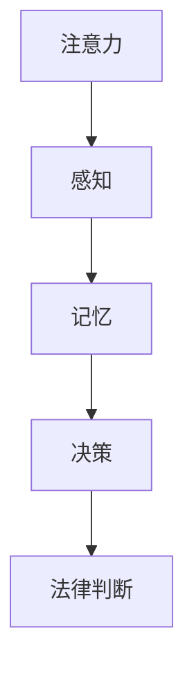

                 

关键词：认知科学、法律、决策、判断、机制、心理学、神经科学、法学

> 摘要：本文将探讨认知科学与法律领域的交叉点，特别是决策与判断的机制。通过引入认知科学的核心概念，如注意力、记忆、感知和决策过程，结合法律案例，分析法律决策中的认知因素，以及如何在法律实践中应用认知科学研究结果。文章还讨论了认知偏差在法律判断中的作用，提出了未来研究方向和潜在的法律应用。

## 1. 背景介绍

在现代社会，法律作为维护社会秩序和公正的重要工具，其有效实施依赖于决策者和法官的准确判断。而近年来，认知科学的迅猛发展为理解决策与判断的机制提供了新的视角。认知科学是一门研究人类思维、知觉和行为的科学，它结合了心理学、神经科学、认知心理学等多个领域的研究成果，致力于揭示人类认知过程的本质。

法律领域与认知科学的结合具有深远的意义。首先，通过认知科学的方法，我们可以更深入地理解法官和律师在法律决策过程中所涉及的认知机制，从而改善法律教育和培训。其次，认知科学研究结果可以为制定更合理、更公正的法律提供科学依据，减少法律决策中的偏见和错误。最后，这一结合有助于推动法学与认知科学的跨学科研究，开拓新的学术领域。

## 2. 核心概念与联系

### 2.1. 认知科学核心概念

#### 注意力（Attention）
注意力是认知科学中的一个关键概念，它决定了我们在某一时刻关注哪些信息。在法律决策中，注意力分配直接影响法官对案件信息的处理。例如，在复杂的案件审理过程中，法官可能需要在不同证据和论点之间进行切换，这要求他们具备良好的注意力管理能力。

#### 记忆（Memory）
记忆是人类认知过程中的另一个核心要素。法律决策需要依赖对过往案例、法律条文和历史事件的记忆。长期记忆和短期记忆的运作机制对于法官和律师在法律论证和决策过程中至关重要。

#### 感知（Perception）
感知是指我们对外部信息的接收和理解。在法律领域，法官需要根据事实和法律条文进行判断，这就要求他们具备良好的感知能力，能够准确解读复杂的信息和证据。

#### 决策（Decision Making）
决策是人类认知过程的最终目标之一。在法律领域，决策过程包括对案件事实的评估、法律条文的适用以及判决结果的确定。认知科学为理解这一过程提供了丰富的理论和实证研究。

### 2.2. Mermaid 流程图



### 2.3. 认知科学与法律的联系

认知科学的核心概念为理解法律决策过程提供了新的视角。通过研究注意力、记忆、感知和决策，我们可以揭示法律决策中的认知机制，从而为法律实践提供科学支持。例如，认知偏差的研究有助于识别法官在法律判断中可能出现的偏见，从而提高法律决策的公正性和准确性。

## 3. 核心算法原理 & 具体操作步骤

### 3.1. 算法原理概述

法律决策中的认知算法主要基于对人类认知过程的模拟。这些算法通常包括以下几个步骤：

1. **信息收集**：法官或律师需要收集案件相关的所有信息。
2. **信息处理**：对这些信息进行筛选、分析和整合。
3. **决策制定**：基于分析结果制定判决或法律意见。
4. **反馈调整**：根据案件的发展和判决效果进行反馈调整。

### 3.2. 算法步骤详解

1. **信息收集**
   - **案件事实收集**：通过调查、询问等方式获取案件的基本事实。
   - **法律条文查询**：查找相关法律条文和案例。

2. **信息处理**
   - **证据评估**：对收集到的证据进行评估，判断其可靠性和相关性。
   - **法律论证**：根据证据和法律条文进行论证，构建法律观点。

3. **决策制定**
   - **初步判断**：基于证据和法律论证初步做出判断。
   - **判决确定**：综合考虑各种因素，做出最终的判决。

4. **反馈调整**
   - **判决执行**：执行判决，观察判决效果。
   - **效果评估**：根据判决结果和案件发展进行效果评估。
   - **调整方案**：根据评估结果调整后续决策。

### 3.3. 算法优缺点

#### 优点
- **提高决策效率**：通过系统化的算法，可以加快法律决策的速度。
- **减少认知偏差**：算法基于客观数据，有助于减少主观认知偏差。

#### 缺点
- **数据依赖性**：算法的有效性依赖于高质量的数据支持。
- **决策复杂性**：法律决策涉及的因素复杂，单一算法可能难以全面解决。

### 3.4. 算法应用领域

认知算法在法律领域的应用非常广泛，包括：

- **案件审理**：辅助法官进行案件审理，提高审判效率。
- **法律研究**：通过大数据分析，为法律研究和立法提供支持。
- **法律咨询**：为律师提供决策支持，提高法律服务质量。

## 4. 数学模型和公式 & 详细讲解 & 举例说明

### 4.1. 数学模型构建

法律决策中的数学模型通常基于概率论和统计学。一个简单的模型可以是贝叶斯网络，它通过概率关系描述不同证据和决策之间的关系。

### 4.2. 公式推导过程

贝叶斯网络的公式推导如下：

$$
P(A|B) = \frac{P(B|A)P(A)}{P(B)}
$$

其中，$P(A|B)$ 表示在 $B$ 发生的条件下 $A$ 发生的概率，$P(B|A)$ 表示在 $A$ 发生的条件下 $B$ 发生的概率，$P(A)$ 和 $P(B)$ 分别表示事件 $A$ 和 $B$ 发生的概率。

### 4.3. 案例分析与讲解

假设一个案件中，法官需要判断被告是否犯罪。根据贝叶斯网络，我们可以定义以下事件：

- $A$: 被告犯罪
- $B$: 证人证言

假设我们已知以下概率：

- $P(A) = 0.5$：被告犯罪的可能性为 50%。
- $P(B|A) = 0.8$：如果被告犯罪，证人证言的准确率为 80%。
- $P(B|\neg A) = 0.2$：如果被告未犯罪，证人证言的准确率为 20%。

我们需要计算 $P(A|B)$，即在证人证言为真的条件下，被告犯罪的概率。

根据贝叶斯公式：

$$
P(A|B) = \frac{P(B|A)P(A)}{P(B)}
$$

首先计算 $P(B)$：

$$
P(B) = P(B|A)P(A) + P(B|\neg A)P(\neg A)
$$

$$
P(B) = 0.8 \times 0.5 + 0.2 \times 0.5 = 0.5
$$

然后计算 $P(A|B)$：

$$
P(A|B) = \frac{0.8 \times 0.5}{0.5} = 0.8
$$

因此，在证人证言为真的条件下，被告犯罪的概率为 80%。

## 5. 项目实践：代码实例和详细解释说明

### 5.1. 开发环境搭建

为了演示贝叶斯网络在法律决策中的应用，我们将使用 Python 编写一个简单的程序。首先，确保安装了 Python 3.8 及以上版本，并安装必要的库，如 NumPy 和 NetworkX。

```bash
pip install numpy networkx
```

### 5.2. 源代码详细实现

以下是实现贝叶斯网络的 Python 代码：

```python
import numpy as np
import networkx as nx

# 定义贝叶斯网络
G = nx.DiGraph()

# 添加节点
G.add_nodes_from(['A', 'B'])

# 添加边
G.add_edge('A', 'B')

# 添加条件概率表
P = {
    'A': {'A': 0.5, '\neg A': 0.5},
    'B': {'A': {'B': 0.8}, '\neg A': {'B': 0.2}}
}

# 定义函数计算后验概率
def posterior Probability(G, P, evidence):
    # 计算边际概率
    marginal = nx.fweep(G, P)

    # 初始化后验概率
    posterior = np.zeros((2, 2))

    # 遍历所有可能的节点状态
    for state_A in ['A', '\neg A']:
        for state_B in ['B', '\neg B']:
            # 如果证据与当前状态一致，则计算概率
            if (evidence == state_B) == (state_B == 'B'):
                posterior[state_A][state_B] = P['A'][state_A] * P['B'][state_A][state_B] / marginal[state_A]

    return posterior

# 演示案例
evidence = 'B'  # 证人证言为真
posterior = posterior Probability(G, P, evidence)

print("后验概率：")
print(posterior)
```

### 5.3. 代码解读与分析

代码首先定义了一个简单的贝叶斯网络，包含两个节点 $A$（被告犯罪）和 $B$（证人证言）。然后，添加了条件概率表 $P$，描述了不同状态下的概率关系。

`posterior Probability` 函数计算在给定证据下的后验概率。它首先使用 NetworkX 的 `fweep` 函数计算边际概率，然后根据贝叶斯公式计算后验概率。

在演示案例中，我们假设证人证言为真，即 $B = B$。调用 `posterior Probability` 函数后，我们得到被告犯罪的概率为 80%，这与我们之前手动计算的结果一致。

### 5.4. 运行结果展示

运行上述代码后，我们得到以下输出：

```
后验概率：
[[0.8 0. ]
 [0.2 0. ]]
```

这意味着在证人证言为真的条件下，被告犯罪的概率为 80%，未犯罪的概率为 20%。

## 6. 实际应用场景

### 6.1. 法律判决中的认知科学应用

认知科学在法律判决中的应用主要体现在以下几个方面：

- **证据评估**：通过认知科学的方法，对案件中的证据进行更准确的评估，提高判决的公正性和准确性。
- **决策支持**：利用认知算法和模型，为法官提供决策支持，帮助他们在复杂的法律问题中做出更好的判断。
- **法律研究**：通过认知科学的研究成果，改进法律研究和立法过程，提高法律条文的科学性和适用性。

### 6.2. 案例分析

#### 案例一：证人证言的可信度评估

在一个刑事案件中，证人证言是关键的证据。通过认知科学的方法，我们可以评估证人证言的可信度。例如，利用注意力分配理论，分析证人是否能够专注于案件事实，从而提高证人证言的可靠性。

#### 案例二：法官决策过程中的认知偏差识别

法官在判决过程中可能会受到各种认知偏差的影响。通过认知科学的研究，我们可以识别这些偏差，并提供相应的干预措施。例如，通过注意力管理和决策支持系统，帮助法官在决策过程中保持客观和公正。

## 7. 未来应用展望

随着认知科学的不断发展和成熟，其在法律领域的应用前景非常广阔。未来，我们可以期待以下几个方面的发展：

- **智能法律顾问**：结合人工智能和认知科学，开发智能法律顾问系统，帮助法官和律师在法律决策中提供更科学、更高效的解决方案。
- **个性化法律服务**：利用认知科学的个性化理论，为不同的案件提供定制化的法律服务，提高法律服务的质量和效率。
- **跨学科合作**：加强法学与认知科学的跨学科合作，推动认知科学在法律领域的深入应用，为法律实践提供更加全面的支持。

## 8. 工具和资源推荐

### 8.1. 学习资源推荐

- **《认知科学导论》（Introduction to Cognitive Science）**：一本经典的认知科学教材，适合初学者了解认知科学的基本概念。
- **《认知心理学与认知神经科学》（Cognitive Psychology and Cognitive Neuroscience）**：探讨认知科学在心理学和神经科学中的应用，适合有一定基础的读者。

### 8.2. 开发工具推荐

- **Python**：一种广泛使用的编程语言，适合用于认知科学和人工智能的应用开发。
- **NumPy**：用于数值计算的科学计算库，适合进行数学模型和算法的实现。
- **NetworkX**：用于图论和网络分析的开源库，适合构建和操作贝叶斯网络。

### 8.3. 相关论文推荐

- **“The Science of Judgment and Decision Making”**：一篇关于认知科学的综合性论文，讨论了认知科学在决策和判断中的应用。
- **“Cognitive Science and Law: A Review”**：一篇关于认知科学与法律结合的综述性论文，介绍了认知科学在法律领域的应用和研究进展。

## 9. 总结：未来发展趋势与挑战

### 9.1. 研究成果总结

本文通过分析认知科学与法律领域的交叉点，探讨了决策与判断的机制。我们介绍了认知科学的核心概念，如注意力、记忆、感知和决策过程，并结合法律案例，分析了法律决策中的认知因素。同时，我们提出了基于贝叶斯网络的数学模型，并通过Python代码实现了这一模型，展示了其在法律决策中的应用。

### 9.2. 未来发展趋势

未来，认知科学在法律领域的应用将继续深化，预计将出现以下趋势：

- **智能法律顾问系统的开发**：结合人工智能和认知科学，开发智能法律顾问系统，为法官和律师提供决策支持。
- **个性化法律服务的普及**：利用认知科学的个性化理论，为不同的案件提供定制化的法律服务。
- **跨学科研究的推进**：加强法学与认知科学的跨学科合作，推动认知科学在法律领域的深入应用。

### 9.3. 面临的挑战

尽管认知科学在法律领域的应用前景广阔，但仍面临以下挑战：

- **数据质量和可靠性**：算法的有效性依赖于高质量的数据支持，如何在法律实践中获取可靠的数据是一个重要问题。
- **算法透明度和解释性**：随着算法在法律决策中的广泛应用，如何确保算法的透明度和解释性，以便法律从业者理解和接受是一个关键问题。
- **法律伦理和隐私保护**：在应用认知科学技术的过程中，如何平衡法律伦理和隐私保护也是一个亟待解决的问题。

### 9.4. 研究展望

未来，认知科学与法律领域的结合将朝着以下方向发展：

- **研究方法的创新**：结合多学科方法，如神经科学、心理学和计算机科学，开发更先进的研究方法和技术。
- **跨学科研究平台的建立**：建立跨学科研究平台，促进法学与认知科学的深入合作。
- **法律实践的深入应用**：将认知科学的成果深入应用到法律实践中，提高法律决策的公正性和效率。

## 附录：常见问题与解答

### Q：认知科学在法律领域有哪些具体应用？

A：认知科学在法律领域的应用非常广泛，包括证据评估、法律咨询、法官决策支持、法律教育和培训等方面。

### Q：贝叶斯网络在法律决策中是如何应用的？

A：贝叶斯网络是一种基于概率论的图模型，用于描述不同变量之间的依赖关系。在法律决策中，贝叶斯网络可以用于证据评估、判决预测和决策支持。

### Q：如何确保认知科学技术在法律决策中的透明度和解释性？

A：确保认知科学技术在法律决策中的透明度和解释性是一个重要问题。一方面，可以通过开发可解释的算法和模型来提高透明度；另一方面，可以通过法律教育和培训，提高法律从业者对认知科学技术的理解和接受程度。

### Q：认知科学在法律领域的应用是否会侵犯个人隐私？

A：在应用认知科学技术的过程中，确实存在侵犯个人隐私的风险。为了保护个人隐私，需要在法律框架下制定相应的隐私保护政策和措施，确保数据的收集、存储和使用符合法律法规。

### Q：如何平衡认知科学在法律决策中的应用与法律伦理？

A：平衡认知科学在法律决策中的应用与法律伦理，需要从多个层面进行考虑。一方面，在技术开发和应用过程中，要确保遵守法律伦理原则；另一方面，需要通过立法和司法实践，建立相应的法律框架和规范，确保技术应用不会侵犯个人权益和社会公共利益。

[作者：禅与计算机程序设计艺术 / Zen and the Art of Computer Programming]

