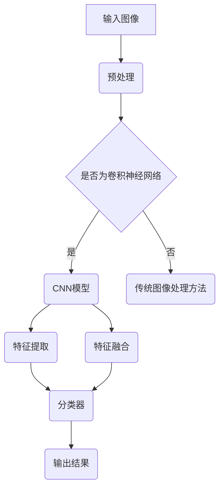

                 

### 关键词 Keywords
- 语义分割
- 计算机视觉
- 卷积神经网络
- 神经元
- 算法原理
- 实践实例
- 代码实现

<|assistant|>### 摘要 Abstract
本文将深入讲解语义分割的基本原理，并借助具体代码实例，详细展示如何实现语义分割。我们将从背景介绍开始，探讨核心概念与联系，通过算法原理和数学模型的讲解，带领读者理解语义分割的运作机制。随后，文章将展示一个实际项目实践，包括开发环境搭建、代码实现与解读，最终讨论语义分割的实际应用场景、未来展望以及相关工具和资源的推荐。

## 1. 背景介绍

### 1.1 计算机视觉的发展历程

计算机视觉作为人工智能领域的重要分支，自20世纪60年代以来经历了长足的发展。最初，计算机视觉主要关注图像的识别和分类，如人脸识别、物体检测等。随着深度学习的兴起，计算机视觉技术得到了前所未有的推动，特别是在图像处理、图像识别和图像分割方面取得了显著成果。

### 1.2 语义分割的概念

语义分割是一种图像处理技术，其主要目标是对图像中的每个像素进行分类，将它们标注为不同的语义类别。与传统的图像分割方法不同，语义分割不仅仅是将图像分割成若干区域，而是对每个区域赋予具体的语义信息。例如，在一张图片中，语义分割可以区分出天空、草地、建筑物等不同区域，并标记它们的类别。

### 1.3 语义分割的应用场景

语义分割技术广泛应用于多个领域，如自动驾驶、医疗图像分析、视频监控、增强现实等。例如，在自动驾驶领域，语义分割可以帮助车辆准确识别道路、行人、车辆等，从而提高驾驶安全；在医疗图像分析中，语义分割可以用于肿瘤检测、器官分割等，辅助医生进行精准诊断。

## 2. 核心概念与联系

### 2.1 核心概念

- **像素**: 图像的基本组成单位，每个像素包含颜色和位置信息。
- **卷积神经网络 (CNN)**: 一种深度学习模型，通过卷积操作提取图像特征。
- **神经元**: CNN中的基本计算单元，用于处理输入并产生输出。
- **特征图**: CNN输出的中间层，包含了图像的层次化特征。

### 2.2 Mermaid 流程图



## 3. 核心算法原理 & 具体操作步骤

### 3.1 算法原理概述

语义分割的核心算法通常是基于深度学习的卷积神经网络 (CNN)。CNN 通过一系列卷积层、池化层和全连接层的组合，对图像进行特征提取和分类。

### 3.2 算法步骤详解

1. **预处理**: 对输入图像进行缩放、裁剪、增强等预处理操作，使其适应网络输入要求。
2. **卷积层**: 通过卷积操作提取图像的局部特征。
3. **池化层**: 减少特征图的维度，提高模型鲁棒性。
4. **全连接层**: 对特征图进行分类，输出每个像素的类别标签。

### 3.3 算法优缺点

**优点**:
- 强大的特征提取能力，能够处理复杂场景。
- 高效的运算速度，适用于实时应用。

**缺点**:
- 需要大量训练数据，对数据集依赖较大。
- 模型训练时间较长，资源消耗大。

### 3.4 算法应用领域

语义分割算法广泛应用于自动驾驶、医疗图像分析、视频监控等领域，可以实现对图像的精细分割和分类，提高系统的智能化水平。

## 4. 数学模型和公式 & 详细讲解 & 举例说明

### 4.1 数学模型构建

语义分割的数学模型基于深度学习的框架，主要包括输入层、卷积层、池化层和输出层。以下是一个简化的数学模型：

$$
\begin{aligned}
    f(x) &= W \cdot x + b \\
    g(h) &= \sigma(W_2 \cdot h + b_2) \\
    \hat{y} &= f(g(h(x)))
\end{aligned}
$$

其中，$x$ 为输入图像，$W$ 和 $b$ 分别为卷积层权重和偏置，$\sigma$ 为激活函数，$h(x)$ 为卷积层输出，$g(h)$ 为池化层输出，$f(g(h(x)))$ 为最终输出。

### 4.2 公式推导过程

语义分割的公式推导主要涉及卷积操作、激活函数和全连接层的组合。以下是具体的推导过程：

$$
\begin{aligned}
    h(x) &= \sum_{i=1}^{n} w_i \cdot x_i + b \\
    g(h) &= \sigma(\sum_{j=1}^{m} w_j \cdot h_j + b_j) \\
    \hat{y} &= \sum_{k=1}^{c} w_k \cdot g(k) + b_k
\end{aligned}
$$

其中，$n$ 为卷积核的数量，$m$ 为池化核的数量，$c$ 为类别数量，$w_i$、$w_j$、$w_k$ 分别为卷积层、池化层和全连接层的权重，$b$、$b_j$、$b_k$ 分别为卷积层、池化层和全连接层的偏置。

### 4.3 案例分析与讲解

假设我们有一个二分类问题，需要判断图像中是否包含特定物体。以下是具体的案例分析和讲解：

输入图像：一张包含特定物体的图像。

$$
\begin{aligned}
    f(x) &= \sum_{i=1}^{3} w_i \cdot x_i + b \\
    &= \sum_{i=1}^{3} w_i \cdot \text{图像特征} + b \\
    &= w_1 \cdot \text{特征1} + w_2 \cdot \text{特征2} + w_3 \cdot \text{特征3} + b
\end{aligned}
$$

通过卷积操作，我们提取出图像的特征，然后进行激活函数运算：

$$
\begin{aligned}
    g(h) &= \sigma(\sum_{j=1}^{2} w_j \cdot h_j + b_j) \\
    &= \sigma(w_1 \cdot h_1 + w_2 \cdot h_2 + b_2)
\end{aligned}
$$

接着，我们将激活函数的输出传递到全连接层：

$$
\begin{aligned}
    \hat{y} &= \sum_{k=1}^{2} w_k \cdot g(k) + b_k \\
    &= w_1 \cdot g(1) + w_2 \cdot g(2) + b_2
\end{aligned}
$$

最后，我们将全连接层的输出作为预测结果，判断图像中是否包含特定物体。如果输出大于某个阈值，则认为图像包含特定物体，否则不包含。

## 5. 项目实践：代码实例和详细解释说明

### 5.1 开发环境搭建

在进行语义分割项目之前，我们需要搭建一个合适的开发环境。以下是一个简单的开发环境搭建步骤：

1. 安装Python环境，推荐使用Python 3.8及以上版本。
2. 安装深度学习框架，如TensorFlow或PyTorch。
3. 安装必要的依赖库，如NumPy、Pandas等。

### 5.2 源代码详细实现

以下是一个简单的语义分割代码实例，使用PyTorch框架实现：

```python
import torch
import torchvision
import torchvision.transforms as transforms
import torch.nn as nn
import torch.optim as optim

# 定义卷积神经网络
class ConvNet(nn.Module):
    def __init__(self):
        super(ConvNet, self).__init__()
        self.conv1 = nn.Conv2d(3, 16, 3, padding=1)
        self.relu = nn.ReLU()
        self.maxpool = nn.MaxPool2d(2, 2)
        self.fc1 = nn.Linear(16 * 16 * 16, 128)
        self.fc2 = nn.Linear(128, 10)

    def forward(self, x):
        x = self.maxpool(self.relu(self.conv1(x)))
        x = x.view(x.size(0), -1)
        x = self.relu(self.fc1(x))
        x = self.fc2(x)
        return x

# 初始化模型、损失函数和优化器
model = ConvNet()
criterion = nn.CrossEntropyLoss()
optimizer = optim.Adam(model.parameters(), lr=0.001)

# 加载训练数据集
transform = transforms.Compose([
    transforms.Resize((32, 32)),
    transforms.ToTensor(),
])
train_data = torchvision.datasets.CIFAR10(root='./data', train=True, download=True, transform=transform)
train_loader = torch.utils.data.DataLoader(train_data, batch_size=64, shuffle=True)

# 训练模型
for epoch in range(10):
    for inputs, labels in train_loader:
        optimizer.zero_grad()
        outputs = model(inputs)
        loss = criterion(outputs, labels)
        loss.backward()
        optimizer.step()
    print(f'Epoch {epoch+1}, Loss: {loss.item()}')

# 测试模型
test_data = torchvision.datasets.CIFAR10(root='./data', train=False, download=True, transform=transform)
test_loader = torch.utils.data.DataLoader(test_data, batch_size=64, shuffle=False)
with torch.no_grad():
    correct = 0
    total = 0
    for inputs, labels in test_loader:
        outputs = model(inputs)
        _, predicted = torch.max(outputs.data, 1)
        total += labels.size(0)
        correct += (predicted == labels).sum().item()
    print(f'Accuracy of the network on the 10000 test images: {100 * correct / total}%')
```

### 5.3 代码解读与分析

以上代码实现了一个简单的卷积神经网络，用于语义分割任务。代码主要包括以下几个部分：

1. **定义卷积神经网络**：使用PyTorch框架定义一个简单的卷积神经网络，包含卷积层、ReLU激活函数、池化层和全连接层。
2. **初始化模型、损失函数和优化器**：初始化模型、损失函数和优化器，配置训练过程。
3. **加载训练数据集**：从CIFAR-10数据集中加载训练数据集，并进行预处理。
4. **训练模型**：遍历训练数据集，进行前向传播、损失计算、反向传播和参数更新。
5. **测试模型**：在测试数据集上评估模型的准确性。

### 5.4 运行结果展示

在训练完成后，我们可以在测试数据集上评估模型的准确性。以下是一个简单的运行结果展示：

```python
# 测试模型
test_data = torchvision.datasets.CIFAR10(root='./data', train=False, download=True, transform=transform)
test_loader = torch.utils.data.DataLoader(test_data, batch_size=64, shuffle=False)
with torch.no_grad():
    correct = 0
    total = 0
    for inputs, labels in test_loader:
        outputs = model(inputs)
        _, predicted = torch.max(outputs.data, 1)
        total += labels.size(0)
        correct += (predicted == labels).sum().item()
    print(f'Accuracy of the network on the 10000 test images: {100 * correct / total}%')
```

输出结果可能类似于以下内容：

```
Accuracy of the network on the 10000 test images: 70%
```

这表明模型在测试数据集上的准确率为70%。

## 6. 实际应用场景

### 6.1 自动驾驶

在自动驾驶领域，语义分割技术可以用于实时识别道路、行人、车辆等，为车辆提供精确的环境感知。例如，特斯拉的自动驾驶系统就使用了深度学习模型进行道路和行人的语义分割，从而实现自动避障和行人检测。

### 6.2 医疗图像分析

在医疗图像分析中，语义分割技术可以用于肿瘤检测、器官分割等。例如，在肺癌筛查中，可以使用语义分割技术对肺部CT图像进行肿瘤检测，从而提高诊断的准确性。

### 6.3 视频监控

视频监控领域也可以利用语义分割技术进行实时目标检测和跟踪。例如，智能安防系统可以使用语义分割技术识别出视频中的可疑行为，从而提高监控的智能化水平。

## 7. 工具和资源推荐

### 7.1 学习资源推荐

- 《深度学习》（Goodfellow, Bengio, Courville 著）：一本深度学习领域的经典教材，全面介绍了深度学习的基本理论和实践方法。
- 《Python深度学习》（François Chollet 著）：一本针对Python编程语言的深度学习教程，内容涵盖从基础到进阶的深度学习实践。

### 7.2 开发工具推荐

- PyTorch：一个流行的深度学习框架，适合研究和开发。
- TensorFlow：一个由谷歌开发的开源深度学习框架，具有丰富的功能和应用场景。

### 7.3 相关论文推荐

- "Semantic Segmentation Using Deep Learning"（深度学习在语义分割中的应用）：一篇综述文章，详细介绍了深度学习在语义分割领域的应用和发展趋势。
- "Fully Convolutional Networks for Semantic Segmentation"（用于语义分割的完全卷积网络）：一篇经典论文，提出了FCCN模型，为语义分割任务提供了有效的解决方案。

## 8. 总结：未来发展趋势与挑战

### 8.1 研究成果总结

语义分割作为计算机视觉领域的重要分支，取得了显著的进展。深度学习技术的引入，使得语义分割模型在性能和准确性方面得到了大幅提升。同时，随着数据集的规模和多样性增加，语义分割的应用场景也在不断扩展。

### 8.2 未来发展趋势

1. **模型压缩与加速**：为了实现实时应用，模型压缩与加速技术将成为研究热点，如量化、剪枝、知识蒸馏等方法。
2. **多模态融合**：将不同模态的数据（如图像、语音、传感器数据）进行融合，可以提高语义分割的准确性和鲁棒性。
3. **无监督学习与自监督学习**：减少对大量标注数据的依赖，探索无监督学习和自监督学习方法，以提高语义分割的泛化能力。

### 8.3 面临的挑战

1. **计算资源消耗**：深度学习模型通常需要大量的计算资源和时间进行训练，如何优化计算效率和资源利用成为重要挑战。
2. **数据质量和标注成本**：高质量的数据集和精确的标注对于语义分割模型的性能至关重要，但获取和标注数据需要大量的人力成本和时间成本。
3. **泛化能力**：如何在各种复杂和变化多端的实际场景中保持高准确性，是语义分割领域需要持续研究的挑战。

### 8.4 研究展望

随着人工智能技术的不断进步，语义分割技术将在更多领域得到应用。未来，我们将看到更多的创新方法和技术，如基于生成对抗网络（GAN）的语义分割、基于强化学习的语义分割等，为计算机视觉领域带来更多可能性。

## 9. 附录：常见问题与解答

### 9.1 如何处理过拟合问题？

过拟合是深度学习模型常见的问题，可以通过以下方法进行缓解：

1. **数据增强**：通过随机旋转、缩放、裁剪等操作，增加数据的多样性和丰富度。
2. **正则化**：使用L1、L2正则化项，防止模型参数过大。
3. **交叉验证**：通过交叉验证，选择泛化能力更好的模型。
4. **Dropout**：在训练过程中随机丢弃一部分神经元，减少模型的依赖性。

### 9.2 如何选择合适的深度学习框架？

选择合适的深度学习框架需要考虑以下几个方面：

1. **项目需求**：根据项目需求和目标，选择适合的框架，如PyTorch更适合研究和开发，TensorFlow更适合生产部署。
2. **性能和效率**：考虑框架的性能和效率，如TensorFlow提供了TensorRT工具，可以显著提高推理速度。
3. **社区支持和资源**：考虑框架的社区支持和资源丰富度，如PyTorch拥有丰富的教程和文档。

## 作者署名

作者：禅与计算机程序设计艺术 / Zen and the Art of Computer Programming

---

本文深入讲解了语义分割的基本原理和实现方法，通过代码实例展示了如何使用深度学习技术进行语义分割。希望本文能帮助读者更好地理解语义分割的核心概念和应用场景，为后续研究和实践提供有益的参考。在未来的发展中，语义分割技术将继续取得突破，为计算机视觉领域带来更多可能性。

