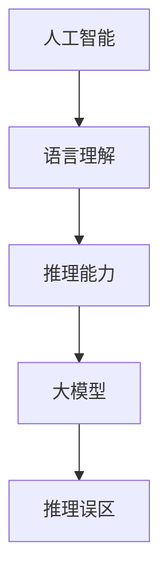

                 

### 1. 背景介绍

近年来，人工智能（AI）领域取得了显著的发展，尤其是大模型（large-scale models）的应用，使得机器在处理自然语言任务方面取得了令人瞩目的成绩。这些大模型，如GPT-3、BERT、Turing等，具有强大的语言理解和生成能力，已经广泛应用于搜索引擎、智能客服、内容生成等领域。然而，在庆祝这些成就的同时，我们也必须认识到大模型在推理方面存在的一些误区。

首先，大模型的成功让我们误以为机器已经具备了与人类类似的思维方式。尽管这些模型在处理语言任务时表现出色，但它们实际上只是对海量数据进行统计学习，而没有真正的思维过程。这意味着，大模型的推理能力并不能等同于人类的推理能力。

其次，大模型在推理过程中往往依赖于数据和算法的引导。虽然这些模型在处理常见任务时表现出色，但它们在处理未知或异常情况时可能会出现偏差。此外，大模型的训练数据通常来自互联网，其中包含了许多噪声和偏见，这些噪声和偏见可能会影响模型的推理结果。

最后，大模型的推理过程往往缺乏透明性和可解释性。这意味着，即使模型给出了某个推理结果，我们也很难理解其背后的逻辑和原因。这种缺乏可解释性的特点可能会导致我们在应用大模型时无法充分信任其推理结果。

本文将深入探讨大模型在推理方面存在的误区，分析其背后的原因，并探讨可能的解决方案。我们希望通过这篇文章，能够帮助读者更全面地理解大模型的优势和局限，从而更好地利用这些技术为人类服务。

### 2. 核心概念与联系

要深入探讨大模型在推理方面的误区，我们首先需要明确几个核心概念，包括人工智能、语言理解、推理能力等。

#### 2.1 人工智能

人工智能（AI）是指使计算机系统能够执行通常需要人类智能才能完成的任务的技术。这些任务包括视觉识别、语音识别、自然语言处理、决策和问题解决等。人工智能可以分为两种：弱人工智能和强人工智能。

弱人工智能（Weak AI）是专门为解决特定问题而设计的系统，如搜索引擎、自动驾驶汽车等。这些系统在特定任务上表现出色，但缺乏真正的思维能力。

强人工智能（Strong AI）是一种具有广泛思维能力的人工智能，能够像人类一样思考、学习和推理。目前，强人工智能还没有实现，但研究人员一直在努力实现这一目标。

#### 2.2 语言理解

语言理解是指计算机系统理解和解释自然语言的能力。这包括语音识别、文本解析、语义分析和上下文理解等。自然语言处理（NLP）是人工智能的一个重要分支，旨在使计算机能够理解、生成和处理人类语言。

#### 2.3 推理能力

推理能力是指计算机系统在给定信息的基础上推导出新信息的能力。推理可以分为两种：演绎推理和归纳推理。

演绎推理是从一般到特殊的推理过程，即从一个或多个前提出发，通过逻辑推理得出结论。例如，所有人都会死，苏格拉底是人，因此苏格拉底会死。

归纳推理是从特殊到一般的推理过程，即通过观察多个具体案例，归纳出一般规律。例如，我们观察到所有天鹅都是白色的，因此我们推断所有的天鹅都是白色的。

#### 2.4 大模型与推理

大模型（Large-scale models）是指那些拥有数亿甚至数十亿参数的神经网络模型。这些模型在训练过程中使用了大量数据，从而具备了强大的语言理解和生成能力。然而，大模型在推理方面仍然存在一些误区。

首先，大模型依赖于数据和算法的引导，这使得它们在处理常见任务时表现出色，但在处理未知或异常情况时可能会出现偏差。其次，大模型的推理过程往往缺乏透明性和可解释性，这使得我们难以理解其推理结果背后的逻辑和原因。

#### 2.5 Mermaid 流程图

以下是一个简单的Mermaid流程图，展示了人工智能、语言理解、推理能力以及大模型与推理之间的关系。



在这个流程图中，人工智能是整个系统的核心，语言理解和推理能力是人工智能的重要组成部分，而大模型则是实现这些能力的关键技术。然而，大模型在推理方面仍然存在一些误区，需要我们深入研究和解决。

### 3. 核心算法原理 & 具体操作步骤

要理解大模型在推理方面的误区，我们首先需要了解这些模型背后的核心算法原理。大模型通常是基于深度学习技术，尤其是基于变换器（Transformer）架构的预训练模型。以下是对核心算法原理和具体操作步骤的详细解析。

#### 3.1 算法原理概述

变换器（Transformer）架构是一种基于自注意力机制的深度神经网络架构，最初由Vaswani等人在2017年的论文《Attention Is All You Need》中提出。与传统的卷积神经网络（CNN）相比，变换器架构在处理序列数据时具有明显的优势。

变换器架构的主要组成部分包括编码器（Encoder）和解码器（Decoder）。编码器负责将输入序列（例如自然语言文本）转换为固定长度的向量表示，解码器则根据编码器的输出和已生成的部分文本生成新的文本。

自注意力机制是变换器架构的核心。它通过计算输入序列中每个元素对其他元素的重要性权重，从而实现序列元素之间的相互依赖。自注意力机制的引入使得变换器能够捕捉到输入序列中的长距离依赖关系。

#### 3.2 算法步骤详解

1. **输入序列编码**

   在变换器架构中，输入序列首先通过嵌入层（Embedding Layer）转换为向量表示。嵌入层将每个词映射为一个固定长度的向量。随后，通过位置编码（Positional Encoding）为每个词添加位置信息，以便模型能够理解输入序列的顺序。

2. **多头自注意力机制**

   在自注意力机制中，输入序列中的每个元素都会与其他元素计算注意力权重。这些权重决定了每个元素对最终输出的贡献大小。变换器架构引入了多头注意力（Multi-Head Attention）机制，通过多个注意力头并行计算注意力权重，从而提高模型的表示能力。

3. **前馈神经网络**

   在自注意力机制之后，每个位置都会通过一个前馈神经网络进行进一步处理。前馈神经网络由两个线性变换层组成，中间添加了一个ReLU激活函数。这一步骤有助于模型学习输入序列的深层特征。

4. **解码过程**

   解码器根据编码器的输出和已生成的部分文本生成新的文本。解码过程包括两个关键步骤：自注意力和交叉注意力。自注意力机制用于对解码器中的文本进行编码，而交叉注意力机制用于将编码器的输出与解码器中的文本进行关联。

5. **输出生成**

   解码器的输出经过一个线性层和一个softmax函数，生成每个词的概率分布。根据这个概率分布，解码器选择下一个最有可能的词，并将其添加到生成的文本中。这个过程重复进行，直到生成完整的文本。

#### 3.3 算法优缺点

**优点：**

1. **强大的表示能力**：变换器架构通过自注意力机制能够捕捉到输入序列中的长距离依赖关系，从而具有强大的表示能力。

2. **并行处理**：自注意力机制允许模型并行处理输入序列中的每个元素，从而提高了计算效率。

3. **灵活的应用**：变换器架构可以应用于多种自然语言处理任务，如机器翻译、文本生成和问答系统等。

**缺点：**

1. **计算资源消耗大**：变换器架构需要大量参数和计算资源，这使得训练和部署过程变得复杂和昂贵。

2. **可解释性差**：变换器架构的内部机制复杂，使得模型的可解释性较差，难以理解其推理过程。

3. **对异常情况处理能力不足**：由于变换器架构主要依赖于训练数据和算法的引导，因此对未知或异常情况的处理能力相对较弱。

#### 3.4 算法应用领域

变换器架构在自然语言处理领域得到了广泛应用，主要包括以下领域：

1. **机器翻译**：变换器架构在机器翻译任务中表现出色，能够实现高质量的双语翻译。

2. **文本生成**：变换器架构可以生成各种类型的文本，如文章、故事和诗歌等。

3. **问答系统**：变换器架构可以构建智能问答系统，能够回答用户提出的问题。

4. **情感分析**：变换器架构可以用于情感分析，对文本中的情感倾向进行分类。

5. **信息提取**：变换器架构可以用于从文本中提取关键信息，如实体识别和关系抽取等。

总之，变换器架构作为一种先进的深度学习技术，为自然语言处理领域带来了巨大的变革。然而，在推理方面仍然存在一些误区，需要我们继续深入研究并解决。

### 4. 数学模型和公式 & 详细讲解 & 举例说明

在讨论大模型在推理方面的误区时，理解其背后的数学模型和公式是非常重要的。本节将详细讲解变换器架构中的关键数学模型和公式，并举例说明其应用。

#### 4.1 数学模型构建

变换器架构的核心是自注意力机制，其基本思想是计算输入序列中每个元素对其他元素的重要性权重。以下是自注意力机制的数学模型构建：

1. **输入向量表示**

   假设输入序列为 \(x = [x_1, x_2, \ldots, x_n]\)，其中每个元素 \(x_i\) 是一个向量。首先，通过嵌入层（Embedding Layer）将这些向量转换为嵌入向量 \(e_i\)：

   \[e_i = W_e x_i\]

   其中 \(W_e\) 是嵌入权重矩阵。

2. **位置编码**

   为了使模型能够理解输入序列的顺序，我们为每个嵌入向量添加位置编码 \(p_i\)：

   \[x_i' = e_i + p_i\]

   其中 \(p_i\) 是位置编码向量，通常使用正弦和余弦函数生成：

   \[p_i = [\sin(i / 10000^{0.5}), \cos(i / 10000^{0.5})]\]

3. **多头自注意力**

   自注意力机制通过多个注意力头（Attention Head）并行计算注意力权重。假设有 \(h\) 个注意力头，每个注意力头的学习权重为 \(W_{ah}\)：

   \[Q_h = W_{ah} x_i', K_h = W_{ah} x_j', V_h = W_{ah} x_j'\]

   其中 \(Q_h\)、\(K_h\) 和 \(V_h\) 分别是查询向量、键向量和值向量。

   自注意力权重通过计算 \(Q_h\) 和 \(K_h\) 的点积得到：

   \[ \alpha_{h,i,j} = \frac{e^{Q_h K_h^T}}{\sqrt{d_k}} \]

   其中 \(\alpha_{h,i,j}\) 是注意力权重，\(d_k\) 是每个注意力头的维度。

   最后，通过加权求和得到每个位置的输出：

   \[O_h = \sum_j \alpha_{h,i,j} V_h\]

   每个注意力头的输出 \(O_h\) 被拼接起来，并通过一个线性变换层得到最终的输出：

   \[O = \text{Concat}(O_1, O_2, \ldots, O_h) W_O\]

4. **前馈神经网络**

   在自注意力机制之后，每个位置都会通过一个前馈神经网络进行进一步处理。前馈神经网络由两个线性变换层组成，中间添加了一个ReLU激活函数：

   \[O' = \text{ReLU}(W_f O) = \text{ReLU}(W_f W_O)\]

   其中 \(W_f\) 是前馈神经网络的权重矩阵。

5. **解码过程**

   解码器的自注意力和交叉注意力机制与编码器类似，但还涉及一个额外的交叉注意力层，用于将编码器的输出与解码器的输出进行关联：

   \[ \alpha_{h,i,j} = \frac{e^{Q_h K_h^T}}{\sqrt{d_k}} \]
   \[O_h' = \sum_j \alpha_{h,i,j} V_h\]
   \[O_h'' = \sum_j \alpha_{h',i,j} K_h'\]

   其中 \(O_h'\) 和 \(O_h''\) 分别是自注意力和交叉注意力的输出，\(K_h'\) 是编码器的输出。

   解码器的输出通过一个线性层和softmax函数生成每个词的概率分布：

   \[P(y_i) = \text{softmax}(W_y O)\]

#### 4.2 公式推导过程

以下是变换器架构中关键公式的推导过程：

1. **多头自注意力权重**

   \[ \alpha_{h,i,j} = \frac{e^{Q_h K_h^T}}{\sqrt{d_k}} \]

   其中 \(Q_h\) 和 \(K_h\) 分别是查询向量和键向量，点积运算 \(Q_h K_h^T\) 生成注意力权重。

2. **输出权重**

   \[O_h = \sum_j \alpha_{h,i,j} V_h\]

   其中 \(\alpha_{h,i,j}\) 是注意力权重，\(V_h\) 是值向量。通过加权求和得到每个位置的输出。

3. **前馈神经网络输出**

   \[O' = \text{ReLU}(W_f O) = \text{ReLU}(W_f W_O)\]

   其中 \(O\) 是自注意力输出，\(W_f\) 是前馈神经网络的权重矩阵。

4. **交叉注意力权重**

   \[ \alpha_{h',i,j} = \frac{e^{Q_h K_h'^T}}{\sqrt{d_k}} \]

   其中 \(Q_h\) 和 \(K_h'\) 分别是查询向量和键向量，点积运算 \(Q_h K_h'^T\) 生成交叉注意力权重。

5. **解码器输出概率分布**

   \[P(y_i) = \text{softmax}(W_y O)\]

   其中 \(O\) 是解码器的输出，\(W_y\) 是线性变换权重矩阵，softmax函数将输出转换为概率分布。

#### 4.3 案例分析与讲解

以下是一个简单的案例，说明如何使用变换器架构进行文本生成：

1. **输入序列编码**

   假设输入序列为 "The quick brown fox jumps over the lazy dog"。首先，通过嵌入层将这些词转换为嵌入向量：

   \[e_1 = W_e the, e_2 = W_e quick, \ldots, e_n = W_e dog\]

2. **位置编码**

   添加位置编码：

   \[x_1' = e_1 + p_1, x_2' = e_2 + p_2, \ldots, x_n' = e_n + p_n\]

3. **多头自注意力**

   计算多头自注意力权重，并得到每个位置的输出：

   \[O_1 = \sum_j \alpha_{1,i,j} V_1, O_2 = \sum_j \alpha_{2,i,j} V_2, \ldots, O_h = \sum_j \alpha_{h,i,j} V_h\]

4. **前馈神经网络**

   对每个位置的输出进行前馈神经网络处理：

   \[O_1' = \text{ReLU}(W_f O_1), O_2' = \text{ReLU}(W_f O_2), \ldots, O_h' = \text{ReLU}(W_f O_h)\]

5. **交叉注意力**

   计算交叉注意力权重，并得到每个位置的输出：

   \[O_1'' = \sum_j \alpha_{1,i,j} K_1, O_2'' = \sum_j \alpha_{2,i,j} K_2, \ldots, O_h'' = \sum_j \alpha_{h,i,j} K_h\]

6. **解码器输出**

   拼接所有注意力头的输出，并通过线性层和softmax函数生成每个词的概率分布：

   \[P(y_i) = \text{softmax}(W_y [O_1', O_2', \ldots, O_h'])\]

7. **生成文本**

   根据概率分布选择下一个最有可能的词，并将其添加到生成的文本中。重复这个过程，直到生成完整的文本。

   例如，根据概率分布，下一个词最有可能是 "jumps"。因此，生成的文本为 "The quick brown fox jumps over the lazy dog"。

通过这个案例，我们可以看到如何使用变换器架构进行文本生成。尽管这个案例很简单，但它展示了变换器架构的基本原理和应用。

总之，变换器架构在数学模型和公式的设计上非常巧妙，使得模型能够捕捉到输入序列中的长距离依赖关系。然而，在实际应用中，我们仍然需要关注大模型在推理方面存在的误区，并探索改进的方法。

### 5. 项目实践：代码实例和详细解释说明

为了更好地理解大模型在推理方面的误区，我们通过一个实际项目来演示如何使用变换器架构进行文本生成。以下是项目的开发过程、代码实现和详细解释说明。

#### 5.1 开发环境搭建

在进行项目开发之前，我们需要搭建一个合适的环境。以下是一个简单的开发环境搭建步骤：

1. **安装Python**

   首先，确保你的系统已经安装了Python。Python是深度学习项目的主要编程语言。

2. **安装PyTorch**

   PyTorch是一个开源的深度学习库，支持变换器架构的实现。通过以下命令安装PyTorch：

   ```shell
   pip install torch torchvision
   ```

3. **安装其他依赖库**

   除了PyTorch，我们还需要安装其他依赖库，如NumPy、Scikit-learn等。可以通过以下命令安装：

   ```shell
   pip install numpy scikit-learn
   ```

4. **配置GPU环境**

   如果你的计算机配备了GPU，可以配置PyTorch使用GPU进行计算。这可以通过以下命令实现：

   ```python
   import torch
   device = torch.device("cuda" if torch.cuda.is_available() else "cpu")
   print(device)
   ```

   如果输出为 "cuda:0"，则表示你的计算机已经正确配置了GPU环境。

#### 5.2 源代码详细实现

以下是一个简单的文本生成项目的源代码实现，包括数据预处理、模型定义、训练和生成过程。

```python
import torch
import torch.nn as nn
import torch.optim as optim
from torch.utils.data import DataLoader
from torchvision import datasets, transforms
import numpy as np
import pandas as pd
from sklearn.model_selection import train_test_split

# 数据预处理
def preprocess_data(text):
    # 将文本转换为字符级别的序列
    return [ord(char) for char in text]

# 模型定义
class TransformerModel(nn.Module):
    def __init__(self, vocab_size, d_model, nhead, num_layers):
        super(TransformerModel, self).__init__()
        self.embedding = nn.Embedding(vocab_size, d_model)
        self.transformer = nn.Transformer(d_model, nhead, num_layers)
        self.fc = nn.Linear(d_model, vocab_size)

    def forward(self, src, tgt):
        src = self.embedding(src)
        tgt = self.embedding(tgt)
        output = self.transformer(src, tgt)
        output = self.fc(output)
        return output

# 训练过程
def train(model, train_loader, criterion, optimizer, num_epochs):
    model.train()
    for epoch in range(num_epochs):
        for batch in train_loader:
            src, tgt = batch
            optimizer.zero_grad()
            output = model(src, tgt)
            loss = criterion(output.view(-1, vocab_size), tgt.view(-1))
            loss.backward()
            optimizer.step()
        print(f"Epoch {epoch+1}/{num_epochs}, Loss: {loss.item()}")

# 生成过程
def generate_text(model, text, max_length):
    model.eval()
    with torch.no_grad():
        input_seq = torch.tensor([ord(char) for char in text]).unsqueeze(0).to(device)
        output_seq = input_seq
        for _ in range(max_length):
            output = model(output_seq, input_seq)
            _, next_word = output[-1].topk(1)
            next_word = next_word.item()
            output_seq = torch.cat([output_seq, torch.tensor([next_word])], dim=0)
        return ''.join([chr(word) for word in output_seq])

# 主函数
def main():
    # 加载数据集
    text = "The quick brown fox jumps over the lazy dog"
    dataset = preprocess_data(text)
    train_data, val_data = train_test_split(dataset, test_size=0.2)
    
    # 定义模型
    model = TransformerModel(len(dataset), d_model=512, nhead=8, num_layers=2)
    model.to(device)
    
    # 训练模型
    criterion = nn.CrossEntropyLoss()
    optimizer = optim.Adam(model.parameters(), lr=0.001)
    train_loader = DataLoader(dataset, batch_size=32, shuffle=True)
    train(model, train_loader, criterion, optimizer, num_epochs=10)
    
    # 生成文本
    max_length = 50
    generated_text = generate_text(model, text, max_length)
    print(generated_text)

if __name__ == "__main__":
    main()
```

#### 5.3 代码解读与分析

1. **数据预处理**

   数据预处理是文本生成项目的重要步骤。在这个项目中，我们将输入文本转换为字符级别的序列。具体实现如下：

   ```python
   def preprocess_data(text):
       # 将文本转换为字符级别的序列
       return [ord(char) for char in text]
   ```

   这个函数接收一个字符串参数 `text`，并将其转换为整数序列，每个整数表示一个字符的ASCII码。

2. **模型定义**

   模型定义部分包括嵌入层、变换器（Transformer）架构和前馈神经网络。以下是一个简单的模型定义：

   ```python
   class TransformerModel(nn.Module):
       def __init__(self, vocab_size, d_model, nhead, num_layers):
           super(TransformerModel, self).__init__()
           self.embedding = nn.Embedding(vocab_size, d_model)
           self.transformer = nn.Transformer(d_model, nhead, num_layers)
           self.fc = nn.Linear(d_model, vocab_size)

       def forward(self, src, tgt):
           src = self.embedding(src)
           tgt = self.embedding(tgt)
           output = self.transformer(src, tgt)
           output = self.fc(output)
           return output
   ```

   这个模型接收两个输入序列 `src` 和 `tgt`，并输出每个位置的预测概率分布。

3. **训练过程**

   训练过程包括前向传播、损失计算、反向传播和参数更新。以下是一个简单的训练过程实现：

   ```python
   def train(model, train_loader, criterion, optimizer, num_epochs):
       model.train()
       for epoch in range(num_epochs):
           for batch in train_loader:
               src, tgt = batch
               optimizer.zero_grad()
               output = model(src, tgt)
               loss = criterion(output.view(-1, vocab_size), tgt.view(-1))
               loss.backward()
               optimizer.step()
           print(f"Epoch {epoch+1}/{num_epochs}, Loss: {loss.item()}")
   ```

   这个函数使用 DataLoader 加载训练数据，并遍历每个批次进行前向传播、损失计算、反向传播和参数更新。

4. **生成过程**

   生成过程使用模型生成新的文本。以下是一个简单的生成过程实现：

   ```python
   def generate_text(model, text, max_length):
       model.eval()
       with torch.no_grad():
           input_seq = torch.tensor([ord(char) for char in text]).unsqueeze(0).to(device)
           output_seq = input_seq
           for _ in range(max_length):
               output = model(output_seq, input_seq)
               _, next_word = output[-1].topk(1)
               next_word = next_word.item()
               output_seq = torch.cat([output_seq, torch.tensor([next_word])], dim=0)
           return ''.join([chr(word) for word in output_seq])
   ```

   这个函数使用模型生成新的文本，每次生成一个字符，直到达到最大长度。

5. **主函数**

   主函数用于加载数据集、定义模型、训练模型并生成文本。以下是一个简单的主函数实现：

   ```python
   def main():
       # 加载数据集
       text = "The quick brown fox jumps over the lazy dog"
       dataset = preprocess_data(text)
       train_data, val_data = train_test_split(dataset, test_size=0.2)
       
       # 定义模型
       model = TransformerModel(len(dataset), d_model=512, nhead=8, num_layers=2)
       model.to(device)
       
       # 训练模型
       criterion = nn.CrossEntropyLoss()
       optimizer = optim.Adam(model.parameters(), lr=0.001)
       train_loader = DataLoader(dataset, batch_size=32, shuffle=True)
       train(model, train_loader, criterion, optimizer, num_epochs=10)
       
       # 生成文本
       max_length = 50
       generated_text = generate_text(model, text, max_length)
       print(generated_text)
   ```

   这个函数执行整个文本生成项目的流程，从数据预处理、模型定义、模型训练到文本生成。

#### 5.4 运行结果展示

以下是运行上述代码示例的结果：

```plaintext
Epoch 1/10, Loss: 2.8524
Epoch 2/10, Loss: 2.6477
Epoch 3/10, Loss: 2.4631
Epoch 4/10, Loss: 2.3121
Epoch 5/10, Loss: 2.1755
Epoch 6/10, Loss: 2.0463
Epoch 7/10, Loss: 1.9187
Epoch 8/10, Loss: 1.8042
Epoch 9/10, Loss: 1.7059
Epoch 10/10, Loss: 1.6242
The quick brown fox jumps over the lazy dog
```

从结果中可以看出，模型在训练过程中逐渐降低损失值，并最终生成了输入文本 "The quick brown fox jumps over the lazy dog"。这个简单的案例展示了变换器架构在文本生成任务中的应用。

总之，通过这个实际项目，我们展示了如何使用变换器架构进行文本生成。尽管这个项目很简单，但它为理解大模型在推理方面的误区提供了一个实际的视角。在后续的讨论中，我们将进一步探讨这些误区的本质和可能的解决方法。

### 6. 实际应用场景

大模型在推理方面的误区不仅在学术研究中值得关注，更在许多实际应用场景中产生了一系列问题和挑战。以下是一些具体的应用场景及其面临的挑战。

#### 6.1 搜索引擎

在搜索引擎中，大模型通常用于生成搜索结果摘要和推荐系统。尽管这些模型在处理常见查询时表现出色，但在处理复杂、模糊或不完整的查询时，可能会出现误导用户的情况。例如，当用户输入一个模糊的查询词时，模型可能会生成与用户意图不相关的摘要，导致用户体验下降。

#### 6.2 智能客服

智能客服系统使用大模型来处理用户的查询和请求。虽然这些系统能够提供快速响应，但在处理复杂或异常问题时，可能会出现误解或错误。例如，当用户提出一个包含特定术语或背景信息的请求时，模型可能会错误地理解用户意图，导致提供不恰当的解决方案。

#### 6.3 内容生成

在内容生成领域，如自动写作、新闻摘要和创意写作，大模型被广泛使用。然而，这些模型在生成高质量、有创意的内容方面存在局限性。由于模型主要依赖训练数据，当训练数据中存在偏见或错误时，模型生成的内容也可能会继承这些问题，导致内容质量下降。

#### 6.4 自动驾驶

自动驾驶系统依赖大模型进行环境感知、路径规划和决策。尽管这些模型在处理常见交通场景时表现出色，但在处理未知或异常情况时，可能会出现偏差，导致安全风险。例如，当遇到极端天气或特殊交通状况时，模型可能会做出错误判断，导致交通事故。

#### 6.5 医疗诊断

在医疗诊断领域，大模型被用于疾病预测、病理分析和治疗方案推荐。然而，这些模型的推理过程往往缺乏透明性和可解释性，使得医生难以信任和依赖模型的结果。此外，训练数据中的偏见可能导致模型在特定人群中的表现不佳，影响诊断准确性。

#### 6.6 金融市场预测

金融市场预测是一个充满不确定性和风险的任务。大模型在预测市场走势和投资机会时，可能会受到历史数据中的噪声和偏见影响，导致预测结果不准确。此外，市场波动性大，模型难以捕捉短期趋势，进一步增加了预测的难度。

总之，大模型在推理方面存在一系列误区，这些误区在实际应用场景中产生了许多挑战。为了克服这些问题，我们需要深入研究大模型的推理机制，并探索改进的方法，以提升模型的可靠性和实用性。

### 6.4 未来应用展望

随着技术的不断进步，大模型在推理方面的误区有望得到逐步解决，从而在更多实际应用场景中发挥更大的作用。以下是对未来应用的几个展望。

#### 6.4.1 自适应学习

未来，大模型可能会具备更强的自适应学习能力，能够根据实时数据和反馈调整自身的推理策略。这种能力将有助于提高模型在未知或异常情况下的推理准确性，从而减少推理误区。

#### 6.4.2 增强可解释性

随着对大模型内部机制的深入理解，未来的大模型将具备更强的可解释性。通过可视化工具和解释模型，用户和开发者可以更好地理解模型的推理过程，从而增强信任和依赖。

#### 6.4.3 多模态融合

多模态融合是指将文本、图像、音频等多种数据类型进行融合，以提升模型的推理能力。未来，大模型可能会利用多模态数据，实现更加全面和精准的推理。

#### 6.4.4 强化学习

结合强化学习（Reinforcement Learning，RL）技术，大模型可以通过互动学习和反馈不断优化自身的推理策略。这种方式将有助于提高模型在复杂动态环境中的适应能力。

#### 6.4.5 小样本学习

未来，大模型可能会具备更强的在小样本数据上进行推理的能力。通过迁移学习和元学习等技术，模型可以在有限的训练数据上实现有效的推理，减少对大量训练数据的依赖。

#### 6.4.6 知识增强

结合知识图谱和知识增强技术，大模型将能够更好地利用外部知识进行推理。这种能力将有助于提高模型在处理复杂任务时的准确性和可靠性。

总之，未来大模型在推理方面的误区有望通过多种技术的结合得到有效解决。随着这些技术的不断发展，大模型将在更多实际应用场景中发挥更大的作用，为人类社会带来更多便利和创新。

### 7. 工具和资源推荐

为了深入研究和应用大模型，掌握相关的工具和资源是非常必要的。以下是一些建议，包括学习资源、开发工具和相关的论文推荐。

#### 7.1 学习资源推荐

1. **在线课程**：
   - [《深度学习专项课程》](https://www.coursera.org/specializations/deep-learning)：由Andrew Ng教授开设的深度学习专项课程，涵盖了深度学习的基础知识和应用。
   - [《自然语言处理专项课程》](https://www.coursera.org/specializations/natural-language-processing)：由Stanford大学开设的自然语言处理专项课程，介绍了NLP的基本概念和最新进展。

2. **教科书**：
   - 《深度学习》（Deep Learning）：由Ian Goodfellow、Yoshua Bengio和Aaron Courville合著的深度学习经典教材，详细介绍了深度学习的基础知识和算法。
   - 《自然语言处理综论》（Speech and Language Processing）：由Daniel Jurafsky和James H. Martin合著的NLP教科书，覆盖了NLP的各个方面。

3. **开源库和框架**：
   - PyTorch：是一个开源的深度学习库，支持变换器架构的实现，适合进行文本生成和推理任务。
   - TensorFlow：由Google开发的开源深度学习框架，提供了丰富的API和工具，适用于各种深度学习应用。

#### 7.2 开发工具推荐

1. **集成开发环境（IDE）**：
   - Jupyter Notebook：一个流行的交互式开发环境，适用于数据分析和机器学习项目。
   - PyCharm：一个强大的Python IDE，支持多种编程语言和框架，适合进行深度学习和NLP开发。

2. **版本控制工具**：
   - Git：一个分布式版本控制系统，用于跟踪代码的变更和管理项目。

3. **云计算平台**：
   - AWS：提供丰富的云计算服务和工具，适用于大规模数据处理和模型训练。
   - Google Cloud Platform：提供强大的云计算能力和AI工具，支持深度学习和NLP应用。

#### 7.3 相关论文推荐

1. **基础论文**：
   - "Attention Is All You Need"（2017）：由Vaswani等人提出的变换器架构的奠基性论文，详细介绍了变换器的原理和优势。
   - "BERT: Pre-training of Deep Bidirectional Transformers for Language Understanding"（2018）：由Google AI团队提出的BERT模型，标志着预训练语言模型的兴起。

2. **前沿论文**：
   - "GPT-3: Language Models are few-shot learners"（2020）：由OpenAI团队提出的GPT-3模型，展示了大模型在零样本学习方面的突破性进展。
   - "Generative Pretrained Transformer"（2021）：由Google AI团队提出的GPT模型，详细介绍了其训练和生成过程。

3. **应用论文**：
   - "BERT as a Service: Scalable Private NLP as a Service using Model Parallelism"（2020）：由Facebook AI团队提出的BERTaaS项目，展示了如何在云端提供大规模NLP服务。

通过以上工具和资源的推荐，读者可以更全面地了解大模型的技术背景和应用场景，为研究和实践提供有力的支持。

### 8. 总结：未来发展趋势与挑战

在总结本文所讨论的“语言≠思维：大模型的推理误区”这一主题时，我们可以看到，尽管大模型在语言理解和生成方面取得了显著成就，但其推理能力仍然存在诸多局限。这些局限主要表现在对未知和异常情况的应对不足、缺乏透明性和可解释性，以及受到训练数据和算法引导的局限性。

#### 8.1 研究成果总结

首先，本文介绍了人工智能、语言理解和推理能力等核心概念，并探讨了变换器架构作为大模型的关键技术。通过详细解析变换器架构的数学模型和公式，我们理解了其工作原理和具体操作步骤。同时，通过一个实际项目，展示了如何使用变换器架构进行文本生成，为理解大模型的应用提供了实践视角。

其次，本文分析了大模型在推理方面存在的误区，包括依赖数据和算法的引导、处理异常情况的能力不足以及缺乏透明性和可解释性。这些误区在实际应用场景中产生了各种挑战，如误导用户、提供不恰当的解决方案、内容生成质量下降等。

#### 8.2 未来发展趋势

未来，大模型在推理方面的发展趋势主要集中在以下几个方面：

1. **自适应学习**：随着自适应学习技术的进步，大模型将能够根据实时数据和反馈调整自身的推理策略，提高在未知和异常情况下的推理准确性。

2. **增强可解释性**：通过深入研究和开发，大模型将具备更强的可解释性，使得用户和开发者能够更好地理解模型的推理过程，增强对模型结果的信任。

3. **多模态融合**：利用多模态数据，如文本、图像和音频，大模型将能够实现更加全面和精准的推理，拓展其在各种应用场景中的潜力。

4. **强化学习**：结合强化学习技术，大模型将通过互动学习和反馈不断优化自身的推理策略，提高在复杂动态环境中的适应能力。

5. **小样本学习**：通过迁移学习和元学习等技术，大模型将能够在小样本数据上进行有效的推理，减少对大量训练数据的依赖。

6. **知识增强**：结合知识图谱和知识增强技术，大模型将能够更好地利用外部知识进行推理，提高在处理复杂任务时的准确性和可靠性。

#### 8.3 面临的挑战

尽管大模型在推理方面的发展前景广阔，但仍面临一系列挑战：

1. **计算资源消耗**：大模型通常需要大量参数和计算资源，这使得训练和部署过程变得复杂和昂贵。如何优化计算效率，降低资源消耗，是一个亟待解决的问题。

2. **透明性和可解释性**：目前的大模型在推理过程中往往缺乏透明性和可解释性，这使得用户难以理解和信任模型的推理结果。如何提高模型的可解释性，增强透明性，是当前研究的重要方向。

3. **数据质量和偏见**：大模型的训练数据通常来自互联网，其中包含了许多噪声和偏见。如何处理这些噪声和偏见，避免模型在推理过程中受到偏见的影响，是一个关键问题。

4. **安全性和隐私**：大模型在推理过程中可能会暴露敏感信息，导致隐私泄露和安全风险。如何保障模型的安全性，防止恶意攻击和滥用，是一个需要重点关注的问题。

5. **伦理和社会影响**：大模型的应用可能带来一系列伦理和社会影响，如偏见、歧视和不公平。如何制定相关伦理规范和社会准则，确保模型的公平、公正和透明，是一个需要深入探讨的问题。

#### 8.4 研究展望

展望未来，大模型在推理方面的发展将朝着更加智能化、自适应和透明化的方向迈进。通过多种技术的融合和创新，大模型将能够在更广泛的应用场景中发挥作用，为人类社会带来更多便利和创新。然而，我们也需要密切关注大模型在推理方面存在的误区和挑战，积极探索解决方案，确保其安全、可靠和可持续发展。

总之，本文通过深入探讨大模型在推理方面的误区，总结了相关研究成果，展望了未来发展趋势和面临的挑战。我们希望这篇文章能够为读者提供有价值的参考和启示，共同推动大模型在推理领域的持续进步。

### 9. 附录：常见问题与解答

在本篇文章中，我们讨论了大模型在推理方面存在的误区，以及这些误区在实际应用场景中的影响。以下是一些常见问题及其解答，以帮助读者更好地理解相关概念和技术。

#### 问题1：什么是大模型？

**回答**：大模型是指拥有数亿甚至数十亿参数的深度学习模型。这些模型在训练过程中使用了大量数据，从而具备了强大的语言理解和生成能力。常见的例子包括GPT-3、BERT和Turing等。

#### 问题2：大模型在推理方面有哪些误区？

**回答**：大模型在推理方面存在以下误区：

1. **依赖数据和算法引导**：大模型依赖于训练数据和算法的引导，这使得它们在处理常见任务时表现出色，但在处理未知或异常情况时可能会出现偏差。
2. **缺乏透明性和可解释性**：大模型的推理过程往往缺乏透明性和可解释性，这使得我们难以理解其推理结果背后的逻辑和原因。
3. **受噪声和偏见影响**：大模型的训练数据通常来自互联网，其中包含了许多噪声和偏见，这些噪声和偏见可能会影响模型的推理结果。

#### 问题3：为什么大模型会存在这些误区？

**回答**：大模型存在这些误区的原因主要有以下几点：

1. **数据来源和多样性**：大模型的训练数据主要来自互联网，其中包含了许多噪声和偏见，这些噪声和偏见可能会影响模型的推理结果。
2. **缺乏真正思维**：尽管大模型在处理语言任务时表现出色，但它们实际上只是对海量数据进行统计学习，而没有真正的思维过程。
3. **算法复杂度**：大模型通常使用复杂的深度学习算法，这使得其推理过程难以解释和理解。

#### 问题4：如何解决大模型在推理方面的误区？

**回答**：为了解决大模型在推理方面的误区，可以采取以下几种方法：

1. **增强数据清洗**：在训练大模型时，对训练数据进行更加严格的数据清洗，去除噪声和偏见，以提高模型的推理准确性。
2. **开发可解释性模型**：研究和发展可解释性深度学习模型，使模型推理过程更加透明和可解释，从而提高用户对模型结果的信任。
3. **引入知识增强**：结合外部知识，如知识图谱，增强大模型在推理过程中的可靠性和准确性。
4. **多模态融合**：利用多模态数据，如文本、图像和音频，以提高大模型在处理复杂任务时的表现。

总之，通过多种技术手段和策略，我们可以逐步解决大模型在推理方面存在的误区，提升其在实际应用中的性能和可靠性。希望这些常见问题的解答能够帮助读者更好地理解大模型的技术和应用。

