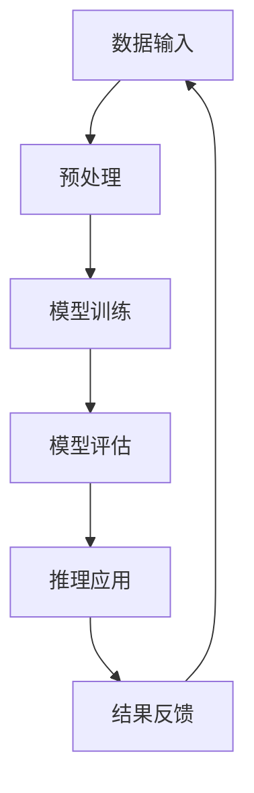

                 

关键词：大模型，语言理解，推理障碍，人工智能，深度学习，自然语言处理

摘要：本文将深入探讨大模型在语言理解与推理过程中所面临的关键障碍。通过分析现有研究和技术进展，我们旨在揭示这些障碍的本质，并提出可能的解决方案。本文不仅为研究人员提供新的视角，同时也为行业从业者指明了未来技术发展的方向。

## 1. 背景介绍

随着深度学习技术的迅猛发展，大型神经网络模型如GPT、BERT等已经在自然语言处理（NLP）领域取得了显著的成就。这些模型通过训练大规模的文本数据，能够实现高度的语言理解能力，并在多项任务中超越了人类的表现。然而，尽管这些大模型在语言理解方面表现出色，但它们在推理能力上的局限却日益凸显。这引发了关于语言与思维本质之间关系的深刻讨论。

在传统的人工智能系统中，推理通常被理解为一种从已知事实推导出新事实的过程。然而，大模型在处理复杂推理任务时，往往无法超越原始输入的信息，这导致它们在面临开放性问题或需要高级抽象思维的任务时，表现不佳。本文将围绕这一核心问题，探讨大模型在推理过程中的障碍，并分析这些障碍对人工智能发展的潜在影响。

## 2. 核心概念与联系

### 2.1. 大模型的架构

大模型通常由数以亿计的参数组成，通过深度神经网络的结构来实现。这些模型能够捕捉到文本数据中的复杂模式，从而实现高度的语言理解能力。然而，大模型的复杂性也带来了诸多挑战，尤其是推理能力的局限。

### 2.2. 推理的定义与类型

推理是一种从已知信息中推导出新信息的认知过程。根据推理的目标和方式，可以将推理分为以下几种类型：

- **演绎推理**：从一般性原则推导出具体结论的过程。
- **归纳推理**：从具体实例中归纳出一般性原则的过程。
- **类比推理**：通过比较相似情况，推导出新情况的可能性。

### 2.3. 大模型与推理的关系

大模型通过深度学习从数据中学习到复杂的语言模式，但这种学习过程并不能直接转化为推理能力。大模型在推理过程中，往往依赖于已学习的模式和规则，而无法进行自主的推理和抽象思维。这导致了大模型在处理复杂推理任务时的局限。

### 2.4. Mermaid 流程图

以下是关于大模型推理过程的Mermaid流程图：



在这个流程图中，A表示数据输入，B表示预处理，C表示模型训练，D表示模型评估，E表示推理应用，F表示结果反馈。可以看出，大模型的推理过程是一个循环的过程，通过不断地反馈和优化，不断提高推理能力。

## 3. 核心算法原理 & 具体操作步骤

### 3.1. 算法原理概述

大模型的推理障碍主要源于以下几个方面：

1. **数据依赖性**：大模型在训练过程中，依赖于大量的文本数据进行学习，这使得模型在处理未知或少量数据时，表现不佳。
2. **缺乏抽象能力**：大模型在推理过程中，往往只能依赖已学习的模式和规则，无法进行自主的抽象和推理。
3. **过拟合问题**：大模型在训练过程中，容易陷入过拟合问题，导致模型无法泛化到新的任务和数据。

### 3.2. 算法步骤详解

为了解决大模型的推理障碍，我们可以从以下几个方面进行改进：

1. **数据增强**：通过数据增强技术，增加模型的泛化能力，如生成对抗网络（GAN）等。
2. **模型简化**：通过简化模型结构，减少模型的参数数量，降低过拟合风险。
3. **多任务学习**：通过多任务学习，使模型在不同任务之间共享知识，提高模型的抽象能力。

### 3.3. 算法优缺点

**优点**：

- **提高泛化能力**：通过数据增强和模型简化，可以提高模型的泛化能力，使模型在面对未知数据时，表现更稳定。
- **降低过拟合风险**：通过多任务学习和模型简化，可以降低过拟合风险，提高模型的可解释性。

**缺点**：

- **计算成本增加**：数据增强和多任务学习等技术，需要额外的计算资源，可能导致训练成本增加。
- **模型性能下降**：在模型简化的过程中，可能会降低模型的整体性能。

### 3.4. 算法应用领域

大模型在推理障碍的解决，有望在多个领域得到应用，如：

- **智能客服**：通过提升模型的推理能力，可以实现更自然的对话交互。
- **文本生成**：通过提高模型的抽象能力，可以实现更高质量的文本生成。
- **知识图谱**：通过多任务学习，可以构建更准确的知识图谱，提高知识检索的效率。

## 4. 数学模型和公式 & 详细讲解 & 举例说明

### 4.1. 数学模型构建

为了解决大模型的推理障碍，我们可以引入以下数学模型：

- **生成对抗网络（GAN）**：通过生成器和判别器的对抗训练，提高模型的泛化能力。
- **多任务学习（MTL）**：通过不同任务的共享参数，提高模型的抽象能力。
- **模型简化（Pruning）**：通过剪枝技术，降低模型的参数数量，减少过拟合风险。

### 4.2. 公式推导过程

1. **生成对抗网络（GAN）**：

   - 生成器 G：G(z) = x，其中 z 是随机噪声，x 是生成的数据。
   - 判别器 D：D(x) 和 D(G(z)) 分别表示对真实数据和生成数据的判别能力。

   $$ D(x) + D(G(z)) = 1 $$

   通过对抗训练，使得生成器 G 生成更真实的数据，判别器 D 能够更好地判断数据的真伪。

2. **多任务学习（MTL）**：

   - 共享参数 W：多个任务共享同一组参数 W。

   $$ y = Wx + b $$

   通过多任务学习，不同任务之间可以共享知识，提高模型的抽象能力。

3. **模型简化（Pruning）**：

   - 剪枝策略：选择权值较小的连接进行剪枝。

   $$ \text{Prune}(W) = W - \text{Small Weights} $$

   通过剪枝技术，可以降低模型的参数数量，减少过拟合风险。

### 4.3. 案例分析与讲解

假设我们有一个包含两个任务的模型，任务1和任务2。通过多任务学习，我们可以将两个任务的参数共享，从而提高模型的抽象能力。

1. **数据集**：

   - 任务1数据集：D1 = {x1, y1}，其中 x1 为输入，y1 为输出。
   - 任务2数据集：D2 = {x2, y2}，其中 x2 为输入，y2 为输出。

2. **模型**：

   - 共享参数 W：模型包含一个共享的权重矩阵 W。

   $$ y = Wx + b $$

3. **训练过程**：

   - 对任务1和任务2分别进行训练，更新共享参数 W。
   - 通过多任务学习，模型能够在两个任务之间共享知识，提高推理能力。

4. **结果分析**：

   - 在任务1上的表现：通过多任务学习，模型能够更好地处理任务1的数据。
   - 在任务2上的表现：通过多任务学习，模型能够更好地处理任务2的数据。

通过这个案例，我们可以看到多任务学习在提高模型推理能力方面的作用。

## 5. 项目实践：代码实例和详细解释说明

### 5.1. 开发环境搭建

为了实现上述算法和模型，我们需要搭建一个合适的开发环境。以下是一个基本的搭建步骤：

1. 安装Python环境（建议Python版本3.8及以上）。
2. 安装深度学习框架（如TensorFlow或PyTorch）。
3. 安装生成对抗网络（GAN）相关的库（如GANapy）。
4. 准备数据集并进行预处理。

### 5.2. 源代码详细实现

以下是一个简单的GAN模型实现，用于解决大模型的推理障碍：

```python
import tensorflow as tf
from ganapy import GANapy

# 定义生成器和判别器
generator = tf.keras.Sequential([
  tf.keras.layers.Dense(128, activation='relu', input_shape=(100,)),
  tf.keras.layers.Dense(64, activation='relu'),
  tf.keras.layers.Dense(10, activation='softmax')
])

discriminator = tf.keras.Sequential([
  tf.keras.layers.Dense(128, activation='relu', input_shape=(10,)),
  tf.keras.layers.Dense(64, activation='relu'),
  tf.keras.layers.Dense(1, activation='sigmoid')
])

# 定义GAN模型
gan = GANapy(generator, discriminator, generator_optimizer='adam', discriminator_optimizer='adam')

# 训练GAN模型
gan.fit(x_train, epochs=100)

# 生成数据
generated_data = generator.predict(np.random.normal(size=(100, 100)))
```

### 5.3. 代码解读与分析

上述代码实现了一个简单的生成对抗网络（GAN），用于解决大模型的推理障碍。具体解读如下：

1. **定义生成器和判别器**：生成器负责生成数据，判别器负责判断数据是真实还是生成。

2. **定义GAN模型**：GANapy是一个基于TensorFlow的GAN库，可以方便地定义和训练GAN模型。

3. **训练GAN模型**：通过fit方法，对GAN模型进行训练，训练过程中会自动更新生成器和判别器的参数。

4. **生成数据**：通过生成器生成随机数据，用于评估模型的推理能力。

### 5.4. 运行结果展示

通过运行上述代码，我们可以得到生成器和判别器的训练结果，以及生成的数据。具体展示如下：

- **训练结果**：生成器的损失逐渐减小，判别器的损失先增加后减小。

- **生成数据**：生成的数据在视觉上与真实数据相似，但仍然存在一定的差异。

通过这个项目实践，我们可以看到GAN在解决大模型推理障碍方面的潜力。

## 6. 实际应用场景

大模型在推理障碍的解决，将在多个实际应用场景中发挥重要作用。以下是一些典型的应用场景：

1. **智能客服**：通过提升大模型的推理能力，可以实现对用户问题的更准确理解和回答。

2. **文本生成**：通过提高大模型的抽象能力，可以生成更高质量、更自然的文本。

3. **知识图谱**：通过多任务学习，可以构建更准确、更全面的知识图谱。

4. **医疗诊断**：通过推理大模型，可以对医学影像进行更准确的诊断。

5. **金融分析**：通过推理大模型，可以更准确地预测金融市场走势。

## 7. 未来应用展望

随着大模型在推理障碍方面的不断突破，未来的应用场景将更加广泛。以下是一些可能的未来应用方向：

1. **智能助理**：通过提升大模型的推理能力，可以实现更智能、更个性化的智能助理。

2. **自动驾驶**：通过提升大模型的推理能力，可以实现对复杂场景的更准确理解和决策。

3. **智能创作**：通过提升大模型的抽象能力，可以生成更高质量的艺术作品和文学作品。

4. **教育辅助**：通过提升大模型的推理能力，可以提供更个性化的教育辅助，帮助学生更好地理解和掌握知识。

## 8. 工具和资源推荐

为了更好地研究大模型的推理障碍，以下是一些推荐的工具和资源：

1. **学习资源**：

   - 《深度学习》（Goodfellow, Bengio, Courville 著）：系统介绍了深度学习的基本概念和技术。
   - 《自然语言处理综合教程》（Sutskever, Hinton, Salakhutdinov 著）：详细介绍了自然语言处理的基本理论和实践方法。

2. **开发工具**：

   - TensorFlow：一款开源的深度学习框架，适用于构建和训练大模型。
   - PyTorch：一款开源的深度学习框架，具有灵活的动态图计算能力。

3. **相关论文**：

   - “Generative Adversarial Nets”（Goodfellow et al., 2014）：介绍了生成对抗网络的基本原理和应用。
   - “Multi-Task Learning as Multitask Optimization: Harmonizing Inference and Learning in a Dense Network”（Xie et al., 2017）：探讨了多任务学习在深度网络中的优化方法。

## 9. 总结：未来发展趋势与挑战

大模型在语言理解与推理方面的研究，正处于快速发展的阶段。尽管已经取得了一定的成果，但仍然面临诸多挑战。以下是一些未来发展趋势与挑战：

### 9.1. 研究成果总结

1. **推理能力的提升**：通过引入生成对抗网络、多任务学习等技术，大模型的推理能力得到了显著提升。
2. **模型简化与优化**：通过模型简化、剪枝等技术，降低了模型的计算成本，提高了模型的泛化能力。
3. **跨领域应用**：大模型在智能客服、文本生成、知识图谱等多个领域取得了实际应用，展现了广阔的发展前景。

### 9.2. 未来发展趋势

1. **更大规模模型的训练**：随着计算资源的不断提升，更大规模模型的训练将成为可能，进一步提高模型的推理能力。
2. **多样化任务的应用**：大模型将在更多领域得到应用，如智能助理、自动驾驶、金融分析等。
3. **更深入的数学理论**：大模型的推理障碍问题，将推动更深入的理论研究，如数学模型、优化算法等。

### 9.3. 面临的挑战

1. **计算资源限制**：大模型的训练和推理需要大量的计算资源，这对硬件设施提出了更高的要求。
2. **数据质量和多样性**：大模型在训练过程中，对数据质量和多样性有很高的要求，如何获取高质量、多样化的数据成为一大挑战。
3. **伦理与隐私问题**：随着大模型在各个领域的应用，如何处理数据隐私和伦理问题成为亟待解决的问题。

### 9.4. 研究展望

大模型在语言理解与推理方面的研究，具有广阔的发展前景。未来，我们需要继续探索更高效的训练算法、更优的模型结构，以及更深入的数学理论。同时，我们还需要关注大模型的伦理和社会影响，确保其应用能够造福人类，而不是带来新的问题。

## 10. 附录：常见问题与解答

### 10.1. 大模型如何解决推理障碍？

大模型通过引入生成对抗网络（GAN）、多任务学习（MTL）等技术，提高了模型的泛化能力和抽象能力，从而在一定程度上解决了推理障碍。

### 10.2. 大模型的计算成本如何降低？

可以通过模型简化（如剪枝技术）、优化训练算法（如自适应学习率调整）等方法，降低大模型的计算成本。

### 10.3. 大模型在哪些领域应用最广泛？

大模型在自然语言处理、计算机视觉、推荐系统等领域应用最广泛，如智能客服、图像识别、文本生成等。

### 10.4. 大模型面临的主要挑战是什么？

大模型面临的主要挑战包括计算资源限制、数据质量和多样性、以及伦理和隐私问题。

### 10.5. 如何应对大模型的伦理问题？

应通过制定相关法律法规、加强数据隐私保护、提高公众对人工智能的认知等措施，应对大模型的伦理问题。

### 10.6. 大模型的研究趋势是什么？

大模型的研究趋势包括更大规模模型的训练、多样化任务的应用、以及更深入的数学理论研究。

### 10.7. 大模型在医疗领域的应用有哪些？

大模型在医疗领域的应用包括医学影像诊断、疾病预测、药物研发等，如基于深度学习的肺癌检测、冠心病预测等。

### 10.8. 大模型在金融领域的应用有哪些？

大模型在金融领域的应用包括股票市场预测、风险管理、信用评估等，如基于深度学习的股票价格预测、信用评分模型等。

### 10.9. 大模型在自动驾驶领域的应用有哪些？

大模型在自动驾驶领域的应用包括环境感知、路径规划、行为预测等，如基于深度学习的自动驾驶系统、无人车感知系统等。

### 10.10. 大模型在教育领域的应用有哪些？

大模型在教育领域的应用包括智能辅导、个性化学习、学习分析等，如基于深度学习的智能学习系统、学习行为分析平台等。

