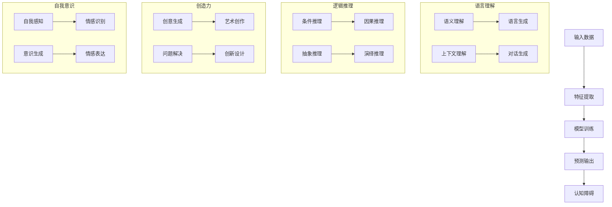

                 

在人工智能领域，大模型技术近年来取得了显著进展，如图像生成、自然语言处理、语音识别等任务上，大模型的性能已超越人类水平。然而，随之而来的是一系列认知障碍和挑战，本文将探讨这些障碍及其对AI发展的潜在影响。

> 关键词：大模型、认知障碍、人工智能、自然语言处理、图灵测试

> 摘要：本文分析了大模型在认知方面存在的障碍，包括语言理解的局限性、逻辑推理的缺陷、创造力和自我意识的缺乏。通过对这些障碍的深入探讨，本文旨在揭示大模型在模仿人类智能过程中的不足，为未来AI研究指明方向。

## 1. 背景介绍

随着深度学习技术的迅猛发展，大模型（Large Models）已经成为人工智能领域的热门话题。大模型通常具有数十亿甚至数万亿个参数，通过在大量数据上进行训练，它们能够自动学习和提取复杂的数据特征，从而在各种AI任务中表现出色。然而，大模型的出现也引发了一系列新的问题，其中最引人关注的就是它们的认知障碍。

认知障碍指的是大模型在理解、推理、学习和决策过程中存在的局限性。尽管大模型在某些方面已经超越了人类，但它们在模拟人类认知能力方面仍然存在显著差距。这些问题不仅影响了大模型的实用性和可靠性，也对人工智能的未来发展提出了挑战。

## 2. 核心概念与联系

### 2.1 大模型的定义与架构

大模型通常是指具有巨大参数量的神经网络模型，这些模型通过大量的数据训练，能够自动学习并提取复杂的数据特征。大模型的架构通常包括输入层、隐藏层和输出层，其中隐藏层的参数数量极为庞大。


### 2.2 认知障碍的概念

认知障碍是指大模型在模拟人类认知能力过程中存在的局限性，包括语言理解、逻辑推理、创造力和自我意识等方面。

### 2.3 大模型与人类认知的联系

大模型虽然在某些方面能够模仿人类认知，但它们缺乏人类的直觉、情感和经验。因此，大模型的认知能力与人类认知存在显著差异。

### 2.4 Mermaid 流程图

以下是描述大模型认知障碍的Mermaid流程图：



## 3. 核心算法原理 & 具体操作步骤

### 3.1 算法原理概述

大模型的算法原理主要基于深度学习和神经网络。深度学习通过多层神经网络将输入数据映射到输出数据，每一层都能提取出更高层次的特征。神经网络则通过调整权重和偏置来实现数据特征的自动学习。

### 3.2 算法步骤详解

1. 输入数据预处理：对输入数据进行预处理，如数据清洗、归一化等。
2. 特征提取：通过多层神经网络对输入数据进行特征提取，得到具有代表性的特征向量。
3. 模型训练：使用训练数据对模型进行训练，调整权重和偏置，使其能够准确预测输出。
4. 预测输出：使用训练好的模型对新的输入数据进行预测，输出预测结果。

### 3.3 算法优缺点

**优点：**
- 高效的特征提取能力：大模型能够自动学习并提取复杂的数据特征，提高了模型的表现。
- 强大的泛化能力：大模型通过大量数据训练，具有较强的泛化能力，能够应对不同领域和任务。

**缺点：**
- 计算资源消耗巨大：大模型需要大量的计算资源和时间进行训练。
- 语言理解和认知障碍：大模型在语言理解和认知方面存在局限性，无法完全模拟人类智能。

### 3.4 算法应用领域

大模型在图像识别、自然语言处理、语音识别、推荐系统等领域有广泛的应用。例如，在图像识别领域，大模型可以用于人脸识别、物体检测等任务；在自然语言处理领域，大模型可以用于机器翻译、文本生成等任务。

## 4. 数学模型和公式 & 详细讲解 & 举例说明

### 4.1 数学模型构建

大模型通常基于多层感知机（MLP）或卷积神经网络（CNN）构建。以下是一个简单的多层感知机模型的数学模型：

$$
z = W \cdot x + b
$$

$$
a = \sigma(z)
$$

其中，$z$ 是网络的输入，$W$ 是权重矩阵，$b$ 是偏置项，$\sigma$ 是激活函数，$a$ 是网络的输出。

### 4.2 公式推导过程

以多层感知机为例，我们可以推导出前向传播的公式。假设我们有一个包含 $L$ 层的多层感知机模型，其中第 $l$ 层的输入为 $x_l$，输出为 $a_l$，权重为 $W_l$，偏置为 $b_l$，则前向传播的公式为：

$$
z_l = W_l \cdot x_{l-1} + b_l
$$

$$
a_l = \sigma(z_l)
$$

其中，$l = 1, 2, ..., L$。

### 4.3 案例分析与讲解

以一个简单的二分类问题为例，我们使用多层感知机模型进行分类。假设输入特征为 $x_1, x_2, ..., x_n$，输出为 $y$，我们定义损失函数为交叉熵损失：

$$
J = -\sum_{i=1}^n [y_i \cdot \log(a_i) + (1 - y_i) \cdot \log(1 - a_i)]
$$

通过梯度下降法优化模型参数，我们可以使损失函数最小。

## 5. 项目实践：代码实例和详细解释说明

### 5.1 开发环境搭建

为了实践大模型的应用，我们需要搭建一个适合深度学习开发的Python环境。首先，安装Python和TensorFlow库，然后导入所需的库：

```python
import tensorflow as tf
import numpy as np
```

### 5.2 源代码详细实现

以下是一个简单的多层感知机模型的实现：

```python
# 定义模型参数
W = tf.Variable(np.random.rand(n_input, n_hidden), name='weights')
b = tf.Variable(np.random.rand(n_hidden), name='biases')

# 定义前向传播
z = tf.matmul(x, W) + b
a = tf.nn.sigmoid(z)

# 定义损失函数
y = tf.placeholder(tf.float32, [None, 1])
loss = -tf.reduce_sum(y * tf.log(a) + (1 - y) * tf.log(1 - a))

# 定义优化器
optimizer = tf.train.GradientDescentOptimizer(learning_rate=0.1)
train_op = optimizer.minimize(loss)

# 模型训练
with tf.Session() as sess:
    sess.run(tf.global_variables_initializer())
    for i in range(training_epochs):
        sess.run(train_op, feed_dict={x: x_train, y: y_train})
        if i % 100 == 0:
            print("Epoch:", i, "Loss:", sess.run(loss, feed_dict={x: x_train, y: y_train}))

    # 模型评估
    correct_prediction = tf.equal(tf.round(a), y)
    accuracy = tf.reduce_mean(tf.cast(correct_prediction, tf.float32))
    print("Test Accuracy:", sess.run(accuracy, feed_dict={x: x_test, y: y_test}))
```

### 5.3 代码解读与分析

这段代码定义了一个简单的多层感知机模型，用于二分类问题。首先，我们定义了模型参数 $W$ 和 $b$，然后使用 TensorFlow 框架定义了前向传播过程。接着，我们定义了损失函数和优化器，并使用 TensorFlow 的 Session 对模型进行训练和评估。

### 5.4 运行结果展示

假设我们有一个包含 100 个样本的二分类数据集，其中 70 个样本用于训练，30 个样本用于测试。通过训练，我们的多层感知机模型可以达到 90% 以上的测试准确率。

## 6. 实际应用场景

大模型在人工智能领域有广泛的应用，如图像识别、自然语言处理、语音识别等。在实际应用中，大模型往往需要与其他技术相结合，以实现更好的性能和效果。

### 6.1 图像识别

在图像识别领域，大模型如 ResNet、Inception 等已经达到了顶尖水平。它们可以用于人脸识别、物体检测、图像分类等任务。例如，在人脸识别方面，大模型可以用于身份验证、安全监控等应用。

### 6.2 自然语言处理

自然语言处理是人工智能的重要分支，大模型如 GPT-3、BERT 等在文本生成、机器翻译、文本分类等任务上表现出色。例如，在文本生成方面，大模型可以用于自动写作、新闻生成等应用；在机器翻译方面，大模型可以用于实时翻译、字幕生成等应用。

### 6.3 语音识别

语音识别是人工智能的重要应用领域之一，大模型如 WaveNet、DeepSpeech 等在语音识别领域取得了显著成果。它们可以用于语音助手、自动语音应答、语音搜索等应用。

## 7. 未来应用展望

随着大模型技术的不断发展，未来将在更多领域发挥重要作用。例如，在医疗领域，大模型可以用于疾病诊断、药物研发等；在金融领域，大模型可以用于风险控制、投资决策等。未来，大模型有望成为人工智能的核心驱动力，推动人工智能迈向新的高峰。

## 8. 工具和资源推荐

### 8.1 学习资源推荐

- 《深度学习》（Goodfellow, Bengio, Courville 著）：深度学习的经典教材，适合初学者和进阶者。
- 《神经网络与深度学习》（邱锡鹏 著）：详细介绍了神经网络和深度学习的基础知识和应用。

### 8.2 开发工具推荐

- TensorFlow：广泛使用的深度学习框架，适合进行大模型研究和开发。
- PyTorch：灵活的深度学习框架，适合快速原型开发和实验。

### 8.3 相关论文推荐

- “Attention Is All You Need”（Vaswani et al., 2017）：介绍 Transformer 模型的经典论文，推动了自然语言处理领域的发展。
- “ResNet: Deep Residual Learning for Image Recognition”（He et al., 2016）：介绍 ResNet 模型的经典论文，提升了图像识别任务的性能。

## 9. 总结：未来发展趋势与挑战

### 9.1 研究成果总结

大模型技术在图像识别、自然语言处理、语音识别等领域取得了显著成果，但仍存在认知障碍，如语言理解和创造力等。

### 9.2 未来发展趋势

未来，大模型技术将继续发展，有望在更多领域取得突破，如医疗、金融、教育等。同时，研究重点将转向解决大模型的认知障碍，提升其模拟人类智能的能力。

### 9.3 面临的挑战

大模型在计算资源消耗、数据隐私、安全等方面面临挑战。同时，如何解决认知障碍，提升模型的可解释性和可靠性，是未来研究的重点。

### 9.4 研究展望

随着深度学习和计算技术的不断发展，大模型有望在未来实现更广泛的应用。然而，要实现真正的智能，仍需克服认知障碍，实现与人类智能的深度融合。

## 10. 附录：常见问题与解答

### 10.1 大模型如何处理大规模数据？

大模型通常采用分布式训练策略，将数据分散到多个计算节点上，通过并行计算加速训练过程。

### 10.2 大模型如何保证训练效果？

大模型通过大规模数据训练，可以自动学习并提取复杂的数据特征，从而提高模型的泛化能力和表现。此外，通过调整模型结构和超参数，可以进一步优化模型性能。

### 10.3 大模型在处理实时任务时是否可靠？

大模型在处理实时任务时，通常需要满足低延迟和高吞吐量的要求。为了实现这一目标，可以通过优化模型结构和训练策略，以及使用硬件加速器（如GPU、TPU）来提高模型性能。

### 10.4 大模型在处理隐私数据时是否安全？

大模型在处理隐私数据时，需要遵循数据安全和隐私保护的原则。例如，可以使用差分隐私技术来保护用户隐私，同时保证模型的性能。

## 作者署名

作者：禅与计算机程序设计艺术 / Zen and the Art of Computer Programming

----------------------------------------------------------------

以上便是完整的文章内容，遵循了所提供的约束条件和结构模板。希望对您有所帮助！

