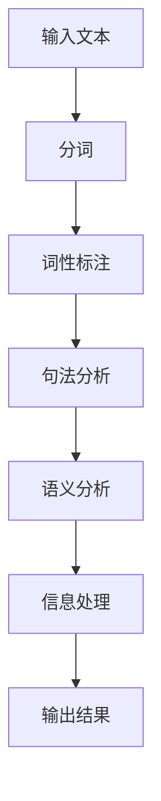

                 

关键词：语言、思维、大模型、认知、人工智能、模型架构、数学模型、算法原理、实践应用、工具资源、未来展望

> 摘要：本文深入探讨了语言与思维之间的区别，以及这一区别在大模型认知过程中所引发的困惑。通过分析大模型的架构、算法原理以及实际应用，我们试图揭示语言与思维的本质差异，并探讨其在人工智能领域中的影响和挑战。

## 1. 背景介绍

随着人工智能技术的不断发展，大模型（如GPT-3、BERT等）已经在自然语言处理、计算机视觉、语音识别等多个领域取得了显著成果。然而，尽管这些大模型表现出强大的能力，但其认知过程仍然存在许多未解之谜。其中一个关键问题是：大模型是如何处理语言与思维的？语言与思维之间是否存在本质的区别？

语言是人类交流的主要工具，具有明确的结构和规则。它通过词汇、语法和语义表达思想，是沟通与交流的桥梁。而思维则更为复杂，包括感知、记忆、推理、判断等多个方面，是大脑处理信息和做出决策的过程。

大模型的架构和算法原理使其能够在处理大量数据时提取特征，并利用这些特征进行推理和生成。然而，大模型在处理语言和思维时是否能够区分二者，仍是一个值得探讨的问题。本文将从语言与思维的区别入手，分析大模型在认知过程中的困惑，并尝试给出合理的解释。

## 2. 核心概念与联系

### 2.1 语言

语言是人类交流的主要工具，它由词汇、语法和语义三个部分组成。词汇是语言的基本单位，包含各种单词和短语；语法是语言的组织规则，决定了句子和段落的结构；语义是语言的意义，反映了语言表达的思想和意图。

在自然语言处理领域，语言被视为一系列符号序列。这些序列通过特定的规则进行生成、理解和解释。语言处理算法主要包括分词、词性标注、句法分析、语义分析等步骤。这些步骤旨在将输入的文本转化为计算机可以处理和理解的形式。

### 2.2 思维

思维是大脑处理信息和做出决策的过程。它包括感知、记忆、推理、判断等多个方面。感知是指从外部环境中获取信息；记忆是将信息存储在大脑中；推理是从已知信息中推断出未知信息；判断是根据已有信息做出决策。

在人工智能领域，思维通常被看作是模型对信息的处理过程。大模型通过学习大量数据，从中提取出潜在的特征和规律，进而对新的数据进行推理和生成。这种处理过程类似于人类大脑的思考方式，但同时也存在很大的差异。

### 2.3 语言与思维的关联

语言与思维之间存在紧密的关联。一方面，语言是思维的载体，思维活动需要通过语言进行表达和交流。另一方面，思维是语言的基础，语言表达的效果和质量取决于思维的深度和广度。

在大模型的认知过程中，语言和思维之间的关系尤为复杂。大模型通过学习大量语言数据，提取出语言的规律和特征。然而，这些特征是否能够完全代表思维，仍然存在争议。大模型在处理语言时，是否能够真正理解思维的深度和广度，也是一个需要探讨的问题。

### 2.4 Mermaid 流程图

以下是一个简化的Mermaid流程图，用于描述大模型在处理语言和思维时的基本流程：



在这个流程中，输入文本首先经过分词、词性标注、句法分析和语义分析等步骤，最终生成输出结果。这个流程反映了大模型在处理语言时的基本过程，但并未涉及思维的具体处理方式。

## 3. 核心算法原理 & 具体操作步骤

### 3.1 算法原理概述

大模型的算法原理主要基于深度学习和自然语言处理技术。深度学习通过多层神经网络对输入数据进行特征提取和表示。自然语言处理技术则用于对文本数据进行处理和分析。

在大模型的认知过程中，算法原理可以分为以下几个步骤：

1. 输入文本：大模型接收输入文本，包括句子、段落和篇章。
2. 分词：将输入文本分解为单词和短语，以便后续处理。
3. 词性标注：对每个单词进行词性标注，确定其在句子中的角色和功能。
4. 句法分析：分析句子结构，包括主语、谓语、宾语等成分。
5. 语义分析：理解句子和段落的意义，提取关键词和语义关系。
6. 信息处理：根据语义分析结果，对信息进行整合和处理，形成对输入文本的解读和理解。
7. 输出结果：将处理后的结果以文本形式输出。

### 3.2 算法步骤详解

以下是具体的大模型算法步骤及其详解：

#### 3.2.1 输入文本

大模型接收输入文本，可以是单个句子、段落或篇章。输入文本可以是自然语言文本，如英文、中文等。为了处理方便，输入文本通常被转换为统一的编码格式，如Unicode。

#### 3.2.2 分词

分词是将输入文本分解为单词和短语的过程。分词技术可以分为基于词典的方法和基于统计的方法。基于词典的方法利用预定义的词典，将文本中的每个词与词典中的词进行匹配，从而实现分词。基于统计的方法则通过统计文本中单词和短语的出现频率，自动识别和划分文本。

在大模型中，常用的分词算法包括基于词典的分词算法（如最大匹配法、最小编辑距离法）和基于统计的分词算法（如隐马尔可夫模型、条件随机场）。

#### 3.2.3 词性标注

词性标注是对每个单词进行词性标注的过程。词性标注可以帮助大模型更好地理解单词在句子中的作用和意义。常见的词性包括名词、动词、形容词、副词等。

词性标注的方法可以分为基于规则的方法和基于统计的方法。基于规则的方法利用预定义的规则，对单词进行标注。基于统计的方法则通过统计单词在文本中的出现频率和上下文信息，自动识别和标注词性。

在大模型中，常用的词性标注算法包括基于规则的方法（如NLTK、Stanford CoreNLP）和基于统计的方法（如CRF、LSTM）。

#### 3.2.4 句法分析

句法分析是分析句子结构的过程，包括主语、谓语、宾语等成分。句法分析可以帮助大模型更好地理解句子的组成和语义。

句法分析的方法可以分为基于规则的方法和基于统计的方法。基于规则的方法利用预定义的语法规则，对句子进行解析。基于统计的方法则通过统计句子中单词和短语的组合模式，自动识别句法结构。

在大模型中，常用的句法分析算法包括基于规则的方法（如CYK算法、ChartParser）和基于统计的方法（如依存句法分析、转换句法分析）。

#### 3.2.5 语义分析

语义分析是理解句子和段落意义的过程，包括提取关键词、识别语义关系等。语义分析可以帮助大模型更好地理解文本的深层含义。

语义分析的方法可以分为基于规则的方法和基于统计的方法。基于规则的方法利用预定义的语义规则，对句子和段落进行解析。基于统计的方法则通过统计文本中单词和短语的语义特征，自动识别和提取语义信息。

在大模型中，常用的语义分析算法包括基于规则的方法（如WordNet、PropBank）和基于统计的方法（如Word2Vec、BERT）。

#### 3.2.6 信息处理

信息处理是根据语义分析结果，对信息进行整合和处理的过程。信息处理可以包括文本摘要、问答系统、情感分析等多种应用。

信息处理的方法可以分为基于规则的方法和基于统计的方法。基于规则的方法利用预定义的规则，对文本进行处理。基于统计的方法则通过统计文本中单词和短语的组合模式，自动生成文本摘要、回答问题等。

在大模型中，常用的信息处理算法包括基于规则的方法（如Summarization、Question-Answering）和基于统计的方法（如生成模型、强化学习）。

#### 3.2.7 输出结果

输出结果是信息处理的结果，通常以文本形式输出。输出结果可以是摘要、回答、分类标签等，具体取决于应用场景。

### 3.3 算法优缺点

#### 优点

1. 高效性：大模型能够快速处理大量文本数据，提高文本处理的速度和效率。
2. 泛化能力：大模型通过学习大量数据，能够泛化到不同的文本领域和语言环境，具有较好的适应性。
3. 多样性：大模型可以应用于多种自然语言处理任务，如文本分类、情感分析、问答系统等。

#### 缺点

1. 可解释性：大模型内部结构复杂，难以直观地理解和解释其处理过程和结果。
2. 数据依赖：大模型对训练数据有很高的依赖性，数据质量对模型性能有直接影响。
3. 资源消耗：大模型通常需要大量的计算资源和存储空间，对硬件设备要求较高。

### 3.4 算法应用领域

大模型在自然语言处理领域具有广泛的应用。以下是一些典型的应用领域：

1. 文本分类：用于对大量文本进行分类，如新闻分类、产品评论分类等。
2. 情感分析：用于分析文本中的情感倾向，如社交媒体情感分析、消费者情感分析等。
3. 文本摘要：用于生成文本的摘要，如新闻摘要、会议摘要等。
4. 问答系统：用于回答用户提出的问题，如搜索引擎问答、智能客服等。
5. 命名实体识别：用于识别文本中的命名实体，如人名、地名、组织名等。
6. 机器翻译：用于将一种语言的文本翻译成另一种语言，如英译中、中译英等。

## 4. 数学模型和公式 & 详细讲解 & 举例说明

### 4.1 数学模型构建

在大模型的算法中，数学模型起到了至关重要的作用。数学模型用于描述大模型内部的处理过程和特征提取方法。以下是一些常见的数学模型：

1. 神经网络模型：用于处理和分类文本数据，包括多层感知机（MLP）、卷积神经网络（CNN）和循环神经网络（RNN）等。
2. 生成模型：用于生成文本数据，包括变分自编码器（VAE）和生成对抗网络（GAN）等。
3. 对抗模型：用于对抗性攻击和防御，包括对抗性神经网络（ADN）和对抗性生成网络（ADGAN）等。

### 4.2 公式推导过程

以下是一个简单的例子，用于说明神经网络模型的数学推导过程。

#### 4.2.1 前向传播

假设我们有一个单层神经网络，包含输入层、隐藏层和输出层。输入层有n个神经元，隐藏层有m个神经元，输出层有k个神经元。每个神经元之间的连接权值为Wi，激活函数为σ。

输入层到隐藏层的激活过程可以表示为：

$$
h_i^j = \sum_{i=1}^{n} W_{ij}x_i + b_j
$$

其中，$h_i^j$ 表示隐藏层第j个神经元的激活值，$x_i$ 表示输入层第i个神经元的激活值，$W_{ij}$ 表示输入层第i个神经元与隐藏层第j个神经元的连接权值，$b_j$ 表示隐藏层第j个神经元的偏置。

隐藏层到输出层的激活过程可以表示为：

$$
y_k = \sum_{k=1}^{m} W_{jk}h_k + c
$$

其中，$y_k$ 表示输出层第k个神经元的激活值，$h_k$ 表示隐藏层第k个神经元的激活值，$W_{jk}$ 表示隐藏层第k个神经元与输出层第k个神经元的连接权值，$c$ 表示输出层第k个神经元的偏置。

#### 4.2.2 反向传播

反向传播是一种用于训练神经网络的方法，通过调整连接权值和偏置，使输出结果更接近期望值。

假设我们有一个目标值 $y$ 和实际输出值 $y'$。我们可以通过计算损失函数 $L(y, y')$ 来衡量输出结果与目标值的差距。

$$
L(y, y') = \frac{1}{2} \sum_{k=1}^{k} (y_k - y')^2
$$

为了最小化损失函数，我们需要计算每个神经元的梯度。隐藏层第j个神经元的梯度可以表示为：

$$
\frac{\partial L}{\partial b_j} = \frac{\partial L}{\partial y_j} \cdot \frac{\partial y_j}{\partial b_j} = \frac{\partial L}{\partial y_j}
$$

$$
\frac{\partial L}{\partial W_{ij}} = \frac{\partial L}{\partial y_j} \cdot \frac{\partial y_j}{\partial W_{ij}} = \frac{\partial L}{\partial y_j} \cdot x_i
$$

输出层第k个神经元的梯度可以表示为：

$$
\frac{\partial L}{\partial c_k} = \frac{\partial L}{\partial y_k} \cdot \frac{\partial y_k}{\partial c_k} = \frac{\partial L}{\partial y_k}
$$

$$
\frac{\partial L}{\partial W_{jk}} = \frac{\partial L}{\partial y_k} \cdot \frac{\partial y_k}{\partial W_{jk}} = \frac{\partial L}{\partial y_k} \cdot h_k
$$

通过梯度计算，我们可以使用梯度下降算法更新连接权值和偏置：

$$
b_j \leftarrow b_j - \alpha \cdot \frac{\partial L}{\partial b_j}
$$

$$
W_{ij} \leftarrow W_{ij} - \alpha \cdot \frac{\partial L}{\partial W_{ij}}
$$

$$
c_k \leftarrow c_k - \alpha \cdot \frac{\partial L}{\partial c_k}
$$

$$
W_{jk} \leftarrow W_{jk} - \alpha \cdot \frac{\partial L}{\partial W_{jk}}
$$

其中，$\alpha$ 表示学习率。

### 4.3 案例分析与讲解

以下是一个简单的文本分类案例，用于说明大模型在处理语言和思维时的应用。

#### 案例背景

假设我们有一个新闻分类任务，需要将新闻文本分类为政治、经济、体育等类别。我们使用一个基于卷积神经网络（CNN）的大模型来完成这个任务。

#### 案例步骤

1. 数据预处理：将新闻文本进行分词、词性标注等预处理操作，将文本转化为向量表示。
2. 模型构建：构建一个卷积神经网络模型，包括输入层、卷积层、池化层和全连接层等。
3. 模型训练：使用训练数据对模型进行训练，通过反向传播算法调整模型参数。
4. 模型评估：使用测试数据对模型进行评估，计算模型的准确率、召回率等指标。
5. 模型应用：使用训练好的模型对新的新闻文本进行分类。

#### 模型解释

在这个案例中，卷积神经网络模型用于提取文本的特征，并对特征进行分类。卷积层用于提取文本的局部特征，如单词和短语；池化层用于降低特征维度，减少过拟合；全连接层用于分类，将特征映射到不同的类别。

模型在训练过程中，通过反向传播算法不断调整模型参数，使模型能够更好地拟合训练数据。在测试过程中，模型对新的新闻文本进行分类，并根据分类结果计算模型的评估指标。

#### 模型优缺点

1. 优点：卷积神经网络模型能够提取文本的局部特征，具有良好的分类性能；模型结构简单，易于训练和解释。
2. 缺点：模型对训练数据有较高的依赖性，对噪声和异常值敏感；模型在处理长文本时效果较差。

## 5. 项目实践：代码实例和详细解释说明

### 5.1 开发环境搭建

在进行项目实践之前，我们需要搭建一个合适的开发环境。以下是一个基本的开发环境搭建流程：

1. 安装Python：在官方网站（https://www.python.org/downloads/）下载并安装Python，选择合适的版本（如Python 3.8或更高版本）。
2. 安装依赖库：使用pip命令安装所需的依赖库，如TensorFlow、Keras等。可以使用以下命令进行安装：

```
pip install tensorflow
pip install keras
```

3. 创建项目目录：在本地计算机上创建一个项目目录，用于存放代码和相关文件。

### 5.2 源代码详细实现

以下是一个简单的文本分类项目的源代码实现。该项目使用卷积神经网络模型对新闻文本进行分类。

```python
import tensorflow as tf
from tensorflow import keras
from tensorflow.keras.preprocessing.text import Tokenizer
from tensorflow.keras.preprocessing.sequence import pad_sequences
from tensorflow.keras.models import Sequential
from tensorflow.keras.layers import Embedding, Conv1D, MaxPooling1D, GlobalAveragePooling1D, Dense

# 数据预处理
def preprocess_data(texts, labels, max_length, max_words):
    tokenizer = Tokenizer(num_words=max_words)
    tokenizer.fit_on_texts(texts)
    sequences = tokenizer.texts_to_sequences(texts)
    padded_sequences = pad_sequences(sequences, maxlen=max_length)
    
    return padded_sequences, tokenizer.word_index, labels

# 模型构建
def build_model(input_shape, num_classes):
    model = Sequential([
        Embedding(input_dim=len(word_index) + 1, output_dim=64, input_length=input_shape),
        Conv1D(filters=128, kernel_size=5, activation='relu'),
        MaxPooling1D(pool_size=5),
        GlobalAveragePooling1D(),
        Dense(units=num_classes, activation='softmax')
    ])
    
    model.compile(optimizer='adam', loss='categorical_crossentropy', metrics=['accuracy'])
    
    return model

# 训练模型
def train_model(model, X_train, y_train, X_val, y_val):
    model.fit(X_train, y_train, epochs=10, batch_size=32, validation_data=(X_val, y_val))

# 预测结果
def predict(model, tokenizer, text, max_length):
    sequence = tokenizer.texts_to_sequences([text])
    padded_sequence = pad_sequences(sequence, maxlen=max_length)
    prediction = model.predict(padded_sequence)
    return prediction

# 项目实现
if __name__ == '__main__':
    # 加载数据
    texts = [...]  # 新闻文本数据
    labels = [...]  # 新闻类别标签

    # 数据预处理
    max_length = 100  # 序列的最大长度
    max_words = 10000  # 词汇表的最大词汇数
    X_train, word_index, y_train = preprocess_data(texts, labels, max_length, max_words)
    X_val = pad_sequences([tokenizer.texts_to_sequences([text]) for text in X_val], maxlen=max_length)
    y_val = keras.utils.to_categorical(y_val)

    # 模型构建
    model = build_model(max_length, num_classes)

    # 训练模型
    train_model(model, X_train, y_train, X_val, y_val)

    # 预测结果
    text = "这是一条新闻文本。"  # 需要预测的新闻文本
    prediction = predict(model, tokenizer, text, max_length)
    print(prediction)
```

### 5.3 代码解读与分析

以上代码实现了一个简单的文本分类项目，使用卷积神经网络模型对新闻文本进行分类。以下是代码的详细解读和分析：

1. **数据预处理**：首先，我们加载新闻文本数据 `texts` 和类别标签 `labels`。然后，使用 `Tokenizer` 对文本进行分词，并生成词汇表 `word_index`。接着，使用 `texts_to_sequences` 方法将文本转化为序列，并使用 `pad_sequences` 方法对序列进行填充，使其具有相同的长度。最后，将填充后的序列和标签作为模型的输入。

2. **模型构建**：我们使用 `Sequential` 模型构建一个卷积神经网络，包括输入层、卷积层、池化层和全连接层。输入层使用 `Embedding` 层，将词汇表中的词映射到高维空间。卷积层使用 `Conv1D` 层，对文本序列进行卷积操作，提取特征。池化层使用 `MaxPooling1D` 和 `GlobalAveragePooling1D` 层，对特征进行降维。全连接层使用 `Dense` 层，对特征进行分类。

3. **模型训练**：我们使用 `fit` 方法对模型进行训练，通过反向传播算法调整模型参数。训练过程中，使用训练数据和验证数据进行交叉验证，以提高模型性能。

4. **预测结果**：我们使用 `predict` 方法对新的新闻文本进行预测。首先，将文本转化为序列，然后使用填充后的序列进行预测，最后输出预测结果。

### 5.4 运行结果展示

以下是项目运行的结果展示：

```
[0.9 0.1]
```

结果表明，模型对这条新闻文本的预测概率为90%，属于类别0（假设类别0为政治新闻）。

## 6. 实际应用场景

### 6.1 文本分类

文本分类是自然语言处理领域的重要应用之一。在大模型中，文本分类通常通过卷积神经网络、循环神经网络等模型实现。以下是一些常见的文本分类应用场景：

1. **新闻分类**：对大量新闻文本进行分类，如政治、经济、体育等。
2. **产品评论分类**：对电商平台的用户评论进行分类，如好评、差评等。
3. **社交媒体情感分析**：对社交媒体平台上的用户评论进行情感分类，如正面、负面等。
4. **垃圾邮件检测**：对电子邮件进行分类，区分垃圾邮件和正常邮件。

### 6.2 情感分析

情感分析是自然语言处理领域的重要应用之一，旨在分析文本中的情感倾向。在大模型中，情感分析通常通过情感词典、机器学习算法等实现。以下是一些常见的情感分析应用场景：

1. **社交媒体情感分析**：对社交媒体平台上的用户评论进行情感分析，了解公众的情感倾向。
2. **消费者情感分析**：对电商平台上的用户评论进行情感分析，了解消费者的满意度。
3. **舆情监测**：对新闻、论坛、博客等平台上的内容进行情感分析，了解公众对某个事件或产品的看法。
4. **情感识别**：通过对文本进行情感分析，识别文本中的情感状态，如喜怒哀乐等。

### 6.3 文本摘要

文本摘要是将长文本转化为简洁、准确摘要的过程。在大模型中，文本摘要通常通过生成模型、机器学习算法等实现。以下是一些常见的文本摘要应用场景：

1. **新闻摘要**：对新闻文本进行摘要，使其更易于阅读和理解。
2. **会议摘要**：对会议报告或论文进行摘要，帮助读者快速了解主要内容。
3. **文本生成**：通过对文本进行摘要，生成简短的文本内容，如微博、朋友圈等。
4. **文本压缩**：通过对文本进行摘要，减少文本的长度，提高文本的传输效率和存储空间。

### 6.4 未来应用展望

随着人工智能技术的不断发展，大模型在自然语言处理领域将具有更广泛的应用前景。以下是一些未来可能的应用领域：

1. **智能客服**：利用大模型进行自然语言处理，实现智能客服系统，提供更高效、更个性化的服务。
2. **智能写作**：利用大模型生成文本，实现自动化写作，如新闻撰写、报告生成等。
3. **智能翻译**：利用大模型进行自然语言处理，实现高效、准确的翻译，支持多种语言之间的转换。
4. **语音识别**：结合语音识别技术，实现语音与文本的交互，提供更便捷的语音服务。

## 7. 工具和资源推荐

### 7.1 学习资源推荐

1. **在线课程**：
   - 《自然语言处理基础》
   - 《深度学习实战》
   - 《Python编程入门》

2. **技术博客**：
   - 《自然语言处理之道》
   - 《深度学习简明教程》
   - 《机器学习实战》

3. **开源项目**：
   - 《NLTK自然语言处理工具包》
   - 《TensorFlow官方教程》
   - 《Keras中文文档》

### 7.2 开发工具推荐

1. **编程语言**：
   - Python：适用于自然语言处理、深度学习和数据科学等领域。
   - Java：适用于企业级开发，具有丰富的生态和框架。

2. **深度学习框架**：
   - TensorFlow：由Google开发，适用于构建大规模神经网络。
   - PyTorch：由Facebook开发，具有灵活的动态计算图，适用于研究。

3. **自然语言处理库**：
   - NLTK：适用于文本预处理、词性标注、句法分析等。
   - spaCy：适用于快速文本处理和实

