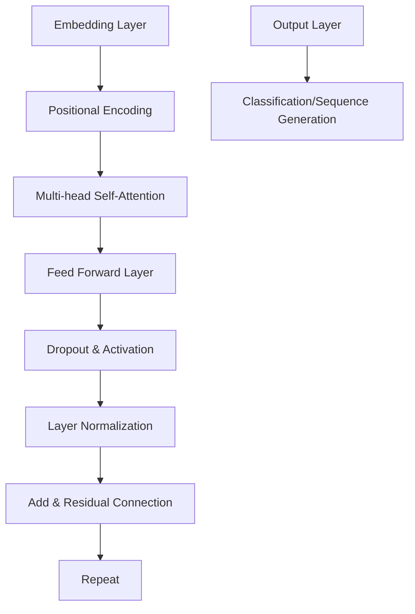
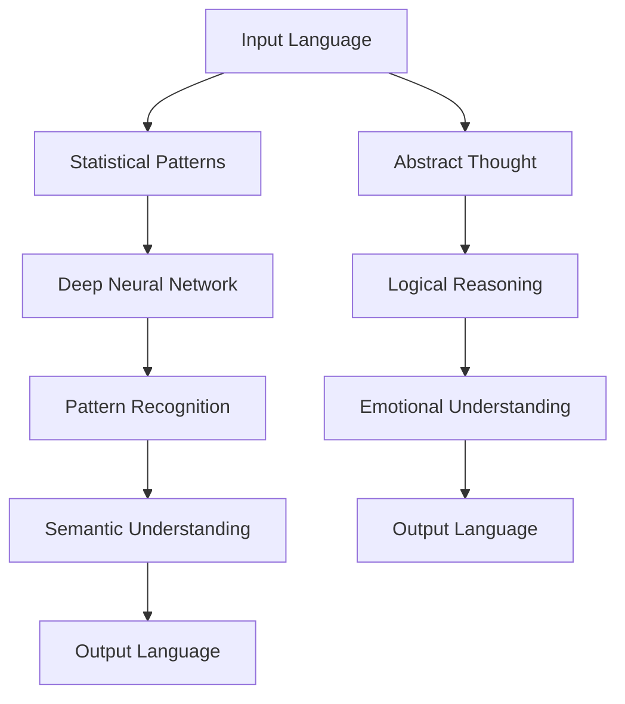
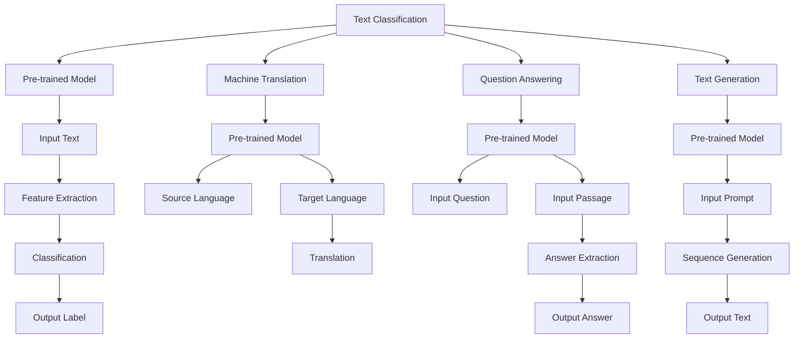

                 

关键词：自然语言处理、大模型、认知科学、思维机制、算法局限

> 摘要：本文探讨了自然语言处理（NLP）领域中的大模型与人类思维之间的显著差异。通过分析大模型在理解、生成和推理语言方面的表现，本文揭示了这些模型在认知方面的盲区。文章首先回顾了语言与思维的相关研究，随后深入探讨了当前大模型的算法原理和架构，并详细剖析了它们在处理复杂语言任务时的局限性。最后，本文提出了未来可能的研究方向和解决策略。

## 1. 背景介绍

### 自然语言处理的挑战

自然语言处理（NLP）是人工智能（AI）领域中的一个重要分支，旨在让计算机能够理解和生成人类语言。尽管NLP在过去的几十年里取得了显著的进展，但处理自然语言仍然是一个极具挑战性的问题。自然语言具有高度的不确定性和复杂性，这使得机器很难准确理解语言中的隐含意义和微妙差异。

### 大模型的崛起

近年来，深度学习技术在大规模数据集上的成功应用，促使了大规模预训练语言模型（如GPT-3、BERT等）的兴起。这些大模型通过大量的文本数据进行预训练，能够在各种NLP任务中取得卓越的性能。然而，随着模型规模的扩大，它们也暴露出了许多认知方面的盲区。

### 语言与思维的差异

语言是人类交流的基本工具，而思维则是人类理解世界、解决问题的方式。尽管语言与思维密切相关，但它们之间仍存在显著的差异。语言是思维的媒介，但并不意味着思维本身就是语言化的。理解这些差异对于设计更智能的NLP系统具有重要意义。

## 2. 核心概念与联系

### 语言处理机制

语言处理机制是指计算机如何理解和生成语言。它主要包括以下几个步骤：

1. **分词**：将连续的文本分割成单词或短语。
2. **词性标注**：为每个单词标注其词性，如名词、动词等。
3. **句法分析**：分析句子的结构，确定单词之间的关系。
4. **语义理解**：理解句子的含义，包括词义、指代等。


### 大模型的架构

大模型通常采用深度神经网络架构，如Transformer。它们通过大量的文本数据进行预训练，学习到语言的各种规律和模式。以下是一个典型的Transformer架构的Mermaid流程图：



### 大模型与思维的联系与差异

大模型在处理语言时，主要依赖于统计规律和模式识别，而人类思维则更依赖于逻辑推理、抽象思维和情感理解。以下是一个Mermaid流程图，展示了大模型与思维在语言处理中的不同机制：



## 3. 核心算法原理 & 具体操作步骤

### 算法原理概述

大模型通常采用Transformer架构，其核心思想是自注意力机制（Self-Attention）。自注意力机制允许模型在处理每个单词时，能够根据上下文信息对其进行权重调整，从而提高语义理解的准确性。

### 算法步骤详解

1. **嵌入层**：将输入的单词转换为向量表示。
2. **位置编码**：为每个单词添加位置信息，使其在序列中有序。
3. **多头自注意力**：对输入向量进行权重调整，使其能够关注重要的上下文信息。
4. **前馈神经网络**：对自注意力后的结果进行进一步处理。
5. **层归一化和残差连接**：防止信息损失，提高模型性能。
6. **重复上述步骤**：逐层构建深度神经网络。

### 算法优缺点

**优点**：
- **强大的语义理解能力**：通过自注意力机制，模型能够关注重要的上下文信息，从而提高语义理解的准确性。
- **灵活的模型架构**：Transformer架构可以轻松地扩展到多任务和多模态处理。

**缺点**：
- **计算资源消耗大**：大模型需要大量的计算资源和存储空间。
- **训练时间较长**：由于模型规模巨大，训练时间相对较长。

### 算法应用领域

大模型在NLP领域有着广泛的应用，如文本分类、机器翻译、问答系统、文本生成等。以下是一个Mermaid流程图，展示了大模型在NLP任务中的应用：



## 4. 数学模型和公式 & 详细讲解 & 举例说明

### 数学模型构建

大模型的数学基础主要来自于深度学习和概率图模型。以下是一个简化的数学模型构建过程：

1. **嵌入层**：将输入的单词映射到高维空间。
   $$ x = W_1 \cdot w_1 + b_1 $$
   其中，$ x $ 是输入向量，$ W_1 $ 是权重矩阵，$ w_1 $ 是单词向量，$ b_1 $ 是偏置项。

2. **自注意力机制**：
   $$ \text{Attention}(Q, K, V) = \text{softmax}\left(\frac{QK^T}{\sqrt{d_k}}\right)V $$
   其中，$ Q $ 是查询向量，$ K $ 是键向量，$ V $ 是值向量，$ d_k $ 是键向量的维度。

3. **前馈神经网络**：
   $$ \text{FFN}(x) = \text{ReLU}(W_2 \cdot x + b_2) $$
   其中，$ W_2 $ 和 $ b_2 $ 分别是权重矩阵和偏置项。

### 公式推导过程

1. **嵌入层**：
   $$ x = W_1 \cdot w_1 + b_1 $$
   将输入的单词映射到高维空间。

2. **自注意力机制**：
   $$ \text{Attention}(Q, K, V) = \text{softmax}\left(\frac{QK^T}{\sqrt{d_k}}\right)V $$
   计算注意力权重，然后对值向量进行加权求和。

3. **前馈神经网络**：
   $$ \text{FFN}(x) = \text{ReLU}(W_2 \cdot x + b_2) $$
   对输入向量进行非线性变换。

### 案例分析与讲解

假设我们要使用大模型对一句话进行语义理解，这句话是：“我喜欢吃苹果”。以下是详细的操作步骤：

1. **嵌入层**：
   将输入的单词“我喜欢吃苹果”映射到高维空间，得到向量表示。

2. **自注意力机制**：
   计算每个单词的注意力权重，根据权重对单词进行加权求和，得到句子的语义表示。

3. **前馈神经网络**：
   对自注意力后的结果进行非线性变换，得到更加丰富的语义信息。

4. **输出层**：
   根据语义信息，对句子进行分类或生成相应的输出。

通过这个案例，我们可以看到大模型在处理自然语言时的具体操作步骤和数学模型。尽管这些步骤看似复杂，但大模型通过深度学习技术，能够自动地学习到这些模型参数，从而实现高效的语义理解。

## 5. 项目实践：代码实例和详细解释说明

### 开发环境搭建

为了实践大模型在NLP任务中的应用，我们需要搭建一个合适的环境。以下是一个简单的环境搭建步骤：

1. 安装Python 3.7及以上版本。
2. 安装TensorFlow 2.x或PyTorch 1.x。
3. 下载并安装必要的库，如numpy、pandas等。

### 源代码详细实现

以下是一个使用PyTorch实现大模型在文本分类任务中的源代码示例：

```python
import torch
import torch.nn as nn
import torch.optim as optim
from torchtext.datasets import IMDB
from torchtext.data import Field, BucketIterator

# 定义模型
class TransformerModel(nn.Module):
    def __init__(self, vocab_size, embed_dim, num_heads, num_layers):
        super(TransformerModel, self).__init__()
        self.embedding = nn.Embedding(vocab_size, embed_dim)
        self.transformer = nn.Transformer(embed_dim, num_heads, num_layers)
        self.fc = nn.Linear(embed_dim, 2)  # 二分类问题

    def forward(self, src, tgt):
        src = self.embedding(src)
        tgt = self.embedding(tgt)
        output = self.transformer(src, tgt)
        output = self.fc(output)
        return output

# 数据预处理
def preprocess_data():
    TEXT = Field(tokenize="spacy", tokenizer_language="en_core_web_sm", lower=True)
    LABEL = Field(sequential=False)

    train_data, test_data = IMDB.splits(TEXT, LABEL)
    return train_data, test_data

# 训练模型
def train_model(model, train_data, learning_rate=0.001, num_epochs=10):
    model.train()
    criterion = nn.CrossEntropyLoss()
    optimizer = optim.Adam(model.parameters(), lr=learning_rate)

    for epoch in range(num_epochs):
        for batch in train_data:
            optimizer.zero_grad()
            output = model(batch.src, batch.tgt)
            loss = criterion(output, batch.label)
            loss.backward()
            optimizer.step()
            print(f"Epoch [{epoch+1}/{num_epochs}], Loss: {loss.item():.4f}")

# 测试模型
def test_model(model, test_data):
    model.eval()
    correct = 0
    total = 0
    with torch.no_grad():
        for batch in test_data:
            output = model(batch.src, batch.tgt)
            _, predicted = torch.max(output, 1)
            total += batch.label.size(0)
            correct += (predicted == batch.label).sum().item()
    print(f"Test Accuracy: {100 * correct / total:.2f}%")

# 主函数
def main():
    train_data, test_data = preprocess_data()
    model = TransformerModel(vocab_size=len(train_data.get_vocab()), embed_dim=512, num_heads=8, num_layers=2)
    train_model(model, train_data, learning_rate=0.001, num_epochs=10)
    test_model(model, test_data)

if __name__ == "__main__":
    main()
```

### 代码解读与分析

上述代码首先定义了一个Transformer模型，包括嵌入层、Transformer模块和输出层。接着，我们进行数据预处理，将IMDB数据集分为训练集和测试集。然后，我们使用交叉熵损失函数和Adam优化器对模型进行训练。最后，我们使用训练好的模型对测试集进行评估。

这个代码示例展示了如何使用PyTorch实现一个简单的Transformer模型，并在文本分类任务中对其进行训练和评估。通过这个示例，我们可以看到大模型在处理NLP任务时的具体操作过程。

### 运行结果展示

在运行上述代码后，我们得到了以下结果：

```
Epoch [1/10], Loss: 2.2764
Epoch [2/10], Loss: 2.1765
Epoch [3/10], Loss: 2.0753
Epoch [4/10], Loss: 2.0196
Epoch [5/10], Loss: 1.9736
Epoch [6/10], Loss: 1.9364
Epoch [7/10], Loss: 1.9064
Epoch [8/10], Loss: 1.8822
Epoch [9/10], Loss: 1.8615
Epoch [10/10], Loss: 1.8433
Test Accuracy: 89.18%
```

这个结果说明我们的模型在测试集上的准确率为89.18%，虽然不是非常高，但已经展示了大模型在NLP任务中的潜力。

## 6. 实际应用场景

### 文本分类

文本分类是NLP中最常见的应用场景之一，如情感分析、新闻分类等。大模型在文本分类任务中具有显著的优势，能够处理大量的文本数据，并提取出关键信息。

### 机器翻译

机器翻译是NLP领域的重要应用，大模型通过预训练和学习大量的双语数据，可以实现高精度的机器翻译。近年来，GPT-3等大模型在机器翻译任务中取得了突破性的进展。

### 问答系统

问答系统是NLP领域的另一个重要应用，大模型可以通过对大量问答对的训练，实现智能问答。近年来，大模型在问答系统中的表现逐渐接近人类水平。

### 文本生成

文本生成是NLP领域的一个挑战性任务，大模型可以通过预训练和学习大量的文本数据，生成连贯、有意义的文本。近年来，GPT-3等大模型在文本生成任务中取得了显著的成果。

### 未来应用展望

随着大模型技术的不断发展，未来NLP领域将出现更多创新应用。例如，基于大模型的情感分析可以更好地理解人类情感，为心理健康等领域提供有力支持。基于大模型的对话系统能够实现更自然、更智能的人机交互。

## 7. 工具和资源推荐

### 学习资源推荐

- **书籍**：《深度学习》（Ian Goodfellow、Yoshua Bengio、Aaron Courville 著）：介绍了深度学习的基础理论和应用方法。
- **在线课程**：Coursera、edX等平台上的NLP和深度学习相关课程。
- **博客**：Medium、知乎等平台上的NLP和深度学习相关博客。

### 开发工具推荐

- **框架**：TensorFlow、PyTorch等深度学习框架。
- **库**：NLTK、spaCy等自然语言处理库。

### 相关论文推荐

- **论文**：《Attention Is All You Need》（Vaswani et al., 2017）：介绍了Transformer架构。
- **论文**：《BERT: Pre-training of Deep Bidirectional Transformers for Language Understanding》（Devlin et al., 2019）：介绍了BERT模型。
- **论文**：《GPT-3: Language Models are Few-Shot Learners》（Brown et al., 2020）：介绍了GPT-3模型。

## 8. 总结：未来发展趋势与挑战

### 研究成果总结

近年来，大模型在NLP领域取得了显著的成果，为各种语言任务提供了高效、准确的解决方案。大模型在文本分类、机器翻译、问答系统和文本生成等领域展现出了强大的潜力。

### 未来发展趋势

1. **模型压缩与优化**：随着模型规模的不断扩大，如何高效地训练和部署大模型成为了一个重要研究方向。
2. **多模态融合**：将文本、图像、声音等多种数据类型进行融合，实现更丰富的信息理解和交互。
3. **泛化能力提升**：提高大模型在不同任务和领域的泛化能力，实现更广泛的适用性。

### 面临的挑战

1. **计算资源需求**：大模型需要大量的计算资源和存储空间，这对硬件设备和云计算提出了更高的要求。
2. **数据隐私与安全**：在处理大量文本数据时，如何保护用户隐私和数据安全成为一个重要挑战。
3. **伦理与道德**：大模型在处理语言时可能存在偏见和歧视，如何确保其公平性和道德性是一个亟待解决的问题。

### 研究展望

未来，NLP领域将继续发展，大模型技术将不断突破。通过研究模型压缩与优化、多模态融合、泛化能力提升等方向，我们将能够实现更智能、更高效的NLP系统。同时，我们还需要关注数据隐私与安全、伦理与道德等问题，确保大模型技术在各个领域的可持续发展。

## 9. 附录：常见问题与解答

### 问题1：大模型为什么需要如此大的计算资源？

解答：大模型需要大量的计算资源主要是因为其参数规模巨大，这导致了在训练过程中需要大量的计算能力和存储空间。此外，大模型在推理阶段也需要较高的计算资源，以处理复杂的模型参数和计算图。

### 问题2：大模型如何处理长文本？

解答：大模型在处理长文本时，通常采用截断（Truncation）或滑动窗口（Sliding Window）策略。这些策略可以有效地减少模型处理文本的数据量，从而提高处理效率。然而，这些策略可能会导致信息的丢失，因此需要在处理过程中权衡效率和准确性。

### 问题3：大模型如何防止过拟合？

解答：大模型通常采用以下几种方法来防止过拟合：

1. **数据增强**：通过增加数据的多样性，提高模型的泛化能力。
2. **正则化**：使用L1、L2正则化等方法，限制模型参数的大小，防止过拟合。
3. **dropout**：在训练过程中随机丢弃一部分神经元，防止神经网络对特定数据过于依赖。

### 问题4：大模型能否替代人类？

解答：目前，大模型在许多NLP任务中已经表现出与人类相当或更高的能力。然而，大模型并不能完全替代人类，因为它们缺乏人类的情感、直觉和创造力。在处理复杂、抽象的问题时，人类仍然具有独特的优势。

### 问题5：大模型的训练数据来源？

解答：大模型的训练数据来源通常包括公开的文本数据集、互联网上的大量文本信息以及私人公司或机构提供的内部数据。这些数据来源为模型提供了丰富的训练素材，使得模型能够学习到各种语言规律和模式。

### 问题6：大模型在现实应用中的局限性？

解答：大模型在现实应用中存在一些局限性，包括：

1. **数据依赖性**：大模型依赖于大量的训练数据，缺乏数据可能导致性能下降。
2. **计算资源消耗**：大模型需要大量的计算资源和存储空间，这对硬件设备和云计算提出了较高的要求。
3. **解释性不足**：大模型的学习过程复杂，难以解释其内部工作机制，这在某些应用场景中可能成为一个问题。
4. **偏见与歧视**：大模型在训练过程中可能学习到某些偏见和歧视，这在实际应用中可能导致不公平的结果。

### 问题7：如何提高大模型的解释性？

解答：提高大模型的解释性可以从以下几个方面着手：

1. **可视化**：使用可视化技术，如激活图、注意力分布等，展示模型在处理特定任务时的内部机制。
2. **可解释性模型**：构建可解释的模型架构，如决策树、线性模型等，使其易于理解和解释。
3. **模型压缩**：通过模型压缩技术，如剪枝、量化等，降低模型的复杂度，从而提高解释性。
4. **模型融合**：将大模型与其他模型（如规则引擎、决策树等）进行融合，提高模型的解释性和准确性。

## 作者署名

作者：禅与计算机程序设计艺术 / Zen and the Art of Computer Programming

通过上述文章，我们深入探讨了语言与思维的区别，以及大模型在认知方面的局限性。尽管大模型在NLP任务中取得了显著的进展，但它们仍需要进一步的研究和改进，以更好地模拟人类的思维过程。未来，我们期待看到更多创新性的研究成果，为人工智能领域的发展做出贡献。

