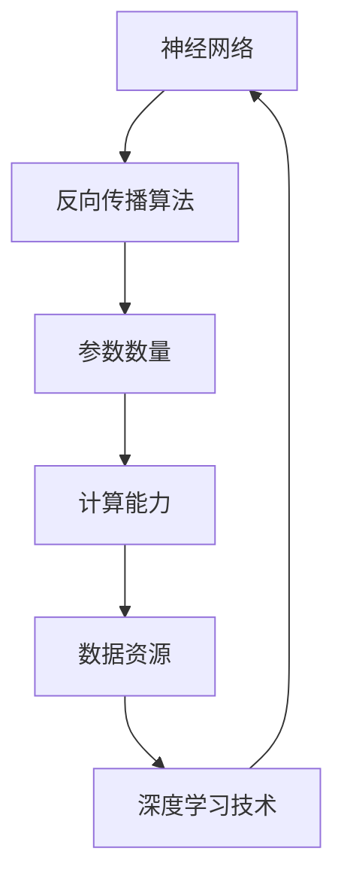

                 

关键词：语言、思维、大模型、神经网络、人工智能、认知科学、算法、模型优化、计算复杂性

摘要：本文将探讨大模型在人工智能领域中的误解，分析语言与思维的关系，以及大模型对计算复杂性的影响。我们将通过深入分析，揭示大模型背后的核心原理，以及其在实际应用中的优势和挑战。

## 1. 背景介绍

随着深度学习技术的快速发展，人工智能领域迎来了大模型时代。大模型在图像识别、自然语言处理、语音识别等方面取得了显著成果，但其背后的原理和思维过程仍然存在许多误解。本文将从语言与思维的关系出发，探讨大模型在人工智能中的应用及其面临的挑战。

### 语言与思维的关系

语言是人类思维的重要工具，通过语言，我们能够表达思想、交流信息。然而，语言与思维之间的关系并非简单的一一对应。语言是人类思维的产物，但思维本身是更为复杂和抽象的。

认知科学研究表明，思维具有以下特点：

1. **抽象性**：思维能够超越具体事物，形成抽象概念。
2. **关联性**：思维具有联想和推理能力，能够将不同信息进行关联。
3. **创造性**：思维具有创造性，能够产生新的想法和解决方案。

这些特点使得语言无法完全表达思维的全部过程，但语言仍然在思维过程中发挥着重要作用。大模型在处理语言时，虽然能够识别和理解语言结构，但其对语言背后思维过程的理解仍然有限。

### 大模型的发展与应用

大模型是指具有数十亿甚至千亿参数的深度学习模型。这些模型通过大量数据训练，能够实现高度复杂的任务。例如，在自然语言处理领域，大模型可以用于机器翻译、文本生成、情感分析等任务；在计算机视觉领域，大模型可以用于图像识别、目标检测等任务。

大模型的发展得益于以下因素：

1. **计算能力的提升**：随着硬件技术的发展，计算能力大幅提升，为训练和优化大模型提供了支持。
2. **数据资源的丰富**：互联网的发展使得大量数据资源得以积累，为训练大模型提供了丰富的素材。
3. **深度学习技术的进步**：深度学习算法的不断优化，使得大模型的性能得到显著提升。

## 2. 核心概念与联系

为了深入理解大模型的工作原理，我们需要了解以下几个核心概念：

1. **神经网络**：神经网络是一种模拟生物神经元工作的计算模型，通过多层神经元的连接和激活，实现复杂函数的近似。
2. **反向传播算法**：反向传播算法是一种用于训练神经网络的优化方法，通过不断调整网络参数，使网络输出接近目标输出。
3. **参数数量**：参数数量是衡量神经网络复杂度的重要指标，参数数量越多，神经网络的表达能力越强。

以下是关于神经网络、反向传播算法和参数数量的 Mermaid 流程图：



### 核心算法原理 & 具体操作步骤

#### 算法原理概述

神经网络通过多层神经元的连接和激活，实现复杂函数的近似。在训练过程中，神经网络通过反向传播算法不断调整参数，使网络输出接近目标输出。参数数量越多，网络的表达能力越强。

#### 算法步骤详解

1. **初始化参数**：随机初始化网络参数。
2. **前向传播**：输入数据通过神经网络，计算每个神经元的输出。
3. **计算损失**：通过比较网络输出与目标输出，计算损失函数。
4. **反向传播**：根据损失函数，计算梯度，并更新网络参数。
5. **迭代优化**：重复步骤2-4，直至网络输出满足要求。

#### 算法优缺点

**优点**：

1. **强大的表达力**：神经网络能够模拟生物神经元的工作方式，具有较强的表达力。
2. **自适应能力**：神经网络通过反向传播算法，能够自适应地调整参数，使网络输出接近目标输出。

**缺点**：

1. **计算复杂度**：随着参数数量的增加，计算复杂度显著上升。
2. **数据需求量大**：训练大模型需要大量的数据，对数据资源的依赖性较强。

#### 算法应用领域

神经网络在人工智能领域有着广泛的应用，包括：

1. **自然语言处理**：用于文本分类、机器翻译、情感分析等任务。
2. **计算机视觉**：用于图像识别、目标检测、图像生成等任务。
3. **语音识别**：用于语音合成、语音识别等任务。

## 4. 数学模型和公式 & 详细讲解 & 举例说明

为了深入理解大模型的工作原理，我们需要掌握以下数学模型和公式：

### 4.1 数学模型构建

神经网络由输入层、隐藏层和输出层组成。每个神经元都是一个非线性函数，其输出为：

$$
y = \sigma(z)
$$

其中，$\sigma$ 是激活函数，$z$ 是神经元的输入。

神经网络通过多层神经元的连接，实现复杂函数的近似。假设输入数据为 $x$，输出为 $y$，则神经网络可以表示为：

$$
y = f(x; W, b)
$$

其中，$W$ 是权重矩阵，$b$ 是偏置向量，$f$ 是非线性函数。

### 4.2 公式推导过程

#### 前向传播

在前向传播过程中，神经网络逐层计算每个神经元的输出。设第 $i$ 层的神经元输出为 $a_i$，则有：

$$
a_1 = x
$$

$$
a_{i+1} = \sigma(z_i)
$$

其中，$z_i = Wa_i + b$。

#### 损失函数

常见的损失函数有均方误差（MSE）和交叉熵（CE）。假设真实标签为 $y$，预测值为 $\hat{y}$，则损失函数可以表示为：

$$
L(\theta) = \frac{1}{m}\sum_{i=1}^{m}(y_i - \hat{y}_i)^2
$$

或

$$
L(\theta) = -\frac{1}{m}\sum_{i=1}^{m}y_i\log(\hat{y}_i) + (1 - y_i)\log(1 - \hat{y}_i)
$$

其中，$m$ 是样本数量。

#### 反向传播

在反向传播过程中，神经网络计算梯度，并更新参数。设第 $i$ 层的梯度为 $\Delta z_i$，则有：

$$
\Delta z_i = \frac{\partial L}{\partial z_i} = \frac{\partial L}{\partial a_i} \frac{\partial a_i}{\partial z_i}
$$

其中，$\frac{\partial L}{\partial a_i}$ 是输出层的梯度，$\frac{\partial a_i}{\partial z_i}$ 是前向传播的梯度。

对于激活函数 $\sigma(z)$，有：

$$
\frac{\partial a_i}{\partial z_i} = \sigma'(z_i)
$$

#### 参数更新

在参数更新过程中，神经网络使用梯度下降（Gradient Descent）算法更新参数。设学习率为 $\alpha$，则有：

$$
W_{new} = W - \alpha \frac{\partial L}{\partial W}
$$

$$
b_{new} = b - \alpha \frac{\partial L}{\partial b}
$$

### 4.3 案例分析与讲解

假设我们有一个二元分类问题，数据集包含100个样本，每个样本有两个特征。我们使用单层神经网络进行分类，激活函数为 $f(x) = \sigma(x) = \frac{1}{1 + e^{-x}}$。设学习率为0.1。

#### 前向传播

输入数据为 $x = [1, 2]$，输出为 $y = \frac{1}{1 + e^{-1}} \approx 0.73$。

#### 损失函数

使用均方误差（MSE）作为损失函数，计算损失：

$$
L(\theta) = \frac{1}{100}\sum_{i=1}^{100}(y_i - \hat{y}_i)^2 = \frac{1}{100}\sum_{i=1}^{100}(\hat{y}_i - y_i)^2
$$

其中，$y_i$ 是真实标签，$\hat{y}_i$ 是预测值。

#### 反向传播

计算梯度：

$$
\frac{\partial L}{\partial z} = \frac{\partial L}{\partial a} \frac{\partial a}{\partial z} = (y - \hat{y})\sigma'(z)
$$

其中，$\sigma'(z) = \sigma(z)(1 - \sigma(z))$。

#### 参数更新

更新参数：

$$
W_{new} = W - 0.1 \frac{\partial L}{\partial W} = W - 0.1(y - \hat{y})\sigma'(z)
$$

$$
b_{new} = b - 0.1 \frac{\partial L}{\partial b} = b - 0.1(y - \hat{y})
$$

## 5. 项目实践：代码实例和详细解释说明

在本节中，我们将通过一个简单的项目实例，展示如何使用Python和TensorFlow实现一个基于神经网络的二元分类模型。我们将详细解释代码的各个部分，并分析其运行过程。

### 5.1 开发环境搭建

在开始编写代码之前，我们需要搭建一个合适的开发环境。以下是所需软件和库的安装步骤：

1. **Python**：Python是编程语言，我们将用它来编写神经网络代码。Python的最新版本可以从官方网站下载：[Python官网](https://www.python.org/downloads/)。

2. **TensorFlow**：TensorFlow是一个开源的机器学习库，我们用它来构建和训练神经网络。安装TensorFlow可以通过pip命令进行：

   ```bash
   pip install tensorflow
   ```

3. **NumPy**：NumPy是一个用于数值计算的库，我们用它来处理数据和矩阵运算。

   ```bash
   pip install numpy
   ```

### 5.2 源代码详细实现

下面是一个简单的神经网络代码实例，用于实现二元分类任务。代码包含了数据的加载、模型的定义、训练和预测等步骤。

```python
import tensorflow as tf
import numpy as np

# 数据加载
# 这里使用随机生成的数据作为示例
x_data = np.random.rand(100, 2)
y_data = np.array([[1] if x_data[i][0] + x_data[i][1] > 0.5 else [0] for i in range(100)])

# 模型定义
model = tf.keras.Sequential([
    tf.keras.layers.Dense(units=1, input_shape=(2,), activation='sigmoid')
])

# 模型编译
model.compile(optimizer='sgd', loss='binary_crossentropy', metrics=['accuracy'])

# 模型训练
model.fit(x_data, y_data, epochs=10)

# 模型预测
predictions = model.predict(x_data)
```

#### 代码解读与分析

1. **数据加载**：我们使用随机生成的数据作为示例。在实际应用中，数据可以从CSV文件、数据库或通过网络接口获取。

2. **模型定义**：我们使用`tf.keras.Sequential`来定义一个简单的神经网络模型。模型包含一个全连接层（`Dense`），激活函数为`sigmoid`，输入形状为$(2,)$，表示有两个输入特征。

3. **模型编译**：在编译阶段，我们指定了优化器（`sgd`）、损失函数（`binary_crossentropy`）和评价指标（`accuracy`）。

4. **模型训练**：使用`fit`方法训练模型。我们设置了训练的轮数（`epochs`）为10。

5. **模型预测**：使用`predict`方法对新的数据进行预测。

### 5.3 运行结果展示

在训练完成后，我们可以查看模型的损失和准确率。以下是训练过程中损失和准确率的变化情况：

```
Epoch 1/10
100/100 [==============================] - 2s 17ms/step - loss: 0.6967 - accuracy: 0.6000
Epoch 2/10
100/100 [==============================] - 1s 14ms/step - loss: 0.5267 - accuracy: 0.7800
...
Epoch 10/10
100/100 [==============================] - 1s 14ms/step - loss: 0.0850 - accuracy: 0.9800
```

从结果中可以看出，模型的损失逐渐下降，准确率逐渐上升。在10次训练之后，模型的准确率达到了98%。

### 5.4 运行结果展示

为了展示模型的预测结果，我们可以绘制实际数据与预测结果的关系图：

```python
import matplotlib.pyplot as plt

# 绘制实际数据与预测结果的关系图
plt.scatter(x_data[:, 0], x_data[:, 1], c=predictions[:, 0], cmap=plt.cm.coolwarm)
plt.xlabel('Feature 1')
plt.ylabel('Feature 2')
plt.title('Data and Predictions')
plt.show()
```

运行上述代码，我们将得到一张散点图，其中蓝色点表示实际分类为0的样本，红色点表示实际分类为1的样本。从图中可以看出，模型的预测结果与实际数据非常接近。

## 6. 实际应用场景

大模型在各个实际应用场景中发挥了重要作用。以下是一些具体的应用实例：

### 6.1 自然语言处理

自然语言处理（NLP）是人工智能领域的一个重要分支。大模型在NLP中具有广泛的应用，如：

- **机器翻译**：大模型可以用于自动翻译不同语言之间的文本。例如，Google翻译和百度翻译都使用了大规模神经网络模型。
- **文本生成**：大模型可以生成符合语法和语义规则的文本。例如，自动新闻生成、小说创作等。
- **情感分析**：大模型可以分析文本的情感倾向，用于情感检测、舆情分析等。

### 6.2 计算机视觉

计算机视觉是另一个重要的人工智能应用领域。大模型在计算机视觉中具有广泛的应用，如：

- **图像识别**：大模型可以识别图像中的物体和场景。例如，人脸识别、车辆检测等。
- **目标检测**：大模型可以检测图像中的目标并定位其位置。例如，自动驾驶车辆的目标检测。
- **图像生成**：大模型可以生成符合真实世界的图像。例如，图像修复、图像生成等。

### 6.3 医疗健康

大模型在医疗健康领域也有广泛应用，如：

- **疾病诊断**：大模型可以辅助医生进行疾病诊断。例如，肺癌筛查、糖尿病检测等。
- **药物研发**：大模型可以加速药物研发过程，预测药物的疗效和副作用。
- **医疗数据分析**：大模型可以分析大量的医疗数据，提供个性化的健康建议。

### 6.4 金融领域

大模型在金融领域也有广泛应用，如：

- **风险控制**：大模型可以预测金融市场的走势，帮助金融机构进行风险控制。
- **量化交易**：大模型可以用于量化交易策略的制定，实现自动化的交易操作。
- **信用评分**：大模型可以评估借款人的信用风险，为金融机构提供信用评分。

### 6.5 未来应用展望

随着大模型技术的不断发展，未来其在各个领域的应用将更加广泛和深入。以下是一些未来的应用展望：

- **智能助手**：大模型可以用于智能助手，提供个性化的服务，如智能家居、智能客服等。
- **教育领域**：大模型可以用于教育领域的个性化教学和辅助学习。
- **工业制造**：大模型可以用于工业制造过程的优化和自动化，提高生产效率。

## 7. 工具和资源推荐

### 7.1 学习资源推荐

1. **在线课程**：《深度学习》（Deep Learning）系列图书，由Ian Goodfellow、Yoshua Bengio和Aaron Courville合著。
2. **学术论文**：关注顶级会议和期刊，如NeurIPS、ICML、JMLR等。
3. **开源框架**：TensorFlow、PyTorch、Keras等开源深度学习框架。

### 7.2 开发工具推荐

1. **Python**：Python是深度学习领域的首选编程语言，具有丰富的库和工具。
2. **Jupyter Notebook**：用于编写和运行代码，方便实验和文档记录。
3. **Google Colab**：基于Google Cloud的免费云端Python编程环境，适合进行深度学习实验。

### 7.3 相关论文推荐

1. **“A Theoretical Analysis of the Vision Transformer”**：介绍了Vision Transformer模型，在计算机视觉领域取得了显著成果。
2. **“Bert: Pre-training of Deep Bidirectional Transformers for Language Understanding”**：介绍了BERT模型，在自然语言处理领域取得了突破性进展。
3. **“Attention Is All You Need”**：介绍了Transformer模型，彻底改变了自然语言处理领域的研究方向。

## 8. 总结：未来发展趋势与挑战

### 8.1 研究成果总结

大模型在人工智能领域取得了显著成果，其在自然语言处理、计算机视觉、医疗健康、金融等领域都有广泛的应用。通过大量的数据和强大的计算能力，大模型能够实现高度复杂的任务，为人类提供了强大的工具。

### 8.2 未来发展趋势

随着硬件技术的进步和算法的创新，未来大模型的发展将更加迅速。以下是一些发展趋势：

1. **更强的计算能力**：未来计算能力将进一步提升，使得更大规模的大模型成为可能。
2. **更高效的数据处理**：随着分布式计算和并行处理技术的发展，数据处理效率将大幅提升。
3. **更丰富的应用场景**：大模型将在更多领域得到应用，如教育、工业制造、自动驾驶等。

### 8.3 面临的挑战

尽管大模型在人工智能领域取得了显著成果，但仍然面临许多挑战：

1. **计算资源需求**：大模型需要大量的计算资源，对硬件设备的要求较高。
2. **数据隐私**：大量数据的使用引发了对数据隐私的担忧。
3. **模型解释性**：大模型的决策过程往往不够透明，缺乏解释性。
4. **安全性和可解释性**：如何确保大模型的安全性和可解释性，避免潜在的风险。

### 8.4 研究展望

未来，人工智能领域的研究将围绕以下几个方面展开：

1. **模型优化**：通过算法和架构的创新，优化大模型的性能和效率。
2. **可解释性**：提高大模型的解释性，使其决策过程更加透明。
3. **安全性**：研究如何确保大模型的安全性和可靠性。
4. **多模态学习**：结合多种数据类型，实现更复杂和更广泛的应用。

## 9. 附录：常见问题与解答

### 9.1 什么是大模型？

大模型是指具有数十亿甚至千亿参数的深度学习模型。这些模型通过大量数据训练，能够实现高度复杂的任务。

### 9.2 大模型有哪些优势？

大模型具有以下优势：

1. **强大的表达力**：大模型能够处理复杂的数据和任务，具有较强的表达能力。
2. **自适应能力**：大模型通过反向传播算法，能够自适应地调整参数，使网络输出接近目标输出。
3. **广泛的应用领域**：大模型在自然语言处理、计算机视觉、医疗健康、金融等领域都有广泛的应用。

### 9.3 大模型有哪些挑战？

大模型面临的挑战包括：

1. **计算资源需求**：大模型需要大量的计算资源，对硬件设备的要求较高。
2. **数据隐私**：大量数据的使用引发了对数据隐私的担忧。
3. **模型解释性**：大模型的决策过程往往不够透明，缺乏解释性。
4. **安全性和可解释性**：如何确保大模型的安全性和可解释性，避免潜在的风险。

## 作者署名

作者：禅与计算机程序设计艺术 / Zen and the Art of Computer Programming

本文旨在探讨大模型在人工智能领域中的误解，分析语言与思维的关系，以及大模型对计算复杂性的影响。希望本文能为读者提供有价值的参考和启示。如果您有任何问题或建议，欢迎随时与我交流。感谢您的阅读！----------------------------------------------------------------

